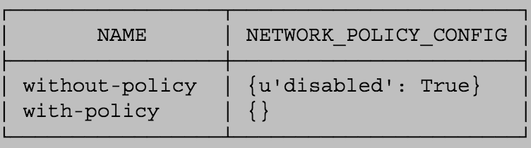

9 лучших практик по обеспечению безопасности в Kubernetes / Блог компании Флант

_**Прим. перев.**: Это уже [не первая статья](https://habr.com/ru/company/flant/blog/417905/) с общими рекомендациями по безопасности в Kubernetes, что мы переводим в своём блоге. Однако её актуальность — по меньшей мере, как напоминание о простых и важных вещах, на которые не стоит закрывать глаза из-за нехватки времени, — только подтверждается недавними событиями, упоминаемыми автором в начале материала. К слову, автором является Connor Gilbert — менеджер продуктов компании StackRox, предлагающей готовую платформу для обеспечения безопасности приложений, разворачиваемых в рамках Kubernetes-кластеров. Итак, вот что он советует читателям блога CNCF…_

_**NB**: Чтобы сделать статью более информативной, для некоторых из упоминаемых автором терминов/методов мы добавили ссылки на соответствующую документацию._

В прошлом месяце в Kubernetes, самой популярной в мире системе оркестровки контейнеров, [обнаружили](https://www.stackrox.com/post/2018/12/kubernetes-first-major-security-hole-discovered/) первую крупную уязвимость в безопасности, что ударило по экосистеме проекта. Уязвимость [CVE-2018-1002105](https://nvd.nist.gov/vuln/detail/CVE-2018-1002105) даёт возможность злоумышленникам скомпрометировать кластеры через API-сервер Kubernetes, что позволяет исполнять вредоносный код для установки malware и т.п.

Ранее в том же году некорректная конфигурация панели управления Kubernetes привела к тому, что на ресурсах Tesla [был установлен](https://arstechnica.com/information-technology/2018/02/tesla-cloud-resources-are-hacked-to-run-cryptocurrency-mining-malware/) софт для майнинга криптовалют. Тогда злоумышленники воспользовались тем, что одна из панелей Kubernetes не была защищена паролем, что позволило им получить доступ к одному из pod'ов с учётной записью для доступа к более масштабной инфраструктуре Tesla в AWS.

Организациям, что форсируют процесс внедрения контейнеров и их оркестровки, необходимо предпринимать и обязательные шаги по защите столь критичной части своей инфраструктуры. Ниже представлены девять лучших практик по безопасности в Kubernetes, созданных на основе данных от клиентов: следуйте им, чтобы защитить свою инфраструктуру лучше.

## 1\. Обновитесь до последней версии

В каждом квартальном релизе \[Kubernetes\] появляются не только исправления багов, но и новые возможности в области безопасности: чтобы воспользоваться ими, рекомендуем работать с последней стабильной версией.

Использование последнего релиза с последними же патчами будет особенно актуальным в свете недавнего обнаружения CVE-2018-1002105. Обновления и поддержка могут оказаться сложнее, чем предлагаемые в релизах новые возможности, поэтому спланируйте обновления хотя бы раз в квартал.

Значительно упростить обновления может использование провайдеров управляемых Kubernetes-решений.

## 2\. Включите управление доступом на основе ролей (RBAC)

Используйте [RBAC](https://kubernetes.io/docs/reference/access-authn-authz/rbac/) (Role-Based Access Control) для контроля над тем, кто может иметь доступ к Kubernetes API и какими правами обладать. Обычно RBAC включён по умолчанию в Kubernetes версии 1.6 и выше (или позже в случае некоторых провайдеров), но если с тех вы обновлялись и не меняли конфигурацию, стоит перепроверить свои настройки. Из-за механизма, по которому совмещается работа контроллеров авторизации в Kubernetes _(об общей последовательности операций читайте в статье «[Что происходит в Kubernetes при запуске kubectl run? Часть 1](https://habr.com/ru/company/flant/blog/342658/)» — **прим. перев.**)_, необходимо иметь включёнными и RBAC, и устаревший ABAC (Attribute-Based Access Control).

Однако мало включить RBAC — его ещё необходимо эффективно использовать. В общем случае следует избегать прав на весь кластер _(cluster-wide)_, отдавая предпочтение правам в определённых пространствах имён. Избегайте выдачи кому-либо привилегий администратора кластера даже для отладки — гораздо безопаснее выделять права только по необходимости и от случая к случаю.

Посмотреть роли кластера и просто роли можно командами `kubectl get clusterrolebinding` или `kubectl get rolebinding --all-namespaces`. А так можно быстро проверить, кому выдана роль `cluster-admin` (в данном примере она только у группы `masters`):

    $ kubectl describe clusterrolebinding cluster-admin
    Name:         cluster-admin
    Labels:       kubernetes.io/boostrapping=rbac-defaults
    Annotations:  rbac.authorization.kubernetes.io/autoupdate=true
    Role:
      Kind:  ClusterRole
      Name:  cluster-admin
    Subjects:
     Kind   Name
     ----   ----
     Group  system:masters
    Namespace
    ---------

Если приложению требуется доступ к Kubernetes API, создайте отдельные service accounts _(подробнее о них читайте в [этом материале](https://habr.com/ru/company/flant/blog/422801/) — **прим. перев.**)_ и выдавайте им минимальный набор прав, требуемых для каждого случая использования. Такой подход гораздо лучше выдачи слишком больших прав аккаунту по умолчанию в пространстве имён.

Большинству же приложений и вовсе не нужен доступ к API: для них [можно выставить](https://kubernetes.io/docs/tasks/configure-pod-container/configure-service-account/#use-the-default-service-account-to-access-the-api-server) `automountServiceAccountToken` в `false`.

## 3\. Используйте пространства имён для установки границ безопасности

Создание отдельных пространств имён важно как первый уровень изоляции компонентов. Намного проще регулировать настройки безопасности — например, сетевые политики, — когда разные виды рабочих нагрузок развёрнуты в отдельных пространствах имён.

А ваша команда эффективно использует пространства имён? Проверьте их список на наличие нестандартных (не создаваемых по умолчанию):

    $ kubectl get ns
    NAME          STATUS    AGE
    default       Active    16m
    kube-public   Active    16m
    kube-system   Active    16m

  

## 4\. Отделяйте чувствительные рабочие нагрузки

Хорошая практика для ограничения потенциальных последствий компрометации — запуск рабочих нагрузок с конфиденциальными данными на выделенном множестве машин. Такой подход снижает риск того, что к приложению с конфиденциальными данными будет обращаться менее безопасное приложение, работающее в той же исполняемой среде контейнеров или на том же хосте. Например, kubelet скомпрометированного узла обычно имеет доступ к содержимому секретов только в том случае, если они примонтированы к pod'ам, выполнение которых планируется на том же узле. Если важные секреты можно найти на множестве узлов кластера, у злоумышленника будет больше возможностей заполучить их.

Разделение можно осуществить с помощью пулов узлов — _node pools_ (в облаке или для on-premises), — а также контролирующих механизмов Kubernetes, таких как пространства имён, [taints, tolerations](https://kubernetes.io/docs/concepts/configuration/taint-and-toleration/) и другие.

## 5\. Защитите доступ к метаданным облачных сервисов

Чувствительные метаданные — например, административные учётные данные kubelet — могут быть украдены или использованы со злым умыслом для эскалации привилегий в кластере. Например, [недавняя находка](https://hackerone.com/reports/341876) в рамках bug bounty от Shopify показала в деталях, как пользователь мог превысить полномочия, получив метаданные от облачного провайдера с помощью специально сформированных данных для одного из микросервисов.

В GKE функция скрытия метаданных — [metadata concealment](https://cloud.google.com/kubernetes-engine/docs/how-to/protecting-cluster-metadata#concealment) — изменяет механизм развёртывания кластера таким образом, что позволяет избежать подобной проблемы, и мы рекомендуем воспользоваться ей, пока не реализовано постоянное решение.

Аналогичные контрмеры могут потребоваться и в других окружениях.

## 6\. Создайте и определите сетевые политики кластера

Сетевые политики — [Network Policies](https://kubernetes.io/docs/concepts/services-networking/network-policies/) — позволяют контролировать доступ к сети в контейнеризированные приложения и из них. Чтобы воспользоваться ими, необходимо иметь сетевого провайдера с поддержкой такого ресурса; в случае провайдеров управляемых Kubernetes-решений вроде Google Kubernetes Engine (GKE) поддержку потребуется включить. (Включение сетевых политик для существующих кластеров в GKE потребует короткого rolling-обновления.)

Как только всё готово, начните с простых сетевых политик по умолчанию — скажем, блокирования (по умолчанию) трафика из других пространств имён.

В случае использования Google Container Engine так можно проверить, включена ли поддержка политик в работающих кластерах:

    $ gcloud container clusters list \ 
       --format='table[box] (name,addonsConfig.networkPolicyConfig)'

## 7\. Задайте Pod Security Policy для кластера

Политика безопасности pod'ов — [Pod Security Policy](https://kubernetes.io/docs/concepts/policy/pod-security-policy/) — устанавливает значения по умолчанию, используемые для запуска рабочих нагрузок в кластере. Подумайте над определением политики и включением [admission controller'а](https://kubernetes.io/docs/reference/access-authn-authz/admission-controllers/) Pod Security Policy: инструкции по этим шагам варьируются в зависимости от облачного провайдера или используемой модели деплоя.

Для начала можно потребовать [отключения](https://kubernetes.io/docs/concepts/policy/pod-security-policy/#capabilities) в контейнерах `NET_RAW` [capability](https://linux.die.net/man/7/capabilities), чтобы защититься от некоторых видов spoofing-атак.

## 8\. Поработайте над безопасностью узлов

Для улучшения безопасности узлов можно выполнить следующие шаги:

1.  **Убедитесь, что хост безопасно и корректно настроен**. Один из способов — [CIS Benchmarks](https://www.cisecurity.org/cis-benchmarks/); у многих продуктов есть autochecker, который автоматически проверяет систему на соответствие этим стандартам.
2.  **Контролируйте сетевую доступность важных портов**. Убедитесь, что сеть блокирует доступ к портам, используемым kubelet, включая 10250 и 10255. Подумайте над ограничением доступа к API-серверу Kubernetes — за исключением доверенных сетей. В кластерах, которые не требовали аутентификации и авторизации в kubelet API, злоумышленники использовали доступ к таким портам для запуска майнеров криптовалют.
3.  **Минимизируйте административный доступ к узлам Kubernetes**. Доступ к узлам кластера в принципе должен быть ограничен: для отладки и решения других задач, как правило, можно обойтись и без прямого доступа к узлу.

  

## 9\. Включите Audit Logging

Убедитесь, что [audit-логи](https://kubernetes.io/docs/tasks/debug-application-cluster/audit/#audit-policy) включены и что вы отслеживаете появление необычных или нежелательных вызовов API в них, особенно в контексте любых сбоев авторизации — у таких записей будет сообщение со статусом «Forbidden». Сбои авторизации могут означать, что злоумышленник пытается воспользоваться полученными учётными данными.

Провайдеры управляемых решений (включая GKE) предоставляют доступ к этим данным в своих интерфейсах и могут помочь вам в настройке уведомлений в случае сбоев авторизации.

## Заглядывая в будущее

Следуйте этим рекомендациям, чтобы Kubernetes-кластер был более безопасным. Помните, что даже после того, кластер настроен безопасно, необходимо обеспечивать безопасность и в других аспектах конфигурации и эксплуатации контейнеров. Для улучшения безопасности технологического стека изучите инструменты, предоставляющие центральную систему для управления развёрнутыми контейнерами, постоянного мониторинга и защиты контейнеров и облачных (cloud native) приложений.

## P.S. от переводчика

Читайте также в нашем блоге:

*   «[11 способов (не) стать жертвой взлома в Kubernetes](https://habr.com/ru/company/flant/blog/417905/)»;
*   «[Понимаем RBAC в Kubernetes](https://habr.com/ru/company/flant/blog/422801/)»;
*   «[OPA и SPIFFE — два новых проекта в CNCF для безопасности облачных приложений](https://habr.com/ru/company/flant/blog/353808/)»;
*   «[Vulnerable Docker VM — виртуалка-головоломка по Docker и pentesting](https://habr.com/ru/company/flant/blog/337154/) »;
*   «[7 лучших практик по эксплуатации контейнеров по версии Google](https://habr.com/ru/company/flant/blog/425085/)».