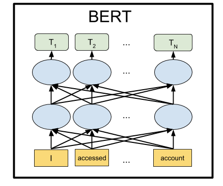

BERT — state-of-the-art языковая модель для 104 языков. Туториал по запуску BERT локально и на Google Colab

BERT — это нейронная сеть от Google, показавшая с большим отрывом state-of-the-art результаты на целом ряде задач. С помощью BERT можно создавать программы с ИИ для обработки естественного языка: отвечать на вопросы, заданные в произвольной форме, создавать чат-ботов, автоматические переводчики, анализировать текст и так далее.

Google выложила предобученные модели BERT, но как это обычно и бывает в Machine Learning, они страдают от недостатка документации. Поэтому в этом туториале мы научимся запускать нейронную сеть BERT на локальном компьютере, а также на бесплатном серверном GPU на Google Colab.

## Зачем это вообще нужно

Чтобы подавать на вход нейронной сети текст, нужно его как-то представить в виде чисел. Проще всего это делать побуквенно, подавая на каждый вход нейросети по одной букве. Тогда каждая буква будет кодироваться числом от 0 до 32 (плюс какой-то запас на знаки препинания). Это так называемый character-level.

Но гораздо лучше результаты получаются, если мы предложения будем представлять не по одной букве, а подавая на каждый вход нейросети сразу по целому слову (или хотя бы слогами). Это уже будет word-level. Самый простой вариант — составить словарь со всеми существующими словами, и скармливать сети номер слова в этом словаре. Например, если слово "собака" стоит в этом словаре на 1678 месте, то на вход нейросети для этого слова подаем число 1678.

Вот только в естественном языке при слове "собака" у человека всплывает сразу множество ассоциаций: "пушистая", "злая", "друг человека". Нельзя ли как-то закодировать эту особенность нашего мышления в представлении для нейросети? Оказывается, можно. Для этого достаточно так пересортировать номера слов, чтобы близкие по смыслу слова стояли рядом. Пусть будет, например, для "собака" число 1678, а для слова "пушистая" число 1680. А для слова "чайник" число 9000. Как видите, цифры 1678 и 1680 находятся намного ближе друг к другу, чем цифра 9000.

На практике, каждому слову назначают не одно число, а несколько — вектор, скажем, из 32 чисел. И расстояния измеряют как расстояния между точками, на которые указывают эти вектора в пространстве соответствущей размерности (для вектора длиной в 32 числа, это пространство с 32 размерностями, или с 32 осями). Это позволяет сопоставлять одному слову сразу несколько близких по смыслу слов (смотря по какой оси считать). Более того, с векторами можно производить арифметические операции. Классический пример: если из вектора, обозначающего слово "король", вычесть вектор "мужчина", то получится некий вектор-результат. И он чудесным образом будет соответствовать слову "королева". И действительно, "король — мужчина = королева". Магия! И это не абстрактный пример, а [реально так происходит](https://blog.acolyer.org/2016/04/21/the-amazing-power-of-word-vectors/). Учитывая, что нейронные сети хорошо приспособлены для математических преобразований над своими входами, видимо это и обеспечивает такую высокую эффективность этого метода.

Такой подход получил название Embeddings. Все пакеты машинного обучения (TensorFlow, PyTorch) позволяют первым слоем нейросети поставить специальный слой Embedding Layer, который делает это автоматически. То есть на вход нейросети подаем обычный номер слова в словаре, а Embedding Layer, самообучаясь, переводит каждое слово в вектор указанной длины, скажем, в 32 числа.

Но быстро поняли, что намного выгоднее заранее обучить подобное векторное представление слов на каком-нибудь огромном корпусе текстов, например на всей Wikipedia, а в конкретных нейронных сетях использовать уже готовые векторы слов, а не обучать их каждый раз заново.

Существует несколько способов представлять слова векторами, они постепенно эволюционирвали: word2vec, GloVe, Elmo.

Летом 2018 года в [OpenAI заметили](https://blog.openai.com/language-unsupervised/), что если предобучить нейронную сеть на архитектуре [Transformer](https://arxiv.org/abs/1706.03762) на больших объемах текста, то она неожиданно и с большим отрывом показывает отличные результаты на множестве самых разных задач по обработке естественного языка. По сути, такая нейронная сеть на своем выходе создает векторные представления для слов, и даже целых фраз. А навесив сверху над такой языковой моделью небольшой блок из пары дополнительных слоев нейронов, можно дообучить эту нейронную сеть на любые задачи.

BERT от Google — это усовершенствованная сеть GPT от OpenAI (двунаправленная вместо однонаправленной и т.д.), тоже на архитектуре Transformer. На данный момент BERT является state-of-the-art практически на всех популярных бенчмарках NLP.

  

## Как они это сделали

Идея в основе BERT лежит очень простая: давайте на вход нейросети будем подавать фразы, в которых 15% слов заменим на \[MASK\], и обучим нейронную сеть предсказывать эти закрытые маской слова.

Например, если подаем на вход нейросети фразу "Я пришел в \[MASK\] и купил \[MASK\]", она должна на выходе показать слова "магазин" и "молоко". Это упрощенный пример с официальной страницы BERT, на более длинных предложениях разброс возможных вариантов становится меньше, а ответ нейросети однозначнее.

А для того, чтобы нейросеть научилась понимать соотношения между разными предложениями, дополнительно обучим ее предсказывать, является ли вторая фраза логичным продолжением первой. Или это какая-то случайная фраза, не имеющая никакого отношения к первой.

Так, для двух предложений: "Я пошел в магазин." и "И купил там молоко.", нейросеть должна ответить, что это логично. А если вторая фраза будет "Карась небо Плутон", то должна ответить, что это предложение никак не связано с первым. Ниже мы поиграемся с обоими этими режимами работы BERT.

Обучив таким образом нейронную сеть на корпусе текстов из Wikipedia и сборнике книг BookCorpus в течении 4 дней на 16 TPU, получили BERT.

  

## Установка и настройка

_**Примечание**: в этом разделе мы запустим и поиграемся с BERT на локальном компьютере. Для запуска этой нейронной сети на локальном GPU, вам понадобится NVidia GTX 970 с 4 Гб видеопамяти или выше. Если вы хотите просто запустить BERT в браузере (для этого даже не нужно наличие GPU на компьютере), то перейдите к разделу Google Colab._

Первым делом установите TensorFlow, если его у вас еще нет, следуя инструкциям с [https://www.tensorflow.org/install](https://www.tensorflow.org/install/). Для поддержки GPU надо сначала установить CUDA Toolkit 9.0, потом cuDNN SDK 7.2, а уже потом сам TensorFlow с поддержкой GPU:

  

    pip install tensorflow-gpu

В принципе, этого достаточно для запуска BERT. Но инструкции как таковой нет, ее можно самостоятельно составить, разобравшись с исходниками в файле [run_classifier.py](https://github.com/google-research/bert/blob/master/run_classifier.py) (обычная ситуация в Machine Learning, когда вместо документации приходится лезть в исходники). Но мы поступим проще и воспользуемся оболочкой [Keras BERT](https://github.com/CyberZHG/keras-bert) (она также может вам пригодится для fine-tuning сети позднее, т.к. дает удобный Keras интерфейс).

Для этого дополнительно установим сам Keras:

  

    pip install keras

И после Keras BERT:

  

    pip install keras-bert

Нам также потребуется файл [tokenization.py](https://github.com/google-research/bert/blob/master/tokenization.py) из оригинального github BERT. Либо нажмите кнопку Raw и сохраните его в папку с будущим скриптом, либо скачайте весь репозиторий и возьмите файл оттуда, либо возьмите копию из репозитория с этим кодом [https://github.com/blade1780/bert](https://github.com/blade1780/bert).

Теперь пришло время скачать предобученную нейронную сеть. Существует несколько вариантов BERT, все они перечислены на официальной странице [github.com/google-research/bert](https://github.com/google-research/bert). Мы возьмем универсальную мультиязычную "BERT-Base, Multilingual Cased", для 104 языков. Скачайте файл [multi\_cased\_L-12\_H-768\_A-12.zip](https://storage.googleapis.com/bert_models/2018_11_23/multi_cased_L-12_H-768_A-12.zip) (632 Мб) и распакуйте в папку с будущим скриптом.

Все готово, создайте файл BERT.py, дальше будет немного кода.

Импорт необходимых библиотек и задание путей

  

    
    import sys
    import codecs
    import numpy as np
    from keras_bert import load_trained_model_from_checkpoint
    import tokenization
    
    
    folder = 'multi_cased_L-12_H-768_A-12'
    
    config_path = folder+'/bert_config.json'
    checkpoint_path = folder+'/bert_model.ckpt'
    vocab_path = folder+'/vocab.txt'

Так как нам придется переводить обычные строки текста в специальный формат токенов, то создадим специальный объект для этого. Обратите внимание на do\_lower\_case=False, так как мы используем Cased модель BERT, которая чувствительна к регистру.

  

    tokenizer = tokenization.FullTokenizer(vocab_file=vocab_path, do_lower_case=False)

Загружаем модель

  

    model = load_trained_model_from_checkpoint(config_path, checkpoint_path, training=True)
    model.summary()

BERT может работать в двух режимах: угадывать пропущенные в фразе слова, либо угадывать является ли вторая фраза логично идущей после первой. Мы сделаем оба варианта.

Для первого режима на вход нейросети нужно подать фразу в формате:

  

    [CLS] Я пришел в [MASK] и купил [MASK]. [SEP]

Нейросеть должна вернуть полное предложение с заполненными словами на месте масок: "Я пришел в магазин и купил молоко."

Для второго режима на вход нейросети нужно подать обе фразы, разделенные сепаратором:

  

    [CLS] Я пришел в магазин. [SEP] И купил молоко. [SEP]

Нейросеть должна ответить, является ли вторая фраза логичным продолжением первой. Или это случайная фраза, не имеющая никакого отношения к первой.

Для работы BERT нужно подготовить три вектора, каждый длиной 512 чисел: token\_input, seg\_input и mask_input.

В **token_input** будет храниться наш исходный текст, переведенный в токены с помощью tokenizer. Фраза в виде индексов в словаре будет находится в начале этого вектора, а остальная часть будет заполнена нулями.

В **mask_input** мы должны для всех позиций где стоит маска \[MASK\], поставить 1, а остальное заполнить нулями.

В **seg_input** мы должны первую фразу (включая начальный CLS и сеператор SEP) обозначить как 0, вторую фразу (включая конечный SEP) обозначить как 1, а остальное до конца вектора заполнить нулями.

BERT не использует словарь из целых слов, скорее из наиболее распространенных слогов. Хотя и целые слова в нем тоже есть. Вы можете открыть файл vocab.txt в скачанной нейросети и посмотреть, какие слова нейросеть использует на своем входе. Там есть как целые слова, например "Франция". Но большинство русских слов нужно разбивать на подобие слогов. Так, слово "пришел" должно быть разбито на "при" и "##шел". Для помощи в преобразовании обычных строк текста в формат, требуемый для BERT, воспользуемся модулем tokenization.py.

  

## Режим 1: предсказание слов, закрытых токеном \[MASK\] в фразе

Входная фраза, которая подается на вход нейросети

  

    sentence = 'Я пришел в [MASK] и купил [MASK].'
    print(sentence)

Преобразуем ее в токены. Проблема в том, что tokenizer не умеет обрабатывать служебные отметки вроде \[CLS\] и \[MASK\], хотя в словаре vocab.txt они есть. Поэтому придется вручную разбивать нашу строку с маркерами \[MASK\] и выделять из нее куски обычного текста, чтобы преобразовать его в BERT токены с помощью tokenizer. А также добавлять \[CLS\] в начало и \[SEP\] в конец фразы.

  

    sentence = sentence.replace(' [MASK] ','[MASK]'); sentence = sentence.replace('[MASK] ','[MASK]'); sentence = sentence.replace(' [MASK]','[MASK]')  
    sentence = sentence.split('[MASK]')             
    tokens = ['[CLS]']                              
    
    for i in range(len(sentence)):
        if i == 0:
            tokens = tokens + tokenizer.tokenize(sentence[i]) 
        else:
            tokens = tokens + ['[MASK]'] + tokenizer.tokenize(sentence[i]) 
    tokens = tokens + ['[SEP]']                     

В tokens теперь токены, которые гарантированно по словарю преобразуются в индексы. Сделаем это:

  

    token_input = tokenizer.convert_tokens_to_ids(tokens)   

Теперь в token_input идет ряд чисел (номера слов в словаре vocab.txt), которые нужно подать на вход нейросети. Осталось только удлинить этот вектор до длины 512 элементов. Python конструкция \[0\]*length создает массив длиной length, заполненный нулями. Просто добавляем его к нашим токенам, что в питоне объединяет два массива в один.

  

    token_input = token_input + [0] * (512 - len(token_input))

Теперь создаем маску маску длиной 512, поставив везде 1, где в токенах встречается число 103 (что соответствует в словаре vocab.txt маркеру \[MASK\]), а остальное заполнив 0:

  

    mask_input = [0]*512
    for i in range(len(mask_input)):
        if token_input[i] == 103:
            mask_input[i] = 1

Для первого режима работы BERT seg_input должен быть весь заполнен нулями:

  

    seg_input = [0]*512

Последний шаг, необходимо python массивы преобразовать в numpy массивы c shape (1,512), для чего помещаем их в подмассив \[\]:

  

    token_input = np.asarray([token_input])
    mask_input = np.asarray([mask_input])
    seg_input = np.asarray([seg_input])

Ок, готово. Теперь запускаем предсказание нейросети!

  

    predicts = model.predict([token_input, seg_input, mask_input])[0] 
    predicts = np.argmax(predicts, axis=-1)
    predicts = predicts[0][:len(tokens)]    

Теперь отформатируем результат из токенов обратно в строку, разделенную пробелами

  

    out = []
    
    for i in range(len(mask_input[0])):
        if mask_input[0][i] == 1:                       
            out.append(predicts[i]) 
    
    out = tokenizer.convert_ids_to_tokens(out)          
    out = ' '.join(out)                                 
    out = tokenization.printable_text(out)              
    out = out.replace(' ##','')                         

И выводим результат:

  

    print('Result:', out)

В нашем примере, для фразы "Я пришел в \[MASK\] и купил \[MASK\]." нейросеть выдала результат "дом" и "его": "Я пришел в дом и купил его". Ну, не так уж и плохо, для первого раза. Купить дом определенно лучше, чем молоко ).

  

**Другие примеры (неудачные не привожу, их намного больше, чем удачных. в большинстве случаев сеть выдает просто пустой ответ):**

Земля это третья \[MASK\] от Солнца  
Result: звезда

бутерброд лучше всего \[MASK\] с маслом  
Result: встречается

после \[MASK\] обеда полагается поспать  
Result: этого

отойди от \[MASK\]  
Result: ##ой — это что, какое-то ругательство? )

\[MASK\] от двери  
Result: вид

При \[MASK\] молотка и гвоздей можно сделать шкаф  
Result: помощи

А если завтра не будет? Сегодня, например, его не \[MASK\]!  
Result: будет

Как может надоесть игнорировать \[MASK\]?  
Result: её

Есть бытовая логика, есть женская логика, а о мужской \[MASK\] ничего не известно  
Result: философии

У женщин к тридцати годам формируется образ принца, под который подходит любой \[MASK\].  
Result: человек

Большинством голосов Белоснежка и семь гномов проголосовали за \[MASK\], при одном голосе против.  
Result: село — первая буква правильная

Оцените степень своего занудства по 10 бальной шкале: \[MASK\] баллов  
Result: 10

Вашу \[MASK\], \[MASK\] и \[MASK\]!  
Result: любовь я я — нет, BERT, я имел ввиду совсем не это

Можно вводить и английские фразы (и любые на 104 языках, список которых [есть тут](https://github.com/google-research/bert/blob/master/multilingual.md#list-of-languages))

\[MASK\] must go on!  
Result: I

  

## Режим 2: проверка логичности двух фраз

Задаем две последовательные фразы, которые будут поданы на вход нейросети

  

    sentence_1 = 'Я пришел в магазин.'
    sentence_2 = 'И купил молоко.'
    
    print(sentence_1, '->', sentence_2)

Сформируем токены в формате \[CLS\] фраза\_1 \[SEP\] фраза\_2 \[SEP\], преобразуя обычный текст в токены с помощью tokenizer:

  

    tokens_sen_1 = tokenizer.tokenize(sentence_1)
    tokens_sen_2 = tokenizer.tokenize(sentence_2)
    
    tokens = ['[CLS]'] + tokens_sen_1 + ['[SEP]'] + tokens_sen_2 + ['[SEP]']

Преобразуем строковые токены в числовые индексы (номера слов в словаре vocab.txt) и удлиняем вектор до 512:

  

    token_input = tokenizer.convert_tokens_to_ids(tokens)      
    token_input = token_input + [0] * (512 - len(token_input))

Маска слов в данном случае полностью заполнена нулями

  

    mask_input = [0] * 512

А вот маску предложений нужно под второй фразой (включая конечный SEP) заполнить единицами, а все остальное нулями:

  

    seg_input = [0]*512
    len_1 = len(tokens_sen_1) + 2                   
    for i in range(len(tokens_sen_2)+1):            
            seg_input[len_1 + i] = 1                
    
    
    token_input = np.asarray([token_input])
    mask_input = np.asarray([mask_input])
    seg_input = np.asarray([seg_input])

Пропускаем фразы через нейросеть (в этот раз результат в \[1\], а не в \[0\], как было выше)

  

    predicts = model.predict([token_input, seg_input, mask_input])[1] 

И выводим вероятность того, что вторая фраза является нормальной, а не случайным набором слов

  

    print('Sentence is okey:', int(round(predicts[0][0]*100)), '%')

На две фразы:

Я пришел в магазин. -\> И купил молоко.

Ответ нейросети:

Sentence is okey: 99 %

А если вторая фраза будет "Карась небо Плутон", то ответ будет:

Sentence is okey: 4 %

  

## Google Colab

Google предоставляет бесплатный серверный GPU Tesla K80 c 12 Gb видеопамяти (сейчас доступны и TPU, но их настройка немного сложнее). Весь код для Colab должен быть оформлен как jupyter notebook. Чтобы запустить BERT в браузере, просто откройте ссылку

[http://colab.research.google.com/github/blade1780/bert/blob/master/BERT.ipynb](http://colab.research.google.com/github/blade1780/bert/blob/master/BERT.ipynb)

В меню **Runtime** выберите **Run All**, чтобы в первый раз запустились все ячейки, скачалась модель и подключились нужные библиотеки. Согласитесь сбросить все Runtime, если потребуется.

  

**Если что-то пошло не так...**

Убедитесь, что в меню Runtime -> Change runtime type выбрано GPU и Python 3

Если кнопка подключения не активна, нажмите ее, чтобы стало Connected.

Теперь меняйте входные строки **sentence**, **sentence_1** и **sentence_2**, и нажимайте слева значок Play для запуска только текущей ячейки. Запускать весь notebook уже не нужно.

Запустить BERT в Google Colab можно даже со смартфона, но если не открывается, может потребоваться включить галку Полная версия в настройках браузера.

  

## Что дальше?

Чтобы дообучить BERT под конкретную задачу, необходимо поверх него добавить один-два слоя простой Feed Forward сети, и дообучать только ее, не трогая основную сеть BERT. Это можно сделать либо на голом TensorFlow, либо через оболочку Keras BERT. Такое дообучение под конкретный домен происходит очень быстро и полностью аналогично Fine Tuning в сверточных сетях. Так, под задачу SQuAD можно дообучить нейросеть на одном TPU всего за 30 минут (по сравнению с 4 днями на 16 TPU для обучения самого BERT).

Для этого вам придется изучить как в BERT представлены последние слои, а также иметь подходящий датасет. На официальной странице BERT [https://github.com/google-research/bert](https://github.com/google-research/bert) есть несколько примеров под разные задачи, а также инструкция как запустить дообучение на облачных TPU. А все остальное придется смотреть в исходниках в файлах [run_classifier.py](https://github.com/google-research/bert/blob/master/run_classifier.py) и [extract_features.py](https://github.com/google-research/bert/blob/master/extract_features.py).

  

### P.S.

Представленный здесь код и jupyter notebook для Google Colab [**размещены в репозитории**](https://github.com/blade1780/bert).

Чудес ждать не стоит. Не ждите, что BERT заговорит как человек. Статус state-of-the-art вовсе не значит, что прогресс в NLP достиг приемлемого уровня. Это всего лишь означает, что BERT лучше предыдущих моделей, которые были еще хуже. До сильного разговорного ИИ еще очень далеко. Кроме того, BERT — это в первую очередь языковая модель, а не готовый чат-бот, поэтому хорошие результаты она показывает только после дообучения под конкретную задачу.