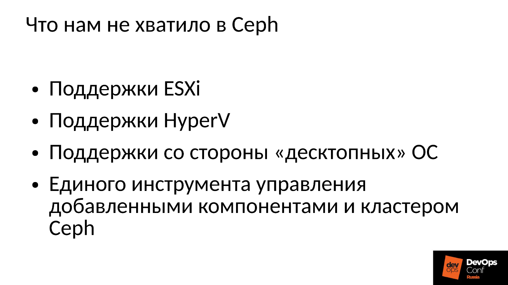
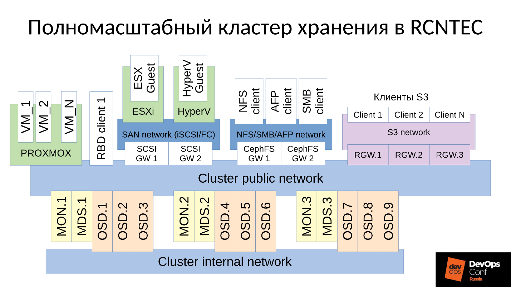
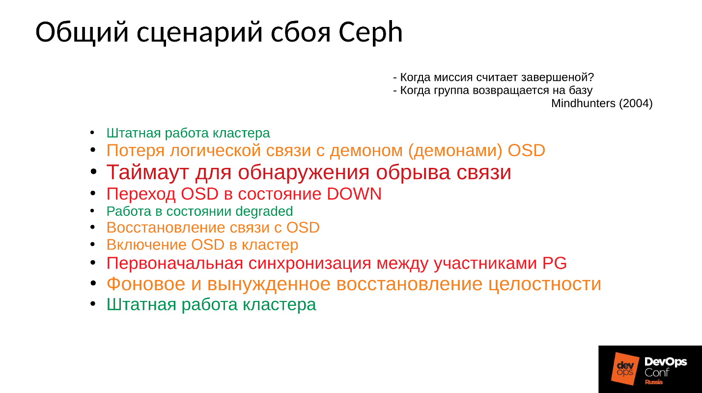
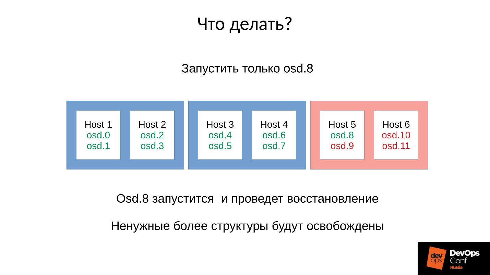
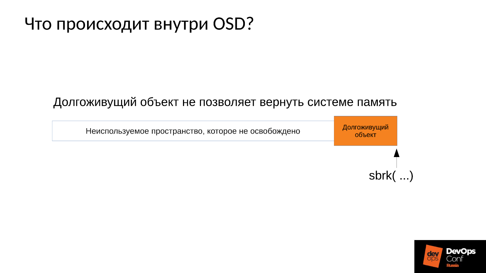
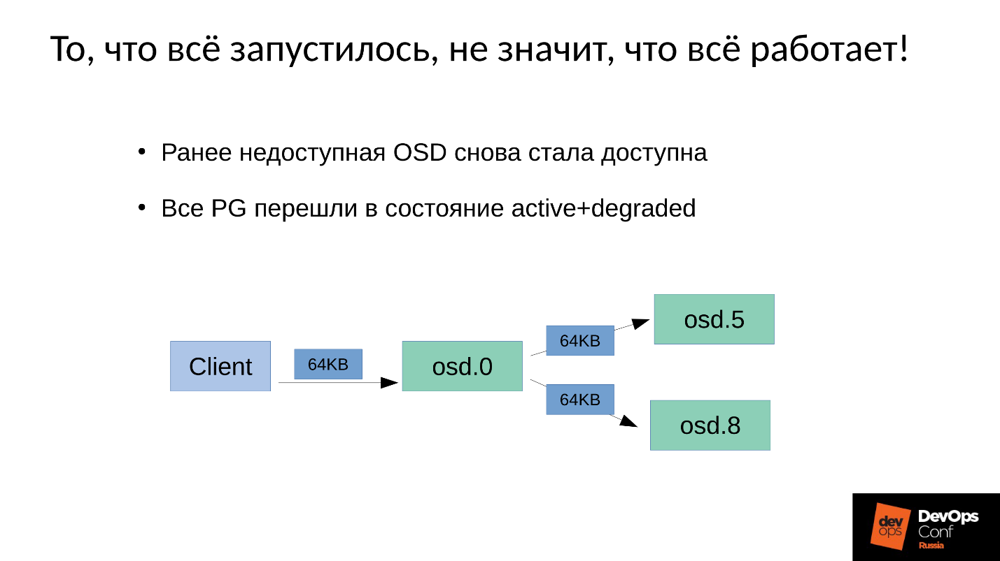
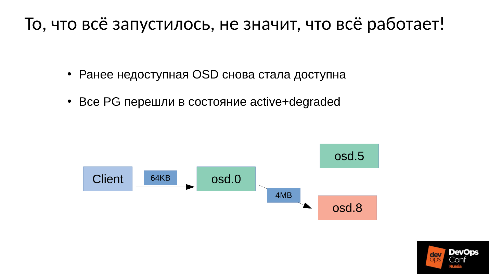
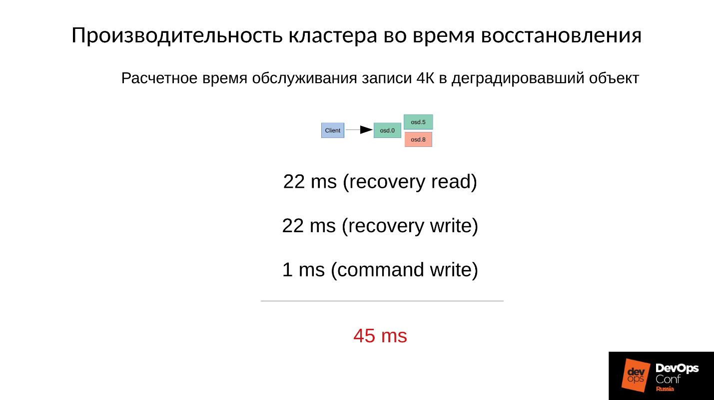

Ceph. Анатомия катастрофы / Блог компании Конференции Олега Бунина (Онтико)

Ceph — это object storage, призванный помочь построить отказоустойчивый кластер. И все-таки отказы случаются. Все, кто работает с Ceph, знают легенду о CloudMouse или Росреестре. К сожалению, делиться отрицательным опытом у нас не принято, причины провалов чаще всего замалчивают, и не дают будущим поколениям научиться на чужих ошибках.

Что ж, настроим тестовый, но близкий к реальному кластер и разберем катастрофу по косточкам. Измерим все просадки производительности, найдем утечки памяти, разберем процесс восстановления обслуживания. И все это под руководством Артемия Капитулы, который потратив почти год на изучение подводных камней, заставил при отказе производительность кластера не падать в ноль, и latency не подскакивать до неприличных значений. И получил красный график, который ну сильно лучше.  

Далее вы найдете видео и текстовую версию одного из лучших докладов [DevOpsConf Russia](https://devopsconf.io/) 2018.

  
**О спикере:** Артемий Капитула системный архитектор RCNTEC. Компания предлагает решения для IP телефонии (совместная работа, организация удаленного офиса, программно-определяемые системы хранения и системы управления/распределения питанием). Компания в основном работает в enterprise секторе, поэтому не очень известна на рынке DevOps. Тем не менее, накоплен определенный опыт работы с Ceph, который во многих проектах используется как базовый элемент инфраструктуры хранилища.

**Ceph — это программно-определяемое хранилище с множеством программных компонентов.**  

На схеме:

*   Верхний уровень — внутренняя кластерная сеть, по которой коммуницирует сам кластер;
*   Нижний уровень — собственно Ceph — набор внутренних Ceph’ских демонов (MON, MDS и OSD), которые хранят данные.

Все данные, как правило, реплицируются, на схеме я специально выделил три группы, в каждой по три OSD, и в каждой из таких групп обычно лежит одна реплика данных. В результате данные хранятся в трех копиях.

Выше уровнем кластерная сеть — это сеть, через которую клиенты Ceph получают доступ к данным. Через нее клиенты коммуницируют с монитором, с MDS (кому надо) и с OSD. Каждый клиент работает с каждым OSD и с каждым монитором самостоятельно. Поэтому **система лишена единой точки отказа**, что очень радует.

## Клиенты  

   ● Клиенты S3

S3 — это API для HTTP. Клиенты S3 работают по HTTP и подключаются к компонентам Ceph Rados Gateway (RGW). Они практически всегда коммуницируют с компонентом через выделенную сеть. В этой сети (я ее назвал S3 network) используется только HTTP, исключения редки.

   ● Гипервизор с виртуальными машинами

Данная группа клиентов часто используется. Они работают с мониторами и с OSD, с которых получают общую информацию о состоянии кластера и распределении данных. За данными эти клиенты непосредственно ходят на OSD-демонов через Cluster public network.

   ● RBD-клиенты

Также есть физические BR metals хосты, на которых, как правило, Linux. Они являются RBD-клиентами и получают доступ к образам, хранящимся внутри кластера Ceph (образы диска виртуальных машин).

   ● CephFS-клиенты

Четвертая группа клиентов, которая еще есть не у многих, но вызывает все больший интерес, это клиенты кластерной файловой системы CephFS. Кластерная система CephFS может быть смонтирована одновременно со многих узлов, и все узлы получают доступ к одним и тем же данным, работая с каждой OSD. То есть нет как таковых Gateways (Samba, NFS и прочих). Проблема в том, что такой клиент может быть только Linux, причем достаточно современной версии.  

Наша компания работает на корпоративный рынок, а там бал правит ESXi, HyperV и другие. Соответственно, от кластера Ceph, который так или иначе используется в корпоративном секторе, в обязательном порядке требуется поддержка соответствующих методик. Нам этого в Ceph не хватило, поэтому пришлось дорабатывать и расширять кластер Ceph своими компонентами, фактически строя уже нечто большее, чем Ceph, — свою платформу для хранения данных.

Кроме того, клиенты в корпоративном секторе не на Linux, а в большинстве своем Windows, изредка Mac OS, в кластер Ceph сами идти не могут. Их приходится запускать через какие-то шлюзы, которые в этом случае становятся узкими местами.

Нам пришлось добавить все эти компоненты, и мы получили несколько более широкий кластер.  

У нас появились два центральных компонента — это **группа SCSI Gateways**, которые предоставляют доступ к данным в кластере Ceph через FibreChannel или iSCSI. Эти компоненты используются для того, чтобы соединить HyperV и ESXi с Ceph-кластером. Клиенты PROXMOX по-прежнему работают родным для них способом — через RBD.

Файловых клиентов мы не пускаем напрямую в кластерную сеть, для них выделено несколько отказоустойчивых Gateway. Каждый Gateway предоставляет доступ к файловой кластерной системе по NFS, по AFP или по SMB. Соответственно, практически любой клиент, будь это Linux, FreeBSD или не только клиент, сервер (OS X, Windows), получает доступ к CephFS.

Для того, чтобы всем этим управлять, нам пришлось фактически разработать свой оркестратор Ceph и всех наших компонентов, которых там множество. Но говорить о нем сейчас нет смысла, поскольку это именно наша разработка. Большинству будет, наверное, интересен все-таки сам «голый» Ceph.

Ceph много где используется, и местами периодически случаются отказы. Наверняка все, кто работает с Ceph, знают легенду о CloudMouse. Это страшная городская легенда, но там все не так плохо, как кажется. Есть новая сказка о Росреестре. Там везде крутился Ceph, и везде был его отказ. Где-то это закончилось фатально, где-то удалось быстро устранить последствия.

К сожалению, у нас не принято делиться отрицательным опытом, все стараются спрятать соответствующую информацию. Зарубежные компании чуть более открыты, в частности, в DigitalOcean (известный провайдер, который раздает виртуалки) тоже случился отказ Ceph почти на сутки, это было 1 апреля — замечательный день! Часть репортов они выложили, ниже краткий лог.  

Проблемы начались в 7 утра, в 11 они поняли, что происходит, и начали устранять отказ. Для этого они выделили две команды: одна зачем-то бегала по серверам и устанавливала туда память, а вторая почему-то вручную стартовала один сервер за другим и тщательно следила за всеми серверами. Почему? Мы же все привыкли, чтобы все включалось одним нажатием.

_Что в принципе происходит в распределенной системе, когда она эффективно построена и работает почти на пределе своих способностей?_

Для ответа на этот вопрос нам нужно посмотреть, как работает кластер Ceph и как происходит отказ.  

## Сценарий сбоя Ceph  

Сначала кластер работает нормально, все идет замечательно. Затем случается что-то, после чего демоны OSD, где хранятся данные, теряют связь с центральными компонентами кластера (мониторами). В этот момент случается таймаут и весь кластер встает колом. Кластер стоит некоторое время, пока не поймет, что что-то с ним неладно, и уже после этого, корректирует свое внутреннее знание. После чего обслуживание клиентов в какой-то мере восстанавливается, и кластер снова работает уже в деградировавшем режиме. Причем самое смешное, что он работает быстрее, чем в штатном режиме — это удивительный факт.

Затем мы устраняем отказ. Допустим, у нас пропало электропитание, стойку вырубило полностью. Электрики прибежали, все восстановили, питание подали, серверы включились и тут **начинается самое интересное**.

> Все привыкли к тому, что когда отказывает сервер, все становится плохо, а когда мы включаем сервер, все становится хорошо. Здесь все совершенно не так.  

Кластер практически останавливается, проводит первичную синхронизацию и потом начинает плавное, медленное восстановление, постепенно выходя на штатный режим.  

Выше график производительности кластера Ceph по мере развития сбоя. Обратите внимание, здесь очень четко прослеживаются те самые интервалы, о которых мы говорили:

*   Нормальная работа примерно до 70 секунды;
*   Провал на минуту примерно до 130 секунды;
*   Плато, которое заметно выше, чем работа в нормальном режиме — это работа кластеров degraded;
*   Затем мы включаем отсутствующий узел — это учебный кластер, там всего 3 сервера и 15 SSD. Пускаем сервер в работу где-то в районе 260 секунды.
*   Сервер включился, вошел в кластер — IOPS’ы упали.

Давайте попробуем разобраться, что же там происходило в действительности. Первое, что нас интересует, — это провал вниз в самом начале графика.

### Отказ OSD  

Рассмотрим пример кластера с тремя стойками, по несколько узлов в каждой. Если левая стойка отказывает, все OSD демоны (не хосты!) пингуют себя Ceph’овскими сообщениями с определенным интервалом. Если произошла потеря нескольких сообщений, отправляется сообщение на монитор «Я, OSD такая-то, не могу достучаться до OSD такой-то».  

При этом сообщения, как правило, группируются по хостам, то есть, если два сообщения от разных OSD приходят на один хост, они объединяются в одно сообщение. Соответственно, если OSD 11 и OSD 12 рапортовали о том, что они не могут достучаться до OSD 1, это будет интерпретировано, как Host 11 пожаловался на OSD 1. Когда отрапортовали OSD 21 и OSD 22, это интерпретируется, как Host 21 недоволен OSD 1. После чего монитор считает, что OSD 1 в состоянии down и уведомляет об этом (через изменение OSD map) всех членов кластера, работа продолжается в деградировавшем режиме.  

Итак, вот наш кластер и отказавшая стойка (Host 5 и Host 6). Включаем Host 5 и Host 6, поскольку питание появилось, и…

### Внутреннее поведение Ceph  

А теперь самое интересное — у нас начинается **первоначальная синхронизация данных**. Поскольку есть множество реплик, они должны быть синхронны и находиться в одной и той же версии. В процессе старта запуска OSD:

*   OSD считывает имеющиеся версии, имеющуюся историю (pg_log — для определения текущих версий объектов).
*   После чего определяет, на каких OSD лежат последние версии деградировавших объектов (missing_loc), а на каких отставшие.
*   Там, где хранятся отставшие версии нужно провести синхронизацию, а новые версии могут быть использованы в качестве опорных для чтения и записи данных.

Используется история, которая собирается со всех OSD, и этой истории может быть достаточно много; определяется фактическое расположение множества объектов в кластере, где лежат соответствующие версии. Сколько объектов в кластере, столько получается записей, если кластер долго простоял в деградировавшем режиме, то история большая.

**Для сравнения:** типичный размер объекта, когда мы работаем с RBD-образом, составляет 4 Мбайта. Когда мы работаем в erasure coded — 1Мбайт. Если у нас диск на 10 Тбайт, то получается миллион мегабайтных объектов на диске. Если у нас 10 дисков в сервере, то уже 10 миллионов объектов, если 32 диска (мы строим эффективный кластер, у нас плотное размещение), то 32 миллиона объектов, которые надо удержать в памяти. Причем фактически информация о каждом объекте хранится в нескольких копиях, потому что каждая копия говорит о том, что в этом месте он лежит в такой версии, а в этом — в такой.

Получается огромный объем данных, который размещается в оперативной памяти:

*   чем больше объектов, тем больше история missing_loc;
*   чем больше PG — тем больше pg_log и OSD map;

кроме того:

*   чем больше размер дисков;
*   чем выше плотность размещения (количество дисков в каждом сервере);
*   чем выше нагрузка на кластер и чем быстрее ваш кластер;
*   чем дольше OSD находится дауне (в состоянии Offline);

другими словами, **чем более крутой кластер мы построили, и чем дольше часть кластера не отвечала — тем больше оперативной памяти потребуется при старте**.

## Экстремальные оптимизации — корень всех зол  

  

> _«… а к плохим мальчикам и девочкам ночью приходит черный ООМ и убивает все процессы направо и налево»_
> 
> Городская сисадминская легенда

Итак, оперативной памяти требуется много, потребление памяти растет (мы же стартовали сразу в треть кластера) и система в теории может уйти в SWAP, если вы конечно его создали. Думаю, есть достаточно много людей, которые думают, что SWAP — это плохо, и его не создают: «Зачем? У нас же много памяти!» Но это неправильный подход.

Если SWAP-файл заранее не создан, так как решили, что Linux так будет работать эффективней, то рано или поздно случится out of memory killer (ООМ-killer) И не факт, что он убьет именно того, кто съел всю память, а не того, кому первому не повезло. Мы же знаем, что такое оптимистичная локация — мы запрашиваем память, нам ее обещают, мы говорим: «А теперь дай нам ее», в ответ: «А нету!» — и out of memory killer.

Это штатная работа Linux, если его не настраивать в области виртуальной памяти.

Процесс получает out of memory killer и вываливается быстро и безжалостно. При этом никакие другие процессы о том, что он умер, не знают. Он никого не успел ни о чем уведомить, его просто терминировали.

Потом процесс, естественно, перезапустится — у нас же systemd, он же запускает при необходимости OSD, которые упали. Упавшие OSD стартуют, и… начинается цепная реакция.  

В нашем случае мы стартовали OSD 8 и OSD 9, они начали давить все, но не повезло OSD 0 и OSD 5. К ним прилетел out of memory killer и терминировал их. Они перезапустились — прочли свои данные, начали синхронизироваться и давить остальные. Не повезло еще трем (OSD 9, OSD 4 и OSD 7). Эти три перестартовали, начали давить на весь кластер, не повезло следующей пачке.

**Кластер начинает разваливаться буквально на глазах**. Деградация происходит очень быстро, и это «очень быстро» обычно выражается в минутах, максимум, в десятках минут. Если у вас есть 30 узлов (по 10 узлов в стойке), и вырубило стойку из-за сбоя питания — через 6 минут половина кластера лежит.

Итак, мы получаем примерно следующее.  

Практически на каждом сервере у нас есть отказавшая OSD. А если на каждом сервере она есть, то есть в каждом домене отказа у нас по отказавшей OSD, то **большая часть наших данных недоступна**. Любой запрос блокируется — на запись, на чтение — не имеет разницы. Все! Мы встали.

Что делать в такой ситуации? Точнее, **что надо было делать**?

**Ответ:** Не запускать кластер сразу, то есть всю стойку, а аккуратненько поднимать по одному демону.

Но мы этого не знали. Мы стартовали сразу, и получили то, что получили. Мы запустили в данном случае один демон из четырех (8, 9, 10, 11), расход памяти увеличится примерно на 20 %. Как правило, такой скачок мы выдерживаем. Потом расход памяти начинает снижаться, потому что часть структур, которые использовались для удержания информации о том, как кластер деградировал, уходит. То есть часть Placement Groups вернулась в нормальное состояние, и все, что нужно для удержания деградированного состояния, освобождается — **в теории освобождается**.

Давайте посмотрим пример. Код на С слева и справа практически идентичен, отличие только в константах.  

Эти два примера запрашивают у системы разное количество памяти:

*   левый — 2048 кусков по 1 Мбайту;
*   правый — 2097152 куска по 1 Кбайту.

Затем оба примера ждут, чтобы мы их сфотографировали в top. А после нажатия ENTER, они освобождают память — всю, кроме последнего куска. Это очень важно — последний кусок остается. И опять ждут, чтобы мы их сфотографировали.

Ниже то, что фактически произошло.  

*   Сначала оба процесса запустились и отъели память. Похоже на правду — 2 Гб RSS.
*   Жмем ENTER и удивляемся. Первая программа, которая выделяла большими кусками, память вернула. А вот вторая программа не вернула.

Ответ, почему же так произошло, кроется в Linux’овом malloc’е.

Если мы запрашиваем память большими кусками, она выдается с использованием механизма anonymous mmap, который отдается в адресное пространство процессора, откуда нам потом нарезают память. Когда мы делаем free(), память освобождается и страницы возвращаются в page cache (системе).

Если же мы выделяем память маленькими кусочками, у нас делается sbrk( ). sbrk( ) смещает указатель на хвост кучи, в теории смещенный хвостик можно вернуть обратно, вернув страницы памяти системе, если память не используется.

Теперь посмотрим на иллюстрацию. У нас было много записей в историю о расположении деградировавших объектов, а потом пришла пользовательская сессия — долгоживущий объект. Мы синхронизировались и все лишние структуры ушли, но долгоживущий объект остался, и мы не можем сдвинуть sbrk( ) назад.  

У нас осталось большое неиспользуемое пространство, которое можно было бы освободить, если бы у нас был SWAP. Но мы же умные — мы SWAP отключили.

Конечно, потом какая-то часть памяти из начала кучи будет использована, но это лишь некоторая часть, а очень существенный остаток так и будет удерживаться занятым.

Что в такой ситуации делать? Ответ ниже.

### Контролируемый запуск  

  

*   Запускаем один демон OSD.
*   Ждем, пока он синхронизируется, проверяем бюджеты памяти.
*   Если понимаем, что выдержим старт следующего демона, стартуем следующий.
*   Если нет, то быстренько перезапускаем демон, который занял больше всего памяти. Он был в состоянии down недолго, у него не так много истории, missing locs и прочего, поэтому он съест меньше памяти, бюджет памяти слегка увеличится.
*   Пробегаемся по кластеру, контролируем его, и постепенно все поднимаем.
*   Проверяем, можно ли приступать к следующей OSD, переходим к ней.

DigitalOcean фактически это и выполнили:  
_«Our Datacenter team performs memory augments while another team slowly continues to bring up nodes while manually managing the memory budget of each host»._  

Вернемся к нашей конфигурации и сложившейся ситуации. Сейчас мы имеем разваленный кластер после цепной реакции out of memory killer. Мы запрещаем автоматический перезапуск OSD в красном домене, и один за другим стартуем узлы из синих доменов. Потому что **наша первая задача всегда — восстановить обслуживание**, не разбираясь, почему это случилось. Разбираться будем потом, когда восстановим обслуживание. В эксплуатации всегда именно так.

Мы приводим кластер в целевое состояние для того, чтобы восстановить обслуживание, а потом начинаем запускать одну OSD за другой по нашей методике. Первую смотрим, при необходимости перезапускаем другие, чтобы скорректировать бюджет памяти, следующую — 9, 10, 11 — и кластер вроде бы синхронизировался и готов начать обслуживание.

Проблема заключается в том, как выполняется **обслуживание записи в Ceph**.  

У нас есть 3 реплики: одна master OSD и два slave для нее. Уточним, что master/slave в каждой Placement Group свои, но в каждой один master и два slave.

Операция записи или чтения попадает на master. При чтении, если у master есть нужная версия, он ее отдаст клиенту. С записью немного сложнее, запись должна быть повторена на всех репликах. Соответственно, когда клиент пишет 64 Кб в OSD 0, эти же 64 Кб в нашем примере попадают на OSD 5 и OSD 8.

Но дело в том, что у нас же OSD 8 очень сильно деградировавшая, поскольку мы перезапускали много процессов.  

Поскольку в Ceph любое изменение — это переход от версии к версии, на OSD 0 и OSD 5 у нас будет новая версия, на OSD 8 — старая. Это означает, что для того, чтобы повторить запись (разослать 64 Кб) нам нужно на OSD 8 обновить версию — а это 4 Мб (размер объекта). То есть мы читаем 4 Мб на OSD 0, посылаем на OSD 8, она записывает, приходит в синхронное состояние. Теперь у нас везде одинаковые свежие версии, и только тогда мы записываем 64 Кб.

Теперь пойдут цифры — самое интересное.  

Производительность тестового кластера:

*   Операция записи размером 4 Кбайта занимает 1 мс, производительность 1000 операций/секунду в 1 поток.
*   Операция размером 4 Мбайта (размером объекта) занимает 22 мс, производительность 45 операций/секунду.

Следовательно, когда отказывает один домен из трех, кластер некоторое время находится в деградировавшем состоянии, и половина горячих объектов распространится по разным версиям, то половина операций записей будет начинаться с принудительного восстановления.

Время принудительного восстановления рассчитываем примерно — операции записи в деградировавший объект.  

Сначала мы читаем 4 Мбайта за 22 мс, пишем 22 мс, и затем 1 мс мы пишем 4 Кб собственно данных. Итого суммарно 45 мс на одну операцию записи в деградировавший объект на SSD, когда штатная производительность у нас была 1 мс — **падение производительности в 45 раз**.

Чем больше у нас процент деградировавших объектов, тем все становится страшнее.

## Усредненное время обслуживания  

*   Когда деградировала **половина объектов**, среднее время обслуживания — (45+1) / 2 = **23 мс.**
*   Если деградировало **75% объектов**, то (45 * 3 + 1) / 4 = **34 мс**.
*   Если 90% —(45 * 9 + 1) / 10 = 41 мс — в 40 раз медленнее, чем штатный режим.

Это заводской механизм работы Ceph, и с ним ничего нельзя делать. Если ваш кластер частично побывал в офлайн и в это время другая его часть обслуживала запросы клиентов, то после включения будет резкое, в несколько десятков раз, падение производительности на некоторых операциях.

Теперь рассмотрим результаты тестов производительности Ceph в аварийном режиме сразу на двух графиках.  

1.  Нижний график нам знаком — это производительность кластера: нормальный режим, провал, обнаружение отказа, деградировавший режим, работа в деградировавшем режиме.  
    
2.  Сверху — latency. Здесь фактически latency даже хуже, чем мы рассчитывали. Этот кластер деградировал почти на 100% в ходе теста (я специально подольше его подержал, чтобы картинки были зрелищными и до вас дошла глубина поражения). Latency от 60 мс за счет накладных расходов, которые мы в изначальных расчетах не учитывали.  
    

Кластер будет восстанавливаться в ходе штатной работы, и мы упираемся прежде всего в сеть. Сеть 10 Гбит, то есть 1 200 Мб/с, а это означает 300 объектов в секунду на один сервер, вне зависимости от того, сколько там дисков. Будет 10 SSD — все равно 300 объектов в секунду, один диск — возможно, будет по-прежнему 300 объектов в секунду.

> Мы строили эффективный кластер, а попали в сеть репликаций.  

Кроме того, еще есть полоса пропускания диска. Наш диск в штатном режиме выдает 900 Мбайт/с (это средний SSD). Обычно он обслуживает порядка 2 500 операций в 128 Кбайт в секунду (как правило, ESXi и HyperV выравнивают свои запросы под 128 Кбайт). Но если мы входим в degraded, упираемся в 225 объектов в секунду. А если мы используем file store, а не object store, то у нас же есть еще и журнал (двойная запись), то вообще получается 110 операций в секунду, и все становится вообще очень-очень печально.

SSD выдает 110 операций в секунду — катастрофа!

**Что мы можем сделать?**

**Ответ 1:** Бороться можно только архитектурой — **делать больше доменов отказа**.  

Здесь столбцы слева направо: сколько доменов отказало; процент деградировавших PG;  
среднее время обслуживания с учетом соответствующего отказа.

Если у нас отказал:

*   Один домен из трех, то 45 мс — это оптимистичная оценка.
*   Один домен из десяти (по теории вероятности с учетом мат. ожидания), получается примерно 14 мс.
*   Один домен из двадцати, то 8 мс (деградировало примерно 10% PG).

То есть **добавлять домены эффективно, но дорого**, поскольку домен отказа проектируется под отказ питания, серверов, прочего оборудования, и это не всегда возможно.

**Ответ 2:** Второй вариант — **уменьшить размер объекта** (order, objectsize) в образе.

Если мы уменьшаем размер объекта, то, например, операции из 4 Мбайт станут 2 или 1 Мбайт. Тогда все станет в разы быстрее, но все равно сильно медленнее, чем штатный режим. При этом:

*   кратно уменьшается время репликации объекта;
*   пропорционально уменьшается время обслуживания (latency) на кластере во время восстановления.

Но за все надо платить:

*   кратно увеличивается количество объектов;
*   почти кратно увеличивается расход памяти;
*   самое неприятное — невозможно изменить размер объекта для уже созданного образа. Как он создался в 4 Мбайта, так и останется.

Если мы создали его под максимальную производительность (32 Мбайт объект) — тогда мы попали очень конкретно сразу!

**Ответ 3:** Еще один путь — это **дорабатывать Ceph**.

В рамках функциональных обязанностей я, как системный архитектор-разработчик, полез **вглубь Ceph**. В ходе изысканий нам удалось заставить кластер не заниматься репликацией на каждый чих при записи в деградировавший объект, но при этом сохранить консистентность кластера, то есть усечь часть передаваемых данных. Получилось вот такая интересная картина.  

На верхнем графике производительность кластера, на нижнем — Latency. Синий — штатный график, красный — экспериментальный. Latency на самом деле подрастает на 30% минимум, просто в этом масштабе этого не видно, то есть не все так хорошо.

В Community этого кода пока что нет, поскольку он находится в preproduction состоянии. Его нельзя включать на ходу, а это нас не устраивает. Когда мы это доведем до конца, мы это сделаем.

У нас суммарно ушло примерно человеко-год на то, чтобы получить этот рабочий график. Если у вас нет возможности вложить столько трудозатрат, залезть внутрь Ceph и сделать там что-нибудь кардинальное, то вот, что вы можете сделать.

   ● **Во время аварии что-то делать бесполезно**.  
Во время аварии нельзя паниковать, к ней надо быть готовым. Это означает, что **надо в обязательном порядке проводить учения**. Без этого все ваши теоретические изыскания бесполезны. Более того, учения очень рекомендуется проводить примерно на тех же конфигурациях, где у вас production. Потому что, если у вас в учениях мало данных, то на проблему с памятью, с которой столкнулись DigitalOcean и мы, вы не наступите. Если данных много, то наступите, и будете не знать, что делать.

К тому же, если у вас мало данных и небольшая нагрузка, то вы не увидите этого адского падения производительности. К вам придут клиенты, начнут кричать: «У вас ничего не работает! Что случилось?!» Они будут дергать вашу техподдержку, техподдержка вас, вы будете хвататься за голову. Все будет печально, и к этому надо быть готовым: понимать, где мы просядем, сколько примерно продлится down time.

   ● **Нельзя удалять компоненты кластера (OSD).**  
Каждый раз, когда вы удаляете вроде бы тормозящий компонент, вы теряете часть данных — часть избыточных пока что данных, но, если что-то пойдет не так в другом месте, они могут понадобиться. **Поэтому не удаляйте компоненты кластера OSD — мониторы и прочие — на ходу никогда**. Если вы это делаете, вы сами себе злобный Буратино.

   ● **Правильно проектируйте кластер.**  
Следует на этапе проектирования минимизировать количество недоступных OSD в случае плановых работ или неплановых ситуаций. **Делайте больше доменов отказа, если это возможно**. Если нельзя, хотя бы выбирайте такое железо, чтобы можно было менять диски, не выключая сервер.

   ● **Выделяйте достаточно RAM на узлах OSD.**

   ● **Не отключайте SWAP.**  
Поведение со SWAP это не только Ceph’овское поведение, а вообще общее Linux’овое поведение. Вы должны быть к этому готовы и это помнить.

   ● **Максимизируйте производительность репликационной сети кластера.**  
Пусть она не используется в штатном режиме на 100%, и даже на 10%. Но, если случится нештатный режим, каждый лишний гигабит облегчит вам жизнь, причем очень существенно.

   ● **Иногда имеет смысл уменьшить размер часто модифицируемых объектов RBD или уменьшить размер объекта в Rados Getway.**  
Но помните, что уменьшение размера объекта будет требовать дополнительной оперативной памяти. **Не забывайте добавлять SWAP — его бояться не надо.** То, что активность по SWAP есть — это не так страшно, поскольку, скорее всего, система сносит туда то, что не особо активно используется.

> Это статья — расшифровка одного из лучших докладов DevOpsConf Russia. Скоро мы откроем видео и опубликуем в текстовом варианте еще насколько интересных тем. Подпишитесь здесь, на [youtube](https://www.youtube.com/c/DevOpsChannel) или в [рассылке](http://eepurl.com/bN_0E1), если хотите не пропустить подобные полезные материалы и быть в курсе DevOps-новостей.