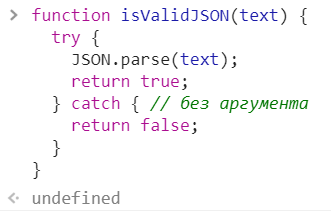
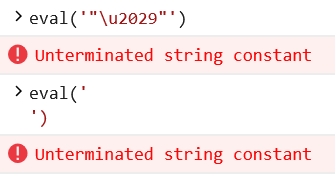
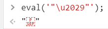

EcmaScript 10 — JavaScript в этом году

Стандартизация JS перешла на годичный цикл обновлений, а начало года — отличное время для того чтобы узнать, что нас ждёт в юбилейной — уже десятой редакции EcmaScript!

_ES_9 — [актуальная версия спецификации](https://www.ecma-international.org/publications/standards/Ecma-262.htm).

_ES_10 — всё ещё [черновик](https://tc39.github.io/ecma262/).

На сегодняшний день в [_Stage_ **4** #](https://habr.com/ru/post/437806/#-stage-4) — всего несколько предложений.

А в [_Stage_ **3** #](https://habr.com/ru/post/437806/#-stage-3) — целая дюжина!

Из них, на мой взгляд, самые интересные — [приватные поля классов #](https://habr.com/ru/post/437806/#privatnyestaticheskiepublichnye-metodysvoystvaatributy-u-klassov), [шебанг грамматика для скриптов #](https://habr.com/ru/post/437806/#shebang-grammatika), [числа произвольной точности #](https://habr.com/ru/post/437806/#bolshie-chisla-s-bigint), [доступ к глобальному контексту #](https://habr.com/ru/post/437806/#globalthis--novyy-sposob-dostupa-k-globalnomu-kontekstu) и [динамические импорты #](https://habr.com/ru/post/437806/#dinamicheskiy-importdynamic).

   
  
        Автор фото: kasper.green; Жёлтый магнит: elfafeya.art & kasper.green

## Содержание

  

### [Пять стадий #](https://habr.com/ru/post/437806/#pyat-stadiy)

  

### [Stage 4 — Final #](https://habr.com/ru/post/437806/#-stage-4)

•      [`**catch**` — аргумент стал необязательным #](https://habr.com/ru/post/437806/#neobyazatelnyy-argument-u-catch);

•      [`**Symbol().description**` — акцессор к описанию символа #](https://habr.com/ru/post/437806/#dostup-k-opisaniyu-simvolnoy-ssylki);

•      [`**'строки EcmaScript'**` — улучшенная совместимость с **JSON** форматом #](https://habr.com/ru/post/437806/#stroki-ecmascript-sovmestimye-s-json);

•      [`**.toString()**` — прототипный метод обновлён #](https://habr.com/ru/post/437806/#dorabotka-prototipnogo-metoda-tostring).

  

* * *

  

### [Stage 3 — Pre-release #](https://habr.com/ru/post/437806/#-stage-3)

•      [`**#**` — приватное всё у классов, через октоторп #](https://habr.com/ru/post/437806/#privatnyestaticheskiepublichnye-metodysvoystvaatributy-u-klassov);

•      [`**#!/usr/bin/env node**` — шебанг грамматика для скриптов #](https://habr.com/ru/post/437806/#shebang-grammatika);

•      [`**BigInt()**` — новый примитив, для чисел произвольной точности #](https://habr.com/ru/post/437806/#bolshie-chisla-s-bigint);

•      [`**globalThis**` — новый способ доступа к глобальному контексту #](https://habr.com/ru/post/437806/#globalthis--novyy-sposob-dostupa-k-globalnomu-kontekstu);

•      [`**import(dynamic)**` — динамический импорт #](https://habr.com/ru/post/437806/#dinamicheskiy-importdynamic);

•      [`**import.meta**` — мета-информация о загружаемом модуле #](https://habr.com/ru/post/437806/#importmeta--meta-informaciya-o-zagruzhaemom-module);

•      [`**Object.fromEntries()**` — создание объекта из массива пар — ключ\\значение #](https://habr.com/ru/post/437806/#sozdanie-obekta-metodom-objectfromentries);

•      [`**JSON.stringify()**` — фикс метода #](https://habr.com/ru/post/437806/#fiks-metoda-jsonstringify);

•      [`**RegExp**` — устаревшие возможности #](https://habr.com/ru/post/437806/#ustarevshie-vozmozhnosti-regexp);

•      [`**.trimStart()**` и **`.trimEnd()`** — прототипные методы строк #](https://habr.com/ru/post/437806/#prototipnye-metody-strok-trimstart-i-trimend);

•      [`**.matchAll()**` — **`.match()`** с глобальным флагом #](https://habr.com/ru/post/437806/#matchall--novyy-prototipnyy-metod-strok);

•      [`**.flat()**` и **`.flatMap()`** — прототипные методы массивов #](https://habr.com/ru/post/437806/#odnomernye-massivy-s-flat-i-flatmap).

  

### [Итоги #](https://habr.com/ru/post/437806/#itogi)

  

* * *

  

## Пять стадий

   _Stage_ **0**   ↓   **Strawman**  **Наметка**           Идея, которую можно реализовать через **Babel**-плагин.;

   _Stage_ **1**   ↓   **Proposal**  **Предложение**     Проверка жизнеспособности идеи.;

   _Stage_ **2**   ↓   **Draft**  **Черновик**                  Начало разработки спецификации.;

   _Stage_ **3**   ↓   **Candidate**  **Кандидат**         Предварительная версия спецификации.;

   _Stage_ **4**  ֍  **Finished**  **Завершён**           Финальная версия спецификации на этот год.

  

* * *

Мы рассмотрим только _Stage_ **4** — де-факто, вошедший в стандарт.

И _Stage_ **3** — который вот-вот станет его частью.

  

* * *

  
  

## ֍ Stage 4

Эти изменения уже вошли в стандарт.

  

### Необязательный аргумент у `catch`

[https://github.com/tc39/proposal-optional-catch-binding](https://github.com/tc39/proposal-optional-catch-binding)

До _ES_10 блок `catch` требовал обязательного аргумента для сбора информации об ошибке, даже если она не используется:

  

    function isValidJSON(text) {
      try {
        JSON.parse(text);
        return true;
      } catch(unusedVariable) { 
        return false;
      }
    }

  
_Edge_ пока не обновлён до _ES_10, и ожидаемо валится с ошибкой

Начиная с редакции _ES_10, круглые скобки можно опустить и `catch` станет как две капли воды похож на `try`.

  
Мой Chrome уже обновился до _ES_10, а местами и до _Stage_ **3**. Дальше скриншоты будут из _Chrome_

  

**исходный код**

    function isValidJSON(text) {
      try {
        JSON.parse(text);
        return true;
      } catch { 
        return false;
      }
    }

  
  

## Доступ к описанию символьной ссылки

[https://tc39.github.io/proposal-Symbol-description/](https://tc39.github.io/proposal-Symbol-description/)

Описание символьной ссылки можно косвенно получить методом toString():

  

    const symbol_link = Symbol("Symbol description")
    String(symbol_link) 

Начиная с _ES_10 у символов появилось свойство description, доступное только для чтения. Оно позволяет без всяких танцев с бубном получить описание символа:

  

    symbol_link.description
    

В случае если описание не задано, вернётся — `undefined`:

  

    const without_description_symbol_link = Symbol()
    without_description_symbol_link.description
    
    
    const empty_description_symbol_link = Symbol('')
    empty_description_symbol_link.description
    

  
  

### Строки EcmaScript совместимые с JSON

[https://github.com/tc39/proposal-json-superset](https://github.com/tc39/proposal-json-superset)

EcmaScript до десятой редакции утверждает, что _JSON_ является подмножеством `JSON.parse`, но это неверно.

_JSON_ строки могут содержать неэкранированные символы разделителей линий **`U+2028`** _LINE SEPARATOR_ и абзацев **`U+2029`** _PARAGRAPH SEPARATOR_.

Строки _ECMAScript_ до десятой версии — нет.

Если в _Edge_ вызвать `eval()` со строкой `"\u2029"`,  
он ведёт себя так, словно мы сделали перенос строки — прямо посреди кода:

  

C _ES_10 строками — всё в порядке:

  
  

### Доработка прототипного метода `.toString()`

[http://tc39.github.io/Function-prototype-toString-revision/](http://tc39.github.io/Function-prototype-toString-revision/)

  

**Цели изменений**

*   убрать обратно несовместимое требование:

  

> Если реализация не может создать строку исходного кода, соответствующую этим критериям, она должна вернуть строку, для которой eval будет выброшено исключение с ошибкой синтаксиса.

  

*   уточнить «функционально эквивалентное» требование;
    
      
    
*   стандартизировать строковое представление встроенных функций и хост-объектов;
    
      
    
*   уточнить требования к представлению на основе «фактических характеристик» объекта;
    
      
    
*   убедиться, что синтаксический анализ строки содержит то же тело функции и список параметров, что и оригинал;
    
      
    
*   для функций, определенных с использованием кода ECMAScript, toString должен возвращать фрагмент исходного текста от начала первого токена до конца последнего токена, соответствующего соответствующей грамматической конструкции;
    
      
    
*   для встроенных функциональных объектов toStringне должны возвращать ничего, кроме NativeFunction;
    
      
    
*   для вызываемых объектов, которые не были определены с использованием кода ECMAScript, toString необходимо вернуть NativeFunction;
    
      
    
*   для функций, создаваемых динамически (конструкторы функции или генератора) toString, должен синтезировать исходный текст;
    
      
    
*   для всех других объектов, toString должен бросить TypeError исключение.
    
      
    

  

    
    function () { console.log('My Function!'); }.toString();
    
    
    
    Number.parseInt.toString();
    
    
    
    function () { }.bind(0).toString();
    
    
    
    Symbol.toString();
    
    
    
    Function().toString();
    
    
    
    function* () { }.toString();
    
    
    
    Function.prototype.toString.call({});
    

  

* * *

  
  

## ֍ Stage 3

Предложения вышедшие из статуса черновика, но ещё не вошедшие в финальную версию стандарта. 

  

### Приватные\\статические\\публичные методы\\свойства\\атрибуты у классов

[https://github.com/tc39/proposal-class-fields](https://github.com/tc39/proposal-class-fields)  
[https://github.com/tc39/proposal-private-methods](https://github.com/tc39/proposal-private-methods)  
[https://github.com/tc39/proposal-static-class-features](https://github.com/tc39/proposal-static-class-features)  

В некоторых языках есть договорённость, называть приватные методы через видимый пробел ( «**_**» — такая_штука, ты можешь знать этот знак под неверным названием — нижнее подчёркивание).

Например так:

  

    <?php
    class AdultContent {
        private $_age = 0;
        private $_content = '…is dummy example content (•)(•) —3 (.)(.) only for adults…';
        function __construct($age) {
            $this->_age = $age;
        }
        function __get($name) {
            if($name === 'content') {
                return " (age: ".$this->_age.") → ".$this->_getContent()."\r\n";
            }
            else {
                return 'without info';
            }
        }
        private function _getContent() {
            if($this->_contentIsAllowed()) {
                return $this->_content;
            }
            return 'Sorry. Content not for you.';
        }
        private function _contentIsAllowed() {
            return $this->_age >= 18;
        }
        function __toString() {
            return $this->content;
        }
    }
    echo "<pre>";
    
    echo strval(new AdultContent(10));
    
    
    echo strval(new AdultContent(25));
    
    
    $ObjectAdultContent = new AdultContent(32);
    echo $ObjectAdultContent->content;
    
    ?>
    

Напомню — это только договорённость. Ничто не мешает использовать префикс для других целей, использовать другой префикс, или не использовать вовсе.

Лично мне импонирует идея использовать видмый пробел в качестве префикса для функций, возвращающих `this`. Так их можно объединять в цепочку вызовов.

Разработчики спецификации _EcmaScript_ пошли дальше и сделали префикс-**октоторп** ( «**#**» —решётка, хеш ) частью синтаксиса.

Предыдущий пример на _ES_10 можно переписать следующим образом:

  

    export default class AdultContent {
    
      
      #age = 0
      #adult_content = '…is dummy example content (•)(•) —3 (.)(.) only for adults…'
    
      constructor(age) {
        this.#setAge(age)
      }
    
      
      static #userIsAdult(age) {
        return age > 18
      }
    
      
      get content () {
        return `(age: ${this.#age}) → ` + this.#allowed_content
      }
    
      
      get #allowed_content() {
          if(AdultContent.userIsAdult(this.age)){
            return this.#adult_content
        }
        else {
            return 'Sorry. Content not for you.'
        }
      }
    
      
      #setAge(age) {
          this.#age = age
      }
    
      toString () {
        return this.#content
      }
    }
    
    const AdultContentForKid = new AdultContent(10)
    
    console.log(String(AdultContentForKid))
    
    
    console.log(AdultContentForKid.content)
    
    
    const AdultContentForAdult = new AdultContent(25)
    
    console.log(String(AdultContentForAdult))
    
    
    console.log(AdultContentForAdult.content)
    
    

Пример излишне усложнён для демонстрации приватных свойств, методов и атрибутов разом. Но в целом JS — радует глаз своей лаконичностью по сравнению с PHP вариантом. Никаких тебе private function _..., ни точек с запятой в конце строки, и точка вместо «->» для перехода вглубь объекта.

Геттеры именованные. Для динамических имён — прокси-объекты.

Вроде бы мелочи, но после перехода на JS, всё меньше желания возвращаться к PHP.

К слову приватные акцессоры доступны только с Babel 7.3.0 и старше.

Крайняя версия на npmjs.com — 7.2.2

Ждём в Stage 4!

  
  

### Шебанг грамматика

[https://github.com/tc39/proposal-hashbang](https://github.com/tc39/proposal-hashbang)

Хешбэнг — знакомый юниксойдам способ указать интерпретатор для исполняемого файла:

  

    #!/usr/bin/env node
    
    'use strict';
    console.log(1);

  

    #!/usr/bin/env node
    
    export {};
    console.log(1);

в данный момент, на подобный фортель, _Chrome_ выбрасывает `SyntaxError: Invalid or&nbsp;unexpected token`

  

### Большие числа с BigInt

[https://github.com/tc39/proposal-bigint](https://github.com/tc39/proposal-bigint)

_работает в Chrome_

Максимальное целое число, которое можно безопасно использовать в JavaScript (2⁵³ — 1):

  

    console.log(Number.MAX_SAFE_INTEGER)
    

BigInt нужен для использования чисел произвольной точности.

Объявляется этот тип несколькими способами:

  

    
    910000000000000100500n
    
    
    
    BigInt( 910000000000000200500 )
    
    
    
    BigInt( "910000000000000300500" )
    
    
    
    BigInt( "9999999999999999999999999999999999999999999999999999999999999999999999999999999999999999999999999999999999999999999999999999999999999999999999999999999999999999999999999999999999999999999999999999999999999999999999999999999999999999999999999999999999999999999999999999999999999999999999999999999999999999999999999999999999999999999999999999999999999999999999999999999999999999999999999999999999999999999999999999999999999999999999999999999999999999999999999999999999999999999999999999999999999999999999999999999999999999999999999999999999999999999999999999999999999999999999999999999999999999999999999999999999999999999999999999999999999999999999999999999999999999999999999999999999999999999999999999999999999999999999999999999999999999999999999999999999999999999999999999999999999999999999999999999999999999999999999999999999999999999999999999999999999999999999999999999999999999999999999999999999999999999999999999999999999999999999999999999999999999999999999999999999999999999999999999999999999999999999999999999999999999999999999999999999999999999999999999999999999999999999999999999999999999999999999999999999999999999999999999999999999999999999999999999999999999999999999999999999999999999999999999999999999999999999999999999999999999999999999999999999999999999999999999999999999999999999999999999999999999999999999999999999999999999999999999999999999999999999999999999999999999999999999999999999999999999999999999999999999999999999999999999999999999999999" )
    \\ 9999999999999999999999999999999999999999999999999999999999999999999999999999999999999999999999999999999999999999999999999999999999999999999999999999999999999999999999999999999999999999999999999999999999999999999999999999999999999999999999999999999999999999999999999999999999999999999999999999999999999999999999999999999999999999999999999999999999999999999999999999999999999999999999999999999999999999999999999999999999999999999999999999999999999999999999999999999999999999999999999999999999999999999999999999999999999999999999999999999999999999999999999999999999999999999999999999999999999999999999999999999999999999999999999999999999999999999999999999999999999999999999999999999999999999999999999999999999999999999999999999999999999999999999999999999999999999999999999999999999999999999999999999999999999999999999999999999999999999999999999999999999999999999999999999999999999999999999999999999999999999999999999999999999999999999999999999999999999999999999999999999999999999999999999999999999999999999999999999999999999999999999999999999999999999999999999999999999999999999999999999999999999999999999999999999999999999999999999999999999999999999999999999999999999999999999999999999999999999999999999999999999999999999999999999999999999999999999999999999999999999999999999999999999999999999999999999999999999999999999999999999999999999999999999999999999999999999999999999999999999999999999999999999999999999999999999999999999999999999999999999999999999999999999n

Это новый примитивный тип:

  

    typeof 123;
    
    typeof 123n;
    

Его можно сравнивать с обычными числами:

  

    42n === BigInt(42);
    
    42n == 42;
    

Но математические операции нужно проводить в пределах одного типа:

  

    20000000000000n/20n
    
    
    20000000000000n/20
    
    

Поддерживается унарный минус, унарный плюс возвращает ошибку:

  

     -2n
     
    
     +2n
     
    

  
  

### `globalThis` — новый способ доступа к глобальному контексту

[https://github.com/tc39/proposal-global](https://github.com/tc39/proposal-global)

_работает в Chrome_

Поскольку реализации глобальной области видимости зависят от конкретного движка, раньше приходилось делать что-то вроде этого:

  

    var getGlobal = function () {
        if (typeof self !== 'undefined') { return self; }
        if (typeof window !== 'undefined') { return window; }
        if (typeof global !== 'undefined') { return global; }
        throw new Error('unable to locate global object');
    };

И даже такой вариант не гарантировал, что всё точно будет работать.

`globalThis` — общий для всех платформ способ доступа к глобальной области видимости:

  

    
    globalThis.Array(1,2,3)
    
    
    
    globalThis.myGLobalSettings = {
        it_is_cool: true
    }
    
    
    globalThis.myGLobalSettings
    

  
  

### Динамический `import(dynamic)`

[https://github.com/tc39/proposal-dynamic-import](https://github.com/tc39/proposal-dynamic-import)

_работает в Chrome_

Хотелось переменные в строках импорта‽ С динамическими импортами это стало возможно:

  

    import(`./language-packs/${navigator.language}.js`)

Динамический импорт — асинхронная операция. Возвращает промис, который после загрузки модуля возвращает его в функцию обратного вызова.

Поэтому загружать модули можно — отложенно, когда это необходимо:

  

    element.addEventListener('click', async () => {
        
        const module = await import(`./events_scripts/supperButtonClickEvent.js`)
        module.clickEvent()
    })

Синтаксически, это выглядит как вызов функции `import()`, но не наследуется от `Function.prototype`, а значит вызвать через `call` или `apply` — не удастся:

  

    import.call("example this", "argument")
    

  
  

### import.meta — мета-информация о загружаемом модуле.

[https://github.com/tc39/proposal-import-meta](https://github.com/tc39/proposal-import-meta)

_работает в Chrome_

В коде загружаемого модуля стало возможно получить информацию по нему. Сейчас это только адрес по которому модуль был загружен:

  

    console.log(import.meta);
    

  
  

### Создание объекта методом `Object.fromEntries()`

[https://github.com/tc39/proposal-object-from-entries](https://github.com/tc39/proposal-object-from-entries)

Аналог `_.fromPairs` из `lodash`:

  

    Object.fromPairs([['key_1', 1], ['key_2', 2]])
    

  
  

### Фикс метода `JSON.stringify()`

[https://github.com/tc39/proposal-well-formed-stringify](https://github.com/tc39/proposal-well-formed-stringify)

В разделе [8.1 RFC 8259](https://tools.ietf.org/html/rfc8259#section-8.1) требуется, чтобы текст _JSON_, обмениваемый за пределами замкнутой экосистемы, кодировался с использованием UTF-8, но JSON.stringify может возвращать строки, содержащие кодовые точки, которые не представлены в UTF-8 (в частности, суррогатные кодовые точки от U+D800 до U+DFFF)

Так строка `\uDF06\uD834` после обработки JSON.stringify() превращается в `\\udf06\\ud834`:

  

    
    JSON.stringify('\uDF06\uD834')
    '"\\udf06\\ud834"'
    JSON.stringify('\uDEAD')
    '"\\udead"'

Такого быть не должно, и новая спецификация это исправляет. _Edge_ и _Chrome_ уже обновились.

  
  

### Устаревшие возможности RegExp

[https://github.com/tc39/proposal-regexp-legacy-features](https://github.com/tc39/proposal-regexp-legacy-features)

Спецификация для устаревших функций _RegExp_, вроде `RegExp.$1`, и `RegExp.prototype.compile()` метода.

  
  

### Прототипные методы строк `.trimStart()` и `.trimEnd()`

[https://github.com/tc39/proposal-string-left-right-trim](https://github.com/tc39/proposal-string-left-right-trim)

_работает в Chrome_

По аналогии с методами `.padStart()` и `.padEnd()`, обрезают пробельные символы в начале и конце строки соответственно:

  

    const one = "      hello and let ";
    const two = "us begin.        ";
    console.log( one.trimStart() + two.trimEnd() )
    

  
  

### .matchAll() — новый прототипный метод строк.

[https://github.com/tc39/proposal-string-matchall](https://github.com/tc39/proposal-string-matchall)

_работает в Chrome_

Работает похоже на метод `.match()` с включенным флагом `g`, но возвращает итератор:

  

    const string_for_searh = 'olololo'
    
    
    string_for_searh.match(/o/)
    
    
    
    string_for_searh.match(/o/g)
    
    
    
    string_for_searh.matchAll(/o/)
    
    
    
    
    for(const item of string_for_searh.matchAll(/o/)) {
      console.log(item)
    }
    
    
    
    

Аргумент должен быть регулярным выражением, иначе будет выброшено исключение:

  

    'olololo'.matchAll('o')
    

  
  

### Одномерные массивы с `.flat()` и `.flatMap()`

[https://github.com/tc39/proposal-flatMap](https://github.com/tc39/proposal-flatMap)

_работает в Chrome_

Массив обзавёлся прототипами `.flat()` и `.flatMap()`, которые в целом похожи на реализации в _lodash_,  
но всё же имеют некоторые отличия. Необязательный аргумент — устанавливает максимальную глубину обхода дерева:

  

    const deep_deep_array = [
      '≥0 — первый уровень',
      [
        '≥1 — второй уровень',
        [
          '≥2 — третий уровень',
          [
            '≥3 — четвёртый уровень',
            [
              '≥4 — пятый уровень'
            ]
          ]
        ]
      ]
    ]
    
    
    deep_deep_array.flat(0)
    
    
    
    deep_deep_array.flat()
    
    
    deep_deep_array.flat(2)
    
    
    deep_deep_array.flat(100500)
    

`.flatMap()` не эквивалентен последовательному вызову `.flat().map()`. Функция обратного вызова, передаваемая в метод, должна возвращать массив который станет частью общего плоского массива:

  

    ['Hello', 'World'].flatMap(word => [...word])
    

  
  

* * *

  
  

## Итоги

_Stage_ **4** привнёс скорее косметические изменения. Интерес представляет _Stage_ **3**. Большинство из предложений в _Chrome_ уже реализованы, за исключением пожалуй `Object.fromEntries()`, наличие которого не критично, а приватные свойства очень ждём.

  
  

* * *

  
  

## Исправления в статье

   
Если заметил в статье неточность, ошибку или есть чем дополнить — ты можешь написать мне [личное сообщение](https://habr.com/ru/conversations/KasperGreen/), а лучше самому воспользоваться репозиторием статьи [https://github.com/KasperGreen/es10](https://github.com/KasperGreen/es10)

  

## Материалы по теме

[Актуальная версия стандарта Ecma-262](https://www.ecma-international.org/publications/standards/Ecma-262.htm)

[Черновик следующей версии стандарта Ecma-262](https://tc39.github.io/ecma262/)

[ECMAScript](https://ru.wikipedia.org/wiki/ECMAScript)

[Новые #приватные поля классов в JavaScript](https://medium.com/devschacht/javascripts-new-private-class-fields-c60daffe361b)

[Обзор возможностей стандартов ES7, ES8 и ES9](https://habr.com/ru/company/ruvds/blog/431872/)

[Шебанг](https://ru.wikipedia.org/wiki/%D0%A8%D0%B5%D0%B1%D0%B0%D0%BD%D0%B3_(Unix))

[BigInt — длинная арифметика в JavaScript](https://habr.com/ru/post/354930/)

  

* * *

  

  
       Автор фото: kasper.green; Жёлтый магнит: elfafeya.art & kasper.green