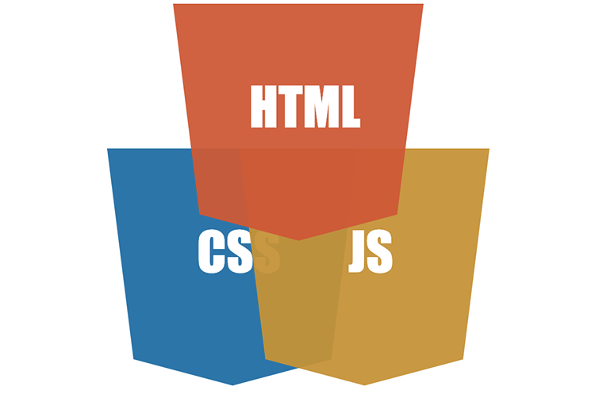
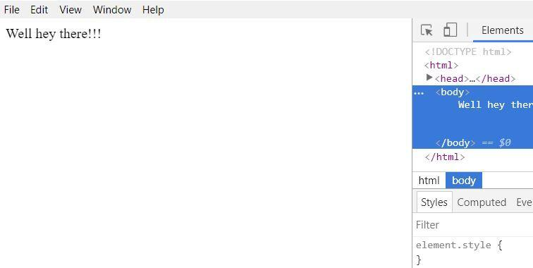
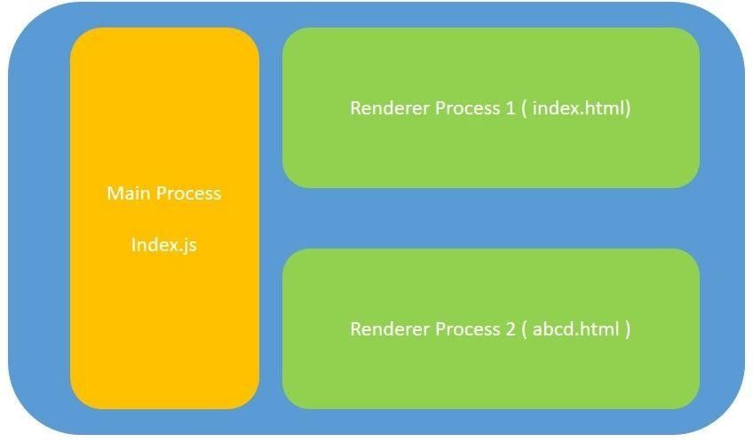
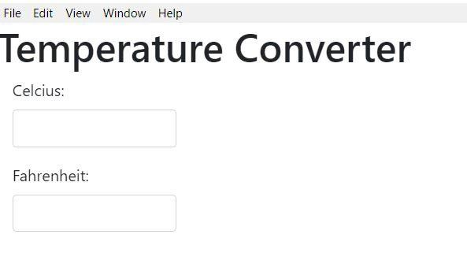

Electron: разработка настольных приложений с использованием HTML, CSS и JavaScript / Блог компании RUVDS.com

Можно ли, используя HTML, CSS и JavaScript, создавать настольные приложения? Автор статьи, перевод которой мы сегодня публикуем, даёт утвердительный ответ на этот вопрос. Здесь он расскажет о том, как, применяя веб-технологии и пользуясь возможностями фреймворка Electron, создавать кроссплатформенные приложения для настольных операционных систем.

  

## Electron

[Electron](https://electronjs.org/) — это фреймворк для разработки настольных приложений с использованием HTML, CSS и JavaScript. Такие приложения могут работать на различных платформах. Среди них — Windows, Mac и Linux.

В основе Electron лежат проекты Chromium и Node.js, объединённые в единую среду, обеспечивающую работу приложений. Это даёт возможность применять веб-технологии при разработке настольных программ.

Electron — серьёзный проект, который использован при создании множества популярных приложений. Среди них — мессенджеры Skype и Discord, редакторы для кода Visual Studio Code и Atom, а также — ещё более 700 [приложений](https://electronjs.org/apps), сведения о которых опубликованы на сайте Electron.

## Electron Forge

Для разработки приложения с использованием Electron этот фреймворк надо настроить. Это касается и тех случаев, когда в приложении планируется применять другие фреймворки или библиотеки, например — Angular, React, Vue, или что-то другое.

Инструмент командной строки [Electron Forge](https://electronforge.io/) позволяет серьёзно упростить процесс настройки Electron. Он даёт в распоряжение разработчика шаблоны приложений, основанных на Angular, React, Vue, и на других фреймворках. Это избавляет программиста от необходимости настраивать всё вручную.

Кроме того, Electron Forge упрощает сборку и упаковку приложения. На самом деле, это средство обладает и многими другими полезными возможностями, узнать о которых можно из его [документации](https://docs.electronforge.io/).

Рассмотрим процесс разработки простого приложения на Electron с использованием Electron Forge.

## Предварительная подготовка

Для того чтобы приступить к разработке Electron-приложений с использованием Electron Forge вам понадобится система с установленной платформой Node.js. Загрузить её можно [здесь](https://nodejs.org/en/).

Для глобальной установки Electron Forge можно воспользоваться следующей командой:

    npm install -g electron-forge

  

## Создание шаблонного приложения

Для того чтобы создать шаблонное приложение с использованием Electron Forge выполним следующую команду:

    electron-forge init simple-desktop-app-electronjs

Эта команда инициализирует новый проект приложения, имя которого — `simple-desktop-app-electronjs`. На выполнение этой команды понадобится некоторое время. После того, как шаблонное приложение будет создано, запустить его можно так:

    cd simple-desktop-app-electronjs
    npm start

Здесь мы переходим в его папку и вызываем соответствующий npm-скрипт.

После этого должно открыться окно, содержимое которого похоже на то, что показано на следующем рисунке.

  
_Окно приложения, созданного средствами Electron Forge_

Поговорим о том, как устроено это приложение.

## Структура шаблонного приложения

Материалы, из которых состоит шаблонное приложение, создаваемое средствами Electron Forge, представлены набором файлов и папок. Рассмотрим важнейшие составные части приложения.

### ▍Файл package.json

Этот файл содержит сведения о создаваемом приложении, о его зависимостях. В нём имеется описание нескольких скриптов, один из которых, `start`, использовался для запуска приложения. Новые скрипты в этот файл можно добавлять и самостоятельно.

В разделе файла `config.forge` можно найти специфические настройки для Electron. Например, раздел `make_targets` содержит подразделы, описывающие цели сборки проекта для платформ Windows (`win32`), Mac (`darwin`) и Linux (`linux`).

В `package.json` можно найти и запись следующего содержания: `"main": "src/index.js"`, которая указывает на то, что точкой входа в приложение является файл, расположенный по адресу `src/index.js`.

### ▍Файл src/index.js

В соответствии со сведениями, находящимися в `package.json`, основным скриптом приложения является `index.js`. Процесс, который выполняет этот скрипт, называется основным процессом (main process). Этот процесс управляет приложением. Он используется при формировании интерфейса приложения, в основе которого лежат возможности браузера. На нём же лежит ответственность за взаимодействие с операционной системой. Интерфейс приложения представлен веб-страницами. За вывод веб-страниц и за выполнение их кода отвечает процесс рендеринга (renderer process).

### ▍Основной процесс и процесс рендеринга

Цель основного процесса заключается в создании окон браузера с использованием экземпляра объекта `BrowserWindow`. Этот объект использует процесс рендеринга для организации работы веб-страниц.

У каждого Electron-приложения может быть лишь один основной процесс, но процессов рендеринга может быть несколько. Кроме того, можно наладить взаимодействие между основным процессом и процессами рендеринга, об этом мы, правда, здесь говорить не будем. Вот схема архитектуры приложения, основанного на Electron, на которой представлен основной процесс и два процесса рендеринга.

  
_Архитектура Electron-приложения_

На этой схеме показаны две веб-страницы — `index.html` и `abcd.html`. В нашем примере будет использоваться лишь одна страница, представленная файлом `index.html`.

### ▍Файл src/index.html

Скрипт из `index.js` загружает файл `index.html` в новый экземпляр `BrowserWindow`. Если описать этот процесс простыми словами, то оказывается, что `index.js` создаёт новое окно браузера и загружает в него страницу, описанную в файле `index.html`. Эта страница выполняется в собственном процессе рендеринга.

### ▍Разбор кода файла index.js

Код файла `index.js` хорошо прокомментирован. Рассмотрим его важнейшие части. Так, следующий фрагмент кода функции `createWindow()` создаёт экземпляр объекта `BrowserWindow`, загружает в окно, представленное этим объектом, файл `index.html` и открывает инструменты разработчика.

    // Создаём окно браузера.
    mainWindow = new BrowserWindow({
      width: 800,
      height: 600,
    });
    
    // и загружаем в него файл приложения index.html.
    mainWindow.loadURL(`file://${__dirname}/index.html`);
    // Открываем инструменты разработчика.
    mainWindow.webContents.openDevTools();

В готовом приложении строку кода, открывающую инструменты разработчика, имеет смысл закомментировать.

В коде этого файла часто встречается объект `app`. Например — в следующем фрагменте:

    // Этот метод будет вызван после того, как Electron завершит
    // инициализацию и будет готов к созданию окон браузера.
    // Некоторые API можно использовать только после возникновения этого события.
    app.on('ready', createWindow);

Объект `app` используется для управления жизненным циклом приложения. В данном случае после завершения инициализации Electron вызывается функция, ответственная за создание окна приложения.

Объект `app` используется и для выполнения других действий при возникновении различных событий. Например, с его помощью можно организовать выполнение неких операций перед закрытием приложения.

Теперь, когда мы ознакомились со структурой Electron-приложения, рассмотрим пример разработки такого приложения.

## Разработка настольного приложения — конвертера температур

В качестве основы для этого учебного приложения воспользуемся ранее созданным шаблонным проектом `simple-desktop-app-electronjs`.

Для начала установим пакет Bootstrap, воспользовавшись, в папке проекта, следующей командой:

    npm install bootstrap --save

Теперь заменим код файла `index.html` на следующий:

    <!DOCTYPE html>
    <html>
      <head>
        <meta charset="utf-8">
        <title>Temperature Converter</title>
        <link rel="stylesheet" type="text/css" href="../node_modules/bootstrap/dist/css/bootstrap.min.css">
    
      </head>
      <body>
        <h1>Temperature Converter</h1>
        

          <label for="usr">Celcius:</label>
          <input type="text" class="form-control" id="celcius" onkeyup="celciusToFahrenheit()">
        

        

          <label for="pwd">Fahrenheit:</label>
          <input type="text" class="form-control" id="fahrenheit" onkeyup="fahrenheitToCelcius()">
        

        
      </body>
      </body>
    </html>

Вот как работает этот код:

1.  Здесь создаётся текстовое поле с идентификатором `celcius`. Когда пользователь вводит в это поле некое значение, которое должно представлять собой температуру в градусах Цельсия, вызывается функция `celciusToFahrenheit()`.
2.  Текстовое поле с идентификатором `fahrenheit`, также создаваемое в этом коде, принимает данные от пользователя, которые должны представлять собой температуру в градусах Фаренгейта, после чего вызывается функция `fahrenheitToCelcius()`.
3.  Функция `celciusToFahrenheit()` конвертирует температуру, выраженную в градусах Цельсия и введённую в поле `celcius`, в температуру в градусах Фаренгейта, после чего выводит то, что у неё получилось, в поле `fahrenheit`.
4.  Функция `fahrenheitToCelcius()` выполняет обратное преобразование — берёт значение температуры, выраженное в градусах Фаренгейта и введённое в поле `fahrenheit`, преобразует его в значение, выраженное в градусах Цельсия, после чего записывает то, что у неё получилось, в поле `сelcius`.

Две функции, о которых мы только что говорили, объявлены в файле `renderer.js`. Этот файл нужно создать в папке `src` и поместить в него следующий код:

    function celciusToFahrenheit(){
        let celcius = document.getElementById('celcius').value;
        let fahrenheit = (celcius* 9/5) + 32;
        document.getElementById('fahrenheit').value = fahrenheit;
    
    }
    
    function fahrenheitToCelcius(){
        let fahrenheit = document.getElementById('fahrenheit').value;
        let celcius = (fahrenheit - 32) * 5/9
        document.getElementById('celcius').value = celcius;
    }

Как видите, каждая из этих функций получат значение соответствующего поля страницы, выполняет преобразование полученного значения и записывает то, что получилось, в другое поле. Функции это очень простые, в частности, значения, с которыми они работают, никак не проверяются, но в нашем случае это неважно.

Будем считать, что приложение готово. Испытаем его.

## Запуск приложения

Для того чтобы запустить приложение, воспользуемся следующей командой:

    npm start

После её успешного выполнения будет открыто окно приложения со следующим содержимым.

  
_Окно приложения-конвертера_

Поэкспериментируйте с приложением, вводя в поля различные значения.  
Теперь, когда мы убедились в том, что приложение работает так, как ожидается, пришло время его упаковать.

## Упаковка приложения

Для того чтобы упаковать приложение, воспользуйтесь следующей командой:

    npm run package

На выполнение этой команды системе понадобится некоторое время. После того, как её работа завершится, загляните в папку `out`, которая появится в папке проекта.

Эксперимент по разработке Electron-приложения, описанный здесь, проводился на компьютере, работающем под управлением ОС Windows. Поэтому в папке `out` была создана папка `simple-desktop-app-electronjs-win32-x64`. В этой папке, кроме прочего, можно найти `.exe`-файл приложения. В нашем случае он называется `simple-desktop-app-electronjs.exe`. Для запуска приложения достаточно обычного двойного щелчка мышью по этому файлу.

Разберём имя папки, в которую попал исполняемый файл приложения. А именно, он построен по шаблону `имя приложения - платформа - архитектура`. В нашем случае его структура раскрывается так:

*   Имя приложения — `simple-desktop-app-electronjs`.  
    
*   Платформа — `win32`.  
    
*   Архитектура — `x64`.  
    

Обратите внимание на то, что при вызове команды `npm run package` без параметров, по умолчанию, создаётся исполняемый файл приложения для той платформы, которая используется в ходе разработки.

Предположим, вам нужно упаковать приложение для какой-то другой платформы и архитектуры. Для этого можно воспользоваться расширенным вариантом вышеописанной команды. Структура этой команды выглядит так:

    npm run package -- --platform=<platform> arch=<architecture>

Например, для того чтобы сформировать пакет приложения для Linux, можно воспользоваться следующей командой:

    npm run package -- --platform=linux --arch=x64

После завершения её работы в папке проекта `out` появится директория `simple-desktop-app-electronjs-linux-x64` с соответствующим содержимым.

## Создание установочных файлов приложений

Для того чтобы создать установочный файл приложения воспользуйтесь следующей командой:

    npm run make

Результаты её работы окажутся в уже знакомой вам папке `out`. А именно, запуск этой команды в вышеприведённом виде на Windows-машине приведёт к созданию установочного файла приложения для Windows в папке `out\make\squirrel.windows\x64`. Как и команда `package`, команда `make`, вызванная без параметров, создаёт установщик для платформы, используемой при разработке.

## Итоги

В этом материале мы рассмотрели основы архитектуры Electron-приложений и написали [простую программу](https://github.com/aditya-sridhar/simple-desktop-app-electronjs). Если вы подумывали о том, чтобы разработать собственное приложение, основанное на Electron, теперь у вас есть базовые знания, самостоятельно расширив и дополнив которые, вы сможете создать то, что вам хочется.

**Уважаемые читатели!** Пользуетесь ли вы фреймворком Electron для разработки настольных приложений?

