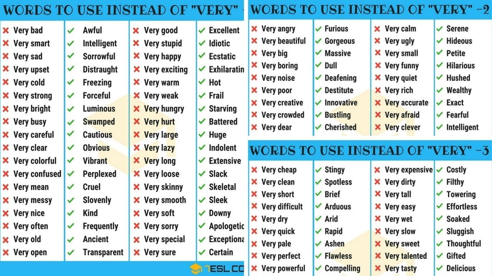

English notes #1: Заканчивай с этим «very» / Блог компании Флант

_Прим. ред.: Этой статьёй мы начинаем цикл публикаций, посвящённых английскому языку и подготовленных нашим штатным учителем для инженеров компании (в данном случае — на основе [видеоурока engVid, JamesESL English Lessons](https://www.youtube.com/watch?v=PCoyTwltu5g)). С одной стороны — нам нужно изучать язык, с другой — нравится это делать, а с третьей — почему бы не разбавить технические материалы своего блога? Ваши отзывы очень приветствуются!_

Слово «very» очень популярно в английском языке, да и не только. Однако, употребляя его слишком часто, вы можете прослыть косноязычным или попросту [Эллочкой-людоедочкой](https://www.youtube.com/watch?v=q2u0-dzHQWA).

Как известно, в великом романе-эпопее «Война и Мир» Лев Николаевич не совершает повторов на протяжении каждых трех страниц(!). Не это ли искусство? Однако, не будем долго мечтать — let's get down to business.

Итак, многие мои студенты спрашивают, зачем мне, собственно, заменять такое универсальное «very»? Так вот — например, потому что:

1.  Ваша речь зазвучит совсем иначе. Она станет более глубокой и разнообразной.
2.  Вы еще на шаг приблизитесь к тому, чтобы звучать как носитель языка. А это ли не повод для гордости?
3.  Вы улучшите также письменные навыки. Повторы бросаются в глаза, а вы, зная, как заменить пресловутое «very», явно будете в выигрыше.

Не вдаваясь в дальнейшие размышления, перейдем к практике.

## Практика: примеры

Рассмотрим, чем можно заменить «very», на примерах часто используемых фраз, взятых из [упомянутого видео](https://www.youtube.com/watch?v=PCoyTwltu5g):

*   Your language is ~very rude~. — **VULGAR**
*   I don't like your ~very rude~ tone. — **VULGAR**
*   We've had a ~very short~ conversation. — **BRIEF**
*   The class is ~very boring~ today. — **DULL**
*   Merriam is a ~very stupid~ person. — **DULL**

Далее идет всеми любимое «good»:

*   The script is ~very good~. — **AWESOME**
*   The documentation is ~very good~. — **PERFECT**
*   This solution is ~very good~. — **BRILLIANT**
*   You have a ~very good~ point on this incident. — **UNIQUE**
*   …

Сome o-o-on!!! Парни, ловите лайфхак на всю жизнь: подходите к девушке, и говорите вместо типичного «You look

~really good/pretty/nice~

!» (чем, если честно, уже никого не удивишь): «You look **SUPERB**!» — восторженный взгляд обеспечен!

Едем дальше:

*   It's ~very very cold~ outside. — **FREEZING**

Вы поинтересуетесь как проверить: _ещё_ cold или _уже_ freezing? Кидаем мясо на улицу — превратилось в ледышку? Ну вот — значит, это 100% **FREEZING**.

*   Oh, I'm ~very hungry~! — **RAVENOUS**

Такие слова также называют «**10 dollar word**», то есть такие, что мы часто используем вместо более простых и ёмких слов, придавая большую стилистическую окраску.

*   His ~very slow~ reaction makes me feel angry. — **SLUGGISH**

… или же напротив:

*   He drives ~very fast~ so that I can't catch up with him. — **RAPIDLY**

А если вы устали до степени «финита ля комедия»? Поможет выразить это чувство следующее слово:

*   I'm ~very tired~ of this conversation. — **EXHAUSTED**

А это слово боятся употреблять даже носители. Оно имеет очень(!) сильную коннотацию:

*   After the divorce I became ~very poor~. — **DESTITUTE**

Оно _буквально_ значит, что ты живешь в коробке на улице с крысами и питаешься отбросами.

Про его антипод — очень богатого человека — говорят следующим образом:

*   My husband is a ~very rich~ person. — **WEALTHY**

Следующий пример требует от вас superb attention:

*   My coffee is ~very very hot~! Don't touch it**! —** **SCALDING**
*   The weather is ~very hot~ in here. — **SCORCHING**

Can you see the difference?

*   **SCALDING** — for liquids,
*   **SCORCHING** — for weather.

Наконец, для тех, кому всего этого мало… Тема с «very», конечно, не нова, поэтому в интернете можно найти достаточно большие таблицы, помогающие расширить ваш словарный запас. Останавливаться подробно на них в этом материале не буду — оставлю лишь один пример в качестве быстрой заготовки для тех, кому такой формат может показаться полезным:

## Практика: бонус

Теперь, чтобы непременно запомнить эти слова, можно приступить к по-настоящему практической части. Для этого можно взять, например, такой текст от того же engVid'а, заменив скучные сочетания на изученные выше:

_My name is Jackie. I live in a very poor part of Dallas. I have to work long hours, so I am usually very tired. My home has a very good view of the city, but my apartment is always very cold in winter and very hot in summer. I work hard, so one day I will be very rich._

… или альтернативная задача — составить (и написать в комментариях) аналогичный текст из 2-3 предложений, где будут использоваться любые другие прилагательные, заменяющие типовые выражения с «very». Обещаю ответить, всё ли корректно, а по возможности — предложить другие/лучшие заменяющие слова.

## Вместо заключения

Надеюсь, эта статья была полезной для вас. Не забудьте поставить плюс, если узнали для себя что-то новое. Hope, it'll help you sound SUPERB! Cheers!

Только зарегистрированные пользователи могут участвовать в опросе. [Войдите](https://habr.com/auth/login/), пожалуйста.