Evolution of the x86 context switch in Linux – MaiZure's Projects

_September 2018_

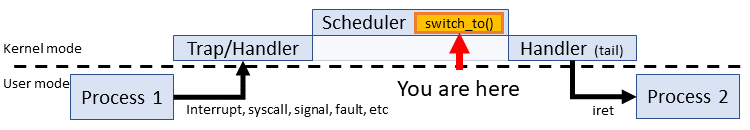

While researching archaic facts about the 80386 hardware context switch last weekend, I remembered that early versions of the Linux kernel relied on it. I was promptly sidetracked for hours reading code I hadn't seen in years. This weekend, I've decided to write down the journey to consolidate all the nuggets of fun stuff I discovered along the way.

**The exercise**: Trace the context switch through the Linux kernel from the earliest (0.01) to the most recent LTS release (4.14.67) -- with special emphasis on the first and last versions.

The real story isn't the context switch - It's the evolution of Linux from a small project to a modern operating system. The context switch reflects this story.

### What context switch are we talking about?

While many things could be considered a context switch (i.e. changing to kernel mode, jumping to an interrupt handler), I'm going with the accepted meaning: **Changing from one process to another**. In Linux, this means the `switch_to()` macro and everything within it.

This switch macro is a bland mechanical sequence wedged between two much more interesting systems: The task scheduler and the CPU. OS developers have latitude for mixing and matching scheduling strategies. CPU architectures are also a wide-open landscape as evidenced by the dozens of distinct types supported by Linux. However, the context switch is the cog that fits between them. The 'design' is a consequence of choices made everywhere else, making the context switch a contender for the _least_ interesting part of an OS. In a tautology: The only thing to do is exactly what needs to be done.

The short list context switching tasks:

1.  Repointing the work space: Restore the stack (SS:SP)
2.  Finding the next instruction: Restore the IP (CS:IP)
3.  Reconstructing task state: Restore the general purpose registers
4.  Swapping memory address spaces: Updating page directory (CR3)
5.  ...and more: FPUs, OS data structures, debug registers, hardware workarounds, etc.

While all of these tasks happen when a different process takes over the CPU, it's not always obvious when and where. For instance, hardware context switching prior to Linux 2.2 obscures Tasks 2, 3 and 4. Task 3 is limited since switching happens between kernel mode. Restoring user thread operation is the job of `iret` after the scheduler returns. Many of these tasks float between the `switch_to()` and the scheduler across kernel versions. All I can guarantee is that we'll always see stack swaps and FPU switching in every version

**Who this is meant for?**  
No one in particular. You need to be familiar with x86 assembly and probably at least one or two semesters of operating system design under your belt to appreciate this.

**Full Disclosure:** I'm not a [kernel maintainer](https://www.kernel.org/doc/linux/MAINTAINERS) or contributor. Any information from these folks or from the [Linux Kernel Mailing List](https://lkml.org/) that contradicts my information should be taken seriously. This is a casual personal project, not a peer reviewed article.

* * *

## Linux Pre-1.0 - Ancient History (1991)

The early Linux kernel is simple and functional with a short list of key features:

*   Single Architecture (80386/i386) - These is only one 'flavor' of context switch. Many 80386 specifics are hardcoded throughout the kernel. I'll use the "Intel 80386 Programmer's Manual (1986)" as a reference for these parts.
*   Hardware context switching - The kernel relies on built-in mechanisms of the 80386 to change tasks.
*   Uniprocessing with preemptive multitasking - Only one CPU with a single process is active at a time. However, another process could take over at any time. Thus, the usual synchronization rules apply: Lock shared resources (no spinlocks). Disabling interrupts works in a pinch, but yielding (mutex locks) should be considered first.

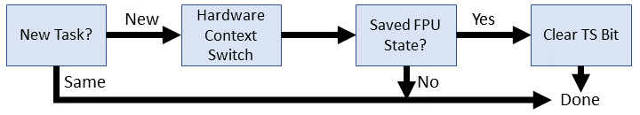

Without further ado, let's peek at two early context switches. Code has been formatted for display: single element per line and continuation characters (\\) removed.

| Linux 0.01 | Linux 0.11 |
| --- | --- |
| /\*\* include/linux/sched.h */ #define **switch_to(n)** { struct {long a,b;} __tmp; \_\_asm\_\_("cmpl %%ecx,_current\\n\\t"   "je 1f\\n\\t"   "xchgl %%ecx,_current\\n\\t"   "movw %%dx,%1\\n\\t"   "ljmp %0\\n\\t"   "cmpl %%ecx,%2\\n\\t"   "jne 1f\\n\\t"   "clts\\n"   "1:"   ::"m" (*&__tmp.a),   "m" (*&__tmp.b),   "m" (last\_task\_used_math),   "d" _TSS(n),   "c" ((long) task\[n\])); } | /\*\* include/linux/sched.h */ #define **switch_to(n)** { struct {long a,b;} __tmp; \_\_asm\_\_("cmpl %%ecx,_current\\n\\t"   "je 1f\\n\\t"   "movw %%dx,%1\\n\\t"   "xchgl %%ecx,_current\\n\\t"   "ljmp %0\\n\\t"   "cmpl %%ecx,\_last\_task\_used\_math\\n\\t"   "jne 1f\\n\\t"   "clts\\n"   "1:"   ::"m" (*&__tmp.a),   "m" (*&__tmp.b),   "d" (_TSS(n)),   "c" ((long) task\[n\])); } |

The first thing to notice is that this is short! Short enough to give it a proper code walk one line at a time:

`#define switch_to(n) {  
`So `switch_to()` is a macro. It appears in exactly one place: the very last line of `schedule()`. Consequently, the macro shares scope with the scheduler after pre-processing. Check unknown references like `current` and `last_task_used_math` against global scope. The input argument `n` is an index number for the next task (between 0 and 63)

`struct {long a,b;} __tmp;`  
Reserves 8 bytes (64 bits) on the stack reachable through two 4-byte members `a`, and `b`. We'll set some of these bytes later for a far jump operation.

`__asm__("cmpl %%ecx,_current\n\t"`  
The context switch is one long inline assembly block. The first instruction determines if the target task is already the current task. This is a subtractive comparison of the value stored in the ECX register with the value of the `current` global from the scheduler. Both contain pointers to some process's task_struct. ECX contains the target task pointer as a given input below: `"c" ((long) task[n])`. The comparison result sets the EFLAGS status register: ZF = 1 if both pointers match (x - x = 0).

`"je 1f\n\t"`  
If the next task is the current task, there's nothing to context switch so we should skip (jump over) this whole procedure. The `je` instruction tests if ZF = 1. If so, it jumps forward to the first instance of the label '1' after this point in the code, which is 8 lines ahead.

`"xchgl %%ecx,_current\n\t"`  
Updates the `current` global to reflect the new task. The pointer from ECX (task\[n\]) swaps to current. No flags are updated.

`"movw %%dx,%1\n\t"`  
Moves the segment selector index of the target task descriptor (TSS) in to the space previously reserved. Technically, this moves the value in the DX register in to `__tmp.b`, which are bytes 5 through 8 of our reserved 8-byte structure. The value of DX is a given input: `"d" (_TSS(n))`. The `_TSS` multi-level macro explodes in to a valid TSS segment selector, which I'll cover a few lines below. The bottom line is that the most significant two bytes of `__tmp.b` will now hold a segment pointer to the next task.

`"ljmp %0\n\t"`  
Invokes the 80386 hardware context switch by jumping to a TSS descriptor. This simple jump may be confusing because there are three distinct ideas to unpack: First, `ljmp` is an indirect far jump, which expects a 6-byte (48-bit) operand. Second, the provided operand of %0 references the uninitialized variable `__tmp.a`. Finally, jumping to a segment selector within the GDT has special meaning in x86. Let's break down these points.

**The Indirect Far Jump**  
The important point is that this jump has a 6-byte operand. The 80386 programmers guide describes the jump like this:

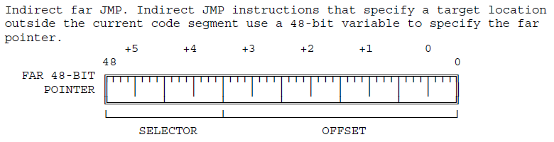

**Jump to __tmp.a**  
Recall that the __tmp struct contained two 4-byte values with the `a` member being the base of the struct. However, if we use that member as the base address of a 6-byte operand, we reach two bytes **into** the `__tmp.b` integer. These two bytes make up the 'segment selector' portion of the far address. When the processor reads that the segment is a TSS within the GDT, the offset portion is completely ignored. The fact that `__tmp.a` is uninitialized doesn't matter because `__tmp.b` does have a valid value thanks to the previous `movw` instruction. For now, let's update the diagram with the jump address:

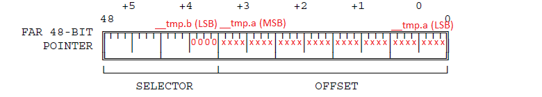

How do we know this address references the GDT? I'll cover the details in a few more code lines, but the short version is that the four 0 bits in the selector trigger a GDT lookup. The `_TSS(n)` macro ensures that those four zeroes are present. The lowest two bits are the privilege level of the segment (00 is supervisor/kernel), the next 0 bit means use the GDT table (as stored in the GDTR during system boot). The 4th zero is technically part of the segment index that forces all TSS lookups on even-numbered GDT table entries.

**Hardware context switch**  
The jump address in __tmp identifies a TSS descriptor within the GDT. Here's what that means for a 80386:

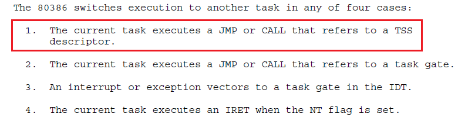

Here's what the processor does for us automatically:

*   Checks that the current privilege level is allowed (we're in kernel mode, so continue)
*   Check that the TSS is valid (should be)
*   Saves all current task state in to the old TSS still stored in the task register (TR). This means saving EAX, ECX, EDX, EBX, ESP, EBP, ESI, EDI, ES, CS, SS, DS ,FS, GS, and EFLAGS. EIP is incremented to the next instruction and stored too
*   Updates the TR to the new task
*   Restores all the general purpose registers, EIP, and PDBR (address space swap). Task switch completed so set the TS flag in the CR0 register

This single instruction, `"ljmp %0\n\t"`, just performed all the steps of our context switch. All that remains is some clean up.

`"cmpl %%ecx,%2\n\t"`  
Check if the task we just swapped from had already restored the math coprocessor. The argument is the `last_task_used_math` task_struct pointer. The idea is to manage the TS flag to track if the coprocessor has a different process context. Hardware context switches do not manage the coprocessor.

`"jne 1f\n\t"`  
If the last task did not restore the coprocessor, jump to the end of the context switch. We want to keep the TS flag set so that the next time we do use the coprocessor, we can trap to perform some a lazy clean up. It's 'lazy' because we defer the task until absolutely necessary.

`"clts\n"`  
Clear the TS flag since the last process restored the coprocessor state.

`"1:"`  
Label for the end of the context switch. All jumps to this label skip some or all of the procedure.

`::"m" (*&__tmp.a),`  
This assembly block has no outputs and the first input (%0) is a memory location of the first 4 bytes of the far pointer to the TSS descriptor in the GDT. Used only as an address reference, value is uninitialized.

`"m" (*&__tmp.b),`  
The second input (%1) is the memory location of bytes 5 and 6 of the far pointer to the TSS descriptor. Technically this memory location is 4 bytes, but only the first two are checked and used.

`"m" (last_task_used_math),`  
The third input (%2) is memory location of the pointer to the last task_struct that restored the coprocessor state.

`"d" (_TSS(n)),`  
The fourth input (%3 / %%edx) is the segment selector address to the TSS descriptor within the GDT. Let's take apart the macro:

#define \_TSS(n) ((((unsigned long) n)<<4)+(FIRST\_TSS_ENTRY<<3))
#define FIRST\_TSS\_ENTRY 4

In English, this says that the first TSS descriptor is the 4th entry (index count starts from the 4th bit of the segment selector). Each subsequent TSS occupies every other GDT entry - 4, 6, 8, etc. The first eight tasks look like this:

| Task # | 16-bit Segment Selector |
| --- | --- |
| 0   | 0000000000100  0  00 |
| 1   | 0000000000110  0  00 |
| 2   | 0000000001000  0  00 |
| 3   | 0000000001010  0  00 |
| 4   | 0000000001100  0  00 |
| 5   | 0000000001110  0  00 |
| 6   | 0000000010000  0  00 |
| 7   | 0000000010010  0  00 |

The bits in the address have been separated by the field format as expected by the 80386:

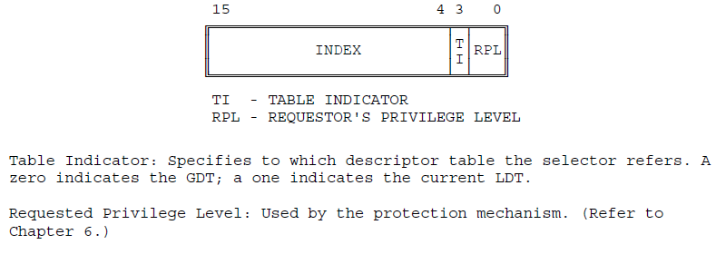

The least significant 4 bits are always 0 to indicate supervisor mode, the GDT table, and force an even GDT index.

`"c" ((long) task[n]));`  
The final input (%4 / %ecx) is a pointer to the new task_struct that we're switching to. Note that the value of %%ecx does change to the prior task just before context switch.

**Differences between 0.01 and 0.11**  
There are two differences between the two context switches. One is a simple code cleanup and the other is a partial bug fix.

*   `_last_task_used_math` was removed as an input variable because the symbol is already available at global scope. The associated compare operation changed to a direct reference.
*   The `xchgl` instruction was swapped with the `movw` in order to bring it closer to the hardware context switch (`ljmp`). The problem is that these operations are not atomic -- there is an unlikely case that an interrupt could occur between `xchgl` and `ljmp`, leading to yet another context switch with the wrong `current` task and state of the real task left unsaved. Swapping these instructions moves this case from 'unlikely' to 'very unlikely'. In a long-running system, 'very unlikely' is an alias for 'inevitable'.

* * *

## Linux 1.x - Proof of concept (1994)

A few things changed in the ~2 years between 0.11 and 1.0 - roughly 20 development patches. Much of the effort focused on drivers and user/developer features. The maximum number of tasks increased to 128. But there aren't many fundamental changes that would affect the context switch.

### Linux 1.0

Linux 1.0 is still single architecture and uniprocessor using hardware context switching.

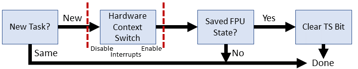

| Linux 1.0 |
| --- |
| /\*\* include/linux/sched.h */ #define **switch_to(tsk)** \_\_asm\_\_("cmpl %%ecx,_current\\n\\t" 	"je 1f\\n\\t" 	"cli\\n\\t" 	"xchgl %%ecx,_current\\n\\t" 	"ljmp %0\\n\\t" 	"sti\\n\\t" 	"cmpl %%ecx,\_last\_task\_used\_math\\n\\t" 	"jne 1f\\n\\t" 	"clts\\n" 	"1:" 	: /\* no output */ 	:"m" (*(((char *)&tsk->tss.tr)-4)), 	 "c" (tsk) 	:"cx") |

The most significant change is that the input argument is no longer a task number index for an array of *task_struct. Now `switch_to()` takes a pointer to the new task. We can now remove the `__tmp` struct and instead use a direct reference to the TSS. Let's go through this one line by line.

`#define switch_to(tsk)`  
The input is now a pointer to the next task's `task_struct`

`"__asm__("cmpl %%ecx,_current\n\t"`  
Unchanged. Checks if the input task is already the current task and no switch is necessary

`"je 1f\n\t"`  
Unchanged. Skip context switch if there is no switch

`"cli\n\t"`  
Disables interrupts to prevent the timer (or other maskable) from cutting in between the global task update and the hardware context switch. This interrupt sledgehammer solves the bug from the early kernel versions by making the next two instructions (pseudo) atomic.

`"xchgl %%ecx,_current\n\t"`  
`"ljmp %0\n\t"`  
Unchanged - swapping current process to reflect the new task and invoking hardware context switch

`"sti\n\t"`  
Enables interrupts.

`"cmpl %%ecx,_last_task_used_math\n\t"`  
`"jne 1f\n\t"`  
`"clts\n"`  
`"1:"`  
All unchanged from Linux 0.11. Handles the TS register for to manage a dirty math coprocessor

`: /* no output */`  
There are no output effects from this inline assembly - someone was clearly annoyed by the lack of commenting from the early kernel versions.

`:"m" (*(((char *)&tsk->tss.tr)-4)),`  
Loads the segment selector for the new task's TSS descriptor that's now directly available from the task_struct pointer. The `tss.tr` member holds the \_TSS(task\_number) for the GDT/TSS memory reference that was used in the Pre 1.0 kernel. We're still backing off 4 bytes and loading the 6-byte segment selector to grab the top two bytes. Fun!

`"c" (tsk)`  
Sort of unchanged -- we're now directly loading the pointer as passed rather than looking up the index.

`:"cx")`  
Context switching clobbers the ECX register

### Linux 1.3

The kernel now supports several new architectures: Alpha, MIPS, and SPARC. Consequently, there are now four different versions of `switch_to()`, one of which is included at kernel compile-time. The arch-dependent code has been separated from the kernel proper and so we have to move to a new location to find our x86 version.

| Linux 1.3 |
| --- |
| /\*\* include/asm-i386/system.h */ #define **switch_to(tsk)** do { \_\_asm\_\_("cli\\n\\t" 	"xchgl %%ecx,_current\\n\\t" 	"ljmp %0\\n\\t" 	"sti\\n\\t" 	"cmpl %%ecx,\_last\_task\_used\_math\\n\\t" 	"jne 1f\\n\\t" 	"clts\\n" 	"1:" 	: /\* no output */ 	:"m" (*(((char *)&tsk->tss.tr)-4)), 	 "c" (tsk) 	:"cx"); 	/\* Now maybe reload the debug registers */ 	if(current->debugreg\[7\]){ 		loaddebug(0); 		loaddebug(1); 		loaddebug(2); 		loaddebug(3); 		loaddebug(6); 	} } while (0) |

A few small changes: The entire context switch was wrapped in a fake do-while loop - fake because it never repeats. The check that we're switching to a new task moved out of `switch_to()` to the scheduler C code. Some debug tasks were moved from the C code in to `switch_to()` probably to avoid them getting separated. Let's march through the changes.

`#define switch_to(tsk) do {`  
Now `switch_to()` is wrapped in a do-while(0) loop. This construct prevents errors if the macro expands to multiple statements as a consequent to a conditional (if it's a 'then' in an 'if'). This does NOT appear to be the case at this time but considering the changes within the scheduler, I suspect that it was true in an earlier version and left in for future-proofing. My guess:

| Actual 1.3 scheduler | Slight change to 'break' switch_to() |
| --- | --- |
| ...within schedule()...      if (current == next)        return;     kstat.context_swtch++;     switch_to(next); | ...within schedule()...      if (current != next)         switch_to(next); 		  **/\* do-while(0) 'captures' entire    \* block to ensure proper parse */** |

`__asm__("cli\n\t"`  
`"xchgl %%ecx,_current\n\t"`  
`"ljmp %0\n\t"`  
`"sti\n\t"`  
`"cmpl %%ecx,_last_task_used_math\n\t"`  
`"jne 1f\n\t"`  
`"clts\n"`  
`"1:"`  
`: /* no output */`  
`:"m" (*(((char *)&tsk->tss.tr)-4)),`  
`"c" (tsk)`  
`:"cx");`  
Unchanged from Linux 1.0. Still disabling interrupts before swapping `current` *task_struct, hardware context switching, and verifying the coprocessor usage.

`/* Now maybe reload the debug registers */`  
`if(current->debugreg[7]){`  

Checks debug control for the new process to see if ptrace is active (some non-null address here implies active ptrace). Debug tracking moved in to `switch_to()`. The exact same C sequence used to follow the macro in 1.0. I suppose they wanted to ensure that: 1) Debug is attached as close as possible to context switch 2) switch_to is the very last thing in `schedule()`

`loaddebug(0);`  
`loaddebug(1);`  
`loaddebug(2);`  
`loaddebug(3);`  
Restores the breakpoint debug registers from the saved ptrace state

`loaddebug(6);`  
Restores the status debug register from the saved ptrace state

`} while (0)`  
Closes the `switch_to()` block. Although the condition will never more than one evaluation, this ensures that the lexer/parser will treat the function as a basic block that won't interact with neighboring conditionals in `schedule()`. Note the lack of trailing comma -- this is filled in by the comma after the macro call: `switch_to(next)**;**`

* * *

## Linux 2.x - Linux becomes a contender (1996)

In June 1996, the kernel updated to version number to 2.0, kicking off a 15 year journey under this banner that ends with broad commercial support. Almost every fundamental system in the kernel sees drastic changes over 2.x. Let's walk through each initial minor release up to 2.6. Version 2.6 was developed for so long that it deserves its own section.

### Linux 2.0

Linux 2.0 started off the series with a bang: **Multiprocessing**! Two or more processors can churn through user/kernel code at the same time. Naturally this requires some retrofitting. For instance, each processor now has a dedicated interrupt controller, an APIC, and thus interrupts need to be managed on a per-processor basis. Mechanisms like the timer interrupt need reworking (disabling interrupts only affects one processor). Synchronization is complicated, especially when trying to apply it to an already large and disjointed code base. Linux 2.0 lays the groundwork for what will become the big kernel lock (BKL)...gotta start somewhere.

We now have two versions of `switch_to()`: The uniprocessor (UP) version that extends from 1.x Linux, and the new and improved symmetric multiprocessing (SMP) version. We'll look at the legacy changes first since it has a few changes that are also included in the SMP version.

### Linux 2.0.1 - Uniprocessing edition (UP)

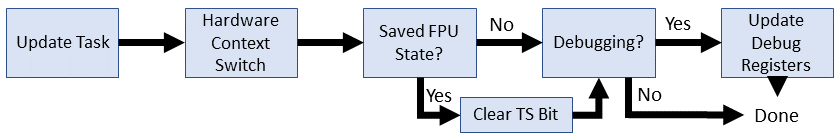

| Linux 2.0.1 (UP) |
| --- |
| /\*\* include/asm-i386/system.h */ #else  **/\* Single process only (not SMP)** */ #define **switch_to(prev,next)** do { \_\_asm\_\_("movl %2,"SYMBOL\_NAME\_STR(current_set)"\\n\\t" 	"ljmp %0\\n\\t" 	"cmpl %1,"SYMBOL\_NAME\_STR(last\_task\_used_math)"\\n\\t" 	"jne 1f\\n\\t" 	"clts\\n" 	"1:" 	: /\* no outputs */ 	:"m" (*(((char *)&next->tss.tr)-4)), 	 "r" (prev), "r" (next)); 	/\* Now maybe reload the debug registers */ 	if(prev->debugreg\[7\]){ 		loaddebug(prev,0); 		loaddebug(prev,1); 		loaddebug(prev,2); 		loaddebug(prev,3); 		loaddebug(prev,6); 	} } while (0) #endif |

Two immediately obvious changes:

*   `switch_to()` has a new argument: the process `*task_struct` we're switching from
*   A macro to properly handle symbol identities between C and inline assembly

As usual, we'll go line by line and discuss changes.

`#define switch_to(prev,next) do {`  
The `prev` argument identifies the task we're switching from (a `*task_struct`). We're still wrapping the macro in a do-while(0) loop to help parsing single-line 'if's around the macro.

`__asm__("movl %2,"SYMBOL_NAME_STR(current_set)"\n\t"`  
Updates the currently active task to the newly chosen task. This is functionally equivalent to the `xchgl %%ecx,_current` except now we have an array of multiple task_structs and a macro (`SYMBOL_NAME_STR`) to manage inline assembly symbol names. Why use the preprocessor to manage inline assembly names? Some assemblers (GAS) require prepending an underscore (_) to the C variable name. Other assemblers don't have this convention. Rather than hardcode the convention, this allows you to configure it for your toolchain at compile-time.

`"ljmp %0\n\t"`  
`"cmpl %1,"SYMBOL_NAME_STR(last_task_used_math)"\n\t"`  
`"jne 1f\n\t"`  
`"clts\n"`  
`"1:"`  
`: /* no outputs */`  
`:"m" (*(((char *)&next->tss.tr)-4)),`  
No changes that haven't already been noted.

`"r" (prev), "r" (next));`  
Now we're carrying both tasks as inputs to the inline assembly. One minor change is that now any register usage is permitted. Before, `next` had been hardcoded to ECX.

`/* Now maybe reload the debug registers */`  
`if(prev->debugreg[7]){`  
`    loaddebug(prev,0);`  
`    loaddebug(prev,1);`  
`    loaddebug(prev,2);`  
`    loaddebug(prev,3);`  
`    loaddebug(prev,6);`  
`    }`  
`} while (0)`  
Exactly the same as kernel v1.3

### Linux 2.0.1 - Symmetric multiprocessing edition (SMP)

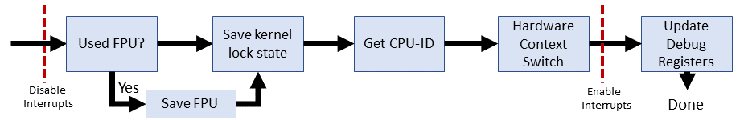

| Linux 2.0.1 (SMP) |
| --- |
| /\*\* include/asm-i386/system.h */ #ifdef \_\_SMP\_\_   **/\* Multiprocessing enabled */** #define **switch_to(prev,next)** do {     cli();     if(prev->flags&PF_USEDFPU)     {         \_\_asm\_\_ \_\_volatile\_\_("fnsave %0":"=m" (prev->tss.i387.hard));         \_\_asm\_\_ \_\_volatile\_\_("fwait");         prev->flags&=~PF_USEDFPU;     }     prev->lock\_depth=syscall\_count;     kernel\_counter+=next->lock\_depth-prev->lock_depth;     syscall\_count=next->lock\_depth; \_\_asm\_\_("pushl %%edx\\n\\t"     "movl "SYMBOL\_NAME\_STR(apic_reg)",%%edx\\n\\t"     "movl 0x20(%%edx), %%edx\\n\\t"     "shrl $22,%%edx\\n\\t"     "and  $0x3C,%%edx\\n\\t"     "movl %%ecx,"SYMBOL\_NAME\_STR(current_set)"(,%%edx)\\n\\t"     "popl %%edx\\n\\t"     "ljmp %0\\n\\t"     "sti\\n\\t"     : /\* no output */     :"m" (*(((char *)&next->tss.tr)-4)),      "c" (next));     /\* Now maybe reload the debug registers */     if(prev->debugreg\[7\]){         loaddebug(prev,0);         loaddebug(prev,1);         loaddebug(prev,2);         loaddebug(prev,3);         loaddebug(prev,6);     } } while (0) |

Getting messy? I wish I could say that it'll get better, but it never does in SMP-land. In the interest of space, I won't bother to list unchanged lines anymore.

The three additions for the SMP context switch: 1) Change how we store the single coprocessor among multiple processors; 2) Lock depth management since the kernel lock is recursive; 3) Reference the APIC to get the CPU ID to associate the current *task_struct.

`if(prev->flags&PF_USEDFPU)`  
Checks if the task we're switching from used the coprocessor during this time slice. If so, we need to grab the context in to the FPU before switching out.

`__asm__ __volatile__("fnsave %0":"=m" (prev->tss.i387.hard));`  
Stores the FPU state in the TSS. FNSAVE is used to skip exception handling. `__volatile__` should keep the optimizer from changing this instruction.

`__asm__ __volatile__("fwait");`  
Busy waits the CPU while the FPU is working on the previous save

`prev->flags&=~PF_USEDFPU;`  
Forces coprocessor usage flag off for this task. The AND of a complement is always 0.

`prev->lock_depth=syscall_count;`  
Stores the old task's count of nested uses of the kernel lock.

`kernel_counter+=next->lock_depth-prev->lock_depth;`  
Updates the global kernel lock counter to the next task less the old task. Effectively removes the lock from the now-sleeping old task and the new task can pick up where it left off.

`syscall_count=next->lock_depth;`  
Brings back the new task's lock state. Should be right where it left off on the last time slice.

`__asm__("pushl %%edx\n\t"`  
We're about to use EDX so store whatever value it currently holds

`"movl "SYMBOL_NAME_STR(apic_reg)",%%edx\n\t"`  
Moves the APIC I/O address in to EDX. We need to use the APIC to get the CPU ID since we don't know which processor is running. `apic_reg` is mapped during OS initialized

`"movl 0x20(%%edx), %%edx\n\t"`  
Dereferences the APIC ID register value in to EDX. The actual ID is in bits 24-27.

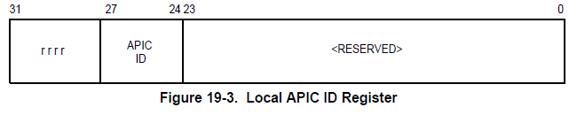

`"shrl $22,%%edx\n\t"`  
Shifts the APIC ID to bits 2-5.

`"and $0x3C,%%edx\n\t"`  
Masks out only the APIC ID in bits 2-5, leaving the CPU number * 4.

`"movl %%ecx,"SYMBOL_NAME_STR(current_set)"(,%%edx)\n\t"`  
Updates the current CPU's task pointer to the next task. The UP version had already removed specific use of ECX to store the current task, but this SMP version still uses it. EDX holds the CPU number stored in bits 2-5, which is the CPU number multiplied by 4 to scale for pointer size offset from \_current\_set.

`"popl %%edx\n\t"`  
We're finished with EDX so restore the value it had before this procedure

The remaining lines are the same as the UP counterpart

### Linux 2.2 (1999)

Linux 2.2 was worth waiting for: **software context switching**! We're still using the task register (TR) to reference a TSS. SMP and UP procedures merged with uniform handling of FPU state. Much of the context switch now performed in C.

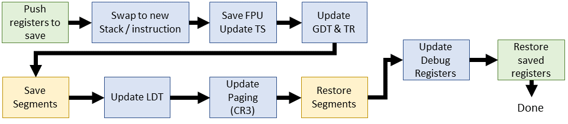

| Linux 2.2.0 (inline assembly) |
| --- |
| /\*\* include/asm-i386/system.h */ #define **switch_to(prev,next)** do {     unsigned long eax, edx, ecx;     asm volatile("pushl %%ebx\\n\\t"                  "pushl %%esi\\n\\t"                  "pushl %%edi\\n\\t"                  "pushl %%ebp\\n\\t"                  "movl %%esp,%0\\n\\t" /* save ESP */                  "movl %5,%%esp\\n\\t" /* restore ESP */                  "movl $1f,%1\\n\\t"   /* save EIP */                  "pushl %6\\n\\t"      /* restore EIP */                  "jmp **\_\_switch\_to**\\n"                  "1:\\t"                  "popl %%ebp\\n\\t"                  "popl %%edi\\n\\t"                  "popl %%esi\\n\\t"                  "popl %%ebx"                  :"=m" (prev->tss.esp),"=m" (prev->tss.eip),                   "=a" (eax), "=d" (edx), "=c" (ecx)                  :"m" (next->tss.esp),"m" (next->tss.eip),                   "a" (prev), "d" (next)); } while (0) |

This new `switch_to()` is a radical departure from all previous versions: it's easy to follow! We're swapping stack pointers and instruction pointers using inline assembly (context switch task #1 and #2). The rest of the work happens after a jump to C code (`__switch_to()`).

`asm volatile("pushl %%ebx\n\t"`  
`"pushl %%esi\n\t"`  
`"pushl %%edi\n\t"`  
`"pushl %%ebp\n\t"`  
Stores EBX, ESI, EDI, and EBP on the stack of the process we're about to swap out. (...why EBX?)

`"movl %%esp,%0\n\t" /* save ESP */`  
`"movl %5,%%esp\n\t" /* restore ESP */`  
As the comments indicate, we're swapping stack pointers between the old and new process. The old process is operand %0 (`prev->tss.esp`) and the new process is operand %5 (`next->tss.esp`)

`"movl $1f,%1\n\t" /* save EIP */`  
Storing the value of the instruction pointer for the next instruction of the old task after we context switch back. Notice that the value of the next instruction uses the label `1:`

`"pushl %6\n\t" /* restore EIP */`  
Preparing the next instruction for the new task. Since we just swapped to the new stack, this IP is taken from the new task's TSS and pushed on to the top. Execution will begin at the next instruction after a 'ret' from the C code we're about to execute.

`"jmp **__switch_to**\n"`  
Jump to our new and improved software context switch. See below.

`"popl %%ebp\n\t"`  
`"popl %%edi\n\t"`  
`"popl %%esi\n\t"`  
`"popl %%ebx"`  
Restore the registers from the stack in reverse order, presumably after we've context switched back to the old task in a new time quantum.

| Linux 2.2.0 (C) |
| --- |
| /\*\* arch/i386/kernel/process.c */ void **\_\_switch\_to**(struct task\_struct \*prev, struct task\_struct \*next) {     **/\* Do the FPU save and set TS if it wasn't set before.. */**     unlazy_fpu(prev);      gdt_table\[next->tss.tr >> 3\].b &= 0xfffffdff;     asm volatile("ltr %0": :"g" (*(unsigned short *)&next->tss.tr));      asm volatile("movl %%fs,%0":"=m" (*(int *)&prev->tss.fs));     asm volatile("movl %%gs,%0":"=m" (*(int *)&prev->tss.gs));      **/\* Re-load LDT if necessary */**     if (next->mm->segments != prev->mm->segments)         asm volatile("lldt %0": :"g" (*(unsigned short *)&next->tss.ldt));      **/\* Re-load page tables */**     {         unsigned long new_cr3 = next->tss.cr3;         if (new_cr3 != prev->tss.cr3)             asm volatile("movl %0,%%cr3": :"r" (new_cr3));     }      **/\* Restore %fs and %gs. */**     loadsegment(fs,next->tss.fs);     loadsegment(gs,next->tss.gs);      if (next->tss.debugreg\[7\]){         loaddebug(next,0);         loaddebug(next,1);         loaddebug(next,2);         loaddebug(next,3);         loaddebug(next,6);         loaddebug(next,7);     } } |

The software context switch replaces the old jump to the TSS descriptor to a jump to a new C function: `__switch_to()`. This function is written in C and includes a few familiar components, such as the debug registers that used to live after the inline assembly. The jump to C code allows us to move it even closer to the switch.

`unlazy_fpu(prev);`  
Check's if FPU was used and if so, saves the FPU state. This now happens for every process switched out that used the FPU (hence, unlazy). The procedure is the same as the SMP routine from 2.0.1, except now we have a clean macro that includes manually setting TS.

`gdt_table[next->tss.tr >> 3].b &= 0xfffffdff;`  
Clears the BUSY bit for the upcoming task descriptor. Uses the task's number to index the GDT. Recall from v0.01 that tss.tr holds the task's segment selector value, where the bottom 3 bits are used for permissions. We only need the index, so right-shfit those bits away. The second byte of the TSS is modified to remove bit 10.

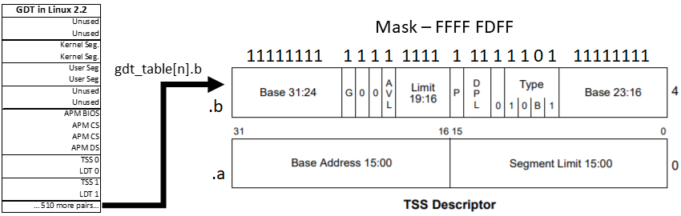

`asm volatile("ltr %0": :"g" (*(unsigned short *)&next->tss.tr));`  
Loads the task register with a pointer to the next task segment selector.

`asm volatile("movl %%fs,%0":"=m" (*(int *)&prev->tss.fs));`  
`asm volatile("movl %%gs,%0":"=m" (*(int *)&prev->tss.gs));`  
Stores the FS and GS segment registers for the previous task in the TSS. This step was automatic in the hardware context switch, but now we need to do this manually. But why? How does Linux use FS and GS?

In Linux 2.2 (1999), there isn't a consistent answer except that they are used, thus they must be stored so that they stay available. Kernel mode code will 'borrow' these segments to point to the kernel or user data segments. Sound/network drivers do the same. In recent times (~2.6 onward), FS and GS often support thread local storage and the Per-processor Data Areas respectively.

`if (next->mm->segments != prev->mm->segments)`  
`    asm volatile("lldt %0": :"g" (*(unsigned short *)&next->tss.ldt));`  
Restores segments the local descriptor table if they don't already match the old process. This is done by loading the LDT register

`if (new_cr3 != prev->tss.cr3)`  
`    asm volatile("movl %0,%%cr3": :"r" (new_cr3));`  
Updates the virtual memory state for the new task. Mechanically, this sets the CR3 register, which contains the page directory used for all memory access in the new context.

`loadsegment(fs,next->tss.fs);`  
`loadsegment(gs,next->tss.gs);`  
Restore FS and GS for the new task. Enforces proper alignment and loads the zero segment if there's a problem.

`loaddebug(prev,7);`

Finally, The debug control register is now stored and switched from the TSS. Previously, this was only checked, not stored.

### Linux 2.4 (2001)

The 2.4 kernel series brought many new features such as kernel threads and task queues. Despite these, and a few changes to the scheduler, the context switch is most intact from 2.2 although we've stopped updating the TR in favor of replacing all its data. I'm informally calling this "The last legacy" kernel since all subsequent releases include a 64-bit x86 architecture.

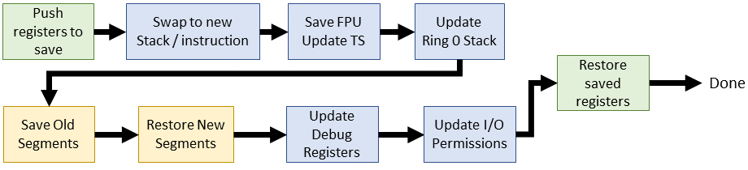

| Linux 2.4.0 (inline assembly) |
| --- |
| /\*\* include/asm-i386/system.h */  #define **switch_to(prev,next,last)** do {     asm volatile("pushl %%esi\\n\\t"         "pushl %%edi\\n\\t"         "pushl %%ebp\\n\\t"         "movl %%esp,%0\\n\\t"	/* save ESP */         "movl %3,%%esp\\n\\t"	/* restore ESP */         "movl $1f,%1\\n\\t"		/* save EIP */         "pushl %4\\n\\t"		/* restore EIP */         "jmp \_\_switch\_to\\n"         "1:\\t"         "popl %%ebp\\n\\t"         "popl %%edi\\n\\t"         "popl %%esi\\n\\t"         :"=m" (prev->thread.esp),"=m" (prev->thread.eip),          "=b" (last)         :"m" (next->thread.esp),"m" (next->thread.eip),          "a" (prev), "d" (next),          "b" (prev)); } while (0) |

The 2.4 kernel context switch brings a few minor changes: EBX is no longer pushed/popped, but it is now included in the output of the inline assembly. We have a new input argument, `last`, which contains and the same value as prev and is passed out through EBX but not used.

`:"=m" (prev->thread.esp),"=m" (prev->thread.eip),`  
`:"m" (next->thread.esp),"m" (next->thread.eip),`  
I/O operands now reference stack/instruction pointers for kernel threads. Previous context switches referenced the stack pointers from the TSS.

| Linux 2.4.0 (C) |
| --- |
| /\*\* arch/i386/kernel/process.c */ void **\_\_switch\_to**(struct task\_struct \*prev\_p, struct task\_struct \*next\_p) { 	struct thread\_struct *prev = &prev\_p->thread, 				 *next = &next_p->thread; 				  	struct tss\_struct *tss = init\_tss + smp\_processor\_id();  	unlazy\_fpu(prev\_p);  	tss->esp0 = next->esp0;  	asm volatile("movl %%fs,%0":"=m" (*(int *)&prev->fs)); 	asm volatile("movl %%gs,%0":"=m" (*(int *)&prev->gs));  	**/\* Restore %fs and %gs. */** 	loadsegment(fs, next->fs); 	loadsegment(gs, next->gs);  	**/\* Now maybe reload the debug registers */** 	if (next->debugreg\[7\]){ 		loaddebug(next, 0); 		loaddebug(next, 1); 		loaddebug(next, 2); 		loaddebug(next, 3); 		/\* no 4 and 5 */ 		loaddebug(next, 6); 		loaddebug(next, 7); 	}  	if (prev->ioperm || next->ioperm) { 		if (next->ioperm) { 			memcpy(tss->io\_bitmap, next->io\_bitmap, 				 IO\_BITMAP\_SIZE*sizeof(unsigned long)); 			tss->bitmap = IO\_BITMAP\_OFFSET; 		} else 			tss->bitmap = INVALID\_IO\_BITMAP_OFFSET; 	} } |

A few things changed for the C portion of the context switch. Gone is any mention of the TR register, instead we directly change the active TSS for the current processor. As with the inline asm code, each task references TSS data within the `thread_struct` inside it's `task_struct`. Each active CPU uses a dedicated TSS from the GDT and updates these fields directly.

`void __switch_to(struct task_struct *prev_p, struct task_struct *next_p)`  
The previous and next task pointers now have `_p` appended to the symbol. This is subtle but significant because `prev` and `next` are about to be repurposed for kernel threads.

`struct thread_struct *prev = &prev_p->thread,`  
`         *next = &next_p->thread;`  
Define pointers to the TSS data for each task.

`tss->esp0 = next->esp0;`  
Replace the ring 0 stack offset with that of the new task. Doesn't force a page table reload yet...

`asm volatile("movl %%fs,%0":"=m" (*(int *)&prev->fs));`  
`asm volatile("movl %%gs,%0":"=m" (*(int *)&prev->gs));`  
Stores FS and GS for the old task. The purpose of these segments is still inconsistent, but they are used. Usage eventually lands on FS:thread local storage and GS:per-processor data area by 2.6

`if (prev->ioperm || next->ioperm) {`  
`    if (next->ioperm) {`  
`      memcpy(tss->io_bitmap, next->io_bitmap,`  
`        IO_BITMAP_SIZE*sizeof(unsigned long));`  
`      tss->bitmap = IO_BITMAP_OFFSET;`  
Sets the port-mapped I/O permissions in the active TSS for the upcoming task.

`} else`  
`tss->bitmap = INVALID_IO_BITMAP_OFFSET;`  
Point the I/O permissions for the active TSS to a known invalid bitmap (0x8000)

* * *

## Linux 2.6 - Linux goes mainstream (2003)

As the 2.5 kernel wound down, the O(n) scheduler had reached the limit of practical use and AMD had demonstrated an extension to x86 that needed immediate attention of kernel developers: x86-64.

### Linux 2.6.0

The 2.6.0 Kernel brought the constant-time scheduler. While a step forward from the linear time scheduler, it is eventually replaced in 2.6.23 with the Completely-Fair Scheduler (CFS). On the other side of the context switch, the new 64-bit architecture drives the most significant changes to date.

### Linux 2.6.0 - i386 edition

This will be the last appearance of the 32-bit context switch in this article.

| Linux 2.6.0 (i386 inline assembly) |
| --- |
| /\*\* include/asm-i386/system.h */ #define **switch_to(prev,next,last)** do {     unsigned long esi,edi;     asm volatile("pushfl\\n\\t"             "pushl %%ebp\\n\\t"             "movl %%esp,%0\\n\\t"	 /* save ESP */             "movl %5,%%esp\\n\\t" /* restore ESP */             "movl $1f,%1\\n\\t"   /* save EIP */             "pushl %6\\n\\t"	     /* restore EIP */             "jmp \_\_switch\_to\\n"             "1:\\t"             "popl %%ebp\\n\\t"             "popfl"             :"=m" (prev->thread.esp),"=m" (prev->thread.eip),              "=a" (last),"=S" (esi),"=D" (edi)             :"m" (next->thread.esp),"m" (next->thread.eip),              "2" (prev), "d" (next)); } while (0) |

Four lines were removed. ESI and EDI used to be pushed/popped on to the stack, but now they are carried through the I/O operands.

| Linux 2.6.0 (i386 C) |
| --- |
| /\*\* arch/i386/kernel/process.c */ struct task_struct * **\_\_switch\_to**(struct task\_struct \*prev\_p, struct task\_struct \*next\_p) {     struct thread\_struct *prev = &prev\_p->thread,                  *next = &next_p->thread;     int cpu = smp\_processor\_id();     struct tss\_struct *tss = init\_tss + cpu;      \_\_unlazy\_fpu(prev_p);      load_esp0(tss, next->esp0);      **/\* Load the per-thread Thread-Local Storage descriptor. */**     load_TLS(next, cpu);      asm volatile("movl %%fs,%0":"=m" (*(int *)&prev->fs));     asm volatile("movl %%gs,%0":"=m" (*(int *)&prev->gs));      **/\* Restore %fs and %gs if needed. */**     if (unlikely(prev->fs | prev->gs | next->fs | next->gs)) {         loadsegment(fs, next->fs);         loadsegment(gs, next->gs);     }      **/\* Now maybe reload the debug registers */**     if (unlikely(next->debugreg\[7\])) {         loaddebug(next, 0);         loaddebug(next, 1);         loaddebug(next, 2);         loaddebug(next, 3);         /\* no 4 and 5 */         loaddebug(next, 6);         loaddebug(next, 7);     }      if (unlikely(prev->io\_bitmap\_ptr || next->io\_bitmap\_ptr)) {         if (next->io\_bitmap\_ptr) {             memcpy(tss->io\_bitmap, next->io\_bitmap_ptr,                 IO\_BITMAP\_BYTES);             tss->io\_bitmap\_base = IO\_BITMAP\_OFFSET;         } else             tss->io\_bitmap\_base = INVALID\_IO\_BITMAP_OFFSET;     }     return prev_p; } |

Some interesting changes: a function return value and an appearance of the `unlikely()` macro. I won't consider changes to existing code wrapped in \[un\]likely as a cause to reexplain how it works. The macro simply tells the code generator which basic block case should appear first to help out pipelining

`struct task_struct *__switch_to(...)`  
\_\_switch\_to now returns a pointer to the _old_ task. This isn't handled anywhere so either that change was removed or they wanted to follow a convention. For instance, a classic convention that when a function changes a state, we return the previous state to save and restore later. For now, this has no effect.

`load_TLS(next, cpu);`  
Updates the thread local storage descriptors in the GDT for the new task. Linux 2.6 introduces three TLS entries in the GDT used for thread-specific segments. TLS segment 1 is used by glibc, Wine uses segment 2. We now have consistent use of the FS segment register to reference thread local storage as needed.

`if (unlikely(prev->fs | prev->gs | next->fs | next->gs)) {`  
Now we only restore FS and GS if they have been used by either the previous or next task.

### Linux 2.6.0 - x86_64 edition

The x86_64 context switch is significantly different than the 32-bit counterpart. We'll look more closely at this since we're going to only focus on 64-bit for the remainder.

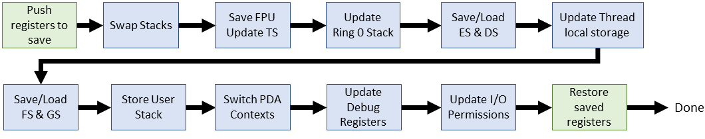

| Linux 2.6.0 (x86_64 inline assembly) |
| --- |
| /\*\* include/asm-x86_64/system.h */  #define SAVE_CONTEXT    "pushfq ; pushq %%rbp ; movq %%rsi,%%rbp\\n\\t" #define RESTORE_CONTEXT "movq %%rbp,%%rsi ; popq %%rbp ; popfq\\n\\t"  #define \_\_EXTRA\_CLOBBER     ,"rcx","rbx","rdx","r8","r9","r10","r11","r12","r13","r14","r15"  #define **switch_to(prev,next,last)**     asm volatile(SAVE_CONTEXT           "movq %%rsp,%P\[threadrsp\](http://www.maizure.org/projects/evolution_x86_context_switch_linux/%\[prev\])\\n\\t" /* save RSP */           "movq %P\[threadrsp\](http://www.maizure.org/projects/evolution_x86_context_switch_linux/%\[next\]),%%rsp\\n\\t" /* restore RSP */           "call \_\_switch\_to\\n\\t"           ".globl thread_return\\n"           "thread_return:\\n\\t"           "movq %%gs:%P\[pda_pcurrent\],%%rsi\\n\\t"           "movq %P\[thread_info\](http://www.maizure.org/projects/evolution_x86_context_switch_linux/%%rsi),%%r8\\n\\t"           "btr  %\[tif\_fork\],%P\[ti\_flags\](http://www.maizure.org/projects/evolution_x86_context_switch_linux/%%r8)\\n\\t"           "movq %%rax,%%rdi\\n\\t"           "jc   ret\_from\_fork\\n\\t"           RESTORE_CONTEXT           : "=a" (last)           : \[next\] "S" (next), \[prev\] "D" (prev),             \[threadrsp\] "i" (offsetof(struct task_struct, thread.rsp)),             \[ti\_flags\] "i" (offsetof(struct thread\_info, flags)),             \[tif\_fork\] "i" (TIF\_FORK),             \[thread\_info\] "i" (offsetof(struct task\_struct, thread_info)),             \[pda\_pcurrent\] "i" (offsetof(struct x8664\_pda, pcurrent))           : "memory", "cc" \_\_EXTRA\_CLOBBER) |

The x86_64 brings a fresh look at the `_switch_to()` macro so we'll need to go over most of the lines. Many changes are simply register names (r.. vs e..). There are also a few helpers that I've included above.

`asm volatile(SAVE_CONTEXT`  
Saves the kernel context on the stack using the helper macro shown above. Very similar to the 32-bit version except with new register names. This is paired with the RESTORE_CONTEXT help at the end of the inline asm block.

`"movq %%rsp,%P[threadrsp](http://www.maizure.org/projects/evolution_x86_context_switch_linux/%[prev])\n\t" /* save RSP */`  
Stores the current stack pointer in the old task's TSS. Note the new notation defined in the input operand section: `[threadrsp]` is the immediate offset of thread.rsp within task_struct. `%P` dereferences the prev:threadsp pointer to ensure proper storage of the updated SP

`"movq %P[threadrsp](http://www.maizure.org/projects/evolution_x86_context_switch_linux/%[next]),%%rsp\n\t" /* restore RSP */`  
Restores the stack pointer of the new task.

`"call __switch_to\n\t"`  
Calls in to the C portion of the context switch, described in the next section.

`".globl thread_return\n"`  
(CHECK) Defines a global label called `thread_return`

`"thread_return:\n\t"`  
Jump point for `thread_return`. Mechnically, using this sets the instruction pointer to the next instruction. In reality, this doesn't appear to be used in either kernel or library (such as glibc). My assumption was that pthreads might use it...but it doesn't look like that's true.

`"movq %%gs:%P[pda_pcurrent],%%rsi\n\t"`  
Sets the source index to current task using the Per-process Data Area (PDA) reference. GS should always point to the Per-processor data while in kernel mode. We need

`"movq %P[thread_info](http://www.maizure.org/projects/evolution_x86_context_switch_linux/%%rsi),%%r8\n\t"`  
Moves the `thread_info` struct in to r8. We're about to test a bit in this struct.`thread_info` is new to Linux 2.6, and it's essentially `task_struct`-lite and easily fits on the stack.

`"btr %[tif_fork],%P[ti_flags](http://www.maizure.org/projects/evolution_x86_context_switch_linux/%%r8)\n\t"`  
Stores the TIF_FORK bit value from `thread_info->flags` in to CF, and sets the bit to zero in the struct. This bit will be set after a fork/clone and used to trigger a ret\_from\_fork in a few lines.

`"movq %%rax,%%rdi\n\t"`  
Stores the previous thread `task_struct` in to RDI. The last instruction that touched EAX was the call to the C function \_\_switch\_to, which returns `prev` in EAX.

`"jc ret_from_fork\n\t"`  
If this thread is a fresh fork/clone, jump to ret\_from\_fork to kick off its new life.

`: "=a" (last)`  
The previous thread is returned in EAX.

`: [next] "S" (next), [prev] "D" (prev),`  
`  [threadrsp] "i" (offsetof(struct task_struct, thread.rsp)),`  
`  [ti_flags] "i" (offsetof(struct thread_info, flags)),`  
`  [tif_fork] "i" (TIF_FORK),`  
`  [thread_info] "i" (offsetof(struct task_struct, thread_info)),`  
`  [pda_pcurrent] "i" (offsetof(struct x8664_pda, pcurrent))`  
The input references for the inline assembly. Most of them are immediate operands containing offsets in to data structures. We've already run through their usage above.

`: "memory", "cc" __EXTRA_CLOBBER)`  
These registers don't survive the inline asm call

| Linux 2.6.0 (x86_64 C) |
| --- |
| /\*\* arch/x86_64/kernel/process.c */  struct task_struct ***\_\_switch\_to**(struct task\_struct \*prev\_p, struct task\_struct \*next\_p) {     struct thread\_struct *prev = &prev\_p->thread,                  *next = &next_p->thread;     int cpu = smp\_processor\_id();       struct tss\_struct *tss = init\_tss + cpu;      unlazy\_fpu(prev\_p);      tss->rsp0 = next->rsp0;      asm volatile("movl %%es,%0" : "=m" (prev->es));      if (unlikely(next->es | prev->es))         loadsegment(es, next->es);  	     asm volatile ("movl %%ds,%0" : "=m" (prev->ds));      if (unlikely(next->ds | prev->ds))         loadsegment(ds, next->ds);      load_TLS(next, cpu);      **/\* Switch FS and GS. */**     {          unsigned fsindex;         asm volatile("movl %%fs,%0" : "=g" (fsindex));           if (unlikely(fsindex | next->fsindex | prev->fs)) {             loadsegment(fs, next->fsindex);             if (fsindex)                 prev->fs = 0;				         }         **/\* when next process has a 64bit base use it */**         if (next->fs)              wrmsrl(MSR\_FS\_BASE, next->fs);          prev->fsindex = fsindex;     }     {          unsigned gsindex;         asm volatile("movl %%gs,%0" : "=g" (gsindex));          if (unlikely(gsindex | next->gsindex | prev->gs)) {             load\_gs\_index(next->gsindex);             if (gsindex)                 prev->gs = 0;				         }         if (next->gs)             wrmsrl(MSR\_KERNEL\_GS_BASE, next->gs);          prev->gsindex = gsindex;     }      **/\* Switch the PDA context. */**     prev->userrsp = read_pda(oldrsp);      write_pda(oldrsp, next->userrsp);      write\_pda(pcurrent, next\_p);      write\_pda(kernelstack, (unsigned long)next\_p->thread\_info + THREAD\_SIZE - PDA_STACKOFFSET);      **/\* Now maybe reload the debug registers */**     if (unlikely(next->debugreg7)) {         loaddebug(next, 0);         loaddebug(next, 1);         loaddebug(next, 2);         loaddebug(next, 3);         /\* no 4 and 5 */         loaddebug(next, 6);         loaddebug(next, 7);     }      **/\* Handle the IO bitmap */**      if (unlikely(prev->io\_bitmap\_ptr || next->io\_bitmap\_ptr)) {         if (next->io\_bitmap\_ptr) {             memcpy(tss->io\_bitmap, next->io\_bitmap\_ptr, IO\_BITMAP_BYTES);             tss->io\_bitmap\_base = IO\_BITMAP\_OFFSET;         } else {             tss->io\_bitmap\_base = INVALID\_IO\_BITMAP_OFFSET;         }     }      return prev_p; } |

The x86_64 variant of C context switch adds a few changes. I won't repeat simple register changes (i.e EAX to RAX)

`asm volatile("movl %%es,%0" : "=m" (prev->es));`  
`if (unlikely(next->es | prev->es))`  
`    loadsegment(es, next->es);`  
Stores the ES segment for the old task, and then loads the new one, if appropriate.

`asm volatile ("movl %%ds,%0" : "=m" (prev->ds));`  
`if (unlikely(next->ds | prev->ds))`  
`    loadsegment(ds, next->ds);`  
Stores the data segment for the old task, and then loads the new one, if appropriate.

`unsigned fsindex;`  
`asm volatile("movl %%fs,%0" : "=g" (fsindex));`  
`if (unlikely(fsindex | next->fsindex | prev->fs)) {`  
`    loadsegment(fs, next->fsindex);`  
`    if (fsindex)`  
`        prev->fs = 0;`  
`}`  
Moves the FS segment in `fsindex`, then load FS for the new task if appropriate. Basically, if either the old or new task has a valid value for FS, something is loaded in its place (could be NULL). FS is usually for thread local storage, but there are other uses depending on when the switch happens. This exact same block is used for GS, so no need to repeat. GS is typically the segment for `thread_info`

`if (next->fs)`  
`    wrmsrl(MSR_FS_BASE, next->fs);`  
If the next task uses the FS register, then ensure that we write an entire 64-bit value. Recall that segment registers are an artifact the 16/32-bit era and we need to use a special function to make sure the upper 32 bits are written to.

`prev->fsindex = fsindex;`  
Store FS for the old task

`prev->userrsp = read_pda(oldrsp);`  
`write_pda(oldrsp, next->userrsp);`  
`write_pda(pcurrent, next_p);`  
`write_pda(kernelstack, (unsigned long)next_p->thread_info +`  
`                THREAD_SIZE - PDA_STACKOFFSET);`  
Updates the PDA for the upcoming task, which includes storing the old RSP (syscall) for the old task. The PDA is updates with the thread and stack info

* * *

## Linux 3.0 - The modern operating system (2011)

Don't be fooled by the version numbers: 3.0 comes **nearly 8 years** after 2.6.0. The sheer number of changes is worthy of a book, and I can't possibly cover them all here. As for context switch code organization, i386 and x86\_64 merged to just x86 with separate process files (process\_32.c & process_64.c). This write up is getting long so I'm going to **only continue reading x86_64** for the remainder. Some details for v3.0 will be handwaved because we'll go in to a lot more detail for the most recent LTS.

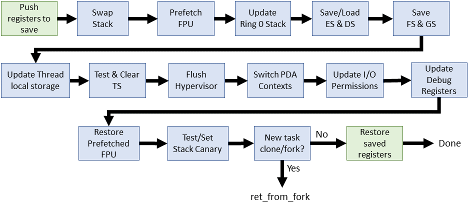

| Linux 3.0.1 (x86_64 inline assembly) |
| --- |
| /\*\* arch/x86/include/asm/system.h */  #define SAVE_CONTEXT    "pushf ; pushq %%rbp ; movq %%rsi,%%rbp\\n\\t" #define RESTORE_CONTEXT "movq %%rbp,%%rsi ; popq %%rbp ; popf\\t" #define \_\_EXTRA\_CLOBBER  \     ,"rcx","rbx","rdx","r8","r9","r10","r11","r12","r13","r14","r15" 	   #define **switch_to(prev, next, last)**     asm volatile(SAVE_CONTEXT          "movq %%rsp,%P\[threadrsp\](http://www.maizure.org/projects/evolution_x86_context_switch_linux/%\[prev\])\\n\\t" /* save RSP */          "movq %P\[threadrsp\](http://www.maizure.org/projects/evolution_x86_context_switch_linux/%\[next\]),%%rsp\\n\\t" /* restore RSP */          "call \_\_switch\_to\\n\\t"          "movq "\_\_percpu\_arg(\[current_task\])",%%rsi\\n\\t"          \_\_switch\_canary          "movq %P\[thread_info\](http://www.maizure.org/projects/evolution_x86_context_switch_linux/%%rsi),%%r8\\n\\t"          "movq %%rax,%%rdi\\n\\t"          "testl  %\[\_tif\_fork\],%P\[ti_flags\](http://www.maizure.org/projects/evolution_x86_context_switch_linux/%%r8)\\n\\t"          "jnz   ret\_from\_fork\\n\\t"          RESTORE_CONTEXT          : "=a" (last)            \_\_switch\_canary_oparam          : \[next\] "S" (next), \[prev\] "D" (prev),            \[threadrsp\] "i" (offsetof(struct task_struct, thread.sp)),            \[ti\_flags\] "i" (offsetof(struct thread\_info, flags)),            \[\_tif\_fork\] "i" (\_TIF\_FORK),            \[thread\_info\] "i" (offsetof(struct task\_struct, stack)),            \[current\_task\] "m" (current\_task)            \_\_switch\_canary_iparam          : "memory", "cc" \_\_EXTRA\_CLOBBER) |

Eight years and the `switch_to()` macro only gets 4 changes. Two of them related, and none of them earth-shattering.

`movq "__percpu_arg([current_task])",%%rsi\n\t`  
Moves the new `task_struct` in to RSI. This is the 'new' way to access task information as a static symbol for each CPU. Formerly, this was accessible through GS:\[pda offset\]. The subsequent operations on RSI are the same as 2.6

`__switch_canary`  
This macro enables further checks if the `CONFIG_CC_STACKPROTECTOR` macro is enabled during kernel build. I'm not going to dig too deep in to this rabbit hole, except to say that this mechanism protects against [smashing the stack for fun and profit](http://www-inst.eecs.berkeley.edu/~cs161/fa08/papers/stack_smashing.pdf). Basically, store a random value, then check it later. If it changed, bad things have happened.

`testl %[_tif_fork],%P[ti_flags](http://www.maizure.org/projects/evolution_x86_context_switch_linux/%%r8)\n\t`  
`jnz ret_from_fork\n\t`  
Tests if the new task was just created with clone/fork and then jumps to `ret_from_fork()`. Formerly, this was a `btr` instruction but now we defer the bit reset until after the call. The test to jump changed to JNZ due to the change of test: If the bit is set, the TEST (AND) will be positive.

`__switch_canary_oparam`  
Output stack canary for `CONFIG_CC_STACKPROTECTOR`

`__switch_canary_iparam`  
Input stack canary for `CONFIG_CC_STACKPROTECTOR`

| Linux 3.0.1 (x86_64 C) |
| --- |
| /\*\* arch/x86/kernel/process_64.c */  \_\_notrace\_funcgraph struct task_struct * **\_\_switch\_to(struct task\_struct \*prev\_p, struct task\_struct \*next\_p)** {     struct thread\_struct *prev = &prev\_p->thread;     struct thread\_struct *next = &next\_p->thread;     int cpu = smp\_processor\_id();     struct tss\_struct *tss = &per\_cpu(init_tss, cpu);     unsigned fsindex, gsindex;     bool preload_fpu;      preload\_fpu = tsk\_used\_math(next\_p) && next\_p->fpu\_counter > 5;      **/\* we're going to use this soon, after a few expensive things */**     if (preload_fpu)         prefetch(next->fpu.state);      **/\* Reload esp0, LDT and the page table pointer: */**     load_sp0(tss, next);      savesegment(es, prev->es);     if (unlikely(next->es | prev->es))         loadsegment(es, next->es);      savesegment(ds, prev->ds);     if (unlikely(next->ds | prev->ds))         loadsegment(ds, next->ds);      savesegment(fs, fsindex);     savesegment(gs, gsindex);      load_TLS(next, cpu);      \_\_unlazy\_fpu(prev_p);      **/\* Make sure cpu is ready for new context */**     if (preload_fpu)         clts();      arch\_end\_context\_switch(next\_p);      **/\* Switch FS and GS. */**     if (unlikely(fsindex | next->fsindex | prev->fs)) {         loadsegment(fs, next->fsindex);         if (fsindex)             prev->fs = 0;     }     **/\* when next process has a 64bit base use it */**     if (next->fs)         wrmsrl(MSR\_FS\_BASE, next->fs);     prev->fsindex = fsindex;      if (unlikely(gsindex | next->gsindex | prev->gs)) {         load\_gs\_index(next->gsindex);         if (gsindex)             prev->gs = 0;     }     if (next->gs)         wrmsrl(MSR\_KERNEL\_GS_BASE, next->gs);     prev->gsindex = gsindex;      **/\* Switch the PDA and FPU contexts. */**     prev->usersp = percpu\_read(old\_rsp);     percpu\_write(old\_rsp, next->usersp);     percpu\_write(current\_task, next_p);      percpu\_write(kernel\_stack,         (unsigned long)task\_stack\_page(next_p) +         THREAD\_SIZE - KERNEL\_STACK_OFFSET);      **/\* Now maybe reload the debug registers and handle I/O bitmaps */**     if (unlikely(task\_thread\_info(next\_p)->flags & \_TIF\_WORK\_CTXSW_NEXT ||             task\_thread\_info(prev\_p)->flags & \_TIF\_WORK\_CTXSW_PREV))         \_\_switch\_to\_xtra(prev\_p, next_p, tss);      **/\* Preload the FPU context - task is likely to be using it. */**     if (preload_fpu)         \_\_math\_state_restore();      return prev_p; } |

The C code section had a few more changes, but still relatively little considering the time span. Some are cosmetic, such as moving all declarations to the top. Here's what's new:

`__notrace_funcgraph struct task_struct * __switch_to(...)`  
The new signature `__notrace_funcgraph` prevents an active ftrace from using the function graph for `switch_to`

`preload_fpu = tsk_used_math(next_p) && next_p->fpu_counter > 5;`  
`if (preload_fpu)`  
`        prefetch(next->fpu.state);`  
Checks if the task has used the FPU for the last 5 timeslices, then attempts to grab the data to ensure that it's in the cache for later.

`load_sp0(tss, next);`  
Loads the kernel space stack pointer, forces the page tables to update, and now notifies the hypervisor (if applicable).

`savesegment(es, prev->es);`  
Stores the ES segment. Not really a change, just a replacement for the inline assembly from 2.6: `asm volatile("movl %%es,%0" : "=m" (prev->es));`

`if (preload_fpu)`  
`        clts();`  
Reloads the FPU immediately if the likelihood of use is high. The use of `clts()` is the same idea we've seen since the first version of Linux: `"cmpl %%ecx,%2\n\t     jne 1f\n\t     clts\n"`

`arch_end_context_switch(next_p);`  
This only matters under [virtualization](https://elixir.bootlin.com/linux/v3.0.1/source/arch/x86/include/asm/paravirt.h#L718). Under normal circumstances, this function [does nothing](https://elixir.bootlin.com/linux/v3.0.1/source/arch/x86/include/asm/pgtable.h#L82). More details in the final kernel version.

`if (unlikely(task_thread_info(next_p)->flags & _TIF_WORK_CTXSW_NEXT ||`  
`        task_thread_info(prev_p)->flags & _TIF_WORK_CTXSW_PREV))`  
`    __switch_to_xtra(prev_p, next_p, tss);`  
Handles the administrative work that used to be at the tail end of `switch_to`, including the debug registers and the I/O bitmap settings. I'll save this for the 4.14.62 detailed code walk.

`if (preload_fpu)`  
`        __math_state_restore();`  
Performs the FPU restore after verifying high-levels of FPU usage. Hopefully it landed in the cache by now thanks to the earlier prefetch.

* * *

## Linux 4.14.67 - The latest LTS kernel (2018)

This will be our most significant dive in to the innerworkings of the context switch. The procedure has received a lot of attention since 3.0, to include code organization. Overall, this code feels cleaner and more organized than ever before. For x86_64:

*   The top-level `switch_to()` macro has had its own header file in [arch/x86/include/asm/switch_to.h](https://elixir.bootlin.com/linux/v4.14.67/source/arch/x86/include/asm/switch_to.h#L71) since ~v3.4. The macro is called exactly once, at the end of the `context_switch()` in [kernel/sched/core.c](https://elixir.bootlin.com/linux/v4.14.67/source/kernel/sched/core.c#L2807)
*   Since 4.9, `switch_to()` has been broken in to two parts: a `prepare_switch_to()` macro and the inline assembly portion of has been moved to an actual assembly file ([arch/x86/entry/entry_64.S](https://elixir.bootlin.com/linux/v4.14.67/source/arch/x86/entry/entry_64.S#L333))
*   The C portion of the switch still occurs via a jump in the middle of the assembly code. The source is located in [arch/x86/kernel/process_64.c](https://elixir.bootlin.com/linux/v4.14.67/source/arch/x86/kernel/process_64.c#L395) since 2.6.24

| Linux 4.14.67 |
| --- |
| /\*\* arch/x86/include/asm/switch_to.h */  #define **switch_to(prev, next, last)** do {     prepare\_switch\_to(prev, next);      ((last) = \_\_switch\_to_asm((prev), (next)));	 } while (0) |

Looks simple compared to the older kernels. This reorganization is the result of a problem that arose while Andy Lutomirski was implementing [virtually mapped kernel stacks.](https://lwn.net/Articles/692208/)

`prepare_switch_to(prev, next);`  
Ensures that the kernel stacks are in place and accessible before attempting a context switch. This avoids a possible double-fault/kernel panic if we attempt to context switch when using virtually mapped kernel stacks.

`((last) = __switch_to_asm((prev), (next)));`  
Kicks off the actual context switch.

We'll take a quick look at `prepare_switch_to`, defined in the same source file.

| Linux 4.14.67 |
| --- |
| /\*\* arch/x86/include/asm/switch_to.h */  static inline void **prepare\_switch\_to**(struct task_struct *prev, 				     struct task_struct *next) { #ifdef CONFIG\_VMAP\_STACK 	READ_ONCE(*(unsigned char *)next->thread.sp); #endif } |

`#ifdef CONFIG_VMAP_STACK`  
Defined when the stack is using virtual memory. We only need to prepare for the context switch if we're using virtual stacks. This is a configuration option at kernel build time and defaults to yes with many modern distros.

`READ_ONCE(*(unsigned char *)next->thread.sp);`  
Touches the next stack now to fix up the page tables (pgd). The core issue is that we're attempting to access a pointer that's not only paged-out, but also not even in this task's memory context thanks to lazy-loading of the vmalloc area. Not here & not available [means kernel panic](https://lkml.org/lkml/2016/8/11/169) if not dealt with before we need it.

| Linux 4.16.67 |
| --- |
| /\*\* arch/x86/entry/entry_64.S */  ENTRY(**\_\_switch\_to_asm**)     UNWIND\_HINT\_FUNC 	     **/\* Save callee-saved registers */**     pushq	%rbp     pushq	%rbx     pushq	%r12     pushq	%r13     pushq	%r14     pushq	%r15      **/\* switch stack */**     movq	%rsp, TASK_threadsp(%rdi)     movq	TASK_threadsp(%rsi), %rsp  #ifdef CONFIG\_CC\_STACKPROTECTOR     movq	TASK\_stack\_canary(%rsi), %rbx     movq	%rbx, PER\_CPU\_VAR(irq\_stack\_union)+stack\_canary\_offset #endif  #ifdef CONFIG_RETPOLINE     FILL\_RETURN\_BUFFER %r12, RSB\_CLEAR\_LOOPS, X86\_FEATURE\_RSB_CTXSW #endif      **/\* restore callee-saved registers */**     popq	%r15     popq	%r14     popq	%r13     popq	%r12     popq	%rbx     popq	%rbp      jmp	\_\_switch\_to END(\_\_switch\_to_asm) |

[entry_64.S](https://elixir.bootlin.com/linux/v4.14.67/source/arch/x86/entry/entry_64.S#L333) contains the work formerly done via inline assembly for the first 25 years of Linux.

`UNWIND_HINT_FUNC`  
Generates hints used by the objtool stack tracing tool introduced over the past year. This is needed for special assembly procedures that don't fit the usual C calling conventions. Hints like this are the reason why the [ORC unwinder](https://lwn.net/Articles/728339/) has seen successful adoption since v4.6

`pushq %rbp, %rbx, %r12, %r13, %r14, %r15`  
Stores callee-saved registers to the **old stack** we're about to switch away from.

`movq %rsp, TASK_threadsp(%rdi)`  
`movq TASK_threadsp(%rsi), %rsp`  
Swaps out stack pointers between the old and the new task. It's not directly clear from the surrounding assembly, but RDI and RSI contain the input arguments `task_struct *`, **prev** and **next**. This follows System V ABI conventions. Here is a subset of registers along with their usage:

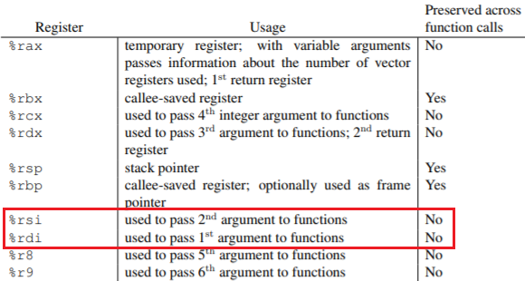  

`#ifdef CONFIG_CC_STACKPROTECTOR`  
`    movq TASK_stack_canary(%rsi), %rbx`  
`    movq %rbx, PER_CPU_VAR(irq_stack_union)+stack_canary_offset`  
If stack protection is enabled, then move this task's canary value in to the appropriate place in the current CPU's interrupt stack. Stack protection is usually enabled by default so this will likely happen.

`#ifdef CONFIG_RETPOLINE`  
`    FILL_RETURN_BUFFER %r12, RSB_CLEAR_LOOPS, X86_FEATURE_RSB_CTXSW`  
The return trampoline is a [mitigation](https://lkml.org/lkml/2018/1/4/724) for possible exploit of branch prediction (Spectre vulnerability). Pure [voodoo](https://elixir.bootlin.com/linux/v4.14.67/source/arch/x86/include/asm/nospec-branch.h#L36)!

`popq %r15, %r14, %r13, %r12, %rbx, %rbp`  
Restores all registers from the **new stack** previously pushed in reverse order: (r15, r14, r13, r12, rbx, rbp)

| Linux 4.16.67 ([source](https://elixir.bootlin.com/linux/v4.14.67/source/arch/x86/kernel/process_64.c#L395) with comments) |
| --- |
| /\*\* arch/x86/kernel/process_64.c */  \_\_visible \_\_notrace\_funcgraph struct task\_struct * **\_\_switch\_to**(struct task\_struct \*prev\_p, struct task\_struct \*next\_p) {     struct thread\_struct *prev = &prev\_p->thread;     struct thread\_struct *next = &next\_p->thread;     struct fpu *prev_fpu = &prev->fpu;     struct fpu *next_fpu = &next->fpu;     int cpu = smp\_processor\_id();     struct tss\_struct *tss = &per\_cpu(cpu\_tss\_rw, cpu);      WARN\_ON\_ONCE(IS\_ENABLED(CONFIG\_DEBUG_ENTRY) &&             this\_cpu\_read(irq_count) != -1);      switch\_fpu\_prepare(prev_fpu, cpu);      save\_fsgs(prev\_p);      load_TLS(next, cpu);      arch\_end\_context\_switch(next\_p);      savesegment(es, prev->es);     if (unlikely(next->es | prev->es))         loadsegment(es, next->es);      savesegment(ds, prev->ds);     if (unlikely(next->ds | prev->ds))         loadsegment(ds, next->ds);      load\_seg\_legacy(prev->fsindex, prev->fsbase,             next->fsindex, next->fsbase, FS);     load\_seg\_legacy(prev->gsindex, prev->gsbase,             next->gsindex, next->gsbase, GS);      switch\_fpu\_finish(next_fpu, cpu);      **/\* Switch the PDA and FPU contexts. */**     this\_cpu\_write(current\_task, next\_p);     this\_cpu\_write(cpu\_current\_top\_of\_stack, task\_top\_of\_stack(next\_p));      **/\* Reload sp0. */**     update\_sp0(next\_p);      **/\* Now maybe reload the debug registers and handle I/O bitmaps */**     if (unlikely(task\_thread\_info(next\_p)->flags & \_TIF\_WORK\_CTXSW_NEXT ||             task\_thread\_info(prev\_p)->flags & \_TIF\_WORK\_CTXSW_PREV))         \_\_switch\_to\_xtra(prev\_p, next_p, tss);  #ifdef CONFIG\_XEN\_PV     if (unlikely(static\_cpu\_has(X86\_FEATURE\_XENPV) &&             prev->iopl != next->iopl))         xen\_set\_iopl_mask(next->iopl); #endif      if (static\_cpu\_has\_bug(X86\_BUG\_SYSRET\_SS_ATTRS)) {         unsigned short ss_sel;         savesegment(ss, ss_sel);         if (ss\_sel != \_\_KERNEL_DS)             loadsegment(ss, \_\_KERNEL\_DS); 	}      **/\* Load the Intel cache allocation PQR MSR. */**     intel\_rdt\_sched_in();      return prev_p; } |

This final code block brings us up to date with the context switch of today! If you skipped right to here, don't worry - I'll (re)cover most of the points here and in more detail. Watch for the number of corner-cases that have leaked in to the context switch.

`__visible __notrace_funcgraph struct task_struct * __switch_to(struct task_struct *prev_p, struct task_struct *next_p)`  
The signature for the C context switch has a few parts to unpack:

*   **__visible** \- This attribute ensures that [link-time optimization](https://lwn.net/Articles/512548/) won't remove the `__switch_to()` symbol.
*   **\_\_notrace\_funcgraph** \- Filters `__switch_to()` from appearing in the ftrace function graph. This feature was added in around v2.6.29 and included this function shortly afterward.
*   The input arguments are pointers to the old and new task which are passed in RDI and RSI

`struct thread_struct *prev = &prev_p->thread;`  
`struct thread_struct *next = &next_p->thread;`  
`struct fpu *prev_fpu = &prev->fpu;`  
`struct fpu *next_fpu = &next->fpu;`  
Collects some information from both input `task_struct *`. The `thread_struct` [contains](https://elixir.bootlin.com/linux/v4.14.67/source/arch/x86/include/asm/processor.h#L451) TSS data for the tasks (registers, etc). The `fpu>` structs [contain](https://elixir.bootlin.com/linux/v4.14.67/source/arch/x86/include/asm/fpu/types.h#L281) fpu data such as the last cpu used, initialization, and register values.

`int cpu = smp_processor_id();`  
Gets the processor number that we'll need for managing CPU-specific GDT for TSS data, thread local storage, and comparing fpu state.

`struct tss_struct *tss = &per_cpu(cpu_tss_rw, cpu);`  
Points to the [current CPU TSS](https://elixir.bootlin.com/linux/v4.14.67/source/arch/x86/kernel/process.c#L51).

`WARN_ON_ONCE(IS_ENABLED(CONFIG_DEBUG_ENTRY) &&`  
`        this_cpu_read(irq_count) != -1);`  
Detects if the IRQ stack is in use during context switch and reports it once per boot. This was added early in 4.14 development and has no actual effect on the context switch.

`switch_fpu_prepare(prev_fpu, cpu);`  
Saves the current FPU state while we're still in the old task.

`save_fsgs(prev_p);`  
Stores FS and GS now before we change thread local storage

`load_TLS(next, cpu);`  
Reloads the GDT for the new tasks thread local storage. Mechanically this copies the tls_array from the new thread in to GDT entries 6, 7, and 8.

`arch_end_context_switch(next_p);`  
This function is only defined under paravirtualization. Changes paravirt mode and cleans up any remaining batched work. Introduced late in the 2.6 series. Not my strong area so I'll leave that for readers to [research](https://en.wikipedia.org/wiki/Paravirtualization#Linux_paravirtualization_support)

`savesegment(es, prev->es);`  
`    if (unlikely(next->es | prev->es))`  
`    loadsegment(es, next->es);`  
Stores the ES segment and loads a new one if appropriate. Similar call to DS omitted. Even if the new task doesn't use DS/ES, it still clears out any old values.

`load_seg_legacy(prev->fsindex, prev->fsbase,`  
`next->fsindex, next->fsbase, FS);`  
Loads the new FS segments (GS omitted). This will detect and load the registers for both 32 and 64-bit register types. New task is now ready for TLS action.

`switch_fpu_finish(next_fpu, cpu);`  
Initializes FPU state for the incoming task

`this_cpu_write(current_task, next_p);`  
Updates the CPU's current task (`task_struct *`. Effectively updates both the new FPU and PDA (per-processor data area) states.

`this_cpu_write(cpu_current_top_of_stack,`  
`    task_top_of_stack(next_p));`  
Updates the CPU's top of stack pointer, which is actually an overloaded use of sp1 as an [entry trampoline](https://elixir.bootlin.com/linux/v4.14.67/source/arch/x86/entry/entry_64.S#L162) for security.

`update_sp0(next_p);`  
Taps the new stack to validate it. This doesn't appear to be sp0, but sp1? Should probably be renamed

`if (unlikely(task_thread_info(next_p)->flags & _TIF_WORK_CTXSW_NEXT ||`  
`        task_thread_info(prev_p)->flags & _TIF_WORK_CTXSW_PREV))`  
`    __switch_to_xtra(prev_p, next_p, tss);`  
Updates debug registers and I/O bitmaps. These two tasks used to be directly handled in the context switch, but have now moved to `__switch_to_xtra()`.

`#ifdef CONFIG_XEN_PV`  
`if (unlikely(static_cpu_has(X86_FEATURE_XENPV) &&`  
`        prev->iopl != next->iopl))`  
`    xen_set_iopl_mask(next->iopl);`  
Manually swaps out I/O privilege bits for Xen Paravirtualization. Apparently the usual flag switch [doesn't work properly](https://people.canonical.com/~ubuntu-security/cve/2016/CVE-2016-3157.html) and so have to directly mask the current bits.

`if (static_cpu_has_bug(X86_BUG_SYSRET_SS_ATTRS)) {`  
`    unsigned short ss_sel;`  
`    savesegment(ss, ss_sel);`  
`    if (ss_sel != __KERNEL_DS)`  
`        loadsegment(ss, __KERNEL_DS);`  
Covers up an [unexpected SYSRET behavior](https://lore.kernel.org/patchwork/patch/564016/) in AMD CPUs that doesn't properly update segment descriptors.

`intel_rdt_sched_in();`  
Some Intel resource management housekeeping. Updates [RMID and CLOSid](https://software.intel.com/en-us/blogs/2014/12/11/intel-s-cache-monitoring-technology-software-visible-interfaces)

`return prev_p;`  
Done!

* * *

## FAQ

**Why did you choose these kernel versions?**  
The first and last one versions were the obvious bookends. I originally planned for 4 more intermediate version (2.1, 2.3, 2.5, and 2.6.26), but some of the changes just weren't enough to balloon the article. It's already too long.

**How long did this research take?**  
Two weeks. One week of code walking, note taking, and technical manuals. Then one week of transcribing notes, making diagrams, and formatting this article.

**4.14.67 isn't the latest LTS release?**  
I started code reading on Sept 1st and pulled the source for 4.14.67. 4.14.68 was finalized four days later.

**More questions added as they roll in**