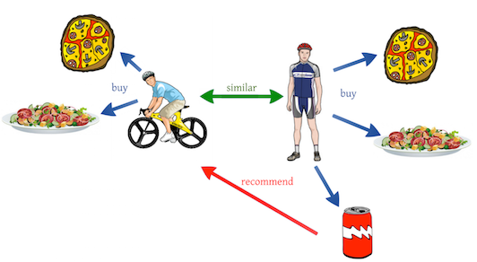
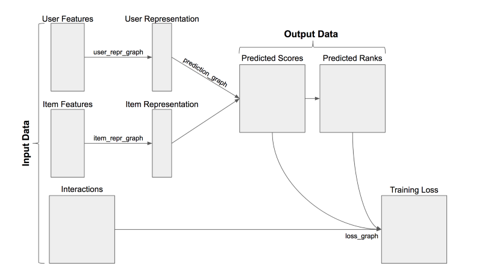

Getting Started with Recommender Systems and TensorRec

# Getting Started with Recommender Systems and TensorRec

## Prototyping a recommender system, step-by-step.



Recommender systems are used in many products to present users with relevant or personalized items (food, movies, music, books, news, etc). To do this, they learn from users’ previous interactions with items to identify users’ tastes and improve future recommendations.

This post will walk us through the prototyping of a new recommender system in Python using [TensorRec](https://github.com/jfkirk/tensorrec) including input data manipulation, algorithm design, and usage for prediction.

You can find the Python code from this post’s example [here](https://github.com/jfkirk/tensorrec/blob/master/examples/getting_started.py).

* * *

### System Overview

[TensorRec](https://github.com/jfkirk/tensorrec) is a Python package for building recommender systems. A TensorRec recommender system consumes three pieces of input data: user features, item features, and interactions. Based on the user/item features, the system will predict which items to recommend. The interactions are used when fitting the model: predictions are compared to the interactions and a loss/penalty is calculated, which the system learns to decrease.



As we prototype our system, we’ll be tackling three major topics: how we handle interactions, how we handle features, and how we structure the recommender itself.

### Interaction Data

For this example we’ll use the [MovieLens dataset](https://grouplens.org/datasets/movielens/). This dataset contains 1–5 star ratings for movies, metadata about those movies, and tags that users applied to the movies. For our first prototype we’ll focus on the ratings, but we’ll return to the other metadata later.

In raw form, the ratings look like this:

```
userId, movieId, rating, timestamp  
1,      1,       4.0,    964982703  
1,      3,       4.0,    964981247  
1,      6,       4.0,    964982224  
1,      47,      5.0,    964983815  
1,      50,      5.0,    964982931  
1,      70,      3.0,    964982400 
```

Each row represents a single rating: one user’s thoughts about one movie. We’ll be using these ratings as our interactions. Our first step toward training this system is to ingest and format this interaction data. First, we read in the CSV file of ratings.

At this point, we’ll break the ratings in to a training and test set by shuffling and splitting the ratings. Our prototypes will be trained on the training set, and we’ll evaluate their success using the test set. Splitting the train/test sets at random like this is crude, and there are more rigorous techniques for model evaluation, but it is quick and clear for the purposes of this example.


Next, we reorganize these ratings in to a [Scipy sparse matrix](https://docs.scipy.org/doc/scipy/reference/sparse.html). In this matrix, every row represents a user and every column is a movie. The \[_i, j_\]th value in this matrix is User _i_’s interaction with Movie _j_.

### Collaborative Filter Prototype

A collaborative filter is an algorithm that learns which users have similar tastes and recommends items to a user based on what similar users have liked. A common way to do this is through [matrix factorization](https://www.cs.cmu.edu/~mgormley/courses/10601-s17/slides/lecture25-mf.pdf). In matrix factorization, we have to learn two matrices (user representations and item representations) that, when multiplied together, approximate the interactions:


From Wikipedia

In this case, rows of _W_ are the user representations, columns of _H_ are the item representations, and values in _V_ are the interactions. _W_ and _H_ need to be learned to produce the best approximation of _V._

The width of _W_ and the height of _H_ are the same — this shared dimension is referred to as the “number of components.” A model with more components is learning more complex representations of users and items, but this can lead to over-fitting the training data. In general, we want to try to squeeze lots of information in to small representations. For this reason, in our prototype I’ve arbitrarily chosen to use 5 components. When prototyping further, we should experiment with increasing and decreasing the number of components and be wary of over-fitting.

TensorRec will perform matrix factorization by default if it is given only identity matrices as user/item features. These identity matrices are often called “indicator features.”

We have now created the two indicator feature matrices, built a simple collaborative filter model with 5 components, and fit the model!

Next, of course, we’ll want to see how well the model performs.

To do this, we’ll look at a metric called “recall at K.” Recall@K says, for the average user, what percentage of their test items made it in to the top _K_ in the predicted rankings. In other words, if we get a recall@10 value of .06, then there is a 6% chance that a particular movie I like will make it in to my top 10 recommendations.

Recall@K is a nice metric for many recommender systems because it emulates the behavior of a recommendation product: If a movie website is only going to show me my top 10 recommendations, then their algorithm will want to be effective at putting movies I like in my top 10.

Before calculating the recall, we’ll want to decide which interactions should count as a “like.” In this case, I’ve chosen to use all ratings of at least 4.0 as “likes” and ignore the rest.

Great! Let’s check the results:

Matrix factorization collaborative filter:  
Recall at 10: Train: 0.0008 Test: 0.0010

…Not great. These results tell us that, among the test-set movies, there is only a .1% chance that a liked movie made it in to the top 10. This recommender system is ineffective, and we’ll want to look for ways to improve it.

### Loss Graphs

One way we can configure our TensorRec system is by changing the loss graph. The loss graph takes in predictions and interactions and calculates a penalty (loss) that the system will try to decrease as it learns.

By default, TensorRec uses RMSE (root mean square error) as the loss graph. This means that TensorRec is trying to estimate the values of the interactions exactly: if I rated a movie 4.5, TensorRec is trying to produce a predicted score of exactly 4.5.

This is intuitive, but it doesn’t line up with how recommender systems work in many products: a movie website doesn’t need to predict my rating exactly, it just needs to be able to rank movies I will like above movies I won’t like. For this reason, many systems function by “learning to rank.” We can make our TensorRec system work this way by using a loss graph called WMRB.

[WMRB, which stands for “weighted margin-rank batch,”](https://arxiv.org/abs/1711.04015) works by taking a random sample of items the user hasn’t interacted with and comparing their predictions to items the user likes. Over time, this pushes items a user likes to the top of the rankings.

We can tell TensorRec to use WMRB by specifying it when we construct the model and specifying the size of the sample batch when fitting the model. In this case, we’ll want to train the model on only the positive ratings (≥4.0) so WMRB pushes those to the top.

Let’s look at the results:

WMRB matrix factorization collaborative filter:  
Recall at 10: Train: 0.1098 Test: 0.0776

Much better! We’ve gone from a .1% chance of a liked item reaching the top 10 all the way to a 7.76% chance. This is an example of how impactful the right loss function can be. TensorRec allows you to specify and customize your own loss graphs, and you can see more example loss graphs [here](https://github.com/jfkirk/tensorrec/blob/master/tensorrec/loss_graphs.py).

### Adding Metadata Features

To continue experimenting, we should try to make use of other data available to us. In the MovieLens example, we can use movie metadata, such as the movie’s genres, to enrich the recommendations.

In raw form, the movie metadata file looks like this:

movieId, title,                    genres  
1,       Toy Story (1995),         Adventure|Animation|Children|C...  
2,       Jumanji (1995),           Adventure|Children|Fantasy  
3,       Grumpier Old Men (1995),  Comedy|Romance  
4,       Waiting to Exhale (1995), Comedy|Drama|Romance  
...

First, we’ll want to read this data, map the movies to our internal IDs, and keep track of the genres for each movie. Then we’ll binarize the genre labels using [Scikit’s MultiLabelBinarizer](https://scikit-learn.org/stable/modules/generated/sklearn.preprocessing.MultiLabelBinarizer.html#sklearn.preprocessing.MultiLabelBinarizer). The binarized output will be our features for our new recommender system.

Running this will print out an example of the raw metadata and the binarized genres:

Raw metadata example:  
\['movieId', 'title', 'genres'\]  
\[0, 'Toy Story (1995)', \['Adventure', 'Animation', 'Children', 'Comedy', 'Fantasy'\]\]

Binarized genres example for movie Toy Story (1995):  
\[0 0 1 1 1 1 0 0 0 1 0 0 0 0 0 0 0 0 0 0\]

### Content-based Recommendation

Now that we have metadata about our items, one thing we can try is to recommend based solely on the item metadata.

To do this, we will configure a TensorRec model to use a pass-through representation graph for item features. For us, this means that the item representations will be the same as the item features that are passed in (just the movie genres) and the user representations will reflect how much the user likes that particular genre.

Great! Let’s check the results:

Content-based recommender:  
Recall at 10: Train: 0.0471 Test: 0.0130

It’s not as good as the ranking collaborative filter but, with a recall@10 of 1.3%, it’s significantly more effective than our very first collaborative filter.

There is a major weakness to this system: genres alone are not very descriptive and are not enough information to make an informed recommendation. If we had more descriptive metadata (more tags, actors, sub-genres, etc) we may have more success with this content-based recommender system.

On the other hand, there is a major strength to this system: by relying on only metadata features, and not using indicator features, we can recommend movies which were not present when training the model. Similarly, if we have valuable user metadata we can avoid using user indicator features and make predictions for users who’ve never interacted with a movie before. This is called “cold-start” recommendation.

### Hybrid Model

We know that our ranking collaborative filter gave us the best results, but it seems there is some value in using the movie metadata. Let’s combine these two: we’ll use indicator features to get the strengths of a collaborative filter, and we’ll also use the content features to take advantage of the metadata. Systems like this that combine collaborative filtering and content-based recommendation are called “hybrid” models.

We do this by stacking the two sets of features together:

Great! Let’s check the results:

Hybrid recommender:  
Recall at 10: Train: 0.1196 Test: 0.0794

With a recall@10 of 7.94%, this is our strongest recommender system yet. Compared to the pure collaborative filter’s result of 7.76% the difference isn’t profound, but it is still an improvement. If we use more metadata than just genres, we’ll likely see an even larger impact.

### Making Recommendations

We have a trained model and now we can use this model to make recommendations for our users. We do this by passing the user’s feature vector and all the item features to `predict_rank()` and examining the resulting rankings:

This code snippet will print out the top 10 recommendations for user 432. I chose user 432 because I am familiar with the movies they’ve rated, so I feel I can put myself in their shoes and judge their recommendations. We should note that the movies user 432 has already rated will still be included — if we want to filter those out, we will need to do that with a post-processing step.

Let’s look at user 432’s training data to see what kinds of movies they like:

User 432 liked:  
Usual Suspects, The (1995)  
Pulp Fiction (1994)  
Silence of the Lambs, The (1991)  
Reservoir Dogs (1992)  
Shawshank Redemption, The (1994)  
Kill Bill: Vol. 1 (2003)  
Social Network, The (2010)  
Trainspotting (1996)  
Arrival (2016)  
My Big Fat Greek Wedding (2002)

Some crime, some dark comedy, and a notable love for Tarantino. Let’s look at user 432’s recommendations from our hybrid model:

User 432 recommendations:  
Seven (a.k.a. Se7en) (1995)  
Usual Suspects, The (1995)  
Pulp Fiction (1994)  
Silence of the Lambs, The (1991)  
Fargo (1996)  
American Beauty (1999)  
Fight Club (1999)  
Shawshank Redemption, The (1994)  
Departed, The (2006)  
Memento (2000)

Some more crime flicks with a definite dark comedy bent! This looks pretty good at-a-glance, but let’s check user 432’s test movies:

User 432's held-out movies:  
Fargo (1996)  
American History X (1998)  
Fight Club (1999)  
Dark Knight Rises, The (2012)

Both Fargo and Fight Club made it in to user 432’s recommendations — this is a great result! For this specific user, we achieved a recall@10 of 50%.

### Going Forward

To continue to refine our recommender system we should experiment with more representation, prediction, and loss graphs, providing more metadata to the system, engineering those metadata features differently, managing interaction/feedback data differently, and optimizing the various hyper-parameters of the system.

I recently had the chance to visit [MITRE](https://twitter.com/MITREcorp) to discuss many of the design choices when designing and deploying recommender systems. You can find a video of the talk [here](https://www.youtube.com/watch?v=xBMGr08fowA&t=3m58s).

If you have questions, please feel free to ask them here or [open a GitHub issue](https://github.com/jfkirk/tensorrec/issues).

Thanks to [Darien Maillet Valentine](https://medium.com/@valentinium?source=post_page).

*   [Machine Learning](https://towardsdatascience.com/tagged/machine-learning?source=post)
*   [Data Science](https://towardsdatascience.com/tagged/data-science?source=post)
*   [Python](https://towardsdatascience.com/tagged/python?source=post)
*   [TensorFlow](https://towardsdatascience.com/tagged/tensorflow?source=post)
*   [Recommendation System](https://towardsdatascience.com/tagged/recommendation-system?source=post)