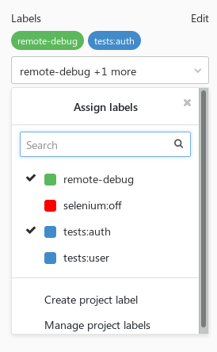
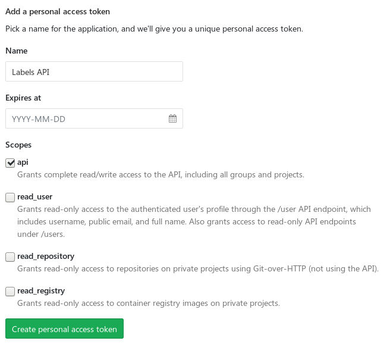
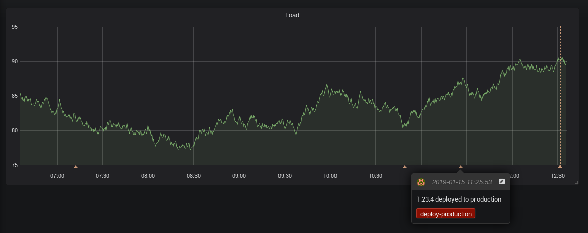
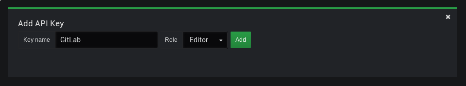

GitLab CI tips for building custom workflows

This time I’d like to touch on a few more advanced topics related to GitLab CI. The common theme here is implementing custom features within your pipeline. Again, most of the tips are specific to GitLab, but some could be easily applied in other CI systems as well.

## Running integration tests

Checking your code with **unit tests** is usually easy to plug into any CI system. It usually is as simple as running one command built in your language’s toolset. In these tests, you will most likely use various mocks and stubs to hide implementation details and focus on testing particular logic. For example, you can use in-memory database as storage or write stub HTTP clients that always return some prepared payloads.

However, eventually, you will need to run **integration tests** to cover more unusual test cases. I don’t want to start a discussion on all possible test types here, so let me say this: by _integration tests_ I mean tests that use some sort of external resource. This can be a real database server, an HTTP service, attachable storage, and so on.

GitLab makes it trivial to run attached resources as Docker containers, linked with the container running your scripts. You can use the [services](https://docs.gitlab.com/ee/ci/docker/using_docker_images.html#what-is-a-service) keyword to define these dependencies. They will be accessible by their image name or your chosen name if you specify it in the `alias` field.

This is a simple example of using an attached MySQL container:

    integration_tests:
      stage: tests
      services:
        - name: mysql:8
          alias: db
      script:
        - ./run_tests.sh db:3306

In that case, you have to connect to the `db` hostname in your test scripts. Using an alias is usually a good idea, as you can switch the images without changing the test code. For example, you could change `mysql` image with `mariadb` and the script would still run correctly.

### Using Docker Compose

Using `services` should be good enough for most of your use cases. However, sometimes you need the external services to communicate with each other. One example may be running Kafka and ZooKeeper in two separate containers (the official images are built this way). Another is running tests with a dynamic number of nodes, like selenium. For running services like this, a better solution is to use [Docker Compose](https://docs.docker.com/compose/).

    version: '3'
    services:
      zookeeper:
        image: confluentinc/cp-zookeeper
        environment:
          ZOOKEEPER_CLIENT_PORT: 2181
    
      kafka:
        image: confluentinc/cp-kafka
        environment:
          KAFKA_ZOOKEEPER_CONNECT: zookeeper:2181
          KAFKA_ADVERTISED_LISTENERS: PLAINTEXT://kafka:9092
        ports:
          - 9092:9092

If you’re running your own GitLab runners on a trusted server, you can use [Shell executor](https://docs.gitlab.com/runner/executors/shell.html) to run Docker Compose.  
Another option may be using [Docker in Docker](https://hub.docker.com/_/docker) (`dind`) container. [Read this first](https://jpetazzo.github.io/2015/09/03/do-not-use-docker-in-docker-for-ci/), though.

One way of using Compose is to set up the environment, run tests and tear it down. A simple bash script would look like this:

    docker-compose up -d
    ./run_tests.sh localhost:9092
    docker-compose down

This solution is fine as long as your tests can run in a minimal environment. It may happen though, that you will need some dependencies installed. There is another way of running tests in Docker Compose that lets you built your own docker image with the test environment. You make one of the containers run the tests and exit with proper code.

    version: '3'
    services:
      zookeeper:
        image: confluentinc/cp-zookeeper
        environment:
          ZOOKEEPER_CLIENT_PORT: 2181
    
      kafka:
        image: confluentinc/cp-kafka
        environment:
          KAFKA_ZOOKEEPER_CONNECT: zookeeper:2181
          KAFKA_ADVERTISED_LISTENERS: PLAINTEXT://kafka:9092
    
      tests:
        image: registry.example.com/some-image
        command: ./run_tests.sh kafka:9092

Notice that we got rid of the `ports` mapping. In this example, tests can communicate directly with all services.

Tests can now be executed with a single command:

    docker-compose up --exit-code-from tests

The `--exit-code-from` option implies `--abort-on-container-exit`, which means the whole environment started by `docker-compose up` will be stopped after one of the containers exits. The exit code of that command will be equal to the exit code of the chosen service (`tests` in the example above). So if the command running your tests exits with a non-zero code, the whole `docker-compose up` command will exit with this code.

A word of warning: this is rather an unusual idea, but one I’ve found very useful and flexible. As you probably know, GitLab has [Labels](https://docs.gitlab.com/ee/user/project/labels.html) feature on project and group levels. Labels can be attached to issues and merge requests. They have no relation to the pipelines, though.

With a bit of hacking, you can access the merge request labels in the job scripts. As of GitLab 11.6, this is now even easier, as there is a `CI_MERGE_REQUEST_IID` environment variable (yes, it’s `IID`, not `ID`) available if your pipeline is using `only: merge_requests`.

When you get the MR IID, all that’s left is to call the [Merge Requests API](https://docs.gitlab.com/ee/api/merge_requests.html) and use the `labels` field from the response.

    curl "$CI_API_V4_URL/projects/$CI_PROJECT_ID/merge_requests/$CI_MERGE_REQUEST_IID?private_token=$GITLAB_TOKEN"

Sadly, using `$CI_JOB_TOKEN` to access project’s API is [not possible at the moment](https://gitlab.com/gitlab-org/gitlab-ce/issues/29566) (at least unless the project is public). If your project has restricted access (internal or private), you will need to generate a personal API token to authorize with the GitLab API.

This is not the most secure solution, though, so be careful. If this token would be leaked, someone could gain write access to all of your projects. One way of reducing the risk is to create a separate account with read-only access to the repository and generate a personal token for this account.

### Use cases

It’s now up to you to decide what to do with the list of labels. Some ideas:

*   Use it for tests segmentation.
*   Introduce key-value semantics with a colon (e.g. labels like `tests:auth`, `tests:user`)
*   Enable some specific features for jobs.
*   Allow debugging of specific jobs when a label is present.

## Calling external APIs

While GitLab comes with a suite of included features, it’s very likely you still use other tools that could be integrated with your pipelines. The simplest way to do it is of course by good old `curl` calls.

If you’re writing your own tools, you could also have it listen to [GitLab’s Webhooks](https://docs.gitlab.com/ee/user/project/integrations/webhooks.html) (look up the **Integrations** tab in the project’s settings). If you’d use it with some critical systems though, make sure they are highly-available.

### Example: Grafana annotations

If you’re using [Grafana](https://grafana.com/), [annotations](http://docs.grafana.org/reference/annotations/) are a nice way of marking on graphs an event that happened in time. While it’s possible to add them by clicking in the GUI, they can also be added by the [Grafana REST API](http://docs.grafana.org/http_api/annotations/).

You will need to generate an API Key to access the API. Consider creating a dedicated user with restricted access.

Set two variables in your project settings:

*   `GRAFANA_URL` \- the URL of your Grafana instance (e.g. `https://grafana.example.com`)
*   `GRAFANA_APIKEY` \- the generated API Key

To keep it re-usable, you can put the script in the [common scripts repository](https://threedots.tech/post/keeping-common-scripts-in-gitlab-ci/):

    #!/bin/bash
    set -e
    
    if [ $# -lt 2 ]; then
        echo "Usage: $0 <text> <tag>"
        exit 1
    fi
    
    readonly text="$1"
    readonly tag="$2"
    readonly time="$(date +%s)000"
    
    cat >./payload.json <<EOF
    {
        "text": "$text",
        "tags": ["$tag"],
        "time": $time,
        "timeEnd": $time
    }
    EOF
    
    curl -X POST "$GRAFANA_URL/api/annotations" \
         -H "Authorization: Bearer $GRAFANA_APIKEY" \
         -H "content-type: application/json" \
         -d @./payload.json

Now call it with proper parameters in the CI definition:

    deploy:
        stage: deploy
        script:
          - $SCRIPTS_DIR/deploy.sh production
          - $SCRIPTS_DIR/grafana-annotation.sh "$VERSION deployed to production" deploy-production

You could also put it in the `deploy.sh` script to keep the CI definition even simpler.

## Bonus quick tips

GitLab has a [great documentation](https://docs.gitlab.com/ee/ci/yaml) on all possible keywords in the CI definition. I don’t want to duplicate the content here, but I’d like to point out a few useful use cases. Click on the headers to view the docs.

### [Advanced only/except usage](https://docs.gitlab.com/ee/ci/yaml/#only-and-except-simplified)

Use pattern matching on variables to enable custom builds for some of the branches. You don’t want to overuse it, but if you quickly need to push a hotfix, this might help.

    only:
      refs:
        - branches
      variables:
        - $CI_COMMIT_REF_NAME =~ /^hotfix/

GitLab includes a lot of [predefined variables](https://docs.gitlab.com/ee/ci/variables/#predefined-variables-environment-variables) in each CI job, make use of them.

### [YAML anchors](https://docs.gitlab.com/ee/ci/yaml/#anchors)

Use them to avoid duplication.

Since 11.3 you can also use the [extends](https://docs.gitlab.com/ee/ci/yaml/#extends) keyword.

    .common_before_script: &common_before_script
      before_script:
        - ...
        - ...
    
    deploy:
      <<: *common_before_script

### [Skipping dependencies](https://docs.gitlab.com/ee/ci/yaml/#dependencies)

By default, all artifacts built in the pipeline will be passed to all following jobs. You can save some time and disk space by explicitly listing artifacts the jobs depends on:

Alternatively, skip them entirely if none are required:

### [Git strategy](https://docs.gitlab.com/ee/ci/yaml/#git-strategy)

Skip cloning the repository if the job won’t use its files.

    variables:
      GIT_STRATEGY: none

## That’s it!

Thanks for reading! Hit me up with feedback or questions on [Twitter](https://twitter.com/m1_10sz) or [Reddit](https://www.reddit.com/user/mi_losz).

For more GitLab tips, check out my previous posts:

*   [Keeping common scripts in GitLab CI](https://threedots.tech/post/keeping-common-scripts-in-gitlab-ci/)
*   [Automatic Semantic Versioning in GitLab CI](https://threedots.tech/post/automatic-semantic-versioning-in-gitlab-ci/)