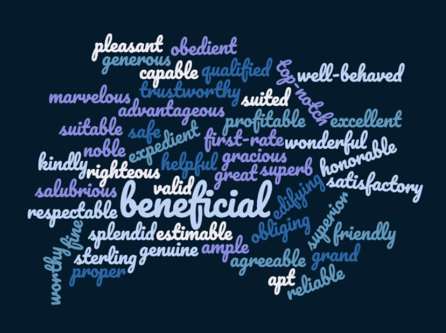
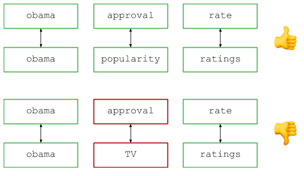
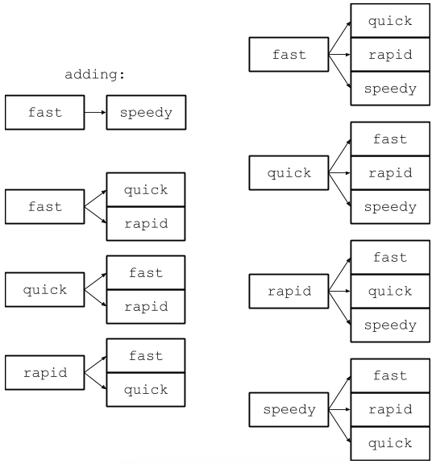
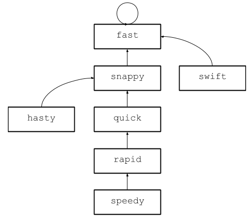
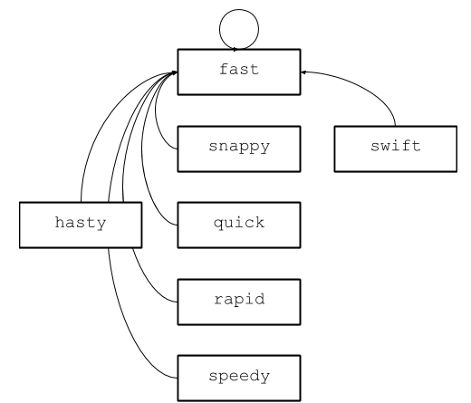

Google Interview Problems: Synonymous Queries – Alex Golec – Medium

* * *

# Google Interview Questions Deconstructed: Synonymous Queries



Welcome to another edition of [Google Interview Problems Deconstructed](https://medium.com/@alexgolec/introducing-google-interview-questions-deconstructed-a012e41ea631), a series in which I present the interview problems I used to use to interview candidates at Google until they were leaked and banned from use in interviews. My loss is your gain, however, because once they’re out in the world I can write them up and explain them to you.

Before I dive in, I have some exciting news: I’ve left Google! I’m excited to announce that I’ve joined Reddit as an engineering manager in NYC! I’m still gonna publish this series, though, so stay tuned.

_A disclaimer: while interviewing candidates is one of my professional responsibilities, this blog represents my personal observations, my personal anecdotes, and my personal opinions. Please don’t mistake this for any sort of official statement by or on behalf of Google, Alphabet, Reddit, or any other person or organization._

**The Question**

One of the criticisms I get about the knight’s dialer question I described in the last [two](https://hackernoon.com/google-interview-questions-deconstructed-the-knights-dialer-f780d516f029) [posts](https://medium.com/@alexgolec/google-interview-questions-deconstructed-the-knights-dialer-impossibly-fast-edition-c288da1685b8) is that it’s not a realistic problem. As helpful as it might be to probe a candidate’s thinking, I admit it’s ultimately a bit of an unrealistic exercise. (I _do_ have some thoughts about whether it’s important to have a correlation between interview questions and reality, but I’m going to save them for a future post. Rest assured, comment sections everywhere, I hear you and I have things to say. Just not now.)

In the meantime, when the knight’s dialer was banned a few years ago, I took the feedback to heart and tried to replace it with a question that’s a little more relevant to Google. And what can be more relevant to Google than the mechanics of search queries? I found this question and used it for a good long time before it was also leaked and banned. As before, I’ll present the question, dive into its explanation, and then discuss how I used this question in interviews and why I like it:

Imagine you operate a popular search engine and in your logs you observe two queries, let’s say “obama approval ratings” and “obama popularity rate.” (If I recall correctly, these were the actual examples used in the interview problem database, which dates the question a bit…) Those two queries are different strings, but I think we can all agree that they’re basically searching for the same thing, and should be considered equivalent when counting queries, showing results, etc. How can we detect that two queries are synonymous?

Let’s formalize this. Suppose you’re given two inputs. First, a list of pairs of strings representing synonyms where the two strings in the pair are synonymous with one another. Secondly, a list of pairs of strings representing queries.

To make this concrete, here is a sample input to illustrate:

Your task is to output a list of boolean values such that each entry in the output indicates whether the corresponding pair of queries are synonymous.

**Questions, Questions**

On the face of it, this is a simple problem. However, the closer you look, the more complex it becomes. Right off the bat, it becomes clear this problem is pretty under-defined. Can words have multiple synonyms? Does word order matter? Are synonym relationships transitive, meaning if _A_ is synonymous with _B_, and _B_ is synonymous with _C_, does that mean _A_ is synonymous with _C_? Can synonyms span multiple words, such as how “USA” is synonymous with “United States of America” or “United States”?

This ambiguity immediately gives good candidates an opportunity to set themselves apart. The first thing a good candidate does is sniff out these sorts of ambiguities and try to resolve them. How they do this varies from candidate to candidate: some step up to the whiteboard to try to manually solve specific cases, whereas some take one look at the question and see the gaps immediately. In any case, spotting these issues early is crucial.

I place a lot of importance on this question’s “problem understanding” phase. Software engineering is what I like to call a fractal discipline, meaning it shares a quality with fractals where zooming in reveals additional complexity. Just when you think you understand a problem, you look closer and realize there’s a subtlety you overlooked, or there’s an implementation detail you can improve on, or there’s a new way of framing the problem that reveals additional insight.


The Mandelbrot set

An engineer’s caliber is largely determined by how deeply they can understand a problem. Transforming a vague problem statement into a detailed set of requirements is step zero in this process, and purposefully under-defining the problem allows me to assess how well a candidate approaches novel situations.

_As an aside, there are also the trivial questions like “does capitalization matter?” that, unbeknownst to the candidate, don’t affect the core algorithmic problem. For these questions, I always give whatever answer is easiest on the candidate (in this case, “assume everything is already preprocessed to be lowercase”)._

**Part 1: The (Not So) Simple Case**

However candidates arrive at these questions, they inevitably end up asking me for an answer, and I always start off with the simplest case possible: words can have multiple synonyms, order matters, synonyms are not transitive, and synonyms can only map from one word to another. This makes for a pretty limited feature in a search engine, but there’s more than enough subtlety in it to make for an interested interview question.

The high-level overview of the solution is as follows: break the query up into words (splitting along spaces is fine), and compare pairs of corresponding words to see if they are either identical or synonymous with one another. Visually, it looks like so:



In implementation, it looks a little something like this:

```
def synonym_queries(synonym_words, queries):
    '''
    synonym_words: iterable of pairs of strings representing synonymous words
    queries: iterable of pairs of strings representing queries to be tested for 
             synonymous-ness
    '''
    output = []
    for q1, q2 in queries:
        q1, q2 = q1.split(), q2.split()
        if len(q1) != len(q2):
            output.append(False)
            continue
        result = True
        for i in range(len(q1)):
            w1, w2 = q1[i], q2[i]
            if w1 == w2:
                continue
            elif words_are_synonyms(w1, w2):
                continue
            result = False
            break
        output.append(result)
    return output
```

note `words_are_synonyms` is purposefully not defined

Easy, right? Algorithmically, this is pretty simple. No dynamic programming, no recursion, no tricky data structures, etc. Just simple, straightforward manipulation of the standard library, and a linear time algorithm, right?

You’d think, but there’s more subtlety here than you’d see at first glance. By far the trickiest component of this simple algorithm is the synonym comparison. While simple to understand and describe, there are a lot of ways the synonym comparison component can go wrong. I’ll go into some of the more common ones I’ve seen here.

To be clear, none of these mistakes are disqualifying in my mind; if the candidate produced an implementation with an error, I would simply point it out, they would adjust their solution, and we would move on. However, an interview is, first and foremost, a battle against time. Making, noticing, and correcting mistakes is expected, but it saps time that could be spent elsewhere, such as producing a more optimal solution. Very few candidates make no mistakes, but candidates who make fewer make more progress simply because they spend less time cleaning up after themselves.

This is why I like this problem: unlike the knight’s dialer, which requires a flash of algorithmic insight followed by a (hopefully) simple implementation, this question requires a multitude of small, incremental steps in the right direction. Each step represents a tiny hurdle over which the candidate can either leap gracefully or trip and have to recover. Good candidates avoid these little pitfalls using their experience and intuition and are rewarded with a more fleshed-out and correct solution, while weaker ones waste time and energy on mistakes and are usually left with buggy code.

While every interview saw a different mix of leaps and faceplants, here is a small sampling of the more common errors I saw.

_Accidental Runtime Killers_

First off, some candidates implemented the synonym detection using a simple traversal of the synonyms list:

```
...
elif (w1, w2) in synonym_words:
  continue
...
```

On the face of it, this seems reasonable. On closer inspection, this is a very, very bad idea. For those of you who don’t know Python, the `in` keyword is syntactic sugar for a _contains_ method, and works over all standard Python containers. This is a problem here because `synonym_words` is a list, which implements the `in` keyword using linear search. Python users were especially susceptible to this mistake because the language hides types, but C++ and Java users occasionally made similar errors.

In my entire career, I’ve only written code that uses linear search a handful of times, and every time it involved lists that were no more than two dozen elements long, and even then I included a long comment to let readers know why I chose such a seemingly-suboptimal approach. I suspect the reason some candidates used it is because they simply didn’t know the Python standard library well enough to know how the `in` keyword is implemented over lists. It’s an easy mistake to make, and it’s not the end of the world, but showing a lack of familiarity with your language of choice is not a good look.

In terms of practical advice, this is actually an easy mistake to avoid. First off, never forget the types of your objects, even if you’re using an untyped language like python! Second, remember that when you use the `in` keyword on a list, that’s a linear search. Unless that list is guaranteed to always be very small, it’s going to be a performance killer.

Reminding candidates that the input structure is a list is usually enough to rouse them. What happens after I give a hint is very informative. The better candidates immediately think to preprocess the synonyms somehow, which is a good start. However, that approach is not without its pitfalls…

_Use the Right Data Structure_

From the code above, it’s immediately obvious that in order to implement this algorithm in linear time, we need a constant-time synonym lookup. And b behind every constant-time lookup, there’s always a hashmap or a hashset.

Which of these two the candidate chooses is less interesting to me than what they put in it. (By the way, never use a dict/hashmap that goes to `True` or `False`. That’s called a set.) Most candidates settle on some sort of dict/hashmap. The most common error I see is a subconscious assumption that each word can have at most one synonym:

```
...
synonyms = {}
for w1, w2 in synonym_words:
  synonyms[w1] = w2
...
elif synonyms[w1] == w2:
  continue 
```

I don’t really penalize candidates for making this mistake. The example input is purposefully designed to not call to mind that words can have multiple synonyms, and some candidates simply haven’t had this edge case occur to them. Most quickly correct themselves after I point out this error. Good candidates save themselves the trouble by noticing it early, but it’s usually not a major loss of time.

A slightly more serious problem is not realizing that the synonym relationship goes both ways. You’ll notice the above code does this. Correcting this, however, can be error prone. Consider the following approach to implementing this property:

```
...
synonyms = defaultdict(set)
for w1, w2 in synonym_words:
  synonyms[w1].append(w2)
  synonyms[w2].append(w1)
...
elif w2 in synonyms.get(w1, tuple()):
  continue
```

Why perform two insertions and use double the memory when you can use no additional memory and perform two checks?

```
...
synonyms = defaultdict(set)
for w1, w2 in synonym_words:
  synonyms[w1].append(w2)
...
elif (w2 in synonyms.get(w1, tuple()) or
    w1 in synonyms.get(w2, tuple())):
  continue
```

The takeaway: _always ask yourself if you can do less work_! In hindsight, permuting the lookup is an obvious way of saving time if you look for it, but using a suboptimal implementation suggests the candidate didn’t think to look for ways to optimize. Again, I’m happy to give a hint, but it’d be better if I didn’t have to.

**Sorting?**

Some of the more clever candidates think to sort the synonyms list, and then use binary search to determine if two words are synonyms. This approach actually has the major advantage of not requiring any additional space besides the input synonym list (assuming modifying the input list is acceptable).

Unfortunately, the time complexity isn’t great: it takes `Nlog(N)` time to sort the synonym list, and then `log(N)` time to lookup each synonym pair, whereas the preprocessing solution described above happens in linear and then constant time. Plus, making a candidate implement both sorting and binary search on a whiteboard is a no-no in my book because 1. sorting algorithms are very well-known, so for all I know the candidate might be regurgitating, and 2. these algorithms are devilishly tricky to get right, and oftentimes even the best candidates will make mistakes that don’t tell me anything about their ability to program.

Whenever a candidate offered this solution, I would ask for the runtime complexity and ask if they can do better. As an aside: if an interviewer asks if you can do better, most of the time the answer is “yes.” If I ever ask you that question, the answer is always “yes”.

**Finally, the Solution**

Hopefully at this point the candidate has produced something correct and optimal. Here is a linear time, linear space implementation for this introductory statement:

```
def synonym_queries(synonym_words, queries):
    '''
    synonym_words: iterable of pairs of strings representing synonymous words
    queries: iterable of pairs of strings representing queries to be tested for 
             synonymous-ness
    '''
    synonyms = defaultdict(set)
    for w1, w2 in synonym_words:
        synonyms[w1].add(w2)

    output = []
    for q1, q2 in queries:
        q1, q2 = q1.split(), q2.split()
        if len(q1) != len(q2):
            output.append(False)
            continue
        result = True
        for i in range(len(q1)):
            w1, w2 = q1[i], q2[i]
            if w1 == w2:
                continue
            elif ((w1 in synonyms and w2 in synonyms[w1]) 
                    or (w2 in synonyms and w1 in synonyms[w2])):
                continue
            result = False
            break
        output.append(result)
    return output
```

A few super-quick notes:

*   Notice the use of dict.get(). You could type out the “check if the key is in the dict and then get it” implementation, but that’s cluttered whereas this way you can show off your knowledge of the standard library.
*   I’m personally not a fan of code that uses a whole lot of continues, and [some style guides ban or discourage their use](https://stackoverflow.com/questions/10975722/why-continue-is-considered-as-a-c-violation-in-misra-c2004). I actually introduced a bug in my initial implementation of this code by omitting the continue after the query length check. It’s not bad, just know that it’s error prone.

**Part 2: It Gets Harder!**

With good candidates I would often find myself with at least ten or fifteen minutes left. Fortunately, there are tons of follow-up questions I can ask, but we’re not likely to get much code written in that time. At the end of the day, though I think I don’t need to. I want to know two things about a candidate: can they design algorithms? and: can they code? The knight’s dialer answers the algorithm design question first and examines coding after, whereas this question gets answers in reverse order.

By the time a candidate has completed the first part of this question, they’ve already solved a (surprisingly nontrivial) coding problem. At this point, I can confidently speak to their ability to design rudimentary algorithms, and to translate their ideas into code, as well as their familiarity with their favorite language and standard library. The question then becomes a lot more fun for me because the coding requirements can be relaxed and we can dive into the algorithmic component.

To that end, let’s return to the basic assumptions of the first part: word order matters, synonym relationships are not transitive, and synonyms cannot multiple words. As the interview progresses, I reverse each of these constraints, and in this new post-coding phase the candidate and I have a purely algorithmic discussion. I’ll be producing code samples to illustrate my point, but in an actual interview I’d be talking in purely algorithmic terms.

Before I dive in, I’ll explain my expectations by saying that the follow-ups are basically “extra credit.” My personal approach to this question is to assign candidates who absolutely nail the first section a “Hire” rating, and to use next section to separate the “Hire” candidates from the “Strong Hire” candidates. A “Hire” rating is a strong rating that says “I believe this person is good enough to work here,” whereas a “Strong Hire” says “I believe this person is excellent and hiring them would represent a great win for the company.”

**Transitivity: Naive Approaches**

The first constraint I like to relax is the one around transitivity, meaning that if words _A_ and _B_ are synonymous, and if words _B_ and _C_ are synonymous, then words _A_ and _C_ are synonymous. Sharp candidates quickly realize they can adapt their earlier solution to solve this because they’re still determining whether simple pairs of words represent synonym pairs, whereas the other relaxations invalidate the core logic of the earlier algorithm.

To that end, how do we do that? One common approach is to maintain a complete set of synonyms for each word, based on the transitive relationships. Every time we insert a word into the synonym set, we also add it to the corresponding sets for all the words currently in that set:

```

synonyms = defaultdict(set)
for w1, w2 in synonym_words:
    for w in synonyms[w1]:
        synonyms[w].add(w2)
    synonyms[w1].add(w2)
    for w in synonyms[w2]:
        synonyms[w].add(w1)
    synonyms[w2].add(w1)
```

Note that by producing code we’ve already gone deeper into this solution that I would allow a candidate to go.

This solution works, but it’s far from optimal. To see why, consider the space complexity of this solution. Every time we add a synonym, we have to not only add to the start word’s set, but also to the sets belonging to all the words with which that word is synonymous. If it’s synonymous with one word, we have to add one entry. If it’s synonymous with fifty words, we have to add fifty more entries. Illustrated, it looks like this:



Note we’ve gone from 3 keys and 6 entries to 4 keys and 12 entries. A word with 50 synonyms would require 50 keys and almost 2,500 entries. The space required to represent one word grows quadratically with the size of its synonym set, which is pretty wasteful.

There are other solutions, but in the interest of space I won’t dive too far into them. The most interesting one involves using the synonyms data structure to construct a directed graph, and then using breadth-first search to find whether there exists a path between two words. This is a fine solution, but the lookup becomes linear in the size of that word’s synonym set. Since we’re performing that lookup multiple times for each query, that approach is very much suboptimal.

**Transitivity: Using a Disjoint Set**

It turns out we can lookup synonym relationships in (almost) constant time by using a data structure called a disjoint set. This structure is called a set, but it offers somewhat different capabilities than what most people think of when they hear the word “set.”

The usual set structure (hashset, treeset) is a container which allows you to quickly determine if an object is in or out of that set. A disjoint set solves a very different problem: rather than concerning itself with whether a particular item is in a set, it allows you to _determine if two items belong to the same set_. What’s more, it does this with a blindingly fast `O(a(n))` time, where `a(n)` is the inverse of the [Ackerman function](https://en.wikipedia.org/wiki/Ackermann_function). Unless you’ve taken an advanced algorithms course you can be forgiven for not knowing this function, and for all reasonable inputs it’s effectively equal to constant time.

At a high level, the algorithm operates as follows. Sets are represented by trees where each item has a parent. Since every tree has a root (meaning an item that is its own parent), we can determine if two items belong to the same set by following their parents until we find a root element for each. If the two elements have the same root, they must belong to the same set. Joining sets is easy too: we simply find the root elements and make one the root of the other.

So far, so good, but there’s clearly no blinding performance just yet. The genius of this structure is in a procedure called _compaction_. Suppose you have the following tree:



Imagine you want to know whether “speedy” and “hasty” are synonyms. Starting from each, you traverse the parent relationships and find that they both share “fast” as a root node, therefore they must be synonyms. Now suppose you want to know if “speedy” and “swift” are synonyms. You would, once again, start at each node and traverse up until you reached “fast,” but this time you might notice that you’ve duplicated the traversal for “speedy.” Can you avoid this duplicate work?

Yes you can, it turns out. In a way, every element in this tree is destined to arrive at “fast.” Instead of traversing the tree multiple times, why not simply change the parent of each element along the way to “fast” and save ourselves the work? This process is called compaction, and in a disjoint set it’s built into the root-finding operation. For example, after we determine if “speedy” and “hasty” are synonyms, the above tree will look something like this:



Each word between “speedy” and “fast” had its parent updated, then the same happened for “hasty” to “fast.”

Now, all subsequent accesses will happen in constant time because every node in this tree points to “fast.” Analyzing the proper time complexity of this structure’s operations is nontrivial: it’s not really constant, because it depends on the depth of the trees, but it’s not very much worse than constant, because things amortize to constant time very quickly. For our analysis, we’ll do the lazy thing and just call it constant time.

With that concept in hand, here’s a disjoint set implementation that provides exactly the functionality we need for this problem:

```

class DisjointSet(object):
    def __init__(self):
        self.parents = {}

    def get_root(self, w):
        words_traversed = []
        while self.parents[w] != w:
            words_traversed.append(w)
            w = self.parents[w]
        for word in words_traversed:
            self.parents[word] = w
        return w

    def add_synonyms(self, w1, w2):
        if w1 not in self.parents:
            self.parents[w1] = w1
        if w2 not in self.parents:
            self.parents[w2] = w2

        w1_root = self.get_root(w1)
        w2_root = self.get_root(w2)
        if w1_root < w2_root:
            w1_root, w2_root = w2_root, w1_root
        self.parents[w2_root] = w1_root

    def are_synonymous(self, w1, w2):
        return self.get_root(w1) == self.get_root(w2)
```

Using this structure, we can preprocess the synonyms and solve this problem in linear time.

**Evaluation and Notes**

At this point, we’ve reached the limit of what I’ve seen done in the 40–45 minutes of an interview. I gave any candidate who completed the introductory portion _and_ made significant progress toward describing (not implementing) the disjoint set solution a “Strong Hire” rating and proceeded to let them ask me questions. I’ve never seen a candidate get this far with much time to spare.

This leaves us with a few more follow-ups: a version of this question where word order doesn’t matter, and one where synonyms can span multiple words. The solutions to each of these are challenging and delightful, but in the interest of space I’ll address them in a followup post.

This question is useful because it allows candidates to make mistakes. Day-to-day software engineering consists of a never-ending cycle of analysis, execution, and refinement. This problem provides candidates with opportunities to demonstrate their command of each of these stages. Consider the skills you need to earn a “Strong Hire” on this question:

*   _Analyze a problem statement_ and _recognize where it is ambiguous and under-defined_, clarifying where necessary to develop an unambiguous problem statement. Continue doing this as you progress through a solution and encounter new questions. For maximal efficiency, do as much of this stage as early as possible because recovering from errors becomes more costly as your work progresses.
*   _Frame the problem_ in such a way that makes it easier to approach and solve. In this case, the most important point is the observation that you can line up corresponding words in the queries.
*   _Implement your solution_. This involves choosing optimal data structure and algorithms, as well as designing your logic to be readable and easy to modify in the future.
*   Circle back and _try to spot bugs and errors_. These could be actual bugs like how I forgot to insert a “continue” statement above, or performance bugs like using an incorrect data structure.
*   When the problem definition changes, _repeat this process and adapt your solution whenever appropriate_, and scrap it where not. Knowing when to do both is a critical skill, both in an interview and in the real world.
*   _Keep your data structures and algorithms knowledge at your fingertips_. The disjoint set data structure is not exactly a common structure, but it’s not really that rare and refined either. The only way you can ensure you know the tool for the job is by learning as much as you can.

None of these skills can be learned from textbooks (except _maybe_ for the data structures and algorithms). The only way to acquire these skills is through regular and extensive practice, which aligns well with what companies want: candidates who mastered their skills, and are practiced enough to apply them effectively. Detecting these people is the point of an interview, and this question served me well for a long time.

**Looking Forward**

As you can probably deduce from my writing this post, this question was eventually [leaked](https://www.careercup.com/question?id=5713824039567360), too. Since then, I’ve been using several questions, depending on my mood (asking one question all the time gets boring) and on what the candidate’s earlier interviewers had asked. Some of them are still in use, so I’ll keep them a secret, but some are not! You can look forward to seeing the later ones in future posts.

In the short term, however, I have two more posts coming down the pike. First, as promised above, I’ll be writing up and publishing the remaining two follow-ups to this question. Not because they ever came up in interviews, but because they’re interesting in and of themselves. I’ll also share my reflections and personal opinions on the hiring process in the tech world, which is especially interesting to me now that I’m hiring engineers for my own team at Reddit.

As always, if you’d like to stay up to date with this series, follow me on [Twitter](https://twitter.com/alex_golec) or [Medium](https://medium.com/@alexgolec). If you enjoyed this post, be sure to clap or leave a comment. I love the feedback, and I use it to tell what’s working and what isn’t.

Thanks for reading!

P.S.: You can check out the code at this series’ [GitHub repo](https://github.com/alexgolec/interview-problems), or you can [play with the code live](https://repl.it/@alexgolec/SynonymQueries) thanks to my good friends at [repl.it](http://repl.it):


*   [Programming](https://medium.com/tag/programming?source=post)
*   [Google](https://medium.com/tag/google?source=post)
*   [Interview](https://medium.com/tag/interview?source=post)
*   [Technology](https://medium.com/tag/technology?source=post)
*   [Algorithms](https://medium.com/tag/algorithms?source=post)