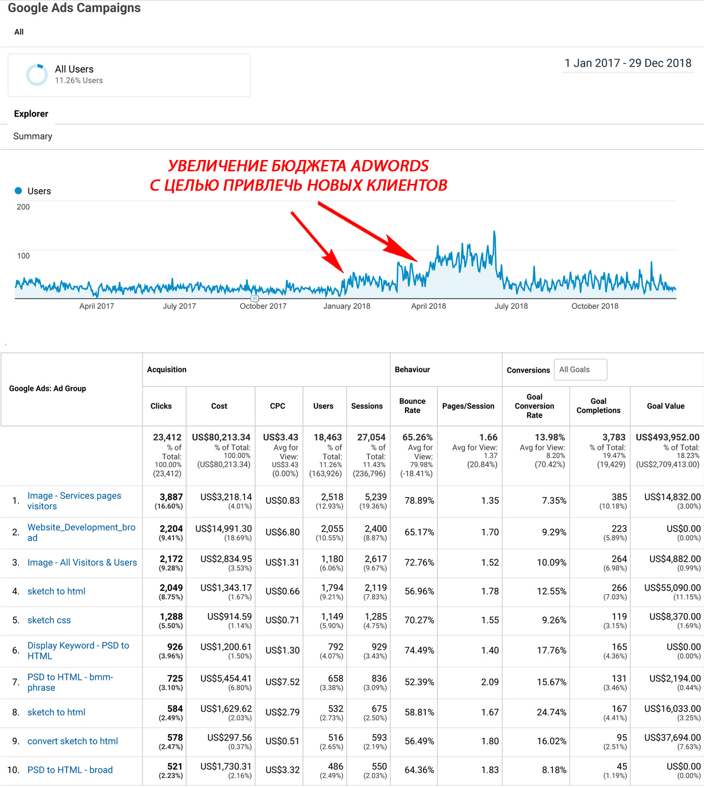

IT-компания растет, прибыль не особо. Что делать?

[analyst_vit](https://habr.com/users/analyst_vit/ "Автор публикации") сегодня в 01:23

**Начнем с фактов.** Компания занимается версткой проектов. PSD to HTML, PSD to Wordpress и т.д. Работает на рынке 8 лет. Два офиса. 40 человек в штате. Около 20 на outsource. Заказчики преимущественно из США. Верстальщики, программисты, QA, менеджеры проектов из Украины\\Белоруссии.

**В чем состоит задача**: владелец показывает расчеты. Видно что компания растет. Растет количество клиентов, растет количество заказов. Но вместе с этим растут расходы, и чистая прибыль увеличивается не значительно.  
  
**Как все работает?** За 8 лет работы сформировался костяк из постоянных клиентов. Они приносят около 70% прибыли. Остальные 30% приходится на новых клиентов. Новых клиентов приводит реклама (преимущественно Google Adwords, периодически гостевые посты на тематических площадках).

**Что происходит при попытке заработать больше?** Компания увеличивает рекламный бюджет. На графике видно что в Январе 2018 и Марте 2018 года были попытки вдвое- и втрое- увеличить рекламный бюджет AdWords.

"

**Что получается в итоге на примере Января 2018.**

*   Расходы на рекламу +117%
*   Входящих заявок на верстку проектов +63%
*   Нецелевых заявок\* \+ 77%
*   Целевых заявок \+ 23%
*   Нагрузка на менеджера проектов примерно \+ 35% (затраты рабочего времени на переписку, оценку стоимости, согласования).

\* нецелевые заявки — это небольшие проекты, часто одноразовые заказы на верстку 3-5 страниц.

**Почему так плохо: вдвое больший рекламный бюджет и всего +23% выхлоп?** Компания восьмой год на рынке. Знает своего клиента. Есть специальный человек который оптимизирует ключевые слова, ставки, смотрит на статистику аукционов…

Если коротко, цифры отражают аудиторию рекламного канала.

Из 100% интересующихся версткой пользователей Google в данном случае 77% это

*   небольшие частные компании
*   индивидуальные предприниматели
*   конкуренты, просто любопытные пользователи
*   боты, скликивание, клик-фрод и т.д.

Если кто-то из этой аудитории и готов разместить заказ, для них оплата услуг целой студии будет слишком дорогая. На практике переговоры с ними заканчиваются ничем. Такие уходят и заказывают верстку у фрилансеров.

23% является представителями целевой аудитории: крупные корпоративные компании, дизайнерские агентства\ студии. За надежность, репутацию, сдачу проектов в срок, опыт эти компании готовы переплачивать.

От месяца к месяцу цифры немного меняются, но пропорции в целом остаются.

**Получается для того чтобы через Google увеличить количество заказчиков на 23% нужно раздуть рекламный бюджет на 117%**. Более того. Из этих 23% заказ разместят не все. Примерно половину не устроит условия работы, цена, сроки и т.д. Реально компания увеличит количество заказов на 12%.

Далее вопрос. Кто будет обслуживать новые 12% заказов?

*   менеджер проектов загружен работой с существующими клиентами. Приходится брать дополнительного менеджера, который будет работать на неполный рабочий день либо кто-то из сотрудников частично возьмет на себя функции проджект-менеджера.

  

*   кто будет верстать\\тестировать новые проекты? Брать дополнительных людей в штат на зарплату владелец не хочет. Говорит месяц на месяц не приходится. В хороший месяц заработаем, в плохой они проедят то что было заработано в хороший.

Приходится частично привлекать фрилансеров со стороны чтобы успевать закрывать проекты в срок. Частично перегружать штатных работников новыми проектами, что угрожает сдвинуть сроки сдачи проектов как существующим клиентам, так и новым.

Получается компания вроде-бы развивается. Количество заказов растет. Но если посмотреть ситуацию в целом за год, выросли расходы на рекламу, на сотрудников и чистая прибыль в конечном итоге выросла не значительно (коммерческие показатели владелец просил не раскрывать).

Получается компания стратегия развития компании выглядит так:

Тенденция идет к тому, что американский рынок насыщается. Компаний, которые хотят на нем зарабатывать становится все больше. Растет конкуренция. Дорожает клик. Дорожает стоимость привлечения клиента. Стоимость реально полученного заказа от целевой компании и т.д.

Разбираем заказы. Они разные. Одна компания заказывает крупный проект за 5000, другой нужны мелкие доработки за 300 долл.

**Можем отказаться от мелких доработок?** Работать только с крупными заказами, а мелкие отдавать на outsource. Так не получится. Всем крупным проектам периодически нужны апдейты, правки, обновления. За клиентом закреплен менеджер проектов, стараемся выстроить отношения. Взять с клиента 5000, а потом послать его к фрилансерам когда он хочет что-то немного поменять бесперспективно. Так бизнес не построишь.

**Можем отказаться от мелких клиентов?** От тех кто заказывает малые объемы. Можем. Но как понять кто крупный, а кто мелкий? Google объявления показывает по запросу. А там кто кликнет, тот кликнет. Мы бы рады давать только крупным. Но Google обслуживает всех.

Решение напрашивается само собой: сузить аудиторию, сосредоточиться только на целевом сегменте. Т.е. сделать так:

Или вот так:

**Почему прорабатываем несколько вариантов?** Потому что заранее не известно что сработает, а что нет. Стараемся смоделировать процессы, прописать действия все как можно тщательнее. А далее практика покажет что сработает, что нужно корректировать.

_Например вариант 1\. Личная встреча. Как и кем представиться. Что говорить. Какой должен быть результат. Как поступить в той или иной ситуации._

Стратегия: последовательно прорабатывать компании одну за другой. Штат сотрудников прогнозируемо расширять по мере заключения контрактов с новыми дизайн-студиями. Под конкретную компанию нанимаются конкретные сотрудники.

Первые результаты уже есть. Пройдет еще немного времени мы все систематизируем, переведем в цифры. Если тема интересная, дайте знать напишу продолжение.

**В общем если вы столкнулись похожей ситуацией: развитие вроде идет, а прибыль не очень — разберите работу компании на отдельные бизнес-процессы.** Где-то обязательно увидите узкое горлышко. У кого-то это поиск клиентов, эффективность сотрудников, продажи. Пробуйте анализировать, дойти до сути проблемы. Если что-то не понятно, старайтесь переводить все в цифры. Подвергайте сомнениям даже то, что работало годами. В данном случае компания проработала 8 лет привлекая клиентов через Google. Но пришло время адаптироваться.

Всем успехов в 2019 году!

Теги:

*   [бизнес-аналитика](https://habr.com/search/?q=%5B%D0%B1%D0%B8%D0%B7%D0%BD%D0%B5%D1%81-%D0%B0%D0%BD%D0%B0%D0%BB%D0%B8%D1%82%D0%B8%D0%BA%D0%B0%5D&target_type=posts)
*   [бизнес-анализ](https://habr.com/search/?q=%5B%D0%B1%D0%B8%D0%B7%D0%BD%D0%B5%D1%81-%D0%B0%D0%BD%D0%B0%D0%BB%D0%B8%D0%B7%5D&target_type=posts)
*   [it-аналитика](https://habr.com/search/?q=%5Bit-%D0%B0%D0%BD%D0%B0%D0%BB%D0%B8%D1%82%D0%B8%D0%BA%D0%B0%5D&target_type=posts)