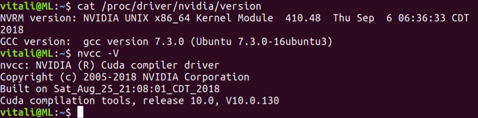
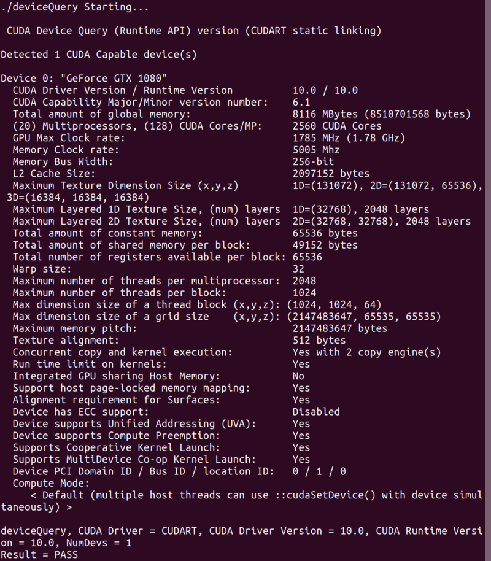
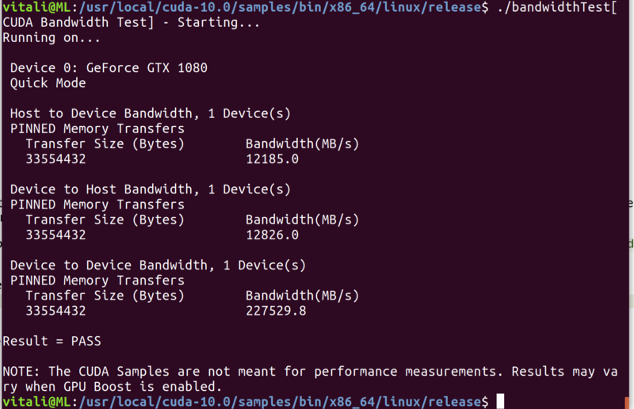
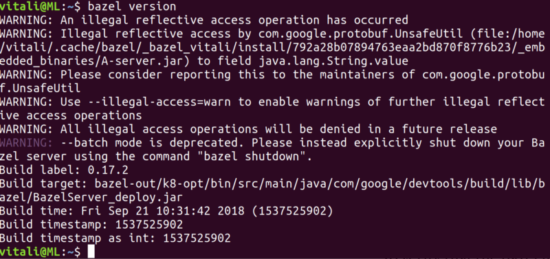

Install CUDA 10.0, cuDNN 7.3 and build TensorFlow (GPU) from source on Ubuntu 18.04

# Install CUDA 10.0, cuDNN 7.3 and build TensorFlow (GPU) from source on Ubuntu 18.04

After CUDA 10.0 and cuDNN 7.3 release I was really eager to try it on my newly built machine. The problem was that pip package TensorFlow 1.11rc didn’t support latest CUDA version and I needed to build it from source. The whole process was rather painful for me and after finally I got it done I decided to go through all steps again and setup it from scratch on empty Ubuntu machine.

My starting point is a machine with i5–8600 CPU 3.10GHz, 16GB DDR4, GTX 1080 with just installed Ubutnu 18.04 LTS and we are going to:   
1\. Install CUDA 10 + cuDNN 7.3 + NCCL 2.3.5  
2\. Install Bazel 0.17.2  
3\. Build and install TensorFlow 1.11rc   
Package versions might be newer in you case but assume that overall steps will remain the same.

### 1\. Install CUDA 10.0 + cuDNN 7.3 + NCCL 2.3.5

#### **1.1 Install CUDA 10.0**

Great installation guide can be found on [NVIDIA site](https://docs.nvidia.com/cuda/cuda-installation-guide-linux/index.html). However below are the steps that were required in my case for empty machine

1.1.1 Install gcc: sudo apt-get install gcc  
1.1.2 [Download package](https://developer.nvidia.com/cuda-downloads). For me it was _Linux / x86_64 / Ubuntu / 18.04 /deb (local)_  
1.1.3 Install CUDA by running following commands  
`sudo dpkg -i cuda-repo-ubuntu1804–10–0-local-10.0.130–410.48_1.0–1_amd64.deb  
sudo apt-key add /var/cuda-repo-10–0-local-10.0.130–410.48/7fa2af80.pub  
sudo apt-get update  
sudo apt-get install cuda`

1.1.4 After installation is complete, add PATH variable by adding following line to the bashrc by running  
`nano ~/.bashrc`  
adding   
`export PATH=/usr/local/cuda-10.0/bin${PATH:+:${PATH}}`   
at the end of file. Save and exit.

1.1.5 Check driver version and CUDA toolkit to ensure that everything went well  
`cat /proc/driver/nvidia/version  
nvcc -V`

1.1.6 You might also want to build CUDA samples and run it. It will take a while. For that you need to jump to CUDA sample directory. For me it is _/usr/local/cuda-10.0/samples_ and run   
`sudo make`.   
After that go to built sources   
_/usr/local/cuda-10.0/samples/bin/x86_64/linux/release  
_and execute `./deviceQuery` and `./bandwidthTest`. My results are following:

`./deviceQuery results`

`./bandwidthTest results`

After test feel free to remove built samples.

#### **1.2 Install cuDNN 7.3**

In order to download cuDNN, login/register on [developer.NVIDIA.com](https://developer.nvidia.com/). [Download](https://developer.nvidia.com/cudnn) Release, Dev versions and samples if needed.  
Run following commands in he folders with deb files:  
`sudo dpkg -i libcudnn7_7.3.0.29–1+cuda10.0_amd64.deb  
sudo dpkg -i libcudnn7-dev_7.3.0.29–1+cuda10.0_amd64.deb  
sudo dpkg -i libcudnn7-doc_7.3.0.29–1+cuda10.0_amd64.deb`

The installation is completed. Let’s verify it by following [instructions](https://docs.nvidia.com/deeplearning/sdk/cudnn-install/index.html#verify) or run:  
`cp -r /usr/src/cudnn_samples_v7/ $HOME  
cd $HOME/cudnn_samples_v7/mnistCUDNN  
make clean && make  
./mnistCUDNN`

If cuDNN was installed properly you will see a message: _Test passed  
_Feel free to remove copied files from _HOME/cudnn\_samples\_v7_

#### **1.3 Install NCCL 2.3.5**

NCCL is used to handle calculations on multiple GPU simultaneously. If you will use a single GPU, you can skip this step. Otherwise [download](https://developer.nvidia.com/nccl) Network Installer and run  
`sudo dpkg -i nccl-repo-<version>.deb  
sudo apt install libnccl2 libnccl-dev`  
That is it. Let’s move to Bazel installation.

### 2 Install Bazel 0.17.2

Bazel is a tool that will be used for TensorFlow building. Its [homepage](https://docs.bazel.build/versions/master/install-ubuntu.html) contains multiple ways of installation. For me a preferred one is using ATL repository. First please ensure you have curl  
`sudo apt install curl  
`and install Bazel using  
`sudo apt-get install openjdk-8-jdk  
echo “deb [arch=amd64] [http://storage.googleapis.com/bazel-apt](http://storage.googleapis.com/bazel-apt) stable jdk1.8” | sudo tee /etc/apt/sources.list.d/bazel.list  
curl [https://bazel.build/bazel-release.pub.gpg](https://bazel.build/bazel-release.pub.gpg) | sudo apt-key add -  
sudo apt-get update  
sudo apt-get install bazel`

To verify that the bazel installation is completed, bazel version. You might also see few warnings. That is OK.

bazel version result

### 3\. Build TensorFlow

Great step-by-step guide is placed on [TensorFlow page](https://www.tensorflow.org/install/source). The recap of it is below:

#### 3.1 Preparation.

3.1.1 Install python3-distutils `sudo apt-get install python3-distutils  
`pip `sudo apt install python-dev python-pip` # or `python3-dev python3-pip`  
I suggest to build TensorFlow using virtual environment. There are multiple ways to do it. My preferred is to use PyCharm as venv manager

3.1.2 Activate virtual environment and run following commands:  
`pip install -U pip six numpy wheel mock  
``pip install -U keras_applications==1.0.5 — no-deps``  
pip install -U keras_preprocessing==1.0.3 — no-deps`

#### 3.2 Download and build.

3.2.1 Download source codes. I cloned git repository. If you haven’t git installed, run `sudo apt install git`  
After that clone repository   
`git clone [https://github.com/tensorflow/tensorflow.git](https://github.com/tensorflow/tensorflow.git)  
cd tensorflow`

3.2.2 Test it with bazel.  
`bazel test -c opt — //tensorflow/… -//tensorflow/compiler/… -//tensorflow/contrib/lite/…`  
Well, it was processing about an hour on my machine. As a result I have about 60 failed test results but it doesn’t impact build process.

3.2.3 Configure TensorFlow build by running ./configure.   
In my case I’ve used default values except questions regarding:  
Hadoop File System support — NO  
Apache Kafka Platform support — NO  
CUDA support — YES  
CUDA version — 10.0  
cuDNN version — 7.3  
NCCL — 1.3  
You might wondering why NCCL version is not 2.3. Well, I’ve tried but NCCL version default path are different from those that are expected during building. It requires to manually copy nccl.h and libnccl.so.2 to required path. As I’m not using multiple GPU, I left 1.3 version which install automatically into expected directories.

3.2.4 Build and install TensorFlow. Run   
`./bazel-bin/tensorflow/tools/pip_package/build_pip_package /tmp/tensorflow_pkg`  
Be ready to entertain yourself for an hour while building process is in progress. As a result pip package will be placed at _/tmp/tensorflow_pkg_.   
We are almost done — run from your venv and enjoy  
`pip install /tmp/tensorflow_pkg/tensorflow-version-cp27-cp27mu-linux_x86_64.whl`

That is it. TensorFlow with GPU support is up and running!

*   [Cuda](https://medium.com/tag/cuda?source=post)
*   [TensorFlow](https://medium.com/tag/tensorflow?source=post)
*   [Ubuntu](https://medium.com/tag/ubuntu?source=post)