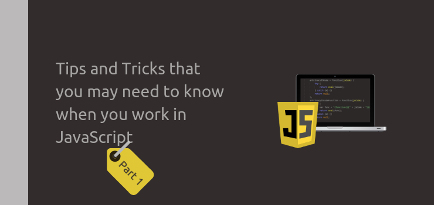

JavaScript: вопросы и ответы / Блог компании RUVDS.com

Недавно в компании [SmartSpate](https://www.smartspate.com/) решили собрать вопросы, касающиеся [JavaScript](https://www.javascript.com/), и на них ответить. В материале, перевод которого мы публикуем, приведены чуть больше двух десятков вопросов о JavaScript и ответов на них. Спектр затрагиваемых здесь тем достаточно широк. В частности — это особенности языка, проблемы, возникающие у программистов при написании JS-кода, работа в браузере и в среде Node.js.

  

## Вопрос №1\. Прототипное наследование

Я привык к «классическим» классам, но решил изучить JavaScript. У меня возникла проблема с пониманием прототипной модели. Если можно, объясните, в виде шаблонов, возможности по созданию «классов» в JavaScript, расскажите о закрытых и открытых методах и свойствах классов. Я понимаю, что об этом уже очень много всего написано, и то, что в JavaScript методы и свойства, объектов, по умолчанию, являются общедоступными, но мне хотелось бы всё это как следует понять. Как работает прототипное наследование в JavaScript?

### ▍Ответ

Классическое наследование очень напоминает то, как люди наследуют гены своих предков. У людей есть некие общие базовые возможности, вроде возможностей ходить и говорить. Кроме того, у каждого человека есть какие-то особенности. Люди не могут изменить то, что можно назвать их «классом», но собственные «свойства» они, в определённых пределах, менять могут. При этом бабушки, дедушки, мамы и папы не могут влиять на гены детей или внуков в процессе их жизни. Так всё устроено на Земле, но давайте представим себе другую планету, на которой механизмы наследования работают по-особому. Скажем, некие организмы, способные к мутациям, используют там механизмы «телепатического наследования». Это выражается в том, что они могут менять генетическую информацию собственных потомков в процессе их жизни.

Рассмотрим пример наследования на этой странной планете. Объект «Отец» (Father) наследует гены от объекта «Дедушка» (Grandfather), а объект «Сын» (Son) наследует генетическую информацию от «Отца». Каждый житель этой планеты может свободно мутировать и менять при этом гены потомков. Например, у «Дедушки» кожа имеет зелёный цвет. Этот признак наследуют «Отец» и «Сын». Вдруг «Дедушка» решает, что зелёным ему быть надоело. Теперь он хочет быть синим и меняет цвет кожи (в терминах JS — меняет прототип своего класса), «телепатически» передавая эту мутацию «Отцу» и «Сыну». После этого «Отец», полагая, что «Дед» выжил из ума, решает поменять свои гены так, чтобы снова стать зелёным (то есть — меняет собственный прототип). Эти изменения «телепатически» передаются и «Сыну». В результате и у «Отца» и у «Сына» кожа снова зелёного цвета. При этом «Дед» по-прежнему остаётся синим. Теперь, что бы он ни делал со своим цветом, это никого больше не затронет. А всё это из-за того, что «Отец» явным образом задал цвет своей кожи в своём «прототипе», а «Сын» этот цвет наследует. Потом «Сын» думает так: «Стану-ка я чёрным. А мои потомки пусть наследуют цвет от моего отца». Для этого он меняет собственное свойство (а не свойство своего прототипа) таким образом, чтобы это его свойство влияло бы на его цвет, но не затрагивало бы его потомков. Выразим всё это в виде кода:

    var Grandfather = function () {}; 
    Grandfather.prototype.color = 'green';
    var Father = function () {}; 
    Father.prototype = new Grandfather (); 
    var Son = function () {}; 
    Son.prototype = new Father (); 
    var u = new Grandfather (); 
    var f = new Father (); 
    var s = new Son (); 
    
    console.log ([u.color, f.color, s.color]); 
    
    Grandfather.prototype.color = 'blue';
    console.log ([u.color, f.color, s.color]); 
    
    Father.prototype.color = 'green';
    
    
    console.log ([u.color, f.color, s.color]); 
    
    Grandfather.prototype.color = 'blue';
    console.log ([u.color, f.color, s.color]); 
    
    s.color = 'black'; 
    console.log ([u.color, f.color, s.color]); 
    var SonsSon = function () {}; 
    SonsSon.prototype = new Son (); 
    var ss = new SonsSon (); 
    
    console.log ([u.color, f.color, s.color, ss.color]); 

  

## Вопрос №2\. Создание объектов

Если создавать новые экземпляры объектов с использованием ключевого слова `new`, то как можно защититься от ошибок? Вот как я обычно работаю:

1.  Имена функций-конструктор я всегда составляю так, чтобы они начинались с большой буквы.
2.  Проверяю правильность выполняемой операции с помощью конструкции `this instanceof Function_Name` (я стараюсь не использовать конструкцию вида `this instanceof arguments.callee` из соображений производительности).
3.  Этот подход похож на предыдущий, но сравнение производится с `window`, так как мне не нравится жестко задавать в коде имена сущностей и не нужно писать код для сред, отличающихся от браузера.

Какова самая удобная модель создания объектов?

### ▍Ответ

Лучше всего, и идеологически, и исходя из привычности этого метода, создавать объекты с использованием ключевого слова `new`. При этом функциям-конструкторам надо давать имена, начинающиеся с большой буквы.

Я предпочитаю придерживаться правил и не выполнять дополнительных проверок `this` в конструкторах. Если конструктор вызывается без `new` и начинается работа в глобальной области видимости, это можно сравнить с «самообманом». При этом я ни в коем случае не рекомендую обрабатывать в конструкторах ситуации, в которых они вызываются без ключевого слова `new`. Например, это может выглядеть так: если конструктор вызван без `new`, то, всё равно, создаётся и возвращается новый объект. Этот подход идеологически неверен и ведёт к возникновению ошибок.  
Вот пример работы с конструктором.

    var Obj = function () {
        "use strict";
        this.pew = 100;
    };
    
    
    let o = new Obj();
    o.pew++;
    console.log(o.pew); 
    
    
    Obj (); 

Ключевое слово `new` лучше не использовать для фабричных методов и для случаев, когда в конструкторе нет необходимости, тогда, когда объект удобнее будет создать с помощью объектного литерала. Скажем, код конструктора, показанный в следующем примере, явно избыточен:

    
    var Obj = function () {
         if (! (this instanceof Obj)) {
             return new Obj ();
         }
         this.pew = 100;
    };

Если, даже для создания небольшого объекта, конструктор всё же нужен, лучше поступить так:

    var Obj = function () {
         "use strict";
         this.pew = 100;
    };

Здесь, как было показано выше, за счёт того, что конструктор работает в строгом режиме, при вызове его без `new` произойдёт ошибка.

## Вопрос №3\. Перехват нажатий на кнопки мыши

Как, средствами JavaScript, узнать о том, какая кнопка мыши нажата?

### ▍Ответ

При нажатии на кнопки мыши генерируются события `mousedown` и `mouseup`. При этом событие `click` генерирует только левая кнопка мыши. В обработчике события нужно проверить код, находящийся в свойстве `event.button` для того чтобы выяснить то, какая именно кнопка нажата (0 — левая, 1 — средняя, 2 — правая). Однако в IE всё выглядит несколько иначе. Рассмотрим пример:

    var button = document.getElementById ('button'),
                   
         buttonMap = ['Left', 'Middle', 'Right'],
         handler = function (event) {
             event = event || window.event;
             alert (buttonMap [event.button] + 'id:' + event.button);
         };
    if (button.addEventListener) {
          button.addEventListener ('mousedown', handler, false);
    } else {
          
          buttonMap = ['???', 'Left', 'Right', '???', 'Middle'];
          button.attachEvent ('onmousedown', handler);
    }

Библиотека jQuery эту особенность IE учитывает, поэтому при её использовании в любом браузере достаточно проверить значение свойства `event.which` вместо того, чтобы возиться с `event.button`:

    $('button').mousedown(function (event) {
        alert(['Left', 'Middle', 'Right'][event.which]);
    });

  

## Вопрос №4\. Перехват нажатий на клавиши клавиатуры

Можно ли перехватывать, средствами JavaScript, нажатия на клавиши-стрелки (в частности, нажатия на клавиши «Вниз» и «Вверх), делая так, чтобы, после нажатия на них браузер не прокручивал бы страницу? Если это возможно — то каковы особенности реализации подобного в разных браузерах? Предположим, на страницу выводится некая таблица, которая целиком на экране не помещается. Перемещение по ячейкам этой таблицы нужно организовать с помощью клавиш-стрелок, при этом требуется, чтобы браузер не прокручивал бы страницу при нажатии на такие клавиши.

### ▍Ответ

Для того чтобы реализовать нечто подобное, в первую очередь нужно отключить стандартную реакцию системы на управляющие воздействия. Например, клавиши-стрелки и колесо мыши прокручивают страницу, щелчок по странице правой кнопкой мыши вызывает контекстное меню, при щелчке по кнопке `submit` вызывается функция `form.submit()`, при щелчке по полю ввода оно получает фокус ввода, при щелчке по ссылке браузер загружает страницу, на которую она ведёт.

Сделать это можно [по-разному](https://stackoverflow.com/questions/8916620/disable-arrow-key-scrolling-in-users-browser). Например — так:

    window.addEventListener("keydown", function(e) {
        
        if([37, 38, 39, 40].indexOf(e.keyCode) > -1) {
            e.preventDefault();
        }
    }, false);

Страница после этого не будет обычным образом реагировать на нажатия клавиш-стрелок.  
Тут нужно отметить одну важную вещь. Вызвать метод `preventDefault()` нужно до того, как будет выполнено действие, выполняемое по умолчанию. Например, если при щелчке по полю требуется, чтобы оно не получало бы фокус ввода, нужно повесить соответствующий обработчик на событие, находящееся в цепочке событий до действия, выполняемого по умолчанию. В нашем случае это — событие `mousedown`:

    $('input').bind ('mousedown', function (event) {
        event.preventDefault();
        
        return false;
    });

При щелчке мышью по полю ввода возникают следующие события — в той последовательности, в которой они здесь показаны:

1.  `mousedown`
2.  `focus` (перед этим у другого объекта, теряющего фокус, сработает событие `blur`)
3.  `mouseup`
4.  `click`

Если попытаться предотвратить получение элементом фокуса ввода, то использование для этого обработчиков событий начиная с обработчика события `focus` нам в этом не поможет.

## Вопрос №5\. Остановка GIF-анимации и клавиша ESC

Как бороться с проблемой остановки GIF-анимации при нажатии клавиши ESC?

### ▍Ответ

Тут можно воспользоваться тем же подходом, который мы рассматривали выше. В некоторых браузерах при нажатии на клавишу ESC останавливается GIF-анимация и загрузка страницы. Это — их стандартное поведение, а для того, чтобы они себя так не вели, нам, как и ранее, пригодится метод события `preventDefault()`. Код клавиши ESC — 27.

## Вопрос №6\. Круглые скобки в IIFE

Как работает конструкция в виде двух круглых скобок, используемая при объявлении немедленно вызываемого функционального выражения (IIFE, Immediately Invoked Function Expression)?

### ▍Ответ

Скобки в данной ситуации позволяют парсеру понять, что перед ними находится функция, которую надо выполнить. Но ему ещё нужно понять и то, чем являются эти скобки — оператором группировки, или конструкцией, указывающей на необходимость вызова функции. Например, если воспользоваться двумя скобками так, как показано ниже, мы столкнёмся с ошибкой `SyntaxError`:

    function () {
      
    }()

Происходит это из-за того, что у функции нет имени (в объявлениях функций нужно указывать их имена).

Попробуем переписать этот код, дав функции имя:

    function foo() {
      
    }()

Теперь, когда у функции есть имя, эта конструкция, теоретически, должна выглядеть с точки зрения системы вполне нормально. Но ошибка не исчезает, правда теперь она имеет отношение к оператору группировки, внутри которого нет никакого выражения. Обратите внимание на то, что в этом случае за объявлением функции идёт оператор группировки, а не последовательность скобок, указывающая системе на то, что предваряющую его функцию надо вызвать.

Часто IIFE оформляют так:

    (function () {
        
      })()

Но есть и другие способы, суть которых заключается в том, чтобы как-то указать парсеру на то, что перед ним — именно функциональное выражение, которое надо выполнить:

    !function () {
      
    }();
    +function () {
      
    }();
    [function() {
      
    }()];
    var a = function () {
      
    }();

IIFE нашли широкое применение в программировании на JavaScript. Например, эта конструкция используется в jQuery. С её помощью можно создавать замыкания. Фактически, речь идёт о том, что, пользуясь IIFE, программист может выполнять некий код в локальной области видимости. Это помогает защитить от загрязнения глобальную область видимости, позволяет оптимизировать доступ к глобальным переменным. Такие конструкции хорошо минифицируются.

## Вопрос №7\. Передача кода в ответах на запросы

Сервер, в процессе AJAX-взаимодействия с клиентом, в теле ответа, отправляет клиенту строку `alert (‘Boom !!!’);`. Клиент принимает ответ и выполняет этот код с помощью функции `eval()`. Как это называется? Ведь то, что содержится в ответе сервера, это не JSON, не XML и не HTML. Что вы можете сказать о выполнении на клиенте кода, который приходит с сервера в виде тела ответа на некий запрос?

### ▍Ответ

На самом деле, для подобной схемы взаимодействия клиента и сервера особого названия нет. И это — схема взаимодействия систем, которой пользоваться настоятельно не рекомендуется. Это так же плохо, как хранение PHP-кода в базе данных и последующее его выполнение с помощью соответствующих методов языка. Даже если не принимать во внимание идеологические соображения, можно сказать, что подобная архитектура оказывается крайне негибкой, поэтому, если проекте, где она используется, нужно будет, по мере его развития, что-то менять, сделать это будет непросто. Тут мы видим пример плохой архитектуры системы, когда данные смешаны с кодом и с элементами интерфейса. Для того чтобы что-то поменять в такой системе, сначала надо разобраться в хитросплетениях её запутанной архитектуры, а потом, выполнив изменения, снова всё «запутать». Я уже не говорю о повторном использовании кода.

Для упрощения поддержки кода нужно стремиться к как можно более сильному разделению частей системы и к уменьшению числа взаимозависимостей этих частей. Для того чтобы обеспечить слабую связность частей системы, то есть, сделать так, чтобы фрагмент приложения мог бы быть извлечён из него, или, с наименьшими сложностями, заменён на другой, можно применять механизмы событий или особые архитектурные решения, такие как MVC.

## Вопрос №8\. Выполнение тяжёлых операций в главном потоке

Как в JavaScript организовать выполнение неких ресурсоёмких команд и при этом не «подвесить» весь скрипт?

### ▍Ответ

JavaScript — однопоточный язык. В одном и том же потоке выполняется код веб-страниц и производятся преобразования дерева DOM. Там же работают таймеры. Каждый раз, когда вы выполняете некие ресурсозатратные операции (циклы, вызовы «тяжёлых» функций), это приводит к замедлению работы пользовательского интерфейса или даже к его полной блокировке. Если выполняемые операции не оказывают особенно большой нагрузки на систему, то их воздействие на интерфейс будет настолько незначительным, что пользователи этого просто не заметят. Для того чтобы вынести тяжёлые вычисления за пределы главного потока в JavaScript была представлена концепция веб-воркеров.

Если использование воркеров не представляется возможным, тогда нужно оптимизировать циклы и «тяжёлые» функции. В книге «JavaScript. Оптимизация производительности» Николас Закас говорит о том, что пользователь ничего не заметит в том случае, если поток пользовательского интерфейса будет заблокирован на 100 мс или на меньшее время.

Из этой идеи можно сделать вывод о том, что ресурсоёмкие вычисления можно разбивать на фрагменты, выполнение которых занимает максимум 100 мс, после чего главный поток нужно освобождать.

Вот пример кода из вышеупомянутой книги:

    function timedProcessArray(items, process, callback) {
        var todo = items.concat();   
        setTimeout(function () {
            var start = +new Date();
            do {
                process(todo.shift());
            } while (todo.length > 0 && (+new Date() - start < 50));
            if (todo.length > 0){
                setTimeout(arguments.callee, 25);
            } else {
                callback(items);
            }
        }, 25);
    }
    function saveDocument(id) {
        var tasks = [openDocument, writeText, closeDocument, updateUI];
        timedProcessArray(tasks, [id], function(){
            alert("Save completed!");
        });
    }

Функция `timedProcessArray()` блокирует главный поток на 25 мс, выполняет последовательность действий, потом освобождает его на 25 мс, после чего этот процесс повторяется.

## Вопрос №9\. Сведения об изменении размеров окна браузера

Можно ли как-то узнать о том, что пользователь завершил изменение размеров окна браузера?

### ▍Ответ

Не существует особого события, которое позволяет об этом узнать. Но можно выяснить, выполняет ли пользователь изменение размеров окна, используя событие `onresize`. Этот метод, правда, не отличается особой точностью.

Вот набросок кода, направленного на решение этой задачи.

    var time = 0,
        timerId,
        TIME_ADMISSION = 100; 
    function onresizeend () {
        console.log('onresizeend');
    };
    function resizeWatcher () {
        if (+new Date - time >= TIME_ADMISSION) {
            onresizeend();
            if (timerId) {
                window.clearInterval(timerId);
                timerId = null;
            }
        }
    };
    $(window).resize(function () {
        if (!timerId) {
            timerId = window.setInterval(resizeWatcher, 25);
        }
        time = +new Date;
    });

  

## Вопрос №10\. Открытие новых окон и вкладок браузера

Как, используя метод `window.open()`, открыть новое окно браузера, а не новую вкладку?

### ▍Ответ

То, как именно ведёт себя метод `window.open()`, зависит от браузера. Opera всегда открывает новые вкладки (хотя выглядят они как окна), Safari всегда открывает окна (хотя это поведение можно изменить). Поведением Chrome, Firefox и Internet Explorer можно управлять.

Так, если методу `window.open()` передают дополнительный параметр (позицию окна), будет открыто новое окно:

    window.open('http://www.google.com', '_blank', 'toolbar=0,location=0,menubar=0');

Если этому методу передаётся лишь ссылка — тогда будет открыта новая вкладка браузера:

    window.open('http://www.google.com');

Часто нужно открыть именно новую вкладку браузера. С этим в браузере Safari могут возникнуть проблемы. По умолчанию (это зависит от настроек) браузер, при вызове `window.open()`, открывает новое окно. Но если щёлкнуть по ссылке, нажав при этом клавиши `Ctrl + Shift/Meta + Shift`, открываться будет новая вкладка (независимо от настроек). В следующем примере мы будем имитировать событие `click`, вызываемое при нажатых клавишах `Ctrl + Shift/Meta + Shift`:

    function safariOpenWindowInNewTab (href) {
         var event = document.createEvent ('MouseEvents'),
             mac = (navigator.userAgent.indexOf ('Macintosh')> = 0);
    
         
         event.initMouseEvent (
             / * type * / "click",
             / * canBubble * / true
             / * cancelable * / true,
             / * view * / window,
             / * detail * / 0,
             / * screenX, screenY, clientX, clientY * / 0, 0, 0, 0,
             / * ctrlKey * /! mac,
             / * altKey * / false,
             / * shiftKey * / true
             / * metaKey * / mac,
             / * button * / 0,
             / * relatedTarget * / null
         );
    // создаём ссылку в памяти и, используя наше событие, открываем её в новой вкладке
         $ ('<a/>', {'href': href, 'target': '_blank'}) [0] .dispatchEvent (event);
    }

  

## Вопрос №11\. Глубокое копирование объектов

Как эффективно организовать глубокое копирование объектов?

### ▍Ответ

Если объект, копию которого нужно создать (назовём его `oldObject`), не меняется, тогда эффективнее всего будет сделать это через его прототип (делается это очень быстро):

    function object(o) {
        function F() {}
        F.prototype = o;
        return new F();
    }
    var newObject = object(oldObject);

Если вам нужно по-настоящему выполнить операцию клонирования объекта, тогда быстрее всего будет рекурсивно, оптимизировав этот процесс, пройтись по его свойствам. Пожалуй, это самый быстрый алгоритм для создания глубоких копий объектов:

    var cloner = {
        _clone: function _clone(obj) {
            if (obj instanceof Array) {
                var out = [];
                for (var i = 0, len = obj.length; i < len; i++) {
                    var value = obj[i];
                    out[i] = (value !== null && typeof value === "object") ? _clone(value) : value;
                }
            } else {
                var out = {};
                for (var key in obj) {
                    if (obj.hasOwnProperty(key)) {
                        var value = obj[key];
                        out[key] = (value !== null && typeof value === "object") ? _clone(value) : value;
                    }
                }
            }
            return out;
        },
    clone: function(it) {
            return this._clone({
            it: it
            }).it;
        }
    };
    var newObject = cloner.clone(oldObject);

Если вы пользуетесь jQuery, тогда можете прибегнуть к следующим конструкциям:

    
    var newObject = jQuery.extend ({}, oldObject);
    
    var newObject = jQuery.extend (true, {}, oldObject);

  

## Вопрос №12\. Деструкторы в JavaScript

Как в JavaScript создать нечто подобное деструктору? Как управлять жизненным циклом объектов?

### ▍Ответ

В JavaScript объект будет удалён из памяти после того, как исчезнет последняя ссылка на него:

    var a = {z: 'z'};
    var b = a;
    var c = a;
    delete a.z;
    delete a; 
    console.log (b, c); 

Использование чего-то вроде «деструктора» в JavaScript приводит лишь к очистке содержимого объекта, но не к его удалению из памяти.

## Вопрос №13\. Обработка бинарных данных

Можно ли в JavaScript обрабатывать бинарные данные? И если да, то как?

### ▍Ответ

Если в JavaScript-приложении нужно работать с бинарными данными, можно попробовать воспользоваться библиотекой [Binary Parser](http://jsfromhell.com/classes/binary-parser). Но её код — это настоящий ад. В ES6+ есть предложение, касающееся типа `StructType` (это то же самое, что представлено в C++ композитным типом данным `struct`). Этот тип данных нужен для упрощения работы с бинарными данными. Работа с ним может выглядеть примерно так:

    const Point2D = new StructType({ x: uint32, y: uint32 });
    const Color = new StructType({ r: uint8, g: uint8, b: uint8 });
    const Pixel = new StructType({ point: Point2D, color: Color });
    const Triangle = new ArrayType(Pixel, 3);
    let t = new Triangle([{ point: { x:  0, y: 0 }, color: { r: 255, g: 255, b: 255 } },
                          { point: { x:  5, y: 5 }, color: { r: 128, g: 0,   b: 0   } },
                          { point: { x: 10, y: 0 }, color: { r: 0,   g: 0,   b: 128 } }]);

  

## Вопрос №14\. Изменение переменных, находящихся в одной функции, из другой функции

Как менять переменные, находящиеся в одной функции, из другой функции?

### ▍Ответ

Тут можно применить несколько подходов:

1.  Можно воспользоваться ссылкой на контекст интересующей нас функции (функции `primer()` в следующем примере) в функции `smth()`.  
    
2.  Можно передать функцию, созданную в контексте функции `primer()`, функции `smth()`.
    
        var primer = function () {
             var a, b, c, d, e = {};
        smth (function () {
                 a = 1;
                 b = 2;
                 c = 3;
                 d = 4;
             }, e);
        alert ([a, b, c, d, e.pewpew]);
        },
        smth = function (callback, e) {
             callback ();
             e.pewpew = "pewpew";
        };
        primer ();
    
3.  Ранее (до Firefox 3.6) добраться до контекста можно было с использованием свойства `__parent__`, но уже в Firefox 4 эту возможность убрали.

  

## Вопрос №15\. Работа с функциями

Расскажите о том, как в JavaScript можно вызывать функции.

### ▍Ответ

Полагаю, нет необходимости рассказывать о том, как вызывать функции, методы и конструкторы при обычной работе с ними. Поговорим о том, как пользоваться методами `call()` и `apply()`.

#### Использование call() для настройки конструктора объекта

  

    
    function extend (newObj, oldObj) {
        function F () {}; 
        F.prototype = oldObj.prototype; 
        newObj.prototype = new F (); 
        return newObj
    };
    var Obj = function () {
        this.obj_var = 100;
    };
    Obj.prototype.obj_proto_var = 101;
    var NewObj = function () {
        Obj.call (this); 
        this.new_obj_var = 102;
    };
    extend (NewObj, Obj)
    NewObj.prototype.new_obj_proto_var = 103;
    new NewObj (); 

  

#### Преобразование массивоподобных объектов в массивы

Массивоподобные объекты похожи на JavaScript-массивы, но ими не являются. В частности, это выражается в том, что у таких объектов нет методов обычных массивов. Среди таких объектов можно отметить, например, объект `arguments` традиционных функций и результаты работы метода [getElementsByTagName()](https://developer.mozilla.org/ru/docs/Web/API/Element/getElementsByTagName).

    
    document.getElementsByTagName ("div"). forEach (function (elem) {
         
    }); 
    
    Array.prototype.slice.call(document.getElementsByTagName("div")).forEach (function (elem) {
        
    });
    
    console.log(Array.prototype.slice.call ('pewpew')) 
    

  

#### Создание объектов-обёрток

Эта методика применения `call()` и `apply()` позволяет создавать объекты-обёртки. Предположим, нам нужно создать функцию-обёртку `foo()`, которая вызывает функцию `bar()` в специфическом контексте с произвольным числом аргументов.

При использовании традиционного подхода это будет выглядеть так:

    function bar () {console.log(arguments)}
    
    function foo () {
         var context = arguments [0];
         var args = Array.prototype.slice.call (arguments, 1); 
         bar.apply (context, args);
    }

То же самое с применением конструкции `Function.call.apply()` можно переписать гораздо короче:

    function foo() { 
        Function.call.apply(bar, arguments);
    }

Здесь, благодаря использованию `Function.call.apply()`, аргументы, переданные `foo()`, передаются `bar`.

## Вопрос №16\. Передача контекста выполнения функции

Как передать контекст, в котором выполняется одна функция, другой функции?

### ▍Ответ

Это невозможно. Раньше, в версиях Firefox до 3.6, контекст можно было получить через свойство `__parent__`, но потом эту возможность убрали.

## Вопрос №17\. Работа с глобальным объектом

Расскажите о том, как работать с глобальным объектом в том случае, если он не передаётся напрямую, если не используется `eval()` и применяется строгий режим?

### ▍Ответ

Если соблюдены все три этих условия, то доступ к глобальному объекту получить нельзя. Если же от них отступить, то можно рассмотреть следующие варианты:

    
    (function () {
         "use strict";
         var globalObject = (0, eval) ("this"); 
         return globalObject;
    } ());
    
    (function (global) {
         
    } (window));
    
    (function () {
         return this;
    } ());
    
    
    "use strict";
    (function (global) {
         
    }) (this);

  

## Вопрос №18\. Перезапуск событий

Можно ли, средствами JavaScript, перезапустить событие после того, как оно было перехвачено?

### ▍Ответ

Объект события в JavaScript не несёт какой-либо «полезной нагрузки». Он лишь содержит дескриптор события. Но соответствующую ссылку на подобный объект можно передать обработчику события. Например, это может выглядеть так:

    $('#smth').click(function onSmthClick(event) {
        if (smth) {
            
            event.handlerFunction = onSmthClick;
            event.handlerContext = this;
            
            
            otherObjectSetSomeEvent(event);
        } else {
            
        }
    });

Но это — не самое удачное решение, так как код получается запутанным. Лучше переписать этот пример следующим образом, разделив обработчик на 2 части:

    $('#smth'). click (function handler1 (event) {
        if (smth) {
            
            leftObjectSetSomeEvent(event, function handler2 (e) {
                
            });
        } else {
            
        }
    });
    function leftObjectSetSomeEvent(event, callback) {
        callback (event);
        
    }

  

## Вопрос №19\. Универсальный обработчик событий мыши

Как в JavaScript перехватывать щелчки мышью по любым элементам страницы? Например — для того, чтобы написать универсальный обработчик событий.

### ▍Ответ

Нужно прикрепить обработчик события `click` к самому «нижнему» объекту в дереве DOM. В результате все подобные события достигнут этого объекта (правда, так будет только в том случае, если их никто не перехватит).

    // jQuery
    $(window).bind ('click', function (e) {
        console.log ('Clicked on', e.target);
    });
    // Можно ввести ограничения с использованием делегирования
    $('#pewpew').delegate ('*', 'click', function(e) {
        console.log('Clicked on', e.target);
    });
    // Можно ограничить целевые объекты
    $('#pewpew').delegate('.pewpew', 'click', function (e) {
        console.log ('Clicked on element with .pewpew class name');
    });

  

## Вопрос №20\. XHR-запросы

Как выполнять XHR-запросы без использования jQuery?

### ▍Ответ

Вот решение, которое не отличается кросс-браузерными возможностями:

    function xhr(m, u, c, x) {
      with(new XMLHttpRequest) onreadystatechange = function (x) {
        readyState ^ 4 || c(x.target)
      }, open(m, u), send(с)
    }

Вот кросс-браузерный вариант:

    function xhr(m, u, c, x) {
      with(new(this.XMLHttpRequest || ActiveXObject)("Microsoft.XMLHTTP")) onreadystatechange = function (x) {
        readyState ^ 4 || c(x)
      }, open(m, u), send(с)
    }

Вот как этим пользоваться:

    xhr('get', '//google.com/favicon.ico', function (xhr) {
      console.dir(xhr)
    });

  

## Вопрос №21\. Оптимизация вывода веб-страниц

Как минимизировать число операций пересчёта геометрии элементов (reflow) и перерисовки (repaint) при работе с веб-страницами?

### ▍Ответ

  

1.  Если браузер поддерживает функцию `requestAnimationFrame()`, то следует использовать именно её, а не `setInterval()` или `setTimeout()`. Браузеры могут оптимизировать анимации, происходящие одновременно, уменьшая число операций пересчёта геометрии и перерисовки до одной, что, в свою очередь, ведёт к повышению точности анимации. Например, на некоей странице JavaScript-анимации могут быть синхронизированы с CSS-переходами или с SVG-анимациями. Кроме того, если анимация выполняется на странице, которая открыта в невидимой вкладке браузера, браузер не будет её перерисовывать, что приведёт к снижению нагрузки на процессор, видеокарту, память. На мобильных устройствах это, кроме того, означает экономию заряда аккумулятора.
2.  Избегайте использования на страницах большого количества float-элементов (для уменьшения операций по пересчёту геометрии элементов).
3.  Как можно реже модифицируйте дерево DOM. Формируйте то, что вам нужно, в памяти, после чего обновляйте DOM лишь один раз (это тоже приведёт к снижению числа операций по пересчёту геометрии).
4.  Если нужно изменить несколько свойств объектов — меняйте их все за один раз. Это минимизирует число операций пересчёта геометрии объектов и число операций перерисовки (для современных браузеров, правда, это неактуально). Вот пример:
    
        // Не меняйте свойства по одному
        element.style.left = "150px;";
        // ...
        element.style.color = "green";
        // Меняйте свойства, которые надо модифицировать, за один раз
        element.setAttribute ('style', 'color: green; left: 150px');
    
5.  Выполняйте анимацию перетаскивания объектов только для элементов с абсолютным позиционированием (это ведёт к снижению числа операций по пересчёту геометрии).  
    
6.  Прежде чем изменить группу элементов — скройте их (`style.display = "none"`). Это уменьшает число операций по пересчёту геометрии элементов, но неактуально для современных браузеров.  
    

Вот ещё несколько рекомендаций, касающихся оптимизации веб-страниц, которые не относятся к пересчёту геометрии элементов и к перерисовке. Надо отметить, что они, в современных браузерах, могут и не дать особенно заметного эффекта, так как эти браузеры хорошо оптимизированы.

1.  Используйте делегирование событий.
2.  Кэшируйте ссылки на DOM-элементы (выбор элемента — наиболее ресурсозатратная операция).
3.  Используйте для быстрого поиска элементов функцию `Document.querySelectorAll()` и свойство `firstElementChild`.
4.  Помните о том, что функция `document.getElementsByTagName()` возвращает живую коллекцию элементов (такая коллекция, при добавлении нового элемента в дерево DOM, обновляется автоматически).

  

## Вопрос №22\. Работа с процессами в Node.js

Следует ли в среде Node.js, в высоконагруженных проектах, создавать новые процессы для обработки каждого нового запроса?

### ▍Ответ

Поступать так категорически не рекомендуется, так как при таком подходе мы создадим слишком большую дополнительную нагрузку на систему (это будет похоже на работу PHP и Apache). Речь идёт о необходимости выделения памяти для нового процесса, о затратах времени на создание форка процесса, на инициализацию процесса и так далее. Платформа Node.js очень хорошо умеет распределять нагрузку и загружает одно процессорное ядро в своём цикле обработки событий — в главном потоке приложения. Лучше всего, когда на одно ядро приходится один форк процесса, причём управлять процессами лучше всего с помощью стандартного модуля [cluster](https://nodejs.org/api/cluster.html). При использовании этого модуля используется концепция главного процесса (master) и процессов-воркеров (worker). При этом надо отметить, что вполне оправдано использование дополнительных процессов для обработки тяжёлых запросов.

## Вопрос №23\. Метод runInNewContext() в Node.js

Расскажите об использовании метода `runInNewContext()` в Node.js.

### ▍Ответ

Я вижу лишь один вариант применения этой технологии. Он заключается в выполнение чужого, потенциально небезопасного кода (именно так поступает Node.js-хостинг Nodester). Если в чём-то подобном сильной нужды нет, то я категорически не рекомендую пользоваться `runInNewContext()`. Фактически, речь идёт о совершенно ненужной «обёртке», которая не пригодится в разумно спроектированном приложении. При этом на работу с этой «обёрткой» тратятся серьёзные системные ресурсы, кроме того, использование `runInNewContext()` может плохо сказаться на поддержке кода приложения.

## Итоги

В этом материале мы рассмотрели некоторые вопросы о JavaScript и ответы на них. Надеемся, вы нашли здесь что-то такое, что вам пригодится.

**Уважаемые читатели!** Какие вопросы, по-настоящему вас беспокоящие, вы задали бы тому, кто очень хорошо разбирается в JavaScript и в технологиях, имеющих отношение к этому языку?

