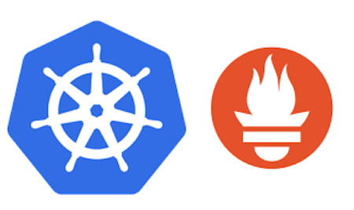
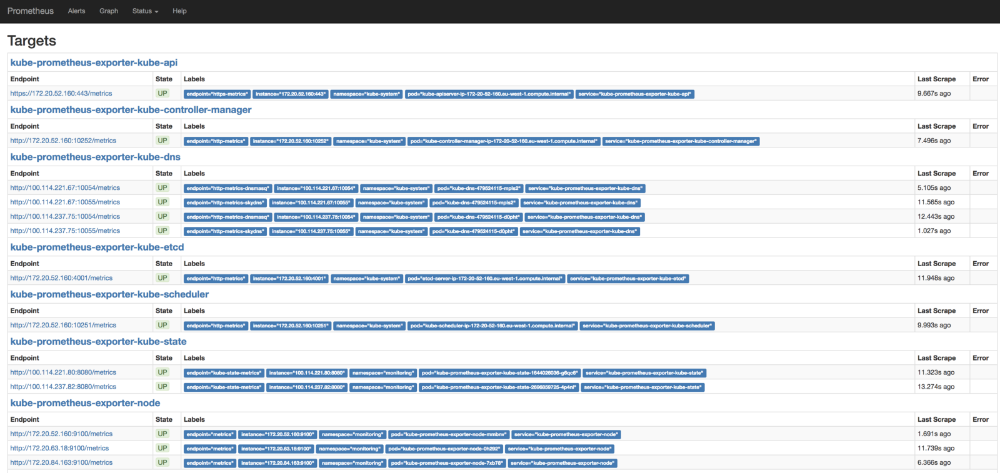
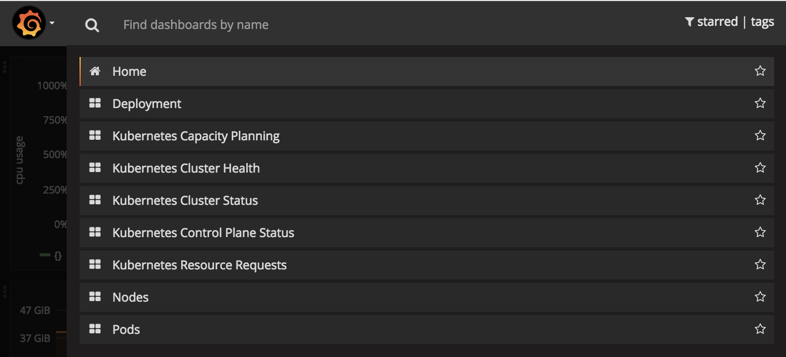

Kubernetes monitoring with Prometheus in 15 minutes

# Kubernetes monitoring with Prometheus in 15 minutes

[Giancarlo Rubio](https://itnext.io/@gianrubio)BlockedUnblockFollowFollowing

Oct 12, 2017

If you have not heard of Kubernetes (or its commonly known name K8s), it’s time to get out of your cave. K8s is an open-source self-healing platform to deploy, scale and operate containers. Originally designed by Google (inspired by [Borg](https://research.google.com/pubs/pub43438.html)) and later donated to the [CNCF](http://cncf.io).

Understanding all the k8s components is not trivial, it takes time to have full control in such a sophisticated and powerful platform. It is also important to realise that nodes, apps or network can fail at a particular time — like everything in IT. Therefore, having alerts, logs, metrics and monitoring dashboards are crucial to avoid outages and other issues.

During my last project, moving from bare metal server to the cloud, I had time to investigate the proactive monitoring with k8s. After some benchmarks and banging my head against the wall, I finally found Prometheus. The k8s project has already embraced this amazing tool, by exposing Prometheus metrics in almost all of the components.

Monitoring your k8s cluster will help your team with:

*   Proactive monitoring
*   Cluster visibility and capacity planning
*   Trigger alerts and notification
*   Metrics dashboards

During the time I was researching about how Prometheus integrates with k8s, Coreos launched [Prometheus-Operator](http://github.com/coreos/prometheus-operator); it perfectly fitted to my needs, by making all the setup configuration easy.

### Kubernetes Operator

> “We call this new class of software Operators. An Operator is an application-specific controller that extends the Kubernetes API to create, configure, and manage instances of complex stateful applications on behalf of a Kubernetes user. It builds upon the basic Kubernetes resource and controller concepts but includes domain or application-specific knowledge to automate common tasks.”

> Brandon Philips, by [_Coreos_](https://coreos.com/blog/introducing-operators.html)

Kubernetes Operators was introduced by [_Coreos_](https://coreos.com/blog/introducing-operators.html) _in_ 2016, and it has the power to abstract deployments and configuration of apps. On a personal note, I have been using a lot of [elasticsearch-operator](http://github.com/upmc-enterprises/elasticsearch-operator/) and [prometheus-operator](https://github.com/coreos/prometheus-operator/). It is not the point of this article to extend itself on k8s operators, but if you are interested you can see other k8s Operators [here](https://github.com/coreos/awesome-kubernetes-extensions).

### Prometheus

[Prometheus](http://prometheus.io) is an open source toolkit to monitor and alert, inspired by [Google Borg](https://research.google.com/pubs/pub43438.html) Monitor. It was previously developed by [SoundCloud](https://soundcloud.com/) and afterwards donated to the [CNCF](http://cncf.io).

Prometheus has support for [instrument application](https://prometheus.io/docs/instrumenting/clientlibs/) in many languages. It also provides [exporters](https://prometheus.io/docs/instrumenting/exporters/) to connect applications (Postgresql, Mysql, AWS Cloudwatch, ETCD and K8s) while remaining a great solution to monitor infrastructure and applications.

### Prometheus Operator

> The mission of the Prometheus Operator is to make running Prometheus on top of Kubernetes as easy as possible, while preserving configurability as well as making the configuration Kubernetes native. [https://coreos.com/operators/prometheus/docs/latest/user-guides/getting-started.html](https://coreos.com/operators/prometheus/docs/latest/user-guides/getting-started.html)

The Prometheus Operator provides easy monitoring for k8s services and deployments besides managing Prometheus, Alertmanager and Grafana configuration.

#### How does it work?

Prometheus Operator Architecture. Source: [prometheus-operator](https://raw.githubusercontent.com/coreos/prometheus-operator/master/Documentation/user-guides/images/architecture.png)

When you deploy a new version of your app, k8s creates a new pod (container) and after the pod is ready k8s destroy the old one. Prometheus is on a constant vigil, [watching](https://kubernetes.io/docs/api-reference/v1.6/#watch-30) the k8s api and when detects a change it creates a new Prometheus configuration, based on the services (pods) changes.

### ServiceMonitor

Prometheus-operator uses a [Custom Resource Definition](https://kubernetes.io/docs/concepts/api-extension/custom-resources/) (CRD), named [ServiceMonito](https://github.com/coreos/prometheus-operator/blob/master/Documentation/api.md#servicemonitorspec)r, to abstract the configuration to target. As an example below, let’s see how to monitor a NGINX pod with ServiceMonitor. The ServiceMonitor will select the NGINX pod, using the [matchLabels selector](https://github.com/coreos/prometheus-operator/blob/8384c90c455d18e02ecd26ccfe1738a0c8865407/Documentation/api.md#servicemonitorspec). The prometheus-operator will search for the pods based on the label selector and creates a prometheus target so prometheus will scrape the metrics endpoint.

### Try it yourself

This tutorial can be executed in less than 15 minutes, as log as you already have:

*   Kubernetes cluster up and running (v1.7.6)
*   [Helm](https://github.com/kubernetes/helm/blob/master/docs/install.md) is installed and working (2.6.1)

### **Installing**

    $ helm install stable/prometheus-operator --name prometheus-operator --namespace monitoring

Assuming all is well, you can run the command bellow to list the apps that we will take a deeper look in the next session.

$ kubectl get pods  -n monitoring  
NAME                                                       READY     STATUS    RESTARTS   AGE  
alertmanager-prometheus-operator-alertmanager-0                  2/2     Running   0          13h

prometheus-operator-grafana-74dfcc6697-2z9bh                     3/3     Running   0          13h

prometheus-operator-kube-state-metrics-76999bd456-26r55          1/1     Running   0          13h

prometheus-operator-operator-69fd4db6d6-ccpb8                    1/1     Running   0          14d

prometheus-operator-prometheus-node-exporter-2np5f               1/1     Running   2          14d

prometheus-operator-prometheus-node-exporter-2svbj               1/1     Running   0          13h

prometheus-operator-prometheus-node-exporter-jcq7z               1/1     Running   0          18d

prometheus-operator-prometheus-node-exporter-jlmgw               1/1     Running   0          13h

prometheus-operator-prometheus-node-exporter-k4dlh               1/1     Running   0          14h

prometheus-operator-prometheus-node-exporter-rwgsw               1/1     Running   0          13h

prometheus-operator-prometheus-node-exporter-t9z9x               1/1     Running   0          18d

prometheus-operator-prometheus-node-exporter-vfk69               1/1     Running   0          13h

prometheus-operator-prometheus-node-exporter-xldfq               1/1     Running   0          18d

prometheus-prometheus-operator-prometheus-0                      3/3     Running   0          18d

### Prometheus

Forward the Prometheus server to your machine so you can take a better look at the dashboard by opening [http://localhost:9090](http://localhost:9090/)

$ kubectl port-forward -n monitoring prometheus-prometheus-operator-prometheus-0 9090

In the Prometheus dashboard, you can: query on the metrics, see all the predefined alerts and Prometheus targets.

> Note: If some targets are falling with unreachable error, check the security group or firewall rules. If you don't have the same targets as the image above, check the labels of your k8s pods, sometimes the tool that you used to deploy the cluster don't follow the k8s labels patterns.

### Grafana

Prometheus has an [expression browser](https://prometheus.io/docs/visualization/browser/) for debugging purpose. To have a good-looking dashboard, use Grafana, it has a datasource ready to query on Prometheus.

$ kubectl port-forward $(kubectl get  pods --selector=app=grafana -n  monitoring --output=jsonpath="{.items..metadata.name}") -n monitoring  3000

Wait few seconds until grafana load the dashboards, open your browser at [http://localhost:3000](http://localhost:3000), login as admin with password prom-operator, to check out your brand-new awesome dashboard!!!

Grafana — Kubernetes dashboards

Grafana — Kubernetes capacity planning dashboard

### Alertmanager

> The [Alertmanager](https://prometheus.io/docs/alerting/alertmanager/) handles alerts sent by client applications such as the Prometheus server. It takes care of deduplicating, grouping, and routing them to the correct receiver integration such as email, PagerDuty, or OpsGenie. It also takes care of silencing and inhibition of alerts.

We already installed Alertmanager, now the command bellow, to forward the port to your machine, and open the url [http://localhost:9093](http://localhost:9093) in your browser

$ kubectl port-forward -n monitoring alertmanager-prometheus-operator-alertmanager-0 9093

### Next steps

Yay!!! Now you have all the k8s components monitored!! If you noticed that I'm missing something, please share the component name and the specific ServiceMonitor to cover it — I will update the post.

On my next article, I am going to cover how to instrument an application and trigger notifications using Alertmanager. I would also recommend you to watch the video below for a clearer view on how the prometheus-operator works.

Thanks to [Thiago de Faria](https://medium.com/@thiagodefaria?source=post_page) and [Kiarash Irandoust](https://medium.com/@k_irandoust?source=post_page).

*   [Kubernetes](https://itnext.io/tagged/kubernetes?source=post)
*   [Prometheus](https://itnext.io/tagged/prometheus?source=post)
*   [Prometheus Operator](https://itnext.io/tagged/prometheus-operator?source=post)
*   [Monitoring](https://itnext.io/tagged/monitoring?source=post)
*   [DevOps](https://itnext.io/tagged/devops?source=post)