Machine Learning is Fun Part 5: Language Translation with Deep Learning and the Magic of Sequences

**_Update:_** _This article is part of a series. Check out the full series:_ [_Part 1_](https://medium.com/@ageitgey/machine-learning-is-fun-80ea3ec3c471)_,_ [_Part 2_](https://medium.com/@ageitgey/machine-learning-is-fun-part-2-a26a10b68df3)_,_ [_Part 3_](https://medium.com/@ageitgey/machine-learning-is-fun-part-3-deep-learning-and-convolutional-neural-networks-f40359318721)_,_ [_Part 4_](https://medium.com/@ageitgey/machine-learning-is-fun-part-4-modern-face-recognition-with-deep-learning-c3cffc121d78)_,_ [_Part 5_](https://medium.com/@ageitgey/machine-learning-is-fun-part-5-language-translation-with-deep-learning-and-the-magic-of-sequences-2ace0acca0aa)_,_ [_Part 6_](https://medium.com/@ageitgey/machine-learning-is-fun-part-6-how-to-do-speech-recognition-with-deep-learning-28293c162f7a)_,_ [_Part 7_](https://medium.com/@ageitgey/abusing-generative-adversarial-networks-to-make-8-bit-pixel-art-e45d9b96cee7) _and_ [_Part 8_](https://medium.com/@ageitgey/machine-learning-is-fun-part-8-how-to-intentionally-trick-neural-networks-b55da32b7196)_! You can also read this article in_ [_普通话_](https://zhuanlan.zhihu.com/p/24590838)_,_ [_Русский_](http://algotravelling.com/ru/%D0%BC%D0%B0%D1%88%D0%B8%D0%BD%D0%BD%D0%BE%D0%B5-%D0%BE%D0%B1%D1%83%D1%87%D0%B5%D0%BD%D0%B8%D0%B5-%D1%8D%D1%82%D0%BE-%D0%B2%D0%B5%D1%81%D0%B5%D0%BB%D0%BE-5/)_,_ [_한국어_](https://medium.com/@jongdae.lim/%EA%B8%B0%EA%B3%84-%ED%95%99%EC%8A%B5-machine-learning-%EC%9D%80-%EC%A6%90%EA%B2%81%EB%8B%A4-part-5-83b7a44b797a)_,_ [_Tiếng Việt_](https://viblo.asia/p/machine-learning-that-thu-vi-5-dich-ngon-ngu-va-mo-ta-anh-Eb85oJnml2G) _or_ [_Italiano_](https://medium.com/botsupply/il-machine-learning-è-divertente-parte-5-5e9083caf8f3)_._

**_Giant update:_**  [_I’ve written a new book based on these articles_](https://www.machinelearningisfun.com/get-the-book/)_! It not only expands and updates all my articles, but it has tons of brand new content and lots of hands-on coding projects._ [_Check it out now_](https://www.machinelearningisfun.com/get-the-book/)_!_

We all know and love [Google Translate](https://translate.google.com/), the website that can instantly translate between 100 different human languages as if by magic. It is even available on our phones and smartwatches:

The technology behind Google Translate is called Machine Translation. It has changed the world by allowing people to communicate when it wouldn’t otherwise be possible.

But we all know that high school students have been using Google Translate to… umm… _assist_ with their Spanish homework for 15 years. Isn’t this old news?

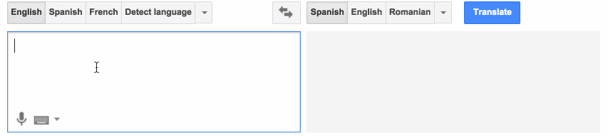

It turns out that over the past two years, deep learning has totally rewritten our approach to machine translation. Deep learning researchers who know almost nothing about language translation are throwing together relatively simple machine learning solutions that are beating the best expert-built language translation systems in the world.

The technology behind this breakthrough is called **sequence-to-sequence learning**. It’s very powerful technique that be used to solve many kinds problems. After we see how it is used for translation, we’ll also learn how the exact same algorithm can be used to write AI chat bots and describe pictures.

Let’s go!

* * *

### Making Computers Translate

So how do we program a computer to translate human language?

The simplest approach is to replace every word in a sentence with the translated word in the target language. Here’s a simple example of translating from Spanish to English word-by-word:

We just replace each Spanish word with the matching English word.

This is easy to implement because all you need is a dictionary to look up each word’s translation. But the results are bad because it ignores grammar and context.

So the next thing you might do is start adding language-specific rules to improve the results. For example, you might translate common two-word phrases as a single group. And you might swap the order nouns and adjectives since they usually appear in reverse order in Spanish from how they appear in English:

That worked! If we just keep adding more rules until we can handle every part of grammar, our program should be able to translate any sentence, right?

This is how the earliest machine translation systems worked. Linguists came up with complicated rules and programmed them in one-by-one. Some of the smartest linguists in the world labored for years during the Cold War to [create translation systems as a way to interpret Russian communications more easily.](https://en.wikipedia.org/wiki/Georgetown%E2%80%93IBM_experiment)

Unfortunately this only worked for simple, plainly-structured documents like weather reports. It didn’t work reliably for real-world documents.

The problem is that human language doesn’t follow a fixed set of rules. Human languages are full of special cases, regional variations, and just flat out rule-breaking. The way we speak English more influenced by [who invaded who hundreds of years ago](https://en.wikipedia.org/wiki/History_of_English#Middle_English) than it is by someone sitting down and defining grammar rules.

### Making Computers Translate Better Using Statistics

After the failure of rule-based systems, new translation approaches were developed using models based on probability and statistics instead of grammar rules.

Building a statistics-based translation system requires lots of training data where the exact same text is translated into at least two languages. This double-translated text is called _parallel corpora_. In the same way that the [Rosetta Stone](https://en.wikipedia.org/wiki/Rosetta_Stone) was used by scientists in the 1800s to figure out Egyptian hieroglyphs from Greek, computers can use parallel corpora to guess how to convert text from one language to another.

Luckily, there’s lots of double-translated text already sitting around in strange places. For example, the European Parliament translates their proceedings into 21 languages. So researchers often use [that data](http://www.statmt.org/europarl/) to help build translation systems.

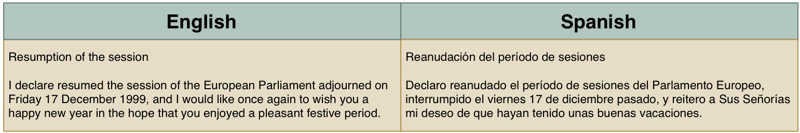

Training data is usually exciting! But this is just millions and millions of lines of dry government documents…

#### Thinking in Probabilities

The fundamental difference with statistical translation systems is that they don’t try to generate one exact translation. Instead, they generate thousands of possible translations and then they rank those translations by likely each is to be correct. They estimate how “correct” something is by how similar it is to the training data. Here’s how it works:

#### Step 1: Break original sentence into chunks

First, we break up our sentence into simple chunks that can each be easily translated:

#### Step 2: Find all possible translations for each chunk

Next, we will translate each of these chunks by finding all the ways humans have translated those same chunks of words in our training data.

It’s important to note that we are not just looking up these chunks in a simple translation dictionary. Instead, we are seeing how actual people translated these same chunks of words in real-world sentences. This helps us capture all of the different ways they can be used in different contexts:

Even the most common phrases have lots of possible translations.

Some of these possible translations are used more frequently than others. Based on how frequently each translation appears in our training data, we can give it a score.

For example, it’s much more common for someone to say “Quiero” to mean “I want” than to mean “I try.” So we can use how frequently “Quiero” was translated to “I want” in our training data to give that translation more weight than a less frequent translation.

#### Step 3: Generate all possible sentences and find the most likely one

Next, we will use every possible combination of these chunks to generate a bunch of possible sentences.

Just from the chunk translations we listed in Step 2, we can already generate nearly 2,500 different variations of our sentence by combining the chunks in different ways. Here are some examples:

> I love | to leave | at | the seaside | more tidy.  
> I mean | to be on | to | the open space | most lovely.  
> I like | to be |on | per the seaside | more lovely.  
> I mean | to go | to | the open space | most tidy.

But in a real-world system, there will be even more possible chunk combinations because we’ll also try different orderings of words and different ways of chunking the sentence:

> I try | to run | at | the prettiest | open space.  
> I want | to run | per | the more tidy | open space.  
> I mean | to forget | at | the tidiest | beach.  
> I try | to go | per | the more tidy | seaside.

Now need to scan through all of these generated sentences to find the one that is that sounds the “most human.”

To do this, we compare each generated sentence to millions of real sentences from books and news stories written in English. The more English text we can get our hands on, the better.

Take this possible translation:

> I try | to leave | per | the most lovely | open space.

It’s likely that no one has ever written a sentence like this in English, so it would not be very similar to any sentences in our data set. We’ll give this possible translation a low probability score.

But look at this possible translation:

> I want | to go | to | the prettiest | beach.

This sentence will be similar to something in our training set, so it will get a high probability score.

After trying all possible sentences, we’ll pick the sentence that has the most likely chunk translations while also being the most similar overall to real English sentences.

Our final translation would be “I want to go to the prettiest beach.” Not bad!

#### Statistical Machine Translation was a Huge Milestone

Statistical machine translation systems perform much better than rule-based systems if you give them enough training data. [Franz Josef Och](https://en.wikipedia.org/wiki/Franz_Josef_Och) improved on these ideas and used them to build Google Translate in the early 2000s. Machine Translation was finally available to the world.

In the early days, it was surprising to everyone that the “dumb” approach to translating based on probability worked better than rule-based systems designed by linguists. This led to a (somewhat mean) saying among researchers in the 80s:

> “Every time I fire a linguist, my accuracy goes up.”

> — [Frederick Jelinek](https://en.wikipedia.org/wiki/Frederick_Jelinek)

#### The Limitations of Statistical Machine Translation

Statistical machine translation systems work well, but they are complicated to build and maintain. Every new pair of languages you want to translate requires experts to tweak and tune a new multi-step translation pipeline.

Because it is so much work to build these different pipelines, trade-offs have to be made. If you are asking Google to translate Georgian to Telegu, it has to internally translate it into English as an intermediate step because there’s not enough Georgain-to-Telegu translations happening to justify investing heavily in that language pair. And it might do that translation using a less advanced translation pipeline than if you had asked it for the more common choice of French-to-English.

Wouldn’t it be cool if we could have the computer do all that annoying development work for us?

### Making Computers Translate Better — Without all those Expensive People

The holy grail of machine translation is a black box system that learns how to translate by itself— just by looking at training data. With Statistical Machine Translation, humans are still needed to build and tweak the multi-step statistical models.

In 2014, [KyungHyun Cho’s team made a breakthrough](http://arxiv.org/abs/1406.1078). They found a way to apply deep learning to build this black box system. Their deep learning model takes in a _parallel corpora_ and and uses it to learn how to translate between those two languages without any human intervention.

Two big ideas make this possible — _recurrent neural networks_ and _encodings_. By combining these two ideas in a clever way, we can build a self-learning translation system.

#### Recurrent Neural Networks

We’ve already [talked about recurrent neural networks in Part 2](https://medium.com/@ageitgey/machine-learning-is-fun-part-2-a26a10b68df3), but let’s quickly review.

A regular (non-recurrent) neural network is a generic machine learning algorithm that takes in a list of numbers and calculates a result (based on previous training). Neural networks can be used as a black box to solve lots of problems. For example, we can use a neural network to calculate the approximate value of a house based on attributes of that house:

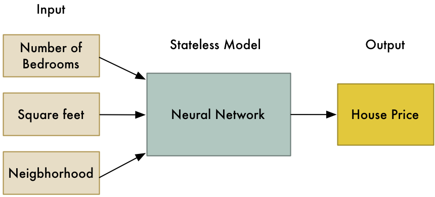

But like most machine learning algorithms, neural networks are _stateless_. You pass in a list of numbers and the neural network calculates a result. If you pass in those same numbers again, it will always calculate the same result. It has no memory of past calculations. In other words, 2 + 2 always equals 4.

A _recurrent_ _neural network_ (or _RNN_ for short) is a slightly tweaked version of a neural network where the previous state of the neural network is one of the inputs to the next calculation. This means that previous calculations change the results of future calculations!

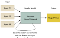

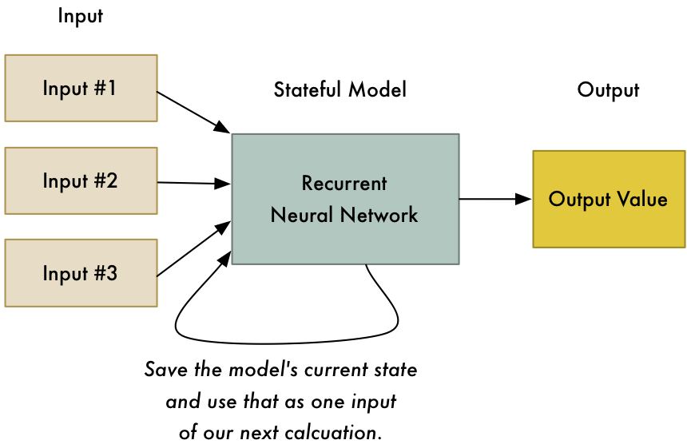

Humans hate him: 1 weird trick that makes machines smarter!

Why in the world would we want to do this? Shouldn’t 2 + 2 always equal 4 no matter what we last calculated?

This trick allows neural networks to learn patterns in a sequence of data. For example, you can use it to predict the next most likely word in a sentence based on the first few words:

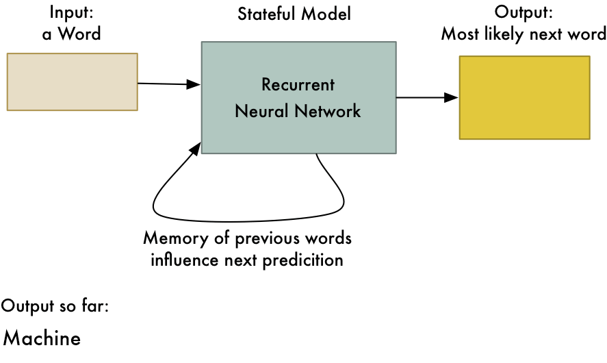

This is one way you could implement “autocorrect” for a smart phone’s keyboard app

RNNs are useful any time you want to learn patterns in data. Because human language is just one big, complicated pattern, RNNs are increasingly used in many areas of natural language processing.

If you want to learn more about RNNs, [you can read Part 2](https://medium.com/@ageitgey/machine-learning-is-fun-part-2-a26a10b68df3) where we used one to generate a fake Ernest Hemingway book and then used another one to generate fake Super Mario Brothers levels.

#### Encodings

The other idea we need to review is _Encodings_. We [talked about encodings in Part 4](https://medium.com/@ageitgey/machine-learning-is-fun-part-4-modern-face-recognition-with-deep-learning-c3cffc121d78) as part of face recognition. To explain encodings, let’s take a slight detour into how we can tell two different people apart with a computer.

When you are trying to tell two faces apart with a computer, you collect different measurements from each face and use those measurements to compare faces. For example, we might measure the size of each ear or the spacing between the eyes and compare those measurements from two pictures to see if they are the same person.

You’re probably already familiar with this idea from watching any primetime detective show like CSI:

I love this dumb gif from CSI so much that I’ll use it again — because it is somehow manages to demonstrate this idea clearly while also being total nonsense.

The idea of turning a face into a list of measurements is an example of an _encoding_. We are taking raw data (a picture of a face) and turning it into a list of measurements that represent it (the encoding).

But like we saw in [Part 4](https://medium.com/@ageitgey/machine-learning-is-fun-part-4-modern-face-recognition-with-deep-learning-c3cffc121d78), we don’t have to come up with a specific list of facial features to measure ourselves. Instead, we can use a neural network to generate measurements from a face. The computer can do a better job than us in figuring out which measurements are best able to differentiate two similar people:

These facial feature measurements are generated by a neural net that was trained to make sure different people’s faces resulted in different numbers.

This is our _encoding_. It lets us represent something very complicated (a picture of a face) with something simple (128 numbers). Now comparing two different faces is much easier because we only have to compare these 128 numbers for each face instead of comparing full images.

Guess what? We can do the same thing with sentences! We can come up with an encoding that represents every possible different sentence as a series of unique numbers:

This list of numbers represents the English sentence “Machine Learning is Fun!”. A different sentence would be represented by a different set of numbers.

To generate this encoding, we’ll feed the sentence into the RNN, one word at time. The final result after the last word is processed will be the values that represent the entire sentence:

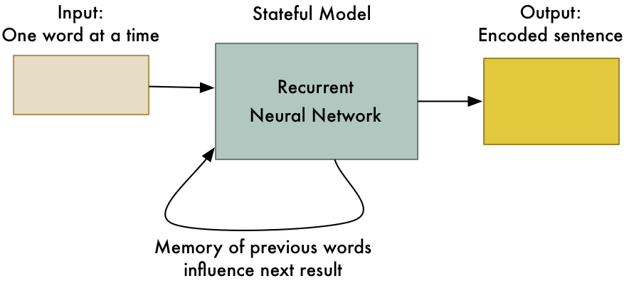

Because the RNN has a “memory” of each word that passed through it, the final encoding it calculates represents all the words in the sentence.

Great, so now we have a way to represent an entire sentence as a set of unique numbers! We don’t know what each number in the encoding means, but it doesn’t really matter. As long as each sentence is uniquely identified by it’s own set of numbers, we don’t need to know exactly how those numbers were generated.

#### Let’s Translate!

Ok, so we know how to use an RNN to encode a sentence into a set of unique numbers. How does that help us? Here’s where things get really cool!

What if we took two RNNs and hooked them up end-to-end? The first RNN could generate the encoding that represents a sentence. Then the second RNN could take that encoding and just do the same logic in reverse to decode the original sentence again:

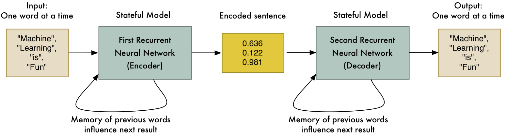

Of course being able to encode and then decode the original sentence again isn’t very useful. But what if (_and here’s the big idea!_) we could train the second RNN to decode the sentence into Spanish instead of English? We could use our _parallel corpora_ training data to train it to do that:

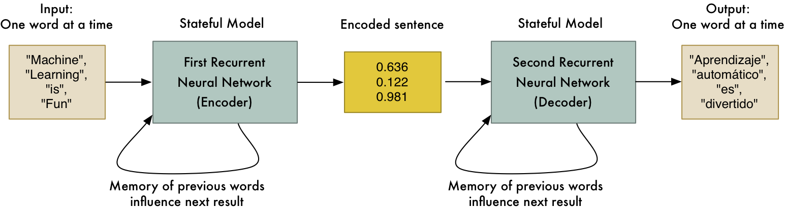

And just like that, we have a generic way of converting a sequence of English words into an equivalent sequence of Spanish words!

This is a powerful idea:

*   This approach is mostly limited by the amount of training data you have and the amount of computer power you can throw at it. Machine learning researchers only invented this **two years ago**, but it’s already performing as well as statistical machine translation systems that took **20 years** to develop.
*   This doesn’t depend on knowing any rules about human language. The algorithm figures out those rules itself. This means you don’t need experts to tune every step of your translation pipeline. The computer does that for you.
*   **_This approach works for almost any kind of sequence-to-sequence problem!_** And it turns out that lots of interesting problems are sequence-to-sequence problems. Read on for other cool things you can do!

Note that we glossed over some things that are required to make this work with real-world data. For example, there’s additional work you have to do to deal with different lengths of input and output sentences (see [bucketing and padding](https://www.tensorflow.org/versions/r0.10/tutorials/seq2seq/index.html#bucketing-and-padding)). There’s also issues with [translating rare words correctly](https://cs224d.stanford.edu/papers/addressing.pdf).

#### Building your own Sequence-to-Sequence Translation System

If you want to build your own language translation system, [there’s a working demo included with TensorFlow that will translate between English and French](https://www.tensorflow.org/versions/r0.10/tutorials/seq2seq/index.html). However, this is not for the faint of heart or for those with limited budgets. This technology is still new and very resource intensive. Even if you have a fast computer with a high-end video card, it might take [about a month](https://github.com/tensorflow/tensorflow/issues/600#issuecomment-226333266) of continuous processing time to train your own language translation system.

Also, Sequence-to-sequence language translation techniques are improving so rapidly that it’s hard to keep up. Many recent improvements (like adding an [attention mechanism](http://stanford.edu/~lmthang/data/papers/emnlp15_attn.pdf) or [tracking context](http://arxiv.org/abs/1607.00578)) are significantly improving results but these developments are so new that there aren’t even wikipedia pages for them yet. If you want to do anything serious with sequence-to-sequence learning, you’ll need to keep with new developments as they occur.

### The Ridiculous Power of Sequence-to-Sequence Models

So what else can we do with sequence-to-sequence models?

About a year ago, [researchers at Google showed](https://arxiv.org/pdf/1506.05869.pdf) that you can use sequence-to-sequence models to build AI bots. The idea is so simple that it’s amazing it works at all.

First, they captured chat logs between Google employees and Google’s Tech Support team. Then they trained a sequence-to-sequence model where the employee’s question was the input sentence and the Tech Support team’s response was the “translation” of that sentence.

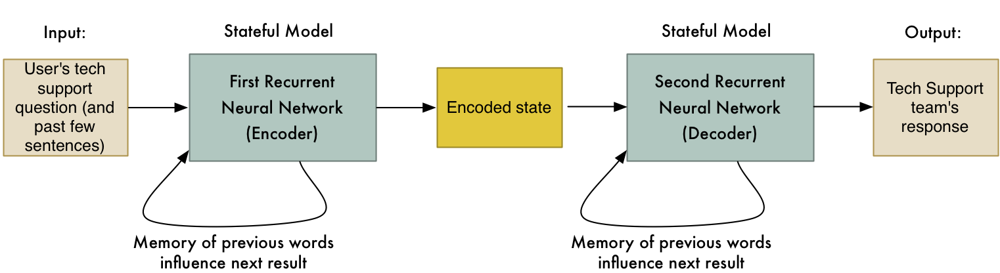

When a user interacted with the bot, they would “translate” each of the user’s messages with this system to get the bot’s response.

The end result was a semi-intelligent bot that could (sometimes) answer real tech support questions. Here’s part of a sample conversation between a user and the bot [from their paper](https://arxiv.org/pdf/1506.05869.pdf):

> **Human:** connection refused or something like that  
> **Machine:** may i know the version of network connect you connect?  
> **Human:** i am not sure i know that  
> **Machine:** is the network connect prompting for any user certificate?  
> **Human:** yes  
> **Machine:** are you at home or at work at the moment? office?  
> **Human:** i am at home  
> **Machine:** try this. goto &lt;URL redacted&gt; page and enter your name and password  
> **Human:** done  
> **Machine:** try logging in with &lt;NAME redacted&gt; and check if its working fine now  
> **Human:** yes, now it works!  
> **Machine:** great. anything else that i can help?

They also tried building a chat bot based on millions of movie subtitles. The idea was to use conversations between movie characters as a way to train a bot to talk like a human. The input sentence is a line of dialog said by one character and the “translation” is what the next character said in response:

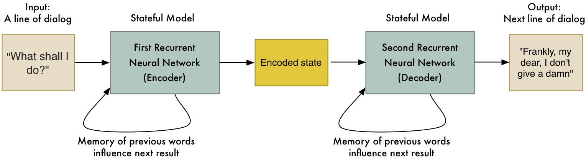

This produced really interesting results. Not only did the bot converse like a human, but it displayed a small bit of intelligence:

> **Human:** my name is david. what is my name?  
> **Machine:** david.  
> **Human:** my name is john. what is my name?  
> **Machine:** john.  
> **Human:** are you a leader or a follower?  
> **Machine:** i’m a leader.  
> **Human:** are you a follower or a leader?  
> **Machine:** i’m a leader.

This is only the beginning of the possibilities. We aren’t limited to converting one sentence into another sentence. It’s also possible to make an image-to-sequence model that can turn an image into text!

[A different team at Google](http://www.cv-foundation.org/openaccess/content_cvpr_2015/papers/Vinyals_Show_and_Tell_2015_CVPR_paper.pdf) did this by replacing the first RNN with a Convolutional Neural Network ([like we learned about in Part 3)](https://medium.com/@ageitgey/machine-learning-is-fun-part-3-deep-learning-and-convolutional-neural-networks-f40359318721#.yzzx24elr). This allows the input to be a picture instead of a sentence. The rest works basically the same way:

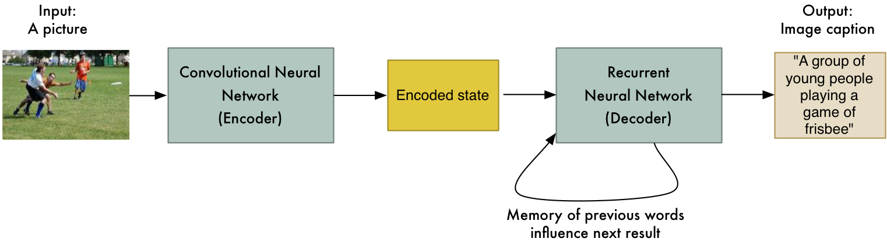

And just like that, we can turn pictures into words (as long as we have lots and lots of training data)!

[Andrej Karpathy](http://cs.stanford.edu/people/karpathy/) [expanded on these ideas](http://cs.stanford.edu/people/karpathy/cvpr2015.pdf) to build a system capable of describing images in great detail by processing multiple regions of an image separately:

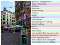

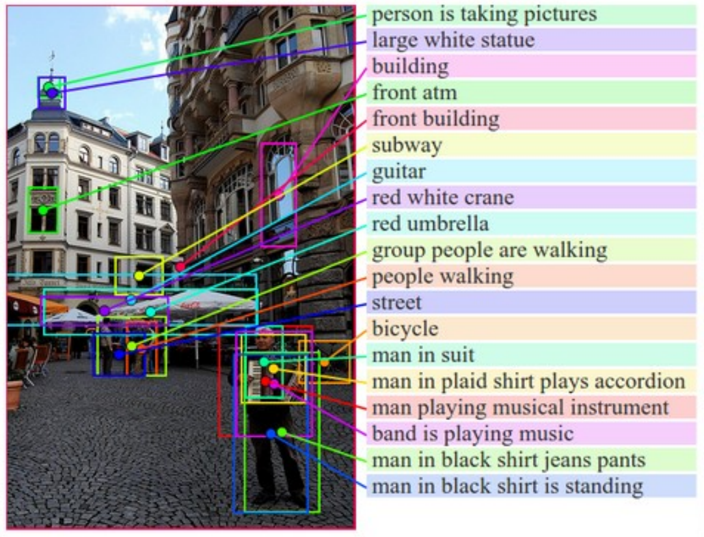

Image from [this paper](http://cs.stanford.edu/people/karpathy/cvpr2015.pdf) by [Andrej Karpathy](http://cs.stanford.edu/people/karpathy/)

This makes it possible to build [image search engines](http://cs.stanford.edu/people/karpathy/deepimagesent/rankingdemo/) that are capable of finding images that match oddly specific search queries:

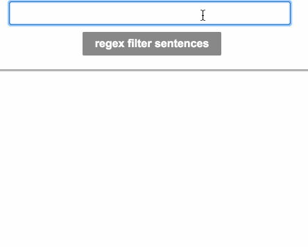

Example from [http://cs.stanford.edu/people/karpathy/deepimagesent/rankingdemo/](http://cs.stanford.edu/people/karpathy/deepimagesent/rankingdemo/)

There’s even [researchers working on the reverse problem](http://arxiv.org/pdf/1506.03500.pdf), generating an entire picture based on just a text description!

Just from these examples, you can start to imagine the possibilities. So far, there have been sequence-to-sequence [applications in everything from speech recognition to computer vision](https://github.com/kjw0612/awesome-rnn#applications). I bet there will be a lot more over the next year.

If you want to learn more in depth about sequence-to-sequence models and translation, here’s some recommended resources:

*   [Richard Socher’s CS224D Lecture— Fancy Recurrent Neural Networks for Machine Translation](https://www.youtube.com/watch?v=qGlmW2n4s1w) (video)
*   [Thang Luong’s CS224D Lecture — Neural Machine Transation](http://cs224d.stanford.edu/lectures/CS224d-Lecture15.pdf) (PDF)
*   [TensorFlow’s description of Seq2Seq modeling](https://www.tensorflow.org/versions/r0.10/tutorials/seq2seq/index.html)
*   [The Deep Learning Book’s chapter on Sequence to Sequence Learning](http://www.deeplearningbook.org/contents/rnn.html) (PDF)

* * *

If you liked this article, please consider [**signing up for my Machine Learning is Fun! email list**](http://eepurl.com/b9fg2T). I’ll only email you when I have something new and awesome to share. It’s the best way to find out when I write more articles like this.

You can also follow me on Twitter at [@ageitgey](https://twitter.com/ageitgey), [email me directly](mailto:ageitgey@gmail.com) or [find me on linkedin](https://www.linkedin.com/in/ageitgey). I’d love to hear from you if I can help you or your team with machine learning.

_Now continue on to_ [_Machine Learning is Fun! Part 6_](https://medium.com/@ageitgey/machine-learning-is-fun-part-6-how-to-do-speech-recognition-with-deep-learning-28293c162f7a)_!_

*   [Machine Learning](https://medium.com/tag/machine-learning?source=post)
*   [Artificial Intelligence](https://medium.com/tag/artificial-intelligence?source=post)
*   [Translation](https://medium.com/tag/translation?source=post)