Machine Learning is Fun Part 6: How to do Speech Recognition with Deep Learning

**_Update:_** _This article is part of a series. Check out the full series:_ [_Part 1_](https://medium.com/@ageitgey/machine-learning-is-fun-80ea3ec3c471)_,_ [_Part 2_](https://medium.com/@ageitgey/machine-learning-is-fun-part-2-a26a10b68df3)_,_ [_Part 3_](https://medium.com/@ageitgey/machine-learning-is-fun-part-3-deep-learning-and-convolutional-neural-networks-f40359318721)_,_ [_Part 4_](https://medium.com/@ageitgey/machine-learning-is-fun-part-4-modern-face-recognition-with-deep-learning-c3cffc121d78)_,_ [_Part 5_](https://medium.com/@ageitgey/machine-learning-is-fun-part-5-language-translation-with-deep-learning-and-the-magic-of-sequences-2ace0acca0aa)_,_ [_Part 6_](https://medium.com/@ageitgey/machine-learning-is-fun-part-6-how-to-do-speech-recognition-with-deep-learning-28293c162f7a)_,_ [_Part 7_](https://medium.com/@ageitgey/abusing-generative-adversarial-networks-to-make-8-bit-pixel-art-e45d9b96cee7) _and_ [_Part 8_](https://medium.com/@ageitgey/machine-learning-is-fun-part-8-how-to-intentionally-trick-neural-networks-b55da32b7196)_! You can also read this article in_ [_普通话_](https://zhuanlan.zhihu.com/p/24703268)_,_ [_한국어_](https://medium.com/@jongdae.lim/%EA%B8%B0%EA%B3%84-%ED%95%99%EC%8A%B5-machine-learning-%EC%9D%80-%EC%A6%90%EA%B2%81%EB%8B%A4-part-6-eb0ed6b0ed1d)_,_ [_Tiếng Việt_](https://viblo.asia/p/machine-learning-that-thu-vi-6-nhan-dien-giong-noi-1Je5E8DylnL) _or_ [_Русский_](http://algotravelling.com/ru/%D0%BC%D0%B0%D1%88%D0%B8%D0%BD%D0%BD%D0%BE%D0%B5-%D0%BE%D0%B1%D1%83%D1%87%D0%B5%D0%BD%D0%B8%D0%B5-%D1%8D%D1%82%D0%BE-%D0%B2%D0%B5%D1%81%D0%B5%D0%BB%D0%BE-6/)_._

**_Giant update:_**  [_I’ve written a new book based on these articles_](https://www.machinelearningisfun.com/get-the-book/)_! It not only expands and updates all my articles, but it has tons of brand new content and lots of hands-on coding projects._ [_Check it out now_](https://www.machinelearningisfun.com/get-the-book/)_!_

Speech recognition is invading our lives. It’s built into our phones, our game consoles and our smart watches. It’s even automating our homes. For just $50, you can get an Amazon Echo Dot — a magic box that allows you to order pizza, get a weather report or even buy trash bags — just by speaking out loud:

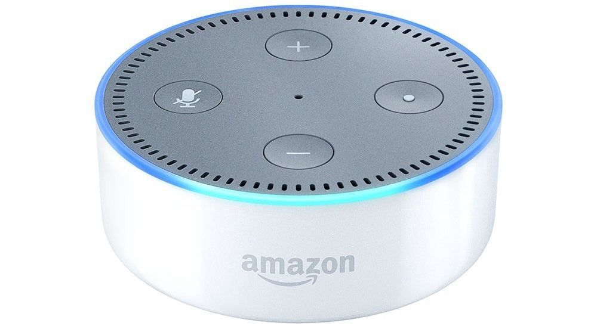

Alexa, order a large pizza!

The Echo Dot has been so popular this holiday season that Amazon [can’t seem to keep them in stock](https://www.bloomberg.com/news/articles/2016-12-21/amazon-sells-out-of-echo-speakers-in-midst-of-holiday-rush)!

But speech recognition has been around for decades, so why is it just now hitting the mainstream? The reason is that deep learning finally made speech recognition accurate enough to be useful outside of carefully controlled environments.

[Andrew Ng](https://en.wikipedia.org/wiki/Andrew_Ng) has long predicted that as speech recognition goes from 95% accurate to 99% accurate, it will become a primary way that we interact with computers. The idea is that this 4% accuracy gap is the difference between _annoyingly unreliable_ and _incredibly useful_. Thanks to Deep Learning, we’re finally cresting that peak.

Let’s learn how to do speech recognition with deep learning!

### Machine Learning isn’t always a Black Box

If you know [how neural machine translation works](https://medium.com/@ageitgey/machine-learning-is-fun-part-5-language-translation-with-deep-learning-and-the-magic-of-sequences-2ace0acca0aa), you might guess that we could simply feed sound recordings into a neural network and train it to produce text:

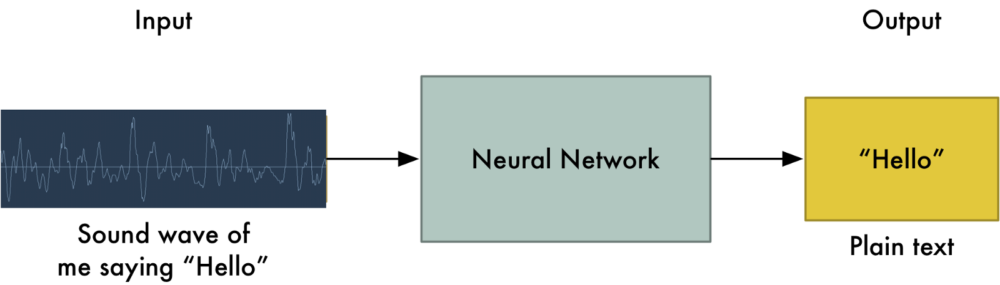

That’s the holy grail of speech recognition with deep learning, but we aren’t quite there yet (at least at the time that I wrote this — I bet that we will be in a couple of years).

The big problem is that speech varies in speed. One person might say “hello!” very quickly and another person might say “heeeelllllllllllllooooo!” very slowly, producing a much longer sound file with much more data. Both both sound files should be recognized as exactly the same text — “hello!” Automatically aligning audio files of various lengths to a fixed-length piece of text turns out to be pretty hard.

To work around this, we have to use some special tricks and extra precessing in addition to a deep neural network. Let’s see how it works!

### Turning Sounds into Bits

The first step in speech recognition is obvious — we need to feed sound waves into a computer.

In [Part 3](https://medium.com/@ageitgey/machine-learning-is-fun-part-3-deep-learning-and-convolutional-neural-networks-f40359318721#.wukv4xnp4), we learned how to take an image and treat it as an array of numbers so that we can feed directly into a neural network for image recognition:

Images are just arrays of numbers that encode the intensity of each pixel

But sound is transmitted as _waves_. How do we turn sound waves into numbers? Let’s use this sound clip of me saying “Hello”:

A waveform of me saying “Hello”

Sound waves are one-dimensional. At every moment in time, they have a single value based on the height of the wave. Let’s zoom in on one tiny part of the sound wave and take a look:

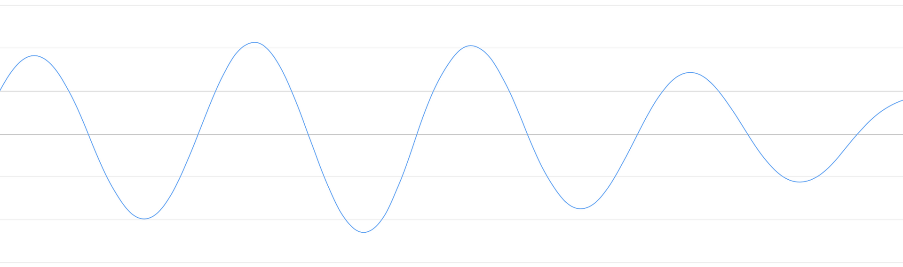

To turn this sound wave into numbers, we just record of the height of the wave at equally-spaced points:

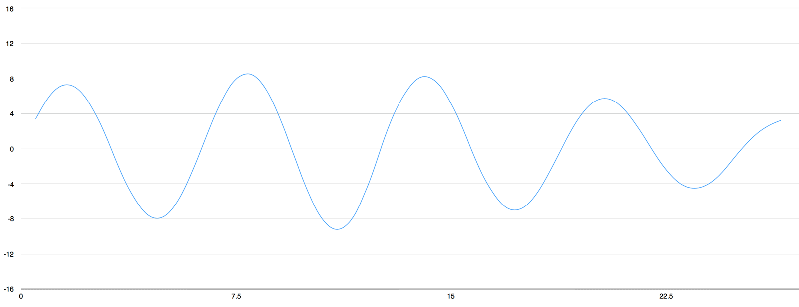

Sampling a sound wave

This is called _sampling_. We are taking a reading thousands of times a second and recording a number representing the height of the sound wave at that point in time. That’s basically all an uncompressed .wav audio file is.

“CD Quality” audio is sampled at 44.1khz (44,100 readings per second). But for speech recognition, a sampling rate of 16khz (16,000 samples per second) is enough to cover the frequency range of human speech.

Lets sample our “Hello” sound wave 16,000 times per second. Here’s the first 100 samples:

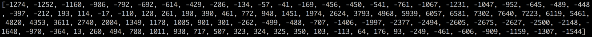

Each number represents the amplitude of the sound wave at 1/16000th of a second intervals

#### A Quick Sidebar on Digital Sampling

You might be thinking that sampling is only creating a rough approximation of the original sound wave because it’s only taking occasional readings. There’s gaps in between our readings so we must be losing data, right?

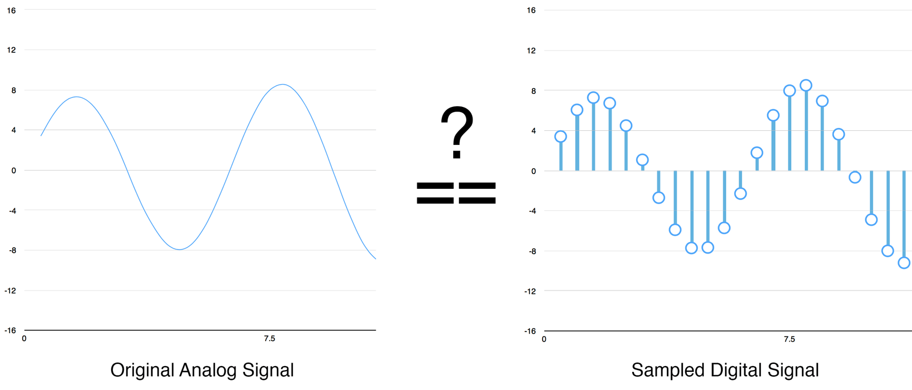

Can digital samples perfectly recreate the original analog sound wave? What about those gaps?

But thanks to the [Nyquist theorem](https://en.wikipedia.org/wiki/Nyquist%E2%80%93Shannon_sampling_theorem), we know that we can use math to perfectly reconstruct the original sound wave from the spaced-out samples — as long as we sample at least twice as fast as the highest frequency we want to record.

I mention this only because [nearly everyone gets this wrong](http://gizmodo.com/dont-buy-what-neil-young-is-selling-1678446860) and assumes that using higher sampling rates always leads to better audio quality. It doesn’t.

&lt;/end rant&gt;

### Pre-processing our Sampled Sound Data

We now have an array of numbers with each number representing the sound wave’s amplitude at 1/16,000th of a second intervals.

We _could_ feed these numbers right into a neural network. But trying to recognize speech patterns by processing these samples directly is difficult. Instead, we can make the problem easier by doing some pre-processing on the audio data.

Let’s start by grouping our sampled audio into 20-millisecond-long chunks. Here’s our first 20 milliseconds of audio (i.e., our first 320 samples):

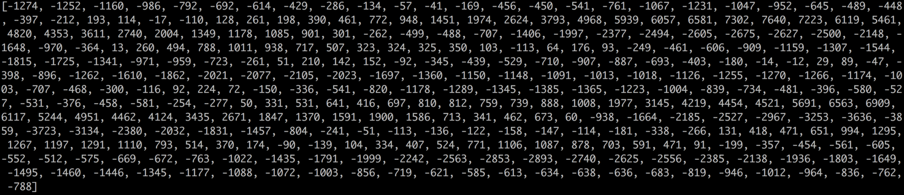

Plotting those numbers as a simple line graph gives us a rough approximation of the original sound wave for that 20 millisecond period of time:

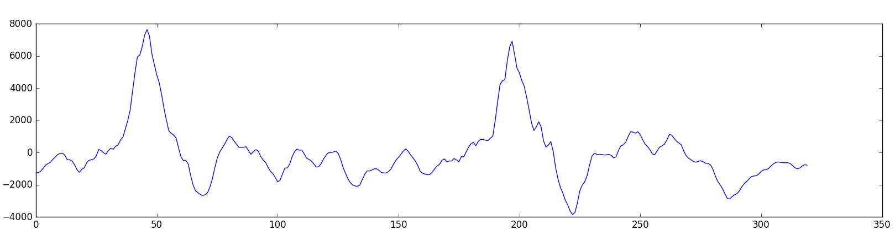

This recording is only _1/50th of a second_ _long_. But even this short recording is a complex mish-mash of different frequencies of sound. There’s some low sounds, some mid-range sounds, and even some high-pitched sounds sprinkled in. But taken all together, these different frequencies mix together to make up the complex sound of human speech.

To make this data easier for a neural network to process, we are going to break apart this complex sound wave into it’s component parts. We’ll break out the low-pitched parts, the next-lowest-pitched-parts, and so on. Then by adding up how much energy is in each of those frequency bands (from low to high), we create a _fingerprint_ of sorts for this audio snippet.

Imagine you had a recording of someone playing a C Major chord on a piano. That sound is the combination of three musical notes— C, E and G — all mixed together into one complex sound. We want to break apart that complex sound into the individual notes to discover that they were C, E and G. This is the exact same idea.

We do this using a mathematic operation called a [_Fourier transform_](https://en.wikipedia.org/wiki/Fourier_transform). It breaks apart the complex sound wave into the simple sound waves that make it up. Once we have those individual sound waves, we add up how much energy is contained in each one.

The end result is a score of how important each frequency range is, from low pitch (i.e. bass notes) to high pitch. Each number below represents how much energy was in each 50hz band of our 20 millisecond audio clip:

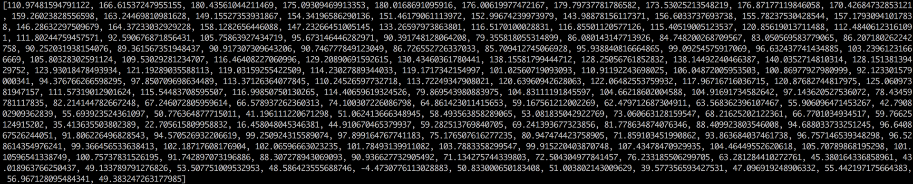

Each number in the list represents how much _energy_ was in that 50hz frequency band

But this is a lot easier to see when you draw this as a chart:

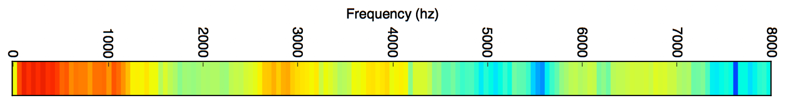

You can see that our 20 millisecond sound snippet has a lot of low-frequency energy and not much energy in the higher frequencies. That’s typical of “male” voices.

If we repeat this process on every 20 millisecond chunk of audio, we end up with a spectrogram (each column from left-to-right is one 20ms chunk):

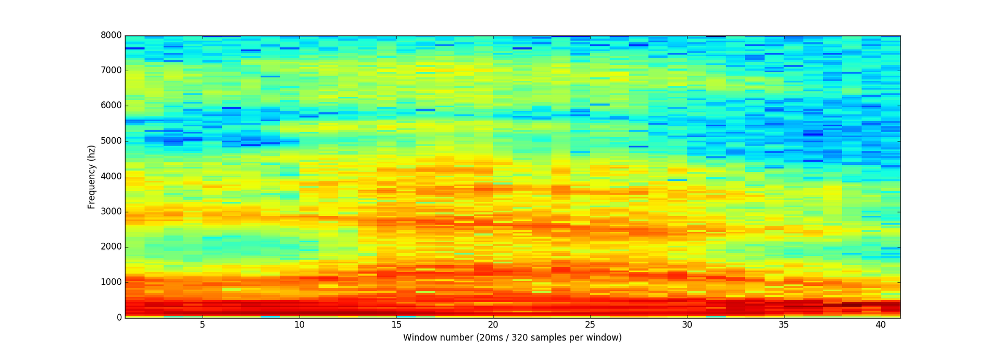

The full spectrogram of the “hello” sound clip

A spectrogram is cool because you can actually _see_ musical notes and other pitch patterns in audio data. A neural network can find patterns in this kind of data more easily than raw sound waves. So this is the data representation we’ll actually feed into our neural network.

### Recognizing Characters from Short Sounds

Now that we have our audio in a format that’s easy to process, we will feed it into a deep neural network. The input to the neural network will be 20 millisecond audio chunks. For each little audio slice, it will try to figure out the _letter_ that corresponds the sound currently being spoken.

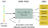

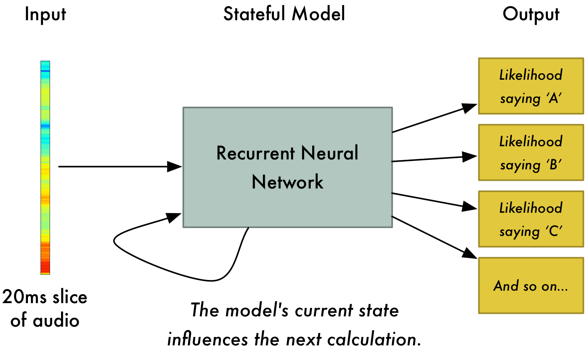

We’ll use a [recurrent neural network](https://medium.com/@ageitgey/machine-learning-is-fun-part-2-a26a10b68df3) — that is, a neural network that has a memory that influences future predictions. That’s because each letter it predicts should affect the likelihood of the next letter it will predict too. For example, if we have said “HEL” so far, it’s very likely we will say “LO” next to finish out the word “Hello”. It’s much less likely that we will say something unpronounceable next like “XYZ”. So having that memory of previous predictions helps the neural network make more accurate predictions going forward.

After we run our entire audio clip through the neural network (one chunk at a time), we’ll end up with a mapping of each audio chunk to the letters most likely spoken during that chunk. Here’s what that mapping looks like for me saying “Hello”:

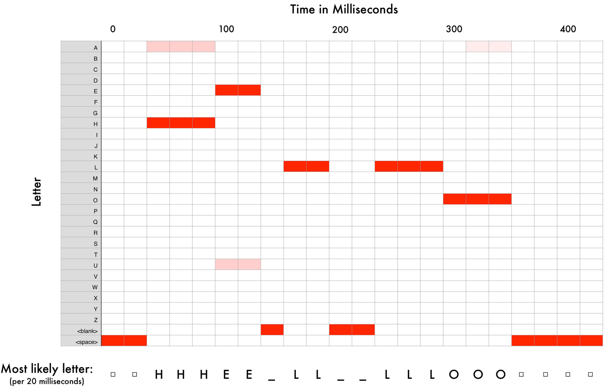

Our neural net is predicting that one likely thing I said was “HHHEE\_LL\_LLLOOO”. But it also thinks that it was possible that I said “HHHUU\_LL\_LLLOOO” or even “AAAUU\_LL\_LLLOOO”.

We have some steps we follow to clean up this output. First, we’ll replace any repeated characters a single character:

*   HHHEE\_LL\_LLLOOO becomes HE\_L\_LO
*   HHHUU\_LL\_LLLOOO becomes HU\_L\_LO
*   AAAUU\_LL\_LLLOOO becomes AU\_L\_LO

Then we’ll remove any blanks:

*   HE\_L\_LO becomes HELLO
*   HU\_L\_LO becomes HULLO
*   AU\_L\_LO becomes AULLO

That leaves us with three possible transcriptions — “Hello”, “Hullo” and “Aullo”. If you say them out loud, all of these sound similar to “Hello”. Because it’s predicting one character at a time, the neural network will come up with these very _sounded-out_ transcriptions. For example if you say “He would not go”, it might give one possible transcription as “He wud net go”.

The trick is to combine these pronunciation-based predictions with likelihood scores based on large database of written text (books, news articles, etc). You throw out transcriptions that seem the least likely to be real and keep the transcription that seems the most realistic.

Of our possible transcriptions “Hello”, “Hullo” and “Aullo”, obviously “Hello” will appear more frequently in a database of text (not to mention in our original audio-based training data) and thus is probably correct. So we’ll pick “Hello” as our final transcription instead of the others. Done!

#### Wait a second!

You might be thinking _“But what if someone says ‘_[_Hullo_](https://www.merriam-webster.com/dictionary/hullo)_’? It’s a valid word. Maybe ‘Hello’ is the wrong transcription!”_

“Hullo! Who dis?”

Of course it is possible that someone actually said “Hullo” instead of “Hello”. But a speech recognition system like this (trained on American English) will basically never produce “Hullo” as the transcription. It’s just such an unlikely thing for a user to say compared to “Hello” that it will always think you are saying “Hello” no matter how much you emphasize the ‘U’ sound.

Try it out! If your phone is set to American English, try to get your phone’s digital assistant to recognize the world “Hullo.” You can’t! It refuses! It will always understand it as “Hello.”

Not recognizing “Hullo” is a reasonable behavior, but sometimes you’ll find annoying cases where your phone just refuses to understand something valid you are saying. That’s why these speech recognition models are always being retrained with more data to fix these edge cases.

### Can I Build My Own Speech Recognition System?

One of the coolest things about machine learning is how simple it sometimes seems. You get a bunch of data, feed it into a machine learning algorithm, and then magically you have a world-class AI system running on your gaming laptop’s video card… _Right_?

That sort of true in some cases, but not for speech. Recognizing speech is a hard problem. You have to overcome almost limitless challenges: bad quality microphones, background noise, reverb and echo, accent variations, and on and on. All of these issues need to be present in your training data to make sure the neural network can deal with them.

Here’s another example: Did you know that when you speak in a loud room you unconsciously raise the pitch of your voice to be able to talk over the noise? Humans have no problem understanding you either way, but neural networks need to be trained to handle this special case. So you need training data with people yelling over noise!

To build a voice recognition system that performs on the level of Siri, Google Now!, or Alexa, you will need a _lot_ of training data — far more data than you can likely get without hiring hundreds of people to record it for you. And since users have low tolerance for poor quality voice recognition systems, you can’t skimp on this. No one wants a voice recognition system that works 80% of the time.

For a company like Google or Amazon, hundreds of thousands of hours of spoken audio recorded in real-life situations is _gold_. That’s the single biggest thing that separates their world-class speech recognition system from your hobby system. The whole point of putting _Google Now!_ and _Siri_ on every cell phone for free or selling $50 _Alexa_ units that have no subscription fee is to get you to **use them as much as possible**. Every single thing you say into one of these systems is **_recorded forever_** and used as training data for future versions of speech recognition algorithms. That’s the whole game!

Don’t believe me? If you have an Android phone with _Google Now!_, [click here to listen to actual recordings of yourself saying every dumb thing you’ve ever said into it](https://myactivity.google.com/udc/vaa):

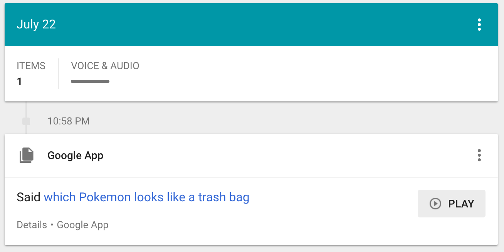

You can access the same thing for Amazon via your _Alexa_ app. Apple unfortunately doesn’t let you access your Siri voice data.

So if you are looking for a start-up idea, I wouldn’t recommend trying to build your own speech recognition system to compete with Google. Instead, figure out a way to get people to give you recordings of themselves talking for hours. The data can be your product instead.

### Where to Learn More

*   The algorithm (roughly) described here to deal with variable-length audio is called Connectionist Temporal Classification or CTC. You can [read the original paper](http://www.cs.toronto.edu/~graves/icml_2006.pdf) from 2006.
*   [Adam Coates](https://cs.stanford.edu/~acoates/) of Baidu gave a great presentation on Deep Learning for Speech Recognition at the Bay Area Deep Learning School. You can [watch the video on YouTube](https://youtu.be/9dXiAecyJrY?t=13874) (his talk starts at 3:51:00). Highly recommended.

* * *

If you liked this article, please consider [**signing up for my Machine Learning is Fun! email list**](http://eepurl.com/b9fg2T). I’ll only email you when I have something new and awesome to share. It’s the best way to find out when I write more articles like this.

You can also follow me on Twitter at [@ageitgey](https://twitter.com/ageitgey), [email me directly](mailto:ageitgey@gmail.com) or [find me on linkedin](https://www.linkedin.com/in/ageitgey). I’d love to hear from you if I can help you or your team with machine learning.

[_Now continue on to Machine Learning is Fun! Part 7_](https://medium.com/@ageitgey/abusing-generative-adversarial-networks-to-make-8-bit-pixel-art-e45d9b96cee7)_!_

*   [Machine Learning](https://medium.com/tag/machine-learning?source=post)
*   [Artificial Intelligence](https://medium.com/tag/artificial-intelligence?source=post)
*   [Speech Recognition](https://medium.com/tag/speech-recognition?source=post)