Machine Learning is Fun Part 7: Abusing Generative Adversarial Networks to Make 8-bit Pixel Art

**_Update:_** _This article is part of a series. Check out the full series:_ [_Part 1_](https://medium.com/@ageitgey/machine-learning-is-fun-80ea3ec3c471)_,_ [_Part 2_](https://medium.com/@ageitgey/machine-learning-is-fun-part-2-a26a10b68df3)_,_ [_Part 3_](https://medium.com/@ageitgey/machine-learning-is-fun-part-3-deep-learning-and-convolutional-neural-networks-f40359318721)_,_ [_Part 4_](https://medium.com/@ageitgey/machine-learning-is-fun-part-4-modern-face-recognition-with-deep-learning-c3cffc121d78)_,_ [_Part 5_](https://medium.com/@ageitgey/machine-learning-is-fun-part-5-language-translation-with-deep-learning-and-the-magic-of-sequences-2ace0acca0aa)_,_ [_Part 6_](https://medium.com/@ageitgey/machine-learning-is-fun-part-6-how-to-do-speech-recognition-with-deep-learning-28293c162f7a)_,_ [_Part 7_](https://medium.com/@ageitgey/abusing-generative-adversarial-networks-to-make-8-bit-pixel-art-e45d9b96cee7) _and_ [_Part 8_](https://medium.com/@ageitgey/machine-learning-is-fun-part-8-how-to-intentionally-trick-neural-networks-b55da32b7196)_! You can also read this article in_ [_Русский_](http://algotravelling.com/ru/%D0%BC%D0%B0%D1%88%D0%B8%D0%BD%D0%BD%D0%BE%D0%B5-%D0%BE%D0%B1%D1%83%D1%87%D0%B5%D0%BD%D0%B8%D0%B5-%D1%8D%D1%82%D0%BE-%D0%B2%D0%B5%D1%81%D0%B5%D0%BB%D0%BE-7/)_,_ [_Tiếng Việt_](https://viblo.asia/p/machine-learning-that-thu-vi-7-tao-kho-anh-va-thiet-ke-tro-choi-co-dien-4dbZNgJ8lYM) _or_ [_한국어_](https://medium.com/@jongdae.lim/%EA%B8%B0%EA%B3%84-%ED%95%99%EC%8A%B5-machine-learning-%EC%9D%80-%EC%A6%90%EA%B2%81%EB%8B%A4-part-7-2435b4a55ccd)_._

**_Giant update:_**  [_I’ve written a new book based on these articles_](https://www.machinelearningisfun.com/get-the-book/)_! It not only expands and updates all my articles, but it has tons of brand new content and lots of hands-on coding projects._ [_Check it out now_](https://www.machinelearningisfun.com/get-the-book/)_!_

Generative models allow a computer to create data — like photos, movies or music — by itself.

A little over a year ago, [Alec Radford](https://twitter.com/alecrad) (building on the work of [Ian Goodfellow](https://twitter.com/goodfellow_ian)) published a paper that changed how everyone thought about building generative models with machine learning. The new system is called Deep Convolutional Generative Adversarial Networks (or DCGANs for short).

DCGANs are able to hallucinate original photo-realistic pictures by using a clever combination of two deep neural networks that compete with each other. All of these pictures of bedrooms were dreamt up by a DCGAN:

Picture from Alec Radford’s original [DCGAN paper](https://arxiv.org/abs/1511.06434)

AI researchers care about generative models because they seem to be a stepping stone towards building AI systems that can consume raw data from the world and automatically build understanding from it.

But let’s use generative models to do something a bit more silly — make artwork for 8-bit video games!

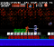

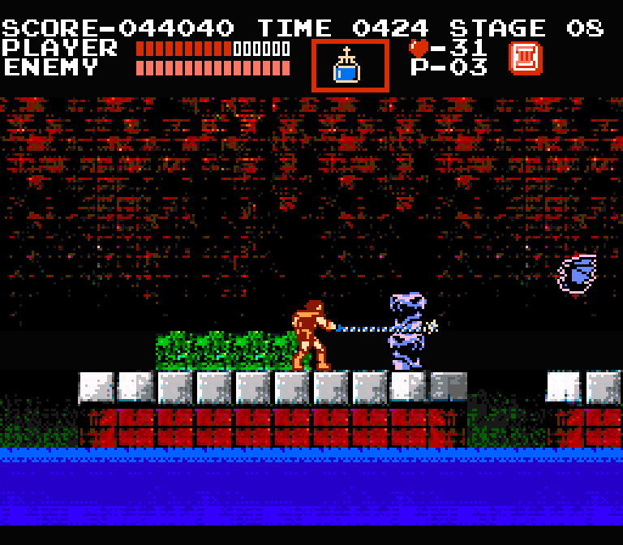

All the art in this game level is machine-generated.

* * *

### The goal of Generative Models

So why exactly are AI researchers building complex systems to generate slightly wonky-looking pictures of bedrooms?

The idea is that if you can generate pictures of something, you must have an understanding of it.

Look at this picture:

A dog. More specifically, my dog.

You instantly know this is a picture of a dog — a furry thing with four legs and a tail. But to a computer, the picture is just a grid of numbers representing the color of each pixel. The computer has no understanding that the picture represents a concept.

But now imagine that we showed a computer thousands of pictures of dogs and after seeing those pictures, the computer was able to generate new pictures of dogs on its own — including different dog breeds and pictures from different angles. Maybe we could even ask it for certain types of pictures, like “a side view of a beagle”.

If the computer was able to do this and the pictures it produced had the right number of legs, tails, and ears, it would prove that the computer knows what parts go into making up a “dog” even though no one told it explicitly. So in a sense, a good generative model is proof of basic understanding — at least on a toddler-level.

That’s why researchers are so excited about building generative models. They seem to be a way to train computers to understand concepts without being explicitly taught the meaning of those concepts. That’s a big step over current systems that can only learn from training data that has been painstakingly pre-labeled by humans.

But if all this research results in programs that generate pictures of dogs, how many years until we get the first computer-generated Dog-A-Day calendar as a side effect?

Yes, the robots are coming for everyone’s jobs. Eventually.

And if you can build a program that understands dogs, why not a program that understands anything else? What about a program that could generate an unlimited number of stock photos of people shaking hands? I’m sure someone would pay for that.

I mean.. sure, that’s a terrible idea for an AI start-up. But I’ve definitely heard _worse_ start-up ideas, so…. maybe?

Ok, maybe a program that generates bad stock photos wouldn’t be that interesting. But given the rate of progress in generative models over just the past year, who knows where we’ll be in 5 or 10 years. What happens if someone invents a system to generate entire movies? Or music? Or video games?

If you look forward 20–30 years and squint, you can already imagine a world where entertainment could be 100% machine generated:

The video game industry is the first area of entertainment to start [seriously experimenting with using AI to generate raw content](https://www.technologyreview.com/s/601258/artificial-intelligence-can-now-design-realistic-video-and-game-imagery/). Aside from the obvious Venn diagram overlap between computer gaming and machine learning engineers, there’s a huge cost incentive to invest in video game development automation given the $300+ million budgets of modern [AAA video games](https://en.wikipedia.org/wiki/AAA_%28video_game_industry%29).

We are still in the earliest days of machine-learning-based generative models and their practical uses are currently pretty narrow, but they are a lot of fun to play around with. Let’s see what we can do with one.

### How DCGANs work

To build a DCGAN, we create two deep neural networks. Then we make them fight against each other, endlessly attempting to out-do one another. In the process, they both become stronger.

Let’s pretend that the first deep neural network is a brand new police officer who is being trained to spot counterfeit money. It’s job is to look at a picture and tell us if the picture contains real money.

Since we are looking for objects in pictures, we can use a standard [Convolutional Neural Network](https://medium.com/@ageitgey/machine-learning-is-fun-part-3-deep-learning-and-convolutional-neural-networks-f40359318721#.ib3p63rx3) for this job. If you aren’t familiar with ConvNets, you can [read my earlier post](https://medium.com/@ageitgey/machine-learning-is-fun-part-3-deep-learning-and-convolutional-neural-networks-f40359318721#.ib3p63rx3). But the basic idea is that the neural network that takes in an image, processes it through several layers that recognize increasingly complex features in the image and then it outputs a single value—in this case, whether or not the image contains a picture of real money.

This first neural network is called the **Discriminator**:

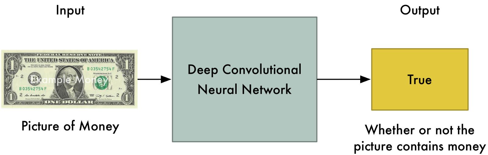

The Discriminator Network

Now let’s pretend the second neural network is a brand new counterfeiter who is just learning how to create fake money. For this second neural network, we’ll reverse the layers in a normal ConvNet so that everything runs backwards. So instead of taking in a picture and outputting a value, it takes in a list of values and outputs a picture.

This second neural network is called the **Generator**:

The Generator Network

So now we have a police officer (the **Discriminator**) looking for fake money and a counterfeiter (the **Generator**) that’s printing fake money. Let’s make them battle!

In the first round, the **Generator** will create pathetic forgeries that barely resemble money at all because it knows absolutely nothing about what money is supposed to look like:

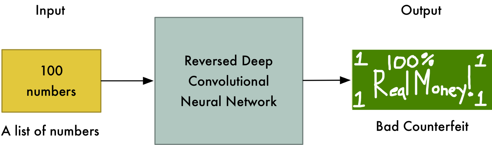

The Generator makes the first (terrible) fake dollar

But right now the **Discriminator** is equally terrible at it’s job of recognizing money, so it won’t know the difference:

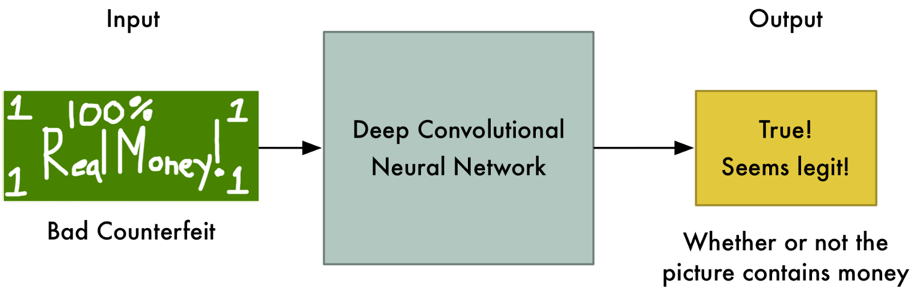

The Discriminator thinks the dollar is real!

At this point, we step in and tell the Discriminator that this dollar bill is actually fake. Then we show it a real dollar bill and ask it how it looks different from the fake one. The Discriminator looks for a new detail to help it separate the real one from the fake one.

For example, the Discriminator might notice that real money has a picture of a person on it and the fake money doesn’t. Using this knowledge, the Discriminator learns how to tell the fake from the real one. It gets a tiny bit better at its job:

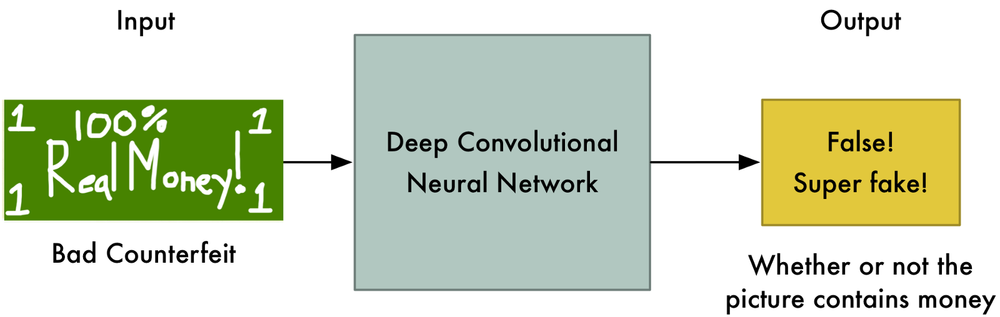

The Discriminator levels up! It now can spot very bad fake dollars.

Now we start Round 2. We tell the Generator that it’s money images are suddenly getting rejected as fake so it needs to step up it’s game. We also tell it that the Discriminator is now looking for faces, so the best way to confuse the Discriminator is to put a face on the bill:

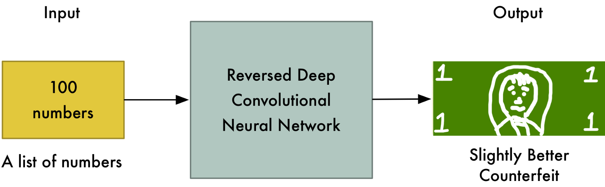

The Generator makes a very slightly better counterfeit dollar

And the fake bills are being accepted as valid again! So now the Discriminator has to look again at the real dollar and find a new way to tell it apart from the fake one.

This back-and-forth game between the Generator and the Discriminator continues thousands of times until both networks are experts. Eventually the Generator is producing near-perfect counterfeits and the Discriminator has turned into a Master Detective looking for the slightest mistakes.

At the point when both networks are sufficiently trained so that humans are impressed by the fake images, we can use the fake images for whatever purpose we want.

### Applying this to Video Games

So now that we know how DCGANs work, let’s see if we can use one to generate new artwork for 1980s-style video games.

Let’s build a DCGAN that tries to produce screenshots of imaginary video games for the Nintendo Entertainment System (or NES) based on screenshots of real games:

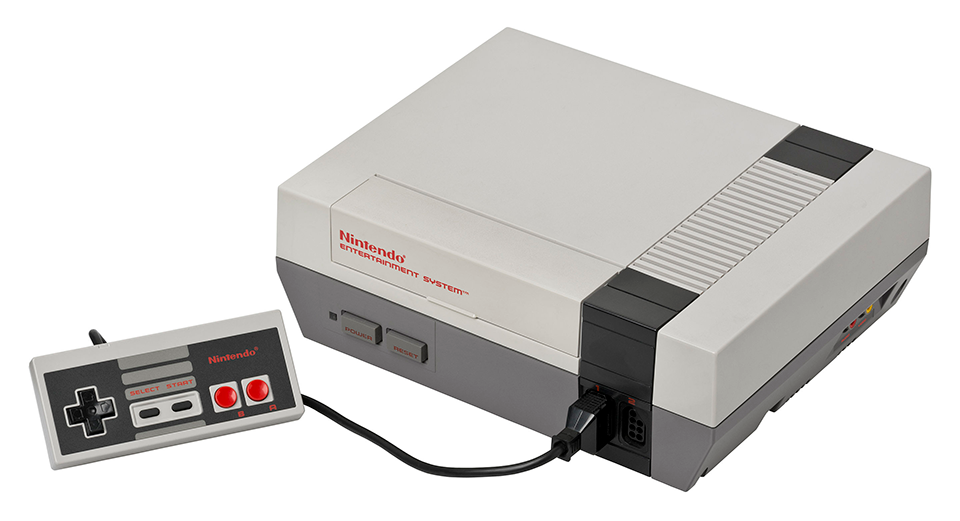

The idea is that if we can generate convincing screenshots of imaginary video games, we could copy and paste bits of art from those screenshots and use it in our own retro-style video game. Since the generated video games never existed, it wouldn’t even be stealing (_Maybe... more on this later_).

Video game art in those days was very simple. Since the NES had such a small amount of memory (the games used way less memory than this article takes up!), programmers had to use lots of tricks to fit the game art into memory. To maximize the limited space, games used tile-based graphics where each screen in the game is made up of just a few (usually 16x16 pixel) repeated graphical tiles.

For example, the starting screen of ‘[The Legend of Zelda](https://en.wikipedia.org/wiki/The_Legend_of_Zelda_%28video_game%29)’ is made up of only 8 unique tiles:

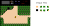

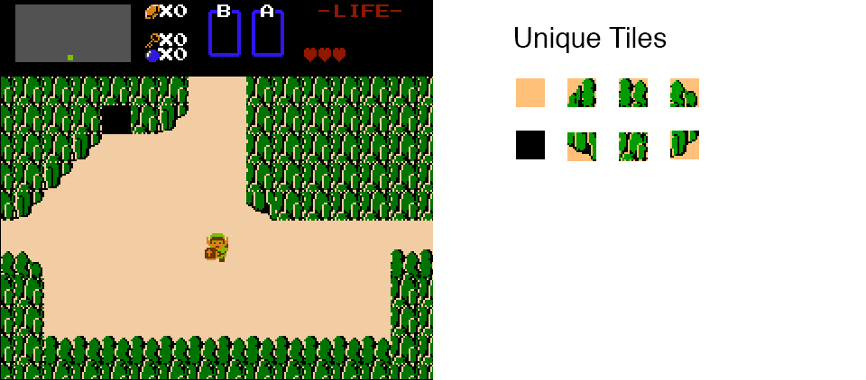

Here are the tiles for entire ‘The Legend of Zelda’ game map:

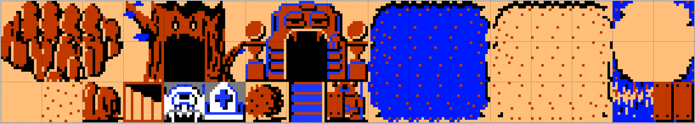

Sometimes they swap the colors around to make the different areas look different, but that’s it.

Our goal is to create a similar tile sheet for our game. Because of that, we don’t really care if the game screenshots we generate look completely realistic. Instead, we’re just looking for the shapes and patterns that we can use as 16 x 16 tiles in our game — things like stones, water, bridges, etc. Then we can use those tiles to build our own 8-bit-style video game levels.

#### Getting Data

To train our system, we need lots of data. Luckily there are [over 700 games](https://en.wikipedia.org/wiki/List_of_Nintendo_Entertainment_System_games) for the NES that we can pull from.

I used [wget](https://www.gnu.org/software/wget/) to download all the NES game screenshots on [The Video Game Museum website](http://www.vgmuseum.com/nes.htm) (sorry for scraping your site!). After a few minutes of downloading, I had a little over 10,000 screenshots of hundreds of NES games:

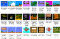

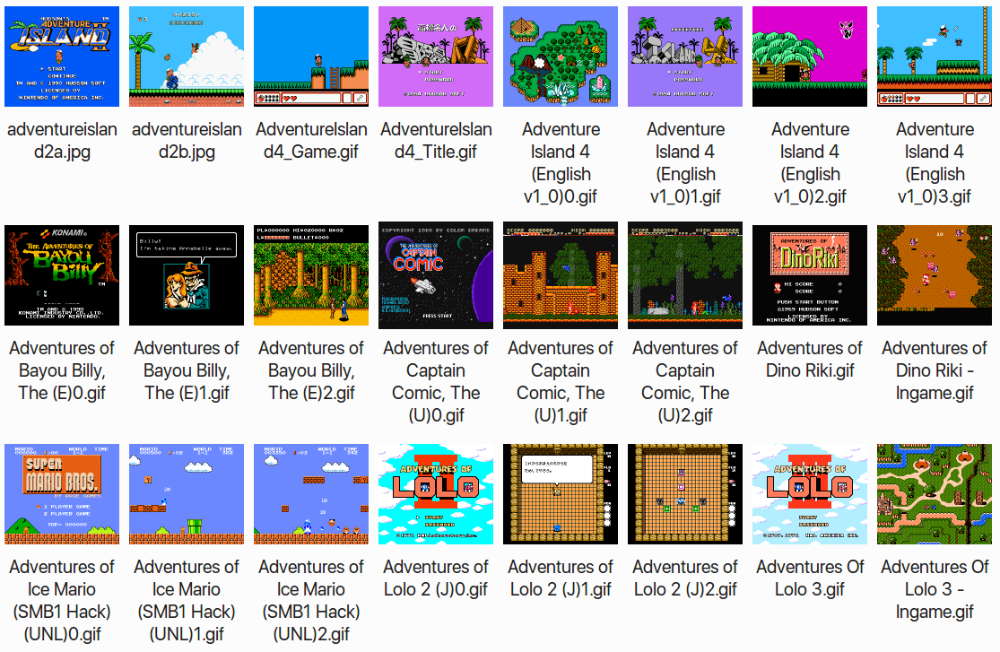

Just a few of the 10,000 screenshots that make up the data set

Right now, DCGANs only work on pretty small images — 256 pixels square or so. But the entire screen resolution of the NES was only 256 pixels by 224 pixels, so that’s not a problem. To make things simple, I cropped each NES screenshot to 224 pixels square.

#### Setting up the DCGAN

There are several open-source implementations of DCGANs on github that you can try out. I used Taehoon Kim’s [Tensorflow implementation](https://github.com/carpedm20/DCGAN-tensorflow). Since DCGANs are unsupervised, all you have to do is put the data in a folder, tweak the basic parameters, start it training and then wait to see what results you get.

Here’s what a sample of the original training data looks like:

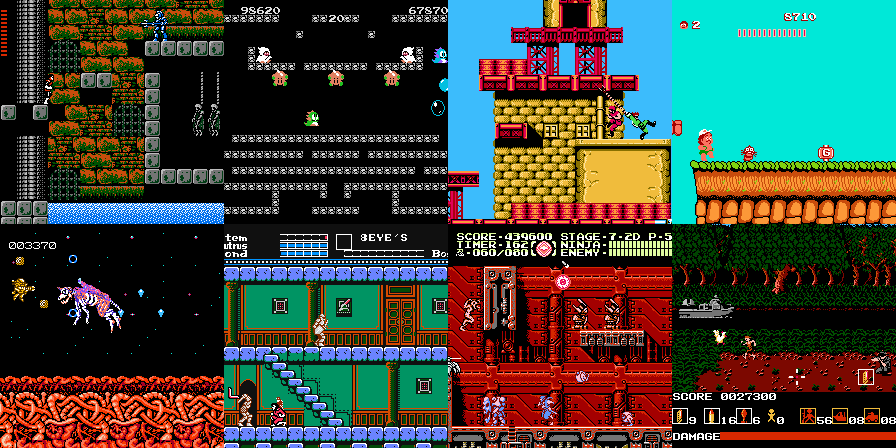

Now training begins. At first, the output from the Generator is pure noise. But it slowly start to take shape as the Generator learns to do a better job:

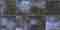

After several more training rounds, the images start to resemble nightmare-ish versions of classic Nintendo games:

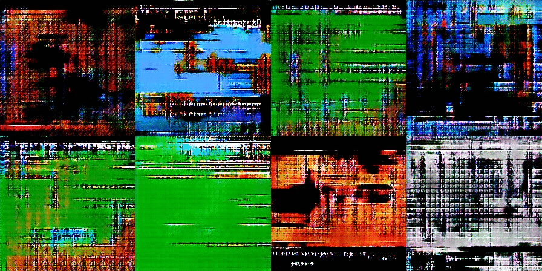

As training continues further, we start to see the bricks and blocks we are hoping to find. You can also see screen elements like life bars and even some text:

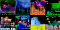

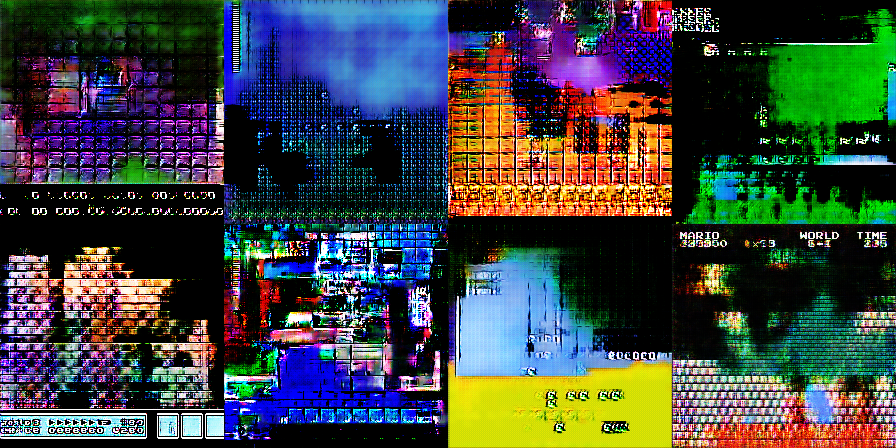

This is where things get complicated. How do we know the computer is creating brand new art and not just regurgitating art directly from the training images? In two of these images, you can clearly see the menu bar from Super Mario Bros. 3 and the header bar and bricks from the original Super Mario Bros.

Regurgitating training data is definitely something that can happen. By using a large training data set and not training too long, we can try to reduce the chance that this happens. But it’s a thorny issue and research on it continues.

Since I’m just going for aesthetics, I tweaked the model until it produced art that looked original to me. But I can’t _prove_ that the new art is totally original except by searching the training data for similar art and verifying that there isn’t any.

With a few hours of training, the generated images contained 16 x 16 tiles that looked nice to me. I was looking for some variations on a basic stone block, brick patterns, water patterns, bushes, and some general “spooky-looking” background atmosphere tiles.

Next I need to pre-process the generated images to the make sure they only used the 64 colors that are available on the NES:

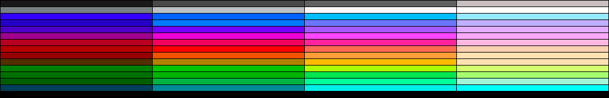

The original Nintendo could only display these 64 colors. Technically there’s only 54 unique colors because some of them are duplicates.

Then I’ll open up the 64-color images in the [Tiled Map Editor](http://www.mapeditor.org/). From there, I can easily grab the 16 x 16 tiles that match the aesthetic I want:

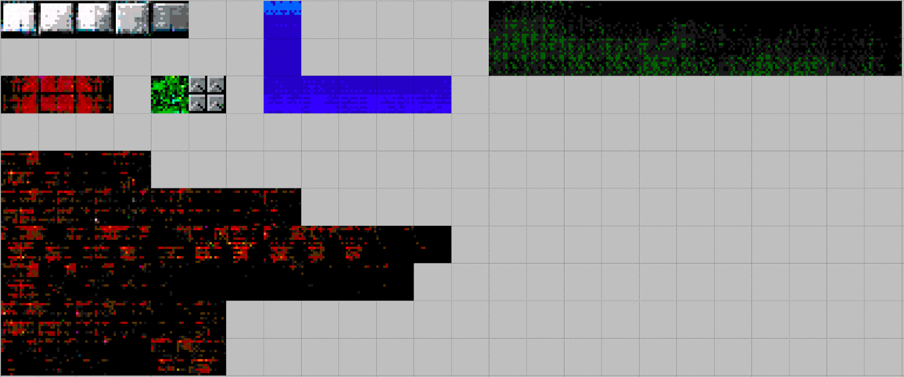

The tiles I grabbed out of the generated screenshots

Then inside of Tiled Map Editor, I’ll arrange those 16 x 16 tiles into a simple level layout reminiscent of the NES game ‘[Castlevania](https://en.wikipedia.org/wiki/Castlevania)’:

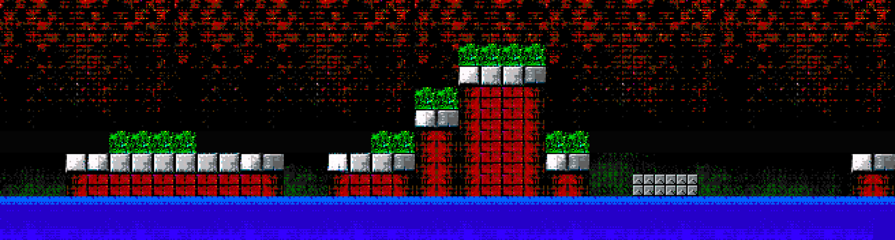

I think that looks pretty good! Keep in mind I didn’t touch a single pixel with an image editor. Every tile came straight out of the DCGAN model.

Next, let’s throw in the main character and some enemies from ‘Castlevania’ so we can see what this level would look like in action:

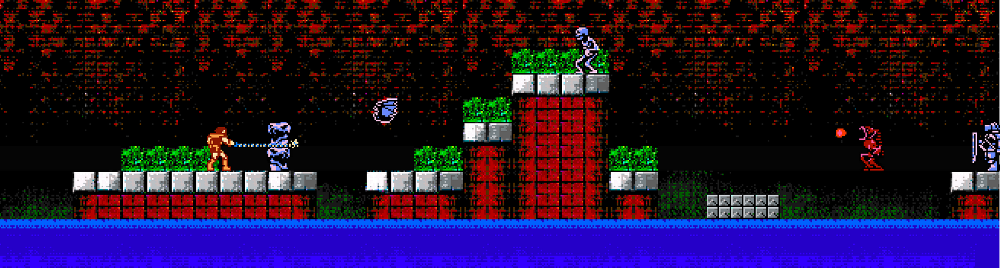

To get the full effect, let’s see what the level would look like inside the game with the menu elements added:

So spooooky

I think that looks like the NES games that I remember! I’m not claiming it’s the best NES art ever created, but it’s certainly not the worst:

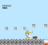

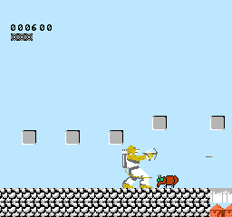

[The Cheetahmen](https://en.wikipedia.org/wiki/The_Cheetahmen) is not a good game.

### Is that it?

I get really excited about generative models like this. The idea of one day cranking out endless artwork with computers is fascinating to me. But when I talk to other people about this stuff, sometimes the response is “Is that it? That’s so basic.”

There’s certainly a lot of hype around generative models right now. GANs are already being called the future of AI despite being notoriously hard to train and limited to generating tiny images. In fact, the very best models can currently only generate postage-stamp-sized pictures of mutant dogs:

A nightmare animal! Photo from [Ian Goodfellow’s GAN Tutorial paper](https://arxiv.org/pdf/1701.00160.pdf)

But a couple of years ago, we couldn’t do anything close to that. We were pretty excited by generated pictures that looked like this:

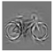

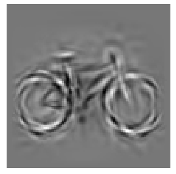

It’s a bicycle! I swear!

And the technology is improving every single day. [Here’s a random paper](https://arxiv.org/pdf/1702.01983v1.pdf) that came out _this week_ that uses GANs to age the faces of people:

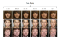

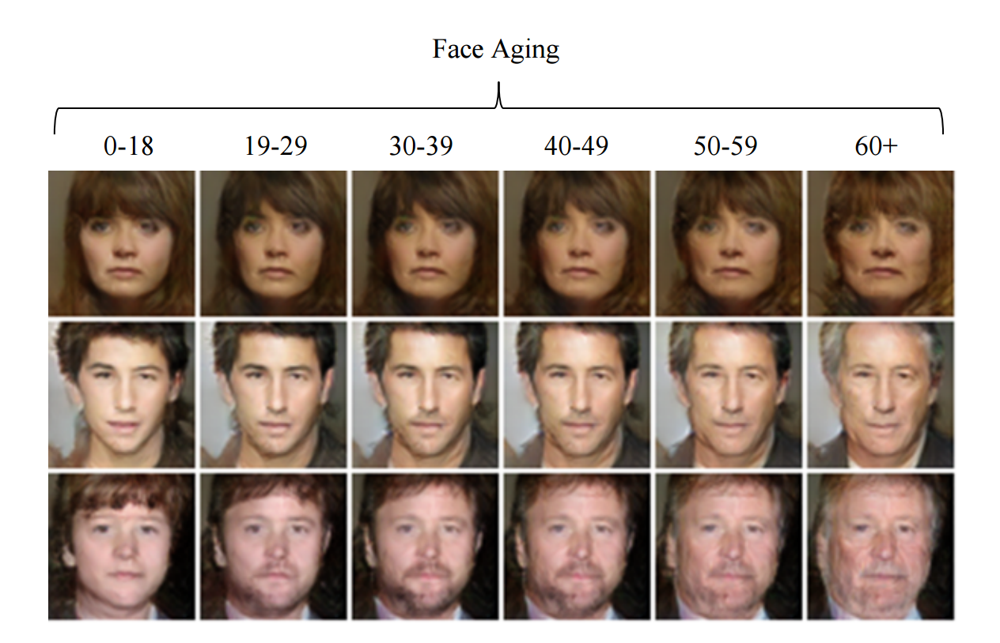

Image from “[Face Aging With Conditional Generative Adversarial Networks](https://arxiv.org/abs/1702.01983v1)”

If things keep improving at this pace, it won’t be too long before generative models are a mainstream tool helping us create. It’s a great time to start experimenting!

### Keep Learning

If you want to learn more in depth about generative models and DCGANs, here are some recommended resources:

*   [Conditional generative adversarial networks for face generation](http://www.foldl.me/2015/conditional-gans-face-generation/) by [Jon Gauthier](http://www.foldl.me/)
*   [Generative Models](https://openai.com/blog/generative-models/) overview from [OpenAI](https://openai.com/about/)
*   [Image Completion with Deep Learning in TensorFlow](https://bamos.github.io/2016/08/09/deep-completion/) by [Brandon Amos](https://bamos.github.io/)
*   See how [Tom White](https://twitter.com/dribnet) uses generative models to make art in his [Neural Facegrid project](http://cargocollective.com/dribnet/facegrid)
*   [Ian Goodfellow’s original paper on GANs](http://arxiv.org/abs/1406.2661) and [his recent tutorial on them](https://arxiv.org/pdf/1701.00160)

* * *

This article is part of my **Machine Learning is Fun** series. You can check out the earlier parts here: [_Part 1_](https://medium.com/@ageitgey/machine-learning-is-fun-80ea3ec3c471)_,_ [_Part 2_](https://medium.com/@ageitgey/machine-learning-is-fun-part-2-a26a10b68df3)_,_ [_Part 3_](https://medium.com/@ageitgey/machine-learning-is-fun-part-3-deep-learning-and-convolutional-neural-networks-f40359318721)_,_ [_Part 4_](https://medium.com/@ageitgey/machine-learning-is-fun-part-4-modern-face-recognition-with-deep-learning-c3cffc121d78)_,_ [_Part 5_](https://medium.com/@ageitgey/machine-learning-is-fun-part-5-language-translation-with-deep-learning-and-the-magic-of-sequences-2ace0acca0aa) _and_ [_Part 6_](https://medium.com/@ageitgey/machine-learning-is-fun-part-6-how-to-do-speech-recognition-with-deep-learning-28293c162f7a)

If you liked this article, please consider [**signing up for my Machine Learning is Fun! email list**](http://eepurl.com/b9fg2T). I’ll only email you when I have something new and awesome to share. It’s the best way to find out when I write more articles like this.

You can also follow me on Twitter at [@ageitgey](https://twitter.com/ageitgey), [email me directly](mailto:ageitgey@gmail.com) or [find me on linkedin](https://www.linkedin.com/in/ageitgey). I’d love to hear from you if I can help you or your team with machine learning.

*   [Artificial Intelligence](https://medium.com/tag/artificial-intelligence?source=post)
*   [Machine Learning](https://medium.com/tag/machine-learning?source=post)
*   [Gaming](https://medium.com/tag/gaming?source=post)