Machine Learning is Fun Part 8: How to Intentionally Trick Neural Networks

_This article is part of a series. Check out the full series:_ [_Part 1_](https://medium.com/@ageitgey/machine-learning-is-fun-80ea3ec3c471)_,_ [_Part 2_](https://medium.com/@ageitgey/machine-learning-is-fun-part-2-a26a10b68df3)_,_ [_Part 3_](https://medium.com/@ageitgey/machine-learning-is-fun-part-3-deep-learning-and-convolutional-neural-networks-f40359318721)_,_ [_Part 4_](https://medium.com/@ageitgey/machine-learning-is-fun-part-4-modern-face-recognition-with-deep-learning-c3cffc121d78)_,_ [_Part 5_](https://medium.com/@ageitgey/machine-learning-is-fun-part-5-language-translation-with-deep-learning-and-the-magic-of-sequences-2ace0acca0aa)_,_ [_Part 6_](https://medium.com/@ageitgey/machine-learning-is-fun-part-6-how-to-do-speech-recognition-with-deep-learning-28293c162f7a)_,_ [_Part 7_](https://medium.com/@ageitgey/abusing-generative-adversarial-networks-to-make-8-bit-pixel-art-e45d9b96cee7) _and_ [_Part 8_](https://medium.com/@ageitgey/machine-learning-is-fun-part-8-how-to-intentionally-trick-neural-networks-b55da32b7196)_! You can also read this article in_ [_Русский_](http://algotravelling.com/ru/%D0%BC%D0%B0%D1%88%D0%B8%D0%BD%D0%BD%D0%BE%D0%B5-%D0%BE%D0%B1%D1%83%D1%87%D0%B5%D0%BD%D0%B8%D0%B5-%D1%8D%D1%82%D0%BE-%D0%B2%D0%B5%D1%81%D0%B5%D0%BB%D0%BE-8/)_,_ [_Tiếng Việt_](https://viblo.asia/p/machine-learning-that-thu-vi-8-danh-lua-he-thong-mang-noron-maGK783LZj2) or [_한국어_](https://medium.com/@jongdae.lim/%EA%B8%B0%EA%B3%84-%ED%95%99%EC%8A%B5-machine-learning-%EB%A8%B8%EC%8B%A0-%EB%9F%AC%EB%8B%9D-%EC%9D%80-%EC%A6%90%EA%B2%81%EB%8B%A4-part-8-d9507cf20352)_._

**_Giant update:_**  [_I’ve written a new book based on these articles_](https://www.machinelearningisfun.com/get-the-book/)_! It not only expands and updates all my articles, but it has tons of brand new content and lots of hands-on coding projects._ [_Check it out now_](https://www.machinelearningisfun.com/get-the-book/)_!_

Almost as long as programmers have been writing computer programs, computer hackers have been figuring out ways to exploit those programs. Malicious hackers take advantage of the tiniest bugs in programs to break into systems, steal data and generally wreak havoc.

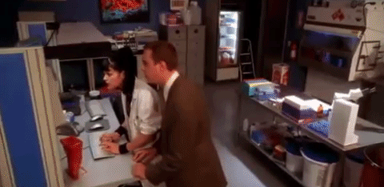

100% Real Hackers™

But systems powered by deep learning algorithms should be safe from human interference, right? How is a hacker going to get past a neural network trained on terabytes of data?

It turns out that even the most advanced deep neural networks can be easily fooled. With a few tricks, you can force them into predicting whatever result you want:

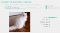

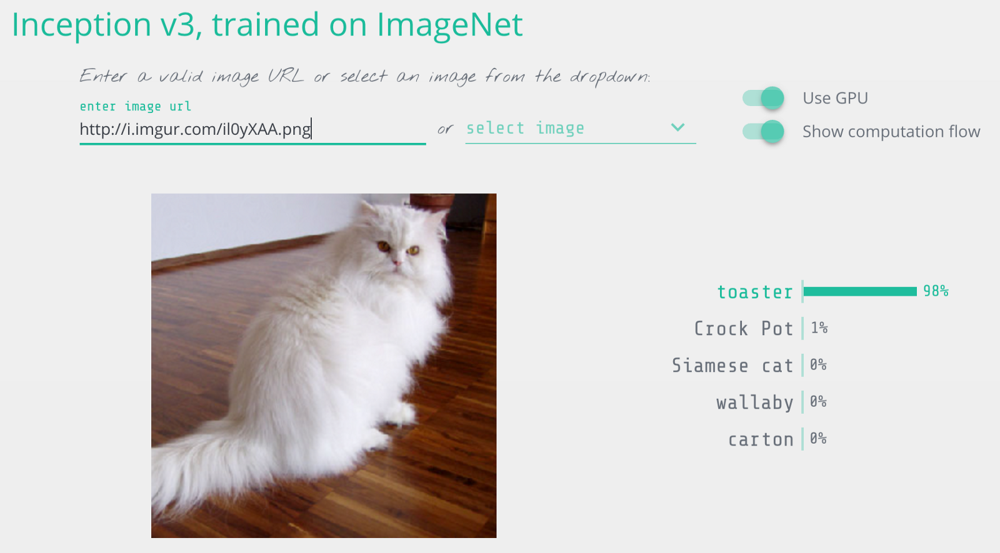

I modified this cat picture so it would be recognized as a toaster.

So before you launch a new system powered by deep neural networks, let’s learn exactly how to break them and what you can do to protect yourself from attackers.

### Neural Nets as Security Guards

Let’s imagine that we run an auction website like Ebay. On our website, we want to prevent people from selling prohibited items — things like live animals.

Enforcing these kinds of rules are hard if you have millions of users. We could hire hundreds of people to review every auction listing by hand, but that would be expensive. Instead, we can use deep learning to automatically check auction photos for prohibited items and flag the ones that violate the rules.

This is a typical image classification problem. To build this, we’ll train a [deep convolutional neural network](https://medium.com/@ageitgey/machine-learning-is-fun-part-3-deep-learning-and-convolutional-neural-networks-f40359318721) to tell prohibited items apart from allowed items and then we’ll run all the photos on our site through it.

First, we need a data set of thousands of images from past auction listings. We need images of both allowed and prohibited items so that we can train the neural network to tell them apart:

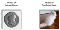

To train then neural network, we use the standard _back-propagation_ algorithm. This is an algorithm were we pass in a training picture, pass in the expected result for that picture, and then walk back through each layer in the neural network adjusting their weights slightly to make them a little better at producing the correct output for that picture:

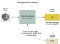

We repeat this thousands of times with thousands of photos until the model reliably produces the correct results with an acceptable accuracy.

The end result is a neural network that can reliably classify images:

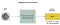

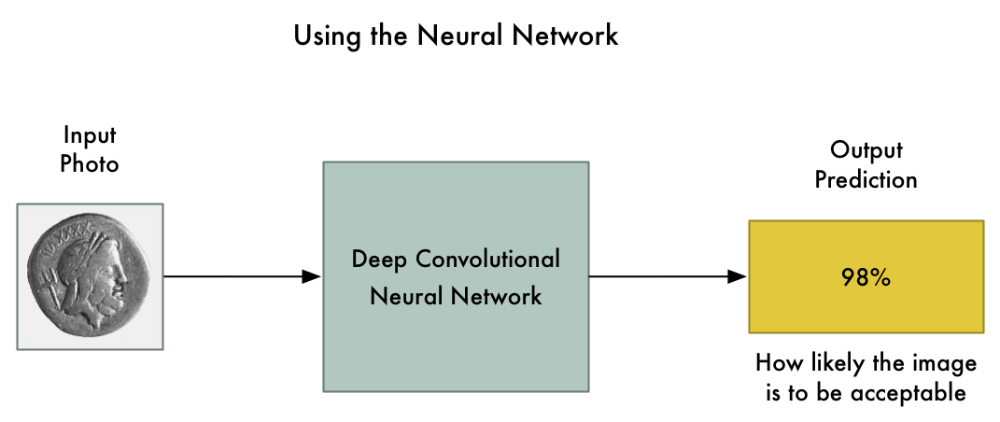

_Note: If you want more detail on how convolution neural networks recognize objects in images,_ [_check out Part 3_](https://medium.com/@ageitgey/machine-learning-is-fun-part-3-deep-learning-and-convolutional-neural-networks-f40359318721)_._

### But things are not as reliable as they seem…

Convolutional neural networks are powerful models that consider the entire image when classifying it. They can recognize complex shapes and patterns no matter where they appear in the image. In many image recognition tasks, they can equal or even beat human performance.

With a fancy model like that, changing a few pixels in the image to be darker or lighter shouldn’t have a big effect on the final prediction, right? Sure, it might change the final likelihood slightly, but it shouldn’t flip an image from “prohibited” to “allowed”.

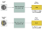

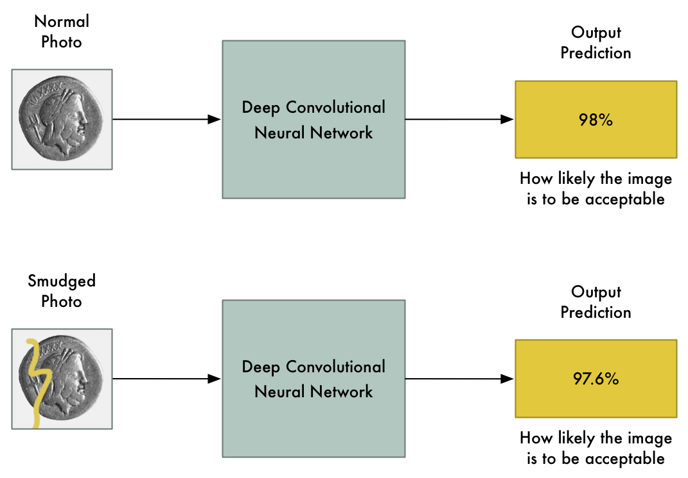

What we expect: Small changes to the input photo should only cause small changes to the final prediction.

But in a famous paper in 2013 called [Intriguing properties of neural networks](https://arxiv.org/abs/1312.6199), it was discovered that this isn’t always true. If you know _exactly which pixels to change_ and _exactly how much to change them_, you can intentionally force the neural network to predict the wrong output for a given picture without changing the appearance of the picture very much.

That means we can intentionally craft a picture that is clearly a prohibited item but which completely fools our neural network:

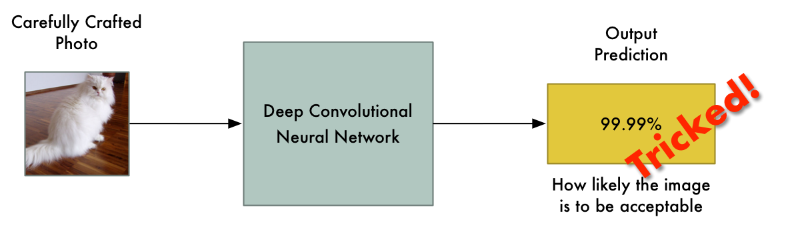

Why is this? A machine learning classifier works by finding a dividing line between the things it’s trying to tell apart. Here’s how that looks on a graph for a simple two-dimensional classifier that’s learned to separate green points (acceptable) from red points (prohibited):

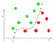

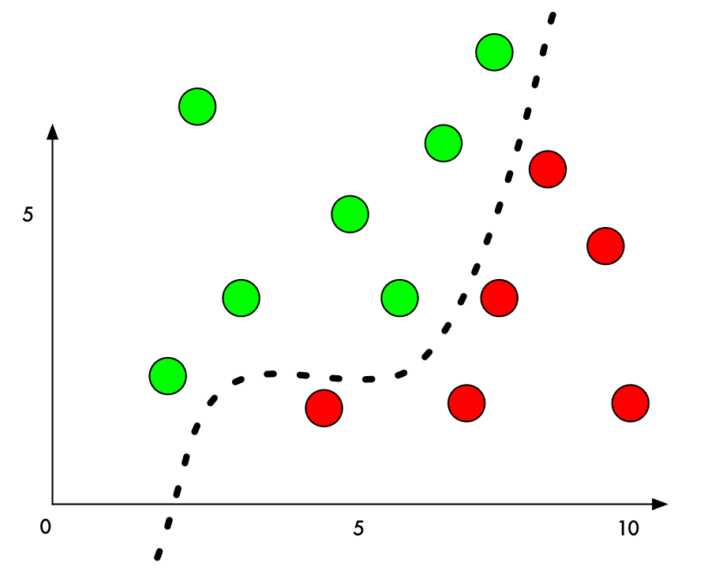

Right now, the classifier works with 100% accuracy. It’s found a line that perfectly separates all the green points from the red points.

But what if we want to trick it into mis-classifying one of the red points as a green point? What’s the minimum amount we could move a red point to push it into green territory?

If we add a small amount to the Y value of a red point right beside the boundary, we can just barely push it over into green territory:

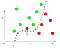

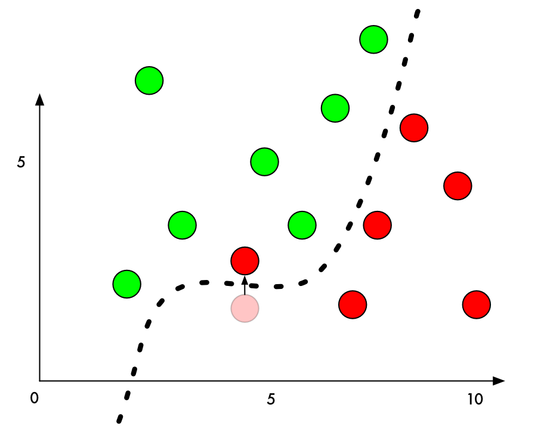

So to trick a classifier, we just need to know which direction to nudge the point to get it over the line. And if we don’t want to be too obvious about being nefarious, ideally we’ll move the point as little as possible so it just looks like an honest mistake.

In image classification with deep neural networks, each “point” we are classifying is an entire image made up of thousands of pixels. That gives us _thousands_ of possible values that we can tweak to push the point over the decision line. And if we make sure that we tweak the pixels in the image in a way that isn’t too obvious to a human, we can fool the classifier without making the image look manipulated.

In other words, we can take a real picture of one object and change the pixels very slightly so that the image completely tricks the neural network into thinking that the picture is something else — and we can control exactly what object it detects instead:

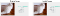

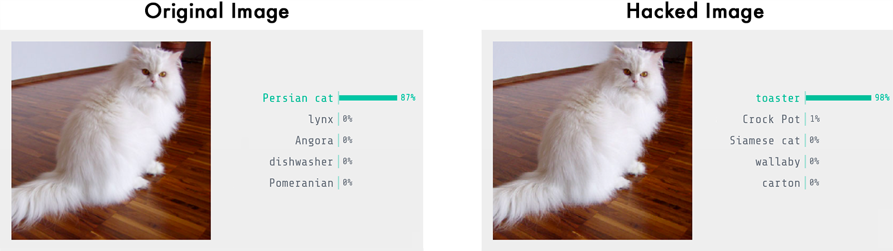

Turning a cat into a toaster. Image detection results from the [Keras.js web-based demo](https://transcranial.github.io/keras-js/#/inception-v3)

### How to Trick a Neural Network

We’ve already talked about the basic process of training a neural network to classify photos:

1.  Feed in a training photo.
2.  Check the neural network’s prediction and see how far off the is from the correct answer.
3.  Tweak the weighs of each layer in the neural network using back-propagation to make the final prediction slightly closer to the correct answer.
4.  Repeat steps 1–3 a few thousand times with a few thousand different training photos.

But what if instead of tweaking the weights of the layers of the neural network, we instead tweaked the input image itself until we get the answer we want?

So let’s take the already-trained neural network and “train” it again. But let’s use back-propagation to adjust the **_input image_** instead of the neural network layers:

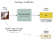

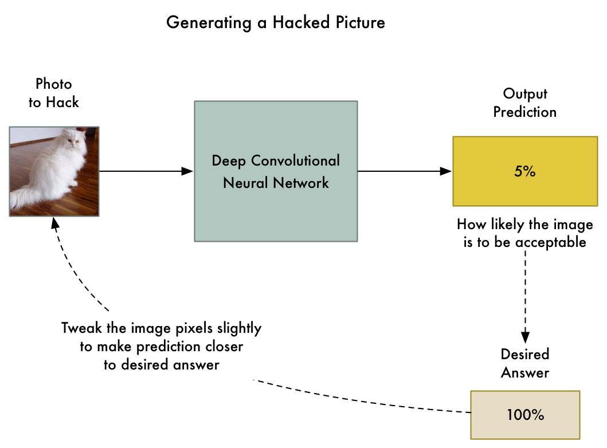

So here’s the new algorithm:

1.  Feed in the photo that we want to hack.
2.  Check the neural network’s prediction and see how far off the is from the **_answer we want to get_** for this photo.
3.  Tweak our photo using back-propagation to make the final prediction slightly closer to the answer we want to get.
4.  Repeat steps 1–3 a few thousand times with **_the same photo_**  until the network gives us the answer we want_._

At end of this, we’ll have an image that fools the neural network without changing anything inside the neural network itself.

The only problem is that by allowing any single pixel to be adjusted without any limitations, the changes to the image can be drastic enough that you’ll see them. They’ll show up as discolored spots or wavy areas:

A hacked image with no constraints on how much a pixel can be tweaked. You can see green discolored spots around the cat and wavy patterns in the white wall.

To prevent these obvious distortions, we can add a simple constraint to our algorithm. We’ll say that no single pixel in the hacked image can ever be changed by more than a tiny amount from the original image — let’s say something like 0.01%. That forces our algorithm to tweak the image in a way that still fools the neural network without it looking too different from the original image.

Here’s what the generated image looks like when we add that constraint:

A hacked image generated with a limit placed on how much any single pixel can be changed.

Even though that image looks the same to us, it still fools the neural network!

### Let’s Code It

To code this, first we need a pre-trained neural network to fool. Instead of training one from scratch, let’s use one created by Google.

[Keras](https://keras.io/), the popular deep learning framework, comes with several [pre-trained neural networks](https://keras.io/applications/). We’ll use its copy of Google’s Inception v3 deep neural network that was pre-trained to detect [1000 different kinds of objects](https://gist.github.com/ageitgey/4e1342c10a71981d0b491e1b8227328b).

Here’s the basic code in Keras to recognize what’s in a picture using this neural network. Just make sure you have [Python 3](https://www.python.org/downloads/) and [Keras](https://keras.io/#installation) installed before you run it:

When we run it, it properly detects our image as a Persian cat:

$ python3 predict.py

This is a Persian_cat with 85.7% confidence!

Now let’s trick it into thinking that this cat is a toaster by tweaking the image until it fools the neural network.

Keras doesn’t have a built-in way to train against the input image instead of training the neural network layers, so I had to get a little tricky and code the training step manually.

Here’s the code:

If we run this, it will eventually spit out an image that will fool the neural network:

$ python3 generated\_hacked\_image.py

Model's predicted likelihood that the image is a toaster: 0.00072%

\[ .... a few thousand lines of training .... \]

Model's predicted likelihood that the image is a toaster: 99.4212%

_Note: If you don’t have a GPU, this might take a few hours to run. If you do have a GPU properly configured with Keras and_ [_CUDA_](https://developer.nvidia.com/cuda-downloads)_, it shouldn’t take more than a couple of minutes to run._

Now let’s test the hacked image that we just made by running it through the original model again:

$ python3 predict.py

This is a toaster with 98.09% confidence!

We did it! We tricked the neural network into thinking that a cat is a toaster!

### What can we do with a Hacked Image?

Created a hacked image like this is called “generating an adversarial example”. We’re intentionally crafting a piece of data so that a machine-learning model will misclassify it. It’s a neat trick, but why does this matter in the real world?

Research has show that these hacked images have some surprising properties:

1.  Hacked images can still fool neural networks [even when they are printed out on paper](https://www.youtube.com/watch?v=zQ_uMenoBCk)! So you can use these hacked images to fool physical cameras or scanners, not just systems where upload an image file directly.
2.  Images that fool one neural network tend to fool other neural networks with entirely different designs if they were trained on similar data.

So we can potentially do a lot with these hacked images!

But there is still a big limitation with how we create these images — our attack requires direct access to the neural network itself. Because we are actually “training” against the neural network to fool it, we need a copy of it. In the real world, no company is going to let you download their trained neural network’s code, so that means we can’t attack them… Right?

Nope! Researchers have recently shown that you can [train your own substitute neural network to mirror another neural network](https://arxiv.org/abs/1602.02697) by probing it to see how it behaves. Then you can use your substitute neural network to generate hacked images that still often fool the original network! This is called a _black-box attack_.

The applications of black-box attacks are limitless. Here are some plausible examples:

*   Trick self-driving cars into seeing a stop sign as a green light — this could cause car crashes!
*   Trick content filtering systems into letting offensive/illegal content through.
*   Trick ATM check scanners into thinking the handwriting on a check says the check is for a greater amount then it actually is (with plausible deniability if you get caught!)

And these attack methodology isn’t limited to just images. You can use the same kind of approach to fool classifiers that work on other types of data. For example, you could trick virus scanners into recognizing your virus as safe code!

### How can we protect ourselves against these attacks?

So now that we know it’s possible to trick neural networks _(and all other machine learning models too)_, how do we defend against this?

The short answer is that no one is _entirely_ sure yet. Preventing these kinds of attacks is still an on-going area of research. The best way to keep up with the latest developments is by reading the [cleverhans blog](http://www.cleverhans.io/) maintained by Ian Goodfellow and Nicolas Papernot, two of the most influential researchers in this area.

But there are some things we do know so far:

*   If you simply create lots of hacked images and include them in your training data set going forward, that seems to make your neural network more resistant to these attacks. This is called Adversarial Training and is probably the most reasonable defense to consider adopting right now.
*   There is another somewhat effective approach called [Defensive Distillation](https://arxiv.org/abs/1511.04508) where you train a second model to mimic your original model. But this approach is new and rather complicated, so I wouldn’t invest in this yet unless you have specialized needs.
*   Pretty much every other idea researchers have tried so far has failed to be helpful in preventing these attacks.

Since we don’t have any final answers yet, its worth thinking about the scenarios where you are using neural networks so that you can at least lessen the risk that this kind of attack would cause damage your business.

For example, if you have a single machine learning model as the only line of defense to grant access to a restricted resource and assume it can’t be fooled, that’s probably a bad idea. But if you use machine learning as a step in a process where there is still human verification, that’s probably fine.

In other words, treat machine learning models in your architecture like any other component that can potentially be bypassed. Think through the implications of what would happen if a user intentionally sets out to fool them and think of ways to mitigate those scenarios.

### Learning More

Want to learn more about Adversarial Examples and protecting against them?

*   This area of research is only a few years old, so it’s easy to get caught up by reading a few key papers: [Intriguing properties of neural networks](https://arxiv.org/abs/1312.6199), [Explaining and Harnessing Adversarial Examples](https://arxiv.org/abs/1412.6572), [Practical Black-Box Attacks against Machine Learning](https://arxiv.org/abs/1602.02697) and [Adversarial examples in the physical world](https://arxiv.org/abs/1607.02533).
*   Follow Ian Goodfellow and Nicolas Papernot’s [cleverhans blog](http://www.cleverhans.io/) to keep up with the latest research.
*   Check out the [on-going Kaggle competition](https://www.kaggle.com/c/nips-2017-non-targeted-adversarial-attack) that’s challenging researchers to come up with new ways to defend against these attacks.

* * *

If you liked this article, please consider [**signing up for my Machine Learning is Fun! email list**](http://eepurl.com/b9fg2T). I’ll only email you when I have something new and awesome to share. It’s the best way to find out when I write more articles like this.

You can also follow me on Twitter at [@ageitgey](https://twitter.com/ageitgey), [email me directly](mailto:ageitgey@gmail.com) or [find me on linkedin](https://www.linkedin.com/in/ageitgey). I’d love to hear from you if I can help you or your team with machine learning.

*   [Machine Learning](https://medium.com/tag/machine-learning?source=post)
*   [Hacking](https://medium.com/tag/hacking?source=post)
*   [Neural Networks](https://medium.com/tag/neural-networks?source=post)