Machine Learning is Fun! Part 2 – Adam Geitgey – Medium

**_Update:_** _This article is part of a series. Check out the full series:_ [_Part 1_](https://medium.com/@ageitgey/machine-learning-is-fun-80ea3ec3c471)_,_ [_Part 2_](https://medium.com/@ageitgey/machine-learning-is-fun-part-2-a26a10b68df3)_,_ [_Part 3_](https://medium.com/@ageitgey/machine-learning-is-fun-part-3-deep-learning-and-convolutional-neural-networks-f40359318721)_,_ [_Part 4_](https://medium.com/@ageitgey/machine-learning-is-fun-part-4-modern-face-recognition-with-deep-learning-c3cffc121d78)_,_ [_Part 5_](https://medium.com/@ageitgey/machine-learning-is-fun-part-5-language-translation-with-deep-learning-and-the-magic-of-sequences-2ace0acca0aa)_,_ [_Part 6_](https://medium.com/@ageitgey/machine-learning-is-fun-part-6-how-to-do-speech-recognition-with-deep-learning-28293c162f7a)_,_ [_Part 7_](https://medium.com/@ageitgey/abusing-generative-adversarial-networks-to-make-8-bit-pixel-art-e45d9b96cee7) _and_ [_Part 8_](https://medium.com/@ageitgey/machine-learning-is-fun-part-8-how-to-intentionally-trick-neural-networks-b55da32b7196)_!_ You can also read this article in [_Italiano_](https://medium.com/botsupply/il-machine-learning-è-divertente-parte-2-dec556e4855d)_,_ [_Español_](https://medium.com/@lfcj/machine-learning-es-divertido-parte-2-b12f488675c5)_,_ [_Français_](https://medium.com/@alexis.anzieu/samuser-avec-le-machine-learning-part2-41974ee1f586)_,_ [_Türkçe_](https://medium.com/@atakanyenel/makine-%C3%B6%C4%9Frenimi-e%C4%9Flencelidir-2-k%C4%B1s%C4%B1m-6b464cbdf40c)_,_ [_Русский_](http://algotravelling.com/ru/%D0%BC%D0%B0%D1%88%D0%B8%D0%BD%D0%BD%D0%BE%D0%B5-%D0%BE%D0%B1%D1%83%D1%87%D0%B5%D0%BD%D0%B8%D0%B5-%D1%8D%D1%82%D0%BE-%D0%B2%D0%B5%D1%81%D0%B5%D0%BB%D0%BE-2/)_,_ [_한국어_](https://medium.com/@jongdae.lim/%EA%B8%B0%EA%B3%84-%ED%95%99%EC%8A%B5-machine-learning-%EC%9D%80-%EC%A6%90%EA%B2%81%EB%8B%A4-part-2-b35f3d327761) [_Português_](https://medium.com/machina-sapiens/aprendizagem-de-m%C3%A1quina-%C3%A9-divertido-parte-2-7c00d034e1d5)_,_ [فارسی](https://zerotohero.ir/article/machine-learning/%DB%8C%D8%A7%D8%AF%DA%AF%DB%8C%D8%B1%DB%8C-%D9%85%D8%A7%D8%B4%DB%8C%D9%86-%D8%A8%D9%87-%D8%B2%D8%A8%D8%A7%D9%86-%D8%B3%D8%A7%D8%AF%D9%87-%D8%A8%D8%AE%D8%B4-%D8%AF%D9%88%D9%85), [_Tiếng Việt_](https://viblo.asia/p/machine-learning-that-thu-vi-2-tao-sach-van-hoc-va-game-mario-WAyK81o9ZxX) _or_ [_普通话_](https://zhuanlan.zhihu.com/p/24344720)_._

**_Giant update:_**  [_I’ve written a new book based on these articles_](https://www.machinelearningisfun.com/get-the-book/)_! It not only expands and updates all my articles, but it has tons of brand new content and lots of hands-on coding projects._ [_Check it out now_](https://www.machinelearningisfun.com/get-the-book/)_!_

In [Part 1](https://medium.com/@ageitgey/machine-learning-is-fun-80ea3ec3c471), we said that Machine Learning is using generic algorithms to tell you something interesting about your data without writing any code specific to the problem you are solving. (If you haven’t already read [part 1](https://medium.com/@ageitgey/machine-learning-is-fun-80ea3ec3c471), read it now!).

This time, we are going to see one of these generic algorithms do something really cool_ — _create video game levels that look like they were made by humans. We’ll build a neural network, feed it existing Super Mario levels and watch new ones pop out!

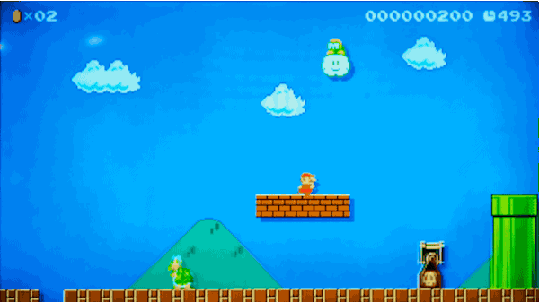

[One of the levels our algorithm will generate](https://supermariomakerbookmark.nintendo.net/courses/4AC9-0000-0157-F3C3)

Just like [Part 1](https://medium.com/@ageitgey/machine-learning-is-fun-80ea3ec3c471), this guide is for anyone who is curious about machine learning but has no idea where to start. The goal is be accessible to anyone — which means that there’s a lot of generalizations and we skip lots of details. But who cares? If this gets anyone more interested in ML, then mission accomplished.

* * *

### Making Smarter Guesses

Back in [Part 1](https://medium.com/@ageitgey/machine-learning-is-fun-80ea3ec3c471), we created a simple algorithm that estimated the value of a house based on its attributes. Given data about a house like this:

We ended up with this simple estimation function:

def estimate\_house\_sales\_price(num\_of_bedrooms, sqft, neighborhood):  
 price = 0

\# a little pinch of this  
 price += num\_of\_bedrooms * **0.123**

\# and a big pinch of that  
 price += sqft * **0.41**

\# maybe a handful of this  
 price += neighborhood * **0.57**

return price

In other words, we estimated the value of the house by multiplying each of its attributes by a **weight**. Then we just added those numbers up to get the house’s value.

Instead of using code, let’s represent that same function as a simple diagram:

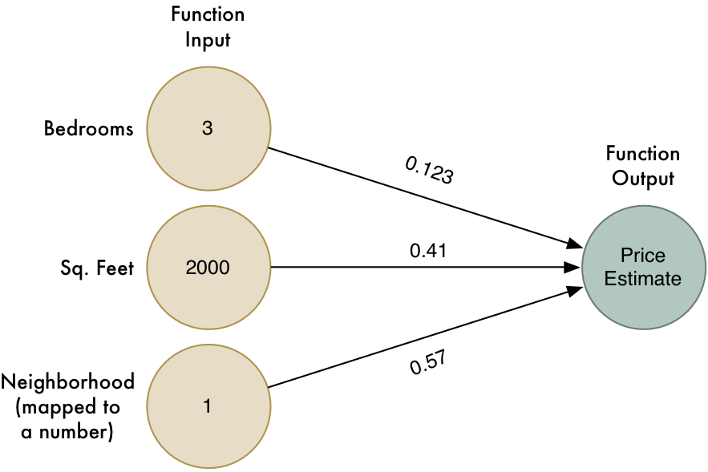

The arrows represent the weights in our function.

However this algorithm only works for simple problems where the result has a _linear_ relationship with the input. What if the truth behind house prices isn’t so simple? For example, maybe the neighborhood matters a lot for big houses and small houses but doesn’t matter at all for medium-sized houses. How could we capture that kind of complicated detail in our model?

To be more clever, we could run this algorithm multiple times with different of weights that each capture different edge cases:

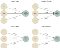

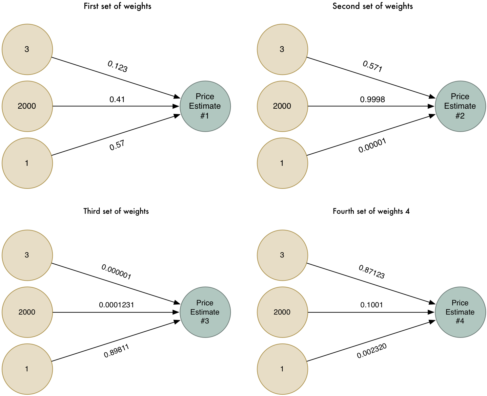

Let’s try solving the problem four different ways

Now we have four different price estimates. Let’s combine those four price estimates into one final estimate. We’ll run them through the same algorithm again (but using another set of weights)!

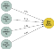

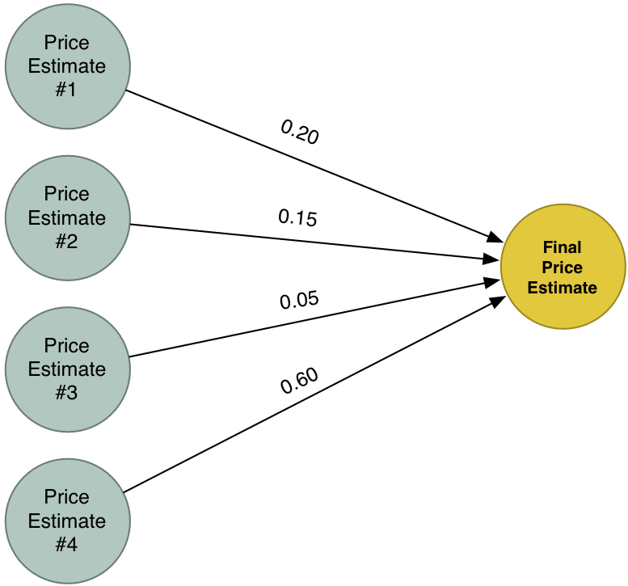

Our new _Super Answer_ combines the estimates from our four different attempts to solve the problem. Because of this, it can model more cases than we could capture in one simple model.

### What is a Neural Network?

Let’s combine our four attempts to guess into one big diagram:

This is a neural network! Each node knows how to take in a set of inputs, apply weights to them, and calculate an output value. By chaining together lots of these nodes, we can model complex functions.

There’s a lot that I’m skipping over to keep this brief (including [feature scaling](https://en.wikipedia.org/wiki/Feature_scaling) and the [activation function](https://en.wikipedia.org/wiki/Activation_function)), but the most important part is that these basic ideas _click:_

*   We made a simple estimation function that takes in a set of inputs and multiplies them by weights to get an output. Call this simple function a **_neuron_**.
*   By chaining lots of simple **_neurons_** together, we can model functions that are too complicated to be modeled by one single neuron.

It’s just like LEGO! We can’t model much with one single LEGO block, but we can model anything if we have enough basic LEGO blocks to stick together:

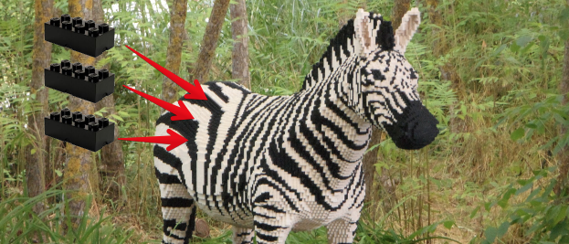

A grim preview of our plastic animal future? Only time can tell…

### Giving our Neural Network a Memory

The neural network we’ve seen always returns the same answer when you give it the same inputs. It has no memory. In programming terms, it’s a [_stateless algorithm_](https://en.wikipedia.org/wiki/State_%28computer_science%29).

In many cases (like estimating the price of house), that’s exactly what you want. But the one thing this kind of model can’t do is respond to patterns in data over time.

Imagine I handed you a keyboard and asked you to write a story. But before you start, my job is to guess the very first letter that you will type. What letter should I guess?

I can use my knowledge of English to increase my odds of guessing the right letter. For example, you will probably type a letter that is common at the beginning of words. If I looked at stories you wrote in the past, I could narrow it down further based on the words you usually use at the beginning of your stories. Once I had all that data, I could use it to build a neural network to model how likely it is that you would start with any given letter.

Our model might look like this:

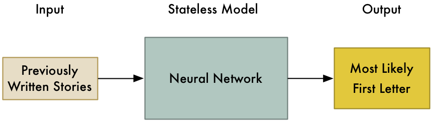

But let’s make the problem harder. Let’s say I need to guess the _next_ letter you are going to type at any point in your story. This is a much more interesting problem.

Let’s use the first few words of Ernest Hemingway’s [_The Sun Also Rises_](https://en.wikipedia.org/wiki/The_Sun_Also_Rises) as an example:

> Robert Cohn was once middleweight boxi

What letter is going to come next?

You probably guessed ’n’ — the word is probably going to be _boxing_. We know this based on the letters we’ve already seen in the sentence and our knowledge of common words in English. Also, the word ‘middleweight’ gives us an extra clue that we are talking about boxing.

In other words, it’s easy to guess the next letter if we take into account the sequence of letters that came right before it and combine that with our knowledge of the rules of English.

To solve this problem with a neural network, we need to add _state_ to our model. Each time we ask our neural network for an answer, we also save a set of our intermediate calculations and re-use them the next time as part of our input. That way, our model will adjust its predictions based on the input that it has seen recently.

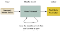

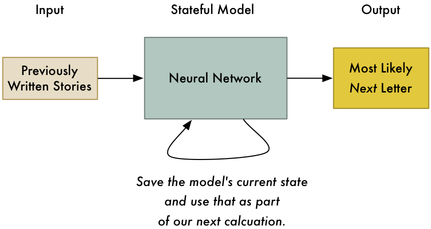

Keeping track of state in our model makes it possible to not just predict the most likely _first_ letter in the story, but to predict the most likely _next_ letter given all previous letters.

This is the basic idea of a _Recurrent_ Neural Network. We are updating the network each time we use it. This allows it to update its predictions based on what it saw most recently. It can even model patterns over time as long as we give it enough of a memory.

### What’s a single letter good for?

Predicting the next letter in a story might seem pretty useless. What’s the point?

One cool use might be auto-predict for a mobile phone keyboard:

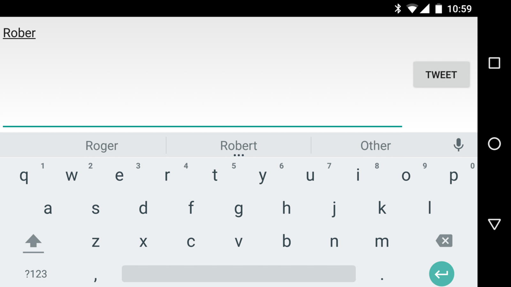

The next most likely letter is “t”.

But what if we took this idea to the extreme? What if we asked the model to predict the next most likely character over and over — forever? We’d be asking it to write a complete story for us!

### Generating a story

We saw how we could guess the next letter in Hemingway’s sentence. Let’s try generating a whole story in the style of Hemingway.

To do this, we are going to use the [Recurrent Neural Network implementation](https://github.com/karpathy/char-rnn) that [Andrej Karpathy](http://karpathy.github.io/about/) wrote. Andrej is a Deep-Learning researcher at Stanford and he wrote [an excellent introduction to generating text with RNNs](http://karpathy.github.io/2015/05/21/rnn-effectiveness/), You can view all the [code for the model on github](https://github.com/karpathy/char-rnn).

We’ll create our model from the complete text of _The Sun Also Rises —_ 362,239 characters using 84 unique letters (including punctuation, uppercase/lowercase, etc). This data set is actually really small compared to typical real-world applications. To generate a really good model of Hemingway’s style, it would be much better to have at several times as much sample text. But this is good enough to play around with as an example.

As we just start to train the RNN, it’s not very good at predicting letters. Here’s what it generates after a 100 loops of training:

> hjCTCnhoofeoxelif edElobe negnk e iohehasenoldndAmdaI ayio pe e h’e btentmuhgehi bcgdltt. gey heho grpiahe.  
> Ddelnss.eelaishaner” cot AAfhB ht ltny  
> ehbih a”on bhnte ectrsnae abeahngy  
> amo k ns aeo?cdse nh a taei.rairrhelardr er deffijha

You can see that it has figured out that sometimes words have spaces between them, but that’s about it.

After about 1000 iterations, things are looking more promising:

> hing soor ither. And the caraos, and the crowebel for figttier and ale the room of me? Streat was not to him Bill-stook of the momansbed mig out ust on the bull, out here. I been soms  
> inick stalling that aid.  
>  “Hon’t me and acrained on .Hw’s don’t you for the roed,” In’s pair.”  
>  “Alough marith him.”

The model has started to identify the patterns in basic sentence structure. It’s adding periods at the ends of sentences and even quoting dialog. A few words are recognizable, but there’s also still a lot of nonsense.

But after several thousand more training iterations, it looks pretty good:

> He went over to the gate of the café. It was like a country bed.  
>  “Do you know it’s been me.”  
>  “Damned us,” Bill said.  
>  “I was dangerous,” I said. “You were she did it and think I would a fine cape you,” I said.  
>  “I can’t look strange in the cab.”  
>  “You know I was this is though,” Brett said.  
>  “It’s a fights no matter?”  
>  “It makes to do it.”  
>  “You make it?”  
>  “Sit down,” I said. “I wish I wasn’t do a little with the man.”  
>  “You found it.”  
>  “I don’t know.”  
>  “You see, I’m sorry of chatches,” Bill said. “You think it’s a friend off back and make you really drunk.”

At this point, the algorithm has captured the basic pattern of Hemingway’s short, direct dialog. A few sentences even sort of make sense.

Compare that with some real text from the book:

> There were a few people inside at the bar, and outside, alone, sat Harvey Stone. He had a pile of saucers in front of him, and he needed a shave.  
>  “Sit down,” said Harvey, “I’ve been looking for you.”  
>  “What’s the matter?”  
>  “Nothing. Just looking for you.”  
>  “Been out to the races?”  
>  “No. Not since Sunday.”  
>  “What do you hear from the States?”  
>  “Nothing. Absolutely nothing.”  
>  “What’s the matter?”

Even by only looking for patterns _one character at a time_, our algorithm has reproduced plausible-looking prose with proper formatting. That is kind of amazing!

We don’t have to generate text completely from scratch, either. We can seed the algorithm by supplying the first few letters and just let it find the next few letters.

For fun, let’s make a fake book cover for our imaginary book by generating a new author name and a new title using the seed text of “Er”, “He”, and “The S”:

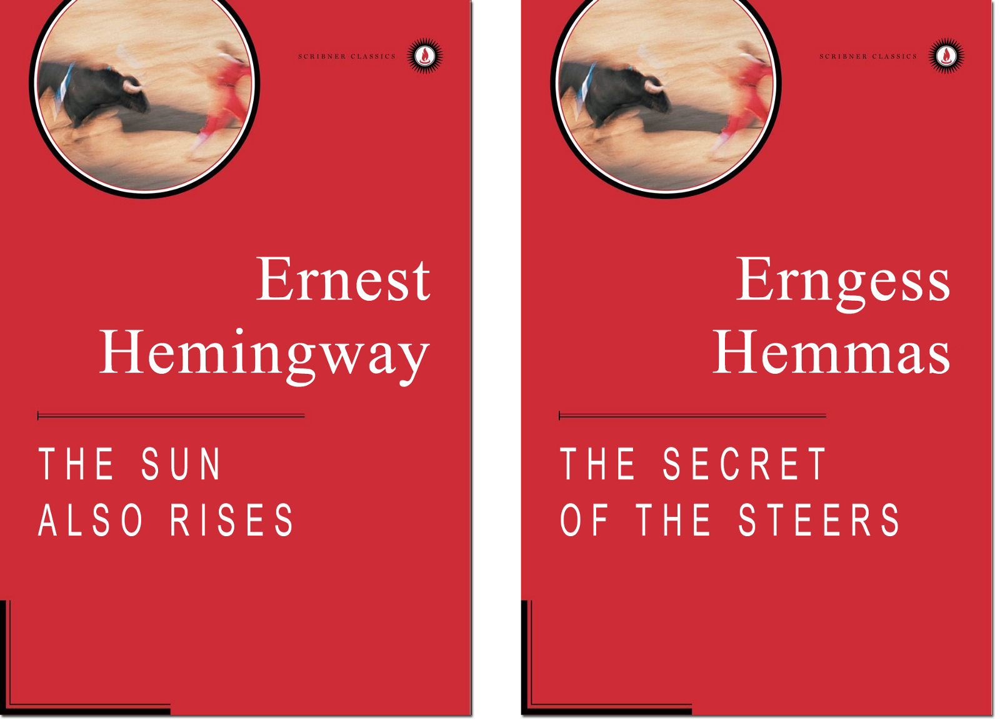

The real book is on the left and our silly computer-generated nonsense book is on the right.

Not bad!

But the **really mind-blowing part** is that this algorithm can figure out patterns in any sequence of data. It can easily generate real-looking [recipes](https://gist.github.com/nylki/1efbaa36635956d35bcc) or [fake Obama speeches](https://medium.com/@samim/obama-rnn-machine-generated-political-speeches-c8abd18a2ea0#.b4clxzrgf). But why limit ourselves human language? We can apply this same idea to any kind of sequential data that has a pattern.

### Making Mario without actually Making Mario

In 2015, Nintendo released [Super Mario Maker™](http://supermariomaker.nintendo.com/) for the Wii U gaming system.

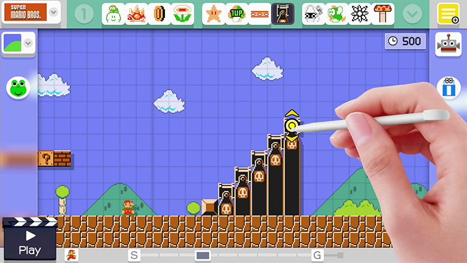

Every kid’s dream!

This game lets you draw out your own Super Mario Brothers levels on the gamepad and then upload them to the internet so you friends can play through them. You can include all the classic power-ups and enemies from the original Mario games in your levels. It’s like a virtual LEGO set for people who grew up playing Super Mario Brothers.

Can we use the same model that generated fake Hemingway text to generate fake Super Mario Brothers levels?

First, we need a data set for training our model. Let’s take all the outdoor levels from the original Super Mario Brothers game released in 1985:

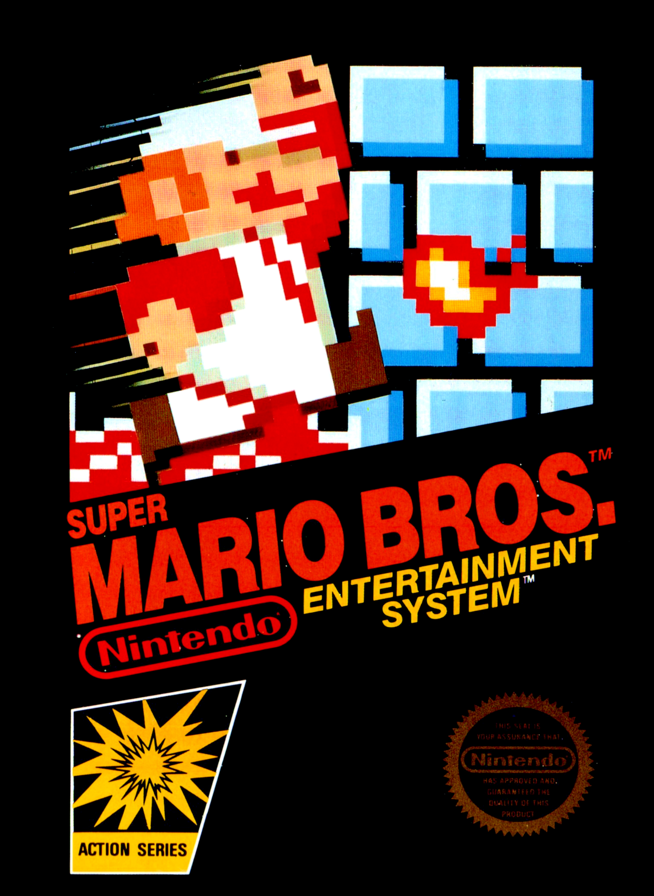

Best Christmas Ever. Thanks Mom and Dad!

This game has 32 levels and about 70% of them have the same outdoor style. So we’ll stick to those.

To get the designs for each level, I took an original copy of the game and wrote a program to pull the level designs out of the game’s memory. Super Mario Bros. is a 30-year-old game and there are lots of resources online that help you figure out how the levels were stored in the game’s memory. Extracting level data from an old video game is a fun programming exercise that you should try sometime.

Here’s the first level from the game (which you probably remember if you ever played it):

Super Mario Bros. Level 1–1

If we look closely, we can see the level is made of a simple grid of objects:

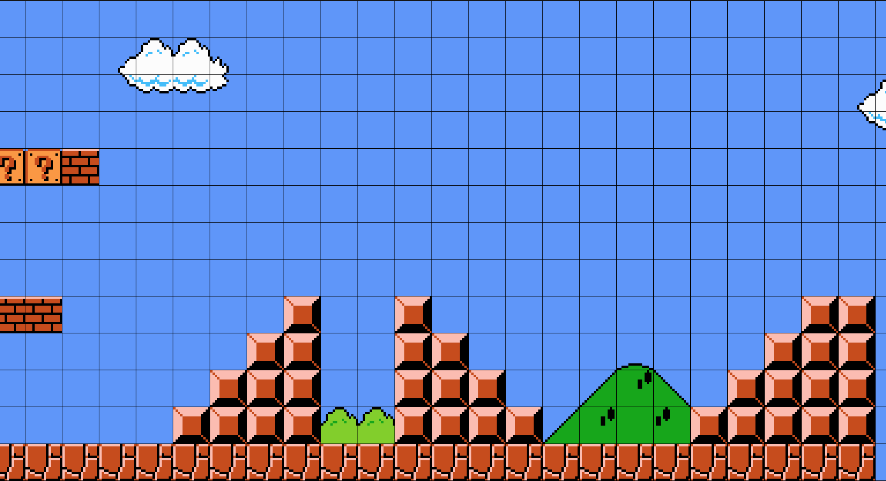

We could just as easily represent this grid as a sequence of characters with one character representing each object:

\-\-\-\-\-\-\-\-\-\-\-\-\-\-\-\-\-\-\-\-\-\-\-\-\-\-  
\-\-\-\-\-\-\-\-\-\-\-\-\-\-\-\-\-\-\-\-\-\-\-\-\-\-  
\-\-\-\-\-\-\-\-\-\-\-\-\-\-\-\-\-\-\-\-\-\-\-\-\-\-  
#??#----------------------  
\-\-\-\-\-\-\-\-\-\-\-\-\-\-\-\-\-\-\-\-\-\-\-\-\-\-  
\-\-\-\-\-\-\-\-\-\-\-\-\-\-\-\-\-\-\-\-\-\-\-\-\-\-  
\-\-\-\-\-\-\-\-\-\-\-\-\-\-\-\-\-\-\-\-\-\-\-\-\-\-  
-##------=--=----------==-  
--------==--==--------===-  
-------===--===------====-  
------====--====----=====-  
=========================-

We’ve replaced each object in the level with a letter:

*   ‘-’ is a blank space
*   ‘=’ is a solid block
*   ‘#’ is a breakable brick
*   ‘?’ is a coin block

…and so on, using a different letter for each different kind of object in the level.

I ended up with text files that looked like this:

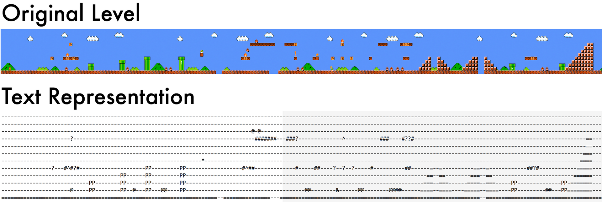

Looking at the text file, you can see that Mario levels don’t really have much of a pattern if you read them line-by-line:

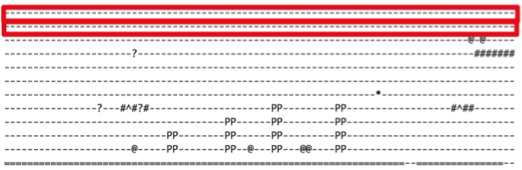

Reading line-by-line, there’s not really a pattern to capture. Lots of lines are completely blank.

The patterns in a level really emerge when you think of the level as a series of columns:

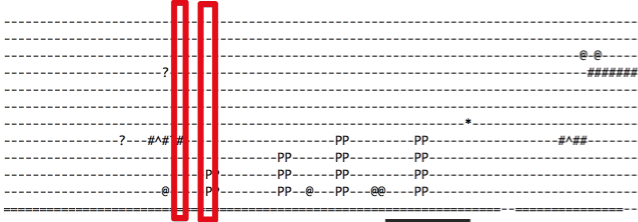

Looking column-by-column, there’s a real pattern. Each column ends in a ‘=’ for example.

So in order for the algorithm to find the patterns in our data, we need to feed the data in column-by-column. Figuring out the most effective representation of your input data (called [feature selection](https://en.wikipedia.org/wiki/Feature_selection)) is one of the keys of using machine learning algorithms well.

To train the model, I needed to rotate my text files by 90 degrees. This made sure the characters were fed into the model in an order where a pattern would more easily show up:

-----------=  
-------#---=  
-------#---=  
-------?---=  
-------#---=  
-----------=  
-----------=  
----------@=  
----------@=  
-----------=  
-----------=  
-----------=  
---------PP=  
---------PP=  
----------==  
---------===  
--------====  
-------=====  
------======  
-----=======  
---=========  
---=========

### Training Our Model

Just like we saw when creating the model of Hemingway’s prose, a model improves as we train it.

After a little training, our model is generating junk:

\-\-\-\-\-\-\-\-\-\-\-\-\-\-\-\-\-\-\-\-\-\-\-\-\-\-  
LL+<&=------P-------------  
\-\-\-\-\-\-\-\-  
---------------------T--#--  
\-\-\-\-\-  
-=--=-=------------=-&--T--------------  
\-\-\-\-\-\-\-\-\-\-\-\-\-\-\-\-\-\-\-\-  
--=------$-=#-=-_  
--------------=----=<----  
-------b  
-

It sort of has an idea that ‘-’s and ‘=’s should show up a lot, but that’s about it. It hasn’t figured out the pattern yet.

After several thousand iterations, it’s starting to look like something:

--  
-----------=  
----------=  
--------PP=  
--------PP=  
-----------=  
-----------=  
-----------=  
-------?---=  
-----------=  
-----------=

The model has almost figured out that each line should be the same length. It has even started to figure out some of the logic of Mario: The pipes in mario are always two blocks wide and at least two blocks high, so the “P”s in the data should appear in 2x2 clusters. That’s pretty cool!

With a lot more training, the model gets to the point where it generates perfectly valid data:

--------PP=  
--------PP=  
----------=  
----------=  
----------=  
---PPP=---=  
---PPP=---=  
----------=

Let’s sample an entire level’s worth of data from our model and rotate it back horizontal:

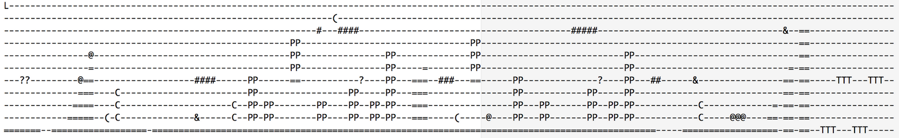

A whole level, generated from our model!

This data looks great! There are several awesome things to notice:

*   It put a [Lakitu](http://www.mariowiki.com/lakitu) (the monster that floats on a cloud) up in the sky at the beginning of the level — just like in a real Mario level.
*   It knows that pipes floating in the air should be resting on top of solid blocks and not just hanging in the air.
*   It places enemies in logical places.
*   It doesn’t create anything that would block a player from moving forward.
*   It _feels_ like a real level from Super Mario Bros. 1 because it’s based off the style of the original levels that existed in that game.

Finally, let’s take this level and recreate it in Super Mario Maker:

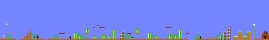

Our level data after being entered into Super Mario Maker

Play it yourself!

If you have Super Mario Maker, you can play this level by [bookmarking it online](https://supermariomakerbookmark.nintendo.net/courses/4AC9-0000-0157-F3C3) or by looking it up using level code [4AC9–0000–0157-F3C3](https://supermariomakerbookmark.nintendo.net/courses/4AC9-0000-0157-F3C3).

### Toys vs. Real World Applications

The recurrent neural network algorithm we used to train our model is the same kind of algorithm used by real-world companies to solve hard problems like speech detection and language translation. What makes our model a ‘toy’ instead of cutting-edge is that our model is generated from very little data. There just aren’t enough levels in the original Super Mario Brothers game to provide enough data for a really good model.

If we could get access to the hundreds of thousands of user-created Super Mario Maker levels that Nintendo has, we could make an amazing model. But we can’t — because Nintendo won’t let us have them. Big companies don’t give away their data for free.

As machine learning becomes more important in more industries, the difference between a good program and a bad program will be how much data you have to train your models. That’s why companies like Google and Facebook need your data so badly!

For example, Google recently open sourced [TensorFlow](https://www.tensorflow.org/), its software toolkit for building large-scale machine learning applications. It was a pretty big deal that Google gave away such important, capable technology for free. This is the same stuff that powers Google Translate.

But without Google’s massive trove of data in every language, you can’t create a competitor to Google Translate. Data is what gives Google its edge. Think about that the next time you open up your [Google Maps Location History](https://maps.google.com/locationhistory/b/0) or [Facebook Location History](https://www.facebook.com/help/1026190460827516) and notice that it stores every place you’ve ever been.

### Further Reading

In machine learning, there’s never a single way to solve a problem. You have limitless options when deciding how to pre-process your data and which algorithms to use. Often [combining multiple approaches](https://en.wikipedia.org/wiki/Ensemble_learning) will give you better results than any single approach.

Readers have sent me links to other interesting approaches to generating Super Mario levels:

*   [Justin Michaud](http://justinmichaud.com/) expanded on the approach I used here to generate levels and [figured out how to hack his generated levels back into the original NES rom file](https://medium.com/@justin_michaud/super-mario-bros-level-generation-using-torch-rnn-726ddea7e9b7) (code written over 30 years ago)! You can even play his [hacked rom online](http://justinmichaud.com/ml_level/index.html).
*   [Amy K. Hoover](http://amykhoover.com/)’s team used an approach that [represents each type of level object (pipes, ground, platforms, etc) as if it were single voice in an overall symphony](http://julian.togelius.com/Hoover2015Composing.pdf). Using a process called functional scaffolding, the system can augment levels with blocks of any given object type. For example, you could sketch out the basic shape of a level and it could add in pipes and question blocks to complete your design.
*   [Steve Dahlskog](http://forskning.mah.se/en/id/tsstda)’s team showed that modeling each column of level data as a series of n-gram “words” [makes it possible to generate levels with a much simpler algorithm](http://julian.togelius.com/Dahlskog2014Linear.pdf) than a large RNN.

* * *

If you liked this article, please consider [**signing up for my Machine Learning is Fun! email list**](http://eepurl.com/b9fg2T). I’ll only email you when I have something new and awesome to share. It’s the best way to find out when I write more articles like this.

You can also follow me on Twitter at [@ageitgey](https://twitter.com/ageitgey), [email me directly](mailto:ageitgey@gmail.com) or [find me on linkedin](https://www.linkedin.com/in/ageitgey). I’d love to hear from you if I can help you or your team with machine learning.

_Now continue on to_ [_Machine Learning is Fun Part 3_](https://medium.com/@ageitgey/machine-learning-is-fun-part-3-deep-learning-and-convolutional-neural-networks-f40359318721#.o6srqap2e)_!_

*   [Artificial Intelligence](https://medium.com/tag/artificial-intelligence?source=post)
*   [Machine Learning](https://medium.com/tag/machine-learning?source=post)
*   [Nintendo](https://medium.com/tag/nintendo?source=post)