Machine Learning is Fun! Part 3: Deep Learning and Convolutional Neural Networks

**_Update:_** _This article is part of a series. Check out the full series:_ [_Part 1_](https://medium.com/@ageitgey/machine-learning-is-fun-80ea3ec3c471)_,_ [_Part 2_](https://medium.com/@ageitgey/machine-learning-is-fun-part-2-a26a10b68df3)_,_ [_Part 3_](https://medium.com/@ageitgey/machine-learning-is-fun-part-3-deep-learning-and-convolutional-neural-networks-f40359318721)_,_ [_Part 4_](https://medium.com/@ageitgey/machine-learning-is-fun-part-4-modern-face-recognition-with-deep-learning-c3cffc121d78)_,_ [_Part 5_](https://medium.com/@ageitgey/machine-learning-is-fun-part-5-language-translation-with-deep-learning-and-the-magic-of-sequences-2ace0acca0aa)_,_ [_Part 6_](https://medium.com/@ageitgey/machine-learning-is-fun-part-6-how-to-do-speech-recognition-with-deep-learning-28293c162f7a)_,_ [_Part 7_](https://medium.com/@ageitgey/abusing-generative-adversarial-networks-to-make-8-bit-pixel-art-e45d9b96cee7) _and_ [_Part 8_](https://medium.com/@ageitgey/machine-learning-is-fun-part-8-how-to-intentionally-trick-neural-networks-b55da32b7196)_! You can also read this article in_ [_普通话_](https://zhuanlan.zhihu.com/p/24524583)_,_ [_Русский_](http://algotravelling.com/ru/%D0%BC%D0%B0%D1%88%D0%B8%D0%BD%D0%BD%D0%BE%D0%B5-%D0%BE%D0%B1%D1%83%D1%87%D0%B5%D0%BD%D0%B8%D0%B5-%D1%8D%D1%82%D0%BE-%D0%B2%D0%B5%D1%81%D0%B5%D0%BB%D0%BE-3/)_,_ [_한국어_](https://medium.com/@jongdae.lim/%EA%B8%B0%EA%B3%84-%ED%95%99%EC%8A%B5-machine-learning-%EC%9D%80-%EC%A6%90%EA%B2%81%EB%8B%A4-part-3-928a841a3aa)_,_ [_Português_](https://medium.com/machina-sapiens/aprendizagem-de-m%C3%A1quina-%C3%A9-divertido-parte-3-deep-learning-e-redes-neuronais-convolutivas-879e0ee7ba48)_,_ [_Tiếng Việt_](https://viblo.asia/p/machine-learning-that-thu-vi-3-tim-kiem-anh-chua-chim-vyDZOX1xlwj) _or_ [_Italiano_](https://medium.com/botsupply/il-machine-learning-è-divertente-parte-3-deep-learning-e-convolutional-neural-network-cnns-cc106559ffa9)_._

**_Giant update:_**  [_I’ve written a new book based on these articles_](https://www.machinelearningisfun.com/get-the-book/)_! It not only expands and updates all my articles, but it has tons of brand new content and lots of hands-on coding projects._ [_Check it out now_](https://www.machinelearningisfun.com/get-the-book/)_!_

Are you tired of reading endless news stories about _deep learning_ and not really knowing what that means? Let’s change that!

This time, we are going to learn how to write programs that recognize objects in images using deep learning. In other words, we’re going to explain the black magic that allows Google Photos to search your photos based on what is in the picture:

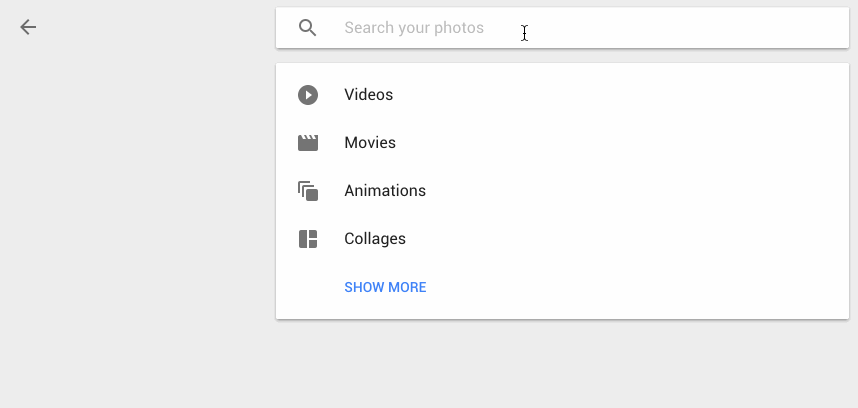

Google now lets you search your own photos by description — even if they aren’t tagged! How does this work??

Just like [Part 1](https://medium.com/@ageitgey/machine-learning-is-fun-80ea3ec3c471) and [Part 2](https://medium.com/@ageitgey/machine-learning-is-fun-part-2-a26a10b68df3#.lbsa5her1), this guide is for anyone who is curious about machine learning but has no idea where to start. The goal is be accessible to anyone — which means that there’s a lot of generalizations and we skip lots of details. But who cares? If this gets anyone more interested in ML, then mission accomplished!

_(If you haven’t already read_ [_part 1_](https://medium.com/@ageitgey/machine-learning-is-fun-80ea3ec3c471) _and_ [_part 2_](https://medium.com/@ageitgey/machine-learning-is-fun-part-2-a26a10b68df3#.lbsa5her1)_, read them now!)_

* * *

### Recognizing Objects with Deep Learning

xkcd #1425 ([View original here](http://xkcd.com/1425/))

You might have seen [this famous xkcd comic](http://xkcd.com/1425/) before.

The goof is based on the idea that any 3-year-old child can recognize a photo of a bird, but figuring out how to make a computer recognize objects has puzzled the very best computer scientists for over 50 years.

In the last few years, we’ve finally found a good approach to object recognition using _deep convolutional neural networks_. That sounds like a a bunch of made up words from a William Gibson Sci-Fi novel, but the ideas are totally understandable if you break them down one by one.

So let’s do it — let’s write a program that can recognize birds!

### Starting Simple

Before we learn how to recognize pictures of birds, let’s learn how to recognize something much simpler — the handwritten number “8”.

In [Part 2](https://medium.com/@ageitgey/machine-learning-is-fun-part-2-a26a10b68df3#.lbsa5her1), we learned about how neural networks can solve complex problems by chaining together lots of simple neurons. We created a small neural network to estimate the price of a house based on how many bedrooms it had, how big it was, and which neighborhood it was in:

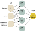

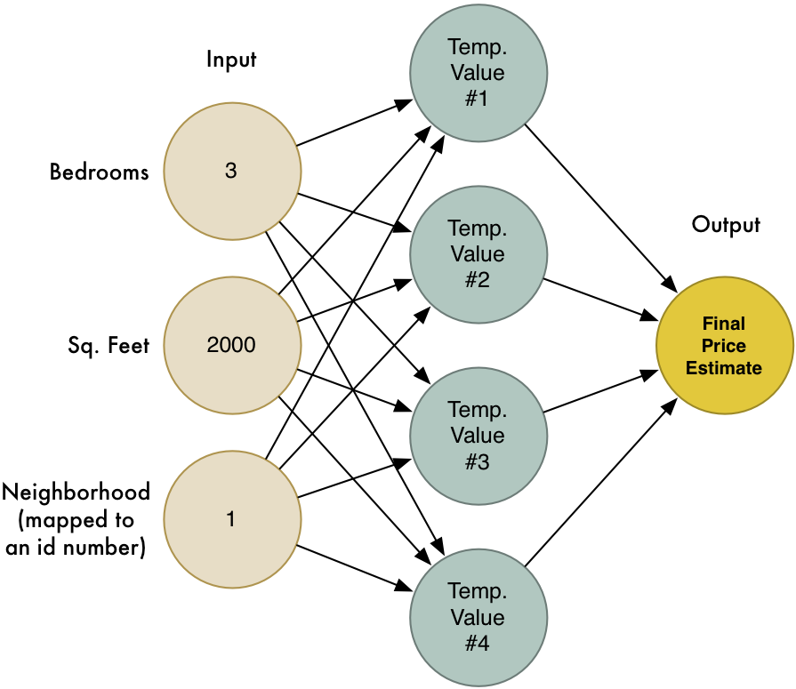

We also know that the idea of machine learning is that the same generic algorithms can be reused with different data to solve different problems. So let’s modify this same neural network to recognize handwritten text. But to make the job really simple, we’ll only try to recognize one letter — the numeral “8”.

Machine learning only works when you have data — preferably a lot of data. So we need lots and lots of handwritten “8”s to get started. Luckily, researchers created the [MNIST data set of handwritten numbers](http://yann.lecun.com/exdb/mnist/) for this very purpose. MNIST provides 60,000 images of handwritten digits, each as an 18x18 image. Here are some “8”s from the data set:

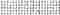

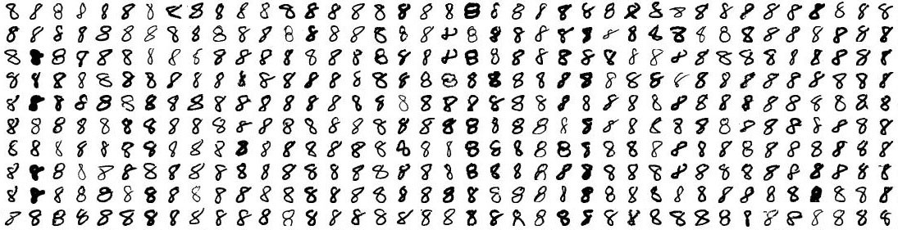

Some 8s from the MNIST data set

#### If you think about it, everything is just numbers

The neural network we made in [Part 2](https://medium.com/@ageitgey/machine-learning-is-fun-part-2-a26a10b68df3#.lbsa5her1) only took in a three numbers as the input (“3” bedrooms, “2000” sq. feet , etc.). But now we want to process images with our neural network. How in the world do we feed images into a neural network instead of just numbers?

The answer is incredible simple. A neural network takes numbers as input. To a computer, an image is really just a grid of numbers that represent how dark each pixel is:

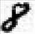

To feed an image into our neural network, we simply treat the 18x18 pixel image as an array of 324 numbers:

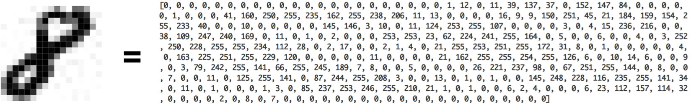

The handle 324 inputs, we’ll just enlarge our neural network to have 324 input nodes:

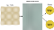

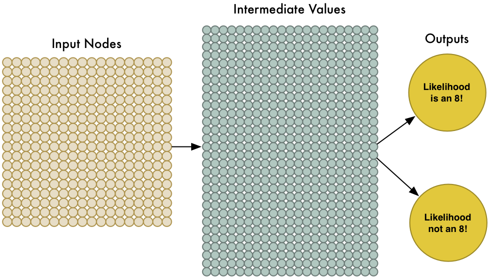

Notice that our neural network also has two outputs now (instead of just one). The first output will predict the likelihood that the image is an “8” and thee second output will predict the likelihood it isn’t an “8”. By having a separate output for each type of object we want to recognize, we can use a neural network to classify objects into groups.

Our neural network is a lot bigger than last time (324 inputs instead of 3!). But any modern computer can handle a neural network with a few hundred nodes without blinking. This would even work fine on your cell phone.

All that’s left is to train the neural network with images of “8”s and not-“8"s so it learns to tell them apart. When we feed in an “8”, we’ll tell it the probability the image is an “8” is 100% and the probability it’s not an “8” is 0%. Vice versa for the counter-example images.

Here’s some of our training data:

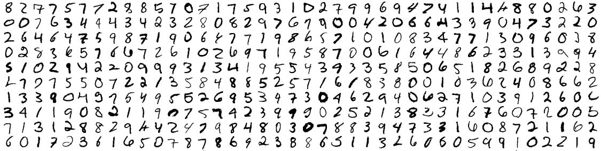

Mmm… sweet, sweet training data

We can train this kind of neural network in a few minutes on a modern laptop. When it’s done, we’ll have a neural network that can recognize pictures of “8”s with a pretty high accuracy. Welcome to the world of (late 1980’s-era) image recognition!

### Tunnel Vision

It’s really neat that simply feeding pixels into a neural network actually worked to build image recognition! Machine learning is magic! _…right?_

_Well, of course it’s not that simple._

First, the good news is that our “8” recognizer really does work well on simple images where the letter is right in the middle of the image:

But now the really bad news:

Our “8” recognizer _totally fails_ to work when the letter isn’t perfectly centered in the image. Just the slightest position change ruins everything:

This is because our network only learned the pattern of a perfectly-centered “8”. It has absolutely no idea what an off-center “8” is. It knows exactly one pattern and one pattern only.

That’s not very useful in the real world. Real world problems are never that clean and simple. So we need to figure out how to make our neural network work in cases where the “8” isn’t perfectly centered.

#### Brute Force Idea #1: Searching with a Sliding Window

We already created a really good program for finding an “8” centered in an image. What if we just scan all around the image for possible “8”s in smaller sections, one section at a time, until we find one?

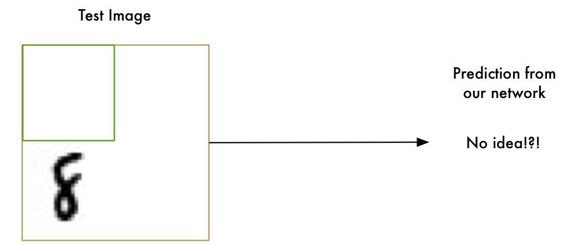

This approach called a sliding window. It’s the brute force solution. It works well in some limited cases, but it’s really inefficient. You have to check the same image over and over looking for objects of different sizes. We can do better than this!

#### Brute Force Idea #2: More data and a Deep Neural Net

When we trained our network, we only showed it “8”s that were perfectly centered. What if we train it with more data, including “8”s in all different positions and sizes all around the image?

We don’t even need to collect new training data. We can just write a script to generate new images with the “8”s in all kinds of different positions in the image:

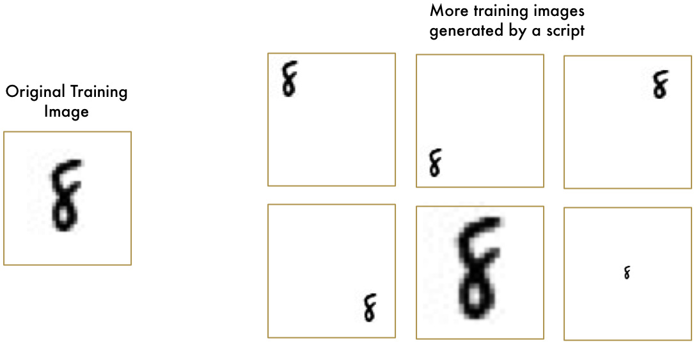

We created **Synthetic Training Data** by creating different versions of the training images we already had. This is a very useful technique!

Using this technique, we can easily create an endless supply of training data.

More data makes the problem harder for our neural network to solve, but we can compensate for that by making our network bigger and thus able to learn more complicated patterns.

To make the network bigger, we just stack up layer upon layer of nodes:

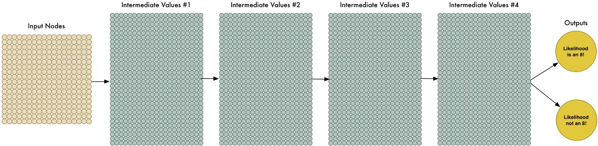

We call this a “deep neural network” because it has more layers than a traditional neural network.

This idea has been around since the late 1960s. But until recently, training this large of a neural network was just too slow to be useful. But once we figured out how to use 3d graphics cards (which were designed to do matrix multiplication really fast) instead of normal computer processors, working with large neural networks suddenly became practical. In fact, the exact same NVIDIA GeForce GTX 1080 video card that you use to play [Overwatch](https://en.wikipedia.org/wiki/Overwatch_%28video_game%29) can be used to train neural networks incredibly quickly.

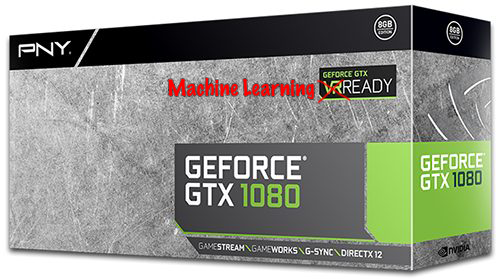

But even though we can make our neural network really big and train it quickly with a 3d graphics card, that still isn’t going to get us all the way to a solution. We need to be smarter about how we process images into our neural network.

Think about it. It doesn’t make sense to train a network to recognize an “8” at the top of a picture separately from training it to recognize an “8” at the bottom of a picture as if those were two totally different objects.

There should be some way to make the neural network smart enough to know that an “8” anywhere in the picture is the same thing without all that extra training. Luckily… there is!

### The Solution is Convolution

As a human, you intuitively know that pictures have a _hierarchy_ or _conceptual structure_. Consider this picture:

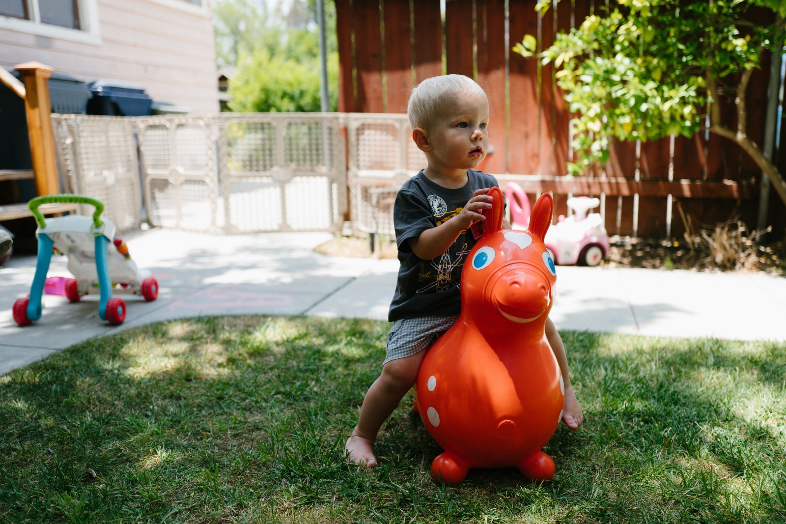

Gratuitous picture of my son

As a human, you instantly recognize the hierarchy in this picture:

*   The ground is covered in grass and concrete
*   There is a child
*   The child is sitting on a bouncy horse
*   The bouncy horse is on top of the grass

Most importantly, we recognize the idea of a _child_ no matter what surface the child is on. We don’t have to re-learn the idea of _child_ for every possible surface it could appear on.

But right now, our neural network can’t do this. It thinks that an “8” in a different part of the image is an entirely different thing. It doesn’t understand that moving an object around in the picture doesn’t make it something different. This means it has to re-learn the identify of each object in every possible position. That sucks.

We need to give our neural network understanding of _translation invariance _— an “8” is an “8” no matter where in the picture it shows up.

We’ll do this using a process called Convolution. The idea of convolution is inspired partly by computer science and partly by biology (i.e. mad scientists literally poking cat brains with weird probes to figure out how cats process images).

### How Convolution Works

Instead of feeding entire images into our neural network as one grid of numbers, we’re going to do something a lot smarter that takes advantage of the idea that an object is the same no matter where it appears in a picture.

Here’s how it’s going to work, step by step —

#### Step 1: Break the image into overlapping image tiles

Similar to our sliding window search above, let’s pass a sliding window over the entire original image and save each result as a separate, tiny picture tile:

By doing this, we turned our original image into 77 equally-sized tiny image tiles.

#### Step 2: Feed each image tile into a small neural network

Earlier, we fed a single image into a neural network to see if it was an “8”. We’ll do the exact same thing here, but we’ll do it for each individual image tile:

Repeat this 77 times, once for each tile.

However, **there’s one big twist**: We’ll keep the **same neural network weights** for every single tile in the same original image. In other words, we are treating every image tile equally. If something interesting appears in any given tile, we’ll mark that tile as interesting.

#### Step 3: Save the results from each tile into a new array

We don’t want to lose track of the arrangement of the original tiles. So we save the result from processing each tile into a grid in the same arrangement as the original image. It looks like this:

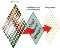

In other words, we’ve started with a large image and we ended with a slightly smaller array that records which sections of our original image were the most interesting.

#### Step 4: Downsampling

The result of Step 3 was an array that maps out which parts of the original image are the most interesting. But that array is still pretty big:

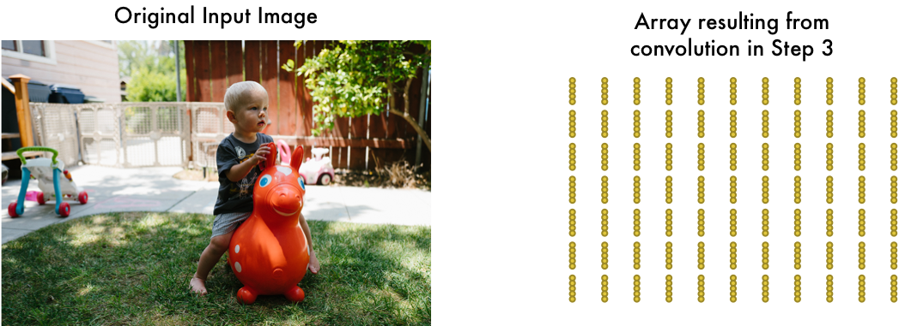

To reduce the size of the array, we _downsample_ it using an algorithm called [max pooling](https://en.wikipedia.org/wiki/Convolutional_neural_network#Pooling_layer). It sounds fancy, but it isn’t at all!

We’ll just look at each 2x2 square of the array and keep the biggest number:

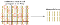

The idea here is that if we found something interesting in any of the four input tiles that makes up each 2x2 grid square, we’ll just keep the most interesting bit. This reduces the size of our array while keeping the most important bits.

#### Final step: Make a prediction

So far, we’ve reduced a giant image down into a fairly small array.

Guess what? That array is just a bunch of numbers, so we can use that small array as input into _another neural network_. This final neural network will decide if the image is or isn’t a match. To differentiate it from the convolution step, we call it a “fully connected” network.

So from start to finish, our whole five-step pipeline looks like this:

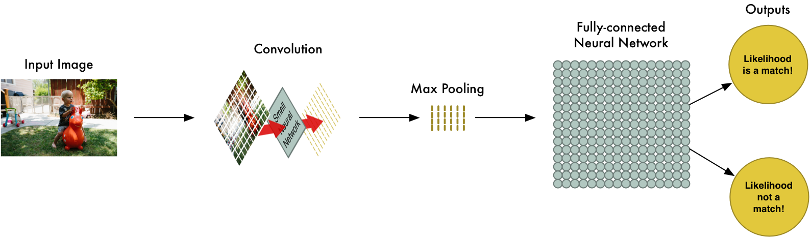

#### Adding Even More Steps

Our image processing pipeline is a series of steps: convolution, max-pooling, and finally a fully-connected network.

When solving problems in the real world, these steps can be combined and stacked as many times as you want! You can have two, three or even ten convolution layers. You can throw in max pooling wherever you want to reduce the size of your data.

The basic idea is to start with a large image and continually boil it down, step-by-step, until you finally have a single result. The more convolution steps you have, the more complicated features your network will be able to learn to recognize.

For example, the first convolution step might learn to recognize sharp edges, the second convolution step might recognize beaks using it’s knowledge of sharp edges, the third step might recognize entire birds using it’s knowledge of beaks, etc.

Here’s what a more realistic deep convolutional network (like you would find in a research paper) looks like:

In this case, they start a 224 x 224 pixel image, apply convolution and max pooling twice, apply convolution 3 more times, apply max pooling and then have two fully-connected layers. The end result is that the image is classified into one of 1000 categories!

#### Constructing the Right Network

So how do you know which steps you need to combine to make your image classifier work?

Honestly, you have to answer this by doing a lot of experimentation and testing. You might have to train 100 networks before you find the optimal structure and parameters for the problem you are solving. Machine learning involves a lot of trial and error!

### Building our Bird Classifier

Now finally we know enough to write a program that can decide if a picture is a bird or not.

As always, we need some data to get started. The free [CIFAR10 data set](https://www.cs.toronto.edu/~kriz/cifar.html) contains 6,000 pictures of birds and 52,000 pictures of things that are not birds. But to get even more data we’ll also add in the [Caltech-UCSD Birds-200–2011 data set](http://www.vision.caltech.edu/visipedia/CUB-200-2011.html) that has another 12,000 bird pics.

Here’s a few of the birds from our combined data set:

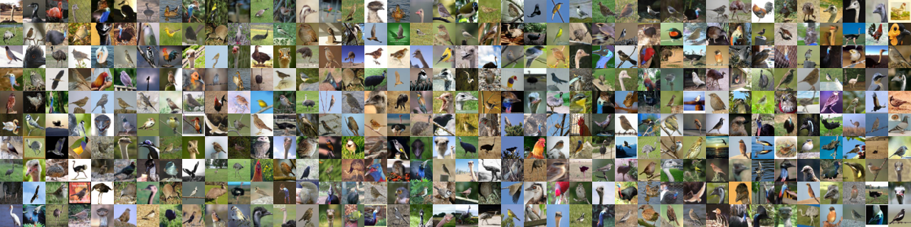

And here’s some of the 52,000 non-bird images:

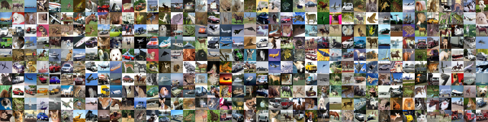

This data set will work fine for our purposes, but 72,000 low-res images is still pretty small for real-world applications. If you want Google-level performance, you need _millions_ of large images. In machine learning, having more data is almost always more important that having better algorithms. Now you know why Google is so happy to offer you unlimited photo storage. They want your sweet, sweet data!

To build our classifier, we’ll use [TFLearn](http://tflearn.org/). TFlearn is a wrapper around Google’s [TensorFlow](https://www.tensorflow.org/) deep learning library that exposes a simplified API. It makes building convolutional neural networks as easy as writing a few lines of code to define the layers of our network.

Here’s the code to define and train the network:

If you are training with a good video card with enough RAM (like an Nvidia GeForce GTX 980 Ti or better), this will be done in less than an hour. If you are training with a normal cpu, it might take a lot longer.

As it trains, the accuracy will increase. After the first pass, I got 75.4% accuracy. After just 10 passes, it was already up to 91.7%. After 50 or so passes, it capped out around 95.5% accuracy and additional training didn’t help, so I stopped it there.

Congrats! Our program can now recognize birds in images!

### Testing our Network

Now that we have a trained neural network, we can use it! [Here’s a simple script](https://gist.github.com/ageitgey/a40dded08e82e59724c70da23786bbf0) that takes in a single image file and predicts if it is a bird or not.

But to really see how effective our network is, we need to test it with lots of images. The data set I created held back 15,000 images for validation. When I ran those 15,000 images through the network, it predicted the correct answer 95% of the time.

That seems pretty good, right? Well… it depends!

#### How accurate is 95% accurate?

Our network claims to be 95% accurate. But the devil is in the details. That could mean all sorts of different things.

For example, what if 5% of our training images were birds and the other 95% were not birds? A program that guessed “not a bird” every single time would be 95% accurate! But it would also be 100% useless.

We need to look more closely at the numbers than just the overall accuracy. To judge how good a classification system really is, we need to look closely at _how_ it failed, not just the percentage of the time that it failed.

Instead of thinking about our predictions as “right” and “wrong”, let’s break them down into four separate categories —

*   First, here are some of the birds that our network correctly identified as birds. Let’s call these **True Positives:**

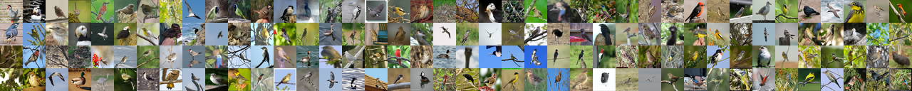

Wow! Our network can recognize lots of different kinds of birds successfully!

*   Second, here are images that our network correctly identified as “not a bird”. These are called **True Negatives:**

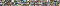

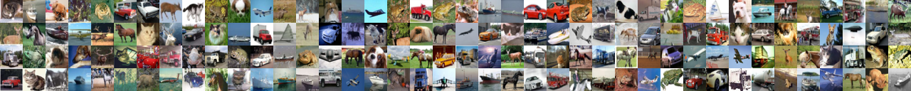

Horses and trucks don’t fool us!

*   Third, here are some images that we thought were birds but were not really birds at all. These are our **False Positives**:

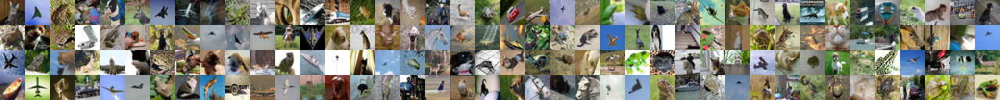

Lots of planes were mistaken for birds! That makes sense.

*   And finally, here are some images of birds that we didn’t correctly recognize as birds. These are our **False Negatives**:

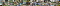

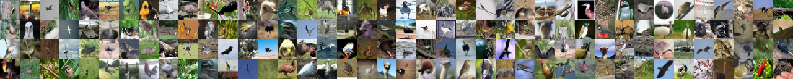

These birds fooled us! Stupid ostriches! Do they even count as birds?

Using our validation set of 15,000 images, here’s how many times our predictions fell into each category:

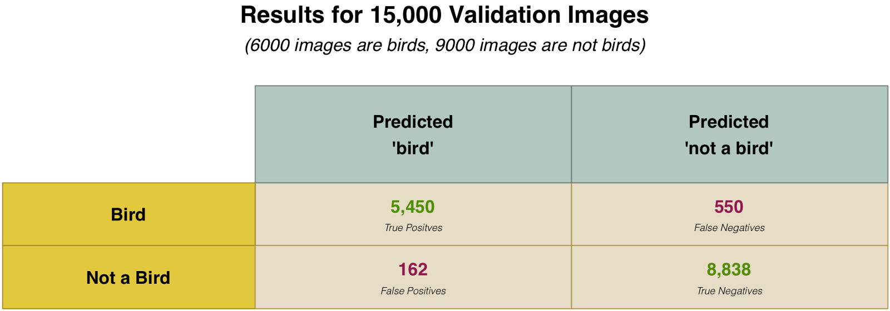

Why do we break our results down like this? Because not all mistakes are created equal.

Imagine if we were writing a program to detect cancer from an MRI image. If we were detecting cancer, we’d rather have false positives than false negatives. False negatives would be the worse possible case — that’s when the program told someone they definitely didn’t have cancer but they actually did.

Instead of just looking at overall accuracy, we calculate [Precision and Recall](https://en.wikipedia.org/wiki/Precision_and_recall) metrics. Precision and Recall metrics give us a clearer picture of how well we did:

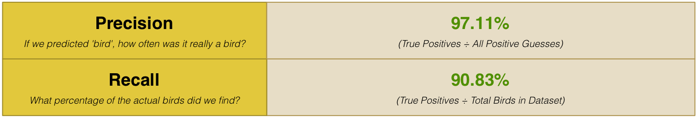

This tells us that 97% of the time we guessed “Bird”, we were right! But it also tells us that we only found 90% of the actual birds in the data set. In other words, we might not find every bird but we are pretty sure about it when we do find one!

### Where to go from here

Now that you know the basics of deep convolutional networks, you can try out some of the [examples that come with tflearn](https://github.com/tflearn/tflearn/tree/master/examples#tflearn-examples) to get your hands dirty with different neural network architectures. It even comes with built-in data sets so you don’t even have to find your own images.

You also know enough now to start branching and learning about other areas of machine learning. Why not learn [how to use algorithms to train computers how to play Atari games](http://karpathy.github.io/2016/05/31/rl/) next?

* * *

If you liked this article, please consider [**signing up for my Machine Learning is Fun! email list**](http://eepurl.com/b9fg2T). I’ll only email you when I have something new and awesome to share. It’s the best way to find out when I write more articles like this.

You can also follow me on Twitter at [@ageitgey](https://twitter.com/ageitgey), [email me directly](mailto:ageitgey@gmail.com) or [find me on linkedin](https://www.linkedin.com/in/ageitgey). I’d love to hear from you if I can help you or your team with machine learning.

_Now continue on to_ [_Machine Learning is Fun Part 4_](https://medium.com/@ageitgey/machine-learning-is-fun-part-4-modern-face-recognition-with-deep-learning-c3cffc121d78)_,_ [_Part 5_](https://medium.com/@ageitgey/machine-learning-is-fun-part-5-language-translation-with-deep-learning-and-the-magic-of-sequences-2ace0acca0aa) _and_ [_Part 6_](https://medium.com/@ageitgey/machine-learning-is-fun-part-6-how-to-do-speech-recognition-with-deep-learning-28293c162f7a)_!_

*   [Machine Learning](https://medium.com/tag/machine-learning?source=post)
*   [Artificial Intelligence](https://medium.com/tag/artificial-intelligence?source=post)
*   [Deep Learning](https://medium.com/tag/deep-learning?source=post)