Machine Learning is Fun! – Adam Geitgey – Medium

**_Update:_** _This article is part of a series. Check out the full series:_ [_Part 1_](https://medium.com/@ageitgey/machine-learning-is-fun-80ea3ec3c471)_,_ [_Part 2_](https://medium.com/@ageitgey/machine-learning-is-fun-part-2-a26a10b68df3)_,_ [_Part 3_](https://medium.com/@ageitgey/machine-learning-is-fun-part-3-deep-learning-and-convolutional-neural-networks-f40359318721)_,_ [_Part 4_](https://medium.com/@ageitgey/machine-learning-is-fun-part-4-modern-face-recognition-with-deep-learning-c3cffc121d78)_,_ [_Part 5_](https://medium.com/@ageitgey/machine-learning-is-fun-part-5-language-translation-with-deep-learning-and-the-magic-of-sequences-2ace0acca0aa)_,_ [_Part 6_](https://medium.com/@ageitgey/machine-learning-is-fun-part-6-how-to-do-speech-recognition-with-deep-learning-28293c162f7a)_,_ [_Part 7_](https://medium.com/@ageitgey/abusing-generative-adversarial-networks-to-make-8-bit-pixel-art-e45d9b96cee7) _and_ [_Part 8_](https://medium.com/@ageitgey/machine-learning-is-fun-part-8-how-to-intentionally-trick-neural-networks-b55da32b7196)_! You can also read this article in_ [_日本語_](https://medium.com/ai-business/%E3%81%9F%E3%81%AE%E3%81%97%E3%81%84%E6%A9%9F%E6%A2%B0%E5%AD%A6%E7%BF%92-part-1-f7a7957dbe3b#.wim44eo1e)_,_ [_Português_](http://portal.tcu.gov.br/inovatcu/noticias/aprendizado-de-maquina-e-divertido.htm)_,_ [_Português (alternate)_](https://medium.com/@josenildo_silva/aprendizagem-de-m%C3%A1quina-%C3%A9-divertido-8fe1513ce59f)_,_ [_Türkçe_](https://medium.com/turkce/makine-öğrenimi-eğlencelidir-2ad33ae37bea)_,_ [_Français_](https://medium.com/@alexis.anzieu/samuser-avec-le-machine-learning-a40159bb0546)_,_ [_한국어_](https://medium.com/@jongdae.lim/기계-학습-machine-learning-은-즐겁다-part-1-9a0297198ad8)_,_ [_العَرَبِيَّة‎‎_](http://www.saif.online/single-post/2016/09/22/%D8%A7%D9%84%D9%85%D9%82%D8%AF%D9%91%D9%85%D8%A9-%D8%A7%D9%84%D8%A3%D8%B3%D9%87%D9%84-%D9%81%D9%8A-%D8%A7%D9%84%D8%B9%D8%A7%D9%84%D9%85-%D8%B9%D9%86-%D8%A7%D9%84%D8%AA%D8%B9%D9%84%D9%91%D9%85-%D8%A7%D9%84%D8%A2%D9%84%D9%8A-machine-learning)_,_ [_Español (México)_](https://blog.chatbot.mx/el-machine-learning-es-divertido-parte-1/)_,_ [_Español (España)_](http://www.jesushurtado.es/2016/12/12/machine-learning-espanol-divertido-parte-1/)_,_ [_Polski_](https://medium.com/@maciej.matyka/nauczanie-maszynowe-jest-zabawne-fc9af0080cda)_,_ [_Italiano_](https://medium.com/botsupply/il-machine-learning-è-divertente-parte-1-97d4bce99a06)_,_ [_普通话_](https://zhuanlan.zhihu.com/p/24339995)_,_ [_Русский_](http://algotravelling.com/ru/%D0%BC%D0%B0%D1%88%D0%B8%D0%BD%D0%BD%D0%BE%D0%B5-%D0%BE%D0%B1%D1%83%D1%87%D0%B5%D0%BD%D0%B8%D0%B5-%D1%8D%D1%82%D0%BE-%D0%B2%D0%B5%D1%81%D0%B5%D0%BB%D0%BE-1/)_,_ [_한국어_](https://medium.com/@jongdae.lim/%EA%B8%B0%EA%B3%84-%ED%95%99%EC%8A%B5-machine-learning-%EC%9D%80-%EC%A6%90%EA%B2%81%EB%8B%A4-part-1-9a0297198ad8)_,_ [_Tiếng Việt_](https://viblo.asia/p/machine-learning-that-thu-vi-1-du-doan-gia-nha-dat-gAm5y91w5db) _or_ [فارسی](http://zerotohero.ir/8984/%DB%8C%D8%A7%D8%AF%DA%AF%DB%8C%D8%B1%DB%8C-%D9%85%D8%A7%D8%B4%DB%8C%D9%86-%D8%A8%D9%87-%D8%B2%D8%A8%D8%A7%D9%86-%D8%B3%D8%A7%D8%AF%D9%87-%D8%A8%D8%AE%D8%B4-%D8%A7%D9%88%D9%84)_._

**_Giant update:_**  [_I’ve written a new book based on these articles_](https://www.machinelearningisfun.com/get-the-book/)_! It not only expands and updates all my articles, but it has tons of brand new content and lots of hands-on coding projects._ [_Check it out now_](https://www.machinelearningisfun.com/get-the-book/)_!_

Have you heard people talking about machine learning but only have a fuzzy idea of what that means? Are you tired of nodding your way through conversations with co-workers? Let’s change that!

* * *

This guide is for anyone who is curious about machine learning but has no idea where to start. I imagine there are a lot of people who tried reading [the wikipedia article](http://en.wikipedia.org/wiki/Machine_learning), got frustrated and gave up wishing someone would just give them a high-level explanation. That’s what this is.

The goal is be accessible to anyone — which means that there’s a lot of generalizations. But who cares? If this gets anyone more interested in ML, then mission accomplished.

* * *

### What is machine learning?

Machine learning is the idea that there are generic algorithms that can tell you something interesting about a set of data without you having to write any custom code specific to the problem. Instead of writing code, you feed data to the generic algorithm and it builds its own logic based on the data.

For example, one kind of algorithm is a classification algorithm. It can put data into different groups. The same classification algorithm used to recognize handwritten numbers could also be used to classify emails into spam and not-spam without changing a line of code. It’s the same algorithm but it’s fed different training data so it comes up with different classification logic.

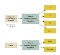

This machine learning algorithm is a black box that can be re-used for lots of different classification problems.

“Machine learning” is an umbrella term covering lots of these kinds of generic algorithms.

### Two kinds of Machine Learning Algorithms

You can think of machine learning algorithms as falling into one of two main categories — **supervised learning** and **unsupervised learning**. The difference is simple, but really important.

#### Supervised Learning

Let’s say you are a real estate agent. Your business is growing, so you hire a bunch of new trainee agents to help you out. But there’s a problem — you can glance at a house and have a pretty good idea of what a house is worth, but your trainees don’t have your experience so they don’t know how to price their houses.

To help your trainees (and maybe free yourself up for a vacation), you decide to write a little app that can estimate the value of a house in your area based on it’s size, neighborhood, etc, and what similar houses have sold for.

So you write down every time someone sells a house in your city for 3 months. For each house, you write down a bunch of details — number of bedrooms, size in square feet, neighborhood, etc. But most importantly, you write down the final sale price:

This is our “training data.”

Using that training data, we want to create a program that can estimate how much any other house in your area is worth:

We want to use the training data to predict the prices of other houses.

This is called **supervised learning**. You knew how much each house sold for, so in other words, you knew the answer to the problem and could work backwards from there to figure out the logic.

To build your app, you feed your training data about each house into your machine learning algorithm. The algorithm is trying to figure out what kind of math needs to be done to make the numbers work out.

This kind of like having the answer key to a math test with all the arithmetic symbols erased:

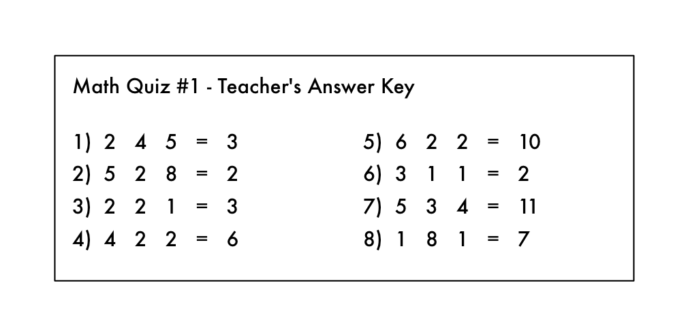

Oh no! A devious student erased the arithmetic symbols from the teacher’s answer key!

From this, can you figure out what kind of math problems were on the test? You know you are supposed to “do something” with the numbers on the left to get each answer on the right.

In **supervised learning**, you are letting the computer work out that relationship for you. And once you know what math was required to solve this specific set of problems, you could answer to any other problem of the same type!

#### Unsupervised Learning

Let’s go back to our original example with the real estate agent. What if you didn’t know the sale price for each house? Even if all you know is the size, location, etc of each house, it turns out you can still do some really cool stuff. This is called **unsupervised** learning.

Even if you aren’t trying to predict an unknown number (like price), you can still do interesting things with machine learning.

This is kind of like someone giving you a list of numbers on a sheet of paper and saying “I don’t really know what these numbers mean but maybe you can figure out if there is a pattern or grouping or something — good luck!”

So what could do with this data? For starters, you could have an algorithm that automatically identified different market segments in your data. Maybe you’d find out that home buyers in the neighborhood near the local college really like small houses with lots of bedrooms, but home buyers in the suburbs prefer 3-bedroom houses with lots of square footage. Knowing about these different kinds of customers could help direct your marketing efforts.

Another cool thing you could do is automatically identify any outlier houses that were way different than everything else. Maybe those outlier houses are giant mansions and you can focus your best sales people on those areas because they have bigger commissions.

Supervised learning is what we’ll focus on for the rest of this post, but that’s not because unsupervised learning is any less useful or interesting. In fact, unsupervised learning is becoming increasingly important as the algorithms get better because it can be used without having to label the data with the correct answer.

_Side note: There are lots of_ [_other types_](http://en.wikipedia.org/wiki/Machine_learning#Algorithm_types) _of machine learning algorithms. But this is a pretty good place to start._

### That’s cool, but does being able to estimate the price of a house really count as “learning”?

As a human, your brain can approach most any situation and learn how to deal with that situation without any explicit instructions. If you sell houses for a long time, you will instinctively have a “feel” for the right price for a house, the best way to market that house, the kind of client who would be interested, etc. The goal of [Strong AI](http://en.wikipedia.org/wiki/Strong_AI) research is to be able to replicate this ability with computers.

But current machine learning algorithms aren’t that good yet — they only work when focused a very specific, limited problem. Maybe a better definition for “learning” in this case is “figuring out an equation to solve a specific problem based on some example data”.

Unfortunately _“Machine Figuring out an equation to solve a specific problem based on some example data”_ isn’t really a great name. So we ended up with “Machine Learning” instead.

Of course if you are reading this 50 years in the future and we’ve figured out the algorithm for Strong AI, then this whole post will all seem a little quaint. Maybe stop reading and go tell your robot servant to go make you a sandwich, future human.

### Let’s write that program!

So, how would you write the program to estimate the value of a house like in our example above? Think about it for a second before you read further.

If you didn’t know anything about machine learning, you’d probably try to write out some basic rules for estimating the price of a house like this:

def estimate\_house\_sales\_price(num\_of_bedrooms, sqft, neighborhood):  
  price = 0

 _# In my area, the average house costs $200 per sqft_  price\_per\_sqft = 200

  if neighborhood == "hipsterton":  
   _ # but some areas cost a bit more_  
    price\_per\_sqft = 400

  elif neighborhood == "skid row":  
   _ # and some areas cost less_  
    price\_per\_sqft = 100

  _\# start with a base price estimate based on how big the place is_  
  price = price\_per\_sqft * sqft

  _\# now adjust our estimate based on the number of bedrooms_  
  if num\_of\_bedrooms == 0:  
    _\# Studio apartments are cheap_  
    price = price — 20000  
  else:  
   _ # places with more bedrooms are usually  
    # more valuable_  
    price = price + (num\_of\_bedrooms * 1000)

 return price

If you fiddle with this for hours and hours, you might end up with something that sort of works. But your program will never be perfect and it will be hard to maintain as prices change.

Wouldn’t it be better if the computer could just figure out how to implement this function for you? Who cares what exactly the function does as long is it returns the correct number:

def estimate\_house\_sales\_price(num\_of_bedrooms, sqft, neighborhood):  
  price = &lt;computer, plz do some math for me&gt;

  return price

One way to think about this problem is that the **price** is a delicious stew and the ingredients are the **number of bedrooms**, the **square footage** and the **neighborhood**. If you could just figure out how much each ingredient impacts the final price, maybe there’s an exact ratio of ingredients to stir in to make the final price.

That would reduce your original function (with all those crazy _if_’s and _else_’s) down to something really simple like this:

def estimate\_house\_sales\_price(num\_of_bedrooms, sqft, neighborhood):  
 price = 0

 # a little pinch of this  
 price += num\_of\_bedrooms * **.841231951398213**

 # and a big pinch of that  
 price += sqft * **1231.1231231**

 # maybe a handful of this  
 price += neighborhood * **2.3242341421**

 # and finally, just a little extra salt for good measure  
 price += **201.23432095**

 return price

Notice the magic numbers in bold — **.841231951398213**, **1231.1231231**, **2.3242341421**,  and **201.23432095**. These are our **weights**. If we could just figure out the perfect weights to use that work for every house, our function could predict house prices!

A dumb way to figure out the best weights would be something like this:

#### Step 1:

Start with each weight set to **1.0:**

def estimate\_house\_sales\_price(num\_of_bedrooms, sqft, neighborhood):  
  price = 0

  # a little pinch of this  
  price += num\_of\_bedrooms * **1.0**

  # and a big pinch of that  
  price += sqft * **1.0**

  # maybe a handful of this  
  price += neighborhood * **1.0**

  # and finally, just a little extra salt for good measure  
  price += **1.0**

  return price

#### Step 2:

Run every house you know about through your function and see how far off the function is at guessing the correct price for each house:

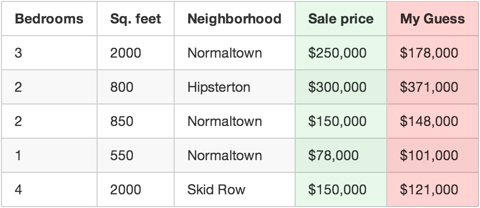

Use your function to predict a price for each house.

For example, if the first house really sold for $250,000, but your function guessed it sold for $178,000, you are off by $72,000 for that single house.

Now add up the squared amount you are off for each house you have in your data set. Let’s say that you had 500 home sales in your data set and the square of how much your function was off for each house was a grand total of $86,123,373. That’s how “wrong” your function currently is.

Now, take that sum total and divide it by 500 to get an average of how far off you are for each house. Call this average error amount the **cost** of your function.

If you could get this cost to be zero by playing with the weights, your function would be perfect. It would mean that in every case, your function perfectly guessed the price of the house based on the input data. So that’s our goal — get this cost to be as low as possible by trying different weights.

#### Step 3:

Repeat Step 2 over and over  with **every single possible combination of weights**. Whichever combination of weights makes the cost closest to zero is what you use. When you find the weights that work, you’ve solved the problem!

### Mind Blowage Time

That’s pretty simple, right? Well think about what you just did. You took some data, you fed it through three generic, really simple steps, and you ended up with a function that can guess the price of any house in your area. Watch out, Zillow!

But here’s a few more facts that will blow your mind:

1.  Research in many fields (like linguistics/translation) over the last 40 years has shown that these generic learning algorithms that “stir the number stew” (a phrase I just made up) out-perform approaches where real people try to come up with explicit rules themselves. The “dumb” approach of machine learning eventually beats human experts.
2.  The function you ended up with is totally dumb. It doesn’t even know what “square feet” or “bedrooms” are. All it knows is that it needs to stir in some amount of those numbers to get the correct answer.
3.  It’s very likely you’ll have no idea **_why_** a particular set of weights will work. So you’ve just written a function that you don’t really understand but that you can prove will work.
4.  Imagine that instead of taking in parameters like “sqft” and “num\_of\_bedrooms”, your prediction function took in an array of numbers. Let’s say each number represented the brightness of one pixel in an image captured by camera mounted on top of your car. Now let’s say that instead of outputting a prediction called “price”, the function outputted a prediction called “degrees\_to\_turn\_steering\_wheel”. **You’ve just made a function that can steer your car by itself!**

Pretty crazy, right?

### What about that whole “try every number” bit in Step 3?

Ok, of course you can’t just try every combination of all possible weights to find the combo that works the best. That would literally take forever since you’d never run out of numbers to try.

To avoid that, mathematicians have figured out lots of [clever ways](http://en.wikipedia.org/wiki/Gradient_descent) to quickly find good values for those weights without having to try very many. Here’s one way:

First, write a simple equation that represents Step #2 above:

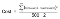

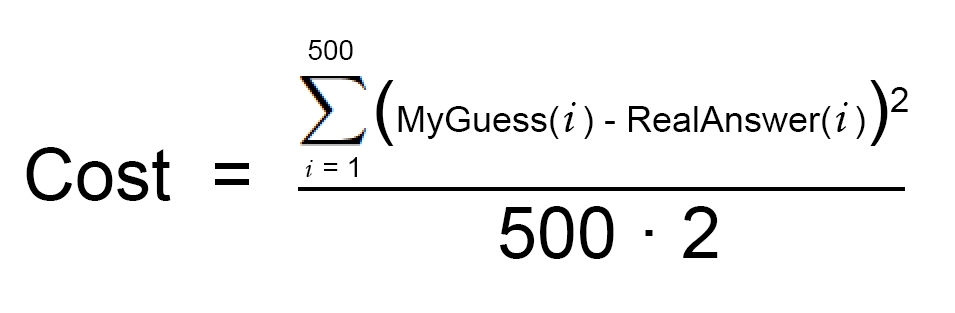

This is your **cost function**.

Now let’s re-write exactly the same equation, but using a bunch of machine learning math jargon (that you can ignore for now):

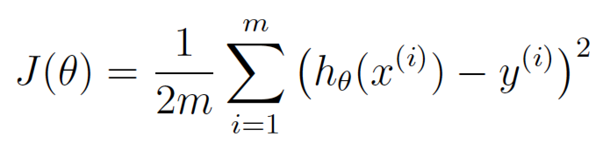

θ is what represents your current weights. J(θ) means the ‘cost for your current weights’.

This equation represents how wrong our price estimating function is for the weights we currently have set.

If we graph this cost equation for all possible values of our weights for **number\_of\_bedrooms** and **sqft**, we’d get a graph that might look something like this:

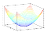

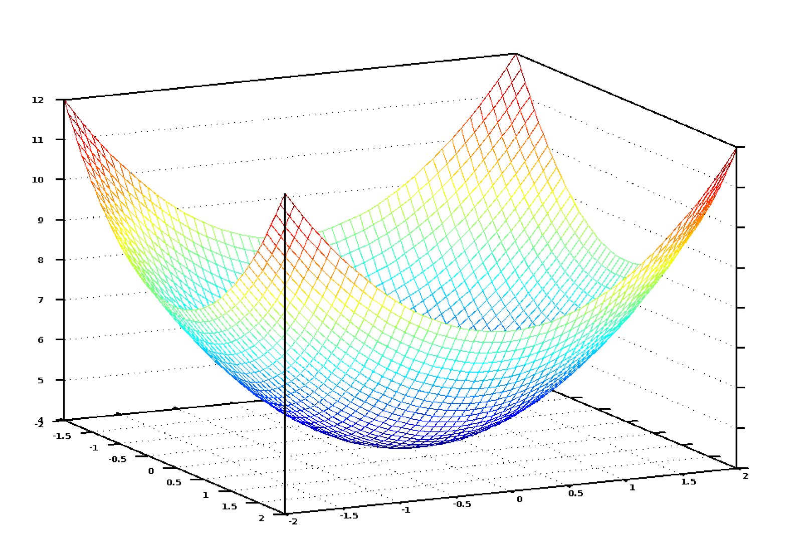

The graph of our cost function looks like a bowl. The vertical axis represents the cost.

In this graph, the lowest point in blue is where our cost is the lowest — thus our function is the least wrong. The highest points are where we are most wrong. So if we can find the weights that get us to the lowest point on this graph, we’ll have our answer!

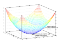

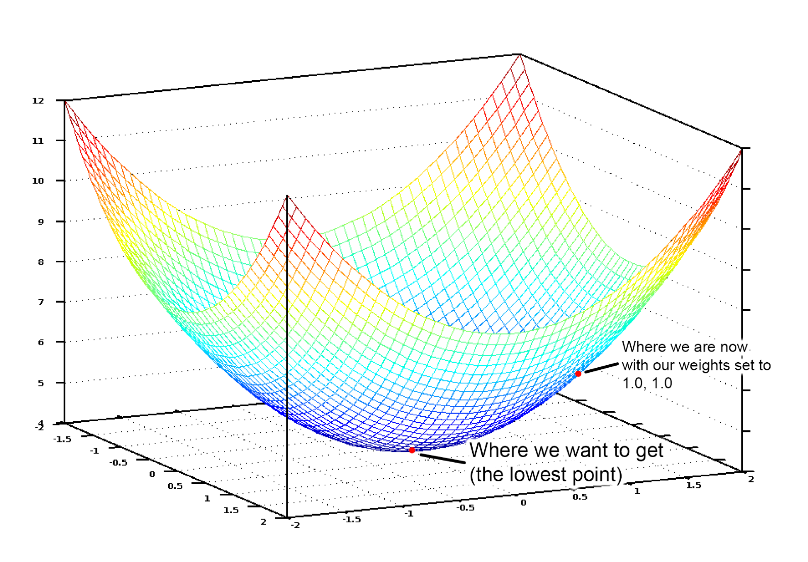

So we just need to adjust our weights so we are “walking down hill” on this graph towards the lowest point. If we keep making small adjustments to our weights that are always moving towards the lowest point, we’ll eventually get there without having to try too many different weights.

If you remember anything from Calculus, you might remember that if you take the derivative of a function, it tells you the slope of the function’s tangent at any point. In other words, it tells us which way is downhill for any given point on our graph. We can use that knowledge to walk downhill.

So if we calculate a partial derivative of our cost function with respect to each of our weights, then we can subtract that value from each weight. That will walk us one step closer to the bottom of the hill. Keep doing that and eventually we’ll reach the bottom of the hill and have the best possible values for our weights. (If that didn’t make sense, don’t worry and keep reading).

That’s a high level summary of one way to find the best weights for your function called **batch gradient descent**. Don’t be afraid to [dig deeper](http://hbfs.wordpress.com/2012/04/24/introduction-to-gradient-descent/) if you are interested on learning the details.

When you use a machine learning library to solve a real problem, all of this will be done for you. But it’s still useful to have a good idea of what is happening.

### What else did you conveniently skip over?

The three-step algorithm I described is called **multivariate linear regression**. You are estimating the equation for a line that fits through all of your house data points. Then you are using that equation to guess the sales price of houses you’ve never seen before based where that house would appear on your line. It’s a really powerful idea and you can solve “real” problems with it.

But while the approach I showed you might work in simple cases, it won’t work in all cases. One reason is because house prices aren’t always simple enough to follow a continuous line.

But luckily there are lots of ways to handle that. There are plenty of other machine learning algorithms that can handle non-linear data (like [neural networks](http://en.wikipedia.org/wiki/Artificial_neural_network) or [SVMs](http://en.wikipedia.org/wiki/Support_vector_machine) with [kernels](http://en.wikipedia.org/wiki/Kernel_trick)). There are also ways to use linear regression more cleverly that allow for more complicated lines to be fit. In all cases, the same basic idea of needing to find the best weights still applies.

Also, I ignored the idea of **overfitting**. It’s easy to come up with a set of weights that always works perfectly for predicting the prices of the houses in your original data set but never actually works for any new houses that weren’t in your original data set. But there are ways to deal with this (like [regularization](http://en.wikipedia.org/wiki/Regularization_%28mathematics%29#Regularization_in_statistics_and_machine_learning) and using a [cross-validation](http://en.wikipedia.org/wiki/Cross-validation_%28statistics%29) data set). Learning how to deal with this issue is a key part of learning how to apply machine learning successfully.

In other words, while the basic concept is pretty simple, it takes some skill and experience to apply machine learning and get useful results. But it’s a skill that any developer can learn!

### Is machine learning magic?

Once you start seeing how easily machine learning techniques can be applied to problems that seem really hard (like handwriting recognition), you start to get the feeling that you could use machine learning to solve any problem and get an answer as long as you have enough data. Just feed in the data and watch the computer magically figure out the equation that fits the data!

But it’s important to remember that machine learning only works if the problem is actually solvable with the data that you have.

For example, if you build a model that predicts home prices based on the type of potted plants in each house, it’s never going to work. There just isn’t any kind of relationship between the potted plants in each house and the home’s sale price. So no matter how hard it tries, the computer can never deduce a relationship between the two.

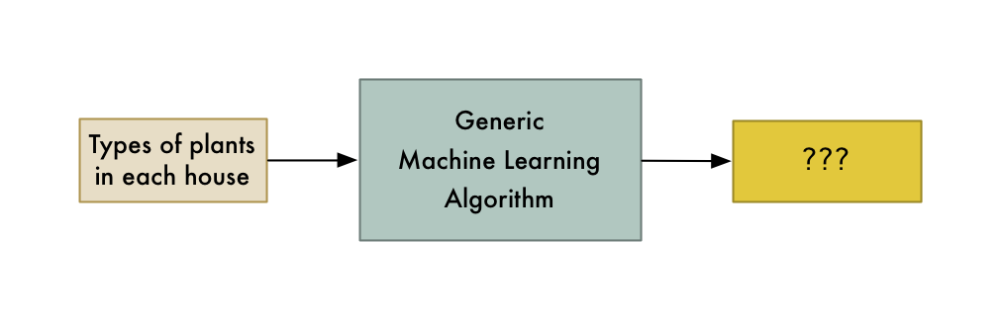

You can only model relationships that actually exist.

So remember, if a human expert couldn’t use the data to solve the problem manually, a computer probably won’t be able to either. Instead, focus on problems where a human could solve the problem, but where it would be great if a computer could solve it much more quickly.

### How to learn more about Machine Learning

In my mind, the biggest problem with machine learning right now is that it mostly lives in the world of academia and commercial research groups. There isn’t a lot of easy to understand material out there for people who would like to get a broad understanding without actually becoming experts. But it’s getting a little better every day.

If you want to try out what you’ve learned in this article, I made [a course that walks you through every step of this article, including writing all the code](https://www.lynda.com/Data-Science-tutorials/Machine-Learning-Essential-Training-Value-Estimations/548594-2.html?lpk35=9149&utm_medium=ldc-partner&utm_source=CMPRC&utm_content=524&utm_campaign=CD20575&bid=524&aid=CD20575). Give it a try!

If you want to go deeper, Andrew Ng’s free [Machine Learning class on Coursera](https://www.coursera.org/course/ml) is pretty amazing as a next step. I highly recommend it. It should be accessible to anyone who has a Comp. Sci. degree and who remembers a very minimal amount of math.

Also, you can play around with tons of machine learning algorithms by downloading and installing [SciKit-Learn](http://scikit-learn.org/stable/). It’s a python framework that has “black box” versions of all the standard algorithms.

* * *

If you liked this article, please consider signing up for my Machine Learning is Fun! Newsletter:

Also, please check out the [**full-length course version of this article**.](https://www.lynda.com/Data-Science-tutorials/Machine-Learning-Essential-Training-Value-Estimations/548594-2.html?lpk35=9149&utm_medium=ldc-partner&utm_source=CMPRC&utm_content=524&utm_campaign=CD20575&bid=524&aid=CD20575) It covers everything in this article in more detail, including writing the actual code in Python. You can get a free 30-day trial to watch the course [if you sign up with this link](https://www.lynda.com/trial/AdamGeitgey).

You can also follow me on Twitter at [@ageitgey](https://twitter.com/ageitgey), [email me directly](mailto:ageitgey@gmail.com) or [find me on linkedin](https://www.linkedin.com/in/ageitgey). I’d love to hear from you if I can help you or your team with machine learning.

_Now continue on to_ [_Machine Learning is Fun Part 2_](https://medium.com/@ageitgey/machine-learning-is-fun-part-2-a26a10b68df3)_!_

*   [Machine Learning](https://medium.com/tag/machine-learning?source=post)