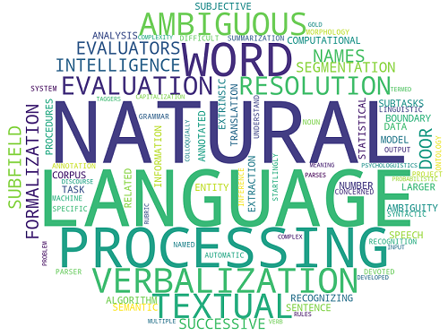
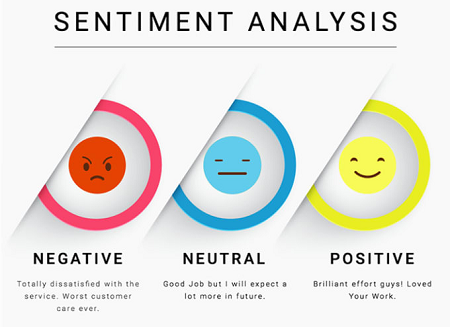
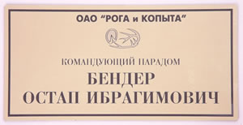
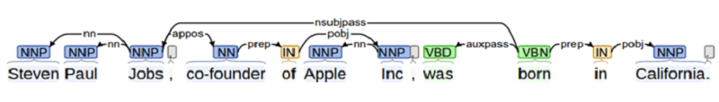
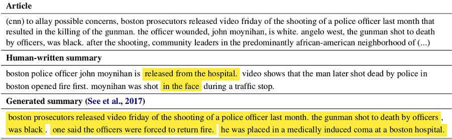
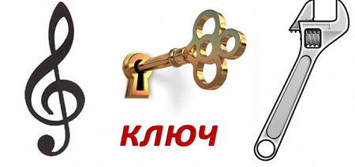
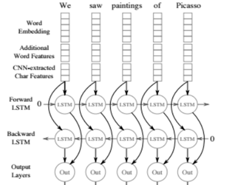
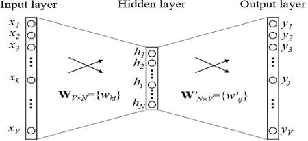
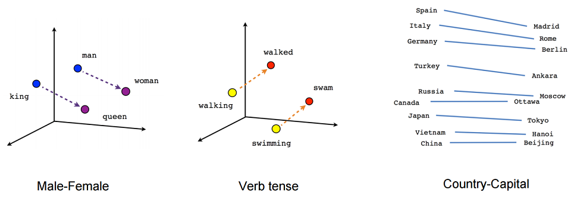

NLP. Основы. Техники. Саморазвитие. Часть 1 / Блог компании ABBYY

Привет! Меня зовут Иван Смуров, и я возглавляю группу исследований в области NLP в компании ABBYY. О том, чем занимается наша группа, можно почитать [здесь](https://habr.com/company/abbyy/blog/430730/). Недавно я читал лекцию про Natural Language Processing (NLP) в [Школе глубокого обучения](https://www.dlschool.org/) – это кружок при Физтех-школе прикладной математики и информатики МФТИ для старшеклассников, интересующихся программированием и математикой. Возможно, тезисы моей лекции кому-то пригодятся, поэтому поделюсь ими с Хабром.

Поскольку за один раз все объять не получится, разделим статью на две части. Сегодня я расскажу о том, как нейросети (или глубокое обучение) используются в NLP. Во второй части статьи мы сконцентрируемся на одной из самых распространенных задач NLP — задаче извлечения именованных сущностей (Named-entity recognition, NER) и разберем подробно архитектуры ее решений.

  

## Что такое NLP?  

Это широкий круг задач по обработке текстов на естественном языке (т. е. на языке, на котором говорят и пишут люди). Существует набор классических задач NLP, решение которых несет практическую пользу.

*   Первая и самая исторически важная задача – это машинный перевод. Ей занимаются очень давно, и есть огромный прогресс. Но задача получения полностью автоматического перевода высокого качества (FAHQMT) так и остается нерешенной. Это в каком-то смысле мотор NLP, одна из самых больших задач, которой можно заниматься.
    
    
    
*   Вторая задача — классификация текстов. Дан набор текстов, и задача – классифицировать эти тексты по категориям. Каким? Это вопрос к корпусу.
    
    Первый и один из самых важных с практической точки зрения способов применения — классификация писем на спам и хам (не спам).
    
    Другой классический вариант — многоклассовая классификация новостей по категориям (рубрикация) — внешняя политика, спорт, шапито и т. п. Или, допустим, вам приходят письма, и вы хотите отделить заказы из интернет-магазина от авиабилетов и броней отелей.
    
    Третий классический вариант применения задачи текстовой классификации — сентиментный анализ. Например, классификация отзывов на положительные, отрицательные и нейтральные.
    
    
    
      
    Поскольку возможных категорий, на которые можно делить тексты, можно придумать очень много, текстовая классификация является одной из самых популярных практических задач NLP.
*   Третья задача – извлечение именованных сущностей, NER. Мы выделяем в тексте участки, которые соответствуют заранее выбранному набору сущностей, например, надо найти в тексте все локации, персоны и организации. В тексте «Остап Бендер — директор конторы “Рога и Копыта”» вы должны понять, что Остап Бендер – это персона, а “Рога и Копыта”– это организация. Зачем эта задача нужна на практике и как ее решать, мы поговорим во второй части нашей статьи.
*   С третьей задачей связана четвертая — задача извлечения фактов и отношений (relation extraction). Например, есть отношение работы (Occupation). Из текста «Остап Бендер — директор конторы “Рога и Копыта”» ясно, что наш герой связан профессиональными отношениями с “Рогами и Копытами”. То же самое можно сказать множеством других способов: «Контору “Рога и Копыта” возглавляет Остап Бендер», или «Остап Бендер прошел путь от простого сына лейтенанта Шмидта до главы конторы “Рога и Копыта” ». Эти предложения отличаются не только предикатом, но и структурой.
    
    Примерами других часто выделяемых отношений являются отношения купли/продажи (Purchase and Sale), владения (Ownership), факт рождения с атрибутами — датой, местом и т. д. (Birth) и некоторые другие.
    
    Задача кажется не имеющей очевидного практического применения, но, тем не менее, она используется при структуризации неструктурированной информации. Кроме того, это важно в вопросно-ответных и диалоговых системах, в поисковиках — всегда, когда вам нужно анализировать вопрос и понимать, к какому типу он относится, а также, какие ограничения есть на ответ.
    
    
    
*   Две следующие задачи, возможно, самые хайповые. Это вопросно-ответные и диалоговые системы (чат-боты). Amazon Alexa, Алиса – это классические примеры диалоговых систем. Чтобы они нормально работали, должно быть решено много задач NLP. Например, текстовая классификация помогает определить, попадаем ли мы в один из сценариев goal-oriented чат-бота. Допустим, «вопрос о курсах валют». Relation extraction нужно для определения заполнителей шаблона сценария, а задача ведения диалога на общие темы (“болталки”) поможет нам в ситуации, когда мы не попали ни в один из сценариев.
    
    Вопросно-ответные системы — тоже понятная и полезная вещь. Вы задаете машине вопрос, машина ищет ответ на него в базе данных или корпусе текстов. Примерами таких систем могут являться IBM Watson или Wolfram Alpha.
    
*   Еще один пример классической задачи NLP — саммаризация. Формулировка задачи простая — на вход система принимает текст большого размера, а выходом служит текст меньшего размера, каким-то образом отражающий содержание большого. Например, от машины требуется сгенерировать пересказ текста, его название или аннотацию.
    
    
    
*   Еще одна популярная задача – argumentation mining, поиск обоснования в тексте. Вам приводят факт и текст, вам нужно найти обоснование данного факта в тексте.

Это безусловно не весь список задач NLP. Их десятки. По большому счету, все, что можно делать с текстом на естественном языке, можно отнести к задачам NLP, просто перечисленные темы на слуху, и у них есть наиболее очевидные практические применения.

## Почему решать задачи NLP сложно?  

Формулировки задач не очень сложные, однако сами задачи вовсе не являются простыми, потому что мы работаем с естественным языком. Явления полисемии (многозначные слова имеют общий исходный смысл) и омонимии (разные по смыслу слова произносятся и пишутся одинаково) характерны для любого естественного языка. И если носитель русского хорошо понимает, что в _теплом приеме_ мало общего с _боевым приемом_, с одной стороны, и _теплым пивом_, с другой, автоматической системе приходится долго этому учиться. Почему «_Press space bar to continue_» лучше перевести скучным «_Для продолжения нажмите пробел_», чем «_Бар космической прессы продолжит работу_».

*   Полисемия: остановка (процесс или здание), стол (организация или объект), дятел (птица или человек).
*   Омонимия: ключ, лук, замок, печь.
    
    
    
*   Другим классическим примером сложности языка является местоименная анафора. Например, пусть нам дан текст «_Дворник два часа мел снег, он был недоволен_». Местоимение «он» может относиться как к дворнику, так и к снегу. По контексту мы легко понимаем, что он – это дворник, а не снег. Но добиться, чтобы компьютер это тоже легко понимал, непросто. Задача местоименной анафоры и сейчас решена не очень хорошо, активные попытки улучшить качество решений продолжаются.
*   Еще одна дополнительная сложность – это эллипсис. Например, «_Петя съел зеленое яблоко, а Маша – красное_». Мы понимаем, что Маша съела красное яблоко. Тем не менее, добиться, чтобы машина тоже поняла это, непросто. Сейчас задача восстановления эллипсиса решается на крошечных корпусах (несколько сотен предложений), и на них качество полного восстановления откровенно слабое (порядка 0.5). Понятно, что для практических применений такое качество никуда не годится.

Кстати, в этом году на конференции «[Диалог](http://www.dialog-21.ru/)» состоятся дорожки и по анафоре, и по гэппингу (виду эллиписа) для русского языка. Для обеих задач были собраны корпуса объемом, в несколько раз превышающим объемы существующих на данный момент корпусов (причем, для гэппинга объем корпуса на порядок превосходит объемы корпусов не только для русского, но и вообще для всех языков). Если вы хотите поучаствовать в соревнованиях на этих корпусах, [жмите сюда (с регистрацией, но без смс)](http://www.dialog-21.ru/evaluation/).

## Как решают задачи NLP  

В отличие от обработки изображений, по NLP до сих пор можно встретить статьи, где описываются решения, использующие не нейросетки, а классические алгоритмы типа [SVM](https://ru.wikipedia.org/wiki/%D0%9C%D0%B5%D1%82%D0%BE%D0%B4_%D0%BE%D0%BF%D0%BE%D1%80%D0%BD%D1%8B%D1%85_%D0%B2%D0%B5%D0%BA%D1%82%D0%BE%D1%80%D0%BE%D0%B2) или [Xgboost](https://ru.bmstu.wiki/XGBoost), и показывающие результаты, не слишком сильно уступающие state-of-the-art решениям.

Тем не менее, несколько лет назад нейросети начали побеждать классические модели. Важно отметить, что для большинства задач решения на основе классических методов были уникальные, как правило, не похожие на решения других задач как по архитектуре, так и по тому, как происходит сбор и обработка признаков.

Однако нейросетевые архитектуры намного более общие. Архитектура самой сети, скорее всего, тоже отличается, но намного меньше, идет тенденция в сторону полной универсализации. Тем не менее, то, с какими признаками и как именно мы работаем, уже практически одинаково для большинства задач NLP. Отличаются только последние слои нейросеток. Таким образом, можно считать, что сформировался единый пайплайн NLP. Про то, как он устроен, мы сейчас расскажем подробнее.

## Pipeline NLP

Этот способ работы с признаками, который более-менее одинаков для всех задач.

Когда речь идет о языке, основная единица, с которой мы работаем, это слово. Или более формально «токен». Мы используем этот термин, потому что не очень понятно, что такое 2128506 — это слово или нет? Ответ не очевиден. Токен обычно отделен от других токенов пробелами или знаками препинания. И как можно понять из сложностей, которые мы описали выше, очень важен контекст каждого токена. Есть разные подходы, но в 95% случаев таким контекстом, который рассматривается при работе модели, выступает предложение, включающее исходный токен.

Многие задачи вообще решаются на уровне предложения. Например, машинный перевод. Чаще всего, мы просто переводим одно предложение и никак не используем контекст более широкого уровня. Есть задачи, где это не так, например, диалоговые системы. Тут важно помнить, о чем систему спрашивали раньше, чтобы она могла ответить на вопросы. Тем не менее, предложение — тоже основная единица, с которой мы работаем.

Поэтому первые два шага пайплайна, которые выполняются практически для решения любых задач – это сегментация (деление текста на предложения) и токенизация (деление предложений на токены, то есть отдельные слова). Это делается несложными алгоритмами.

Дальше нужно вычислить признаки каждого токена. Как правило, это происходит в два этапа. Первый – вычислить контекстно-независимые признаки токена. Это набор признаков, которые никак не зависят от окружающих наш токен других слов. Обычные контекстно-независимые признаки – это:

*   эмбеддинги
*   символьные признаки
*   дополнительные признаки, специальные для конкретной задачи или языка

Про эмбеддинги и символьные признаки мы поговорим подробно дальше (про символьные признаки — не сегодня, а во второй части нашей статьи), а пока давайте приведем возможные примеры дополнительных признаков.

Один из самых часто использующихся признаков — часть речи или POS-тег (part of speech). Такие признаки могут быть важны для решения многих задач, например задачи синтаксического парсинга. Для языков со сложной морфологией, типа русского языка, также важны морфологические признаки: например, в каком падеже стоит существительное, какой род у прилагательного. Из этого можно сделать разные выводы о структуре предложения. Также, морфология нужна для лемматизации (приведения слов к начальным формам), с помощью которой мы можем сократить размерность признакового пространства, и поэтому морфологический анализ активно используется для большинства задач NLP.

Когда мы решаем задачу, где важно взаимодействие между различными объектами (например, в задаче relation extraction или при создании вопросно-ответной системы), нам нужно многое знать про структуру предложения. Для этого нужен синтаксический разбор. В школе все делали разбор предложения на подлежащее, сказуемое, дополнение и др. Синтаксический разбор – это что-то в этом духе, но сложнее.

Еще одним примером дополнительного признака является позиция токена в тексте. Мы можем априори знать, что какая-то сущность чаще встречается в начале текста или наоборот в конце.

Все вместе – эмбеддинги, символьные и дополнительные признаки – формируют вектор признаков токена, который не зависит от контекста.

## Контекстно-зависимые признаки

Контекстно-зависимые признаки токена — это набор признаков, который содержит информацию не только про сам токен, но и про его соседей. Есть разные способы вычислить эти признаки. В классических алгоритмах люди часто просто шли «окном»: брали несколько (например, три) токенов до исходного и несколько токенов после, а затем вычисляли все признаки в таком окне. Такой подход ненадежен, так как важная информация для анализа может находиться на расстоянии, превышающем окно, соответственно, мы можем что-то пропустить.

Поэтому сейчас все контекстно-зависимые признаки вычисляются на уровне предложения стандартным образом: с помощью двухсторонних рекуррентных нейросетей LSTM или GRU. Чтобы получить контекстно-зависимые признаки токена из контекстно-независимых, контекстно-независимые признаки всех токенов предложения подаются в Bidirectional RNN (одно- или несколько- слойный). Выход Bidirectional RNN в i-ый момент времени и является контекстно-зависимым признаком i-того токена, который содержит информацию как о предыдущих токенах (т.к. эта информация содержится в i-м значении прямого RNN), так и о последующих (т.к. эта информация содержится в соответствующем значении обратного RNN).

Дальше для каждой отдельной задачи мы делаем что-то свое, но первые несколько слоев — вплоть до Bidirectional RNN можно использовать для практически любых задач.

Такой способ получения признаков и называется пайплайном NLP.

Стоит отметить, что в последние 2 года исследователи активно пытаются усовершенствовать пайплайн NLP — как с точки зрения быстродействия (например, transformer — архитектура, основанная на self-attention, не содержит в себе RNN и поэтому способна быстрее обучаться и применяться), так и с точки зрения используемых признаков (сейчас активно используют признаки на основе предобученных языковых моделей, например [ELMo](https://arxiv.org/pdf/1802.05365.pdf), или используют первые слои предобученной языковой модели и дообучают их на имеющемся для задачи корпусе — [ULMFit](https://arxiv.org/pdf/1801.06146.pdf), [BERT](https://arxiv.org/pdf/1810.04805.pdf)).

## Словоформенные эмбеддинги  

Давайте подробнее разберем, что же такое эмбеддинг. Грубо говоря, эмбеддинг — это сжатое представление о контексте слова. Почему важно знать контекст слова? Потому что мы верим в дистрибутивную гипотезу — что похожие по смыслу слова употребляются в сходных контекстах.

Давайте теперь попытаемся дать строгое определение эмбеддинга. Эмбеддинг – это отображение из дискретного вектора категориальных признаков в непрерывный вектор с заранее заданной размерностью.

Каноничный пример эмбеддинга – это эмбеддинг слова (словоформенный эмбеддинг).

Что обычно выступает в роли дискретного вектора признаков? Булев вектор, соответствующий всевозможным значениям какой-то категории (например, все возможные части речи или все возможные слова из какого-то ограниченного словаря).

Для словоформенных эмбеддингов такой категорией обычно выступает индекс слова в словаре. Допустим, есть словарь размерностью 100 тысяч. Соответственно, каждое слово имеет дискретный вектор признаков – булев вектор размерности 100 тысяч, где на одном месте (индексе данного слова в нашем словаре) стоит единичка, а на остальных – нули.

Почему мы хотим отображать наши дискретные вектора признаков в непрерывные заданной размерности? Потому что вектора размерностью 100 тысяч не очень удобно использовать для вычислений, а вот вектора целых чисел размерности 100, 200 или, например, 300, — намного удобнее.

В принципе, мы можем не пытаться накладывать никаких дополнительных ограничений на такое отображение. Но раз уж мы строим такое отображение, давайте попытаемся добиться, чтобы вектора похожих по смыслу слов также были в каком-то смысле близки. Это делается с помощью простой feed-forward нейросетки.

## Обучение эмбеддингов  

Как эмбеддинги обучаются? Мы пытаемся решить задачу восстановления слова по контексту (или наоборот, восстановления контекста по слову). В простейшем случае мы получаем на вход индекс в словаре предыдущего слова (булев вектор размерности словаря) и пытаемся определить индекс в словаре нашего слова. Делается это с помощью сетки с предельно простой архитектурой: два полносвязных слоя. Сначала идет полносвязный слой из булева вектора размерности словаря в скрытый слой размерности эмбеддинга (т.е. просто умножение булева вектора на матрицу нужной размерности). А потом наоборот, полносвязный слой с softmax из скрытого слоя размерности эмбеддинга в вектор размерности словаря. Благодаря функции активации softmax, мы получаем распределение вероятностей нашего слова и можем выбрать самый вероятный вариант.

_Эмбеддингом i-го слова будет просто i-я строка в матрице перехода W._

В используемых на практике моделях архитектура сложнее, но ненамного. Главное отличие в том, что мы используем не один вектор из контекста для определения нашего слова, а несколько (например, все в окне размера 3). Несколько более популярным вариантом является ситуация, когда мы пытаемся предсказать не слово по контексту, а наоборот контекст по слову. Такой подход называется Skip-gram.

Давайте приведем пример применения задачи, которая решается во время обучения эмбеддингов (в варианте CBOW — предсказания слова по контексту). Например, пусть контекст токена состоит из 2 предыдущих слов. Если мы обучались на корпусе текстов про современную русскую литературу и контекст состоит из слов “поэт Марина”, то, скорее всего, самым вероятным следующим словом будет слово “Цветаева”.

Подчеркнем еще раз, эмбеддинги только обучаются на задаче предсказания слова по контексту (или наоборот контекста по слову), а применять их можно в любых ситуациях, когда нам нужно вычислить признак токена.

Какой бы вариант мы ни выбрали, архитектура эмбеддингов очень несложная, и их большой плюс в том, что их можно обучать на неразмеченных данных (действительно, мы используем только информацию о соседях нашего токена, а для их определения нужен только сам текст). Получившиеся эмбеддинги — усредненный контекст именно по такому корпусу.

Эмбеддинги словоформ, как правило, обучаются на максимально большом и доступном для обучения корпусе. Обычно это вся Википедия на языке, потому что ее всю можно выкачать, и любые другие корпуса, которые получится достать.

Похожие соображения используются и при предобучении для современных архитектур, упомянутых выше — ELMo, ULMFit, BERT. Они тоже используют при обучении неразмеченные данные, и поэтому обучаются на максимально большом доступном корпусе (хотя сами архитектуры, конечно, сложнее, чем у классических эмбеддингов).

## Зачем нужны эмбеддинги?  

Как уже было упомянуто, для использования эмбеддингов есть 2 основные причины.

*   Во-первых, мы уменьшаем размерность пространства признаков, потому что с непрерывными векторами размерностью несколько сотен работать намного удобнее, чем с признаками-булевыми векторами размерностью 100 тысяч. Уменьшение размерности признакового пространства – это очень важно: оно сказывается на быстродействии, это удобнее для обучения, и поэтому алгоритмы обучаются лучше.
*   Во-вторых, учет близости элементов в исходном пространстве. Слова похожи друг на друга по-разному. И разные координаты эмбеддингов способны ловить эту схожесть. Приведу простой грубый и набивший всем оскомину пример. Эмбеддинг вполне способен уловить, что король отличается от королевы примерно так же, как мужчина от женщины. Или наоборот, король отличается от мужчины, как королева от женщины. Точно так же схожи связи разных стран со своими столицами. Хорошо обученная модель на достаточно большом корпусе способна понять, что Москва отличается от России тем же, чем Вашингтон от США.

Но не нужно думать, что такая векторная арифметика работает надежно. В [статье](https://arxiv.org/pdf/1301.3781.pdf), где были введены эмбеддинги, были примеры, что Ангела относится к Меркель примерно так же, как Барак к Обаме, Николя к Саркози и Путин к Медведеву. Поэтому полагаться на эту арифметику не стоит, хотя это все равно важно, и компьютеру намного проще, когда он знает эту информацию, пусть она и содержит неточности.

В следующей части нашей статьи мы поговорим о задаче NER. Мы расскажем о том, что это за задача, зачем она нужна и какие подводные камни могут скрываться в ее решении. Мы расскажем подробно про то, как эту задачу решали с помощью классических методов, как ее стали решать с помощью нейросетей, и опишем современные архитектуры, созданные для ее решения.