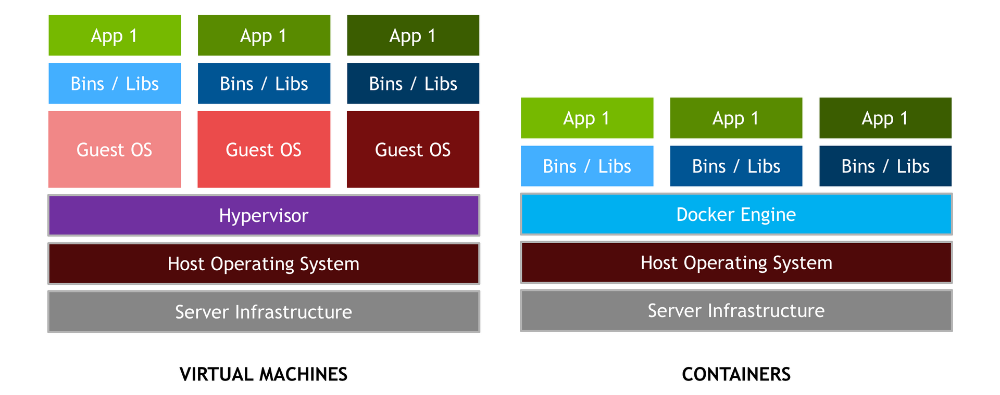
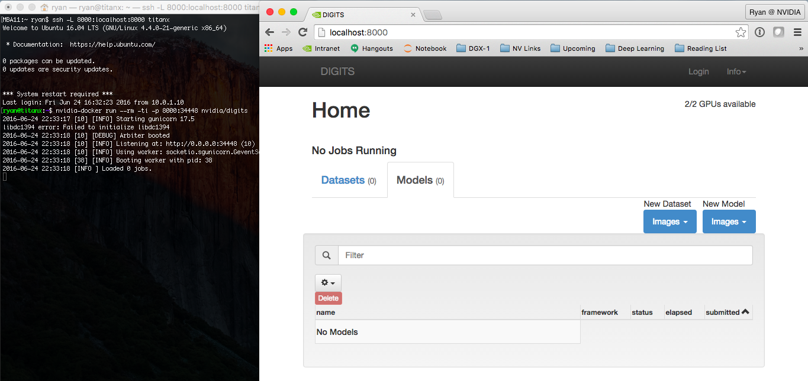

NVIDIA Docker: GPU Server Application Deployment Made Easy

Over the last few years there has been a dramatic rise in the use of containers for deploying data center applications at scale. The reason for this is simple: containers encapsulate an application’s dependencies to provide reproducible and reliable execution of applications and services without the overhead of a full virtual machine. If you have ever spent a day provisioning a server with a multitude of packages for a scientific or [deep learning](https://developer.nvidia.com/deep-learning) application, or have put in weeks of effort to ensure your application can be built and deployed in multiple linux environments, then Docker containers are well worth your time.

Figure 1: Docker containers encapsulate applications’ dependencies to provide reproducible and reliable execution. The NVIDIA Docker plugin enables deployment of GPU-accelerated applications across any Linux GPU server with NVIDIA Docker support.

At NVIDIA, we use containers in a variety of ways including development, testing, benchmarking, and of course in production as the mechanism for deploying deep learning frameworks through the NVIDIA DGX-1’s Cloud Managed Software. Docker has been game-changing in how we manage our workflow. Using Docker, we can develop and prototype GPU applications on a workstation, and then ship and run those applications anywhere that supports GPU containers.

In this article, we will introduce Docker containers; explain the benefits of the NVIDIA Docker plugin; walk through an example of building and deploying a simple CUDA application; and finish by demonstrating how you can use NVIDIA Docker to run today’s most popular deep learning applications and frameworks including DIGITS, Caffe, and TensorFlow.

Last week at [DockerCon 2016](http://2016.dockercon.com/), Felix and Jonathan presented a talk “Using Docker for GPU-Accelerated Applications”. Here are the slides.

## Introduction to Docker

A Docker container is a mechanism for bundling a Linux application with all of its libraries, data files, and environment variables so that the execution environment is always the same, on whatever Linux system it runs and between instances on the same host. Docker containers are user-mode only, so all kernel calls from the container are handled by the host system kernel. [On its web site](https://www.docker.com/what-docker), Docker describes containers this way:

> Docker containers wrap a piece of software in a complete filesystem that contains everything needed to run: code, runtime, system tools, system libraries – anything that can be installed on a server. This guarantees that the software will always run the same, regardless of its environment.

It’s important to distinguish containers and hypervisor-based virtual machines (VMs). VMs allow multiple copies of the operating system, or even multiple different operating systems, to share a machine. Each VM can host and run multiple applications. By comparison, a container is designed to virtualize a single application, and all containers deployed on a host share a single OS kernel, as Figure 2 shows. Typically, containers spin up faster, run the application with bare-metal performance, and are simpler to manage since there is no additional overhead to making an OS kernel call.

Figure 2: While VMs encapsulate the entire OS and any applications, containers encapsulate individual applications and their dependencies for portable deployment, but share the same host OS between containers.

Docker provides both hardware and software encapsulation by allowing multiple containers to run on the same system at the same time each with their own set of resources (CPU, memory, etc) and their own dedicated set of dependencies (library version, environment variables, etc.). Docker also provides portable Linux deployment: Docker containers can be run on any Linux system with kernel is 3.10 or later.  All major Linux distros have supported Docker since 2014. Encapsulation and portable deployment are valuable to both the developers creating and testing applications and the operations staff who run them in data centers.

Docker provides many more important features.

*   Docker’s powerful command-line tool, \`docker build\`, creates Docker images from source code and binaries, using the description provided in a “Dockerfile”.
*   Docker’s component architecture allows one container image to be used as a base for other containers.
*   Docker provides automatic versioning and labeling of containers, with optimized assembly and deployment. Docker images are assembled from versioned layers so that only the layers missing on a server need to be downloaded.
*   Docker Hub is a service that makes it easy to share docker images publicly or privately.
*   Containers can be constrained to a limited set of resources on a system (e.g one CPU core and 1GB of memory).

Docker provides a [layered file system](https://docs.docker.com/engine/userguide/storagedriver/imagesandcontainers/) that conserves disk space and forms the basis for extensible containers.

## Why NVIDIA Docker?

Docker containers are platform-agnostic, but also hardware-agnostic. This presents a problem when using specialized hardware such as NVIDIA GPUs which require kernel modules and user-level libraries to operate.  As a result, Docker does not natively support NVIDIA GPUs within containers.

One of the early work-arounds to this problem was to fully install the NVIDIA drivers inside the container and map in the character devices corresponding to the NVIDIA GPUs (e.g. `/dev/nvidia0`) on launch. This solution is brittle because the version of the host driver must exactly match the version of the driver installed in the container. This requirement drastically reduced the portability of these early containers, undermining one of Docker’s more important features.

To enable portability in Docker images that leverage NVIDIA GPUs, we developed [`nvidia-docker`](https://github.com/NVIDIA/nvidia-docker), an open-source project hosted on Github that provides the two critical components needed for portable GPU-based containers:

1.  driver-agnostic CUDA images; and
2.  a Docker command line wrapper that mounts the user mode components of the driver and the GPUs (character devices) into the container at launch.

`nvidia-docker` is essentially a wrapper around the `docker` command that transparently provisions a container with the necessary components to execute code on the GPU. It is only absolutely necessary when using `nvidia-docker` run to execute a container that uses GPUs. But for simplicity in this post we use it for all Docker commands.

## Installing Docker and NVIDIA Docker

Before we can get started building containerized GPU applications, let’s make sure you have the prerequisite software installed and working properly. You will need:

*   Up-to-date [NVIDIA drivers](http://www.nvidia.com/drivers) for your system.
*   Docker. You can follow the [installation instructions here](https://docs.docker.com/engine/installation/).
*   \`nvidia-docker\` You can follow the [installation instructions here](https://github.com/NVIDIA/nvidia-docker#quick-start).

To help with the installation, we have created an [ansible role to perform the docker and nvidia-docker install](https://galaxy.ansible.com/ryanolson/nvidia-docker/). [Ansible](https://www.ansible.com/) is a tool for automating configuration management of machines and deployment of applications.

To test that you are ready to go, run the following command. You should see output similar to what is shown.

ryan@titanx:~$ nvidia-docker run --rm hello-world Using  default tag: latest
latest:  Pulling  from library/hello-world
a9d36faac0fe:  Pull complete Digest: sha256:e52be8ffeeb1f374f440893189cd32f44cb166650e7ab185fa7735b7dc48d619 Status:  Downloaded newer image for hello-world:latest Hello  from  Docker.  This message shows that your installation appears to be working correctly.  \[... simplified output ...\]

Now that everything is working, let’s get started with building a simple GPU application in a container.

## Build Containerized GPU Applications

To highlight the features of Docker and our plugin, I will build the `deviceQuery` application from the CUDA Toolkit samples in a container. This three-step method can be applied to any of the CUDA samples or to your favorite application with minor changes.

1.  Set up and explore the development environment inside a container.
2.  Build the application in the container.
3.  Deploy the container in multiple environments.

### Development Environment

The Docker equivalent of installing the CUDA development libraries is the following command:

nvidia-docker pull nvidia/cuda

This command pulls the latest version of the `nvidia/cuda` image from Docker Hub, which is a cloud storage service for container images. Commands can be executed in this container using `docker run`. The following is an invocation of `nvcc --version` in the container we just pulled.

ryan@titanx:~$ nvidia-docker run --rm -ti nvidia/cuda nvcc --version
nvcc: NVIDIA (R)  Cuda compiler driver Copyright  (c)  2005-2015 NVIDIA Corporation  Built on Tue\_Aug\_11_14:27:32\_CDT\_2015 Cuda compilation tools, release 7.5, V7.5.17

If you need CUDA 6.5 or 7.0, you can specify [a tag for the image](https://docs.docker.com/engine/reference/commandline/tag/). A list of available CUDA images for Ubuntu and CentOS can be found on the [nvidia-docker wiki](https://github.com/NVIDIA/nvidia-docker/wiki/CUDA). Here is a similar example using CUDA 7.0.

ryan@titanx:~$ nvidia-docker run --rm -ti nvidia/cuda:7.0 nvcc --version Unable to find image 'nvidia/cuda:7.0' locally 7.0:  Pulling  from nvidia/cuda 6c953ac5d795:  Already exists \[  … simplified layers -- ubuntu base image …  \]  68bad08eb200:  Pull complete \[  … simplified layers -- cuda 7.0 toolkit …  \]  Status:  Downloaded newer image for nvidia/cuda:7.0 nvcc: NVIDIA (R)  Cuda compiler driver Copyright  (c)  2005-2015 NVIDIA Corporation  Built on Mon\_Feb\_16_22:59:02\_CST\_2015 Cuda compilation tools, release 7.0, V7.0.27

Since only the `nvidia/cuda:7.5` image is locally present on the system, the `docker run` command above folds the pull and run operations together. You’ll notice that the pull of the `nvidia/cuda:7.0` image is faster than the pull of the 7.5 image. This is because both container images share the same base Ubuntu 14.04 image, which is already present on the host. Docker caches and reuses image layers, so only the new layers needed for the CUDA 7.0 toolkit are downloaded. This is an important point: Docker images are built layer-by-layer and the layers can be shared with multiple images to save disk space on the host (as well as deployment time). This extensibility of Docker images is a powerful feature that we will explore later in the article. (Read more about [Docker’s layered filesystem](https://docs.docker.com/engine/userguide/storagedriver/imagesandcontainers)).  

Finally, you can explore the development image by running a container that executes a bash shell.

nvidia-docker run --rm -ti nvidia/cuda:7.5 bash

Feel free to play around in this sandboxed environment. You can install packages via `apt` or examine the CUDA libraries in `/usr/local/cuda`, but note that any changes you make to the running container will be lost when you exit (`ctrl + d` or the `exit` command).

This non-persistence is in fact a feature of Docker.  Every instance of a Docker container starts from the same initial state defined by the image.  In the next section we will look at a mechanism for extending and adding new content to an image.

### Building an Application

Let’s build the `deviceQuery` application in a container by extending the CUDA image with layers for the application. One mechanism used for defining layers is the `Dockerfile`. The `Dockerfile` acts as a blueprint in which each instruction in the file adds a new layer to the image. Let’s look at the `Dockerfile` for the `deviceQuery` application.

\# FROM defines the base image FROM nvidia/cuda:7.5  \# RUN executes a shell command  \# You can chain multiple commands together with &&  \# A \ is used to split long lines to help with readability  \# This particular instruction installs the source files  \# for deviceQuery by installing the CUDA samples via apt RUN apt-get update && apt-get install -y --no-install-recommends \
        cuda-samples-$CUDA\_PKG\_VERSION && \
    rm -rf /var/lib/apt/lists/*

\# set the working directory 
WORKDIR /usr/local/cuda/samples/1_Utilities/deviceQuery

RUN make

\# CMD defines the default command to be run in the container 
\# CMD is overridden by supplying a command + arguments to 
\# \`docker run\`, e.g. \`nvcc --version\` or \`bash\`
CMD ./deviceQuery

For a full list of available `Dockerfile` instructions see the [Dockerfile reference page](https://docs.docker.com/engine/reference/builder/).

Run the following `docker build` command in a folder with only the Dockerfile to build the application’s container image from the Dockerfile blueprint.

nvidia-docker build -t device-query .

This command generates a docker container image named `device-query` which inherits all the layers from the CUDA 7.5 development image.

### Running a Containerized CUDA Application

We are now ready to execute the `device-query` container on the GPU.  By default, `nvidia-docker` maps all of the GPUs on the host into the container.

ryan@titanx:~$ nvidia-docker run --rm -ti device-query ./deviceQuery Starting... CUDA Device  Query  (Runtime API) version (CUDART static linking)  Detected  2 CUDA Capable device(s)  Device  0:  "GeForce GTX TITAN X" CUDA Driver  Version  /  Runtime  Version  8.0  /  7.5 CUDA Capability  Major/Minor version number:  5.2  Total amount of global memory:  12287  MBytes  (12883345408 bytes)  (24)  Multiprocessors,  (128) CUDA Cores/MP:  3072 CUDA Cores  \[... simplified output …\]  Device  1:  "GeForce GTX TITAN X" CUDA Driver  Version  /  Runtime  Version  8.0  /  7.5 CUDA Capability  Major/Minor version number:  5.2  Total amount of global memory:  12288  MBytes  (12884705280 bytes)  (24)  Multiprocessors,  (128) CUDA Cores/MP:  3072 CUDA Cores  \[... simplified output …\]  >  Peer access from  GeForce GTX TITAN X (GPU0)  ->  GeForce GTX TITAN X (GPU1)  :  Yes  >  Peer access from  GeForce GTX TITAN X (GPU1)  ->  GeForce GTX TITAN X (GPU0)  :  Yes deviceQuery, CUDA Driver  = CUDART, CUDA Driver  Version  =  8.0, CUDA Runtime  Version  =  7.5,  NumDevs  =  2,  Device0  =  GeForce GTX TITAN X,  Device1  =  GeForce GTX TITAN X Result  = PASS

`nvidia-docker` also provides resource isolation capabilities through the `NV_GPU` environment variable. The following example runs the `device-query` container on GPU 1.

ryan@titanx:~$ NV_GPU=1 nvidia-docker run --rm -ti device-query ./deviceQuery Starting... CUDA Device  Query  (Runtime API) version (CUDART static linking)  Detected  1 CUDA Capable device(s)  Device  0:  "GeForce GTX TITAN X" CUDA Driver  Version  /  Runtime  Version  8.0  /  7.5 CUDA Capability  Major/Minor version number:  5.2  Total amount of global memory:  12288  MBytes  (12884705280 bytes)  (24)  Multiprocessors,  (128) CUDA Cores/MP:  3072 CUDA Cores  \[... simplified output …\] deviceQuery, CUDA Driver  = CUDART, CUDA Driver  Version  =  8.0, CUDA Runtime  Version  =  7.5,  NumDevs  =  1,  Device0  =  GeForce GTX TITAN X Result  = PASS

Because we only mapped GPU 1 into the container, the `deviceQuery` application can only see and report on one GPU. Resource isolation allows you to specify which GPUs your containerized application is allowed to use. For best performance, make sure to account for the topology of the PCI tree when selecting a subset of GPUs. (To better understand the importance of the PCIe topology for multi-GPU performance see this [blog post about efficient collective communication with the NCCL library](https://devblogs.nvidia.com/parallelforall/fast-multi-gpu-collectives-nccl/).)

### Deploying a GPU Container

In our example so far, we built and ran `device-query` on a workstation with two NVIDIA Titan X GPUs. Now, let’s deploy that container on a DGX-1 server. Deploying a container is the process of moving the container images from where they are built to where they will be run. One of a variety of ways to deploy a container is [Docker Hub](https://hub.docker.com/), a cloud service used to host container images similar to how Github hosts git repositories.  The `nvidia/cuda` images we used to build `device-query` are hosted by Docker Hub.

Before we can push `device-query` to Docker Hub, we need to tag it with the a Docker Hub username/account.

ryan@titanx:~$ nvidia-docker tag device-query ryanolson/device-query

Now pushing the tagged images to Docker Hub is simple.

ryan@titanx:~/docker/blog-post$ nvidia-docker push ryanolson/device-query The push refers to a repository \[docker.io/ryanolson/device-query\]  35f4e4c58e9f:  Pushed  170db279f3a6:  Pushed  3f6d94182a7e:  Mounted  from nvidia/cuda \[  … simplifed multiple ‘from nvidia/cuda’ layers …  \]

For alternatives to using Docker Hub or other container hosting repositories, check out the [`docker save`](https://docs.docker.com/engine/reference/commandline/save/) and [`docker load`](https://docs.docker.com/engine/reference/commandline/load/) commands.

The `device-query` image we pushed to Docker Hub is now available to any docker-enabled server in the world. To deploy `device-query` on the DGX-1 in my lab, I simply pull and run the image. This example uses the CUDA 8.0 release candidate, which you can access now by joining the [NVIDIA Accelerated Computing Developer Program](https://developer.nvidia.com/accelerated-computing-developer).

lab@dgx-1-07:~$ nvidia-docker run --rm -ti ryanolson/device-query Using  default tag: latest
latest:  Pulling  from ryanolson/device-query 6c953ac5d795:  Already exists \[  … simplified multiple ‘already exists’ layers …  \]  1cc994928295:  Pull complete 
a9e6b6393938:  Pull complete Digest: sha256:0b42703a0785cf5243151b8cba7cc181a6c20a3c945a718ce712476541fe4d70  Status:  Downloaded newer image for ryanolson/device-query:latest ./deviceQuery Starting... CUDA Device  Query  (Runtime API) version (CUDART static linking)  Detected  8 CUDA Capable device(s)  Device  0:  "Tesla P100-SXM2-16GB" CUDA Driver  Version  /  Runtime  Version  8.0  /  7.5 CUDA Capability  Major/Minor version number:  6.0  Total amount of global memory:  16281  MBytes  (17071669248 bytes)  (56)  Multiprocessors,  (64) CUDA Cores/MP:  3584 CUDA Cores  \[... simplified output …  \]  Device  7:  "Tesla P100-SXM2-16GB" CUDA Driver  Version  /  Runtime  Version  8.0  /  7.5 CUDA Capability  Major/Minor version number:  6.0  Total amount of global memory:  16281  MBytes  (17071669248 bytes)  (56)  Multiprocessors,  (64) CUDA Cores/MP:  3584 CUDA Cores  \[  … simplified output …  \] deviceQuery, CUDA Driver  = CUDART, CUDA Driver  Version  =  8.0, CUDA Runtime  Version  =  7.5,  NumDevs  =  8,  Device0  =  Tesla P100-SXM2-16GB,  Device1  =  Tesla P100-SXM2-16GB,  Device2  =  Tesla P100-SXM2-16GB,  Device3  =  Tesla P100-SXM2-16GB,  Device4  =  Tesla P100-SXM2-16GB,  Device5  =  Tesla P100-SXM2-16GB,  Device6  =  Tesla P100-SXM2-16GB,  Device7  =  Tesla P100-SXM2-16GB  Result  = PASS

## Docker for Deep Learning and HPC

Now that you have seen how easy it is to build and run a simple CUDA application, how hard is it to run a more complex application like DIGITS or Caffe? What if I told you it was as easy as a single command?

nvidia-docker run --name digits --rm -ti -p 8000:34448 nvidia/digits

This command launches the `nvidia/digits` container and maps port 34448 in the container which is running the DIGITS web service to port 8000 on the host.

If you run that command on the same machine on which you are reading this, then try opening [http://localhost:8000](http://localhost:8000/) now. If you executed the `nvidia-docker` command on a remote machine, you will need to access port 8000 on that machine. Just replace `localhost` with the hostname or IP address of the remote server if you can access it directly.

With one command, you have NVIDIA’s DIGITS platform up and running and accessible from a browser, as Figure 3 shows.

Figure 3. This screenshot shows a local web browser connecting to DIGITS running in a container on a remote host, using ssh tunneling to forward localhost:8000 to port 8000 on the remote host running the container. (Click for a larger screenshot.)

This is why we love Docker at NVIDIA. As developers of open-source software like DIGITS, we want users like you to be able to use our latest software with minimal effort.

And we’re not the only ones: Google and Microsoft use our CUDA images as the base images for TensorFlow and CNTK, respectively.  Google [provides pre-built Docker images of TensorFlow](https://www.tensorflow.org/versions/r0.9/get_started/os_setup.html#docker-installation) through their public container repository, and Microsoft [provides a Dockerfile for CNTK](https://github.com/Microsoft/CNTK/blob/master/Tools/docker/CNTK-GPU-Image/Dockerfile) that you can build yourself.

Let’s see how easy it is to launch a more complex application like TensorFlow which requires Numpy, Bazel and myriad other dependencies. Yep, it’s just a single line! You don’t even need to download and build TensorFlow, you can use the image provided on Docker Hub directly.

nvidia-docker run --rm -ti tensorflow/tensorflow:r0.9-devel-gpu

After running this command, you can test TensorFlow by running its included MNIST training script:

nvidia-docker run --rm -ti tensorflow/tensorflow:r0.9-devel-gpu
root@ab5f46ba17d2:~# python -m tensorflow.models.image.mnist.convolutional \[tensorflow/stream_executor/dso_loader.cc:108\] successfully opened CUDA library libcublas.so locally \[tensorflow/stream_executor/dso_loader.cc:108\] successfully opened CUDA library libcudnn.so locally \[tensorflow/stream_executor/dso_loader.cc:108\] successfully opened CUDA library libcufft.so locally \[tensorflow/stream_executor/dso_loader.cc:108\] successfully opened CUDA library libcuda.so locally \[tensorflow/stream_executor/dso_loader.cc:108\] successfully opened CUDA library libcurand.so locally Successfully downloaded train-images-idx3-ubyte.gz 9912422 bytes.  Successfully downloaded train-labels-idx1-ubyte.gz 28881 bytes.  Successfully downloaded t10k-images-idx3-ubyte.gz 1648877 bytes.  Successfully downloaded t10k-labels-idx1-ubyte.gz 4542 bytes.  \[...\]

## Start using NVIDIA Docker Today

In this post we covered the basics of building a GPU application in a container by extending the `nvidia/cuda` images and deploying our new container on multiple different platforms. When you containerize your GPU application, get in touch with us using the comments below so we can add your project to the [the list of projects using `nvidia-docker`](https://github.com/NVIDIA/nvidia-docker/wiki/Third-party).

To get started and learn more, check out the [`nvidia-docker` github page](https://github.com/nvidia/nvidia-docker) and [our 2016 Dockercon talk](http://www.slideshare.net/NVIDIA/using-docker-for-gpu-accelerated-applications).