Python + Raspberry Pi + Pixhawk и квадрокоптер. Или как не надо делать роботов

Привет, Хабр!

Меня зовут Алексей, уже 7 лет я ведущий разработчик Smart TV-решений в крупной компании из Ижевска, занимающейся заказной разработкой. Каждый год у нас проводится конкурс новогодних украшений, и каждый раз мы ничего не украшаем, а пилим всякие технологичные штуки. В этот раз скрестили дрон и Smart TV-приложение. А что из этого получилось — читайте ниже.

Идея была вполне реализуема. Хотели сделать квадрокоптер в виде саней Деда Мороза, который бы сам и под музыку развозил по офису подарки для сотрудников. При этом ориентироваться в пространстве он должен был с помощью анализа ArUco-меток, взаимодействуя с приложениями для телевизоров («сдувание» работающими винтами дыма из труб, выбегание зверушек для встречи/провожания квадрокоптера).

И на все три месяца. Конечно же, мы не успели.

Хотя в разное время над проектом работали до семи человек, результат оказался далек от идеала. В общем, мы научились только запускать коптер и написали приложения для телевизоров. Настроили взаимодействие квадрокоптера с телевизорами. Но обо всем по порядку.

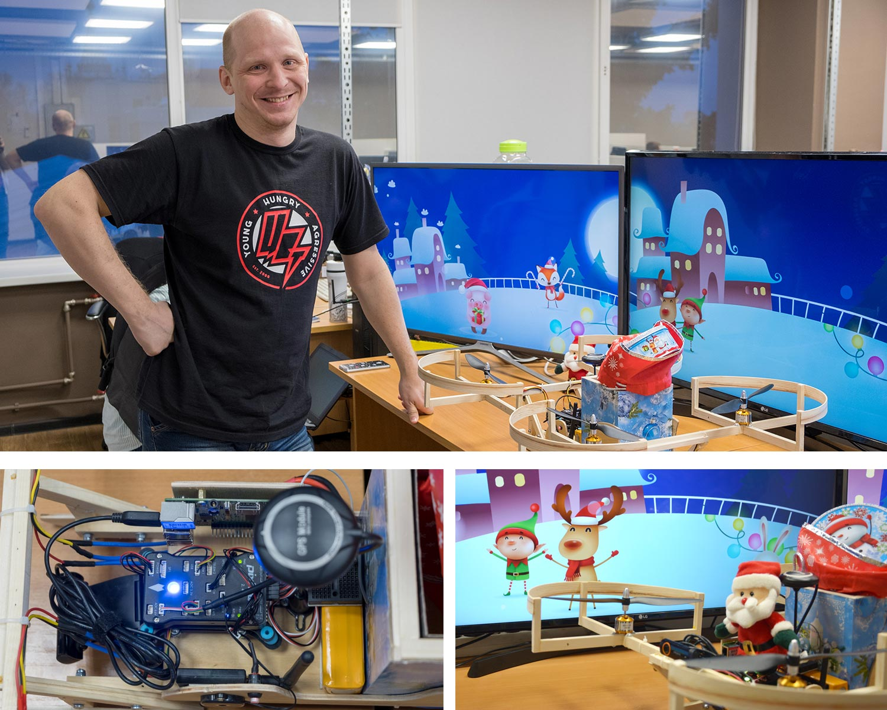  
  
Не помню в чьей больной голове (точно не в моей, но это не точно) зародилась идея запустить квадрокоптер-бомбардировщик в стенах офиса. Задача новая и непростая, однако ничего сверх наших сил мы в ней не обнаружили. Да, мы перерыли интернетики с целью найти библиотеку для управления контроллером коптера. Да, надо было передавать в клиент стримом изображение с веб-камеры и анализировать его на сервере. Да, нужно было сделать бомболюк. Да, надо в целом написать оболочку, которая бы это всё в себе собирала. Ну и что? Мы всё это уже делали (кроме управления контроллером). Поэтому проекту дали зеленый свет.

### Устройство

Каждая надсадно жужжащая у вас над головой эволюционная ошибка вертолета, в принципе, состоит из одного набора механизмов и схем. Это:

1.  контроллер,
2.  двигатели с винтами,
3.  аккумулятор,
4.  регулятор скорости (ESC),
5.  антенна телеметрии,
6.  GPS-модуль и компас,
7.  камера.

Последние два пункта опционально. Схему устройства винтокрылого друга можно увидеть вот тут:

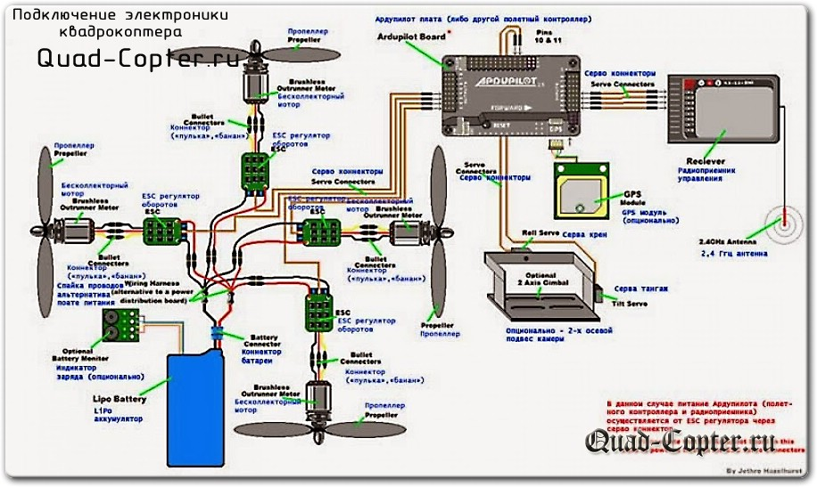

Это добро ставится на корпус. Впрочем, корпус решили сделать свой. Потому что:

*   сами с усами,
*   нуждались в корпусе именно в виде саней,
*   уже неприлично дорого получалось.

  

#### Контроллер

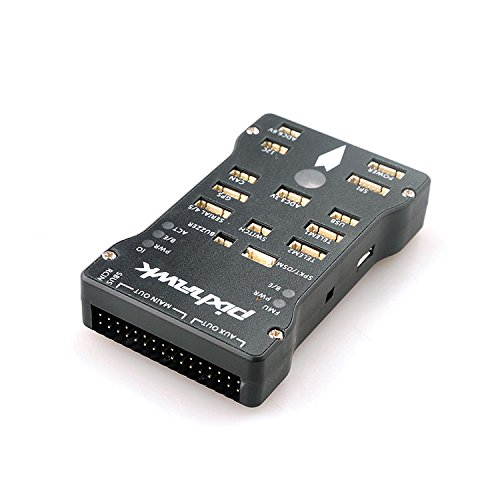

Самая важная часть любой личинки вертолета. Имеет акселерометры по трем осям, программную прошивку, входы для установки периферийного оборудования и подключения двигателей, выход для управления. Без него ни один дрон не поднимется в воздух. Штука настолько важная, что устанавливается на специальную амортизирующую платформу, чтобы снизить влияние вибрации и ударных нагрузок. Примерно такой:

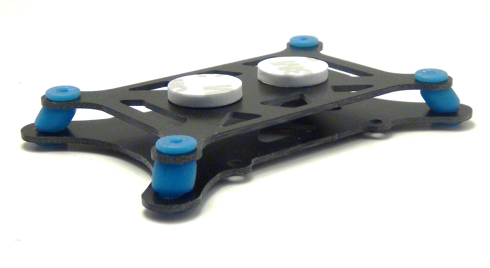

Мы выбрали относительно мажорский контроллер. «Относительно», потому что я потом внимательнее посмотрел на монстров, которые предлагаются для серьёзных дядей… Тем не менее, контроллер имеет GPS, компас, автопилот, всякие прочие хорошие плюшки, поддерживает до 8-ми двигателей.

Строго говоря, такие контроллеры предназначены не только для вертикально взлетающей братии. Их можно устанавливать на любые движущиеся платформы, начиная от вертолетов, самолетов, заканчивая машинками и лодками. Вариантов использования куча. Но мы несколько отвлеклись.

#### Двигатели

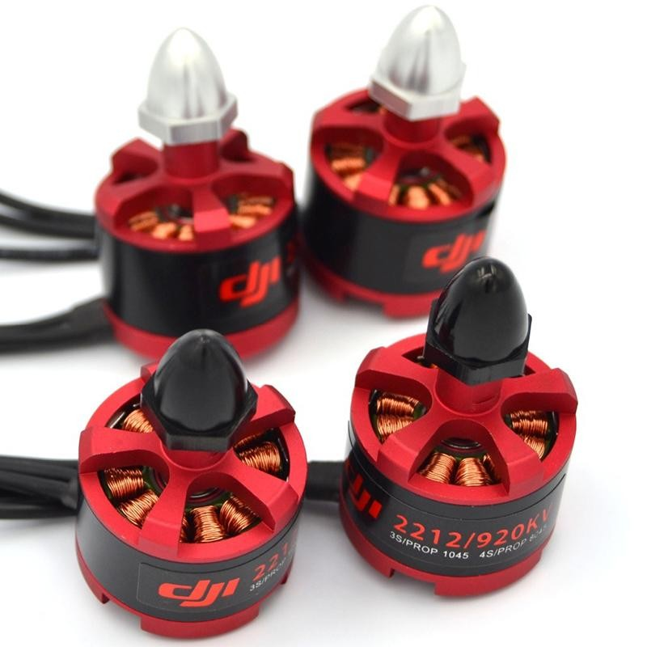

Этих друзей превеликое множество. Круглых, квадратных, кривых, косых, больших, маленьких, дорогих и дешевых. Основное отличие: максимальная потребляемая мощность, сила тока и количество оборотов в секунду. В идеальном представлении сани должны были уметь поднимать банку пива (0,5 кг). Прикинув общий вес конструкции, рассчитали примерную потребную подъемную силу и взяли качественные мощные двигатели. Как оказалось потом, они ни разу не запускались на полную мощность. Но лучше больше, чем меньше…

#### Аккумулятор

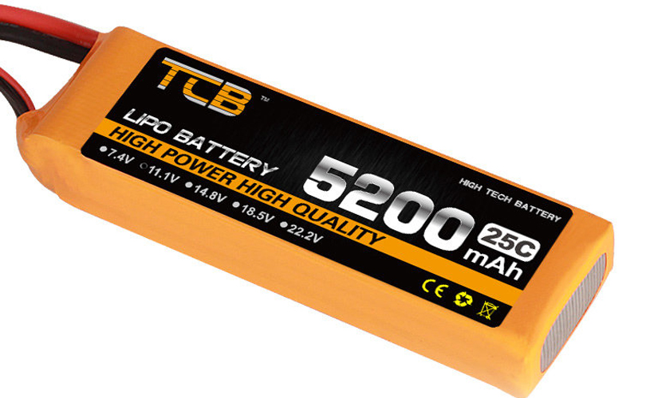

Единственный источник энергии, посредством которого потенциальный камикадзе будет держаться в воздухе. В процессе эксплуатации выяснились несколько любопытных моментов.

Во-первых, жужжащий огрызок технологий жрет энергию как бесплатную. Банка высаживается в момент, а заряжается долго.

Во-вторых, он не только жрет, но ещё и умеет оставлять заряд «про запас». Идея хорошая, потому что при достижении порогового значения напряжения, машина прерывает полет и совершает мягкую посадку, но выражается это в том, что банка «высаживается» ещё быстрее.

#### Регулятор скорости

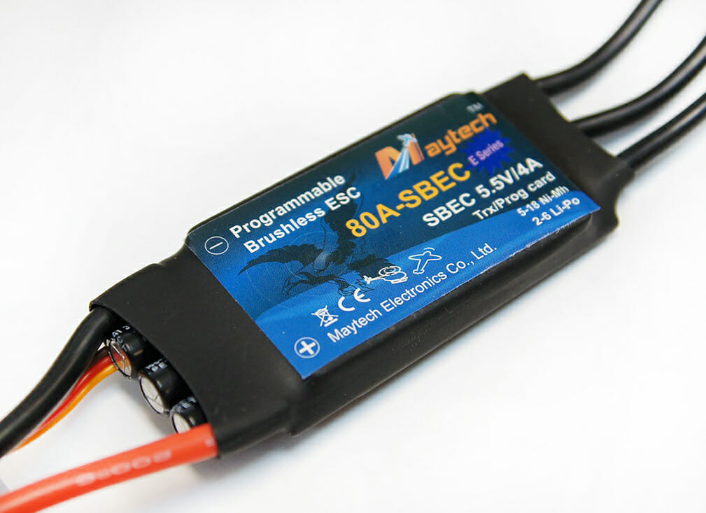

Маленькая микросхема, без которой двигатели попросту работать не будут. Предназначена для распределения напряжения с банки на двигатель. Очень важная штука, обычно идет в комплекте с покупаемым мотором.

#### Антенна телеметрии

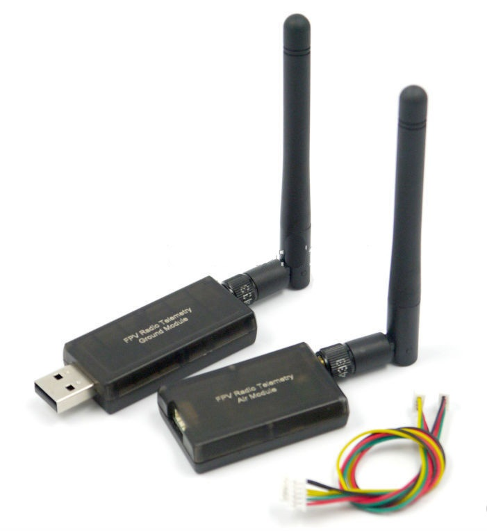"

В сущности, периферийное оборудование, однако без неё управлять тупиковой ветвью развития летающих предметов не получится. Помимо этого, телеметрия используется не только для управления, но и для передачи видеосигнала с камеры, поэтому антенн ставится обычно две. Кстати, телеметрия осуществляется посредством подачи и передачи сигналов на список каналов. Программно ими тоже можно управлять, но это категорически не рекомендуется, потому что так мы фактически отказываемся от вшитого автопилота и пишем свой. На коленке. И вещества и палок. В последний вечер. Как мы любим.

#### GPS-модуль

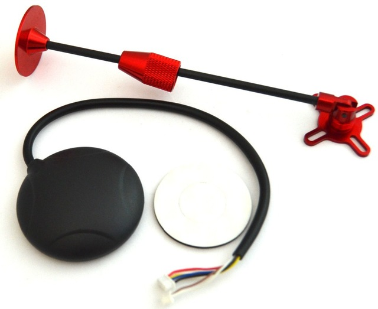

Основной и практически единственный способ позиционирования летающего уничтожителя нервов в пространстве. Обычно GPS-модуль содержит в себе ещё и компас. Чтобы на него ничего не влияло в полете, модуль ставится на специальную штангу, чтобы вот совсем ничего не влияло. Мы его использовали только ради компаса, потому что в помещении GPS не очень хорошо ловит. Поддерживает и другие системы позиционирования.

Как любой уважающий себя GPS, умеет ошибаться. Ошибка варьируется от нескольких метров до нескольких материков. Но в целом необходимый прибор на улице для осуществления миссий на удалении.

#### Камера

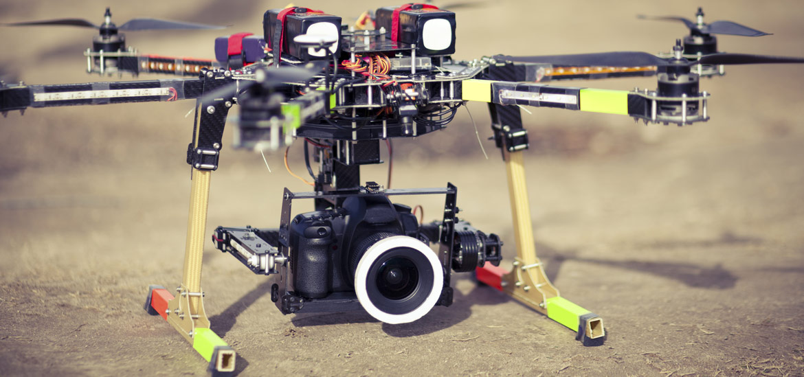

То, ради чего всё и делается. Гроза английских аэропортов умеет не только болтать под собой камеру. Контроллер может стабилизировать, удаленно управлять ею и предоставить очень развернутые настройки и инструменты для ее управления. Но мы это всё не использовали. В другой раз.

### Управление

Все поделки инженерной мысли сапиенсов, использующие контроллеры, в сущности управляются одной программой: Mission Planer. Выглядит она примерно так:

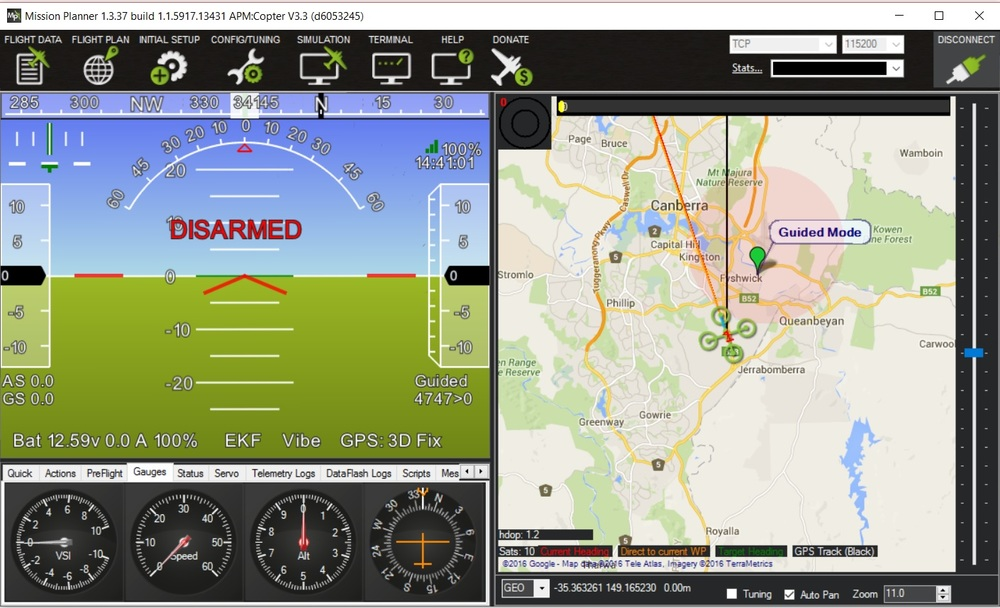

Подробнее об этом [здесь](http://http//ardupilot.org/planner/).

В ней представлен широчайший набор возможностей и настроек. Есть планирование полетного задания, гео-позиционирование, ручное управление, всевозможные настройки и калибровка оборудования.

#### Правило №1: используй только то, что тебе понадобится

Да, программа нужная и полезная. В принципе. Но не для нашей задачи, потому что рассекатель воздуха должен управляться программно, а мы кучу времени угробили, чтобы разобраться с этим планировщиком.

Само ручное управление можно осуществлять чем душе угодно. Есть настройки для пульта, для джойстика. Можно вывести управление на мышку и клавиатуру. Основное требование — откалибровать пульт управления. Ну и управлять вручную. Поскольку мы ленивые разработчики, то управлять вручную не хотелось. Хотелось, чтобы винтокрылый побочный результат мыслительной деятельности сам летал.

### Программный контроль

На просторах интернета нашли только [эту](http://http//python.dronekit.io/) библиотеку, предназначенную для программного управления подобием летательных аппаратов. И написана она (барабанная дробь) на питоне. В общем случае для версий 2.x, но и на питоне 3.5 она работала вполне стабильно. Библиотека обладает богатым функционалом и относительно хорошей документацией. Но прежде чем начинать писать свой мега-управляющий дроном код, сначала надо… Да, надо подключиться к контроллеру.

В качестве управляющей программной компоненты был применен микрокомпьютер Raspberry Pi, на котором развернут веб-сервер на фреймворке aiohttp.

Схему и инструкцию подключения «малины» и контроллера можно посмотреть вот [тут](http://ardupilot.org/dev/docs/raspberry-pi-via-mavlink.html).

Схематично это выглядит так:

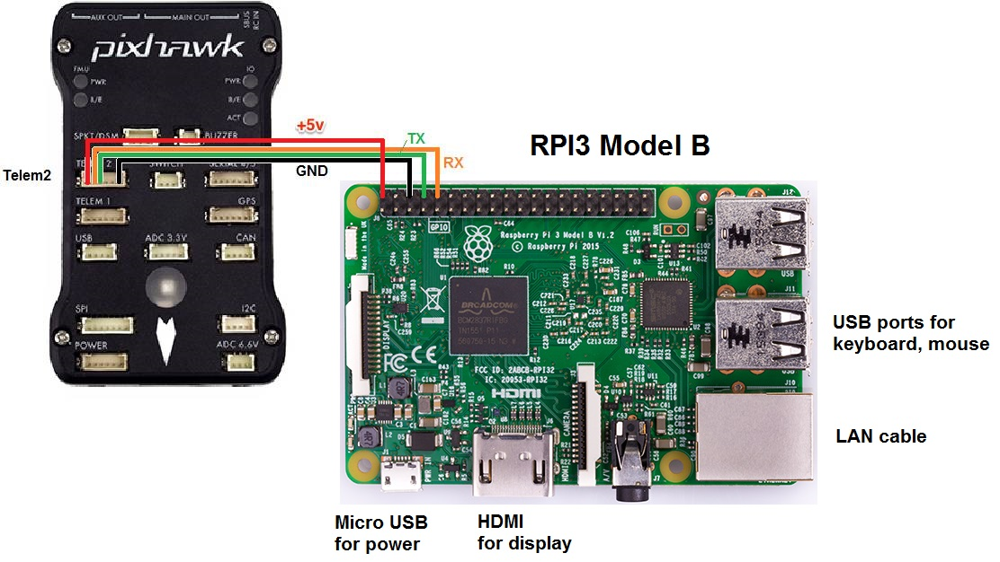

Способ подключения такой. Контроллер и малина соединяются проводами по указанной схеме. Таким образом эмулируется радиосигнал отправляемый и принимаемый контроллером. На малине необходимо запустить прокси-сервер, который будет цепляться к контроллеру и передавать с него данные. Подключение может быть сделано через телеметрию, либо через USB. Для них используются разные COM-порты. На рисунке представлен способ через телеметрию.

#### Правило №2: неполная документация. Часто не пишут самые очевидные вещи

Например, для соединения из питона с контроллером необходимо указать адрес и порт: connectionString = ’127.0.0.1:14540′

Но оказалось, что этот адрес и порт необходимо указать и в строке запуска прокси-сервера. Вот тут:

    mavproxy.py —master=/dev/ttyAMA0 —baudrate 921600 —aircraft MyCopter

Да, это очевидно, но ни разу не очевидно. И мы кучу времени потратили, чтобы с этим разобраться.

Однако и после запуска прокси с правильной строкой и после успешного коннекта к дрону из питона, чудо враждебной техники не хотело запускаться. То есть данные с коптера мы получаем, видим их, но команды будущая небесная угроза человечества исполнять отказывается. В последний момент выяснилось, что данных для подключения к дрону надо существенно больше. Условно, он должен начать отдавать данные в подключенную телеметрию, в противном случае, он её просто не подключал и сидел довольный.

#### Отсюда правило №3: используй USB

Да, документации по ней было сильно меньше, но стабильность подключения однозначно была бы выше. Потому что не пришлось бы использовать пины малины.

### Тестовый полет

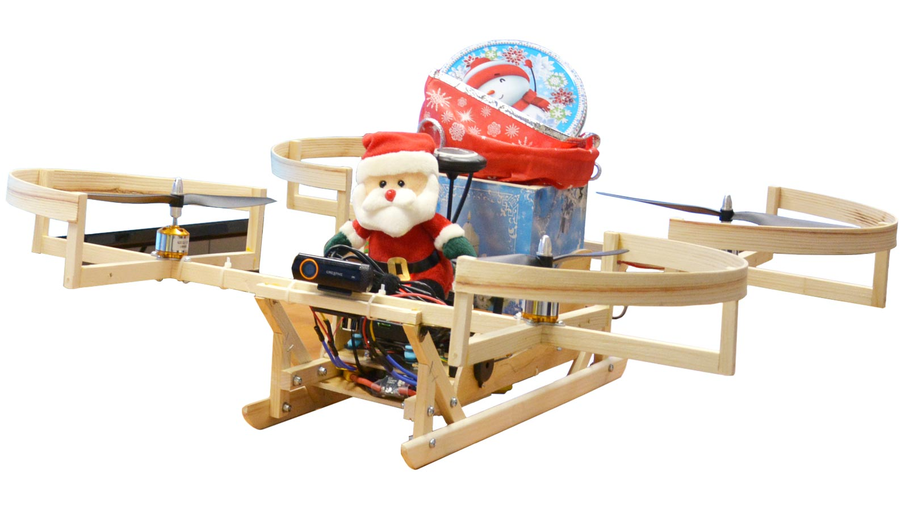

И тут ВНЕЗАПНО выяснилось, что:

1.  коптер летает не ровно,
2.  ошибки его телеметрии ± метр и более,
3.  для полета адекватны задачи типа: поднимись на 10-20 метров, пролети 100 метров на север и т.д.

Напомню, что эта конструкция, созданная под влиянием вертолетов из фильма «Аватар», запускалась в стенах офиса, где много оргтехники, с потолка свисают лампы, вентиляция и декор. Ну ещё и сотрудники имеются. В общем, очень быстро выяснилось, что серьезный полет в помещении будет чреват 160-ю отрубленными головами.

#### Правило №4: используй нормальные тестовые условия

Если летающий танк размером 50 на 60 см, то его нахождение в воздухе в замкнутом пространстве неминуемо приведет либо к его повреждению, либо повреждению находящихся рядом с ним. Идеальной тестовой зоной будет помещение размером со спортзал.

### Компьютерное зрение

Отдельным порталом в ад стала задача компьютерного видения. Идея заключается в считывании ArUco-меток, каждая из которых имеет записанную позицию в плане комнаты, и относительно которой коптер определяет свое положение в пространстве, а также положение относительно текущей точки маршрута.

Пример меток:

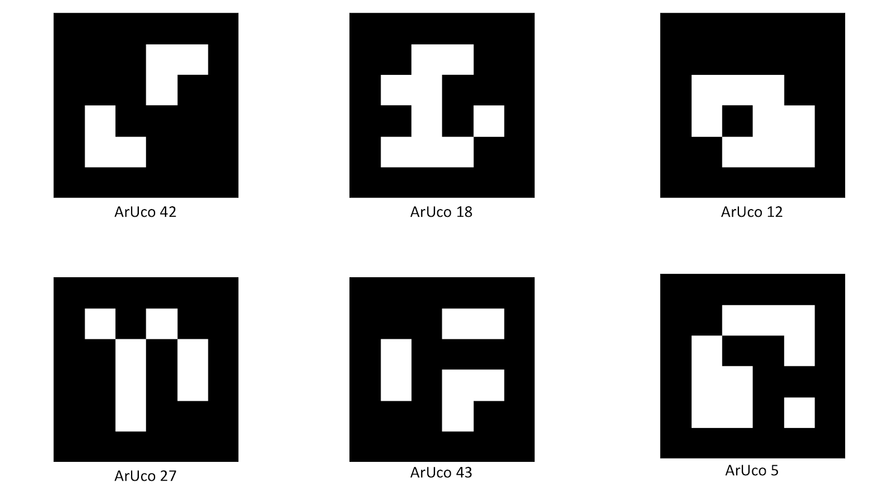

Для реализации использовалась библиотека [openCV](http://https//opencv.org/). Она используется для распознавания вообще всего, что только есть, в частности: лиц людей, предметов, автомобильных номеров, ну и наших меток. Установка библиотеки на операционную систему малины — Rasbian — стала сущим кошмаром, с которым поочередно бились четыре человека. Тем не менее, мы её успешно решили, и теперь машина «научилась» распознавать метки в видеопотоке с веб-камеры. Но опять-таки не хватило времени всё настроить. Например, из двух и более меток библиотека возвращала распознанные номера всех меток, а данные только по одной. Почему так? Тайна велика есть…

#### Правило главное: выделяй достаточно времени на доводку решения

  

### Прочие органы чувств

Чтобы мутант крыльев Икара не втыкался в возникающие ВНЕЗАПНО препятствия, хотели применить датчики расстояния. Они предполагались к нахождению по всем сторонам машины и должны были сигнализировать о приближении препятствия, вследствие чего коптер должен остановиться, сделать «шаг в сторону» и продолжить движение дальше по маршруту.

Этот функционал мы не успели сделать совсем.

### Маршруты

Мы много говорили про маршруты движения коптера. А что же это за звери такие? Скажу сразу, этот функционал был реализован самым первым и в полном объеме, но… не пригодился.

Маршруты движения представляют собой связный граф с вершинами, у каждой из которой записана её трехмерная координата в пространстве помещения. Соответственно коптер должен следовать от стартовой точки до финишной, в последней выполнять полетное задание. Следует он путем перемещения от текущей вершины до следующей. Поскольку для каждой вершины мы знаем её координаты, а у коптера мы знаем его расположение (компас) и положение (метки), то вычислить куда надо лететь — чисто технический вопрос. Задача поиска пути между стартовой точкой и финишной решена рекурсивной функцией. Маршруты, ребра и вершины хранятся в развернутой на малине БД.

#### Правило последнее: делай только то, что нужно для реализации

  

### Технологический стек

Коптер: [Raspberry Pi](http://https//www.raspberrypi.org/), [Rasbian](http://https//www.raspbian.org/), [OpenCV](http://https//opencv.org/), [Python 3.5](http://https//www.python.org/), [aiohttp](http://https//aiohttp.readthedocs.io/), [DroneKit](http://http//python.dronekit.io/), [RPi.GPIO](http://https//pypi.org/project/RPi.GPIO/), [SQLite](http://https//pypi.org/project/RPi.GPIO/).

Сервер с динамикой для ТВ: [node.js](http://https//nodejs.org/), [Express](http://https//www.express.com/), [socket.io](http://https//socket.io/).

Приложения для ТВ: [JavaScript ES6](http://http//es6-features.org/), [webpack 2](http://http//es6-features.org/), [Canvas](http://http//es6-features.org/).

Репозиторий с кодом коптера вот [тут](http://https//github.com/alxtrusov/copter/). За звездочки — плюсы в карму.

Пару слов, чтобы пояснить термины (любые оценки прошу считать субъективными).

*   Raspberry Pi. Полноценный микрокомпьютер с имеющимися пинами и выходами для специальной камеры и сенсорного экрана. Именно на нем расположен управляющий код, веб-сервер, openCV библиотека. По сути коптер — это летающий сервер.
*   Raspbian. Линуксовая операционная система для «малины». Их несколько и вообще можно ставить любые, но лучше ставить специально предназначенные, иначе могут возникнуть проблемы со взаимодействием с оборудованием компьютера, с теми же пинами, к примеру. Есть даже адаптированная версия десятой Windows.
*   OpenCV. Библиотека для распознавания элементов в видеопотоке. Также умеет стримить видеопоток, что используется в проекте для выдачи изображения на клиент. (да, у коптера есть свой веб-клиент)
*   Python 3.5. Питон. 3.5. Не 2.*.
*   Aiohttp. Асинхронный фреймворк для веб-сервера, написанный на питоне. Почему-то он понравился больше [Django](http://https//www.djangoproject.com/). Но тут на выбор.
*   DroneKit. Библиотека для подключения к контроллеру коптера из программы. Весьма богатый функционал, помноженный на относительно неплохую документацию. При условии отсутствия аналогов — блестящий инструмент.
*   RPi.GPIO. Библиотека на питоне для взаимодействия с пинами «малины». Позволяет включать и выключать пины, слушать их значения. Не умеет передавать значения, отличные от 0 или 1-цы. Или я не нашел.
*   SQLite. СУБД + БД + дрова, объединенные в один файл. Идеально подходит для учебных и непродовых проектов, если не надо разворачивать что-нибудь высоконагруженное. Удобно вносить изменения.
*   Node.js. Серверный JavaScript.
*   Express. Фреймворк для веб-серверов, написанный на node.js. Весьма удобен и минималистичен.
*   Socket.io. Серверная и клиентская библиотека для реализации протокола webSocket-ов. Основной плюс — стабильность работы и обширный предоставляемый функционал.

  

### Выводы

В исходной формулировке задача реализуема, хоть и требует существенно больше времени и усилий. Из-за того, что автопилот и методы управления коптером чуть менее чем полностью завязаны на GPS, от них нужно отказаться в сторону прямых команд в каналы управления. Это влечет необходимость написания своего автопилота, что задача решаемая. А потом — тестировать, тестировать и тестировать.

Лично мне было интересно. И автоматизированный бомбардировщик-наноситель подарков я всё равно сделаю так или иначе. А всем заинтересовавшимся, пожалуй, оставлю

#### Правило единственное: ставь высокие и сложные цели и иди к ним!

Удачи всем!