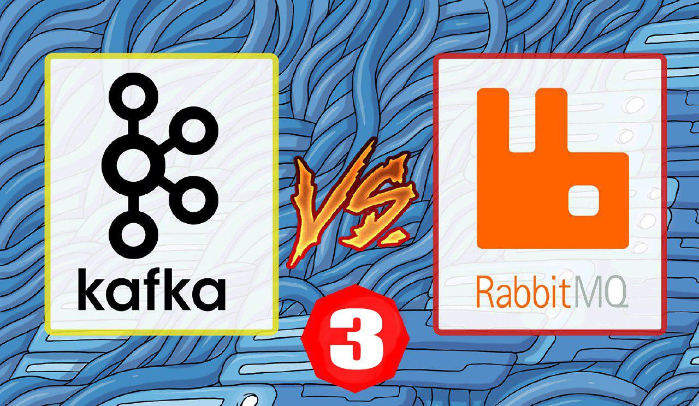

Apache Kafka и RabbitMQ: семантика и гарантия доставки сообщений / Блог компании ITSumma

Подготовили перевод следующей части многосерийной статьи, где сравнивается функциональность Apache Kafka и RabbitMQ. В этой публикации речь идёт о семантике и гарантии доставки сообщений. Обращаем ваше внимание, что автор учитывал Кафку до версии 0.10 включительно, а в версии 0.11 появился exactly-once. Тем не менее, статья остаётся актуальной и полна полезных с практической точки зрения моментов.  
Предыдущие части: [первая](https://habr.com/ru/company/itsumma/blog/416629/), [вторая](https://habr.com/ru/company/itsumma/blog/418389/).

  
И RabbitMQ, и Kafka предлагают надёжные гарантии доставки сообщений. Обе платформы предлагают гарантии по принципам “как максимум однократная доставка” и “как минимум однократная доставка”, но вот с принципом “строго однократной доставки” гарантии Kafka действуют по очень ограниченному сценарию.

Сперва разберёмся, что означают эти гарантии:

*   At-most-once delivery (“как максимум однократная доставка”). Это значит, что сообщение не может быть доставлено больше одного раза. При этом сообщение может быть потеряно.
*   At-least-once delivery (“как минимум однократная доставка”). Это значит, что сообщение никогда не будет потеряно. При этом сообщение может быть доставлено более одного раза.
*   Exactly-once delivery (“строго однократная доставка”). Святой грааль систем сообщений. Все сообщения доставляются строго единожды.

Слово “доставка” здесь, вероятно, будет не совсем точным термином. Точнее было бы сказать “обработка”. Во всяком случае, интересует нас сейчас то, может ли потребитель обрабатывать сообщения и по какому принципу это происходит: “не более одного”, “не менее одного” или “строго единожды”. Но слово “обработка” усложняет восприятие, и выражение “Доставка по принципу ‘строго единожды’” в данном случае будет недостаточно точным определением, потому что может потребоваться доставить сообщение дважды, чтобы должным образом обработать его один раз. Если получатель отключился во время обработки, требуется, чтобы сообщение было отправлено вторично новому получателю.

Второе. Обсуждая вопрос обработки сообщений, мы подходим к теме частичных отказов, являющейся головной болью для разработчиков. В процессе обработки сообщения присутствует несколько этапов. Он состоит из сеансов связи между приложением и системой сообщений в начале и в конце и работы самого приложения с данными в середине. Сценарии частичных отказов в работе приложения должны обрабатываться самим приложением. Если выполняемые операции полностью транзакционны и результаты формулируются по принципу “всё или ничего”, частичных сбоев в логике приложения удаётся избежать. Но нередко многие этапы включают в себя с взаимодействие с другими системами, где транзакционность невозможна. Если мы включаем во взаимодействие взаимосвязи между системами обмена сообщениями, приложениями, кэшем и базой данных, можем ли мы гарантировать обработку по принципу “строго единожды”? Ответ — “нет”.

Стратегия “строго единожды” ограничена сценарием, по которому единственным получателем обработанных сообщений является сама платформа обмена сообщениями, и сама эта платформа обеспечивает полноценные транзакции. По этому ограниченному сценарию можно обрабатывать сообщения, писать их, отправлять сигналы о том, что они обработаны в рамках транзакции, производимой по принципу “всё или ничего”. Это предусмотрено библиотекой Kafka Streams.

Но если обработка сообщений всегда идемпотентна, можно избежать необходимости реализовывать стратегию “строго единожды” через транзакции. Если конечная обработка сообщений идемпотентна, можно не беспокоясь принимать дубликаты. Но не все действия можно реализовать идемпотентно.

**Сквозное оповещение**  
Что не представлено ни в каких устройствах всех систем обмена сообщениями, с которыми я работал, так это сквозное подтверждение. Если учесть, что в RabbitMQ сообщение может быть поставлено в несколько очередей, сквозное оповещение не имеет смысла. На Kafka, аналогично, несколько разных групп получателей могут считывать информацию одновременно из одного топика. По моему опыту, сквозное оповещение — это то, о чём чаще всего просят люди, плохо знакомые с концепцией передачи сообщений. В таких случаях лучше сразу объяснять, что это невозможно.

**Цепочка ответственности**  
По большому счёту, источники сообщений не могут знать, что их сообщения доставляются получателям. Они могут только знать, что система обмена сообщениями приняла их сообщения и взяла на себя ответственность по обеспечению их безопасного хранения и доставки. Возникает цепочка ответственности, которая начинается источником, идёт по системе обмена сообщениями и заканчивается на получателе. Каждый должен корректно выполнять свои обязанности и четко передавать сообщение следующему. Это значит, что вы как разработчик должны грамотно спроектировать свои приложения, чтобы не допустить утери или некорректного использования сообщений, пока они у вас под контролем.

**Порядок передачи сообщений**  
Эта статья посвящена, прежде всего, тому, как каждая платформа обеспечивает отправку по стратегиям “не менее одного” и “не более одного”. Но есть ещё порядок передачи сообщений. В предыдущих частях этой серии я писал о порядке передачи сообщений и порядке их обработки и я советую обратиться к этим частям.

Если коротко, то и RabbitMQ, и Kafka предоставляют гарантию порядка простой очерёдности (first in first out, FIFO). RabbitMQ поддерживает такой порядок на уровне очереди, а Kafka — на уровне распределения на сегменты. Последствия таких проектных решений были рассмотрены в предыдущих статьях.

**Гарантии доставки в RabbitMQ**  
Гарантии доставки обеспечиваются:

*   надежностью сообщений — они не пропадут, пока хранятся на RabbitMQ;
*   уведомлениями о сообщениях — RabbitMQ обменивается сигналами с отправителями и получателями.

#### Элементы, обеспечивающие надежность

**Зеркалирование очереди**  
Очереди могут быть зеркалированы (реплицированы) на многих узлах (серверах). Для каждой очереди предусмотрена ведущая очередь на одном из узлов. Например, есть три узла, 10 очередей и по две реплики на очередь. 10 контрольных очередей и 20 реплик будет распределено по трём узлам. Распределение контрольных очередей по узлам может быть настроено. В случае зависания узла:

*   вместо каждой ведущей очереди на зависшем узле предоставляется реплика этой очереди на другом узле;
*   на других узлах создаются новые реплики, чтобы заменить потерянные реплики на выбывшем узле, таким образом поддерживая фактор реплицирования.

Речь об устойчивости к сбоям пойдёт в следующей части статьи.

**Надёжные очереди**  
На RabbitMQ предусмотрено два типа очередей: надёжные и ненадёжные. Надёжные очереди записываются на диск и сохраняются в случае перезагрузки узла. При запуске узла они переопределяются.

**Устойчивые сообщения**  
Если очередь является надёжной, это ещё не значит, что её сообщения сохраняются при перезагрузке узла. Только сообщения, помеченные отправителем как устойчивые, будут восстановлены.

При работе на RabbitMQ, чем надёжней сообщения, тем ниже возможная производительность. Если имеется поток событий реального времени и не критично потерять несколько из них или небольшой временной промежуток потока, лучше не применять реплицирование очередей и передавать все сообщения как неустойчивые. Но если терять сообщения из-за сбоя в работе узла нежелательно, лучше применять надёжные очереди с реплицированием и устойчивые сообщения.

#### Уведомления о получении сообщений

**Передача сообщений**  
Сообщения могут быть утеряны или дублированы при передаче. Это зависит от поведения отправителя.

_“Выстрелил и забыл”_.  
Источник может решить не запрашивать от получателя подтверждения (уведомления о получении сообщения для отправителя) и просто отправить сообщение в автоматическом режиме. Сообщения не будут дублироваться, но могут потеряться (что удовлетворяет стратегии “как максимум однократная доставка”).

_Подтверждения отправителю_.  
Когда отправитель открывает канал для брокера очередей, он может использовать этот же канал для передачи подтверждений. Теперь в ответ на полученное сообщение брокер очередей должен предоставить одно из двух:

*   basic.ack. Положительное подтверждение. Сообщение получено, ответственность за него теперь лежит на RabbitMQ;
*   basic.nack. Негативное подтверждение. Что-то случилось, и сообщение не было обработано. Ответственность за него остаётся на источнике. При желании, он может отправить сообщение вторично.

В дополнение к положительным и отрицательным уведомлениям о доставке сообщения предусмотрено сообщение basic.return. Иногда отправителю нужно знать не только о том, что сообщение поступило в RabbitMQ, но и о том, что оно действительно попало в одну или несколько очередей. Может так получиться, что источник отправляет сообщение в систему распределения по очередям (topic exchange), в которой сообщение не маршрутизируется в ни одну из очередей доставки. В такой ситуации брокер просто отбрасывает сообщение. В одних сценариях это нормально, в других же источник должен знать, было ли сообщение сброшено, и действовать дальше в соответствии с этим. Можно выставить флаг “Mandatory” для отдельных сообщений, и, если сообщение не было определено в какую-либо очередь доставки, отправителю будет возвращено сообщение basic.return.

Источник может дожидаться подтверждения после отправки каждого сообщения, но это сильно снизит производительность его работы. Вместо этого источники могут высылать стабильный поток сообщений, задав для себя ограничение на количество неподтверждённых сообщений. Когда будет достигнут промежуточный предел сообщений, отправка будет приостановлена, пока не будут получены все подтверждения.

Теперь, когда имеется множество сообщений, находящихся в пути от отправителя к RabbitMQ, для повышения производительности группируются подтверждения, используя флаг multiple. Всем сообщениям, отправляемым по каналу, присваивается монотонно возрастающее целое значение, “порядковый номер” (Sequence Number). Уведомление о поступлении сообщения включает порядковый номер соответствующего сообщения. И если при этом значение multiple=true, отправитель должен отслеживать порядковые номера своих сообщений, чтобы знать, какие сообщения были успешно доставлены, а какие нет. Я написал подробную статью на эту тему.

Благодаря подтверждениям мы избегаем потерь сообщений следующими способами:

*   переотправка сообщений в случае поступления негативного уведомления;
*   продолжение хранения сообщений где-нибудь в случае получения негативного уведомления или basic.return.

_Транзакции_.  
Транзакции редко используются в RabbitMQ по следующим причинам:

*   Слабые гарантии. Если сообщения направляются на несколько очередей или имеют значок об обязательности, неразрывность транзакций не будет поддержана;
*   Низкая производительность.

Честно говоря, я их никогда не применял, они не дают никаких дополнительных гарантий, кроме подтверждений отправителю, и только повышают неопределённость в вопросе о том, как интерпретировать подтверждения получения сообщений, возникающие в результате завершения транзакций.

_Ошибки средств коммуникации/каналов_.  
Помимо уведомлений о получении сообщений, отправителю нужно иметь в виду сбои средств коммуникации и брокеров. Оба эти фактора приводят к потере канала связи. С потерей каналов пропадает возможность получить любые ещё не доставленные уведомления о получении сообщений. Здесь отправитель должен выбрать между риском потери сообщений и риском их дублирования.

Сбой брокера может произойти, когда сообщение было в буфере операционной системы или проходило предобработку, и тогда сообщение будет потеряно. Или, возможно, сообщение было определено в очередь, но брокер сообщений умер перед тем, как отправить подтверждение. В этом случае сообщение будет успешно доставлено.

Аналогично влияет на ситуацию сбой средств коммуникации. Произошел ли сбой во время передачи сообщения? Или же после того, как сообщение было поставлено в очередь, но до получения положительного уведомления?  
Отправителю невозможно это определить, поэтому он должен выбрать один из следующих вариантов:

*   не переотправлять сообщение, создавая риск его утери;
*   переотправлять сообщение и создать риск его дублирования.

Если многие сообщения отправителя находятся в пути, проблема усложняется. Единственное, что отправитель может сделать — это дать получателям подсказку, добавив специальный заголовок к сообщению, показывающий, что сообщение отправляется вторично. Получатели могут принять решения о том, чтобы проверять сообщения на наличие подобных заголовков и в случае обнаружения таковых дополнительно проверять полученные сообщения на наличия дубликатов (если такая проверка ранее не проводилась).

#### Получатели

Получателям доступны две опции, регулирующие уведомления о получении:

*   режим отсутствия уведомлений;
*   ручной режим уведомлений.

_Режим отсутствия уведомлений_  
Он же режим автоматических уведомлений. И он опасен. Прежде всего потому, что, когда сообщение попадает в ваше приложение, оно удаляется из очереди. Это может привести к потере сообщения, если:

*   соединение прервалось до момента получения сообщения;
*   сообщение всё ещё во внутреннем буфере, а приложение отключили;
*   не удалось произвести обработку сообщения.

К тому же, мы теряем механизмы противодавления как средство контроля качества доставки сообщений. Установив режим отправки уведомлений вручную, можно задать предвыборку (или установить уровень предоставляемых услуг, QoS), чтобы ограничить единовременное количество сообщений, получение которых система ещё не подтвердила. Без этого RabbitMQ отправляет сообщения настолько быстро, насколько позволяет соединение, а это может быть быстрее, чем получатель способен их обработать. В результате буферы переполняются, и возникают ошибки памяти.

_Ручной режим уведомлений_  
Получатель должен вручную отправить уведомление о получении каждого сообщения. Он может установить предвыборку на случай, если количество сообщений больше одного, и обрабатывать много сообщений одновременно. Он может решить отправлять по уведомлению на каждое сообщение, а может применить флаг multiple и высылать по нескольку уведомлений одновременно. Группировка уведомлений повышает производительность.

Когда получатель открывает канал, сообщения, идущие по нему, содержат параметр Delivery Tag, значения которого представляет собой целое, монотонно возрастающее число. Оно включается в каждое уведомление о получении и используется как идентификатор сообщения.

Уведомления могут быть следующие:

*   basic.ack. После него RabbitMQ удаляет сообщение из очереди. Здесь может быть применён флаг multiple.
*   basic.nack. Получатель обязан установить флаг, чтобы сообщить RabbitMQ, ставить ли сообщение заново в очередь. При повторной постановке сообщение попадает в начало очереди. Оттуда оно отправляется получателю опять (даже тому же получателю). Уведомление basic.nack поддерживает флаг multiple.
*   basic.reject. То же, что и basic.nack, только не поддерживает флаг multiple.

Таким образом, семантически basic.ack и basic.nack при requeue=false одинаковы. Оба оператора означают удаление сообщения из очереди.

Следующий вопрос заключается в том, когда отправлять уведомления о получении. Если сообщение было обработано быстро, возможно, сразу после завершения этой операции (удачной или неудачной) вы захотите отправить уведомление. Но если сообщение стояло в очереди RabbitMQ и на обработку уходит много минут? Отправка уведомления после этого будет проблематична, потому что, если канал закроется, все сообщения, на которые не было уведомлений, вернутся в очередь, и отправка будет произведена вторично.

**Ошибка соединения/брокера сообщений**  
Если соединение было оборвано или в брокере произошла ошибка, после которой канал перестаёт работать, тогда все сообщения, получение которых не было подтверждено, снова попадают в очередь и переотправляются. Это хорошо, потому что предотвращает потерю данных, но плохо, потому что вызывает излишнее дублирование.

Чем дольше у получателя долгое время имеются сообщения, получение которых он не подтвердил, тем выше риск переотправки. Когда сообщение отправляется повторно, RabbitMQ для флага переотправки устанавливает значение “true”. Благодаря этому получатель по крайней мере имеет индикацию того, что сообщение, возможно, уже было обработано.

**Идемпотентность**  
Если требуется идемпотентность и гарантии того, что ни одно сообщение не будет потеряно, следует встроить какую-нибудь проверку дубликатов или другие идемпотентные схемы. Если проверка на дублирование сообщений слишком дорога, можно применить стратегию, при которой отправитель всегда добавляет специальный заголовок на повторно отправляемые сообщения, а получатель проверяет полученные сообщения на наличие такого заголовка и флага повторной отправки.

#### Заключение

RabbitMQ предоставляет надёжные, долговременные гарантии обмена сообщениями, но есть много ситуаций, когда они не помогут.

Вот список моментов, которые следует запомнить:

*   Следует применять зеркалирование очередей, надёжные очереди, устойчивые сообщения, подтверждения для отправителя, флаг подтверждения и принудительное уведомление от получателя, если требуются надёжные гарантии в стратегии “как минимум однократная доставка”.
*   Если отправка производится в рамках стратегии “как минимум однократная доставка”, может потребоваться добавить механизм дедубликации или идемпотентности при дублировании отправляемых данных.
*   Если вопрос потери сообщений не так важен, как вопрос скорости доставки и высокой масштабируемости, то подумайте о системах без резервирования, без устойчивых сообщений и без подтверждений на стороне источника. Я всё же предпочел бы оставить принудительные уведомления от получателя, чтобы контролировать поток принимаемых сообщений путем изменения ограничений предвыборки. При этом вам потребуется отправлять уведомления пакетами и использовать флаг “multiple”.

**Гарантии доставки в Kafka**  
Гарантии доставки обеспечиваются:

*   долговечностью сообщений — сообщения, сохранённые в сегменте, не теряются;
*   Уведомлениями о сообщениях — обмен сигналами между Kafka (и, возможно, хранилищем Apache Zookeeper) с одной стороны и источником/получателем — с другой.

**Два слова о пакетировании сообщений**  
Одно из отличий RabbitMQ от Kafka заключается в использовании пакетов при обмене сообщениями.

RabbitMQ обеспечивает что-то похожее на пакетирование благодаря:

*   Приостановке отправки каждые Х сообщений до тех пор, пока не будут получены все уведомления. RabbitMQ обычно группирует уведомления, используя флаг «multiple».
*   Установке получателями параметра «prefetch» и группировкой уведомлений с помощью «multiple».

Но всё же сообщения не отправляются пакетами. Это больше похоже на непрерывный поток сообщений и отправку групп уведомлений в одном сообщении при отмеченном значке “multiple”. Как это делает протокол TCP.

Kafka обеспечивает более явное пакетирование сообщений. Пакетирование делается ради производительности, но иногда возникает необходимость в компромиссе между производительностью и другими факторами. Аналогичная ситуация возникает в RabbitMQ, когда сдерживающим фактором становится количество сообщений, которые ещё в пути, уведомлений о поступлении которых ещё нет. Чем больше сообщений было в пути в момент сбоя, тем больше возникает дублей и происходит повторной обработки сообщений.

Kafka более эффективно работает с пакетами со стороны получателя, потому что работа распределяется по разделам, а не по конкурирующим получателям. Каждый раздел закреплён за одним получателем, поэтому даже применение больших пакетов не влияет на распределение работы. Но если вместе с RabbitMQ используется устаревший API для считывания больших пакетов, это может привести к крайне неравномерной нагрузке между конфликтующими между собой получателями и значительным задержкам в обработке данных. RabbitMQ по своему устройству не подходит для пакетной обработки сообщений.

**Элементы, обеспечивающие устойчивость**

_Репликация журнала_  
Для защиты от сбоев у Kafka предусмотрена архитектура ведущий-ведомый на уровне раздела журнала, и в этой архитектуре ведущие называются лидерами, а ведомые еще могут называться репликами. Лидер каждого сегмента может иметь несколько ведомых. Если на сервере, где находится лидер, происходит сбой, предполагается, что реплика становится лидером и все сообщения сохраняются, только обслуживание на короткое время прерывается.

Kafka придерживается концепции синхронизации реплик (In Sync Replicas, ISR). Каждая реплика может быть или не быть в синхронизированном состоянии. В первом случае она получает те же сообщения, что и лидер, за короткий отрезок времени (обычно за последние 10 секунд). Она выпадает из синхронизации, если не успевает эти сообщения принять. Такое может произойти из-за сетевой задержки, проблем с виртуальной машиной узла и т.д. Потеря сообщений может произойти только в случае сбоя лидера и отсутствия участвующих в синхронизации реплик. Я расскажу об этом подробнее в следующей части.

_Уведомления о получении сообщений и отслеживание смещения_  
Учитывая то, как Kafka хранит сообщения, и то, как они доставляются получателям, Kafka полагается на уведомления о получении сообщений для источников и отслеживание смещения чтения топика для получателей.

_Уведомление о получении сообщения для источника_  
Когда источник посылает сообщение, он даёт знать брокеру Kafka, какого рода уведомление он хочет получить, задав одну из настроек:

*   Без уведомлений, автоматический режим. Acks=0.
*   Уведомление о получении сообщения лидером. Acks=1
*   Уведомление о получении сообщения лидером и всеми участвующими в синхронизации репликами. Acks=All

Сообщения могут быть дублированы при отправке по тем же причинам, что и в RabbitMQ. В случае сбоя брокера или сети во время отправки, отправителю придётся ещё раз выслать сообщения, уведомления о принятии которых он не получил (если он не хочет, чтобы они были потеряны). Но вполне возможно, что это сообщение или сообщения были уже получены и среплицированы.

Однако у Kafka предусмотрена хорошая опция против проблем с дублированием. Для её работы должны быть соблюдены следующие условия:

*   для enable.idempotence установлено значение “true”,
*   для max.in.flight.requests.per.connection установлено значение 5 или менее,
*   для retries установлено значение 1 или выше,
*   для acks установлено значение “all”.

Следовательно, при пакетной отправке шести или более сообщений или если acks=0/1 для повышения производительности, данная опция не может использоваться.

_Отслеживание смещения получателем_  
Получатели должны сохранять смещение своего последнего полученного сообщения, чтобы в случае сбоя новый получатель мог продолжить с того места, где остановился предыдущий. Эти данные могут быть сохранены в ZooKeeper или другом топике Kafka.

Когда получатель считывает пакеты сообщений из раздела (топика), у него есть несколько вариантов относительно того, когда сохранять смещение своего последнего полученного сообщения:

*   Периодически. По мере обработки сообщений клиентская библиотека контролирует периодические фиксации смещения. Это делает работу со смещениями очень простой с точки зрения программиста и также положительно влияет на производительность. Но такой подход повышает риск повторной доставки при сбое получателя. Получатель может успеть обработать пакет сообщений и упасть прежде, чем он успеет зафиксировать соответствующее смещение.
*   Немедленно, перед началом обработки сообщений. Это соответствует стратегии отправки сообщений “как максимум однократная доставка”. При этом не важно, когда могли быть сбои у получателя; сообщение не будет обработано дважды, но может остаться необработанным. Например, если 10 сообщений обрабатывались и на пятом у получателя произошёл сбой, обработанными окажутся только 4 сообщения, остальные будут сброшены, и следующий получатель начнёт с сообщений, которые поступят после этого пакета;
*   В конце, когда все сообщения обработаны. Это соответствует стратегии отправки сообщений “как минимум однократная доставка”. Не важно, когда могли быть сбои у получателя, ни одно сообщение не останется необработанным, но одно и то же сообщение может быть обработано несколько раз. Например, если 10 сообщений обрабатывались и на пятом у получателя произошёл сбой, все десять сообщений будут считаны следующим получателем, и 4 сообщения окажутся обработаны дважды;
*   Поочередно. Это сократит возможность дублирования, но сильно снизит производительность работы.

Стратегия “строго однократная доставка” ограничена Kafka Streams, клиентской библиотекой от Java. При использовании Java настоятельно рекомендую обратить внимание на неё. При использовании стратегии “строго однократная доставка”, главная сложность будет заключаться в том, что и обработка сообщения, и сохранение смещения последнего полученного сообщения должно производиться в одной транзакции. Например, если обработка сообщения предполагает отправку сообщения по электронной почте, сделать это в рамках стратегии “строго однократная доставка” не получится. Если после отправки электронного письма у получателя произошёл сбой до того, как он сохранил смещение последнего полученного сообщения, новый получатель (сообщения) должен будет снова отправить это письмо.

Приложения, использующие Kafka Streams, у которой последнее действие по обработке сообщения заключается в том, чтобы записать новое сообщение в другой топик, могут действовать в рамках стратегии “строго однократная доставка”. Это обеспечивается с помощью транзакционной функциональности Kafka: отправить сообщение в другой топик и записать смещение можно в рамках одной транзакции. Обе операции будут успешны, или обе будут неудачны. Вне зависимости от того, когда произойдет сбой получателя, и запись смещения, и запись в топик либо будут выполнены (и только один раз), либо нет одновременно.

**О транзакциях и уровнях изоляции**  
Главным сценарием применения транзакций в Kafka является упомянутый выше сценарий “чтение-обработка-написание”. В транзакции могут участвовать сразу несколько топиков и разделов. Отправитель начинает транзакцию, создаёт пакет сообщений, завершает транзакцию.

Если получатели используют по умолчанию изоляционный уровень “читать незафиксированное”, они видят все сообщения, независимо от их транзакционного статуса (завершена, не завершена, отменена). Если получатели используют изоляционный уровень “чтение зафиксированного”, они не видят сообщения, транзакции которых не завершены или отменены. Они могут принимать сообщения только завершенных транзакций.

Может возникнуть вопрос: как изоляционный уровень “чтение завершенных транзакций” влияет на гарантии порядка отправки сообщений? Он не влияет никак. Получатели будут считывать все сообщения в нужном порядке, это прекратится на первом сообщении, транзакция которого не завершена. Незавершенные транзакции будут блокировать чтение. Смещение последней завершенной транзакции (Last Stable Offset, LSO) — это смещение до первой незавершенной транзакции; получатели с уровнем изоляции “чтение завершенных транзакций” могут читать только до данного смещения.

**Выводы**  
Обе технологии предлагают устойчивые и надёжные механизмы обмена сообщениями. Если надёжность важна, вы можете быть уверены, что оба решения предлагают сравнимые гарантии. Но я думаю, что на настоящий момент Kafka имеет преимущество в идемпотентности отправки сообщений, а ошибки в контроле смещения последнего полученного сообщения не всегда приводит к потере такого сообщения навсегда.

#### Подведём итоги:

  

*   Обе платформы способны реализовать стратегии “как максимум однократная доставка” и “как минимум однократная доставка”.
*   Обе платформы обеспечивают репликацию сообщений.
*   На обеих платформах действуют одинаковые факторы, в силу которых следует искать компромисс между пропускной способностью системы и риском дублирования сообщений. Kafka обеспечивает идемпотентную отправку сообщений, но только для ограниченного объёма трафика.
*   Обе платформы задают ограничения количества передаваемых сообщений, находящихся в пути, подтверждение о получении которых ещё не получено отправителем.
*   Обе платформы предоставляют гарантии относительно порядка отправки сообщений.
*   Kafka обеспечивает поддержку транзакций, в первую очередь в сценарии “чтение-обработка-написание”. При этом нужно принять меры против снижения пропускной способности системы.
*   В Kafka, если получатель не обрабатывает часть сообщений из-за сбоев техники и некорректного отслеживания смещения последнего полученного сообщения, все равно можно восстановить смещение этого сообщения (если такой случай обнаружен). В RabbitMQ соответствующие сообщения будут утеряны.
*   Kafka может повысить пользу от пакетирования благодаря своим возможностям по распределению пакетов, а в RabbitMQ пакетирование отсутствует в силу пассивной модели приёма, не препятствующей конфликтам получателей.