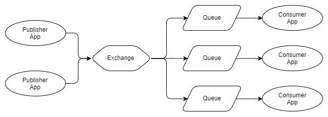

RabbitMQ vs Kafka Part 1

In this part we'll explore what RabbitMQ and Apache Kafka are and their approach to messaging. Each technology has made very different decisions regarding every aspect of their design, each with strengths and weaknesses. We'll not come to any strong conclusions in this part, instead think of this as a primer on the technologies so we can dive deeper in subsequent parts of the series.

RabbitMQ is a distributed message queue system. Distributed because it is usually run as a cluster of nodes where queues are spread across the nodes and optionally replicated for fault tolerance and high availability. It natively implements AMQP 0.9.1 and offers other protocols such as STOMP, MQTT and HTTP via plug-ins.

RabbitMQ takes both a classic and a novel take on messaging. Classic in the sense that it is oriented around message queues, and novel in its highly flexible routing capability. It is this routing capability that is its killer feature. Building a fast, scalable, reliable distributed messaging system is an achievement in itself, but the message routing functionality is what makes it truly stand out among the myriad of messaging technologies out there.

### Exchanges and Queues

The super simplified overview:

*   Publishers send messages to exchanges
    
*   Exchanges route messages to queues and other exchanges
    
*   RabbitMQ sends acknowledgements to publishers on message receipt
    
*   Consumers maintain persistent TCP connections with RabbitMQ and declare which queue(s) they consume
    
*   RabbitMQ pushes messages to consumers
    
*   Consumers send acknowledgements of success/failure
    
*   Messages are removed from queues once consumed successfully
    

Hidden in that list are a huge number of decisions that developers and admins should take to get the delivery guarantees they want, performance characterstics etc, all of which we'll cover in later sections of this series.

Let's take a look at a single publisher, exchange, queue and consumer:

Fig 1 - Single publisher and single consumer

What if you have multiple publishers of the same message? Also what if we have multiple consumers that each want to consume every message?

Fig 2 - Multiple publishers, multiple independent consumers

As you can see, the publishers send their messages to the same exchange, which route each message to three queues, each of which has a single consumer. With RabbitMQ, queues enable different consumers to consume each message. Contrast that to the diagram below:

Fig 3 - Multiple publishers, one queue with multiple competing consumers

In figure 3 we have three consumers all consuming from a single queue. These are competing consumers, that is they compete to consume the messages of a single queue. One would expect that on average, each consumer would consume one third of the messages of this queue. We use competing consumers to scale our message processing and with RabbitMQ it is very simple, just add or remove consumers on demand. No matter how many competing consumers you have, RabbitMQ will ensure that messages are delivered to only a single consumer.

We can combine figure 2 and 3 to have multiple sets competing consumers where each set consumes every message.

Fig 4 - Multiple publishers, multiple queues with competing consumers

The arrows between exchanges and queues are called bindings and we'll be taking a much closer look at those in Part 2 of this series.

### GUARANTEES

RabbitMQ offers "_at most once delivery_" and "_at least once delivery_" but not "_exactly once delivery_" guarantees. We'll take a deeper look at message delivery guarantees in [Part 4](https://jack-vanlightly.com/blog/2017/12/15/rabbitmq-vs-kafka-part-4-message-delivery-semantics-and-guarantees) of the series.

Messages are **delivered** in order of their arrival to the queue (that is the definition of a queue after all). This does not guarantee the completion of message processing matches that exact same order when you have competing consumers. This is no fault of RabbitMQ but a fundamental reality of processing an ordered set of messages in parallel. This problem can be resolved by using the Consistent Hashing Exchange as you'll see in the next part on patterns and topologies.

### PUSH AND CONSUMER PREFETCH

RabbitMQ pushes messages to consumers in a stream. There is a Pull API but it has terrible performance as each message requires a request/response round-trip (note, I updated this paragraph due to a comment from Shiva Kumar).

Push-based systems can overwhelm consumers if messages arrive at the queue faster than the consumers can process them. So to avoid this each consumer can configure a prefetch limit (also known as a QoS limit).  This basically is the number of unacknowledged messages that a consumer can have at any one time. This acts as a safety cut-off switch for when the consumer starts to fall behind.

Why push and not pull? First of all it is great for low latency. Secondly, ideally when we have competing consumers of a single queue we want to distribute load evenly between them. If each consumer pulls messages then depending on how many they pull the distribution of work can get pretty uneven. The more uneven the distribution of messages the more latency and the further the loss of message order at processing time. For that reason RabbitMQ's Pull API only allows to pull one message at a time, but that seriously impacts performance. These factors make RabbitMQ lean towards a push mechanism. This is one of the scaling limitations of RabbitMQ. It is ameliorated by being able to group acknowledgements together.

## Routing

Exchanges are basically routers of messages to queues and/or other exchanges. In order for a message to travel from an exchange to a queue or other exchange, a binding is needed. Different exchanges require different bindings. There are four types of exchange and associated bindings:

*   **Fanout**. Routes to all queues and exchanges that have a binding to the exchange. The standard pub sub model.
    
*   **Direct**. Routes messages based on a **Routing Key** that the message carries with it, set by the publisher. A routing key is a short string. Direct exchanges route messages to queues/exchanges that have a **Binding Key** that exactly matches the routing key.
    
*   **Topic**. Routes messages based on a routing key, but allows wildcard matching.
    
*   **Header**. RabbitMQ allows for custom headers to be added to messages. Header exchanges route messages according to those header values. Each binding includes exact match header values. Multiple values can be added to a binding with ANY or ALL values required to match.
    
*   **Consistent Hashing**. This is an exchange that hashes either the routing key or a message header and routes to one queue only. This is useful when you need processing order guarantees with scaled out consumers.
    

Fig 5. Topic exchange example

We'll be looking more closely at routing in [Part 2](https://jack-vanlightly.com/blog/2017/12/5/rabbitmq-vs-kafka-part-2-rabbitmq-messaging-patterns-and-topologies), but above is an example of a Topic exchange. Publishers publish error logs with a Routing Key format of _LEVEL.AppName_.

*   Queue 1 will receive all messages as it uses the multi-word # wildcard.
    
*   Queue 2 will receive any log level of the ECommerce.WebUI application. It uses the single-word * wildcard that covers the log level.
    
*   Queue 3 will see all ERROR level messages from any application. It uses the multi-word # wildcard to cover all applications.
    

With four ways of routing messages, and allowing exchanges to route to other exchanges,  RabbitMQ offers a powerful and flexible set of messaging patterns. Next we'll touch on dead letter exchanges, ephemeral exchanges and queues, and you'll start seeing the power of RabbitMQ.

## Dead Letter Exchanges

We can configure queues to send messages to an exchange under the following conditions:

*   Queue exceeds the configured number of messages.
    
*   Queue exceeds the configured number of bytes.
    
*   Message Time To Live (TTL) expired. The publisher can set the lifetime of the message and also the queue can have a message TTL. Which ever is shorter applies.
    

We create a queue that has a binding to the dead letter exchange and these messages get stored there until action is taken. In a separate [post](https://jack-vanlightly.com/blog/2017/6/11/improving-reliability-and-incident-response-via-a-message-lifecycle) I have described the topology I have implemented where all dead lettered messages go to a central clearing house where the support team can decide what actions to take.

Like with many RabbitMQ functionalities, dead letter exchanges give extra patterns that were not originally considered. We can use message TTLs and dead letter exchanges to implement delay queues and retry queues including exponential backoff. See my previous posts on this.

## Ephemeral Exchanges and Queues

Exchanges and queues can be dynamically created and given auto delete characteristics. After a certain time period they can self destruct. This allows for patterns such as ephermal reply queues for message based RPC.

## Plug-Ins

The first plug-in you will want to install is the Management Plug-In that provides an HTTP server, with web UI and REST API. It is really easy to install and gives you an easy to use UI to get you up and running. Scripting deployments via the REST API is really easy too.

Some other plug-ins include:

*   Consistent Hashing Exchange, Sharding Exchange and more
    
*   protocols like STOMP and MQTT
    
*   web hooks
    
*   extra exchange types
    
*   SMTP integration
    

There's a lot more to RabbitMQ but that is a good primer and gives you an idea of what RabbitMQ can do. Now we'll look at Kafka, which takes a completely different approach to messaging, and also has amazing features.

Kafka is a distributed, replicated commit log. Kafka does not have the concept of a queue which might seem strange at first given that it is primary used as a messaging system. Queues have been synonymous with messaging systems for a long time. Let's break down "distributed, replicated commit log" a bit:

*   **Distributed** because Kafka is deployed as a cluster of nodes, for both fault tolerance and scale
    
*   **Replicated** because messages are usually replicated across multiple nodes (servers).
    
*   **Commit Log** because messages are stored in partitioned, append only logs which are called Topics. This concept of a log is the principal killer feature of Kafka.
    

Understanding the log (Topic) and its partitions are the key to understanding Kafka. So how is a partitioned log different from a set of queues? Let's visualise it.

Fig 6 One producer, one partition, one consumer

Rather than put messages in a FIFO queue and track the status of that message in the queue like RabbitMQ does, Kafka just appends it to the log and that is that. The message stays put whether it is consumed once or a thousand times. It is removed according to the data retention policy (often a window time period). So how is a topic consumed? Each consumer tracks where it is in the log, it has a pointer to the last message consumed and this pointer is called the **offset**. Consumers maintain this offset via the client libraries and depending on the version of Kafka the offset is stored either in ZooKeeper or Kafka itself. ZooKeeper is a distributed consensus technology used by many distributed systems for things like leader election. Kafka relies on ZooKeeper for managing the state of the cluster.

What is amazing about this log model is that it instantly removes a lot of complexity around message delivery status and more importantly for consumers, it allows them to rewind and go back and consume messages from a previous offset. For example imagine you deploy a service that calculates invoices which consumes bookings placed by clients. The service has a bug and calculates all the invoices incorrectly for 24 hours. With RabbitMQ at best you would need to somehow republish those bookings and only to the invoice service. But with Kafka you simply move the offset for that consumer back 24 hours.

So let's see what it looks like with a topic that has a single partition and two consumers which each need to consume every message. From now on I have started to label the consumers because it will not be as clear (as the RabbitMQ diagrams) which are independent and which are competing consumers.

Fig 7 One producer, one partition, two independent consumers

As you can see from the diagram, two independent consumers both consume from the same partition, but they are reading from different offsets. Perhaps the invoice service takes longer to process messages than the push notification service, or perhaps the invoice service was down for a while and catching up, or perhaps there was a bug and its offset had to be moved back a few hours.

Now let's say that the invoice service needs to be scaled out to three instances because it cannot keep up with the message velocity. With RabbitMQ we simply deploy two more invoice service apps which consume from the _bookings invoice service queue_. But Kafka does not support competing consumers on a single partition, Kafka's unit of parallelism is the partition itself. So if we need three invoice consumers we need at least three partitions. So now we have:

Fig 8 Three partitions and two sets of three consumers

So the implication is that you need at least as many partitions as the most scaled out consumer. Let's talk about partitions a bit.

### PARTITIONS AND CONSUMER GROUPS

Each partition is a separate data file which guarantees message ordering. That is important to remember: message ordering is only guaranteed within a single partition. That can introduce some tension later on between message ordering needs and performance needs as the unit of paralleism is also the partition. One partition cannot support competing consumers, so our invoice application can only have one instance consuming each partition.

Messages can be routed to partitions in a round robin manner or via a hashing function: _hash(message key) % number of partitions_. Using a hashing function has some benefits as we can design the message keys such that messages of the same entity, like a booking for example, always go to the same partition. This enables many patterns and message ordering guarantees.

Consumer Groups are like RabbitMQ's competing consumers. Each consumer in the group is an instance of the same application and will process a subset of all the messages in the topic. Whereas RabbitMQ's competing consumers all consume from the same queue, each consumer in a Consumer Group consumes from a different partition of the same topic. So in the examples above, the three instances of the invoice service all belong to the same Consumer Group.

At this point RabbitMQ looks a little more flexible with its guarantee of message order within a queue and its seamless ability to cope with changing numbers of competing consumers. With Kafka, how you partition your logs is important.

There is a subtle yet important advantage that Kafka had from the start that RabbitMQ added later on, regarding message order and parallelism. RabbitMQ maintains global order of the whole queue but offers no way for maintaining that order during the parallel processing of that queue. Kafka cannot offer global ordering of the topic, but it does offer ordering at the partition level. So if you only need ordering of related messages then Kafka offers _both ordered message delivery and ordered message processing_. Imagine you have messages that show the latest state of a client's booking, so you want to always process the messages of that booking sequentially (in temporal order). If you partition by the booking Id, then all messages of a given booking will all arrive at a single partition, where we have message ordering. So you can create a large number of partitions, making your processing highly parallelised and also get the guarantees you need for message ordering.

This capability exists in RabbitMQ also via the Consistent Hashing exchange which distributes messages over queues in the same way. Though Kafka enforces this ordered processing by the fact that only one consumer per consumer group can consume a single partition, and makes it easy as the coordinator node does all the work for you to ensure this rule is complied with. Whereas in RabbitMQ you could still have competing consumers consuming from one "partitioned" queue, and you must do the work to ensure that doesn't happen.

There's also a gotcha here, the moment you change the number of partitions, those messages for order Id 1000 now go to a different partition, so messages of order  Id 1000 exist in two partitions. Depending on how you process your messages this can introduce a headache. There exist scenarios now where the messages get processd out of order.

We'll be covering this subject in greater detail in the [Part 4 Message Delivery Semantics and Guarantees](https://jack-vanlightly.com/blog/2017/12/15/rabbitmq-vs-kafka-part-4-message-delivery-semantics-and-guarantees) section of the series.

### PUSH VS PULL

RabbitMQ uses a push model and prevents overwhelming consumers via the consumer configured prefetch limit. This is great for low latency messaging and works well for RabbitMQ's queue based architecture. Kafka on the other hand uses a pull model where consumers request batches of messages from a given offset. To avoid tight loops when no messages exist beyond the current offset Kafka allows for long-polling.

A pull model makes sense for Kafka due to its partitions. As Kafka guarantees message order in a partition with no competing consumers, we can leverage the batching of messages for a more efficient message delivery that gives us higher throughput. This doesn't make so much sense for RabbitMQ as ideally we want to try to distribute messages one at a time as fast as possible to ensure that work is parallelised evenly and messages are processed close to the order in which they arrived in the queue. But with Kafka the partition is the unit of parallelism and message ordering so neither of those two factors are a concern for us.

## Publish Subscribe

Kafka supports basic pub sub with some extra patterns related to that fact it is a log and has partitions. The producers append messages to the end of the log partitions and the consumers could be positioned with their offset anywhere in the partition.

Fig 9. Consumers with different offsets

This style of diagram is not as easy to quickly interpret when there are multiple partitions and consumer groups, so for the remainder of the diagrams for Kafka I will use the following style:

Fig 10. One producer, three partitions and one consumer group with three consumers

We don't have to have the same number of consumers in our consumer group as there are partitions:

Fig 11. Sone consumers read from more than one partition

Consumers in one consumer group will coordinate the consumption of partitions, ensuring that one partition is not consumed by more than one consumer of the same consumer group.

Likewise, if we have more consumers than partitions, the extra consumer will remain idle, in reserve.

Fig 12. One idle consumer

After adding and removing consumers, the consumer group can become unbalanced. A rebalancing redistributes the consumers as evenly as possible across the partitions.

Fig 13. Addition of new consumers requires rebalancing

Rebalancing is automatically triggered after:

*   a consumer joins a Consumer Group
    
*   a consumer leaves a Consumer Group (it shutsdown or is considered dead)
    
*   new partitions are added
    

Rebalancing will cause a short period of extra latency while consumers stop reading batches of messages and get assigned to different partitions. Any in memory state that was maintained by the consumer may now be invalid. One of the patterns of consumption with Kafka is being able to direct all messages of a given entity, like a given booking, to the same partition and hence the same consumer. This is called data locality. Upon rebalancing any in memory data about that data will be useless unless the consumer gets assigned back to the same partition. Therefore consumers that maintain state will need to persist it externally.

## Log Compaction

The standard data retention policies are time and space based policies. Store up to the last week of messages or up to 50GB for example. But another type of data retention policy exists - Log Compaction. When a log is compacted, the result is that only the most recent message per message key is retained, the rest are removed.

Let's imagine we receive a message containing the current state of a user's booking. Every time a change is made to the booking a new event is generated with the current state of the booking. The topic may have a few messages for that one booking that represent the states of that booking since it was created. After the topic gets compacted only the most recent message related to that booking will be kept.

Depending on the volume of bookings and the size of each booking, you could theoretically store all bookings forever in the topic. By periodically compacting the topic we ensure we only store one message per booking.

Log compaction enables a few different patterns, which we will explore in [Part 3](https://jack-vanlightly.com/blog/2017/12/8/rabbitmq-vs-kafka-part-3-kafka-messaging-patterns).

We've covered that scaling out and maintaining message ordering is possible with both RabbitMQ and Kafka, but Kafka makes it a lot easier. With RabbitMQ we must use the Consistent Hashing Exchange and manually implement the consumer group logic ourselves by using a distributed consensus service like ZooKeeper or Consul.

But RabbitMQ has one interesting capability that Kafka does not. It is not special to RabbitMQ itself but any publish-subscribe queue based messaging system. The capability is this: _Queue based messaging systems allow subscribers to order arbitrary groups of events._

Let's dive into that a little more. Different applications cannot share a queue because then they would compete to consume the messages. They need their own queue. This gives applications the freedom to configure their queue anyway they see fit. They can route multiple events types from multiple topics to their queue. This allows applications to maintain the ordering of related events. Which events it wants to combine can be configured differently for each application.

This is simply not possible with a log based messaging system like Kafka because logs are shared resources. Multiple applications read from the same log. So any grouping of related events into a single topic is a decision made at a wider system architecture level.

So there is no winner takes all here. RabbitMQ allows you to maintain relative ordering across arbitrary sets of events and Kafka provides a simple way of maintaining ordering at scale.

_Update: I have built a library called Rebalanser that provides consumer group logic to RabbitMQ for .NET applications. Check out the_ [_post_](https://jack-vanlightly.com/blog/2018/7/22/creating-consumer-groups-in-rabbitmq-with-rebalanser-part-1) _on it and the_ [_GitHub repo_](https://github.com/Vanlightly/Rebalanser/wiki)_. If people show any interest then I'd be up for making versions in other languages. Let me know._

RabbitMQ offers a swiss army knife of messaging patterns due to the variety of functionality it offers. With its powerful routing, it can obviate the need for consumers to retrieve, deserialize and inspect every message when it only needs a subset. It is easy to work with, scaling up and down is done by simply adding and removing consumers. It's plug-in architecture allows it to support other protocols and add new features such as Consistent hashing exchange which is an important addition.

Kafka's distributed log with consumer offsets makes time travel possible. It's ability to route messages of the same key to the same consumer, in order, makes highly parallelised, ordered processing possible. Kafka's log compaction and data retention allow new patterns that RabbitMQ simply cannot deliver. Finally yes, Kafka can scale further than RabbitMQ, but most of us deal with a message volume that both can handle comfortably.

In the next part we'll take a closer look at messaging patterns and topologies with RabbitMQ.

*   [Series Introduction](https://jack-vanlightly.com/blog/2017/12/3/rabbitmq-vs-kafka-series-introduction)
    
*   [Part 1 - Two different takes on messaging (high level design comparison)](https://jack-vanlightly.com/blog/2017/12/4/rabbitmq-vs-kafka-part-1-messaging-topologies)
    
*   [Part 2 - Messaging patterns and topologies with RabbitMQ](https://jack-vanlightly.com/blog/2017/12/5/rabbitmq-vs-kafka-part-2-rabbitmq-messaging-patterns-and-topologies)
    
*   [Part 3 - Messaging patterns and topologies with Kafka](https://jack-vanlightly.com/blog/2017/12/8/rabbitmq-vs-kafka-part-3-kafka-messaging-patterns)
    
*   [Part 4 - Message delivery semantics and guarantees](https://jack-vanlightly.com/blog/2017/12/15/rabbitmq-vs-kafka-part-4-message-delivery-semantics-and-guarantees)
    
*   [Part 5 - Fault tolerance and high availability with RabbitMQ](https://jack-vanlightly.com/blog/2018/8/31/rabbitmq-vs-kafka-part-5-fault-tolerance-and-high-availability-with-rabbitmq)
    
*   [Part 6 - Fault tolerance and high availability with Kafka](https://jack-vanlightly.com/blog/2018/9/2/rabbitmq-vs-kafka-part-6-fault-tolerance-and-high-availability-with-kafka)