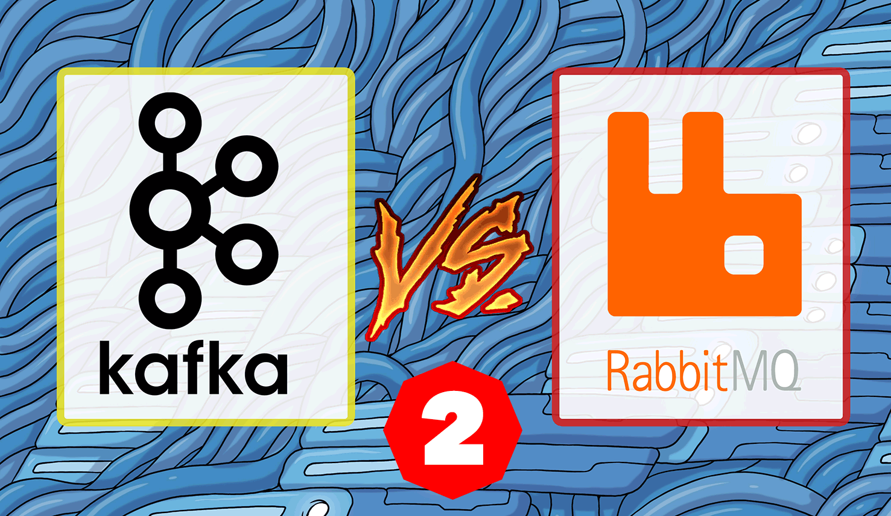
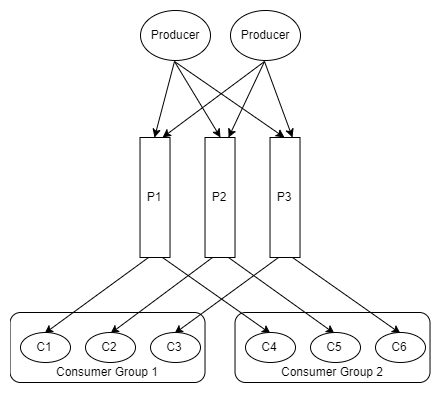
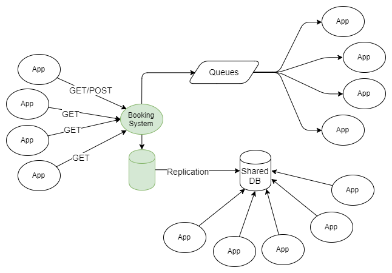
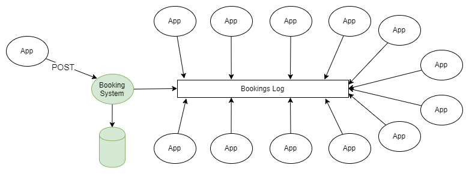
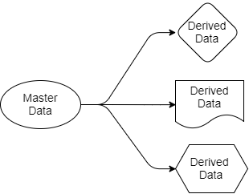

RabbitMQ против Kafka: применение Kafka в событийно ориентированных приложениях / Блог компании ITSumma

В [предыдущей статье](https://habr.com/company/itsumma/blog/416629/) мы рассмотрели шаблоны и топологии, применяемые в RabbitMQ. В этой части мы обратимся к Kafka и сравним её с RabbitMQ, чтобы получить некоторые представления об их различиях. Следует иметь в виду, что сравниваться будут скорее архитектуры событийно-ориентированных приложений, а не конвейеры обработки данных, хотя грань между этими двумя понятиями в данном случае будет довольно размытой. Вообще, это скорее спектр, чем четкое разделение. Просто наше сравнение будет сфокусировано на части этого спектра, связанной с событийно-управляемыми приложениями.

Первое различие, которое приходит в голову, заключается в том, что механизмы повтора и откладывания сообщений, которые используются в RabbitMQ для работы с недоставленными сообщениями в Kafka не имеют смысла. В RabbitMQ сообщения имеют временный характер, они передаются и исчезают. Поэтому их повторное добавление является абсолютно реальным юз-кейсом. А в Kafka центральное место занимает журнал. Решение проблем доставки через повторную отправку сообщения в очередь не имеет смысла и только вредит журналу. Одно из преимуществ заключается в гарантированно чётком распределении сообщений по партициям журнала, повторные сообщения путают стройную схему. В RabbitMQ можно уже отправленные сообщения ставить в очередь, с которой работает один получатель, а на платформе Kafka предусмотрен один журнал для всех получателей. Задержки в доставке и проблемы с доставкой сообщений не представляют большого вреда для работы журнала, но Kafka не содержит встроенных механизмов задержки.

О том, как повторно доставить сообщения на платформе Kafka будет рассказано в разделе о схемах обмена сообщениями.

Второе большое различие, влияющее на возможные схемы обмена сообщениями, заключается в том, что в RabbitMQ сообщения хранятся значительно меньше, чем в Kafka. Когда в RabbitMQ сообщение уже доставлено получателю, оно удаляется, не оставляя следов своего существования. В Kafka каждое сообщение хранится в журнале, пока он не будет очищен. Частота очисток зависит от объёма имеющихся данных, объема дискового пространства, которое планируется для них отвести, и схем обмена сообщениями, которые требуется обеспечить.Можно использовать временное окно, при котором мы храним сообщения за заданный промежуток времени: последние несколько дней/недель/месяцев.

Таким образом, Kafka позволяет получателю вторично просмотреть или переполучить прежние сообщения. Это выглядит как технология переотправки сообщений, хотя работает не совсем так, как в RabbitMQ.

Если RabbitMQ перемещает сообщения и даёт мощные элементы для создания сложных схем их маршрутизации, Kafka сохраняет текущее и прежнее состояние системы. Данная платформа может быть использована как источник достоверных исторических данных так как не может RabbitMQ.

  

### Пример схемы обмена сообщениями на платформе Kafka  

Простейшим примером использования и RabbitMQ, и Kafka является распространение информации по схеме “паблишер-подписчик”. Один или несколько паблишеров добавляют сообщения в партиционированный журнал, и эти сообщения получает подписчик одной или нескольких групп подписчиков.

  
_Рис 1\. Несколько паблишеров отправляют сообщения в партицированный журнал, и их получают несколько групп получателей._

Если не вдаваться в подробности о том, как паблишер направляет сообщения в нужные разделы журнала, и того как координируются между собой группы получателей, данная схема не отличается от топологии fanout (разветвляющий exchange), которая применяется в RabbitMQ.  
В предыдущей статье были рассмотрены все схемы и топологии обмена сообщениями RabbitMQ. Возможно в какой-то момент вы подумали “мне не нужны все эти сложности, я просто хочу посылать и получать сообщения в очереди”, а факт возможности отмотать журнал на предыдущие позиции говорил о явных преимуществах Kafka.

Людей, которые привыкли к традиционным особенностям систем очередей факт возможности перевести часы назад и отмотать журнал событий в прошлое потрясает. Это свойство (имеющееся благодаря использованию журнала вместо очереди) очень полезно для восстановления после сбоев. Я (автор англ. статьи) начал работать на своего текущего клиента 4 года назад в качестве технического руководителя группы поддержки серверной системы. У нас было более 50 приложений, которые получали информацию о бизнес-событиях в режиме реального времени через MSMQ, и обычным делом стало то, что когда в приложении происходила ошибка, система выявляла её только на следующий день. К сожалению, часто в результате сообщения пропадали, но обычно нам удавалось получить исходные данные из сторонней системы и переслать сообщения только тому “подписчику”, у которого возникла проблема. Это потребовало от нас создания инфраструктуры пересылки сообщений для получателей. А если бы у нас была платформа Kafka, выполнить такую работу было бы не сложнее, чем изменить ссылку на расположение последнего полученного сообщения для приложения, в котором произошла ошибка.

  

### Интеграция данных в событийно-ориентированных приложениях и системах

Настоящая схема во многом является средством порождения событий, хотя и не относящихся к одному приложению. Есть два уровня порождения событий: программный и системный. Настоящая схема связана с последним.

  

#### Программный уровень порождения событий

Приложение управляет собственным состоянием через иммутабельную последовательность событий изменений которые хранятся в хранилище событий. Для того, чтобы получить текущее состояние приложения, следует воспроизвести или скомбинировать его события в правильной последовательности. Обычно в такой модели применяется [модель CQRS](https://martinfowler.com/bliki/CQRS.html) Kafka может выступать в качестве этой системы.

  

#### Взаимодействие между приложениями на уровне системы.

Приложения или сервисы могут управлять своим состоянием любым образом, каким пожелает управлять их разработчик, например в обычной реляционной базе данных.

Но приложениям часто нужны данные друг о друге, это приводит к неоптимальности архитектур, например, общим базам данных, размытости границы сущностей или неудобным REST API.

Я (автор англ. статьи) слушал подкаст “[Software Engineering Daily](https://softwareengineeringdaily.com/2016/10/14/kafka-event-sourcing-with-neha-narkhede/)”, в котором описан событийно-ориентированный сценарий для сервиса профилей в социальных сетях. В системе существует некоторое количество связанных сервисов, таких как поиск, система социальных графов, рекомендательный движок и т.д., всем им нужно узнавать об изменении состояния профиля пользователя. Когда я (автор англ. статьи) работал как разработчик архитектуры для системы, связанной с авиаперевозками, у нас были две большие программные системы с мириадами связанных с ними малых служб. Для вспомогательных служб требовались данные о заказах и о полётах. Каждый раз, когда заказ создавался или изменялся, когда рейс задерживался или отменялся, эти службы должны были активироваться.

Здесь потребовалась техника порождения событий. Но сперва рассмотрим некоторые общие проблемы, которые возникают в больших программных системах, и проследим, как порождение событий может их решить.

Большая комплексная корпоративная система обычно развивается органично; проводятся миграции на новые технологии и новые архитектуры, которые могут не затрагивать 100% системы. Данные распространяются по разным частям учреждения, приложения раскрывают базы данных для общего пользования так, чтобы интеграция происходила как можно быстрее, и никто не может с уверенностью предугадать, как все элементы системы будут взаимодействовать.

  

#### Неупорядоченное распространение данных

Данные распространяются по разным местам и управляются в разных местах, поэтому трудно понять:

  

*   как данные перемещаются в бизнес-процессах;
*   как изменения в одной части системы могут сказаться на других частях;
*   что делать с конфликтами данных, которые возникают из-за того, что существует много копий данных, которые распространяются медленно.

Если нет чётких границ доменных сущностей, изменения будут дорогими и рискованными, поскольку затрагивают сразу много систем.

  

#### Централизованная распределенная база данных

Открытая для общего пользования база данных может вызвать несколько проблем:

  

*   Она недостаточно оптимизирована для каждого приложения в отдельности Скорее всего в этой базе хранится излишне полный для приложения набор данных, к тому же нормализованный в таком виде, что приложениям придется запускать очень сложные запросы чтобы получить их.
*   Используя общую базу данных приложения могут влиять на работу друг друга.
*   Изменения в логической структуре базы требуют масштабных согласований и работ по миграции данных, а разработка отдельных сервисов будет остановлена на время всего этого процесса.
*   Никто не захочет менять структуру хранения данных. Изменения, которых все ждут, слишком болезненны.

  

#### Использование неудобного REST API

Получение данных из других систем через REST API с одной стороны добавляет удобство и изоляцию, но по-прежнему может быть не всегда успешно. Каждый такой интерфейс может иметь свой особый стиль и свои условные обозначения. Получение необходимых данных может потребовать много HTTP-запросов и оказаться достаточно сложным.

Мы всё больше движемся по направлению к API-центричности, и такие архитектуры дают много преимуществ, особенно когда сами сервисы находятся вне нашего контроля. В настоящий момент существует столь много удобных способов создания API, что мы не должны писать столько кода, сколько требовалось прежде. Но всё же это не единственный доступный инструмент, и для внутренней архитектуры системы есть и альтернативы.

  

#### Kafka как хранилище событий

Приведём пример. Есть система, которая управляет бронированием в реляционной базе данных. Система использует все гарантии атомарности, согласованности, изолированности и долговечности, предлагаемые базой данных, чтобы эффективно управлять своими характеристиками и все довольны. Разделение ответственности на команды и запросы, порождение событий, микросервисы отсутствуют, в общем традиционно построенный монолит. Но имеются мириады вспомогательных сервисов (возможно, микросервисов), связанных с бронированием: push-нотификации, рассылка e-mail, анти-фрод система, программа лояльности, выписка счетов, система отмены брони, и т.д. Список можно продолжать и продолжать. Для всех этих служб требуются данные о бронировании, и существует множество способов получить их. Эти службы сами производят данные, которые могут быть полезны другим приложениям.

  
_Рис 2\. Различные типы интеграции данных._

Альтернативная архитектура основана на Kafka. При каждом новом бронировании или изменении прежнего бронирования система отправляет полные данные о текущем состоянии этого бронирования на Kafka. Уплотнив журнал можно сократить сообщения, чтобы в нём осталась только информация о последнем состоянии бронирования. При этом размер журнала будет под контролем.

  
_Рис 3\. Основанная на Kafka интеграция данных как основа для порождения событий_

Для всех приложений, для которых это необходимо эта информация является источником истины и единственным источником данных. Внезапно, мы переходим от комплексной сети зависимостей и технологий к отправке и получению данных в/из топиков Kafka.

Kafka как хранилище событий:

  

*   Если нет проблем с дисковым пространством, Kafka может хранить всю историю событий, то есть новое приложение может разворачиваться и загружать всю необходимую информацию из журнала. Записи о событиях, которые, полностью отображают характеристики объектов, могут быть сжаты путём уплотнения журнала, что сделает данный подход для многих сценариев более оправданным.
*   Что, если события должны быть воспроизведены в правильном порядке? Пока записи о событиях правильно распределены, можно задать порядок их воспроизведения и применить фильтры, средства преобразования и т.д., чтобы воспроизведение данных всегда кончалось на необходимой информации. В зависимости от возможности распределения данных, можно обеспечить их высокопараллелизованную обработку в правильном порядке.
*   Может потребоваться смена модели данных. При создании нового фильтра/трансформирующей функции, может быть необходимо воспроизвести записи всех событий или событий за последнюю неделю.

Сообщения могут поступать в Kafka не только от приложений Вашей организации, которые отправляют сообщения обо всех изменениях своих характеристик (или результаты этих изменений) но и от сторонних сервисов, интегрированных с Вашей системой. Это происходит следующими путями:

  

*   Периодический экспорт, передача, импорт данных, получаемых от сторонних сервисов, и их загрузка на Kafka.
*   Загрузка данных из сторонних сервисов в Kafka.
*   Данные из CSV и других форматов выгруженные из сторонних сервисов загружаются в Kafka.

Вернёмся к вопросам, которые мы рассматривали ранее. Архитектура, основанная на Kafka, упрощает распространение данных. Мы знаем, где источник истины, мы знаем, где его источники данных, и все целевые приложения работают с копиями, **выводимыми** из этих данных. Данные идут от отправителя к получателям. Исходные данные принадлежат только отправителю, но другие могут свободно работать с их проекциями. Они могут их фильтровать, трансформировать, дополнять данными из других источников, сохранять в собственных базах данных.

  
_Рис 4\. Исходные и выводимые данные_

Каждое приложение, которому требуются данные о бронировании и рейсах, будет получать их себе, потому что оно “подписано” на те разделы Kafka, которые содержат эти данные. Для этого приложения могут использовать средства SQL, Cypher, JSON или любой другой язык запросов. Приложение может затем сохранить данные в своей системе так, как ему удобно. Схему распространения данных можно менять не влияя на работу других приложений.

Может возникнуть вопрос: почему всё это нельзя делать с помощью RabbitMQ? Ответ в том, что RabbitMQ можно использовать для обработки событий в режиме реального времени, но не как основу для порождения событий. RabbitMQ это полноценное решение только для реагирования на события, которые происходят сейчас. Когда добавляется новое приложение, которому требуется своя часть данных о бронировании, представленных в формате, оптимизированном для задач этого приложения, RabbitMQ не сможет помочь. С RabbitMQ мы возвращаемся к общим базам данных или REST API.

Во-вторых, важен порядок обработки событий. Если работать с RabbitMQ, при добавлении второго получателя в очередь теряется гарантия соблюдения очерёдности. Таким образом, правильный порядок отправки сообщений соблюдается только для одного получателя, но этого, конечно, не достаточно.

Kafka, напротив, может предоставить все данные, которые требуются этому приложению, чтобы создать свою собственную копию данных и поддерживать данные в актуальном состоянии, и при этом Kafka соблюдает очерёдность отправки сообщений.

Теперь снова вернёмся к API-центричным архитектурам. Всегда ли эти интерфейсы будут наилучшим выбором? Когда требуется открыть общий доступ к данным только для чтения, я предпочёл бы архитектуру порождения событий. Она предотвратит каскадные отказы и сокращение срока службы, сопряжённые с повышением количества зависимостей от других служб. Будет больше возможностей для творческого и эффективной организации данных внутри систем. Но иногда требуется синхронно изменить данные и в своей, и в другой системе, и в такой ситуации и API-центричные системы будут полезны. Многие предпочитают их другим асинхронным методам. Думаю, это дело вкуса.

  

### Приложения, чувствительные к высокому трафику и порядку обработки событий.

Не так давно возникла проблема у одного из получателей RabbitMQ, получавшего выстроенные в очередь файлы от стороннего сервиса. Общий объём файлов был велик, и приложение было специально настроено на получение такого объёма данных. Проблема заключалась в том, что данные поступали непоследовательно, это создавало много проблем.

Кроме того, иногда возникала проблема, заключающаяся в том, что иногда два файла предназначались одному адресату, и время их прибытия различалось на несколько секунд. Они оба проходили обработку и должны были быть загружены на один сервер. И после того, как второе сообщение записывалось на сервер, следующее за ним первое сообщение перезаписывало второе. Таким образом все заканчивалось сохранением неверных данных. RabbitMQ выполнял свою роль и отправлял сообщения в правильном порядке, но все-равно все заканчивалось неправильным порядком в самом приложении.

Эту проблему удалось решить путём считывания timestamp-a с уже имеющихся записей и отсутствие реакции в случае если сообщение было старым. Кроме того, при обмене данными было применено консистентное хэширование, и очередь была разделена, как при таком же формировании партиций на платформе Kafka.

В рамках партиции Kafka хранит сообщения в том порядке, в котором они были на неё отправлены. Порядок сообщений существует только в рамках партиции. В примере выше с помощью Kafka мы должны были применить функцию хэширования к id адресата, чтобы выбрать нужную партицию. Мы должны были создать набор партиций, их должно было быть больше, чем требуется клиенту. Порядок обработки сообщений должен был быть достигнут благодаря тому, что каждая партиция предназначена только для одного получателя. Просто и эффективно.

Kafka по сравнению с RabbitMQ имеет некоторые преимущества, связанные с разделением сообщений с использованием хэширования. На платформе RabbitMQ нет ничего, что предотвращало бы конфликты получателей в рамках одной очереди, образующейся в рамках обмена данными с использованием консистентного хэширования. RabbitMQ не помогает координировать получателей, чтобы только один получатель из всей очереди использовал сообщение. Kafka обеспечивает всё это благодаря применению групп получателей и узла координатора. Это позволяет удостовериться в том, что только один получатель в разделе будет гарантированно использовать сообщение, и что порядок обработки данных гарантирован.

  

### Локальность данных

Применяя функцию хэширования для распределения данных по разделам Kafka обеспечивает локальность данных. Например, сообщения от пользователя с id 1001 должны всегда поступать получателю 3. Поскольку события пользователя 1001 всегда поступают получателю 3, получатель 3 может эффективно производить некоторые операции, которые были бы гораздо сложнее, если бы требовалось регулярное обращение с внешней БД или другим системам за получением данных. Мы можем считать данные, выполнять агрегации и т.п. непосредственно с информацией в памяти получателя. Это — то самое место где начинают объединяться событийно-ориентированные приложения и потоковая обработка данных.

Как же Kafka обеспечивает локальность данных? Для начала важно отметить, что Kafka не позволяет эластично увеличивать и уменьшать количество партиций. Прежде всего, вы не можете уменьшить количество партиций вообще: если их 10, сократить численность до 9 нельзя. Но, с другой стороны, это и не требуется. Каждый получатель может использовать как 1, так и несколько партиций, следовательно, вряд ли необходимо сокращать их количество. Создание дополнительных партиций на Kafka приводит к задержке в момент ребалансировки, поэтому мы стараемся при масштабировать количество партиций с учетом пиковых нагрузок.

Но если нам всё же требуется увеличить количество разделов и получателей в целях масштабирования, нужны будут только разовые косвенные затраты в случае необходимости ребалансировки. Следует обратить внимание на то, что при масштабировании старые данные остаются в тех же партициях где они были. Но новые поступающие сообщения уже будут маршрутизированы по другому, и новые партиции начнут получать новые сообщения. Сообщения пользователя 1001 теперь могут попасть к получателю 4 (потому что данные о пользователе 1001 теперь в двух разделах).

Дальше мы сравним и сопоставим семантику доставки сообщений доставки в обеих системах. Тема ребалансировки и партиционирования заслуживает отдельной статьи, об этом мы расскажем в следующей части.