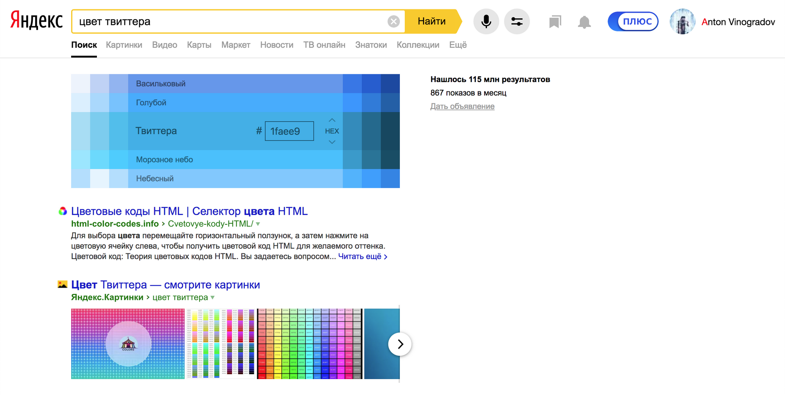

React & БЭМ – официальная коллаборация. Часть историческая / Блог компании Яндекс

Перед вами история интегрирования БЭМ-методологии в React-вселенную. Материал, который вы прочитаете, построен на опыте разработчиков Яндекса, развивающих самый масштабный и нагруженный сервис в России — Яндекс.Поиск. Мы никогда раньше не рассказывали настолько подробно и глубоко о том, почему делали так, а не иначе, что нами двигало и чего мы действительно хотели. Внешнему человеку доставались сухие релизы и обзоры на конференциях. Лишь в кулуарах можно было услышать нечто подобное. Я как соавтор негодовал из-за скудности информации снаружи каждый раз, когда рассказывал о новых версиях библиотек. Но в этот раз мы поделимся всеми подробностями.


Все слышали о методологии БЭМ. CSS-селекторы с подчёркиваниями. [Компонентный подход](https://en.bem.info/methodology/key-concepts/), о котором говорят, имея в виду способ написания CSS-селекторов. Но про CSS в статье не будет ни слова. Только JS, только хардкор!

Чтобы понимать, почему появилась методология и с какими проблемами тогда столкнулся Яндекс, я рекомендую вам [ознакомиться с историей](https://en.bem.info/methodology/history/) БЭМ.

  

## Пролог

БЭМ и правда зарождался как спасение от сильной связности и вложенности в CSS. Но деление простыней `style.css` на файлы для каждого блока, элемента или модификатора неизбежно привело к схожему структурированию JavaScript-кода.

В 2011 году Open Source обзавёлся [первыми коммитами](https://github.com/bem/bem-bl/commit/d7face465663ab5e9c77501edbfd2016e90bf75a#diff-b6c33966158b77b189ddb6dfb072231f) фреймворка [`i-bem.js`](https://en.bem.info/technologies/classic/i-bem/), который работал в связке с шаблонизатором [`bem-xjst`](https://en.bem.info/technologies/classic/bem-xjst/8/). Обе технологии выросли из [XSLT](https://en.wikipedia.org/wiki/XSLT) и служили популярной тогда идее разделять бизнес-логику и представление компонента. Во внешнем мире это были [прекрасные времена](https://code.tutsplus.com/tutorials/best-practices-when-working-with-javascript-templates--net-28364) Handlebars и Underscore.

`bem-xjst` — шаблонизатор иного типа. Чтобы пополнить знания об архитектуре подходов к шаблонизации, я настоятельно рекомендую [доклад Сергея Бережного](https://www.youtube.com/watch?v=VwzcEEAfNCs). А сам шаблонизатор `bem-xjst` можете попробовать в [онлайн-песочнице](https://bit.ly/2S3uLIe).

В силу специфики поисковых сервисов Яндекса пользовательские интерфейсы строятся по данным. Страница результатов поиска уникальна для каждого запроса.

  
_Поисковый запрос по [ссылке](https://yandex.ru/search/?text=%D0%B1%D0%BE%D0%B5%D0%B2%D0%B8%D0%BA%D0%B8&lr=213)_

  
_Поисковый запрос по [ссылке](https://yandex.ru/search/?text=%D1%86%D0%B2%D0%B5%D1%82%20%D1%82%D0%B2%D0%B8%D1%82%D1%82%D0%B5%D1%80%D0%B0&lr=213)_

  
_Поисковый запрос по [ссылке](https://yandex.ru/search/?text=%D1%80%D0%B5%D1%86%D0%B5%D0%BF%D1%82%20%D1%80%D0%BE%D1%81%D1%82%D0%B1%D0%B8%D1%84%D0%B0&lr=213)_

Когда деление на блок, элемент и модификатор распространилось на файловую систему, это позволило максимально эффективно собирать только нужный код, фактически под каждую страницу, под каждый запрос пользователя. Но как?

  

    src/components
    ├── ComponentName
    │   ├── _modName
    │   │   ├── ComponentName_modName.tsx — простой модификатор
    │   │   └── ComponentName_modName_modVal.tsx — модификатор со значением
    │   ├── ElementName
    │   │   └── ComponentName-ElementName.tsx — элемент блока ComponentName
    │   ├── ComponentName.i18n — файлы переводов
    │   │   ├── ru.ts — словарь для русского языка
    │   │   ├── en.ts — словарь для английского языка
    │   │   └── index.ts — словарь используемых языков
    │   ├── ComponentName.test — файлы переводов
    │   │   ├── ComponentName.page-object.js — Page Object
    │   │   ├── ComponentName.hermione.js — функциональный тест
    │   │   └── ComponentName.test.tsx — unit-тест
    │   ├── ComponentName.tsx — визуальное представление блока
    │   ├── ComponentName.scss — визуальные стили
    │   ├── ComponentName.examples.tsx — примеры компонента для Storybook
    │   └── README.md — описание компонента

_Современная структура директории компонента_

Как и в некоторых других компаниях, в Яндексе разработчики интерфейсов отвечают за фронтенд, состоящий из клиентской части в браузере и серверной части на `Node.js`. Серверная часть обрабатывает данные «большого» поиска и накладывает на них шаблоны. Первичная обработка данных преобразует JSON в [BEMJSON](https://ru.bem.info/technologies/classic/bemjson/) — структуру данных для шаблонизатора `bem-xjst`. Шаблонизатор обходит каждый узел дерева и накладывает на него шаблон. Так как первичное преобразование происходит на сервере и благодаря делению на мелкие сущности узлы соответствуют файлам, при шаблонизации мы пушим в браузер код, который будет использован только на текущей странице.

Ниже соответствие BEMJSON ноды файлам на файловой системе.

  

    module.exports = {
        block: 'Select',
        elem: 'Item',
        elemMods: {
            type: 'navigation'
        }
    };

  

    src/components
    ├── Select
    │   ├── Item
    │   │   _type
    │   │   ├── Select-Item_type_navigation.js
    │   │   └── Select-Item_type_navigation.css

За изоляцию компонентов JavaScript-кода в браузере отвечала модульная система [`YModules`](https://github.com/ymaps/modules). Она позволяет синхронно и асинхронно доставлять модули в браузер. Пример работы компонентов с `YModules` и `i-bem.js` [можно найти здесь](https://github.com/bem/bem-components). Сегодня для большинства разработчиков подобное делает [`модульная система webpack`](https://webpack.js.org/concepts/modules/) и невышедший [стандарт динамических импортов](https://developer.mozilla.org/en-US/docs/Web/JavaScript/Reference/Statements/import#Dynamic_Imports).

Набор из БЭМ-методологии, декларативного шаблонизатора и JS-фреймворка с модульной системой позволял решать любую задачу. Но со временем в пользовательские интерфейсы пришла динамика.

  

## Новая надежда

В 2013 году в Open Source феерично пришёл [React](https://reactjs.org/). На самом же деле Facebook начал использовать его ещё в 2011 году. Джеймс Лонг (James Long) в своих записях с конференции [JS Conf US](http://2013.jsconf.us/) говорит:

  

> The last two sessions were a surprise. The first one was given by two Facebook developers and they announced [Facebook React](https://reactjs.org/). I didn’t take many notes because I was kind of in shock of how bad of an idea I think it is. Essentially, they created a language called JSX which lets you embed XML in JavaScript to create live reactive user interfaces. XML. In JavaScript. 

React изменил подход к проектированию веб-приложений. Он стал настолько популярен, что сегодня не найти разработчика, который бы не слышал о React. Но важно иное: приложения стали другими, в нашу жизнь пришли [SPA](https://ru.wikipedia.org/wiki/%D0%9E%D0%B4%D0%BD%D0%BE%D1%81%D1%82%D1%80%D0%B0%D0%BD%D0%B8%D1%87%D0%BD%D0%BE%D0%B5_%D0%BF%D1%80%D0%B8%D0%BB%D0%BE%D0%B6%D0%B5%D0%BD%D0%B8%D0%B5).

Принято считать, что у разработчиков Яндекса особенное чувство прекрасного в отношении технологий. Порой странное, с чем спорить сложно, но безосновательное — никогда. Когда React набирал [звезды на GitHub](https://github.com/facebook/react/stargazers), многие, кто были знакомы с веб-технологиями Яндекса, настаивали: Facebook победил, бросайте свои поделки и бегите всё переписывать на React, пока не поздно. Тут важно понимать две вещи. 

Во-первых, не было войны. Компании не соревнуются в создании лучшего фреймворка на Земле. Если компания начнёт тратить меньше времени (читай — денег) на инфраструктурные задачи при той же продуктивности, все от этого только выиграют. Нет смысла писать фреймворки, чтобы писать фреймворки. Лучшие разработчики создают инструменты, которые решают задачи компании лучшим способом. Компании, сервисы, цели — всё это разное. Отсюда многообразие инструментов.

Во-вторых, мы искали способ применять React так, как бы именно нам этого хотелось. Со всеми возможностями, что давали наши технологии, описанные выше.

Бытует мнение, что код с использованием React по умолчанию быстрый. Если так считаете и вы, то глубоко заблуждаетесь. Единственное, что делает React, — в большинстве случаев помогает оптимально взаимодействовать с DOM.

Вплоть до версии 16 React обладал фатальным недостатком. Он был в 10 раз медленнее `bem-xjst` на сервере. Мы не могли позволить себе такое расточительство. Время ответа для Яндекса — одна из ключевых метрик. Представьте, на запрос с рецептом глинтвейна вы получите ответ в 10 раз медленнее обычного. Вас не устроят оправдания, даже если вы хоть что-то смыслите в веб-разработке. Что уж говорить об объяснении вроде «зато разработчикам стало удобнее общаться с DOM». Прибавьте сюда соотношение цены внедрения и профита — и вы сами примете единственно верное решение.

К счастью ли к горю, разработчики — странные люди. Если что-то не получается, то это совсем не повод всё бросать…

  

## Шиворот-навыворот

Мы были уверены, что можем победить медлительность React. У нас уже есть быстрый шаблонизатор. Всего-то надо на сервере генерировать HTML, используя `bem-xjst`, а на клиенте «заставить» React принять эту разметку за свою. Идея была настолько проста, что ничто не предвещало провала.

В версиях до 15 включительно React валидировал достоверность разметки через хеш-сумму — алгоритм, который любую оптимизацию превращает в тыкву. Чтобы убедить React в валидности разметки, требовалось проставить каждой ноде id и вычислить хеш-сумму всех нод. Также это означало поддержку двойного набора шаблонов: React для клиента и `bem-xjst` для сервера. Простые тесты на скорость с простановкой id дали понять, что продолжать нет смысла.

Шаблонизатор `bem-xjst` — очень недооценённый инструмент. Посмотрите [доклад главного мейнтейнера Славы Олиянчука](https://www.youtube.com/watch?v=skigiSOmkyQ) и сами во всём убедитесь. `bem-xjst` построен на базе архитектуры, которая позволяет использовать один синтаксис шаблонов для разных преобразований исходного дерева. Очень похоже на React, не так ли? Эта особенность сегодня позволяет существовать таким инструментам, как [`react-sketchapp`](https://github.com/airbnb/react-sketchapp).

Из коробки `bem-xjst` содержит два вида преобразований: в HTML и в JSON. Любой достаточно усидчивый разработчик может написать свой движок преобразований шаблонов во что угодно. Мы научили `bem-xjst` преобразовывать дерево с данными в последовательность вызовов [HyperScript-функций](https://github.com/hyperhype/hyperscript). Что означало полную совместимость и с React, и с другими реализациями Virtual DOM алгоритма, например с [Preact](https://preactjs.com/).

  

_Подробный рассказ о подходе с генерацией вызовов HyperScript-функций_

Поскольку шаблоны React предполагают совместное существование вёрстки и бизнес-логики, нам пришлось принести логику из `i-bem.js` в свои шаблоны, для этого не предназначенные. Для них это было противоестественно. Они и собирались иначе. Кстати!

Ниже пример из глубин склеивания разных миров в одном рантайме.

  

    block('select').elem('menu')(
        def()(function() {
            const React = require('react');
            const Menu = require('../components/menu/menu');
            const MenuItem = require('../components/menu-item/menu-item');
            const _select = this.ctx._select;
            const selectComponent = _select._select;
    
            return React.createElement.apply(React, [
                Menu,
                {
                    mix: { block : this.block, elem : this.elem },
                    ref: menu => selectComponent._menu = menu,
                    size: _select.mods.size,
                    disabled: _select.mods.disabled,
                    mode: _select.mods.mode,
                    content: _select.options,
                    checkedItems: _select.bindings.checkedItems,
                    style: _select.bindings.popupMenuWidth,
                    onKeyDown: _select.bindings.onKeyDown,
                    theme: _select.mods.theme,
                }].concat(_select.options.map(option => React.createElement(
                    MenuItem,
                    {
                        onClick: _select.bindings.onOptionCheck,
                        theme: _select.mods.theme,
                        val: option.value,
                    }, option.content)
                ))
            );
        })
    );

Конечно, у нас была своя сборка. Как известно, самая быстрая операция — это конкатенация строк. На ней построен движок `bem-xjst`, на ней же строилась сборка. Файлы блоков, элементов и модификаторов лежали по папочкам, и сборке надо было только склеить файлы в правильной последовательности. При таком подходе можно параллельно склеивать JS, CSS и шаблоны, равно как и сами сущности. То есть если у вас в проекте четыре компонента, на ноутбуке четыре ядра, а сборка одной технологии компонента занимает одну секунду, то сборка проекта займёт две секунды. Тут должно становиться понятнее как нам удаётся пушить в браузер только необходимый код.

Всё это для нас делал [ENB](https://ru.bem.info/toolbox/enb). Итоговое дерево для шаблонизации мы получали только в рантайме, а так как зависимость между компонентами должна была возникнуть немного раньше, чтобы собирать бандлы, то эту функцию на себя взяла мало кому известная технология [`deps.js`](https://ru.bem.info/technologies/classic/deps-spec). Она позволяла строить граф зависимостей между компонентами, после чего сборщик мог склеить код в нужной последовательности, обходя граф. 

Работу в этом направлении прекратил выход React версии 16. Скорости выполнения шаблонов на сервере [сравнялись](https://github.com/awinogradov/xjst-benchmarks). На мощностях продакшна разница становилась незаметной.

Node: **v8.4.0**  
Children: **5K**

  

| renderer | mean time | ops/sec |
| --- | --- | --- |
| **preact** v8.2.6 | 66.235ms | 15  |
| **bem-xjst** v16.1.0 | 71.326ms | 14  |
| **react** v16.1.0 | 73.966ms | 14  |

По ссылкам ниже можно восстановить историю подхода:

  

*   [https://ru.bem.info/forum/961/](https://ru.bem.info/forum/961/)

*   [https://github.com/awinogradov/react-bl](https://github.com/awinogradov/react-bl)
*   
[https://github.com/awinogradov/xjst-ddsl](https://github.com/awinogradov/xjst-ddsl)

*   [https://github.com/awinogradov/ddsl-react](https://github.com/awinogradov/ddsl-react)

Пробовали ли мы что-то ещё?

  

*   [https://github.com/veged/bem-components-react](https://github.com/veged/bem-components-react) — первый подход к имплементации методологии в React;
*   [https://github.com/Yeti-or/bem-hazard](https://github.com/Yeti-or/bem-hazard) — подобный подход на основе шаблонизатора BH. С BH, кстати, можно поиграться онлайн;
*   [https://github.com/dfilatov/bem-react](https://github.com/dfilatov/bem-react) — создание компонентов через BEMJSON;
*   [https://github.com/rebem](https://github.com/rebem) — утилиты для работы с БЭМ в мире React.


  

## Мотивация

В середине рассказа будет нелишним поговорить о том, что нами двигало. Стоило сделать это в начале, но — кто старое помянет, тому глаз в подарок. Зачем нам всё это? Что такого может принести БЭМ, чего не может React? Вопросы, которые задаёт чуть ли не каждый.

  

### Декомпозиция

Функциональность компонентов из года в год усложняется, и количество вариаций увеличивается. Это выражается конструкциями `if` или `switch`, в итоге неизбежно растёт кодовая база, как следствие — увеличивается вес компонента и использующего такой компонент проекта. Основная часть логики React-компонента заключена в методе `render()`. Чтобы изменить функциональность компонента, необходимо переписать большую часть метода, что неизбежно ведёт к экспоненциальному росту количества узкоспециализированных компонентов. 

Все знают библиотеки [material-ui](https://material-ui.com/), [fabric-ui](https://developer.microsoft.com/en-us/fabric) и [react-bootstrap](https://github.com/react-bootstrap/react-bootstrap). В целом у всех [известных библиотек](https://reactjs.org/community/ui-components.html) с компонентами один и тот же недостаток. Представьте, что у вас несколько проектов и все используют одну библиотеку. Вы берёте одни и те же компоненты, но в разных вариациях: тут селекты с чекбоксами, там без, тут синие кнопки с иконкой, там красные без. Вес CSS и JS, который вам приносит библиотека, во всех проектах будет одинаков. Но почему? Вариации компонентов заэмбежены внутрь самого компонента и поставляются вместе с ним, хотите вы этого или нет. Для нас это неприемлемо.

В Яндексе тоже есть своя библиотека с компонентами — Лего. Применяется в ~200 сервисах. Хотим ли мы, чтобы использование Лего в Поиске стоило столько же для Яндекс.Здоровья? Ответ вы знаете.

  

### Кроссплатформенная разработка

Чтобы поддерживать несколько платформ, чаще всего создают или отдельную версию для каждой платформы, или одну адаптивную.

Разработка отдельных версий требует дополнительных ресурсов: чем больше платформ, тем больше усилий. Поддержка синхронного состояния продуктовых свойств в разных версиях вызовет новые сложности.

Разработка адаптивной версии усложняет код, увеличивает вес, снижает скорость работы продукта при должной разнице между платформами.

Хотим ли мы, чтобы наши родители/друзья/коллеги/дети пользовались десктопными версиями на мобильных с более низкой скоростью интернета и более низкой производительностью? Ответ вы знаете.

  

### Эксперименты

Если вы разрабатываете проекты для большой аудитории, надо быть уверенными в каждом изменении. A/B-эксперименты — один из способов получить такую уверенность.

Способы организации кода для экспериментов:

  

*   форк проекта и создание инстансов сервиса в продакшне;
*   точечные условия внутри кодовой базы.

Если в проекте много длительных экспериментов, ветвление кодовой базы вызывает существенные расходы. Надо поддерживать актуальной каждую ветку с экспериментом: портировать исправленные ошибки и продуктовую функциональность. Ветвление кодовой базы кратно усложняет пересекающиеся эксперименты.

Точечные условия работают гибче, но усложняют кодовую базу: условия эксперимента могут затрагивать разные части проекта. Большое количество условий ухудшает производительность за счёт увеличения объёма кода для браузера. Надо убирать условия, делать код основным или полностью удалять неудачный эксперимент.

В Поиске ~100 экспериментов онлайн в различных комбинациях на различной аудитории. Вы могли это видеть сами. Вспомните, может, вы замечали функциональность, а спустя неделю она магически исчезала. Хотим ли мы проверять продуктовые теории ценой поддержания сотен веток активной кодовой базы в 500 000 строк, которую изменяют ~60 разработчиков ежедневно? Ответ вы знаете.

  

### Глобальные изменения 

Например, можно создать компонент `CustomButton`, унаследованный от `Button` из библиотеки. Но унаследованный `CustomButton` не применится ко всем компонентам из библиотеки, содержащим `Button`. В библиотеке может быть компонент `Search`, построенный из `Input` и `Button`. В этом случае внутри компонента `Search` не появится унаследованный `CustomButton`. Хотим ли мы вручную обходить всю кодовую базу, где используется `Button`?


  

## Долгая дорога в композицию

Мы решили изменить стратегию. В предыдущем подходе брали за основу технологии Яндекса и пытались заставить React работать на этой основе. Новая тактика предполагала обратное. Так появился проект [bem-react-core](https://github.com/bem/bem-react).

  

> Стоп! Почему вообще React?

Мы увидели в нём возможность избавиться от явного первоначального рендеринга в HTML и от ручной поддержки состояния JS-компонента уже потом в рантайме — по сути, стало возможным слить в одну технологию BEMHMTL-шаблоны и JS-компоненты.

  

### [v1.0.0](https://github.com/bem/bem-react/tree/v1.0.0)

Вначале мы планировали перенести все лучшие практики и свойства `bem-xjst` в библиотеку поверх React. Первое, что бросается в глаза, — это сигнатура, или, если вам удобнее, синтаксис описания компонентов.

_Что вы наделали, есть же JSX!_

Первая версия была построена на базе [inherit](https://github.com/dfilatov/inherit) — библиотеки, которая помогает реализовывать классы и наследование. Как некоторые из вас помнят, в те самые времена апплай прототайпов в JavaScript не было классов, не было `super`. В общем, их и сейчас нет, точнее, это не те классы, которые в первую очередь приходят на ум. `inherit` делала всё, что сейчас умеют классы в стандарте ES2015, и то, что принято считать чёрной магией: множественное наследование и слияние прототипов вместо перестроения цепочки, что положительно влияет на производительность. Вы не ошибётесь, если подумаете, что это похоже по смыслу на [inherits в Node.js](https://nodejs.org/docs/latest/api/util.html#util_util_inherits_constructor_superconstructor), но работают они по-разному.

Ниже пример синтаксиса шаблонов `bem-react-core@v1.0.0`.

**App-Header.js**

  

    import { decl } from 'bem-react-core';
    
    export default decl({
      block: 'App',
      elem: 'Header',
      attrs: {
        role: 'heading'
      },
      content() {
        return 'я заголовок';
      }
    });

**App-Header@desktop.js**

  

    import { decl } from 'bem-react-core';
    
    export default decl({
      block: 'App',
      elem: 'Header',
      tag: 'h1',
      attrs() {
        return {
          ...this.__base(...arguments),
          'aria-level': 1
        },
      },
      content() {
        return `А ${this.__base(...arguments)} на десктопах превращаюсь в h1`;
      }
    });

**App-Header@touch.js**

  

    import { decl } from 'bem-react-core';
    
    export default decl({
      block: 'App',
      elem: 'Header',
      tag: 'h2',
      content() {
        return `А ${this.__base(...arguments)} на тачах`;
      }
    });

**index.js**

  

    import ReactDomServer from 'react-dom/server';
    import AppHeader from 'b:App e:Header';
    
    ReactDomServer.renderToStaticMarkup(<AppHeader />);

**output@desktop.html**

  

    <h1 class="App-Header" role="heading" aria-level="1">A я заголовок на десктопах превращаюсь в h1</h2>

**output@touch.html**

  

    <h2 class="App-Header" role="heading">я заголовок на тачах</h2>

_Устройство шаблонов более сложных компонентов можно посмотреть [здесь](https://github.com/bem/bem-react-components)._

Поскольку класс есть объект, а работать с объектами в JavaScript удобнее всего, синтаксис вышел соответствующим. Позже [синтаксис перекочевал](https://github.com/bem/bem-xjst/pull/497) в своего вдохновителя `bem-xjst`.

Библиотека представляла собой глобальное хранилище из объектныx деклараций — результатов выполнения функции `decl`, частей сущностей: блока, элемента или модификатора. БЭМ предоставляет механизм уникального именования и поэтому подходит для создания ключей в хранилище. Итоговый React-компонент склеивался по месту своего использования. Хитрость в том, что `decl` отрабатывал при импорте модуля. Это позволяло указывать, какие части компонента нужны в каждом конкретном месте, с помощью простого списка импортов. Но вспомните: компоненты сложные, частей много, список импортов длинный, разработчики ленивые.

  

#### Магия импортов

Как вы могли заметить, в примерах кода есть строки `import AppHeader from 'b:App e:Header'`.

_Вы сломали стандарт! Так нельзя! Это просто не будет работать!_

Во-первых, стандарт импортов не оперирует терминами в духе «в строке импорта должен быть путь до реально существующего модуля». Во-вторых, это синтаксический сахар, который преобразовывался с помощью Babel. В-третьих, странные конструкции из знаков препинания в импортах для webpack `import txt from 'raw-loader!./file.txt';` почему-то никого не смущали.  
Итак, наш блок представлен в двух платформах: `desktop`, `touch`.

  

    import Hello from 'b:Hello';
    ``` 
    
    Запись будет трансформирована в следующее:
    
    ``` javascript
    var Hello = [

        require('path/to/desktop/Hello/Hello.js'),

        require('path/to/touch/Hello/Hello.js')

    ][0].applyDecls();

Здесь в коде произойдёт последовательный импорт всех определений компонента `Hello`, а затем вызов функции `applyDecls`, которая склеит все декларации блока из глобального хранилища через `inherit` и создаст новый, уникальный для конкретного места в проекте React-компонент.

Плагин для Babel, выполняющий такое преобразование, можно [найти здесь](https://github.com/bem/babel-plugin-bem-import). А лоадер для webpack, который искал на файловой системе определения компонентов, [вот здесь](https://github.com/bem/webpack-bem-loader).

В итоге, что было хорошо:

  

*   краткий, декларативный синтаксис шаблонов, позволяющий доопределять разные части компонента в любом месте проекта;
*   нет цепочек прототипов в наследовании;
*   уникальный React-компонент для каждого места использования.

А это было плохо:

  

*   нет поддержки TypeScript/Flow;
*   непривычный для большинства React-разработчиков синтаксис;
*   из-за динамической природы импортов невозможно поставлять код в транспилированном виде;
*   обязательна специальная настройка сборки на проекте.

  

### [v2.0.0](https://github.com/bem/bem-react/tree/v2.0.0)

Мы учли опыт использования `bem-react-core@v1.0.0` в проектах, отзывы и здравый смысл и попробовали снова.

  

    import { Elem } from 'bem-react-core';
    import { Button } from '../Button';
    
    export class AppHeader extends Elem {
        block = 'App';
        elem = 'Header';
    
        tag() {
            return 'h2';
        }
    
        content() {
            return (
                <Button>Я кнопка</Button>
            );
        }
    }

В качестве синтаксиса описания блоков, элементов и модификаторов выбрали классы. Классы отличаются декларативной записью, встроенной поддержкой наследования, они просто великолепно работают с TypeScript/Flow. Внимательный читатель заметил, что мы отказались от `inherit` и «своих» импортов, что означало более удобную отладку, но и более длинную цепочку прототипов со всеми вытекающими последствиями для производительности.

Основными задачами были:  
— отказаться от дополнительных надстроек в виде лоадеров для webpack и плагинов для Babel;  
— максимально приблизиться к привычному всем языку;  
— обзавестись нативной поддержкой всех инструментов для отладки, написания и тестирования кода.

Объявление модификаторов мы убрали за всем привычные [HOC](https://reactjs.org/docs/higher-order-components.html), внутри них создавали новый класс относительно базового и доопределяли нужные методы базового класса.

  

    import * as React from 'react';
    import * as ReactDOM from 'react-dom';
    import { Block, Elem, withMods } from 'bem-react-core';
    
    interface IButtonProps {
        children: string;
    }
    
    interface IModsProps extends IButtonProps {
        type: 'link' | 'button';
    }
    
    
    class Text extends Elem {
        block = 'Button';
        elem = 'Text';
    
        tag() {
            return 'span';
        }
    }
    
    
    class Button<T extends IModsProps> extends Block<T> {
        block = 'Button';
    
        tag() {
            return 'button';
        }
    
        mods() {
            return {
                type: this.props.type
            };
        }
    
        content() {
            return (
                <Text>{this.props.children}</Text>
            );
        }
    }
    
    
    class ButtonLink extends Button<IModsProps> {
        static mod = ({ type }: any) => type === 'link';
    
        tag() {
            return 'a';
        }
    
        mods() {
            return {
                type: this.props.type
            };
        }
    
        attrs() {
            return {
                href: 'www.yandex.ru'
            };
        }
    }
    
    
    const ButtonView = withMods(Button, ButtonLink);
    
    ReactDOM.render(
        <React.Fragment>
            <ButtonView type='button'>Click me</ButtonView>
            <ButtonView type='link'>Click me</ButtonView>
        </React.Fragment>,
        document.getElementById('root')
    );

Спустя некоторое время мы нашли архитектурные проблемы в работе модификаторов и целый ряд недостатков, которые невозможно было решить исправлениями.

`withMods` принимал аргументами базовый класс блока и классы, расширяющие базовый (модификаторы), модификаторы обладали предикатом на входящие пропсы. При отрисовке компонентов, как только срабатывает предикат модификатора, withMods перестраивает цепочку прототипов относительно всех активных модификаторов так, чтобы каждый следующий был наследником предыдущего. Так происходит при каждом изменении пропсов. На первой отрисовке не случается никаких проблем, но, как только начинают включаться модификаторы, базовый блок (его прототип) получает функциональность модификатора. В результате все инстансы на странице будут обладать всей функциональностью модификаторов независимо от входящих пропсов. Кейс может повториться и на второй перерисовке, и на третьей, и на четвёртой — в зависимости от того, когда сработают предикаты модификаторов.

Решения, которые не помогли:

  

*   Заворачивать модификаторы в функцию. Так, чтобы на каждый вызов модификатора возвращался новый класс. Частично решает проблему, но несовместимо с TS. Так как из функции модификатора начинает возвращаться класс, который экстендит базовый из внешнего скопа. При компиляции для ES5 TS перестраивает вызовы super не через прототип, а через внешнюю ссылку на базовый класс из константы. Да, TS транспилирует код не по стандартам, а как ему нравится.
*   Компилировать в два прохода. TS для ES6 и Babel для ES5. Помогает только на уровне собираемого проекта, поставляемый код в npm-пакетах так обработан не будет. Кроме того, это сильно замедлит сборку и завяжет всех на использование Babel.

Дополнительные трудности:

  

*   Невозможно расширить базовые блоки на уровне проекта, который их использует. Например, использовать блоки библиотек на сервисах. Кейс: атрибуты счетчиков на DOM-нодах. Расширить можно только через HOC, а модификаторы применяются только к классу. Всякое использование withMods не закрывало доступ к методам базового класса.
*   Все сущности (блок, элемент, модификатор) для правильной генерации классов обязаны быть классами. Тогда как большинство сущностей обладают слабой функциональностью и могут быть выражены через [SFC](https://reactjs.org/docs/components-and-props.html#function-and-class-components).
*   Жирные CSS-модификаторы. Любой CSS-модификатор обязан иметь JS-представление в виде расширения базового класса. Это не проблема само по себе, но было подозрение, что такой подход не снижал нам количество кода в браузере.

Мы были вынуждены прервать разработку v2.

  

## Манифест

Естественно, это нас не остановило. Мы написали манифест. Следуя ему, можно было решить проблемы, которые мы встретили в версиях 1 и 2. Ниже я перескажу часть из [этого манифеста](https://github.com/bem/bem-react/tree/master/docs/ru).

Основная мысль — работаем через полную композицию. Работу с CSS-классами и модификаторы выражаем через HOC, а переопределение кода по платформам и экспериментам — через [dependency injection](https://ru.wikipedia.org/wiki/%D0%92%D0%BD%D0%B5%D0%B4%D1%80%D0%B5%D0%BD%D0%B8%D0%B5_%D0%B7%D0%B0%D0%B2%D0%B8%D1%81%D0%B8%D0%BC%D0%BE%D1%81%D1%82%D0%B8).

Необходимое и достаточное от БЭМ в React:

  

*   работа с CSS-классами.
*   декларативное разделение кода по [модификаторам](https://ru.bem.info/methodology/key-concepts/#%D0%9C%D0%BE%D0%B4%D0%B8%D1%84%D0%B8%D0%BA%D0%B0%D1%82%D0%BE%D1%80) и [уровням переопределения](https://ru.bem.info/methodology/redefinition-levels/) (платформам, экспериментам);

Модификатор более не сможет влиять на внутреннее устройство компонента. Дополнительная функциональность должна быть выражена через управляющие компоненты сверху. А сами компоненты могут быть выражены как `React.ComponentType` по необходимости без базовых БЭМ-компонентов. Подключение модификаторов не отличается от подключения любых других HOC и работает через любой compose и в любом порядке.

Модификатор определяет истинность предиката и добавит дополнительный класс через пропсы к базовому классу.

Переопределение компонентов и их составляющих выражается через dependency injection, которое реализуется на базе [`React.ContextAPI`](https://reactjs.org/docs/context.html) и множественных реестров компонентов. Каждый компонент волен регистрировать свои зависимости в реестре и позволять переопределять их сверху, что напрямую не заложено в работу стандартного контекста, но реализуется иным способом вычисления нового значения контекста. По умолчанию зависимости можно переопределять по контексту вниз, что есть стандартный механизм работы контекста. В итоге DI — это HOC, который провайдит реестры в контекст. Реестры могут работать в режимах проваливания и всплытия зависимостей. Это позволяет переопределять что угодно, где угодно, на любом уровне вложенности простым дописыванием компонентов в реестр.

То, что у нас получилось, уже можно увидеть в продакшене на странице результатов Поиска. Мы уместили всё, что нам было необходимо от БЭМ, в библиотеку из 4 пакетов, общим весом в `1.5Kb`.

На этом историческая часть заканчивается. Спасибо тем, кто дочитал до конца. В следующей статье я расскажу, как мы работаем с React в Яндекс.Поиске сегодня.