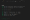
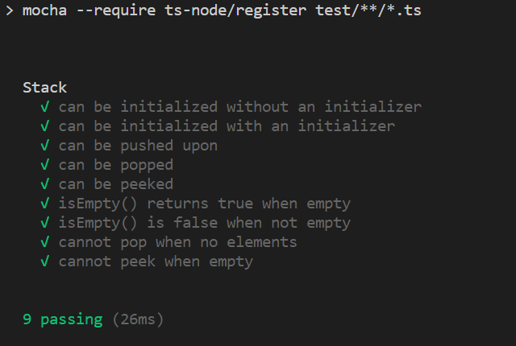
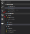
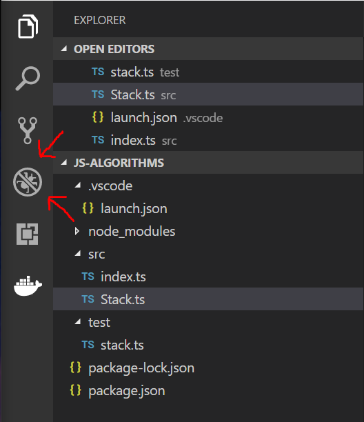
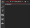
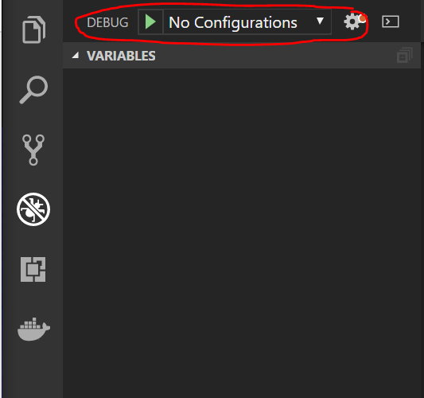
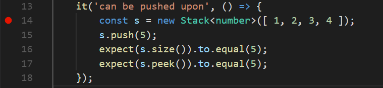
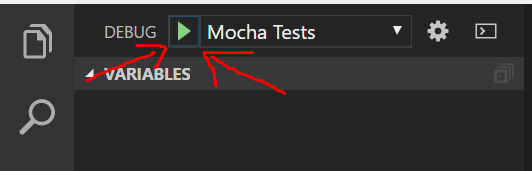
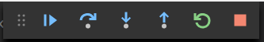
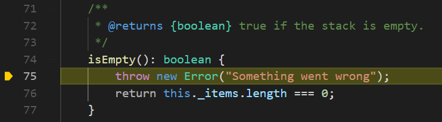

Run TypeScript Mocha Tests in Visual Studio Code – Adrian Hall – Medium

[Homepage](https://medium.com/)

[Homepage](https://medium.com/)

[Upgrade](https://medium.com/membership?source=upgrade_membership---nav_full)

* * *

# Run TypeScript Mocha Tests in Visual Studio Code

[Adrian Hall](https://medium.com/@FizzyInTheHall)BlockedUnblockFollowFollowing

Jul 5, 2018

I’m spending my July 4th getting back to basics and learning some data structures and algorithms. I’ve decided to do my stuff in [TypeScript](https://typescriptlang.org/) since it’s been a while since I’ve played with TypeScript and I wanted to see what has changed at the same time.

This is not a blog post about how to do data structures and algorithms in TypeScript, JavaScript or any other language. If you are studying for an interview or classes, there are plenty of places on the Internet you can go to do that. Personally, I like [hackerrank.com](https://www.hackerrank.com/dashboard).

Rather, this is a blog post to help you practice. It answers two questions:

1.  If I write my code in TypeScript, how can I write and run tests in TypeScript as well?
2.  If there is a problem in my code, how can I use the debugger within [Visual Studio Code](https://visualstudio.com/code) to debug my code?

#### Writing tests in TypeScript

I’ve created a directory on my computer called `ts-algorithms`. In a terminal window:

$ mkdir ts-algorithms  
$ cd ts-algorithms  
$ npm init -y

This gives me a basic structure. Feel free to edit and save the `package.json` file according to your wishes at this point. I generally change the license, then add author, description and keywords to mine.

Next, write some code. I place my code in the `src` directory and the tests in the `test` directory, so create those directories. I write my source files in TypeScript as a module. For instance, here is my `Stack.ts` file:

I’ve also got an `src/index.ts` that combines all my modules. It’s got a single line right now:

export { Stack } from './Stack';

Of course, I have some tests to go along with it. For unit testing, I use a combination of [mocha](https://mochajs.org/) and [chai](http://www.chaijs.com/). Let’s start by installing these in the project:

$ npm install --save-dev mocha chai

However, mocha does not run TypeScript tests all by itself. It needs help:

$ npm install --save-dev ts-node typescript

In addition, I am using Visual Studio Code and it will be really good if the editor understood the typings so that I can get Intellisense when writing tests:

$ npm install --save-dev @types/chai @types/mocha

Now, let’s add a script entry into our `package.json` file so that we can run the tests:

"scripts": {  
    "test": "mocha --require ts-node/register test/**/*.ts"  
},

The `--require ts-node/register` is the important bit here. It registers TypeScript as an interpreter so we can write the tests in TypeScript.

Let’s write some tests in `test/stack.ts`:

Finally, let’s run some tests:

$ npm run test

You can run this in the integrated terminal window of Visual Studio Code (just use **View** \> **Integrated Terminal** to bring it up). You should be rewarded with nine successful tests:

Yay! All my tests pass!

Note that all the code, including the tests, is written in TypeScript. You get compile time type checking, generics, and a whole host of other enhancements to JavaScript.

#### Debugging tests in the Visual Studio Code debugger

Running tests is good, but we can actually do better. What happens when one of the tests goes wrong? For example, let’s add a single line to our `src/Stack.ts` to make the `isEmpty()` method always fail:

isEmpty(): boolean {  
    throw new Error("Something went wrong");  
    return this._items.length === 0;  
}

Re-run the tests and the first test that fails is the third one — “can be pushed upon”. I’d really like to find out what is happening now! Enter the Visual Studio Code debugger:

The debugger icon in Visual Studio Code

The debugger window changes the left hand area:

We can’t debug anything yet

Before I can debug, I need to tell Visual Studio Code how to run my tests within the debugger. To do this, I add a configuration. Click the drop-down next to No Configurations and select **Add Configuration…**, then select the **Node.js** environment. This will add a further drop-down for selecting a configuration. Select the **{} Node.js: Mocha Tests** configuration. This gets a basic pattern for running mocha tests. However, just as we had to add arguments to the mocha command in the `package.json` file, we need to do so in the configuration. Here is my configuration file:

Note the `args` field here. It contains some “extra” stuff, but the important piece — the registration of `ts-node` to ensure TypeScript is used — is right at the beginning. This is stored in `.vscode/launch.json` so you can check this into your source code control for future runs.

On to debugging. I can set a breakpoint in the `test/stack.ts` file right on the `it()` call for the failing test by clicking in the left margin next to it. A little red ball will appear:

A breakpoint is set

Note that I set the breakpoint on the first line of the test, not the `it()` call. Now, go into the debugger screen and click the run button:

Click this button to start the debugger

Once the breakpoint is hit, execution is paused and you can step through the code:

Stepping Controls

This set of controls appears at the top. From left to right, they are:

*   Continue until the next breakpoint.
*   Step over the next statement.
*   Step into the next statement.
*   Step out of the next statement.
*   Restart the process.
*   Stop the process.

There are also a few windows on the left hand side with information about the variables (probably the most useful), watched variables, call stack, and where the breakpoints are.

So, let’s debug this. We’ve already had two successful tests that create a stack and that show the size. Since I’ve already tested those, I don’t need to step into those. In this test, there are two new methods that have yet to be tested — the `push()` and `peek()` calls. I’m going to do the following:

*   Step over the stack creation.
*   Step into the `push()` call.
*   Step over `push()` call on the stack array (in `src/Stack.js`).

The cursor is now at the end of the `push()` method. I can take a look at the variables — in particular `this._items`, which holds the stack items. Everything seems to be in order. Let’s continue:

*   Step over the return from the `push()` call.
*   Based on prior information, step over the `size()` test.
*   Step into the `peek()` test.
*   Step into the `this.isEmpty()` call (in `src/Stack.js` now).
*   We are throwing an error.

We’ve found the problem!

I could also have found this by checking the box next to **All Exceptions** in the breakpoints window, but it would not have given me the flow through the code, so I would have been left without the context of why this method was called in the first place (although the call stack window gives me some of the context).

Other debugging exercises are returning the wrong value. In that case, you would operate using the step-into/step-over mechanism, but analyze the variables at each step of the code. Are they what you expect them to be? You know your algorithm. Walk through it on paper before implementing. At what point does it diverge from your understanding?

Note that when we were debugging, we were seeing the TypeScript code — not the transpiled JavaScript code.

Now I can get on with some more coding examples.

*   [JavaScript](https://medium.com/tag/javascript?source=post)
*   [Typescript](https://medium.com/tag/typescript?source=post)
*   [Visual Studio Code](https://medium.com/tag/visual-studio-code?source=post)
*   [Unit Testing](https://medium.com/tag/unit-testing?source=post)

181 claps

4

*   BlockedUnblockFollowFollowing
    
    
    
    ### [Adrian Hall](https://medium.com/@FizzyInTheHall "Go to the profile of Adrian Hall")
    
    Web, Mobile and Cloud. I work for AWS Mobile. Check out [@AWSforMobile](http://twitter.com/AWSforMobile "Twitter profile for @AWSforMobile")
    

[More from Adrian Hall Converting types with Room and Kotlin](https://medium.com/@FizzyInTheHall/converting-types-with-room-and-kotlin-9ee45da5e3ac?source=placement_card_footer_grid---------0-44)

[Adrian Hall](https://medium.com/@FizzyInTheHall?source=placement_card_footer_grid---------0-44)

235

[More from Adrian Hall How to deploy a GraphQL API on AWS using the Serverless Framework](https://read.acloud.guru/deploy-a-graphql-service-on-aws-with-the-serverless-framework-7af8fc22a01d?source=placement_card_footer_grid---------1-44)

[Adrian Hall](https://read.acloud.guru/@FizzyInTheHall?source=placement_card_footer_grid---------1-44)

745

[Also tagged JavaScript Architecting your React application.](https://blog.usejournal.com/architecting-your-react-application-5af9cd65a891?source=placement_card_footer_grid---------2-43)

[Roman Nguyen](https://blog.usejournal.com/@march08?source=placement_card_footer_grid---------2-43)

641

Responses

Write a response…

Pavel Nasovich

Show all responses

*   181