Wireshark — приручение акулы

Wireshark — это достаточно известный инструмент для захвата и анализа сетевого трафика, фактически стандарт как для образования, так и для траблшутинга.  
Wireshark работает с подавляющим большинством известных протоколов, имеет понятный и логичный графический интерфейс на основе GTK+ и мощнейшую систему фильтров.  
Кроссплатформенный, работает в таких ОС как Linux, Solaris, FreeBSD, NetBSD, OpenBSD, Mac OS X, и, естественно, Windows. Распространяется под лицензией GNU GPL v2. Доступен бесплатно на сайте [wireshark.org](http://www.wireshark.org/).  
Установка в системе Windows тривиальна — next, next, next.  
Самая свежая на момент написания статьи версия – 1.10.3, она и будет участвовать в обзоре.

Зачем вообще нужны анализаторы пакетов?  
Для того чтобы проводить исследования сетевых приложений и протоколов, а также, чтобы находить проблемы в работе сети, и, что важно, выяснять причины этих проблем.  
Вполне очевидно, что для того чтобы максимально эффективно использовать снифферы или анализаторы трафика, необходимы хотя бы общие знания и понимания работы сетей и сетевых протоколов.  
Так же напомню, что во многих странах использование сниффера без явного на то разрешения приравнивается к преступлению.

Для начала захвата достаточно выбрать свой сетевой интерфейс и нажать Start.  
  
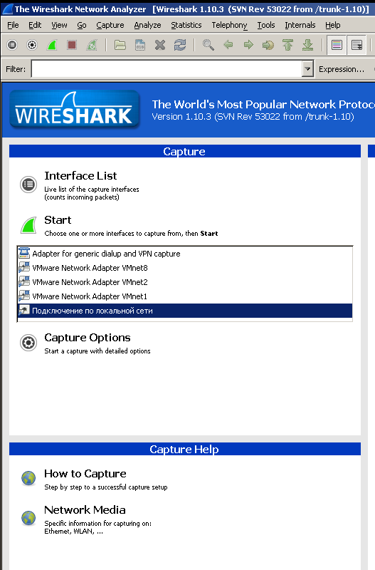

После чего и начнется процесс захвата, причем прилетевшие пакеты будут появляться в реальном времени.  
В процессе рассмотрения и изучения пакетов бывают ситуации, когда нужно вернуться предыдущему пакету. Для этого есть две кнопки (см скриншот).

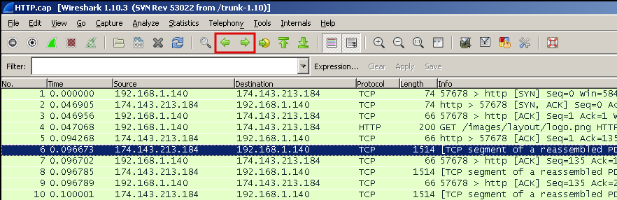

А следующая за ними кнопка позволяет сделать быстрый переход к пакету, указав его номер.  
В случае если колонки перекрываются и наползают друг на друга, можно кликнуть по такой колонке правой кнопкой мыши и выбрать _“Resize Column”_.  
Произойдет автоматическая подгонка размеров под текущую ситуацию.  
И кроме того, есть кнопка _“Resize all Columns”_, которая приведет в порядок все колонки.  
Используя меню _View – Time Display Format_, можно, например, настроить, чтобы отсчет времени шел не с начала захвата, а с момента получения предыдущего пакета (_Since Previous Captured Packet_).  
Самое важное в каждой программе (_Help – About Wireshark_) покажет не только версию и список авторов, но и содержит закладку _Folders_, которая покажет пути размещения каталогов с конфигурациями.  
Изучая интерфейс, можно выбрать, например, пакет http, и увидеть, что HTTP инкапсулируется в TCP (транспортный уровень), TCP инкапсулируется в IP (сетевой уровень), а IP в свою очередь инкапсулируется в Ethernet (перед этим даже мелькает 802.1Q).

И на самом верху идет нечто вроде небольшого обзора собранной информации о кадре.

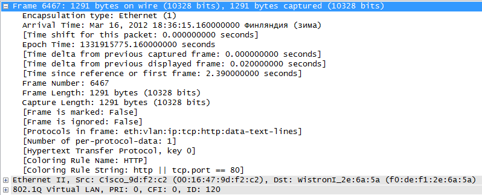

Про фильтры мы поговорим дальше, а на данном этапе, если нужно быстро отфильтровать лишние пакеты, достаточно сделать правый клик на пакете, выбрать меню _Apply as Filter – Not selected_ и изменения сразу же вступят в силу.  
Если нужно еще что-то убрать, то в следующий раз выбирать _“and not Selected”_, и новое правило просто добавится к фильтру.

Довольно часто при работе с Wireshark возникает ошибка **IP checksum offload** – ошибка контрольной суммы заголовка IP пакета.

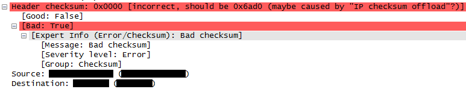

Современные сетевые карты насколько умные, что сами считают контрольную сумму, зачем это делать на уровне стека TCP/IP программно, если можно делать хардварно.  
А Wireshark натурально перехватывает пакеты, до того как они попадают в сеть.  
И до того как эта сумма была просчитана и была добавлена в заголовок пакета.  
Соответственно есть два пути решения этой проблемы — выключать функцию offload в настройках сетевой карты или в настройках сниффера указать, чтобы он не обращал внимание на это значение.  
Хардваные функции зачастую лучше софтварных, в основном из-за скорости обработки (в железе обычно выше) поэтому лучше изменить настройки самого сниффера.  
Для этого нужно зайти в настройки (_Edit — Preferences_), затем Protocols – IPv4 – и снять флаг с _“Validate IPv4 checksum if possible”_.

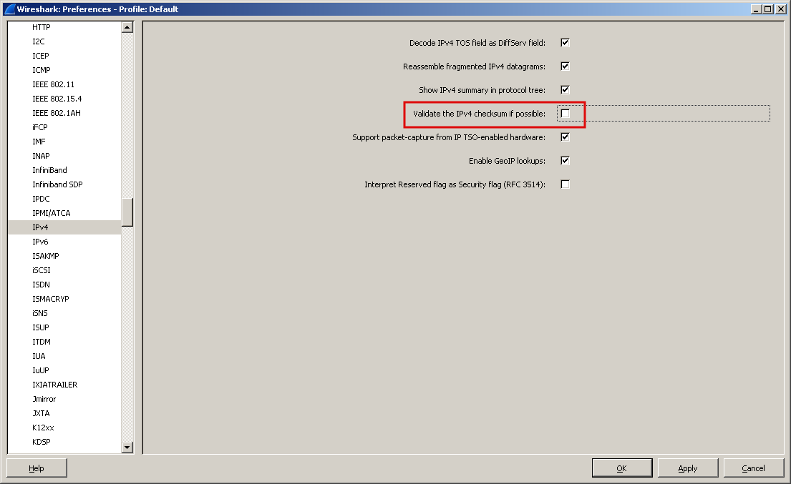

Перед тем как захватывать трафик нужно определиться с тем, что, собственно, нужно захватывать.  
Разместить анализатор трафика можно в нескольких местах:

*   Локально на своем хосте;
*   Организовать зеркалирование трафика на коммутаторе;
*   Подключаться непосредственно в интересующие места;
*   или же отравление протокола ARP (еще более незаконно, чем пассивное прослушивание трафика)

Wireshark содержит два вида фильтров – захвата (_Capture Filters_) и отображения (_Display Filters_).  
Вначале рассмотрим **Capture Filters**.  
Как можно догадаться по названию, они служат для фильтрации еще на этапе захвата трафика.  
Но в таком случае, безусловно, можно безвозвратно потерять часть нужного трафика.  
Фильтр представляет собой выражение, состоящее из встроенных значений, которые при необходимости могут объединяться логическими функциями (and, or, not).  
Для того, чтобы его задействовать, нужно зайти в меню _Сapture_, затем _Options_, и в поле _Capture Filter_ набрать, например, _host 8.8.8.8_ (или, например, _net 192.168.0.0./24_)

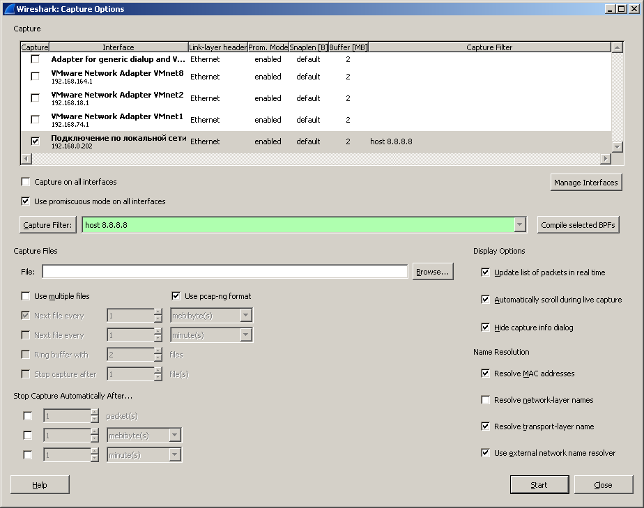

Так же, конечно, можно выбрать и заранее созданный фильтр (за это отвечает кнопка Capture Filter).  
В любом из вариантов фильтр появится возле интерфейса, можно жать Start.

Теперь перейдем к **Display Filters**.  
Они фильтруют исключительно уже захваченный трафик.  
Что можно фильтровать?  
— Практически все — протоколы, адреса, специфические поля в протоколах.  
Операции, которые можно использовать при построении фильтров:

| Команда | Значение | Пример использования |
| --- | --- | --- |
| ==  | равенство | ip.dst == 193.168.3.10 |
| !=  | Не равно | udp.dst != 53 |
| <   | меньше чем | ip.ttl < 24 |
| >   | больше чем | frame.len > 10 |
| <=  | меньше или равно | frame.len <= 0x20 |
| >=  | больше или равно | tcp.analysis.bytes\_in\_flight >= 1000 |
| matches | регулярные выражения | frame matches "\[Pp\]\[Aa\]\[Ss\]\[Ss\]" |
| contains | содержит | dns.resp.name contains google |

Как вы, наверное, заметили, в таблице в качестве примеров были разнообразные выражения, достаточно понятные и зачастую говорящие сами за себя.  
Например, ip.dst – это поле протокола IP.  
Чтобы увидеть это поле, можно просто посмотреть на пакет, и в нижней части окна можно увидеть его значение, которое потом можно применять в любом фильтре.  
Например, нас интересует, как создать фильтр, где будет проверяться значение TTL.  
Для этого раскрываем L3 часть и становимся на соответствующее поле:

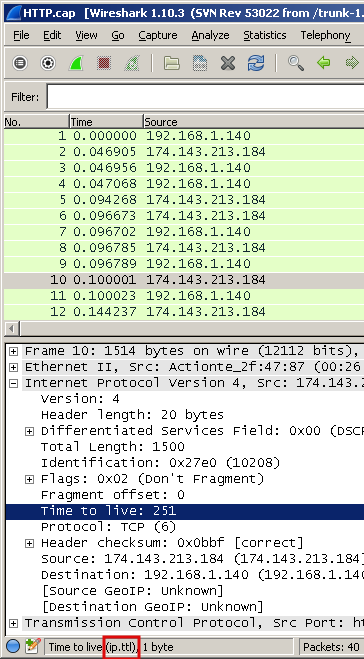

И видим, что для построения фильтра, нужно использовать выражение ip.ttl.  
Если начать набирать фильтр, то после точки автоматически появится список возможных значений:

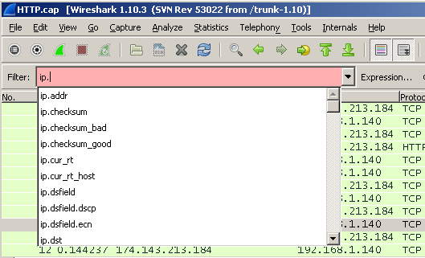

Чтобы применить фильтр, достаточно нажать enter или кнопку Apply.  
Само поле для ввода фильтра может менять цвет в зависимости от того, что было набрано.  
Зеленый цвет означает, что все в порядке. Красный — допущена ошибка, желтый — получен неожиданный результат, потому что существуют другие варианты написания фильтра (например можно написать _ip.dst != 8.8.8.8_ или же _!ip.dst == 8.8.8.8_, именно второй вариант более предпочтительный).  
Фильтры можно сохранять для дальнейшего использования, нажав кнопку Save, затем ввести произвольное название

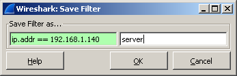

и после нажатия на кнопку ОК фильтр появится как кнопка на панели.

А если кликнуть на расположенную неподалеку кнопку «Expression…», то откроется достаточно мощный конструктор выражений, по которому можно чуть ли не изучать сетевые протоколы. Количество поддерживаемых протоколов постоянно увеличивается.

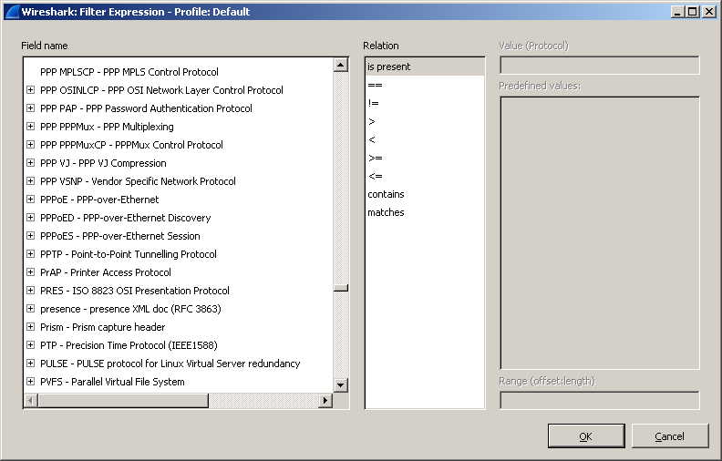

Как уже упоминалось ранее, можно выделить любой пакет и в контекстном меню выбрать _Apply as Filter_ и в подменю выбрать режим — _selected_ или _not selected_ и соответственно сразу же появится фильтр, который будет показывать только выбранное или наоборот уберет выбранное с экрана.  
Таким образом можно гибко выбирать, что видеть на экране, а что — нет.  
Это может быть определенный ip-адрес, ttl, порт, dns ответ и многое другое.  
Кроме того, есть два варианта для таких быстрых фильтров — Prepare as Filter и Apply as Filter.  
Как можно догадаться по названию — разница заключается в том, что в первом случае только появится в поле для ввода Display Filter, но не применится (удобно, если например, добавлять таким способом несколько фильтров, а затем сразу применить готовый результат), а во втором — сразу же и применится.

Фильтры можно объединять, используя знакомые по булевой алгебре логические операции:  
`(dns) && (http)` логическое и

`(dns) || (http)` это логическое или

Таким образом можно строить большие и сложные фильтры вроде:  
`(tcp.flags.syn==1) && (ip.src == 172.16.10.2) && (ip.dst == 172.16.10.1)`  
Здесь видим, что выбираются только TCP SYN сегменты, только с определенным адресом отправителя и получателя. При составлении больших фильтров нужно помнить, что фильтр по сути — логическое выражение, и если оно истинно, то пакет отобразится на экране, если ложно — нет.

Достаточно частая ситуация, когда возникают жалобы на медленную работу сети, причин этого может быть множество.  
Попробуем разобраться, в чем может быть причина, и рассмотрим два способа.  
Первый состоит в добавлении колонки _TCP delta_.  
Открываем пакет, находим поле _Time since previous frame in this TCP frame_, правый клик и выбираем _Apply as Column_. Появится новая колонка.  
На ней можно кликнуть правой кнопкой мыши и выбрать режим сортировки, например, _Sort Descending_.

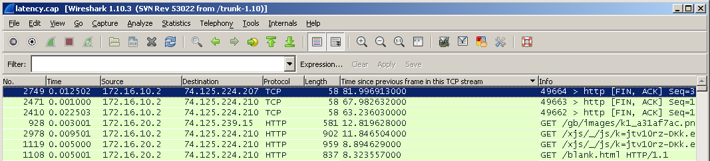

И сразу же рассмотрим второй способ.  
Относительно недавно (в версии 1.10.0) появился фильтр tcp.time_delta, который, собственно, учитывает время с момента последнего запроса.

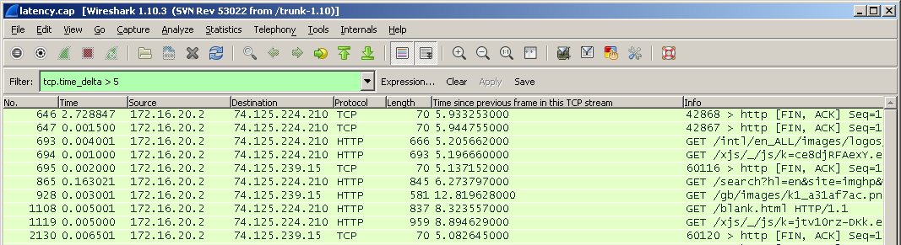

Если клиент делает запрос и получает ответ через 10 миллисекунд, и клиент говорит, что у него все медленно работает, то, возможно, проблема у самого клиента.  
Если же клиент делает запрос и получает ответ через 2-3 секунды, тут уже, возможно, проблема кроется в сети.

Если посмотреть в TCP пакет (или сегмент если быть точным), то можно увидеть там _Stream index_, который начинается обычно с нуля.  
Само поле будет называться tcp.stream.

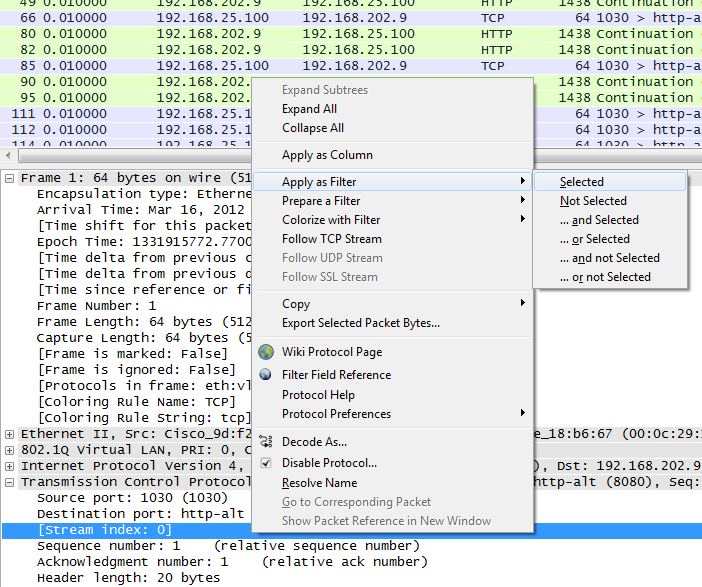

По нему можно сделать правый клик и создать фильтр.

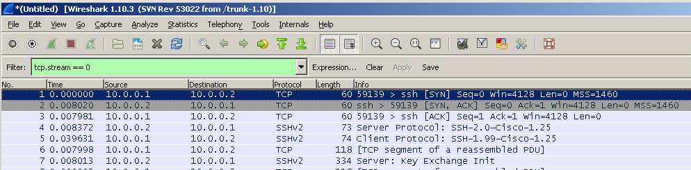

Таким образом можно фильтровать нужные соединения.

Еще один способ – сделать правый клик на самом пакете, выбрать _Conversation Filter_ и создать фильтр для l2 l3 l4 уровня соответственно.

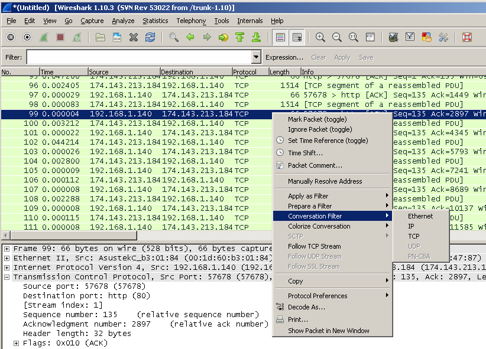

В итоге мы опять увидим взаимодействие двух хостов.

И третий вариант — это одна из самых интересных фич — **Follow TCP Stream**.  
Для того чтобы его задействовать, нужно опять таки кликнуть правой кнопкой мыши на пакете и выбрать _“Follow TCP Stream”_. Появится окно, где будет наглядно продемонстрирован весь обмен между двумя узлами.

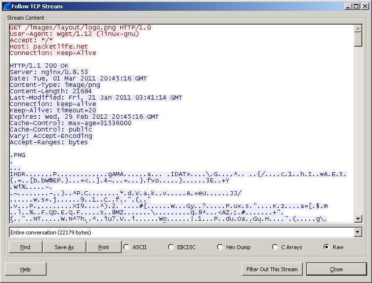

Если же зайти в меню _Statistics – Conversations_, то, выбирая закладки, можно увидеть статистику по таким “разговорам” и различные сессии, при этом можно отсортировать их по различным колонкам, например, по количеству переданных данных.

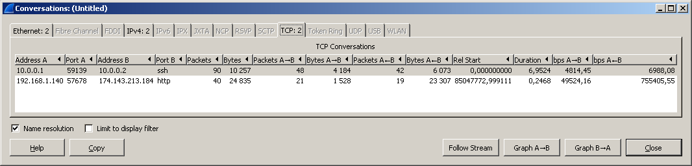

И прямо в этом окне можно правой кнопкой взывать контекстное меню и опять же применить как фильтр.

После некоторого времени, проведенного за захватом разнообразного трафика, можно заметить какую-то шарообразную кнопку в нижнем левом углу, которая еще иногда меняет цвет.

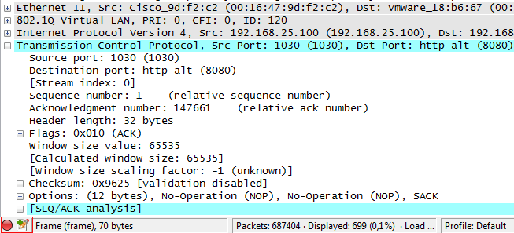

Нажатие на эту кнопку приведет к открытию окна _Expert Infos_.  
Того же результата можно добиться, пройдя в меню _Analyze – Expert Info_.

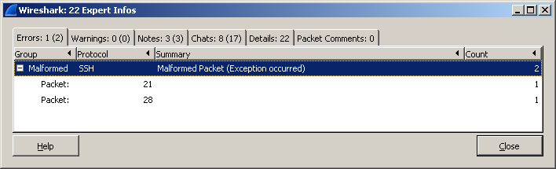

В этом окне будет содержаться информация по найденным пакетам, разбитая на группы Errors, Warnings, Notes и Chats.  
Цветовая раскраска для этих групп выглядит следующим образом:  
Ошибки — красный цвет  
Предупреждения — желтый  
Примечания — сине-зелёный (cyan)  
Чат — серый

Wireshark содержит в себе мощный анализатор и умеет автоматически обнаруживать большое количество проблем, возникающих в сети.  
Как вы уже могли заметить, буквально везде можно использовать фильтры и Expert Info не является исключением.  
Для того чтобы создать такой фильтр, нужно использовать конструкцию _expert.severity_.  
Например, _expert.severity==error_.

Можно ли с помощью Wireshark узнать, что было скачано?  
Да, можно. И сейчас это увидим.  
Вначале возьмем HTTP трафик.  
Сделаем правый клик по HTTP пакету — _Protocol Preferences_ – и видим тут массу опций, которые непосредственно влияют на извлечение файлов из веб трафика.  
Для того чтобы увидеть, что можно извлечь из текущего дампа нужно перейти в меню _File – Export Objects – HTTP_.  
Появится окно, которое покажет все захваченные http объекты — текстовые файлы, картинки и т.д. Для того чтобы вытащить любой файл из этого списка, достаточно просто выделить его и нажать Save As.

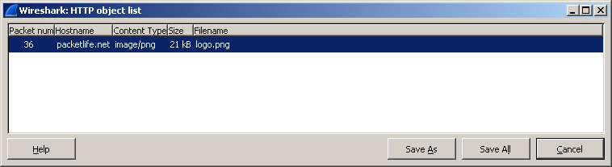

Как можно заметить, рисунок был извлечен без каких-либо проблем.

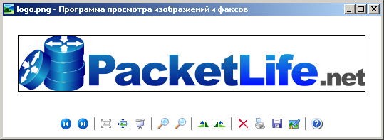

Таким же способом, можно извлекать и потоковое видео/аудио.

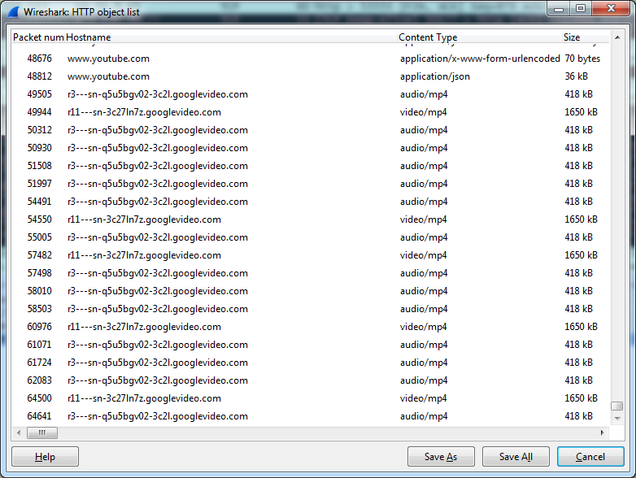

Но на этом возможности Wireshark не заканчиваются!  
Он умеет вытаскивать файлы и с протокола FTP.  
Для этого можно использовать знакомый уже Follow TCP Stream.  
В итоге отобразится только обмен по протоколу FTP, в котором нужно будет найти строку RETR, что собственно и будет означать передачу файла.

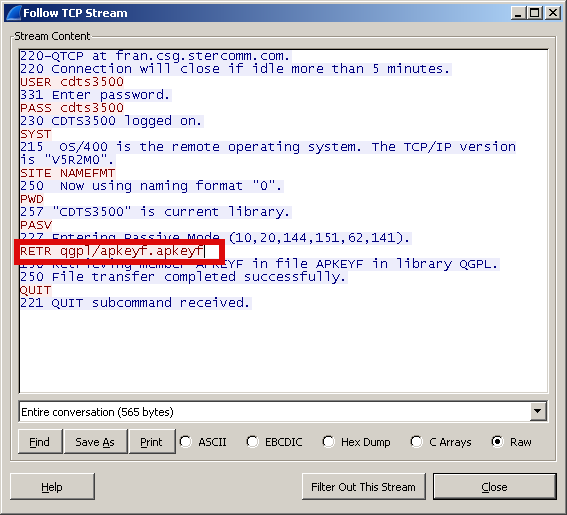

Затем опускаемся дальше, находим пакеты уже непосредственно с файлом (FTP-DATA) и опять выбираем Follow TCP Stream, видим содержимое файла, жмем Save As и сохраняем.

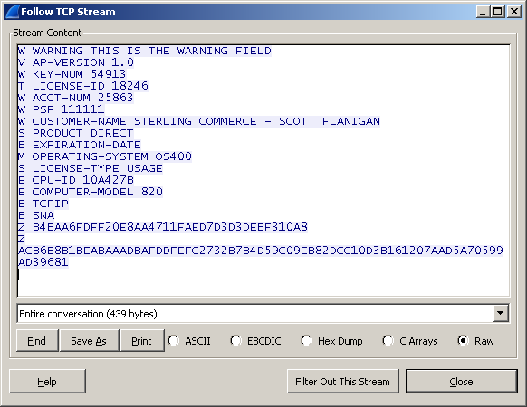

Wireshark имеет несколько встроенных функций для работы с этой технологией.  
Он поддерживает массу голосовых протоколов — SIP, SDP, RTSP, H.323, RTCP, SRTP и другие.  
И, конечно же, умеет перехватывать и сохранять голосовой трафик для дальнейшего прослушивания.  
Этот функционал как нельзя лучше подойдет для траблшутинга в сетях Voice over IP.  
Меню _Statistics — Flow Graph_ покажет наглядную картину, как происходил весь обмен пакетами.

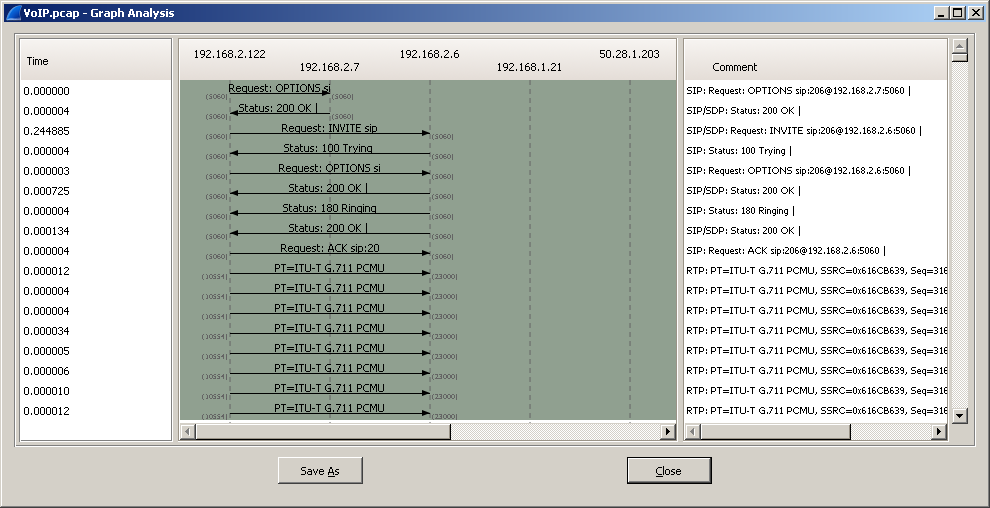

А вообще целое меню _Telephony_ отведено для работы с голосовым трафиком.  
Например, _Telephony – RTP – Show All Streams_ покажет подробно, что происходило с RTP, в частности jitter (параметр, который, вероятно, самый важный в голосе), что иногда сразу скажет о наличии проблем.

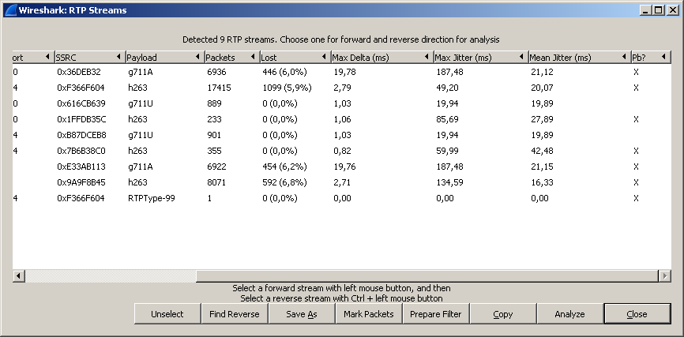

Нажав на кнопку “Analyze”, можно открыть окно _RTP stream Analysis_ – и, выбрав там поток, можно его даже проиграть, используя кнопку player.  
Сначала отроется окно проигрывателя, в котором вначале нужно установить подходящее значение jitter и использовать кнопку decode.

Появится нечто похожее на анализатор спектра, в котором можно отметить требуемый разговор, и после этого кнопка Play станет активной.

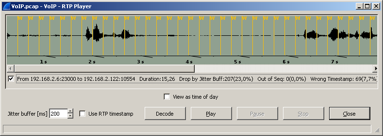

Так же существует еще один способ прослушивания голосовых звонков — можно зайти в меню _Telephony – VoIP Calls_.

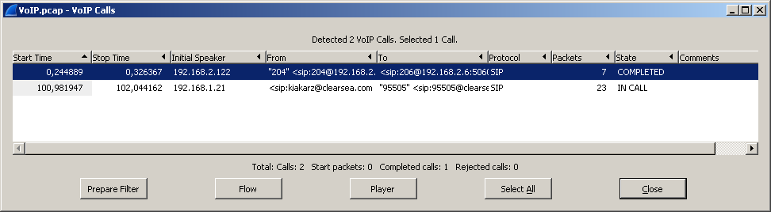

Откроется окно со списком совершенных звонков, где опять же можно нажать кнопку player, отменить нужные разговоры флажками и нажать play.  
Для того чтобы добиться приемлемого качества звучания, потребуется проиграться со значением поля jitter buffer, меняя его значение.

Некоторое время назад появился сайт [CloudShark.org](http://cloudshark.org/).

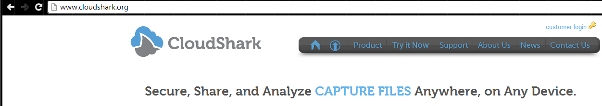

Это тот самый сниффер Wireshark, но реализованный в виде онлайн-сервиса. Очевидно, что с его помощью не удастся захватывать сетевой трафик, но выполнять анализ дампа трафика – вполне. Загрузив туда через форму PCAP-файл на анализ, можно будет получить четкую последовательность пакетов, в которой всё данные будут разбиты на понятные поля в зависимости от протокола. В общем, тот же Wireshark, но немного облегченный и доступный из любого браузера.

Напоследок рассмотрим как выглядит сканирование портов.  
Смотрим на дамп и видим, что вначале происходит ARP запрос и затем непосредственно начинается сканирование. Адрес нашего маршрутизатора 192.168.10.11, сканирование идет с адреса 192.168.10.101

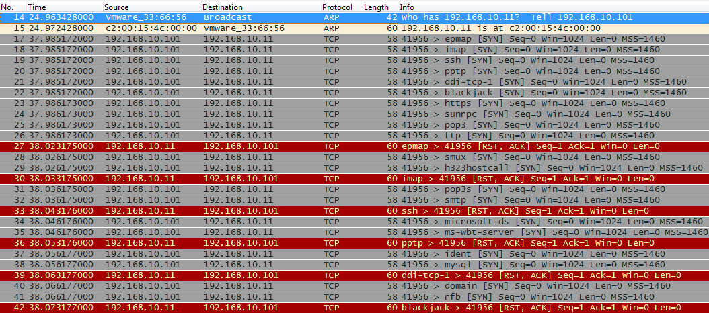

Это, так называемое, SYN сканирование, когда идут SYN-пакеты на указанный диапазон портов. Так как большинство портов закрыто, маршрутизатор отвечает пакетами RST, ACK.  
Пролистав чуть ниже видим, что открыт telnet (tcp 23).

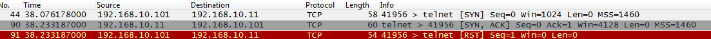

На это указывает то, что маршрутизатор ответил пакетом SYN, ACK.  
К слову, для фильтрации портов в сниффере можно использовать конструкции вида: tcp.srcport, tcp.dstport и tcp.port. Для протокола UDP всё аналогично — udp.srcport, udp.dstport, udp.port.

Мы пробежались по самым основным частям функционала лучшего анализатора пакетов.  
Получилось несколько сумбурно, вероятно, потому что хотелось затронуть как можно больше его возможностей и не упустить ничего важного.  
Оказалось, что анализатор пакетов, как отладчик и дизассемблер, демонстрирует мельчайшие подробности работы сети и сетевых протоколов.  
Используя Wireshark и обладая необходимыми знаниями (которые можно почерпнуть изучив серию Сетей для Самых Маленьких на сайте linkmeup.ru) можно достаточно эффективно находить и диагностировать разнообразные проблемы, возникающие в сети.

В процессе написания использовались материалы сайта [wiki.wireshark.org](http://wiki.wireshark.org/)  
Дампы с трафиком брались из разных источников, больше всего с сайта [packetlife.net](http://packetlife.net/)