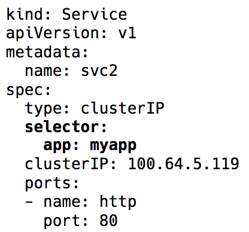

[Иллюстрированное] Руководство по устройству сети в Kubernetes. Часть 3 / Блог компании Флант

_**Прим. перев.**: Эта статья продолжает цикл материалов о базовом устройстве сетей в Kubernetes, что описывается в доступной форме и с наглядными иллюстрациями (впрочем, конкретно в этой части иллюстраций уже практически не оказалось). Переводя две предшествующие части этого цикла, мы объединили их в [одну публикацию](https://habr.com/company/flant/blog/346304/), в которой рассказывалось о сетевой модели K8s (взаимодействие внутри узлов и между узлами) и оверлейных сетях. Её предварительное чтение желательно (рекомендуется самим автором). Продолжение же посвящено сервисам Kubernetes и обработке исходящего и входящего трафика.  
**NB**: Текст автора для удобства дополнен ссылками (преимущественно — на официальную документацию K8s)._

## Динамика кластера

Из-за постоянно изменяющейся, динамичной, природы Kubernetes и распределённых систем в целом pod'ы (и, как следствие, их IP-адреса) тоже постоянно меняются. Причины тому разнятся от приходящих обновлений для достижения нужного состояния и событий, приводящих к масштабированию, до непредвиденных падений pod'а или узла. Поэтому IP-адреса pod'а не могут напрямую использоваться для взаимодействия.

В дело вступает [сервис (Service)](https://kubernetes.io/docs/concepts/services-networking/service/) в Kubernetes — виртуальный IP с группой IP-адресов pod'а, используемых в качестве конечных точек (endpoints) и идентифицируемых через селекторы лейблов ([label selectors](https://kubernetes.io/docs/concepts/overview/working-with-objects/labels/#label-selectors)). Такой сервис работает как виртуальный балансировщик нагрузки, IP-адрес которого остаётся постоянным, а в то же самое время IP-адреса представленного им pod'а могут постоянно меняться.

  
_Label selector в объекте Service в Kubernetes_

За всей реализацией этого виртуального IP стоят правила iptables (у последних версий Kubernetes также [появилась возможность](https://habr.com/company/flant/blog/415349/) использования IPVS, но это тема для отдельного разговора), которые управляются компонентом Kubernetes под названием [kube-proxy](https://kubernetes.io/docs/reference/command-line-tools-reference/kube-proxy/). Однако такое его название в сегодняшних реалиях вводит в заблуждение. Kube-proxy действительно использовался в качестве прокси во времена до релиза Kubernetes v1.0, но это приводило к большому потреблению ресурсов и тормозам из-за постоянных операций копирования между пространством ядра и user space. Теперь же это всего лишь контроллер — как и многие другие контроллеры в Kubernetes. Он следит за сервером API на предмет изменений в endpoints и обновляет правила iptables соответствующим образом.

Согласно этим правилам iptables, если пакет предназначен IP-адресу сервиса, для него делается DNAT (Destination Network Address Translation): это означает, что его IP-адрес изменится с IP сервиса на один из endpoints, т.е. один из IP-адресов pod'а, который случайным образом выбирается iptables. Таким образом достигается гарантия, что нагрузка равномерно распределена между pod'ами.

  
_DNAT в iptables_

В случае такого DNAT'а необходимая информация хранится в [conntrack](http://people.netfilter.org/pablo/docs/login.pdf) — таблице учёта подключений в Linux (она хранит пятипарные трансляции, сделанные iptables: `protocol`, `srcIP`, `srcPort`, `dstIP`, `dstPort`). Всё устроено таким образом, что при возвращении ответа может произойти обратная DNAT'у операция (un-DNAT), т.е. замена IP источника c Pod IP на Service IP. Благодаря этому клиенту совершенно не нужно знать, как «за кулисами» происходит работа с пакетами.

  
_Пятипарные (5-tuple) записи в таблице conntrack_

Итак, используя сервисы Kubernetes, мы можем работать с одними и теми же портами без каких-либо конфликтов (потому что возможно переназначение портов на endpoints). Благодаря этому обнаружение сервисов делается очень просто. Достаточно лишь воспользоваться внутренним DNS и за-hard-code-ить хосты сервисов. Можно даже воспользоваться предварительно настроенными в Kubernetes переменными с хостом и портом сервиса.

**Подсказка**: Выбрав второй путь, вы сохраните множество ненужных вызовов DNS!

## Исходящий трафик

Описанные выше сервисы Kubernetes работают в пределах кластера. На практике же приложениям обычно нужен доступ к каким-то внешним API/сайтам.

В общем случае у узлов могут быть и частные, и публичные IP-адреса. Для доступа к интернету предусмотрено подобие NAT'а один-к-одному для этих частных и публичных IP-адресов — в особенности это касается облачных окружений.

Для нормального взаимодействия из узла с внешним IP-адресом IP источника меняется с частного IP узла на публичный IP для исходящих пакетов, а для входящих пакетов — в обратную сторону. Однако в тех случаях, когда подключение к внешнему IP инициировано pod'ом, IP-адресом источника является Pod IP, о котором не знает механизм NAT'а облачного провайдера. Поэтому он попросту отбросит пакеты с IP-адресами источника, которые отличаются от IP-адресов узла.

И тут, как вы догадались, iptables понадобится нам ещё больше! На этот раз правила, которые тоже добавляются kube-proxy, выполняют SNAT (Source Network Address Translation), он же [IP MASQUERADE](https://www.tldp.org/HOWTO/text/IP-Masquerade-HOWTO) (маскарадинг). Ядру говорят вместо IP-адреса источника использовать IP интерфейса, с которого приходит пакет. В conntrack тоже появляется запись для дальнейшего выполнения обратной операции (un-SNAT) над ответом.

## Входящий трафик

До сих пор всё было хорошо. Pod'ы могут общаться между собой и с интернетом. Однако нам всё ещё не хватает главного — обслуживания пользовательского трафика. В настоящий момент есть два пути реализации:

### 1\. NodePort/Cloud Load Balancer (уровень L4 :  IP и порт)

Установка [`NodePort`](https://kubernetes.io/docs/concepts/services-networking/service/#nodeport) в качестве типа сервиса назначит сервису `NodePort` в диапазоне 30000—33000. Этот `nodePort` открыт на каждом узле даже в тех случаях, когда ни один pod на узле не запущен. Входящий трафик на этом `NodePort` направляется одному из pod'ов (который может даже оказаться и на другом узле!), опять же с помощью iptables.

Тип сервиса [`LoadBalancer`](https://kubernetes.io/docs/concepts/services-networking/service/#loadbalancer) в облачных окружениях создаёт перед всеми узлами облачный балансировщик нагрузки (например, ELB), работающий далее с тем же `NodePort`.

### 2\. Ingress (уровень L7 :  HTTP/TCP)

Сопоставление HTTP-хостов/путей с соответствующими бэкендами выполняют и многие другие реализации — например, nginx, traefik, HAProxy и т.п. С ними входной точкой для трафика снова становятся LoadBalancer и NodePort, однако есть здесь и преимущество, заключающееся в том, что нам достаточно одного Ingress'а для обслуживания входящего трафика всех сервисов вместо многочисленных NodePort/LoadBalancer'ов.

## Сетевые политики

[Сетевые политики](https://kubernetes.io/docs/concepts/services-networking/network-policies/) можно представить себе как списки управления доступом (security groups/ACL) для pod'ов. Правила [`NetworkPolicy`](https://kubernetes.io/docs/concepts/services-networking/network-policies/#the-networkpolicy-resource) позволяют разрешать/запрещать трафик между pod'ами. Их точная реализация зависит от сетевого уровня/CNI, но большая их часть попросту использует iptables.

## …

Вот и всё. В [предыдущих частях](https://habr.com/company/flant/blog/346304/) мы изучили основы сети в Kubernetes и как работают оверлеи. Теперь мы знаем, как абстракция Service помогает в динамичном кластере и делает обнаружение сервисов по-настоящему простым. Мы также рассмотрели, как проходит исходящий/входящий трафик и что сетевые политики могут быть полезными для обеспечения безопасности в кластере.

## P.S. от переводчика

Читайте также в нашем блоге:

*   «[Иллюстрированное руководство по устройству сети в Kubernetes. Части 1 и 2](https://habr.com/company/flant/blog/346304/)»;
*   «[За кулисами сети в Kubernetes](https://habr.com/company/flant/blog/420813/)»;
*   «[Эксперименты с kube-proxy и недоступностью узла в Kubernetes](https://habr.com/company/flant/blog/359120/)»;
*   «[Сравнение производительности сетевых решений для Kubernetes](https://habr.com/company/flant/blog/332432/)»;
*   «[Container Networking Interface (CNI) — сетевой интерфейс и стандарт для Linux-контейнеров](https://habr.com/company/flant/blog/329830/)»;
*   «[Conduit — легковесный service mesh для Kubernetes](https://habr.com/company/flant/blog/349496/)».