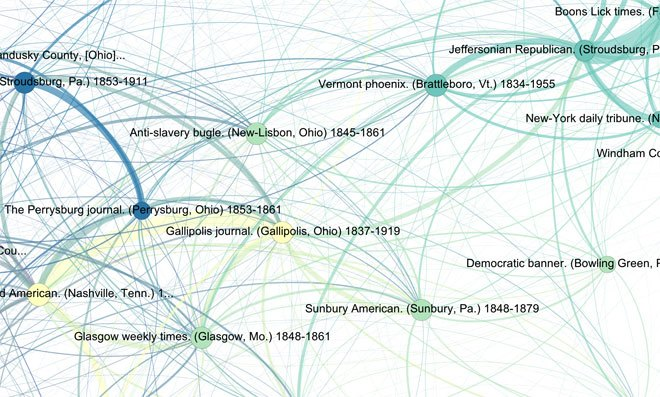
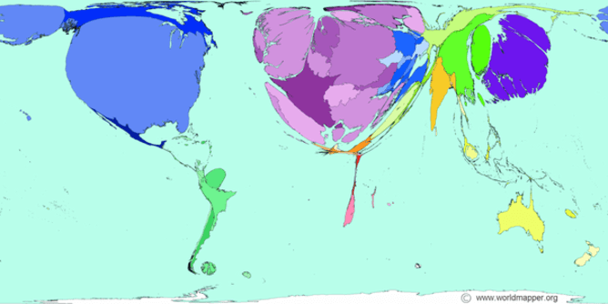
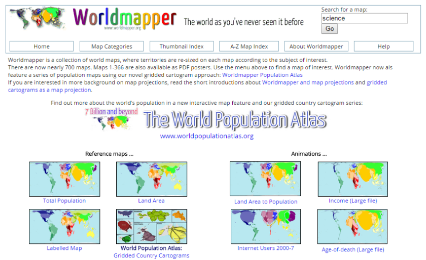
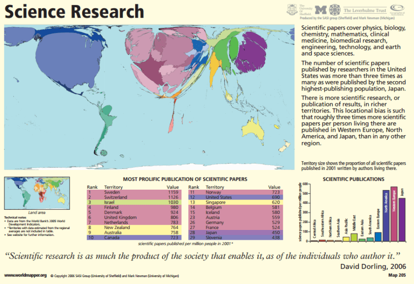
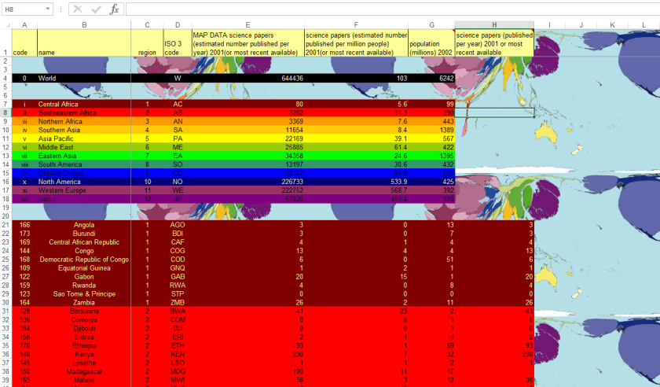
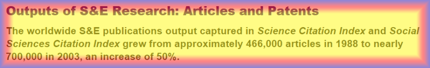

Down the Rabbit Hole – the scottbot irregular

**WHEREIN **I get angry at the internet and yell at it to get off my lawn.

You know what’s cool? Ryan Cordell and friends’ [Viral Texts project](http://viraltexts.org/). It tracks how 19th-century U.S. newspapers used to copy texts from each other, little snippets of news or information, and republish them in their own publications. A single snippet of text could wind its way all across the country, sometimes changing a bit like a game of telephone, rarely-if-ever naming the original author.

Which newspapers copied from one another, from the [Viral Texts project](http://viraltexts.org/).

Isn’t that a neat little slice of journalistic history? Different copyright laws, different technologies of text, different constraints of the medium, they all led to an interesting moment of textual virality in 19th-century America. If I weren’t a historian who knew better, I’d call it something like “quaint” or “charming”.

You know what _isn’t_ quaint or charming? Living in the so-called “[information age](https://en.wikipedia.org/wiki/Information_Age)“, where everything is [intertwingled](https://en.wikipedia.org/wiki/Intertwingularity), with hyperlinks and text costing pretty much zilch, and seeing _the same gorram practices_.

What proceeds is a rant. They say never to blog in anger. But seriously.

Tonight Alex Vespignani, notable network scientist, [tweeted](https://twitter.com/alexvespi/status/619985725661020160) a link to an interesting-sounding study about inequality in scientific publishing. In [Quartz](http://qz.com/)! I like Quartz, it’s where [Christopher Mims](https://twitter.com/mims) used to [post awesome science things](http://qz.com/author/cmimsqz/). Part of their mission statement reads:

> In all that we do at Quartz, we embrace openness: open source code, an open newsroom, and open access to the data behind our journalism.

Pretty cool, right?

Anyway, here’s the tweet:

It links to this article on a “[map of the world’s scientific research](http://qz.com/449405/this-map-of-the-worlds-scientific-research-is-disturbingly-unequal/)“. Because Vespignani tweeted it, I took it seriously (yes yes I know rt≠endorsement), and read the article. It describes a [cartogram](https://en.wikipedia.org/wiki/Cartogram) map of scientific research publications which shows how the U.S. and Western Europe (and a bit of China) dominates the research world, making the point that such a disparity is “disturbingly unequal”.

Map of scientific research, by how many published articles are produced in a country, pulled from qz.com

“What’s driving the inequality?” they ask. Money & tech play a big role. So does what counts as “high impact” in science. What’s worse, the journalist writes,

> In the worst cases, the global south simply provides novel empirical sites and local academics may not become equal partners in these projects about their own contexts.

The author points out an issue with the data: it only covers journals, not monographs, grey literature, edited volumes, etc. This often excludes the humanities and social sciences. The author also raises the issue of journal paywalls and how it decreases access to researchers in countries without large research budges. But we need to do better on “open dissemination”, the article claims.

Hey, that was a good read! I agree with everything the author said. What’s more, it speaks to my research, because I’ve done a fair deal of science mapping myself at the [Cyberinfrastructure for Network Science Center](http://cns.iu.edu/) under [Katy Börner](http://ella.slis.indiana.edu/~katy/). Great, I think, let’s take a look at the data they’re using, given Quartz’s mission statement about how they always use open data.

I want to see the data because I know a lot of scientific publication indexing sites do a poor job of indexing international publications, and I want to see how it accounts for that bias. I look at the bottom of the page.

Crap.

> This post originally appeared at [The Conversation](https://theconversation.com/its-time-to-redraw-the-worlds-very-unequal-knowledge-map-44206). Follow @US_conversation on Twitter. We welcome your comments at ideas@qz.com.

Alright, no biggie, time to look at the original article on [The Conversation](https://en.wikipedia.org/wiki/The_Conversation_(website)), a website whose slogan is “**Academic rigor, journalistic flair**“. Neat, academic rigor, I like the sound of that.

I scroll to the bottom, looking for the source.

> A longer version of this article [originally appeared](http://blogs.lse.ac.uk/impactofsocialsciences/2013/04/29/redrawing-the-map-from-access-to-participation/) on the London School of Economics’ Impact Blog.

Hey, the LSE Impact blog! They usually publish great stuff surrounding metrics and the like. Cool, I’ll click the link to read [the longer version](http://blogs.lse.ac.uk/impactofsocialsciences/2013/04/29/redrawing-the-map-from-access-to-participation/). The author writes something interesting right up front:

> What would it take to redraw the knowledge production map to realise a vision of a **more equitable and accurate world of knowledge**?

A more accurate world of knowledge? Was this map inaccurate in a way the earlier articles didn’t report? I read on.

Well, this version of the article goes on a little to say that people in the global south aren’t always publishing in “international” journals. That’s getting somewhere, maybe the map only shows “international journals”! (Though she never actually makes that claim). Interestingly, the author writes of literature in the global south:

> Even when published, **this kind of research is often not attributed to its actual authors**. It has the added problem of often being embargoed, with researchers even having to sign confidentiality agreements or “official secrets acts” when they are given grants. **This is especially bizarre in an era where the mantra of publically funded research being made available to the public has become increasingly accepted**.

Amen to that. Authorship information and openness all the way!

So who made this map?

Oh, the original article (though not the one in Quantz or The Conversation) has a link right up front to something called “[The World of Science](http://www.worldmapper.org/)“. The link doesn’t actually take you to the map pictured, it just takes you to a website called worldmapper that’s filled with maps, letting you fend for yourself. That’s okay, my google-fu is strong.

www.worldmapper.org

I type “science” in the search bar.

Found it! [Map #205](http://www.worldmapper.org/display.php?selected=205), created by no-author-name-listed. The caption reads:

> Territory size shows the proportion of all scientific papers published in 2001 written by authors living there.

Also, it only covers “physics, biology, chemistry, mathematics, clinical medicine, biomedical research, engineering, technology, and earth and space sciences.” I dunno about you, but I can name at least 2.3 other types of science, but that’s cool.

In tiny letters near the bottom of the page, there are a bunch of options, including the ability to see [the poster](http://www.worldmapper.org/posters/worldmapper_map205_ver5.pdf) or download the [data in Excel](http://www.worldmapper.org/data/withmap/205_worldmapper_data.xls).

Map of Science Poster from worldmapper.org

Ahhhhh I found the source! I mean, it took a while, but here it is. You apparently had to click “[Open PDF poster](http://www.worldmapper.org/posters/worldmapper_map205_ver5.pdf), designed for printing.” It takes you to a 2006 poster, which marks that it was made by the SASI Group from Sheffield and [Mark Newman](http://www-personal.umich.edu/~mejn/), famous and awesome complex systems scientist from Michigan. An all-around well-respected dude.

To recap, that’s a 7/11/2015 tweet, pointing to a 7/11/2015 article on Quartz, pointing to a 7/8/2015 article on The Conversation, pointing to a 4/29/2013 article on the LSE Impact Blog, pointing to a website made Thor-knows-when, pointing to a poster made in 2006 with data from 2001. **And only the poster cites the name of the creative team who originally made the map**. Blood and bloody ashes.

Please take a moment out of your valuable time to watch this video clip from the BBC’s television adaptation of Douglas Adam’s Hitchhiker’s Guide to the Galaxy. I’ll wait.  
  
If you’re hard-of-hearing, read some of the [transcript](http://hitchhikersguidequotes.tumblr.com/post/14333727462/mr-prosser-but-mr-dent-the-plans-have-been) instead.

What I’m saying is, the author of this map was “on display at the bottom of a locked filing cabinet stuck in a disused lavatory with a sign on the door saying beware of the leopard.”

Okay, at least I now can trust the creation process of the map itself, knowing Mark Newman had a hand in it. What about the data?

Helpfully, worldmapper.org has a link to the [data as an Excel Spreadsheet](http://www.worldmapper.org/data/withmap/205_worldmapper_data.xls). Let’s download and open it!

Frak. Frak frak frak frak frak.

My eyes.

Excel data for the science cartogram from worldmapper.org

Okay Scott. Deep breaths. You can brave the unicornfarts color scheme and find the actual source of the data. Be strong.

“See the [technical notes](http://www.worldmapper.org/technotes.php?selected=205)” it says. Okay, I can do that. It reads:

> Nearly two thirds of a million papers were published in enumerated science journals in 2001

Enumerated science journals? What does enumerated mean? Whatever, let’s read on.

> The source of this data is the World Bank’s 2005 World Development Indicators, in the series on Scientific and technical journal articles (IP.JRN.ARTC.SC).

Okay, sweet, IP.JRN.ARTC.SC at the World Bank. I can [Google that](http://lmgtfy.com/?q=IP.JRN.ARTC.SC+at+the+World+Bank)!

It brings me to the World Bank’s site on [Scientific and technical journal articles](http://data.worldbank.org/indicator/IP.JRN.ARTC.SC/countries). About the data it says:

> Scientific and technical journal articles refer to the number of scientific and engineering articles published in the following fields: physics, biology, chemistry, mathematics, clinical medicine, biomedical research, engineering and technology, and earth and space sciences

Yep, knew that already, but it’s good to see the sources agreeing with each other.

I look for the data source to no avail, but eventually do see a small subtitle “National Science Foundation, Science and Engineering Indicators.”

Alright /me _\*rolls sleeves\*_, IRC-style.

Eventually, through the Googles, I find my way to what I assume is the original data source website, although at this point who the hell knows? NSF [Science and Engineering Indicators 2006](http://www.nsf.gov/statistics/seind06/).

Want to know what I find? A **1,092-page report** (honestly, see the pdfs, volumes [1](http://www.nsf.gov/statistics/seind06/pdf/volume1.pdf) & [2](http://www.nsf.gov/statistics/seind06/pdf/volume2.pdf)) within which, presumably, I can find exactly what I need to know. In the 1,092-page report.

I start with Chapter 5: [Academic Research and Development](http://www.nsf.gov/statistics/seind06/c5/c5h.htm). Seems promising.

Three-quarters-of-the-way-down-the-page, I see it. It’s shimmering in blue and red and gold to my Excel-addled eyes.

Could this be it? Could this be the data source I was searching for, the _Science Citation Index_ and the _Social Sciences Citation Index_? It sounds right! Remember the technical notes which states “Nearly two thirds of a million papers were published in enumerated science journals in 2001?” That fits with the number in the picture above! Let’s click on the link to the data.

…

…

There is no link to the data.

There is no reference to the data.

That’s OKAY. WE’RE ALRIGHT. THERE ARE DATA APPENDICES IT MUST BE THERE. EVEN THOUGH THIS IS A REAL WEBSITE WITH HYPERTEXT LINKS AND THEY DIDN’T LINK TO DATA IT’S PROBABLY IN THE APPENDICES RIGHT?

Do you think the data are in the section labeled “[Tables](http://www.nsf.gov/statistics/seind06/tables.htm)” or “[Appendix Tables](http://www.nsf.gov/statistics/seind06/pdf_v2.htm)“? Don’t you love life’s little mysteries?

(Hint: I checked. After looking at 14 potential tables in the “Tables” section, I decided it was in the “Appendix Tables” section.)

Success! The World Bank data is from [Appendix Table 5-41](http://www.nsf.gov/statistics/seind06/append/c5/at05-41.xls), “S&E articles, by region and country/economy: 1988–2003”.

Wait a second, friends, this can’t be right. If this is from the [Science Citation Index](https://en.wikipedia.org/wiki/Science_Citation_Index) and the [Social Science Citation Index](https://en.wikipedia.org/wiki/Science_Citation_Index), then **we can’t really use these metrics as a good proxy for global scientific output**, because the criteria for national inclusion in the index is apparently kind of weird and [can skew the output results](http://perso.numericable.fr/mzitt/resources/2003aSCIM-Delinea.pdf).

Also, and let me be very clear about this,

**This dataset actually covers both science and social science**. It is, you’ll recall, the _Science Citation Index_ and the _Social Sciences Citation Index_. \[edit: at least as far as I can tell. Maybe they used different data, but if they did, it’s World Bank’s fault for not making it clear. This is the best match I could find.\]

Which brings us [back to Do](https://en.wikipedia.org/wiki/Do-Re-Mi). The article on Quartz made (among other things) two claims: that the geographic inequality of scientific output is troubling, and that the map really ought to include social scientific output.

And I agree with both of these points! And all the nuanced discussion is respectable and well-needed.

But by looking at the data, I just learned that A) the data the map draws from is not really a great representation of global output, and B) social scientific output is actually included.

I leave you with the first gif I’ve ever posted on my blog:

source: http://s569.photobucket.com/user/SuperFlame64/media/kramer_screaming.gif.html  
real source: Seinfeld. Seriously, people.

[You know what’s cool? Ryan Cordell and friend’s Viral Texts project. It tracks how 19th-century U.S. newspapers used to copy texts from each other, little snippets of news or information, and republish them in their own publications. A single snippet of text could wind its way all across the country, sometimes changing a bit like a game of telephone, rarely-if-ever naming the original author.](http://www.scottbot.net/HIAL/?p=41397)

—————————————————————————————————

(p.s. I don’t blame the people involved, doing the linking. It’s just the tumblr-world of 19th century newspapers we live in.)

\[edit: I’m noticing some tweets are getting the wrong idea, so let me clarify: this post isn’t a negative reflection on the research therein, which is needed and done by good people. It’s frustration at the fact that we write in an environment that affords full references and rich hyperlinking, and yet we so often revert to context-free tumblr-like reblogging which separates text from context and data. We’re reverting to the affordances of 18th century letters, 19th century newspapers, 20th century academic articles, etc., and it’s frustrating.\]

\[edit 2: to further clarify, two recent tweets:

\]