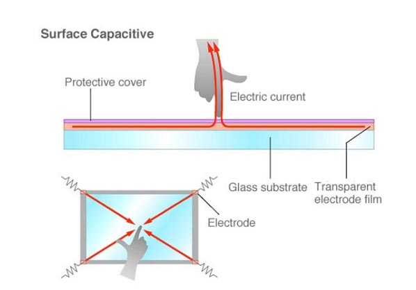
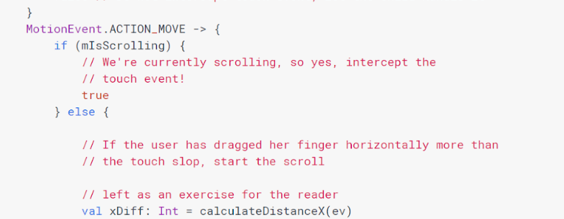
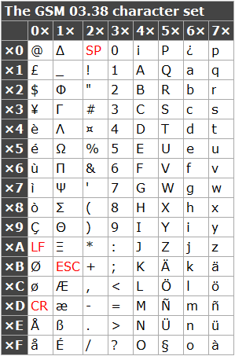
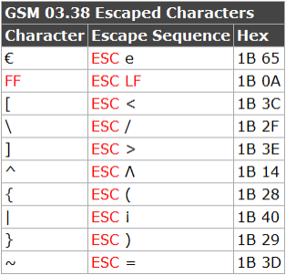
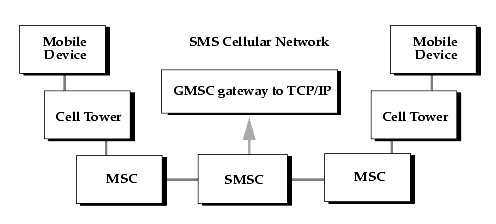
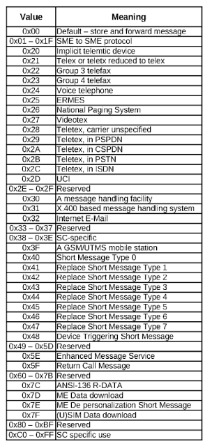
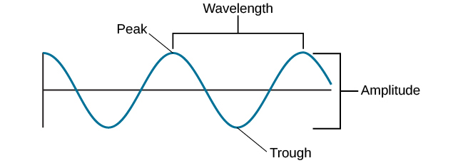
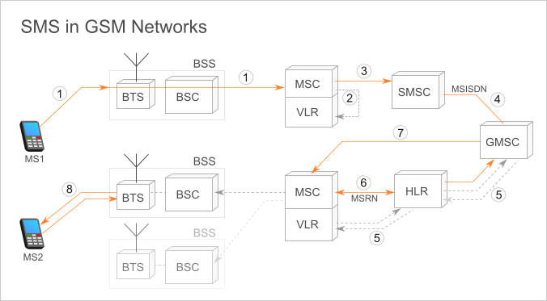
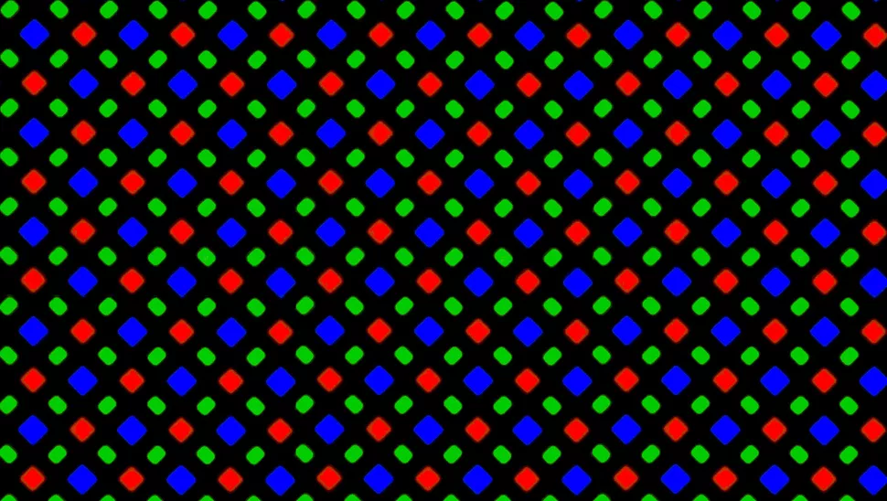
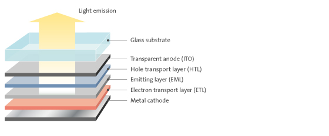

The Route of a Text Message – the scottbot irregular

This is the third post in my [full-stack dev](https://scottbot.net/tag/full-stack-dev/) (f-s d) series on the secret life of data. This installment is about a single text message: how it was typed, stored, sent, received, and displayed. I sprinkle in some history and context to break up the alphabet soup of protocols, but though the piece gets technical, it should all be easily understood.

The first two installments of this series are [Cetus](https://scottbot.net/cetus/), about the propagation of errors in a 17th century spreadsheet, and [Down the Rabbit Hole](https://scottbot.net/down-the-rabbit-hole/), about the insane lengths one occasionally needs to go through to track down the source of a dataset.

## A Love Story

My leg involuntarily twitches with vibration—was it my phone, or just a phantom feeling?—and a quick inspection reveals a blinking blue notification. “I love you”, my wife texted me. I walk downstairs to wish her goodnight, because I know the difference between the message and _the message_, you know?  

It’s a bit like encryption, or maybe steganography: anyone can see the text, but only I can decode the hidden data.  

My translation, if we’re being honest, is just one extra link in a remarkably long chain of data events, all to send a message (“come downstairs and say goodnight”) in under five seconds across about 40 feet.  

The message presumably began somewhere in my wife’s brain and somehow ended up in her thumbs, but that’s a signal for a different story. Ours begins as her thumb taps a translucent screen, one letter at a time, and ends as light strikes my retinas.

With each tap, a small electrical current passes from the screen to her hand. Because electricity flows easily through human bodies, sensors on the phone register a change in voltage wherever her thumb presses against the screen. But the world is messy, and the phone senses random fluctuations in voltage across the rest of the screen, too, so an algorithm determines the biggest, thumbiest-looking voltage fluctuations and assumes that’s where she intended to press.

  
_Figure 0. Capacitive touch._

So she starts tap-tap-tapping on the keyboard, one letter at a time.

I-_spacebar_-l-o-v-e-_spacebar_-y-o-u.  

She’s not a keyboard swiper (I am, but somehow she still types faster than me). The phone reliably records the (x,y) coordinates of each thumbprint and aligns it with the coordinates of each key on the screen. It’s harder than you think; sometimes her thumb slips, yet somehow the phone realizes she’s not trying to swipe, that it was just a messy press.

Deep in the metal guts of the device, an algorithm tests whether each thumb-shaped voltage disruption moves more that a certain number of pixels, called _touch slop_. If the movement is sufficiently small, the phone registers a keypress rather than a swipe.  

Fig 1. Android’s code for detecting ‘touch slop’. Notice the developers had my wife’s gender in mind.

She finishes her message, a measly 10 characters of her allotted 160.

The allotment of 160 characters is a carefully chosen number, if you believe the legend: In 1984, German telephone engineer Friedhelm Hillebrand sat at his typewriter and wrote as many random sentences as came to his mind. His team then looked at postcards and telex messages, and noticed most fell below 160 characters. “Eureka!”, they presumably yelled in German, before setting the character limit of text messages in stone for the next three-plus decades.  

Legends rarely tell the whole story, and the legend of SMS is no exception. Hillebrand and his team hoped to relay messages over a secondary channel that phones were already using to exchange basic information with their local stations.  

Signalling System no. 7 (SS7) are a set of protocols used by cell phones to stay in constant contact with their local tower; they need this continuous connection to know when to ring, to get basic location tracking, to check for voicemail, and communicate other non-internet reliant messages. Since the protocol’s creation in 1980, it had a hard limit of 279 bytes of information. If Hillebrand wanted text messages to piggyback on the SS7 protocol, he had to deal with this pretty severe limit.  

Normally, 279 bytes equals 279 characters. A byte is eight bits (each bit is a 0 or 1), and in common encodings, a single letter is equivalent to eight 0s and 1s in a row.

‘A’ is

0100 0001

‘B’ is

0100 0010

‘C’ is

0100 0011

and so on.  

Unfortunately, getting messages across the SS7 protocol isn’t a simple matter of sending 2,232 (that’s 279 bytes at 8 bits each) 0s or 1s through radio signals from my phone to yours. Part of that 279-byte signal needs to contain your phone number, and part of it needs to contain my phone number. Part of it needs to let the cell tower know “hey, this is a message, not a call, don’t ring the phone!”.  

By the time Hillebrand and his team finished cramming all the necessary contextual bits into the 279-byte signal, they were left with only enough space for 140 characters at 1 byte (8 bits) a piece, or 1,120 bits.  

But what if they could encode a character in only 7 bits? At 7 bits per character, they could squeeze 160 (1,140 / 7 = 160) characters into each SMS, but those extra twenty characters demanded a sacrifice: fewer possible letters.  

An 8-bit encoding allows 256 possible characters: lowercase ‘a’ takes up one possible space, uppercase ‘A’ another space, a period takes up a third space, an ‘@’ symbol takes up a fourth space, a line break takes up a fifth space, and so on up to 256. To squeeze an alphabet down to 7 bits, you need to remove some possible characters: the 1/2 symbol (½), the degree symbol (°), the pi symbol (π), and so on. But assuming people will never use those symbols in text messages (a poor assumption, to be sure), this allowed Hillebrand and his colleagues to stuff 160 characters into a 140-byte space, which in turn fit neatly into a 279-byte SS7 signal: exactly the number of characters they claim to have discovered was the perfect length of a message. (A bit like the miracle of Hanukkah, if you ask me.)  

_Fig 2. The GSM-7 character set._

So there my wife is, typing “I love you” into a text message, all the while the phone converts those letters into this 7-bit encoding scheme, called GSM-7.

“I” (notice it’s at the intersection of _4x_ and _x9_ above) =

49 

Spacebar (notice it’s at the intersection of _2x_ and _x0_ above) =

20 

“l” =

6C

“o” =

6F

and so on down the line.  

In all, her slim message becomes:

49 20 6C 6F 76 65 20 79 6F 75 

(10 bytes combined). Each two-character code, called a _hex code_, is one 8-bit chunk, and together it spells “I love you”.

But this is actually not how the message is stored on her phone. It has to convert the 8-bit text to 7-bit hex codes, which it does by essentially borrowing the remaining bit at the end of every byte. The math is a bit more [complicated](http://web.archive.org/web/20081017024616/http://www.dreamfabric.com:80/sms/hello.html) than is worth getting into here, but the resulting message appears as

49 10 FB 6D 2F 83 F2 EF 3A 

(9 bytes in all) in her phone.  

When my wife finally finishes her message (it takes only a few seconds), she presses ‘send’ and a host of tiny angels retrieve the encoded message, flutter their invisible wings the 40 feet up to the office, and place it gently into my phone. The process isn’t entirely frictionless, which is why my phone vibrates lightly upon delivery.  

The so-called “telecommunication engineers” will tell you a different story, and for the sake of completeness I’ll relay it to you, but I wouldn’t trust them if I were you.

The engineers would say that, when the phone senses voltage fluctuations over the ‘send’ button, it sends the encoded message to the SIM card (that tiny card your cell provider puts in your phone so it knows what your phone number is), and in the process it wraps it in all sorts of useful contextual data. By the time it reaches my wife’s SIM, it goes from a 140-byte message (just the text) to a 176-byte message (text + context).  

The extra 36 bytes are used to encode all sorts of information, seen below.

_Fig 3. Here, bytes are called octets (8 bits). Counting all possible bytes yields 174 (10+1+1+12+1+1+7+1+140). The other two bytes are reserved for some SIM card bookkeeping._

The first ten bytes are reserved for the telephone number (service center address, or SCA) of the SMS service center (SMSC), tasked with receiving, storing, forwarding, and delivering text messages. It’s essentially a switchboard: my wife’s phone sends out a signal to the local cell tower and gives it the number of the SMSC, which forwards her text message from the tower to the SMSC. The SMSC, which in our case is operated by AT&T, routes the text to the mobile station nearest to my phone. Because I’m sitting three rooms away from my wife, the text just bounces back to the same mobile station, and then to my phone.  

_Fig 4. SMS cellular network_

The next byte (PDU-type) encodes some basic housekeeping on how the phone should interpret the message, including whether it was sent successfully, whether the carrier requests a status report, and (importantly) whether this is a single text or part of a string of connected messages.  

The byte after the PDU-Type is the message reference (MR). It’s a number between 1 and 255, and is essentially used as a short-term ID number to let the phone and the carrier know which text message it’s dealing with. In my wife’s case the number is set to 0, because her phone has its own message ID system independent of this particular file.  

The next twelve bytes or so are reserved for the recipient’s phone number, called the destination address (DA). With the exception of the 7-bit letter character encoding I mentioned earlier, that helps us stuff 160 letters into a 140-character space, the phone number encoding is the stupidest, most confusing bits you’ll encounter in this SMS. It’s called reverse nibble notation, and it reverses every other digit in a large number. (Get it? Part of a byte is a nibble, hahahahaha, nobody’s laughing, engineers.)  

My number, which is usually 1-352-537-8376, is logged in my wife’s phone as:

3125358773f6

The 1-3 is represented by

31

The 52 is represented by

25

The 53 is represented by

35

The 7-8 is represented by

87

The 37 is represented by

73

And the 6 is represented by…

f6

Where the fuck did the ‘f’ come from? It means it’s the end of the phone number, but for some awful reason (again, reverse nibble notation) it’s one character before the final digit.  

It’s like pig latin for numbers.

tIs'l ki eip galit nof runbmre.s  

But I’m not bitter.

\[Edit: [Sean Gies points out](https://twitter.com/seangies/status/1085302529917763585) that reverse nibble notation is an inevitable artifact of representing 4-bit [little-endian](https://en.wikipedia.org/wiki/Endianness) numbers in 8-bit chunks. That doesn’t invalidate the above description, but it does add some context for those who know what it means, and makes the decision seem more sensible.\]

The Protocol Identifier (PID) byte is honestly, at this point, mostly wasted space. It takes about 40 possible values, and it tells the service provider how to route the message. A value of

22 

means my wife is sending “I love you” to a fax machine; a value of

24 

means she’s sending it to a voice line, somehow. Since she’s sending it as an SMS to my phone, which receives texts, the PID is set to

0

(Like every other text sent in the modern world.)  

_Fig 5. Possible PID Values_

The next byte is the Data Coding Scheme (DCS, [see this doc for details](https://www.etsi.org/deliver/etsi_ts/123000_123099/123038/10.00.00_60/ts_123038v100000p.pdf)), which tells the carrier and the receiving phone which character encoding scheme was used. My wife used GSM-7, the 7-bit alphabet I mentioned above that allows her to stuff 160 letters into a 140-character space, but you can easily imagine someone wanting to text in Chinese, or someone texting a complex math equation (ok, maybe you can’t easily imagine that, but a guy can dream, right?).  

In my wife’s text, the DCS byte was set to

0

meaning she used a 7-bit alphabet, but she may have changed that value to use an 8- or 16-bit alphabet, which would allow her many more possible letters, but a much smaller space to fit them. Incidentally, this is why when you text emoji to your friend, you have fewer characters to work with.  

There’s also a little flag in the DCS byte that tells the phone whether to self-destruct the message after sending it, _Mission Impossible_ style, so that’s neat.  

The validity period (VP) space can take up to seven bytes, and sends us into another aspect of how text messages actually work. Take another look at Figure 4, above. It’s okay, I’ll wait.  

When my wife finally hits ‘send’, the text gets sent to the SMS Service Center (SMSC), which then routes the message to me. I’m upstairs and my phone is on, so I receive the text in a handful of seconds, but what if my phone were off? Surely my phone can’t accept a message when it’s not receiving any power, so the SMSC has to do _something_ with the text.  

If the SMSC can’t find my phone, my wife’s message will just bounce around in its system until the moment my phone reconnects, at which point it sends the text out immediately. I like to think of the SMSC continuously checking every online phone to see if its mine like a puppy waiting for its human by the door: is that smell my human? No. Is _that_ smell my human? No. Is _this_ smell my human? YESYESJUMPNOW.  

The validity period (VP) bytes tell the carrier how long the puppy will wait before it gets bored and finds a new home. It’s either a timestamp or a duration, and it basically says “if you don’t see the recipient phone pop online in the next however-many days, just don’t bother sending it.” The default validity period for a text is 10,080 minutes, which means if it takes me more than seven days to turn my phone back on, I’ll never receive her text.  

Because there’s often a lot of empty space in an SMS, a few bits here or there are dedicated to letting the phone and carrier know exactly which bytes are unused. If my wife’s SIM card expects a 176-byte SMS, but because she wrote an exceptionally short message it only receives a 45-byte SMS, it may get confused and assume something broke along the way. The user data length (UDL) byte solves this problem: it relays exactly how many bytes the text in the text message actually take up.  

In the case of “I love you”, the UDL claims the subsequent message is 9 bytes. You’d expect it to be 10 bytes, one for each of the 10 characters in

I-spacebar-l-o-v-e-spacebar-y-o-u

but because each character is 7 bits rather than 8 bits (a full byte), we’re able to shave an extra byte off in the translation. That’s because 7 bits * 10 characters = 70 bits, divided by 8 (the number of bits in a byte) = 8.75 bytes, rounded up to 9 bytes.  

Which brings us to the end of every SMS: the message itself, or the UD (User Data). The message can take up to 140 bytes, though as I just mentioned, “I love you” will pack into a measly 9. Amazing how much is packed into those 9 bytes—not just the message (my wife’s presumed love for me, which is already difficult enough to compress into 0s and 1s), but also the _message_ (I need to come downstairs and wish her goodnight). Those bytes are:

49 10 FB 6D 2F 83 F2 EF 3A.  

In all, then, this is the text message stored on my wife’s SIM card:  

SCA\[1-10\]-PDU\[1\]-MR\[1\]-DA\[1-12\]-DCS\[1\]-VP\[0, 1, or 7\]-UDL\[1\]-UD\[0-140\]  

00 - 11 - 00 - 07 31 25 35 87 73 F6 - ?? 00 ?? - ?? - 09 - 49 10 FB 6D 2F 83 F2 EF 3A  

(Note: to get the full message, I need to do some more digging. Alas, you only see _most_ of the message here, hence the ??s.)

Somehow \[he says in David Attenborough’s voice\], the SMS must now begin its arduous journey from the SIM card to the nearest base station.  To do that, my wife’s phone must convert a string of 176 bytes to the 279 bytes readable by the SS7 protocol, convert those digital bytes to an analog radio signal, and then send those signals out into the æther at a frequency of somewhere between 800 and 2000 megahertz. That means each wave is between 6 and 14 inches from one peak to the next.  

_Fig 6. Wavelength_

In order to efficiently send and receive signals, antennas should be no smaller than half the size of the radio waves they’re dealing with. If cell waves are 6 to 14 inches, their antennas need to be 3-7 inches. Now stop and think about the average height of a mobile phone, and why they never seem to get much smaller.  

Through some digital gymnastics that would take entirely too long to explain, suddenly my wife’s phone shoots a 279-byte information packet containing “I love you” at the speed of light in every direction, eventually fizzling into nothing after about 30 miles.  

Well before getting that far, her signal strikes the AT&T HSPA Base Station ID199694204 LAC21767. This base transceiver station (BTS) is about 5 blocks from my favorite bakery in Hazelwood, La Gourmandine, and though I was able to find its general location using an android app called OpenSignal, the antenna is camouflaged beyond my ability to find it.

The really fascinating bit here is that it reaches the base transceiver station at all, given everything else going on. Not only is my wife texting me “I love you” in the 1000ish mhz band of the electromagnetic spectrum; tens of thousands of other people are likely talking on the phone or texting within the 30 mile radius around my house, beyond which cell signals disintegrate. On top of that, a slew of radio and TV signals are jostling for attention in our immediate airspace, alongside visible light bouncing this way and that, to name a few of the many electromagnetic waves that seem like they ought to be getting in the way.  

As [Richard Feynman eloquently put it in 1983](https://www.youtube.com/watch?v=1qQQXTMih1A), it’s a bit like the cell tower is a little blind bug resting gently atop the water on one end of a pool, and based only on the frequency and direction of waves that cause it to bounce up and down, it’s able to reconstruct who’s swimming and where.  

Feynman discussing waves.

In part due to the complexity of competing signals, each base transceiver station generally can’t handle more than 200 active users (using voice or data) at a time. So “I love you” pings my local base transceiver station, about a half a mile away, and then shouts itself into the void in every direction until it fades into the noise of everyone else.

I’m pretty lucky, all things considered. Were my wife and I on different cell providers, or were we in different cities, the route of her message to me would be a good deal more circuitous.  

My wife’s message is massaged into the 279-byte SS7 channel, and sent along to the local base transceiver station (BTS) near the bakery. From there, it gets routed to the base station controller (BSC), which is the brain of not just our antenna, but several other local antennas besides. The BSC flings the text to AT&T Pittsburgh’s mobile switching center (MSC), which relies on the text message’s SCA (remember the service center address embedded within every SMS? That’s where this comes in) to get it to the appropriate short message service center (SMSC).  

This alphabet soup is easier to understand with the diagram from figure 7; I just described steps 1 and 3. If my wife were on a different carrier, we’d continue through steps 4-7, because that’s where the mobile carriers all talk to each other. The SMS has to go from the SMSC to a global switchboard and then potentially bounce around the world before finding its way to my phone.  

_Fig 7. SMS routed through a GSM network._

But she’s on AT&T and I’m on AT&T, and our phones are connected to the same tower, so after step 3 the 279-byte packet of love just does an about-face and returns through the same mobile service center, through the same base station, and now to my phone instead of hers. A trip of a few dozen miles in the blink of an eye.

_Buzzzzz_. My pocket vibrates. A notification lets me know an SMS has arrived through my nano-SIM card, a circuit board about the size of my pinky nail. Like Bilbo Baggins or any good adventurer, it changed a bit in its trip there and back again.  

_Fig 8. Received message, as opposed to sent message (figure 3)._

Figure 8 shows the structure of the message “I love you” now stored on my phone. Comparing figures 3 and 8, we see a few differences. The SCA (phone number of the short message service center), the PDU (some mechanical housekeeping), the PID (phone-to-phone rather than, say, phone-to-fax), the DCS (character encoding scheme), the UDL (length of message), and the UD (the message itself) are all mostly the same, but the VP (the text’s expiration date), the MR (the text’s ID number), and the DA (my phone number) are missing.  

Instead, on my phone, there are two new pieces of information: the OA (originating address, or my wife’s phone number), and the SCTS (service center time stamp, or when my wife sent the message).  

My wife’s phone number is stored in the same annoying reverse nibble notation (like dyslexia but for computers) that my phone number was stored in on her phone, and the timestamp is stored in the same format as the expiration date was stored in on on her phone.  

These two information inversions make perfect contextual sense. Her phone needed to reach me by a certain time at a certain address, and I now need to know who sent the message and when. Without the home address, so to speak, I wouldn’t know whether the “I love you” came from my wife or my mother, and the difference would change my interpretation of the message fairly significantly.

In much the same way that any computer translates a stream of bytes into a series of (x,y) coordinates with specific color assignments, my phone’s screen gets the signal to render

49 10 FB 6D 2F 83 F2 EF 3A

on the screen in front of me as “I love you” in backlit black-and-white. It’s an interesting process, but as it’s not particularly unique to smartphones, you’ll have to look it up elsewhere. Let’s instead focus on how those instructions become points of light.  

The friendly marketers at Samsung call my screen a Super AMOLED (Active Matrix Organic Light-Emitting Diode) display, which is somehow both redundant and not particularly informative, so we’ll ignore unpacking the acronym as yet another distraction, and dive right into the technology.  

There are about 330,000 tiny sources of light, or pixels, crammed inside each of my phone screen’s 13 square inches. For that many pixels, each needs to be about 45µm (micrometers) wide: thinner than a human hair. There’s 4 million of ‘em in all packed into the palm of my hand.  

But you already know how screens work. You know that every point of light, like the Christian God or Musketeers (minus d’Artagnan), is always a three-for-one sort of deal. Red, green, and blue combine to form white light in a single pixel. Fiddle with the luminosity of each channel, and you get every color in the rainbow. And since 4 x 3 = 12, that’s 12 million tiny sources of light sitting innocently dormant behind my black mirror, waiting for me to press the power button to read my wife’s text.

_Fig 9. The subpixel array of a Samsung OLED display._

Each pixel, as the acronym suggests, is an organic light-emitting diode. That’s fancy talk for an electricity sandwich:  

_Fig 10. An electricity sandwich._

The layers aren’t too important, beyond the fact that it’s a cathode plate (negatively charged), below a layer of organic molecules (remember back to highschool: it’s just some atoms strung together with carbon), below an anode plate (positively charged).  

When the phone wants the screen on, it sends electrons from the cathode plate to the anode plate. The sandwiched molecules intercept the energy, and in response they start emitting visible light, photons, up through the transparent anode, up through the screen, and into my waiting eyes.  

Since each pixel is three points of light (red, green, and blue), there’s actually three of these sandwiches per pixel. They’re all essentially the same, except the organic molecule is switched out: poly(p-phenylene) for blue light, polythiophene for red light, and poly(p-phenylene vinylene) for green light. Because each is slightly different, they shine different colors when electrified.  

(Fun side fact: blue subpixels burn out much faster, due to a process called “exciton-polaron annihilation”, which sounds really exciting, doesn’t it?)  

All 4 million pixels are laid out on an indexed matrix. An index works in a computer much the same way it works in a book: when my phone wants a specific pixel to light a certain color, it looks that pixel up in the index, and then sends a signal to the address it finds. _Let there be light, and there was light_.  

(Fun side fact: now you know what “Active Matrix Light-Emitting Diode” means, and you didn’t even try.)  

My phone’s operating system interprets my wife’s text message, figures out the shape of each letter, and maps those shapes to the indexed matrix. It sends just the right electric pulses through the Super AMOLED screen to render those three little words that have launched ships and vanquished curses.  

The great strangeness here is that my eyes never see “I love you” in bright OLED lights; it appear on the screen black-on-white. The phone creates the illusion of text through negative space, washing the screen white by setting every red, green, & blue to maximum brightness, then turning off the bits where letters should be. Its complexity is offensively mundane.  

_Fig 11. Negative space._

In displaying everything _but_ my wife’s text message, and letting me read it in the gaps, my phone succinctly betrays the lie at the heart of the information age: that communication is _simple_. Speed and ease hide a mountain of mediation.  

And that mediation isn’t just technical. My wife’s text wouldn’t have reached me had I not paid the phone bill on time, had there not been a small army of workers handling financial systems behind the scenes. Technicians keep the phone towers in working order, which they reach via a network of roads partially subsidized by federal taxes collected from hundreds of millions of Americans across 50 states. Because so many transactions still occur via mail, if the U.S. postal system collapsed tomorrow, my phone service would falter. Exploited factory workers in South America and Asia assembled parts in both our phones, and exhausted programmers renting expensive Silicon Valley closets are as-you-read-this pushing out code ensuring our phones communicate without interruption.  

All of this underneath a 10-character text. A text which, let’s be honest, means much more than it says. My brain subconsciously peels back years of interactions with my wife to decode the message appearing on my phone, but between her and me there’s still a thicket of sociotechnical mediation, a stew of people and history and parts, that can never be untangled.

So here I am, in the office late one Sunday night. “I love you,” my wife texted from the bedroom downstairs, before the message traversed 40 or so feet to my phone in a handful of seconds. I realize what it means: it’s time to wish her goodnight, and perhaps wrap up this essay. I tap away the last few words, now slightly more cognizant of the complex layering of miles, signals, years of history, and human sweat it took to keep my wife from having to shout upstairs that it’s about damn time I get some rest.

_Thanks to Christopher Warren, Vika Zafrin, and Nechama Weingart for comments on earlier drafts._