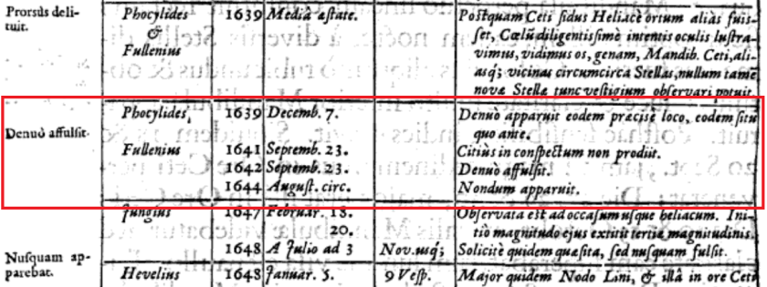
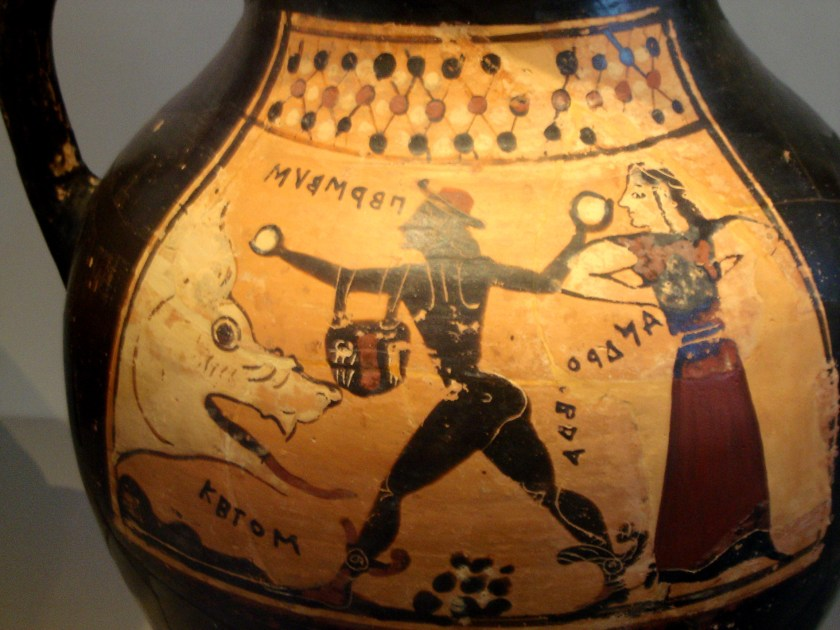
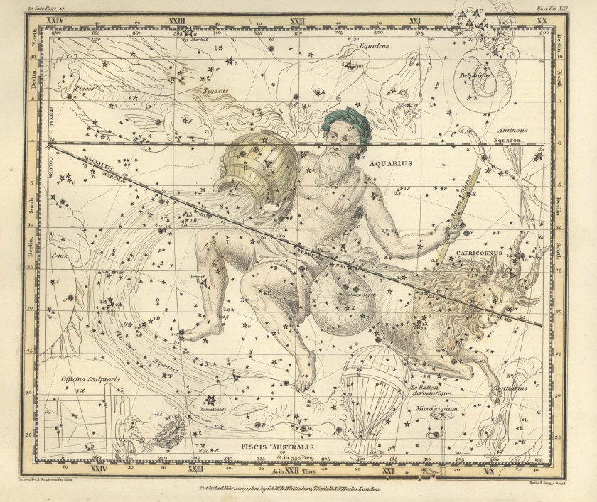
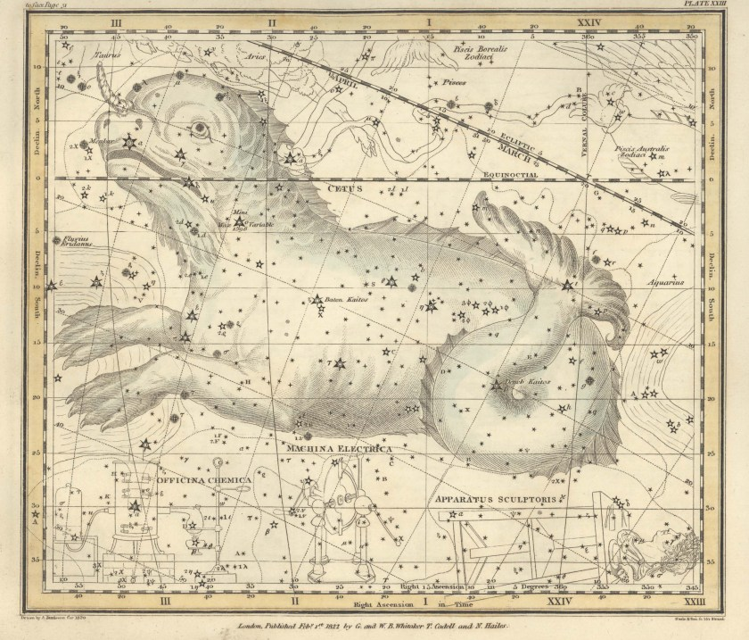
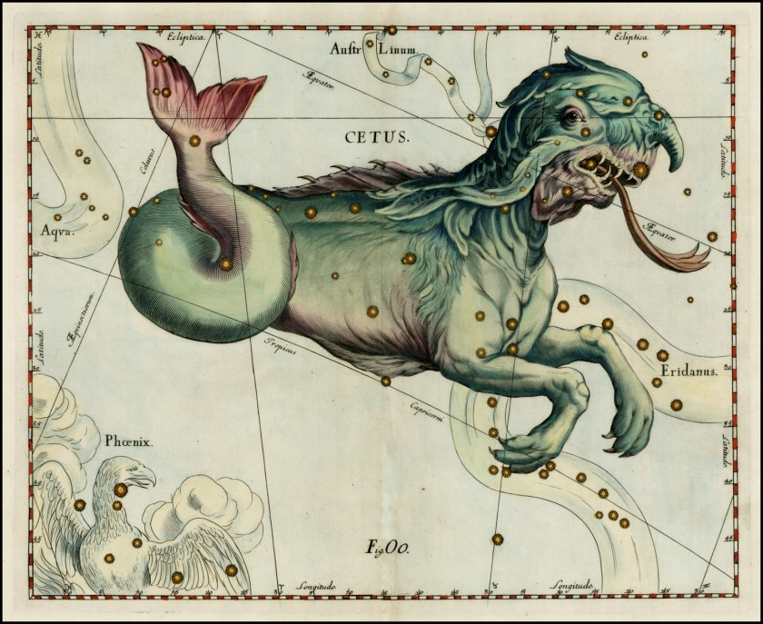

[f-s d] Cetus – the scottbot irregular

Quoting Liz Losh, Jacqueline Wernimont tweeted that behind every visualization is a spreadsheet.

But what, I wondered, is behind every spreadsheet?

Space whales.

Okay, maybe space whales aren’t behind _every_ spreadsheet, but they’re behind this one, dated 1662, notable for the gigantic nail it hammered into the coffin of our belief that heaven above is perfect and unchanging. The following post is the first in my new series _[full-stack dev](http://scottbot.net/tag/full-stack-dev/) (f-s d)_, where I explore the secret life of data. [1](https://scottbot.net/cetus/#note-41771-1 "I’m retroactively adding my blog rant about data underlying an equality visualization to the f-s d series.")

Hevelius. [Mercurius in Sole visus (1662)](https://books.google.com/books?id=r19DAAAAcAAJ&dq=hevelius%20Mercurius%20in%20Sole%20visus&pg=PA152#v=onepage&q&f=false).

The Princess Bride teaches us a good story involves “fencing, fighting, torture, revenge, giants, monsters, chases, escapes, true love, miracles”. In this story, _Cetus_, three of those play a prominent role: (red) giants, (sea) monsters, and (cosmic) miracles. Also Greek myths, interstellar explosions, beer-brewing astronomers, meticulous archivists, and top-secret digitization facilities. All together, they reveal how technologies, people, and stars aligned to stick this 350-year-old spreadsheet in your browser today.

When Aethiopian queen Cassiopeia claimed herself more beautiful than all the sea nymphs, Poseidon was, let’s say, less than pleased. Mildly miffed. He maybe sent a sea monster named Cetus to destroy Aethiopia.

Because obviously the best way to stop a flood is to drown a princess, Queen Cassiopeia chained her daughter to the rocks as a sacrifice to Cetus. Thankfully the hero Perseus just happened to be passing through Aethiopia, returning home after beheading Medusa, that snake-haired woman whose eyes turned living creatures to stone. Perseus (depicted below as the world’s most boring 2-ball juggler) revealed Medusa’s severed head to Cetus, turning the sea monster to stone and saving the princess. And then they got married because traditional gender roles I guess?

Corinthian vase depicting Perseus, Andromeda and Ketos. \[[via](https://en.wikipedia.org/wiki/Cetus_(mythology)#/media/File:Corinthian_Vase_depicting_Perseus,_Andromeda_and_Ketos.jpg)\]

Cetaceans, you may recall from grade school, are those giant carnivorous sea-mammals that Captain Ahab warned you about. _Cetaceans_, from _Cetus_. You may also remember we have a thing for naming star constellations and dividing the sky up into sections (see the Zodiac), and that we have a long history of comparing the sky to the ocean (see Carl Sagan or [Star Trek IV](https://en.wikipedia.org/wiki/Star_Trek_IV:_The_Voyage_Home)).

It should come as no surprise, then, that we’ve designated a whole section of space as ‘[The Sea](https://en.wikipedia.org/wiki/Sea_(astronomy))‘, home of Cetus (the whale), Aquarius (the God) and Eridanus (the water pouring from Aquarius’ vase, source of river floods), Pisces (two fish tied together by a rope, [which makes total sense I promise](https://en.wikipedia.org/wiki/Pisces_(constellation)#History_and_mythology)), Delphinus (the dolphin), and Capricornus (the goat-fish. Listen, I didn’t make these up, okay?).

Jamieson’s Celestial Atlas, Plate 21 (1822). \[[via](http://aa.usno.navy.mil/library/artwork/jamieson.htm)\]

Jamieson’s Celestial Atlas, Plate 23 (1822). \[[via](http://aa.usno.navy.mil/library/artwork/jamieson.htm)\]

Ptolemy listed most of these constellations in his _Almagest_ (ca. 150 A.D.), including Cetus, along with descriptions of over a thousand stars. Ptolemy’s model, with Earth at the center and the constellations just past Saturn, set the course of cosmology for over a thousand years.

![Ptolemy's Cosmos [by Robert A. Hatch]](../../_resources/0ceeae2db45a4b7a937353894d38ab16.jpg)

Ptolemy’s Cosmos \[[by Robert A. Hatch](http://users.clas.ufl.edu/ufhatch/pages/03-Sci-Rev/SCI-REV-Home/resource-ref-read/chief-systems/08-0PTOL3-WSYS.html)\]

In this cosmos, reigning in Western Europe for centuries past Copernicus’ death in 1543, the stars were fixed and motionless. There was no vacuum of space; every planet was embedded in a shell made of aether or quintessence (_quint-essence_, the fifth element), and each shell sat atop the next until reaching the celestial sphere. This last sphere held the stars, each one fixed to it as with a pushpin. Of course, all of it revolved around the earth.

The domain of heavenly spheres was assumed perfect in all sorts of ways. They slid across each other without friction, and the planets and stars were perfect spheres which could not change and were unmarred by inconsistencies. One reason it was so difficult for even “great thinkers” to believe the earth orbited the sun, rather than vice-versa, was because such a system would be at complete odds with how people knew physics to work. It would break gravity, break motion, and break the outer perfection of the cosmos, which was essential (…_heh_) [2](https://scottbot.net/cetus/#note-41771-2 "this pun is only for historians of science") to our notions of, well, everything.

Which is why, when astronomers with their telescopes and their spreadsheets started systematically observing imperfections in planets and stars, lots of people didn’t believe them—even other astronomers. Over the course of centuries, though, these imperfections became impossible to ignore, and helped launch the earth in rotation ’round the sun.

This is the story of one such imperfection.

Around 1296 A.D., over the course of half a year, a red dwarf star some 2 quadrillion miles away grew from 300 to 400 times the size of our sun. Over the next half year, the star shrunk back down to its previous size. Light from the star took 300 years to reach earth, eventually striking the retina of German pastor [David Fabricius](https://en.wikipedia.org/wiki/David_Fabricius). It was very early Tuesday morning on August 13, 1596, and Pastor Fabricius was looking for Jupiter. [3](https://scottbot.net/cetus/#note-41771-3 "Most of the historiography in this and the following section are summarized from Robert A. Hatch’s “Discovering Mira Ceti: Celestial Change and Cosmic Continuity“")

At that time of year, Jupiter would have been near the constellation Cetus (remember our sea monster?), but Fabricius noticed a nearby bright star (labeled ‘Mira’ in the below figure) which he did not remember from Ptolemy or Tycho Brahe’s star charts.

![Mira Ceti and Jupiter. [via]](../../_resources/3c949f9a0f1445ac80aa1ca742841429.jpg)

Mira Ceti and Jupiter. \[[via](http://www.universetoday.com/99091/five-planets-around-nearby-star-tau-ceti-one-in-habitable-zone/)\]

Spotting an unrecognized star wasn’t unusual, but one so bright in so common a constellation was certainly worthy of note. He wrote down some observations of the star throughout September and October, after which it seemed to have disappeared as suddenly as it appeared. The disappearance prompted Fabricius to write a letter about it to famed astronomer [Tycho Brahe](https://en.wikipedia.org/wiki/Tycho_Brahe), who had described a similar appearing-then-disappearing star between 1572 and 1574. Brahe jotted Fabricius’ observations down in his journal. This sort of behavior, after all, was a bit shocking for a supposedly fixed and unchanging celestial sphere.

More shocking, however, was what happened 13 years later, on February 15, 1609. Once again searching for Jupiter, pastor Fabricius spotted another new star in the same spot as the last one. Tycho Brahe having recently died, Fabricius wrote a letter to his astronomical successor, [Johannes Kepler](https://en.wikipedia.org/wiki/Johannes_Kepler), describing the miracle. This was unprecedented. No star had ever vanished and returned, and nobody knew what to make of it.

Unfortunately for Fabricius, nobody did make anything of it. His observations were either ignored or, occasionally, dismissed as an error. To add injury to insult, a local goose thief killed Fabricius with a shovel blow, thus ending his place in this star’s story, among other stories.

Three decades passed. On the winter solstice, 1638, Johannes Phocylides Holwarda prepared to view a lunar eclipse. He reported with excitement the star’s appearance and, by August 1639, its disappearance. The new star, Holwarda claimed, should be considered of the same class as Brahe, Kepler, and Fabricius’ new stars. As much a surprise to him as Fabricius, Holwarda saw the star again on November 7, 1639. Although he was not aware of it, his new star was the same as the one Fabricius spotted 30 years prior.

Two more decades passed before the new star in the neck of Cetus would be systematically sought and observed, this time by Johannes Hevelius: local politician, astronomer, and brewer of fine beers. By that time many had seen the star, but it was difficult to know whether it was the same celestial body, or even what was going on.

Hevelius brought everything together. He found recorded observations from Holwarda, Fabricius, and others, from today’s Netherlands to Germany to Poland, and realized these disparate observations were of the same star. Befitting its puzzling and seemingly miraculous nature, Hevelius dubbed the star _Mira_ (miraculous) _Ceti._ The image below, from Hevelius’ _Firmamentum Sobiescianum sive Uranographia_ (1687), depicts _Mira Ceti_ as the bright star in the sea monster’s neck.

Hevelius. Firmamentum Sobiescianum sive Uranographia (1687).

Going further, from 1659 to 1683, Hevelius observed _Mira Ceti_ in a more consistent fashion than any before. There were eleven recorded observations in the 65 years between Fabricius’ first sighting of the star and Hevelius’ undertaking; in the following three, he had recorded 75 more such observations. Oddly, while Hevelius was a remarkably meticulous observer, he insisted the star was inherently unpredictable, with no regularity in its reappearances or variable brightness.

Beginning shortly after Hevelius, the astronomer Ismaël Boulliau also undertook a thirty year search for _Mira Ceti_. He even published a prediction, that the star would go through its vanishing cycle every 332 days, which turned out to be incredibly accurate. As today’s astronomers note, _Mira Ceti_‘s brightness increases and decreases by several orders of magnitude every 331 days, caused by an interplay between radiation pressure and gravity in the star’s gaseous exterior.

![Mira Ceti composite taken by NASA's Galaxy Evolution Explorer. [via]](../../_resources/021dd847ee9747dcb296f55bf39676fc.jpg)

Mira Ceti composite taken by NASA’s Galaxy Evolution Explorer. \[[via](https://en.wikipedia.org/wiki/Mira#/media/File:A-Mira-Full_down_sampled_and_cropped.jpg)\]

While of course Boulliau didn’t arrive at today’s explanation for _Mira_‘s variability, his solution did require a rethinking of the fixity of stars, and eventually contributed to the notion that maybe the same physical laws that apply on Earth also rule the sun and stars.

But we’re not here to talk about Boulliau, or _Mira Ceti_. We’re here to talk about this spreadsheet:

Hevelius. Mercurius in Sole visus (1662).

This snippet represents Hevelius’ attempt to systematically collected prior observations of _Mira Ceti_. Unreasonably meticulous readers of this post may note an inconsistency: I wrote that Johannes Phocylides Holwarda observed Mira Ceti on November 7th, 1639, yet Hevelius here shows Holwarda observing the star on _December_ 7th, 1639, an entire month later. The little notes on the side are basically the observers saying: “wtf this star keeps reappearing???”

This mistake was not a simple printer’s error. It reappeared in Hevelius’ printed books three times: 1662, 1668, and 1685. This is an early example of what Raymond Panko and others call a spreadsheet error, [which appear in nearly 90% of 21st century spreadsheets](http://panko.shidler.hawaii.edu/SSR/Mypapers/whatknow.htm). Hand-entry is difficult, and mistakes are bound to happen. In this case, a game of telephone also played a part: Hevelius may have pulled some observations not directly from the original astronomers, but from the notes of Tycho Brahe and Johannes Kepler, to which he had access.

Unfortunately, with so few observations, and many of the early ones so sloppy, mistakes compound themselves. It’s difficult to predict a variable star’s periodicity when you don’t have the right dates of observation, which may have contributed to Hevelius’ continued insistence that _Mira Ceti_ kept no regular schedule. The other contributing factor, of course, is that Hevelius worked without a telescope and under cloudy skies, and stars are hard to measure under even the best circumstances.

Here ends the first half of _Cetus_. The second half will cover how Hevelius’ book was preserved, the labor behind its digitization, and a bit about the technologies involved in creating the image you see.

Early modern astronomy is a particularly good pre-digital subject for _full-stack dev (f-s d)_, since it required vast international correspondence networks and distributed labor in order to succeed. Hevelius could not have created this table, compiled from the observations of several others, without access to cutting-edge astronomical instruments and the contemporary scholarly network.

You may ask why I included that whole section on Greek myths and Ptolemy’s constellations. Would as many early modern astronomers have noticed _Mira __Ceti_ had it not sat in the center of a familiar constellation, I wonder?

I promised this series will be about the secret life of data, answering the question of what’s behind a spreadsheet. _Cetus_ is only the first story (well, [second](http://scottbot.net/down-the-rabbit-hole/), I guess), but the idea is to upturn the iceberg underlying seemingly mundane datasets to reveal the complicated stories of their creation and usage. Stay-tuned for future installments.