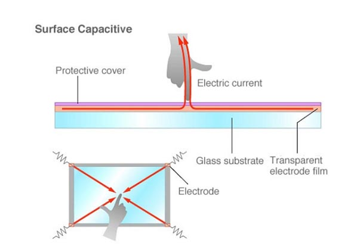
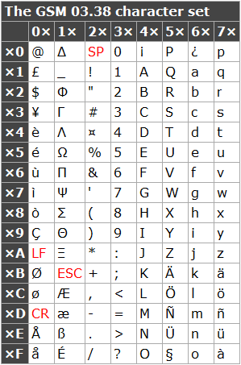
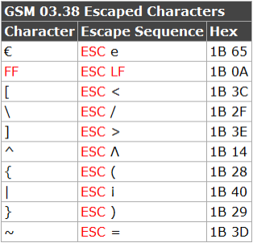
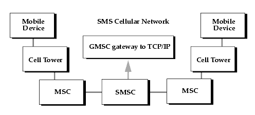
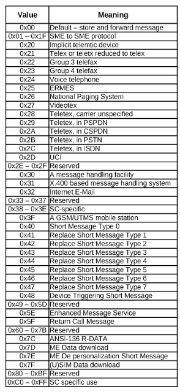
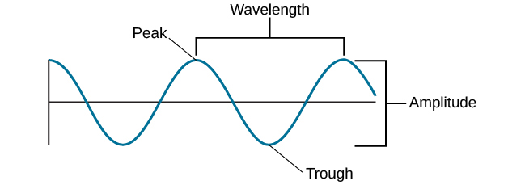
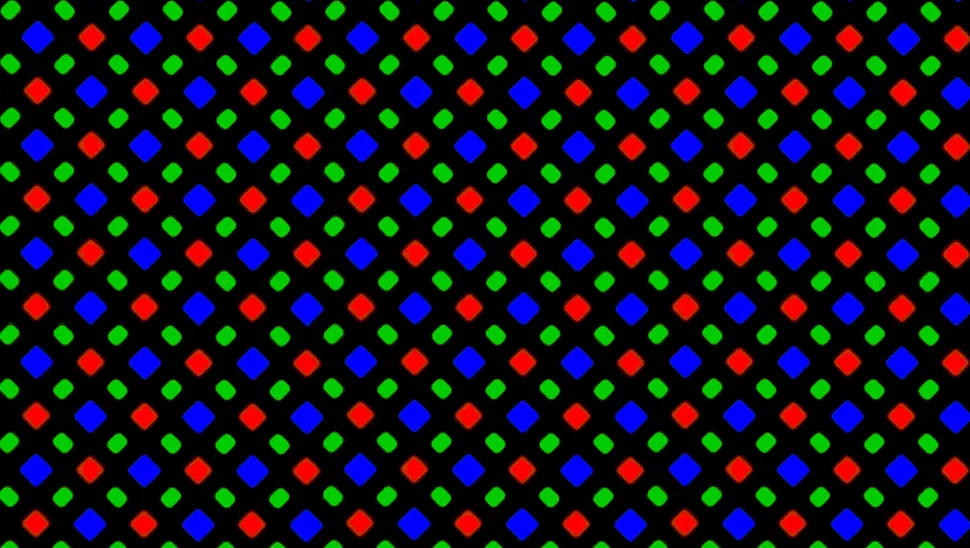
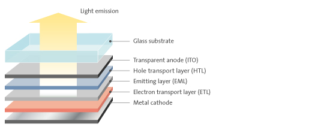

Что происходит, когда вы отправляете SMS

Это третья статья в цикле [full-stack dev](https://scottbot.net/tag/full-stack-dev/) о секретной жизни данных. Она посвящена сложному и длинному маршруту SMS: набор, сохранение, отправка, получение и отображение. Добавлю немного истории и контекст, чтобы разбавить перечень протоколов. Хотя текст довольно технический, всё довольно легко понять.

Первые две части цикла:

*   [Cetus](https://scottbot.net/cetus/), о распространении ошибок в предках электронных таблиц XVII века
*   [«Вниз по кроличьей норе»](https://scottbot.net/down-the-rabbit-hole/), о безумно сложном поиске источника одного набора данных

Итак, начнём…  
  
Нога непроизвольно дёрнулась от вибрации: это телефон или просто показалось? — и беглый взгляд обнаружил мигающий синий огонёк. «Люблю тебя» — от жены. Я тут же пошёл вниз пожелать ей спокойной ночи, потому что знаю разницу между посланием и _посланием_. Это немного похоже на шифрование или стеганографию: любой видит текст, но только я могу декодировать скрытые данные.

Мой перевод — всего лишь одно звено в удивительно длинной цепи событий, которые необходимы для отправки и расшифровки сообщения («спустись вниз и пожелай спокойной ночи») менее чем за пять секунд на расстояние около 10 метров.

Видимо, сообщение зародилось где-то в мозге моей жены и превратилось в движения пальцев, но эта передача сигнала — тема другой статьи. Наш разговор начинается с момента, когда её большой палец коснулся полупрозрачного экрана, и заканчивается, когда свет упал на мою сетчатку.

С каждым прикосновением от экрана в руку стекает небольшой электрический заряд. Поскольку ток легко течёт по человеческому телу, датчики на телефоне регистрируют изменение напряжения в том месте, где палец прикоснулся к экрану. При этом происходят случайные колебания напряжения в остальной части экрана, поэтому алгоритм определяет максимальные колебания напряжения и предполагает, что именно в этом месте человек хотел нажать пальцем.

  
_Рис. 0\. Ёмкостный датчик прикосновения_

Итак, она нажимает по экрану, набирая по одной букве.

`I-пробел-l-o-v-e-пробел-y-o-u.`

Она не пользуется свайпом (но почему-то всё равно печатает быстрее меня). Телефон надёжно регистрирует координаты (x,y) каждого нажатия и проверяет координаты каждой клавиши на экране. Это сложнее, чем вы думаете; иногда палец соскальзывает, но каким-то образом телефон понимает, что это не жест, а просто смазанное нажатие.

Глубоко в металлических кишках устройства алгоритм проверяет, что каждый раз изменение напряжения покрывает больше, чем определённое количество пикселей, которое называется _touch slop_. Если площадь небольшая, телефон регистрирует нажатие клавиши, а не свайп.

  
_Рис. 1\. Код Android для обнаружения touch slop. Обратите внимание, что разработчики знали пол моей жены_

Она заканчивает сообщение, жалкие 10 символов из разрешённых 160.

160 символов — тщательно выверенное число. Если верить легенде, в 1984 году немецкий телефонный инженер Фридхельм Хиллебранд сел за пишущую машинку и написал столько случайных предложений, сколько ему пришло в голову. Затем его команда изучила почтовые карточки и сообщения по телетайпу — и обнаружила, что большинство из них не превышает 160 символов. «Эврика!» — видимо, закричали они по-немецки, прежде чем зафиксировать лимит символов в текстовых сообщениях на следующие три с лишним десятилетия.

Легенды редко рассказывают всю историю целиком, и SMS не исключение. Хиллебранд и его команда надеялись передать сообщения по дополнительному каналу, который телефоны уже использовали для обмена информацией с базовой станциями.

Сигнальная система SS7 представляет собой набор протоколов, используемых сотовыми телефонами, чтобы оставаться в постоянном контакте с базовой станцией; им нужно постоянное соединение, чтобы получать вызов и передавать своё местоположение, проверять голосовую почту и т. д. При разработке протокола в 1980 году ввели жёсткий лимит в 279 байт информации. Если Хиллебранд хотел получать текстовые сообщения по протоколу SS7, то должен был вписаться в это ограничение.

Обычно 279 байт равно 279 символам. В байте 8 бит, а в общих кодировках один символ соответствует одному байту.

А

`0100 0001`

B

`0100 0010`

С

`0100 0011`

и так далее.

К сожалению, для передачи сообщения по протоколу SS7 нельзя просто отправить 2232 нуля и единицы (279 байт по 8 бит) радиосигналом с одного телефона на другой. В это сообщение нужно включить номера отправителя и получателя, а также служебное сообщение для базовой станции «Эй, это сообщение, а не звонок, не отправляй сигнал вызова!»

К тому времени, когда Хиллебранд с коллегами сумели запихать все необходимые биты контекста в 279-байтовый сигнал, у них осталось только 140 байт или 1120 бит.

Но что, если кодировать символ только в 7 битах? Тогда можно втиснуть в каждое сообщение 160 (1140 / 7 = 160) символов, но такое сокращение требует жертв: меньше возможных символов.

Восьмибитная кодировка допускает 256 возможных символов: одно место занимает строчная ‘a’, одно — прописная ‘A’, свои места у пробела и символа ‘@’, разрыва строки и так далее, до 256. Чтобы ужать алфавит до семи бит, необходимо удалить некоторые символы: символ 1/2 (½), символ градуса (°), символ числа пи (π) и так далее. Но предположив, что люди никогда не используют эти символы в тексте (плохое предположение, конечно), Гиллебранд с коллегами сумели поместить 160 символов в 140 байт. В свою очередь, этот объём точно уместился в 279 байт сигнала SS7: именно то количество символов, какое раньше определили как идеальную длину сообщения.

  
_Рис. 2\. Набор символов GSM-7_

И вот жена набирает «Люблю тебя», а телефон преобразует буквы в 7-битную схему кодирования, которая называется GSM-7.

“I” (пересечении четвёртого столбца и девятой строки в таблице):

`49`

Пробел (пересечение второго столбца и нулевой строки):

`20`

“l” =

`6C`

“o” =

`6F`

и так далее по очереди.

В общем, её послание превращается в такую последовательность:

`49 20 6C 6F 76 65 20 79 6F 75`

(всего 10 байт). Каждый двухсимвольный код, называемый шестнадцатеричным кодом (hex), представляет собой один восьмибитный фрагмент, а всё вместе звучит как «Люблю тебя».

Но на самом деле сообщение не так хранится в телефоне. Он должен преобразовать 8-битный текст в 7-битный код. В результате [преобразования](http://web.archive.org/web/20081017024616/http://www.dreamfabric.com:80/sms/hello.html) сообщение начинает изменяется до такого:

`49 10 FB 6D 2F 83 F2 EF 3A`

(9 байт) в её телефоне.

Когда жена, наконец, заканчивает свое сообщение (это занимает всего несколько секунд), она нажимает «Отправить» — и множество крошечных ангелов получают закодированное сообщение, трепещут своими невидимыми крыльями на 10 метров до моего кабинета и аккуратно переносят его в мой телефон. Процесс не очень лёгкий, вот почему мой телефон слегка вибрирует при доставке.

Так называемые «инженеры связи» расскажут вам другую историю, и для полноты картины я перескажу её, но на вашем месте я бы не слишком доверял этим людям.

Инженер скажет, что когда телефон воспринимает изменение напряжения по координатам на экране, которые совпадают с координатами размещения графического элемента с кнопкой «Отправить», то он отправляет кодированное сообщение на SIM-карту, а в процессе передачи добавляет различные контекстные данные. Когда сообщение достигает SIM-карты моей жены, то там уже не 140, а 176 байт (текст + контекст).

Дополнительные 36 байт используются для кодирования другой информации, как показано ниже.

  
_Рис. 3\. Здесь байты называются октетами (8 бит). Подсчёт всех даёт 174 октета (10+1+1+12+1+1+7+1+140). Остальные два байта зарезервированы для учёта SIM-карт_

Первые десять байт зарезервированы для телефонного номера (SCA) SMS-центра (SMSC), который отвечает за приём, хранение, пересылку и доставку текстовых сообщений. По сути, это коммутатор: телефон жены посылает сигнал на местную вышку сотовой связи, которая отсылает текстовое сообщение на SMSC. Центр SMS, который в нашем случае управляется AT&T, направляет текст на ближайшую к моему телефону базовую станцию. Поскольку я сижу в трёх комнатах от жены, сообщение возвращается на ту же базовую станцию, а затем на мой телефон.

  
_Рис. 4\. Сотовая сеть SMS_

Следующий байт (PDU-type) кодирует базовую информацию о том, как телефон должен интерпретировать сообщение: было ли оно успешно отправлено, нужно ли сообщение о доставке и (важно) является ли оно одиночным текстом или частью цепочки связанных сообщений.

Байт после PDU-type является ссылкой на сообщение (MR). Это число от 1 до 255, по сути, используется как краткосрочный ID, чтобы телефон и оператор распознавали сообщение. В сообщении от жены установлен номер 0, потому что в её телефоне собственная система идентификации сообщений, независимая от этого конкретного файла.

Следующие двенадцать байт зарезервированы для номера телефона получателя, который называется адресом назначения (DA). За исключением 7-битной кодировки текста, которая помогает втиснуть 160 букв в 140 символов, кодировка номера телефона — самая глупая и запутанная вещь в этом SMS. Она называется обратная запись нибблов (reverse nibble notation) и преобразует каждую цифру в ниббл, то есть полубайт, и меняет их местами (Всё поняли? Полбайта — это ниббл, хахахахаха, но никто не смеется, это же инженеры).

Мой номер 1-352-537-8376 в телефоне жены регистрируется как:

3125358773f6

1-3 превращается в

`31`

52 превращается в

`25`

53 превращается в

`35`

7-8 превращается в

`87`

37 превращается в

`73`

И последняя 6 превращается в…

`f6`

Какого хрена взялась эта шестёрка? Ну, она означает конец номера, но по какой-то ужасной причине (опять же, обратная нотация) это один символ перед последней цифрой.

Это как [«поросячья латынь»](https://ru.wikipedia.org/wiki/%D0%9F%D0%BE%D1%80%D0%BE%D1%81%D1%8F%D1%87%D1%8C%D1%8F_%D0%BB%D0%B0%D1%82%D1%8B%D0%BD%D1%8C), только для чисел.

`Усу посопаса бысыласа сособасакаса, осон есеёсё люсюбисил. Осонаса съеселаса кусусосок мясясаса, осон есеёсё усубисил.`

Но я не издеваюсь.

\[UPD: Шон Гис [указал](https://twitter.com/seangies/status/1085302529917763585), что обратная запись нибблов является неизбежным артефактом представления 4-битных чисел от младшего к старшему (little-endian) 8-битными фрагментами. Это не отменяет приведённое выше описание, но добавляет некоторый контекст для понимающих и делает решение более разумным\].

Байт идентификатора протокола (PID) сейчас, по большому счёту, потраченное впустую место. Он принимает около 40 возможных значений и сообщает провайдеру, как направить сообщение. Значение

`22`

означает, что жена отправляет «Люблю тебя» на факс, а значение

`24`

значит, что она каким-то образом отправляет его на голосовую линию. Поскольку это сообщение в виде SMS на телефон, PID установлен на

`0`

(Как и любой другой текст, отправляемый в современном мире).

  
_Рис. 5\. Возможные значения PID_

Следующий байт является схемой кодирования данных (DCS, [см. документацию](https://www.etsi.org/deliver/etsi_ts/123000_123099/123038/10.00.00_60/ts_123038v100000p.pdf)), которая сообщает оператору и телефону адресата, какая использовалась схема кодирования символов. Жена отправляла текст в GSM-7, но легко представить, что текст могли набрать кириллицей, иероглифами или сложными математическими уравнениями (ладно, может это и не легко представить, но каждый имеет право на мечту, верно?).

В тексте жены байт DCS установлен на

`0`

что соответствует 7-битному алфавиту, но значение можно изменить на 8- или 16-битный алфавит, хотя так останется гораздо меньше места для символов. Кстати, именно поэтому ваши эмодзи сокращают доступное количество символов.

В байте DCS есть ещё небольшой флаг, который говорит телефону, нужно ли самоуничтожать сообщение после отправки, как в фильме «Миссия невыполнима», так что это очень круто.

Период действия (VP) занимает до семи байт и даёт нам возможность познакомиться с другим аспектом, как в реальности работает система переадчи SMS. Взгляните ещё раз на рисунок 4 вверху. Всё в порядке, я подожду.

Итак, когда жена, наконец, нажимает кнопку «Отправить», текст отправляется в SMS-центр (SMSC), который затем направляет сообщение мне. Я сижу на втором этаже, и мой телефон включен, поэтому я получаю сообщение через несколько секунд, но что если телефон выключен? Конечно, тогда он не может принять сообщение, поэтому SMSC должен _что-то_ сделать с текстом.

Если SMSC не может найти мой телефон, то сообщение от жены будет просто прыгать в системе, пока мой телефон не подключится — и тогда SMS-центр немедленно отправит текст. Мне нравится представлять, как SMSC постоянно проверяет каждый телефон в сети, чтобы проверить, это мой телефон или нет: как щенок, ожидающий хозяина у двери принюхивается к каждому прохожему: это запах моего человека? Нет. Может, _это_ запах моего человека? Нет. Это запах моего человека? ДАДАПРЫГАТЬУРА!!!

Байты периода действия (VP) говорят системе, сколько времени щенок будет ждать, прежде чем ему надоест и он найдёт новый дом. Это либо метка времени, либо промежуток, и она по сути говорит: «Если вы не нашли телефон получателя в ближайшие дни, просто не беспокойтесь об отправке сообщения». По умолчанию срок действия SMS составляет 10 080 минут, так что если телефон не подключится к сети в течение семи дней, то никогда не получит это SMS.

Поскольку в SMS часто остаётся много пустого места, несколько битов посвящены тому, чтобы телефон и оператор точно знали, какие байты не используются. SIM-карта жены ожидает 176-байтовое SMS, но она написала очень короткое сообщение, так что если SIM-карта получит лишь 45 байт, то может запутаться и предположить некий сбой. Байт длины пользовательских данных (UDL) решает эту проблему: он точно указывает, сколько байт в текстовом сообщении.

В случае “I love you” UDL укажет, что в сообщении 9 байт. Вы могли бы ожидать, что значение будет 10 байт, по одному байту для каждого из десяти символов:

`I-spacebar-l-o-v-e-spacebar-y-o-u`

но поскольку каждый символ состоит из семи бит, а не из восьми (полный байт), можно сбросить дополнительный байт при переводе: 7 бит * 10 символов = 70 бит, делим на 8 (количество битов в байте) = 8,75 байт, округлённых до 9 байт.

Мы подошли к последней части SMS: это само сообщение или UD (пользовательские данные). Сообщение может занять до 140 байт, хотя, как я только что упомянул, «Люблю тебя» займёт жалкие 9. Удивительно, сколько упаковано в эти 9 байт: не только сообщение (предполагаемая любовь моей жены ко мне, которую уже достаточно сложно сжать в нули и единицы), но и сам смысл (нужно спуститься вниз и пожелать ей спокойной ночи). Вот эти байты:

`49 10 FB 6D 2F 83 F2 EF 3A`

В целом, вот такое сообщение сохраняется на SIM-карте моей жены:

SCA\[1-10\]-PDU\[1\]-MR\[1\]-DA\[1-12\]-DCS\[1\]-VP\[0, 1, or 7\]-UDL\[1\]-UD\[0-140\]

`00 - 11 - 00 - 07 31 25 35 87 73 F6 - ?? 00 ?? - ?? - 09 - 49 10 FB 6D 2F 83 F2 EF 3A`

(Примечание: чтобы получить полное сообщение, нужно ещё немного покопаться. Увы, здесь видна только _часть_ сообщения из-за неотображаемых символов, знаки вопроса)

Теперь SMS должно каким-то образом начать свой трудный путь от SIM-карты до ближайшей базовой станции. Для этого телефон жены должен преобразовать строку из 176 в 279 байт для сигнального протокола SS7, преобразовать эти цифровые байты в аналоговый радиосигнал, а затем отправить сигналы в эфир с частотой где-то между 800 и 2000 МГц. Это означает, что между пиками волн расстояние от 15 до 37 см.

  
_Рис. 6\. Длина волны_

Для эффективной передачи и приёма сигналов антенна должна быть не меньше половины длины волны. Если волны сотовой связи от 15 до 37 см, то антенны должны иметь размер примерно 7−19 см. Теперь остановитесь и подумайте о средней высоте мобильного телефона, и почему она никогда не уменьшается.

Через определённую цифровую гимнастику, объяснение которой займёт слишком много времени, внезапно телефон моей жены выстреливает 279-байтовый информационный пакет с текстом «Люблю тебя» со скоростью света во всех направлениях, который в конечном итоге угасает и растворяется в радиошуме примерно через 50 километров.

Задолго до этого сигнал попадает на базовую станцию AT&T HSPA ID199694204 LAC21767. Эта базовая приёмопередающая станция (BTS) находится примерно в пяти кварталах от моей любимой пекарни La Gourmandine в Хейзелвуде, и хотя я нашёл её координаты с помощью Android-приложения OpenSignal, антенна хорошо спрятана от посторонних глаз.

Здесь самое удивительное, что BTS вообще принимает этот сигнал, учитывая всё остальное. Мало того, что моя жена отправляет «Люблю тебя» в тысячном участке диапазона электромагнитного спектра, но десятки тысяч других людей в радиусе 50 километров в это время говорят по телефону или пишут сообщения. Вдобавок, в эфире за наше внимание спорит множество радио- и телесигналов, наряду с видимым светом, которые отражается в разные стороны, это лишь малая часть электромагнитных волн, которые, похоже, должны мешать работе BTS.

Как красноречиво выразился Ричард Фейнман в 1983 году, вышка сотовой связи словно маленький слепой жук, лежащий в воде на краю бассейна: только по высоте и направлению волн он определяет, кто и где плавает.

_Фейнман обсуждает волны_

Отчасти из-за сложной интерференции сигналов каждая базовая станция приёмопередатчика обычно не может обрабатывать более 200 активных пользователей (голос или данные) одновременно. Итак, «Люблю тебя» пингует местную базовую станцию примерно в полумиле отсюда, а затем кричит в пустоту во всех направлениях, пока не исчезает в общем шуме.

Учитывая все обстоятельства, мне очень повезло. Если бы мы с женой обслуживались у разных операторов сотовой связи или были в разных городах, маршрут её сообщения стал бы гораздо длиннее.

Сообщение SS7 размером 279 байт приходит на местную BTS рядом с пекарней. Оттуда поступает в контроллер базовой станции (BSC), который является мозгом не только нашей, но и нескольких других местных антенн. BSC перебрасывает текст в центр коммутации мобильной связи AT&T города Питтсбург (MSC), который полагается на SCA текстового сообщения (помните адрес сервисного центра, встроенный в каждое SMS? вот где это нужно), чтобы получить сообщение в соответствующем SMS-центре (SMSC).

Эту тарабарщину легче понять с помощью диаграммы на рисунке 7; я только что описал шаги 1 и 3. Если бы жена была у другого оператора, мы бы перешли к шагам 4−7, потому что именно там мобильные операторы разговаривают друг с другом. SMS должно поступить от SMSC к глобальному коммутатору, а затем потенциально будет прыгать по всему миру, прежде чем найти путь к моему телефону.

  
_Рис. 7\. Маршрутизация SMS по сети GSM_

Но она тоже сидит на AT&T, и наши телефоны подключены к одной и той же соте, поэтому после третьего шага 279-байтовый пакет любви просто разворачивается и возвращается через тот же SMS-центр, через ту же базовую станцию, но теперь на мой телефон вместо её. Путешествие в несколько десятков километров в мгновение ока.

Бззззз. Карман завибрировал. Уведомление даёт понять, что SMS прибыло на карту nano-SIM, микросхему размером с мизинец. Как Бильбо Бэггинс или любой хороший искатель приключений, оно немного изменилось по пути туда и обратно.

  
_Рис. 8\. Полученное сообщение отличается от отправленного (рис. 3)_

На рисунке 8 показана структура полученного сообщения «Люблю тебя». Сравнивая рисунки 3 и 8, мы видим несколько различий. SCA (номер SMS-центра), PDU (некоторое механическое наведение порядка), PID («с телефона на телефон», а не «с телефона на факс»), DCS (схема кодировки), UDL (длина сообщения) и UD (само сообщение) остались без изменений, а вот VP (срок действия), MR (идентификационный номер сообщений) и DA (мой номер телефона) отсутствуют.

Вместо них на телефоне появились два новых информационных блока: OA (исходный номер телефона жены) и SCTS (отметка времени SMS-центра. то есть когда жена отправила сообщение).

Номер телефона моей жены хранится в той же раздражающей обратной нотации (типа дислексии, только у компьютеров), в которой мой номер сохранялся на её телефоне, а метка времени в том же формате, что и дата истечения срока действия, сохранённая на её телефоне.

Эти две замены совершенно логичны. Её телефон должен был связаться со мной в определённое время по определённому адресу, а теперь мне нужно знать, кто отправил сообщение и когда. Без обратного адреса я бы не понял, кто именно отправил это сообщение, так что его интерпретация могла бы сильно измениться.

Как любой компьютер переводит поток байтов в серию координат (x,y) для пикселей определённых цветов, телефон получает команду вывести на экран

`49 10 FB 6D 2F 83 F2 EF 3A`

чтобы я увидел на экране текст «Люблю тебя» в чёрно-белых светящихся точках. Это интересный процесс, но он не особенно уникален для смартфонов, так что придётся искать в другом месте. Сосредоточимся на том, как эти инструкции превращаются в световые точки.

Дружелюбные маркетологи в Samsung называют мой экран Super AMOLED (Active Matrix Organic Light-Emitting Diode) — активная матрица на органических светодиодах, что как-то избыточно и не особенно информативно, поэтому проигнорируем расшифровку аббревиатуры как ещё один отвлекающий фактор и погрузимся прямо в технологию.

На каждом из 83 квадратных сантиметров экрана в моём телефоне помещается около 50 000 крошечных пикселей. Чтобы такое количество поместилось, каждый пиксель должен быть шириной около 45 мкм (микрометров): тоньше, чем человеческий волос. Четыре миллиона световых элементов на площади размером с ладонь.

Но вы уже знаете, как работают экраны. Вы знаете, что каждая точка света, как христианский Бог или мушкетёры (минус д'Артаньян) — это всегда «три в одном». Красный, зелёный и синий образуют белый свет одного пикселя. Если изменять яркость каждого канала, то можно получить любой цвет RGB. А поскольку 4 × 3 = 12, то это 12 миллионов крошечных источников света, невинно дремлющих за моим чёрным зеркалом, ожидающих, когда я нажму кнопку питания, чтобы прочитать сообщение от жены.

  
_Рис. 9\. Субпиксельный массив OLED-дисплея Samsung_

Как следует из аббревиатуры, каждый пиксель представляет собой органический светодиод. Это непонятный технический жаргон для простого электрического бутерброда:

  
_Рис. 10\. Электрический бутерброд_

Изучать предназначение каждого слоя необязательно, важно только знать, что катод (отрицательно заряженная пластина) располагается под слоем органических молекул (просто некие молекулы с углеродом), а сверху накрывается анодом (положительно заряженной пластиной).

Когда телефон хочет включить экран, он посылает электроны от катода к аноду. Молекулы в середине получают заряд и начинают излучать видимый свет — фотоны, вверх через прозрачный анод, экран в мои открытые глаза.

Поскольку каждый пиксель — это три световые точки (красная, зелёная и синяя), на самом деле на пиксель приходится три бутерброда. Они все по существу одинаковы, за исключением органической молекулы: поли-пара-фенилен для синего света, политиофен для красного и поли-пара-фенилен-винилен для зелёного. Поскольку каждый из них немного отличается, то они светятся разными цветами при пропускании тока.

(Забавный факт: синие субпиксели выгорают намного быстрее из-за процесса под названием «экситон-поляронная аннигиляция», что звучит действительно захватывающе, не так ли?)

Все четыре миллиона пикселей расположены на индексной матрице. Индекс работает на компьютере почти так же, как оглавление в книге: когда телефон хочет, чтобы определённый пиксель излучил определенный цвет, он ищет этот пиксель в индексе, а затем отправляет сигнал по найденному адресу. _Да будет свет, и стал свет._

(Ещё один забавный факт: теперь вы знаете, что значит «активная матрица на органических светодиодах» AMOLED, хоть вы и не спрашивали).

Операционная система телефона интерпретирует текстовое сообщение от жены, определяет форму каждой буквы и сопоставляет эти фигуры с индексной матрицей. Она посылает правильные электрические импульсы на экран Super AMOLED, чтобы отобразить эти три маленьких слова, которые преодолели такое расстояние и победили всех врагов на своём пути.

Тут очень странно, что мои глаза никогда не видят буквы в ярком свете светодиодов: текст появляется чёрно-белым. Телефон создает иллюзию текста через негативное пространство, заливая экран белым, устанавливая все красные, зелёные и синие пиксели на максимальную яркость, а затем отключив те, где должны быть буквы. Его сложность оскорбительно обыденна.

  
_Рис. 11\. Негативное пространство_

Засвечивая всё, _кроме_ самого текстового сообщения от моей жены и позволяя читать в промежутках между светом, телефон кратко излагает ложь, лежащую в основе современной информационной эпохи: что коммуникации — это _просто_. Скорость и видимая простота скрывают кучу посредников.

И это не только технические посредники. Сообщение от жены не дошло бы до меня, если бы я вовремя не оплатил телефонный счет, если бы не маленькая армия рабочих, которая за кулисами обслуживает финансовые системы. Технические специалисты поддерживают в рабочем состоянии сотовые вышки, до которых они добираются через сеть дорог, частично субсидируемых федеральными налогами, собранными с сотен миллионов американцев в 50 штатах. Поскольку много транзакций ещё происходит по почте, если почтовая система завтра рухнет, то телефонному сервису тоже будет больно. Детали обоих наших телефонов собрали измученные рабочие на заводах в Южной Америке и Азии, а вымотанные программисты, арендующие дорогие комнатушки в Кремниевой долине, написали код, который гарантирует постоянную связь для наших телефонов.

Всё это скрывается за 10 буквами. Текст, который, будем честны, значит гораздо больше, чем в нём написано. Мой мозг подсознательно анализирует годы общения с женой, чтобы расшифровать сообщение на телефоне, но между ней и мной всё равно целые заросли социотехнического посредничества — бульон из людей, событий и деталей, которые никогда не распутать.

И вот я здесь, в кабинете, поздним воскресным вечером. «Люблю тебя», — написала жена из спальни внизу, а через несколько секунд сообщение пришло на мой телефон в десяти метрах. Я понимаю, что это значит: пришло время пожелать ей спокойной ночи и, возможно, завершить эту статью. Я пишу последние слова, теперь немного более осведомлённый о сложном наслоении километров, сигналов, десятилетий истории и человеческого пота, которые потребовались, чтобы моя жена не кричала мне, что, чёрт побери, уже время отдохнуть.