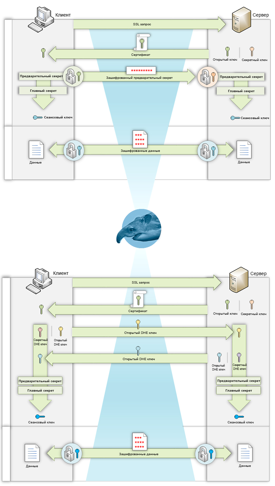
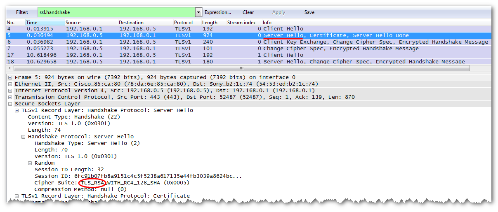
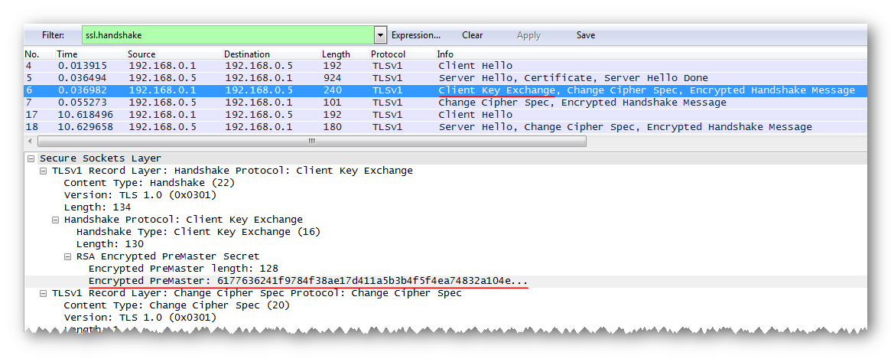
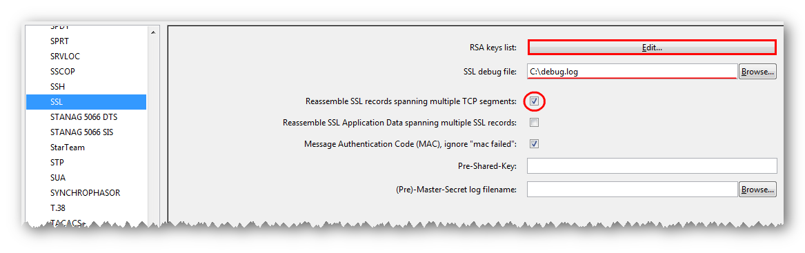
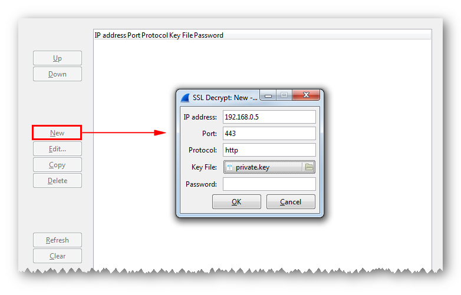
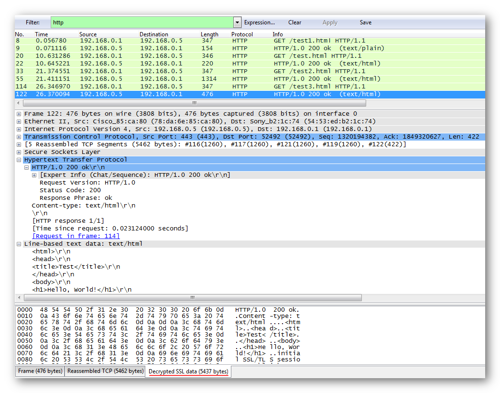
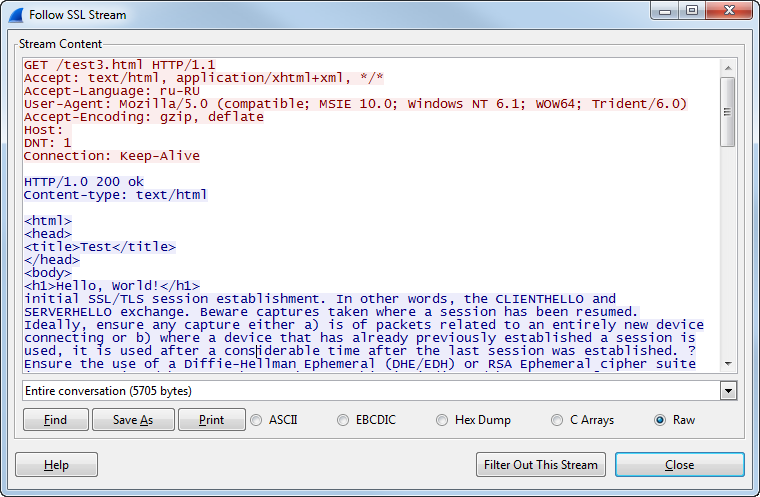
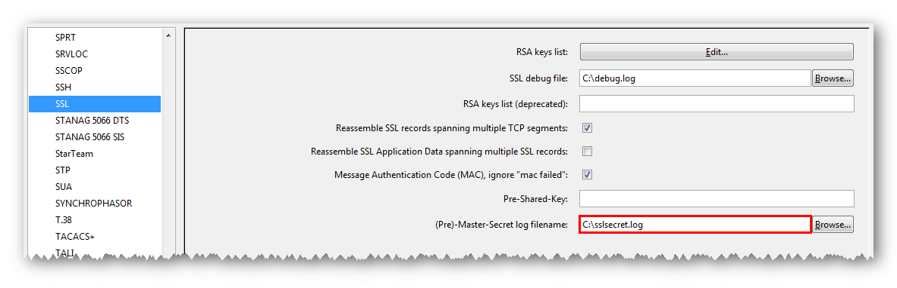

Анализ SSL/TLS трафика в Wireshark / Блог компании Nexign (ранее «Петер-Сервис»)

Как скрыть от посторонних конфиденциальную информацию?  
Самое простое – зашифровать.  
В Интернет и Интранет-сетях шифрацией данных управляет протокол SSL/TLS.  
Солдат спит, служба идет.  
Однако иногда возникает необходимость выполнить обратное – расшифровать перехваченный трафик.  
Это может потребоваться как для отладки работы приложений, так и для проверки подозрительной сетевой активности.  
Или в целях изучения работы SSL/TLS (очевидные, вредоносные цели не обсуждаются).

**Как и при каких условиях можно расшифровать дамп SSL/TLS трафика в Wireshark?  
Попробуем разобраться.  
**  

Разобраться с расшифровкой будет гораздо проще, если есть общие представления о принципах работы протокола SSL/TLS. Рассмотрим упрощённый вариант функционирования SSL/TLS, выделив в нем только самые важные для нас моменты.

Обычно началу обмена шифрованными данными, в SSL/TLS предшествует процесс установки соединения, [рукопожатие](https://ru.wikipedia.org/wiki/SSL#.D0.9F.D1.80.D0.BE.D1.82.D0.BE.D0.BA.D0.BE.D0.BB_.D1.80.D1.83.D0.BA.D0.BE.D0.BF.D0.BE.D0.B6.D0.B0.D1.82.D0.B8.D1.8F) (SSL handshake).

> на хабре есть статья, подробно описывающая процесс установки SSL/TLS соединения ([Первые несколько миллисекунд HTTPS соединения](http://habrahabr.ru/post/191954/)) [thevar1able](http://habrahabr.ru/users/thevar1able/)  

На этом этапе помимо аутентификации и других действий две стороны (приложения) согласуют общий сеансовый ключ ([симметричный](https://ru.wikipedia.org/wiki/%D0%A1%D0%B8%D0%BC%D0%BC%D0%B5%D1%82%D1%80%D0%B8%D1%87%D0%BD%D1%8B%D0%B5_%D0%BA%D1%80%D0%B8%D0%BF%D1%82%D0%BE%D1%81%D0%B8%D1%81%D1%82%D0%B5%D0%BC%D1%8B)). После согласования ключ используется приложениями для шифрации и расшифровки передаваемых между ними данных.

Однако как стороны согласуют одинаковый сеансовый ключ, общаясь по незащищенным каналам связи?  
Для этого существуют [различные алгоритмы](https://en.wikipedia.org/wiki/Transport_Layer_Security#Key_exchange_or_key_agreement). Наиболее часто используемые в Интернет – это [RSA](https://ru.wikipedia.org/wiki/RSA) (самый популярный) и эфемерный [Диффи-Хеллмана](https://ru.wikipedia.org/wiki/%D0%9F%D1%80%D0%BE%D1%82%D0%BE%D0%BA%D0%BE%D0%BB_%D0%94%D0%B8%D1%84%D1%84%D0%B8_%E2%80%94_%D0%A5%D0%B5%D0%BB%D0%BB%D0%BC%D0%B0%D0%BD%D0%B0) (DHE/ECDHE).

> В момент установки SSL/TLS соединения алгоритм согласования сеансовых ключей выбирает сервер.  
> Выбор происходит из списка алгоритмов, поддерживаемых клиентом, которые он передает на сервер.

Ниже на диаграмме показан процесс согласования сеансовых ключей в случаях RSA и DHE/ECDHE, а также информация, которую видит сниффер (Wireshark) в перехваченном SSL/TLS трафике.

В первом случае (согласование ключей RSA) в момент установки соединения клиент генерирует случайное число, предварительный секрет (pre-master secret). Шифрует его открытым ключом, полученным в сертификате от сервера.  
Отправляет в зашифрованном виде на сервер. Сервер расшифровывает предварительный секрет своим секретным ключом. Далее обе стороны, обладая одинаковым предварительным секретом, конвертируют его в главный и уже из него создают общий сеансовый ключ.

> В [ассиметричных алгоритмах](https://ru.wikipedia.org/wiki/%D0%9A%D1%80%D0%B8%D0%BF%D1%82%D0%BE%D1%81%D0%B8%D1%81%D1%82%D0%B5%D0%BC%D0%B0_%D1%81_%D0%BE%D1%82%D0%BA%D1%80%D1%8B%D1%82%D1%8B%D0%BC_%D0%BA%D0%BB%D1%8E%D1%87%D0%BE%D0%BC) шифрования (RSA) данные, зашифрованные открытым ключом, могут быть расшифрованы только секретным. При этом, открытый и секретный ключи должны быть связаны между собой определенным математическим образом, являются ключевой парой.

Во втором случае (согласование ключей DHE/ECDHE) все работает немного по-другому.  
В момент установки нового соединения клиент и сервер генерируют пару случайных эфемерных (временных) ключей Диффи-Хеллмана.  
Пара состоит из открытого и секретного ключей. Стороны обмениваются открытыми ключами.  
Далее клиент и сервер, используя свой закрытый и полученный открытый ключи, создают предварительный секрет, главный секрет и общий сеансовый ключ.

> В данном алгоритме постоянный секретный ключ сервера (RSA/DSA/ECDSA) в шифрации не участвует и используется только для подписи открытых DH-ключей. Описание очень общее, есть подробная информация в статье на хабре ([Как HTTPS обеспечивает безопасность соединения: что должен знать каждый Web-разработчик](http://habrahabr.ru/post/188042/)) [zavg](http://habrahabr.ru/users/zavg/).

Теперь возможно стало немного понятней.

Если клиент и сервер при согласовании сеансовых ключей используют алгоритм RSA, то перехваченный между ними трафик всегда можно расшифровать, имея секретный ключ сервера.  
Дело в том, что в момент установки SSL/TLS-соединения клиент пересылает серверу зашифрованное значение предварительного секрета.  
Предварительный секрет дешифруется секретным ключом сервера, далее вычисляется сеансовый ключ.  
Данные расшифровываются полученным сеансовым ключом.

В случае использования алгоритма DHE/ECDHE и обладая секретным ключом сервера, расшифровать данные SSL/TLS трафика уже не получится.  
В момент установки соединения передаются только открытые значения DH-ключей.  
Секретные DH-ключи, необходимые для вычисления сеансовых, находятся в оперативной памяти клиента и сервера и после завершения соединения уничтожаются.

> Эфемерные алгоритмы согласования ключей Диффи-Хеллмана (DHE/ECDHE) поддерживают [Perfect Forward Secrecy](https://ru.wikipedia.org/wiki/Perfect_forward_secrecy) (PFS).

Есть конечно другой, альтернативный вариант.  
Подходит для расшифровки SSL/TLS-трафика без секретного ключа сервера, а также если используются алгоритмы DHE/ECDHE, RSA и другие.  
В момент установки SSL/TLS-соединения в оперативной памяти клиента и сервера присутствуют открытые значения секретов, предварительного и главного.  
Если успеть вытащить секреты из памяти и сохранить на диск, то в дальнейшем их также можно использовать для расшифровки данных.  
Конечно, это не всегда просто сделать и не позволяет расшифровать трафик, перехваченный когда-либо ранее.

А теперь посмотрим, как на практике, обладая секретным ключом сервера или значениями секретов сессий, можно расшифровать SSL/TLS-трафик в Wireshark.

Собственно, тут все относительно просто.  
Загружаем в Wireshark дамп SSL/TLS-трафика обмена клиента с сервером, подключаем секретный ключ сервера и расшифровываем.

Конечно, предварительно стоит проверить, что клиент и сервер для согласования сеансовых ключей использовали алгоритм RSA.  
Для этого находим инициализацию SSL/TLS-соединения (фильтр «ssl.handshake»).  
Проверяем, что сервер в сообщении Server Hello в [Cipher Suite](http://en.wikipedia.org/wiki/Cipher_suite) указывает алгоритм RSA.

В ответном сообщении клиента (Client Key Exchange) присутствует зашифрованное значение предварительного секрета сессии (Encrypted PreMaster).

Выполняем настройки Wireshark.  
В меню Edit --> Preferences слева раскрываем ветку со списком протоколов (Protocols) и выбираем SSL.  
Проверяем установку флага «Reassemble SSL records spanning multiple TCP segments».  
В поле «SSL debug file» указываем путь к логу с отладочной информацией (фиксируются результаты дешифрации, может пригодиться при разборе возникших проблем).  
В поле «RSA keys list» жмем кнопку Edit.

В появившемся окне жмем кнопку New и заполняем поля:

• **IP Address** – IP-адрес SSL-сервера в IPv4 или IPv6-формате  
• **Port** – номер порта SSL-сервера (для https обычно 443)  
• **Protocol** – название протокола, использующего шифрацию SSL (например, http). Если не известен, указываем data  
• **Key File** – путь к файлу секретного ключа сервера (файл формата [PEM](https://support.quovadisglobal.com/KB/a37/what-is-pem-format.aspx) или [PKCS#12](https://ru.wikipedia.org/wiki/PKCS12))  
• **Password** – заполняется, только если секретный ключ PKCS#12 и защищен паролем

Подтверждаем выполненные настройки и наслаждаемся просмотром расшифрованного трафика.

Для удобства через фильтр выводим только трафик прикладного уровня, например, http.  
Также открытая информация доступна на закладке «Decrypted SSL Data», в нижней части окна.

Или выбираем любой пакет из SSL/TLS-сессии, нажимаем правую клавишу мыши, затем в списке – «Follow SSL Stream».  
Получаем поток расшифрованных данных из выбранного соединения.

Кроме секретного ключа сервера, для расшифровки данных в Wireshark могут использоваться известные значения секретов сессий.  
Хорошая возможность для тех, у кого нет секретного ключа сервера или если сервер выбирает алгоритм согласования сеансовых ключей с поддержкой PFS (DHE/ECDHE).

Где и как можно достать секреты сессий?

1.  Wireshark поддерживает экспорт предварительных секретов из загруженного дампа SSL/TLS-трафика.  
    
    > Wireshark, меню Files -> Export SSL Session Keys
    
      
    Конечно, перед этим трафик должен быть расшифрован секретным ключом сервера.
    
    Очень важная функциональность.  
    Дело в том, что Wireshark не умеет сохранять трафик в расшифрованном виде.  
    Иногда есть необходимость передать расшифрованный трафик кому-то еще, не компрометируя секретный ключ сервера.  
    Для решения этой проблемы можно, как обычно, расшифровать трафик секретным ключом сервера и экспортировать из него все секреты SSL/TLS -сессий в отдельный файл.  
    После этого становится возможным повторно расшифровать трафик, используя только файл с секретами.
    
2.  В некоторых приложениях существует встроенная функциональность, позволяющая сохранять секреты на диск.  
    
    > Яркий пример таких приложений – это браузеры Chrome и FireFox.  
    > Оба в своей работе используют криптографический модуль [NSS](http://en.wikipedia.org/wiki/Network_Security_Services), разрешающий логирование секретов в файл.  
    > [Формат лога](https://developer.mozilla.org/en-US/docs/Mozilla/Projects/NSS/Key_Log_Format) приведён ниже и соответствует первым двум вариантам.  
    > Более подробное описание функциональности есть в статье на хабре ([Как легко расшифровать TLS-трафик от браузера в Wireshark](http://habrahabr.ru/post/253521/)) [ValdikSS](http://habrahabr.ru/users/valdikss/).
    > 
    > В Java-программах секреты могут быть получены из SSL дебаг лога ([Дешифрация TLS трафика Java приложений с помощью логов](http://habrahabr.ru/post/254205/)) [Toparvion](http://habrahabr.ru/users/toparvion/).  
    > Или сразу в формате Wireshark через jSSLKeyLog ([Java Agent Library to log SSL session keys to a file for Wireshark](http://jsslkeylog.sourceforge.net/))
    
      
    
3.  Другие варианты.  
    
    > Используя сторонние утилиты, перехватывать секреты сессий в оперативной памяти клиента или сервера.
    
      
    

А теперь – о том, как и в каком виде секреты загружаются в Wireshark.  
Значения секретов сессий указываются построчно в обычном текстовом файле в определенном формате.

Существует три возможных формата строк:

1.  Для SSL/TLS-сессий с алгоритмом согласования сеансовых ключей RSA
    
    **RSA &lt;hex encrypted pre-master secret&gt; &lt;hex pre-master secret&gt;**
    
    > &lt;hex encrypted pre-master secret&gt; — зашифрованное значение предварительного секрета сессии (поле Encrypted Premaster в сообщение ClientKeyExchange)  
    > &lt;hex pre-master secret&gt; — расшифрованное значение предварительного секрета
    
      
    
2.  Для SSL/TLS-сессий с алгоритмом согласования сеансовых ключей DHE/ECDHE
    
    **CLIENT\_RANDOM &lt;hex client\_random&gt; &lt;hex master secret&gt;**
    
    > &lt;hex client_random&gt; — случайное число клиента (Random в сообщение Client Hello)  
    > &lt;hex master secret&gt; — значение главного секрета сессии
    
      
    
3.  Поддержка вывода Master-Key в «openssl s_client»
    
    **RSA Session-ID:&lt;hex session id&gt; Master-Key:&lt;hex master secret&gt;**
    
    > &lt;hex session id&gt; — идентификатор сессии (поле Session ID из Server Hello или Session Ticket из Client Hello)  
    > &lt;hex master secret&gt; — значение главного секрета сессии
    
      
    

И теперь подключаем файл с секретами в Wireshark и дешифруем SSL/TLS-трафик.

Настройки Wireshark аналогичны указанным в предыдущем разделе.  
За исключением того, что в настройках протокола SSL в «RSA keys list» не нужно ничего указывать (параметры SSL-сервера и его секретный ключ). Только в поле "(Pre)-Master-Secret log filename" путь к файлу с секретами.

Подтверждаем настройки и смотрим расшифрованный трафик.

Надеюсь, представленная информация окажется интересной всем,  
кто планирует или уже занимается анализом SSL/TLS-трафика в Wireshark.

**Все ссылки по теме:**  
[Wireshark — приручение акулы](http://habrahabr.ru/company/pentestit/blog/204274/) [PENTESTIT](http://habrahabr.ru/users/pentestit/)  
[Что такое TLS](http://habrahabr.ru/post/258285/) [babayota_kun](http://habrahabr.ru/users/babayota_kun/)  
[Первые несколько миллисекунд HTTPS соединения](http://habrahabr.ru/post/191954/) [thevar1able](http://habrahabr.ru/users/thevar1able/)  
[Как HTTPS обеспечивает безопасность соединения: что должен знать каждый Web-разработчик](http://habrahabr.ru/post/188042/) [zavg](http://habrahabr.ru/users/zavg/)  
[Как легко расшифровать TLS-трафик от браузера в Wireshark](http://habrahabr.ru/post/253521/) [ValdikSS](http://habrahabr.ru/users/valdikss/)  
[Дешифрация TLS трафика Java приложений с помощью логов](http://habrahabr.ru/post/254205/) [Toparvion](http://habrahabr.ru/users/toparvion/)  
[jSSLKeyLog — Java Agent Library to log SSL session keys to a file for Wireshark](http://jsslkeylog.sourceforge.net/)  
[Криптосистема с открытым ключом](https://ru.wikipedia.org/wiki/%D0%9A%D1%80%D0%B8%D0%BF%D1%82%D0%BE%D1%81%D0%B8%D1%81%D1%82%D0%B5%D0%BC%D0%B0_%D1%81_%D0%BE%D1%82%D0%BA%D1%80%D1%8B%D1%82%D1%8B%D0%BC_%D0%BA%D0%BB%D1%8E%D1%87%D0%BE%D0%BC)  
[RSA](https://ru.wikipedia.org/wiki/RSA)  
[Протокол Диффи — Хеллмана](https://ru.wikipedia.org/wiki/%D0%9F%D1%80%D0%BE%D1%82%D0%BE%D0%BA%D0%BE%D0%BB_%D0%94%D0%B8%D1%84%D1%84%D0%B8_%E2%80%94_%D0%A5%D0%B5%D0%BB%D0%BB%D0%BC%D0%B0%D0%BD%D0%B0)  
[Perfect forward secrecy](https://ru.wikipedia.org/wiki/Perfect_forward_secrecy)