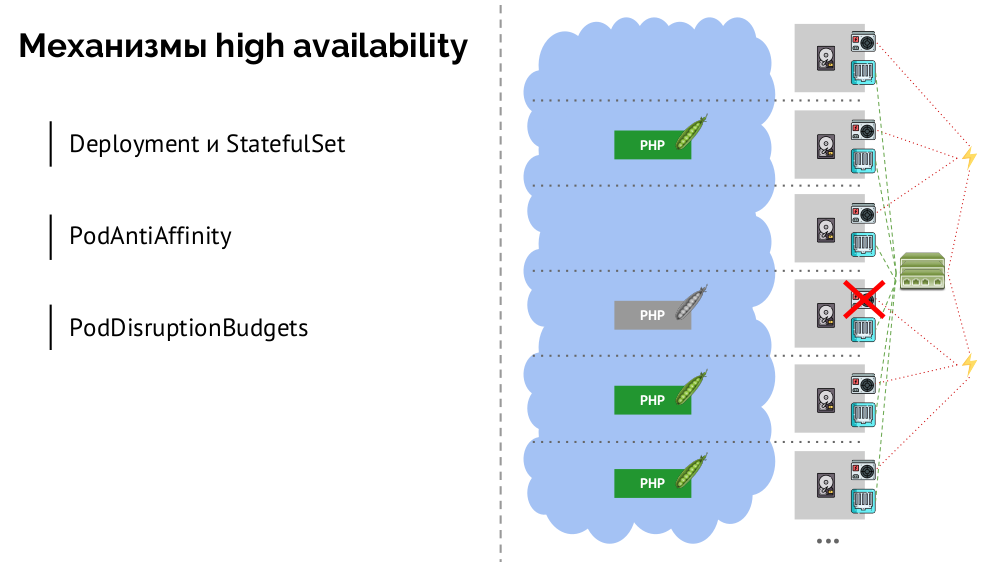
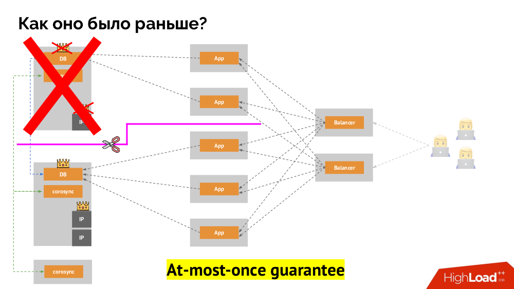
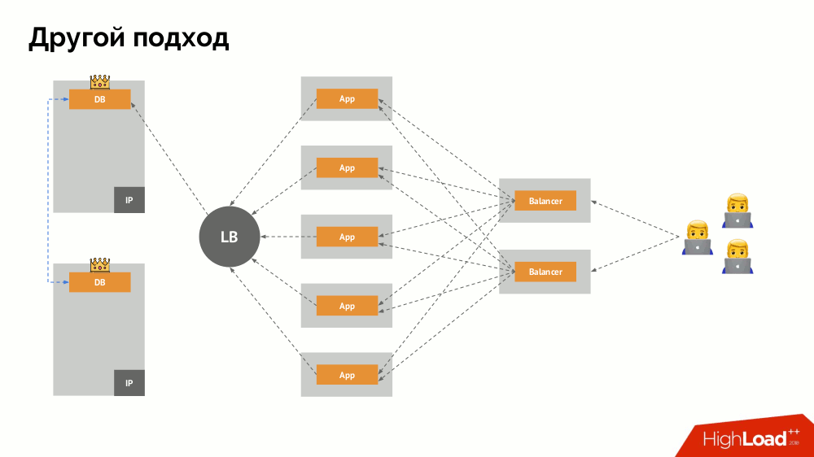
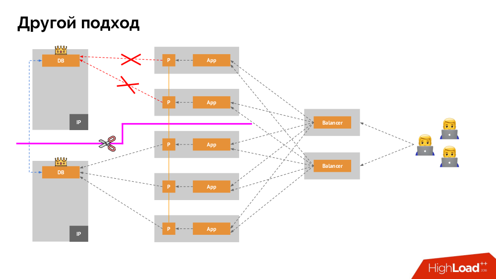
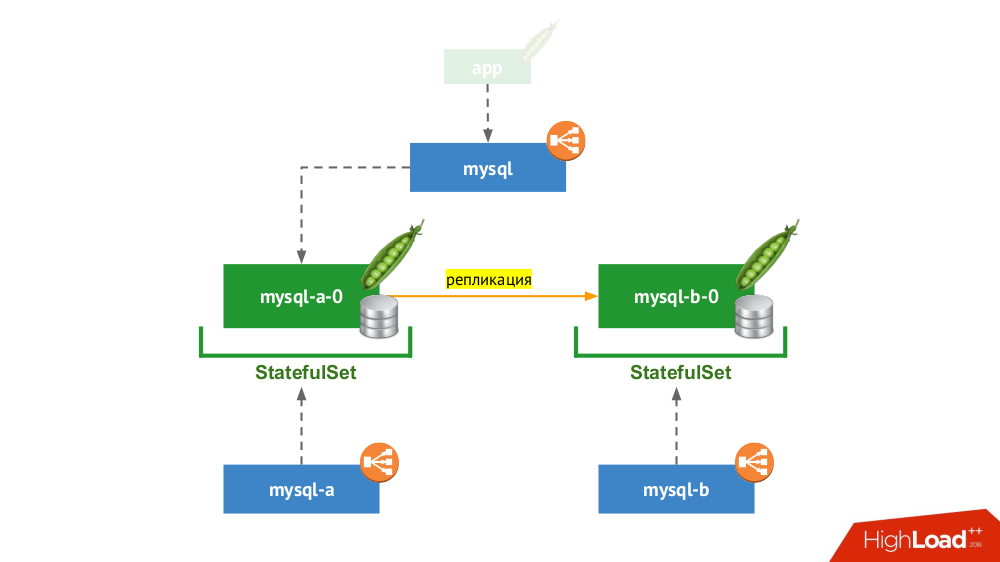
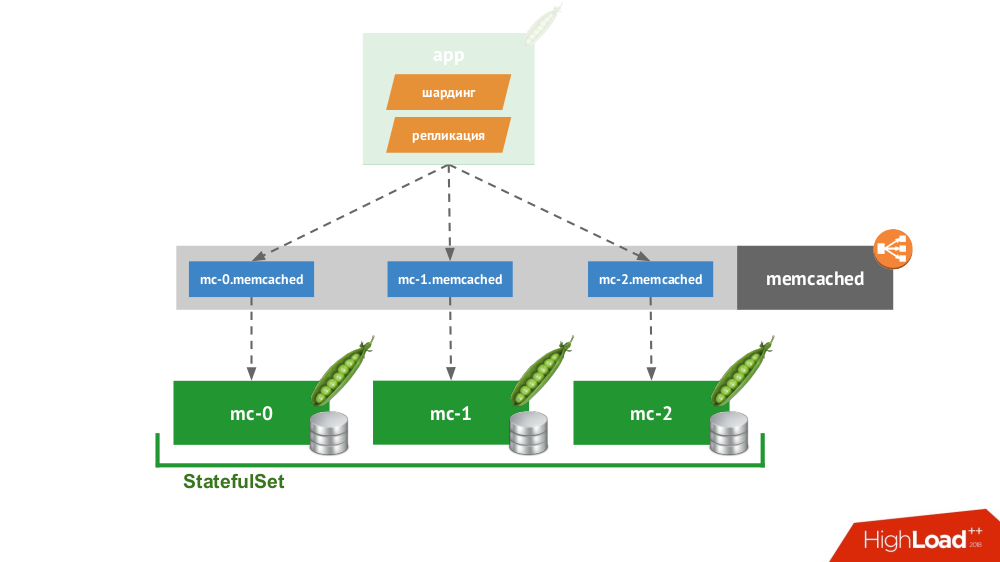
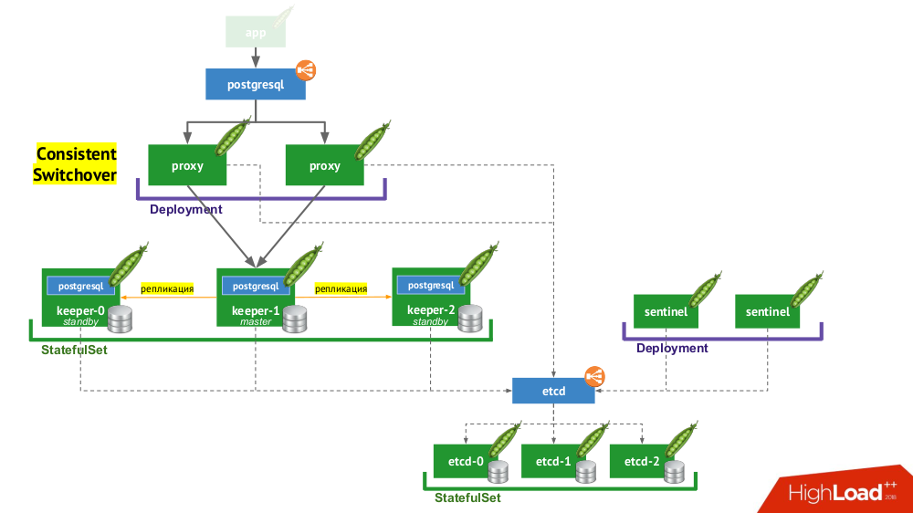

Базы данных и Kubernetes (обзор и видео доклада) / Блог компании Флант

8 ноября в главном зале конференции [HighLoad++ 2018](http://www.highload.ru/moscow/2018), в рамках секции «DevOps и эксплуатация», прозвучал доклад «Базы данных и Kubernetes». В нём рассказывается о высокой доступности баз данных и подходах к отказоустойчивости до Kubernetes и вместе с ним, а также практических вариантах размещения СУБД в кластерах Kubernetes и существующие для этого решения (включая Stolon для PostgreSQL).

По традиции рады представить [**видео с докладом**](https://www.youtube.com/watch?v=BnegHj53pW4) (около часа, **гораздо** информативнее статьи) и основную выжимку в текстовом виде. Поехали!

## Теория

Этот доклад появился как ответ на один из самых популярных вопросов, что все последние годы нам неустанно задают в разных местах: комментариях на хабре или YouTube, социальных сетях и т.п. Звучит он просто: «Можно ли запустить базу в Kubernetes?», — и если мы обычно отвечали на него «в целом да, но…», то пояснений к этим «в целом» и «но» явно не хватало, а уместить их в короткое сообщение никак не удавалось.

Однако для начала обобщу вопрос от «базы \[данных\]» до stateful в целом. СУБД — это лишь частный случай stateful-решений, более полный список которых можно представить так:

Перед тем, как смотреть конкретные случаи, расскажу о трёх важных особенностях работы/использования Kubernetes.

### 1\. Философия высокой доступности в Kubernetes

Все знают аналогию «питомцы против стада» ([pets vs cattle](https://www.theregister.co.uk/2013/03/18/servers_pets_or_cattle_cern/)) и понимают, что если Kubernetes — история из мира стада, то классические СУБД — это именно питомцы.

И как выглядела архитектура «питомцев» в «традиционном» варианте? Классический пример инсталляции MySQL — репликация на двух железных серверах с резервированным питанием, диском, сетью… и всем остальным (включая инженера и различные вспомогательные средства), что поможет нам быть уверенными, что процесс MySQL не упадёт, а если случится проблема с любым из критичных для него компонентов, отказоустойчивость будет соблюдена:

Как то же самое будет выглядеть в Kubernetes? Здесь обычно гораздо больше железных серверов, они проще и у них нет резервированного питания и сети (в том смысле, что выпадание одной машины ни на что не влияет) — всё это объединено в кластер. Его отказоустойчивость обеспечивается софтом: если что-то происходит с узлом, Kubernetes это обнаруживает и запускает нужные экземпляры на другом узле.

Какие есть механизмы для высокой доступности в K8s?

1.  Контроллеры. Их много, но основных два: `Deployment` (для stateless-приложений) и `StatefulSet` (для stateful-приложений). В них хранится вся логика действий, предпринимаемых в случае падения узла (недоступности pod'а).
2.  `PodAntiAffinity` — возможность указывать определённым pod'ам, чтобы они не находились на одном и том же узле.
3.  `PodDisruptionBudgets` — лимит на количество экземпляров pod'ов, которые можно одновременно выключить в случае плановых работ.

  

### 2\. Гарантии согласованности в Kubernetes

Как работает привычная схема отказоустойчивости с одним мастером? Два сервера (master и standby), к одному из которых постоянно обращается приложение, которым в свою очередь пользуются через балансировщик нагрузки. Что происходит в случае сетевой проблемы?

Классический [_split-brain_](https://en.wikipedia.org/wiki/Split-brain_(computing)): приложение начинает обращаться к обоим экземплярам СУБД, каждый из которых считает себя главным. Чтобы избежать этого, keepalived заменялся на corosync уже с тремя его экземплярами для достижения кворума при голосовании за мастера. Однако даже в таком случае есть проблемы: если отвалившийся экземпляр СУБД всячески пытается «самоубиться» (убрать IP-адрес, перевести БД в read-only…), то другая часть кластера не знает, что произошло с мастером — ведь может случиться и так, что тот узел в действительности всё ещё работает и к нему попадают запросы, а значит, что переключать мастера мы ещё не можем.

Чтобы решить такую ситуацию, существует механизм изоляции узла с целью защиты всего кластера от некорректной работы, — этот процесс называют [_fencing_](https://en.wikipedia.org/wiki/Fencing_(computing)). Практическая суть сводится к тому, что мы пытаемся какими-либо внешними способами «убить» отвалившуюся машину. Подходы могут быть разные: от выключения машины по IPMI и блокирования порта на свитче до обращения к API облачного провайдера и т.п. И только после этой операции можно переключать мастера. Так достигается гарантия [_at-most-once_](https://doc.akka.io/docs/akka/current/general/message-delivery-reliability.html?language=scala#discussion-what-does-at-most-once-mean-), которая обеспечивает нам согласованность _([consistency](https://en.wikipedia.org/wiki/Consistency_(database_systems)))_.

Как добиться такого же в Kubernetes? Для этого есть уже упомянутые контроллеры, поведение которых в случае недоступности узла различается:

1.  `Deployment`: «Мне сказали, что должно быть 3 pod'а, а теперь их всего 2 — я создам новый»;
2.  `StatefulSet`: «Pod'а не стало? Подожду: либо этот узел вернётся, либо нам скажут его убить», — т.е. контейнеры сами (без действий оператора) не пересоздаются. Именно так достигается та же самая гарантия at-most-once.

Однако и здесь, в последнем случае, требуется fencing: нужен механизм, который подтвердит, что этого узла точно больше нет. Сделать его автоматическим, во-первых, очень сложно (требуется множество реализаций), а во-вторых, что ещё хуже, он обычно убивает узлы медленно (обращение к IPMI может занять секунды или десятки секунд, а то и минуты). Мало кого устроит ожидание в минуту для переключения базы на нового мастера. Но есть другой подход, не требующий механизма fencing'а…

Начну его описание вне Kubernetes. В нём используется особый балансировщик нагрузки _(load balancer)_, через который бэкенды обращаются к СУБД. Его специфика заключается в том, что он обладает свойством согласованности, т.е. защитой от сетевых сбоев и split-brain, поскольку позволяет убрать все подключения к текущему мастеру, дождаться синхронизации (реплики) на другом узле и переключиться на него. Я не нашёл устоявшегося термина для этого подхода и назвал его _Consistent Switchover_.

Главный вопрос с ним заключается в том, как сделать его универсальным, обеспечив поддержку и облачных провайдеров, и частных инсталляций. Для этого к приложениям добавляются прокси-серверы. Каждый из них будет принимать запросы от своего приложения (и пересылать их в СУБД), а из всех вместе будет собран кворум. Как только происходит отказ какой-то части кластера, те прокси, что потеряли кворум, сразу убирают свои подключения к СУБД.

### 3\. Хранение данных и Kubernetes

Основной механизм — это сетевой диск _Network Block Device_ (он же SAN) в разных реализациях для нужных вариантов облака или bare metal. Однако поместить нагруженную базу данных (например, MySQL, от которой требуется 50 тысяч IOPS) в облако (AWS EBS) из-за имеющейся задержки _(latency)_ не получится.

В Kubernetes для таких случаев есть возможность подключения локального жёсткого диска — _Local Storage_. Если происходит сбой (диск перестаёт быть доступным в pod'е), то мы вынуждены чинить эту машину — по аналогии с классической схемой в случае отказа одного надёжного сервера.

Оба варианта (_Network Block Device_ и _Local Storage_) относятся к категории _ReadWriteOnce_: хранилище невозможно примонтировать в два места (pod'а) — для такого масштабирования потребуется создать новый диск и подключить его к новому pod'у (для этого есть встроенный механизм K8s), а затем наполнить нужными данными (делается уже нашими силами).

Если нам нужен режим _ReadWriteMany_, то доступны реализации _Network File System_ (или NAS): для публичного облака это `AzureFile` и `AWSElasticFileSystem`, а для своих инсталляций — CephFS и Glusterfs для любителей распределённых систем, а также NFS.

## Практика

  

### 1\. Standalone

Этот вариант про случай, когда ничто не мешает запустить СУБД в режиме отдельного сервера с локальным хранилищем. Тут не идёт речь о высокой доступности… хотя и она может быть в некоторой мере (т.е. достаточно для данного применения) реализована на уровне железа. Есть множество случаев для такого применения. В первую очередь это всевозможные staging- и dev-окружения, но не только: сюда же попадают и вторичные сервисы, отключение которых на 15 минут не является критичным. В Kubernetes это реализуется `StatefulSet`'ом с одним pod'ом:

В целом это жизнеспособный вариант, у которого, с моей точки зрения, нет минусов по сравнению с установкой СУБД на отдельной виртуалке.

### 2\. Реплицированная пара с ручным переключением

Снова используется `StatefulSet`, но общая схема выглядит уже следующим образом:

Если произошёл сбой у одного из узлов (`mysql-a-0`), чуда не происходит, но у нас есть реплика (`mysql-b-0`), на которую мы можем переключить трафик. При этом — ещё до переключения трафика — важно не забыть не только убрать запросы к СУБД от сервиса `mysql`, но и зайти на СУБД вручную и убедиться, что все соединения завершены (убить их), а также зайти на второй узел с СУБД и перенастроить реплику в обратную сторону.

Если вы сейчас используете классический вариант с двумя серверами (master + standby) без автоматического переключения _(failover)_, то это решение — эквивалент в Kubernetes. Подходит для MySQL, PostgreSQL, Redis и других продуктов.

### 3\. Масштабирование нагрузки на чтение

По сути этот случай не является stateful, потому речь идёт только про чтение. Здесь основной сервер СУБД находится вне рассматриваемой схемы, а в рамках Kubernetes создаётся «ферма из slave-серверов», доступных только на чтение. Общий механизм — использование init-контейнеров для наполнения данными СУБД на каждом новом pod'е этой фермы (с помощью горячего дампа или обычного с дополнительными действиями и т.п. — зависит от используемой СУБД). Чтобы быть уверенным, что каждый экземпляр не отстаёт слишком сильно от мастера, можно использовать liveness-пробы.

### 4\. Умный клиент

Если сделать `StatefulSet` из трёх memcached, в Kubernetes доступен специальный сервис, который будет не балансировать запросы, а создаст каждому pod'у по своему домену. С ними сможет работать клиент в том случае, если он сам умеет шардинг и репликацию.

За примером далеко ходить не надо: так «из коробки» работает хранение сессий в PHP. На каждый запрос сессии делаются запросы одновременно на все серверы, после чего из них отбирается самый актуальный ответ (аналогично и на запись).

### 5\. Cloud Native-решения

Есть множество решений, изначально ориентированных на выход из строя узлов, т.е. они сами умеют делать отказоустойчивость _(failover)_ и восстановление узлов _(recovery)_, предоставляют гарантии согласованности _(consistency)_. Это не полный их список, а лишь часть популярных примеров:

Все они попросту ставятся в `StatefulSet`, после чего узлы находят друг друга и образуют кластер. Сами же продукты отличаются тем, как в них реализованы три вещи:

1.  Как узлы узнают друг о друге? Для этого есть такие способы, как Kubernetes API, DNS-записи, статическая конфигурация, специализированные узлы (seed), сторонний service discovery…
2.  Как подключается клиент? Через балансировщик нагрузки, распределяющий по хостам, или же клиенту нужно знать обо всех хостах, а он сам решит, как действовать дальше.
3.  Как делается горизонтальное масштабирование? Никак, полноценно или сложно/с ограничениями.

Вне зависимости от выбранных путей решения этих вопросов, все такие продукты хорошо работают с Kubernetes, потому что изначально были созданы как «стадо» _(cattle)_.

### 6\. Stolon PostgreSQL

[Stolon](https://github.com/sorintlab/stolon) фактически позволяет превратить СУБД PostgreSQL, созданную как _pet_, в _cattle_. За счёт чего это достигается?

*   Во-первых, нужен service discovery, в роли которого может быть **etcd** (доступны и другие варианты) — кластер из них помещается в `StatefulSet`.
*   Другая часть инфраструктуры — `StatefulSet` с экземплярами PostgreSQL. Кроме собственно СУБД рядом с каждой инсталляцией также помещается компонент под названием **keeper**, который осуществляет настройку СУБД.
*   Другой компонент — **sentinel** — разворачивается как `Deployment` и следит за конфигурацией кластера. Именно он решает, кто будет master и standby, записывает эту информацию в etcd. А keeper читает данные из etcd и выполняет соответствующие актуальному статусу действия с экземпляром PostgreSQL.
*   Ещё один компонент, разворачиваемый в `Deployment` и стоящий перед экземплярами PostgreSQL, — **proxy** — является реализацией уже упомянутого паттерна _Consistent Switchover_. Эти компоненты подключаются к etcd, а если эта связь теряется, то proxy сразу убивает исходящие соединения, потому что с этого момента он не знает роль своего сервера (сейчас это master или standby?).
*   Наконец, перед экземплярами proxy стоит обычный `LoadBalancer` из Kubernetes.

  

## Выводы

Так можно ли базу в Kubernetes? Да, конечно, можно, в некоторых случаях… И если это целесообразно, то делается вот так (см. схему работы Stolon)…

Все знают, что технологии развиваются волнами. Изначально любое новое устройство бывает очень сложным в использовании, но со временем всё меняется: технология становится доступной. К чему идём? Да, оно останется вот таким внутри, но как оно будет работать, мы уже не будем знать. В Kubernetes активно развиваются [операторы](https://habr.com/company/flant/blog/326414/). Пока их не так много и они не так хороши, но есть движение в этом направлении.

## Видео и слайды

Видео с выступления (около часа):

Презентация доклада:

P.S. Мы также нашли в сети очень(!) краткую [текстовую выжимку](https://github.com/NickVolynkin/highload-2018/blob/master/1.4-bd-k8s.md) с этого доклада — спасибо за неё Николаю Волынкину.

## P.P.S.

Другие доклады в нашем блоге:

*   «[Мониторинг и Kubernetes](https://habr.com/company/flant/blog/412901/)»; _(Дмитрий Столяров; 28 мая 2018 на RootConf)_;
*   «[Лучшие практики CI/CD с Kubernetes и GitLab](https://habr.com/company/flant/blog/345116/)»; _(Дмитрий Столяров; 7 ноября 2017 на HighLoad++)_;
*   «[Наш опыт с Kubernetes в небольших проектах](https://habr.com/company/flant/blog/331188/)»; _(Дмитрий Столяров; 6 июня 2017 на RootConf)_;
*   «[Собираем Docker-образы для CI/CD быстро и удобно вместе с dapp](https://habr.com/company/flant/blog/324274/)» _(Дмитрий Столяров; 8 ноября 2016 на HighLoad++)_;
*   «[Практики Continuous Delivery с Docker](https://habr.com/company/flant/blog/322686/)» _(Дмитрий Столяров; 31 мая 2016 на RootConf)_.

Возможно, вас также заинтересуют следующие публикации:

*   «[Kubernetes tips & tricks: ускоряем bootstrap больших баз данных](https://habr.com/company/flant/blog/417509/)»;
*   «[Оркестровка СУБД CockroachDB в Kubernetes](https://habr.com/company/flant/blog/328756/)».