Курс MIT «Безопасность компьютерных систем». Лекция 10: «Символьное выполнение», часть 1 / Блог компании ua-hosting.company

### Массачусетский Технологический институт. Курс лекций #6.858. «Безопасность компьютерных систем». Николай Зельдович, Джеймс Микенс. 2014 год

Computer Systems Security — это курс о разработке и внедрении защищенных компьютерных систем. Лекции охватывают модели угроз, атаки, которые ставят под угрозу безопасность, и методы обеспечения безопасности на основе последних научных работ. Темы включают в себя безопасность операционной системы (ОС), возможности, управление потоками информации, языковую безопасность, сетевые протоколы, аппаратную защиту и безопасность в веб-приложениях.

Лекция 1: «Вступление: модели угроз» [Часть 1](https://habr.com/company/ua-hosting/blog/354874/) / [Часть 2](https://habr.com/company/ua-hosting/blog/354894/) / [Часть 3](https://habr.com/company/ua-hosting/blog/354896/)  
Лекция 2: «Контроль хакерских атак» [Часть 1](https://habr.com/company/ua-hosting/blog/414505/) / [Часть 2](https://habr.com/company/ua-hosting/blog/416047/) / [Часть 3](https://habr.com/company/ua-hosting/blog/416727/)  
Лекция 3: «Переполнение буфера: эксплойты и защита» [Часть 1](https://habr.com/company/ua-hosting/blog/416839/) / [Часть 2](https://habr.com/company/ua-hosting/blog/418093/) / [Часть 3](https://habr.com/company/ua-hosting/blog/418099/)  
Лекция 4: «Разделение привилегий» [Часть 1](https://habr.com/company/ua-hosting/blog/418195/) / [Часть 2](https://habr.com/company/ua-hosting/blog/418197/) / [Часть 3](https://habr.com/company/ua-hosting/blog/418211/)  
Лекция 5: «Откуда берутся ошибки систем безопасности» [Часть 1](https://habr.com/company/ua-hosting/blog/418213/) / [Часть 2](https://habr.com/company/ua-hosting/blog/418215/)  
Лекция 6: «Возможности» [Часть 1](https://habr.com/company/ua-hosting/blog/418217/) / [Часть 2](https://habr.com/company/ua-hosting/blog/418219/) / [Часть 3](https://habr.com/company/ua-hosting/blog/418221/)  
Лекция 7: «Песочница Native Client» [Часть 1](https://habr.com/company/ua-hosting/blog/418223/) / [Часть 2](https://habr.com/company/ua-hosting/blog/418225/) / [Часть 3](https://habr.com/company/ua-hosting/blog/418227/)  
Лекция 8: «Модель сетевой безопасности» [Часть 1](https://habr.com/company/ua-hosting/blog/418229/) / [Часть 2](https://habr.com/company/ua-hosting/blog/423155/) / [Часть 3](https://habr.com/company/ua-hosting/blog/423423/)  
Лекция 9: «Безопасность Web-приложений» [Часть 1](https://habr.com/company/ua-hosting/blog/424289/) / [Часть 2](https://habr.com/company/ua-hosting/blog/424295/) / [Часть 3](https://habr.com/company/ua-hosting/blog/424297/)  
Лекция 10: «Символьное выполнение» [Часть 1](https://habr.com/company/ua-hosting/blog/425557/) / [Часть 2](https://habr.com/company/ua-hosting/blog/425561/) / [Часть 3](https://habr.com/company/ua-hosting/blog/425559/)

Доброе утро всем, я Армандо Солар-Лесама и сегодня я прочитаю лекцию о символьном выполнении. Кто из присутствующих здесь знаком с этим термином или слышали об этом раньше? Я просто хочу составить представление о нашей аудитории. Итак, начнём. Я несколько раз ронял свой ноутбук, поэтому он долго загружается.

Символьное выполнение является рабочей лошадкой современного анализа программ. Это один из методов, который вырос из исследований и затем стал использоваться во множестве приложений. Например, на сегодня в Microsoft есть система под названием SAGE, которая работает с большим количеством важного программного обеспечения Microsoft, начиная от Power Point и заканчивая самой Windows, чтобы реально находить проблемы безопасности и уязвимости.

Есть много академических проектов, которые оказали большое влияние на реальный мир, например, на обнаружение важных ошибок в программном обеспечении с открытым исходным кодом, с помощью символьного выполнения. И красота символьного выполнения как техники заключается в том, что по сравнению с тестированием, это дает вам возможность представить, как ваша программа будет себя вести с потенциально бесконечным набором возможных входных данных. Это позволяет исследовать массивы входных данных, которые было бы совершенно нецелесообразно и непрактично исследовать, скажем, случайным тестированием даже при наличии очень большого количества тестеров. С другой стороны, по сравнению с более традиционными методами статического анализа оно имеет следующее преимущество. При исследовании проблемы символьное выполнение может создать входные данные и трассировку, путь выполнения, которые можно запустить в реальной программе и выполнить эту программу на основе этих входных данных. И после этого мы можете выявить реальный баг и приступить к его исправлению, используя традиционные механизмы отладки. И это особенно ценно, когда вы находитесь в промышленной среде разработки, где у вас, вероятно, нет времени, чтобы заботиться о каждой маленькой проблеме в вашем коде.

Например, вы действительно хотите быть в состоянии отличить реальные проблемы от ложных срабатываний. Как же это работает?

Чтобы действительно понять, как это работает, полезно начать с обычного выполнения. Если мы думаем о символьном выполнении как об обобщении традиционного, простого исполнения, имеет смысл знать, как это выглядит. Поэтому я собираюсь использовать эту очень простую программу в качестве иллюстрации для многих вещей, о которых мы сегодня поговорим.

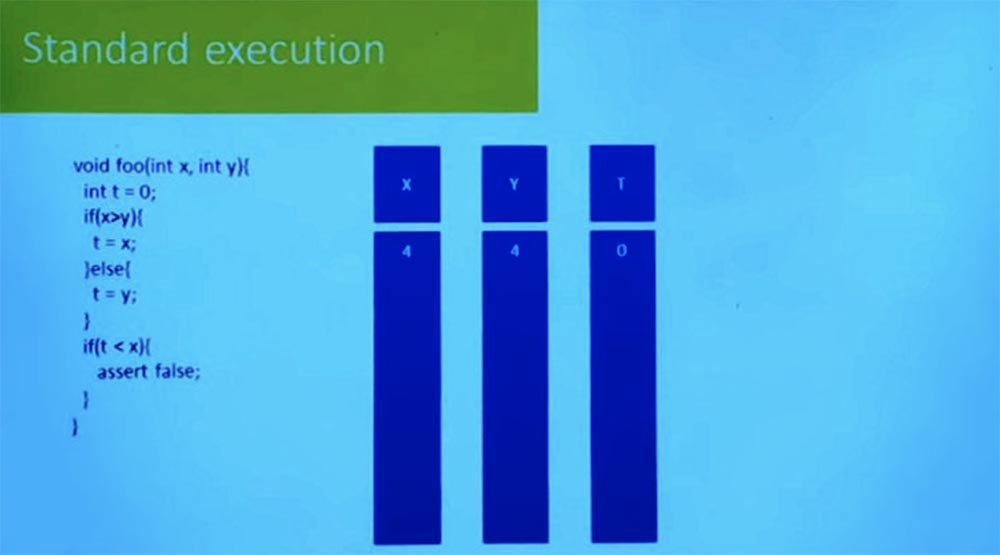

Здесь у нас имеется отрывок очень простого кода из нескольких ветвей и утверждение, что если при некотором условии значение t < х, то это ложное утверждение. Мы хотим узнать, может ли это утверждение когда-либо быть вызвано. Это возможно? Существуют ли какие-то входные данные, которые сделают так, чтобы это утверждение провалилось?

Одна из вещей, которую я могу сделать – это проверить выполнение данной программы на примере конкретных значений входных данных. Предположим, что мы используем входные данные, при которых X= 4 и Y = 4. Величина T равно нулю, как это объявлено в начале программы.

Итак, прежде чем мы перейдем к нормальному исполнению, давайте выясним, в чём здесь заключается важный момент? Нам нужно иметь какое-то представление о состоянии программы, верно? Делаем ли мы нормальное выполнение или делаем ли мы символьное выполнение, нам нужно иметь какой-то способ охарактеризовать состояние программы. В данном случае это такая простая программа, что она не использует кучу, не использует стек и здесь нет никаких вызовов функций.

Таким образом, состояние может быть полностью охарактеризовано этими тремя переменными вместе со знанием того, в каком месте программы я нахожусь. Поэтому, если я начну выполнение с 4, 4 и 0 и доберусь до конца ветви, то проверю выражение: 4 больше 4? Очевидно, что нет.  
Теперь я собираюсь выполнить программу при T = Y, то есть T больше не равно 0, а имеет значение, равное 4. Таково нынешнее состояние моей программы, и теперь я могу оценить эту ветвь.

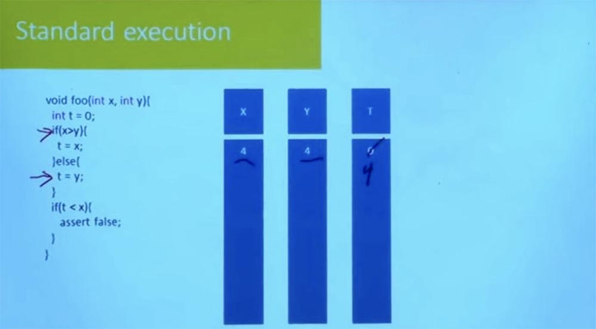

Правильно ли, что T < X? Нет. Мы увернулись от пули, утверждение false не сработало. Не было никаких проблем в этом частном выполнении.

Но это ничего не говорит нам ни о каком другом выполнении. Мы знаем, что при значениях X=4 и Y=4 программа не подведет. Но это ничего не говорит нам о том, что произойдёт, если входными значениями буду 2 и 1.

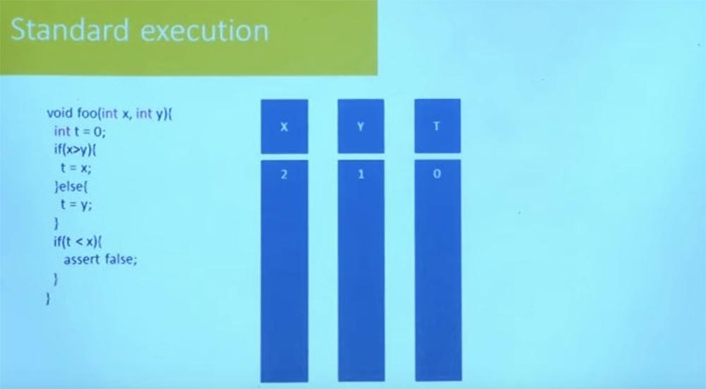

При таких значениях входных данных выполнение пойдёт по другому пути. На этот раз мы видим, что T = X, и после выполнения этой строки T примет значение, равное 2. Есть ли какие-либо проблемы в этом выполнении? Возникнет ли при таких входных данных ошибка утверждения?

Что ж, давайте посмотрим. Так, если T равно 2 и Х равно 2, то T никак не меньше Х. Похоже, мы снова увернулись от пули. Верно? Итак, здесь у нас есть два конкретных входных значения, при которых программа работает без ошибок. Но на самом деле это ничего не говорит нам о любых других значениях input.

Итак, идея символьного выполнения состоит в том, что мы хотим выйти за рамки исполнения программы при одном наборе входных данных. Мы хотим иметь возможность на самом деле рассуждать о поведении программы при использовании очень большого набора данных, в некоторых случаях – бесконечного множества возможных значений input. Основная идея этого заключена в следующем.

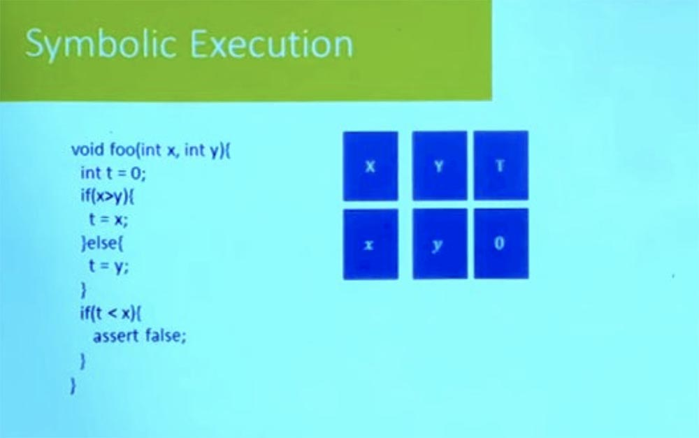

Для такой программы, как эта, её состояние определяется значением этих трех различных переменных: X, Y и T и знанием того, в каком месте программы в данный момент я нахожусь. Но теперь вместо конкретных значений для X и Y у меня будет символьное значение, просто переменная. Переменная, которая позволяет мне дать имя этому значению, которое пользователь использует в качестве input. Это означает, что состояние моей программы больше не характеризуется сопоставлением имен переменных конкретным значениям. Теперь это сопоставление имен переменных этим символьным значениям.

Символьное значение можно рассматривать как формулу. В этом случае формула для Х равна Х и формула для Y равна просто Y, а для T она на самом деле равна значению 0. Мы знаем, что для каждого входного значения не важно, что именно вы делаете. Значение T после первого утверждения будет равно 0.

Вот где теперь становится интересно. Мы добрались до этой ветви, которая говорит, что если X больше Y, мы пойдем в одном направлении. Если X меньше или равно Y, мы пойдем в другом направлении.

Мы знаем что-нибудь об X и Y? Что нам о них известно? По крайней мере, мы знаем их тип, мы знаем, что они будут варьироваться в интервале от min int до max int, но это все, что мы о них знаем. Получается, что информация, которую мы о них знаем, недостаточна для того, чтобы сказать, в каком направлении может идти эта ветка. Она может идти в любом направлении  
Существует много вещей, которые мы можем сделать, но что мы можем сделать в данный момент? Попробуйте высказать самое дикое предположение.

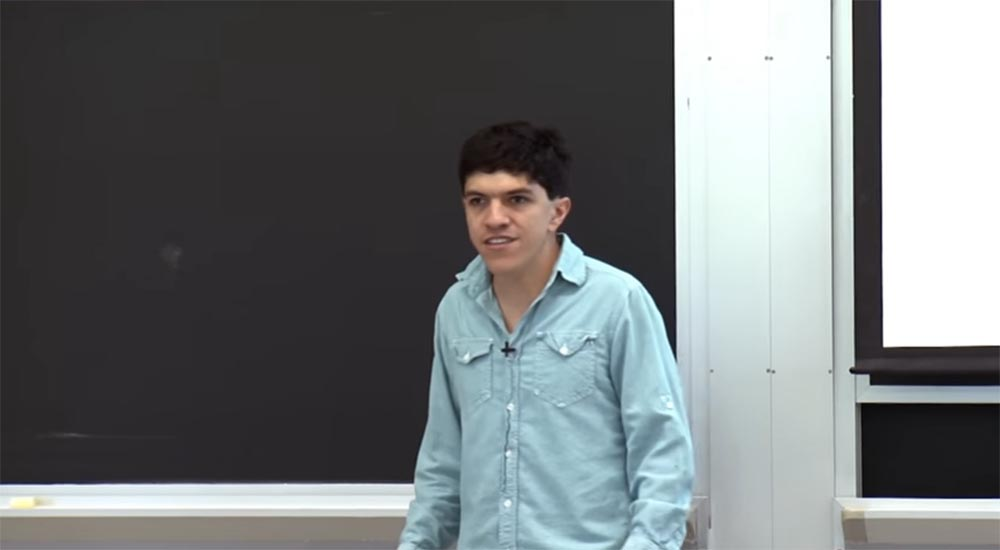

**Аудитория:** мы можем проследить выполнение программы по обеим ветвям.

**Профессор:** да, мы можем проследить выполнение по обеим ветвям. Подбросить монетку, и в зависимости от того, как она упадёт, выбрать ту или иную ветвь.

Итак, если мы хотим следовать за обеими ветвями, мы должны следовать сначала за одной, а затем за другой, верно? Допустим, мы начнём с этой ветки – T=X. Мы знаем, что если доберёмся до этого места, то T будет иметь то же значение, что и X. Мы не знаем, каково это значение, но у нас есть для него имя — это скрипт X.

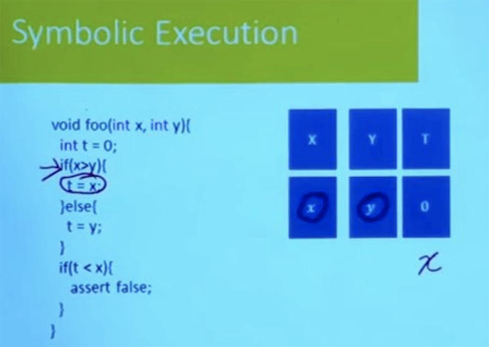

Если мы возьмем противоположную ветвь, что тогда произойдет? Значение T будет равно чему-то другому, так? В этой ветви значением T будет символьное значение Y.

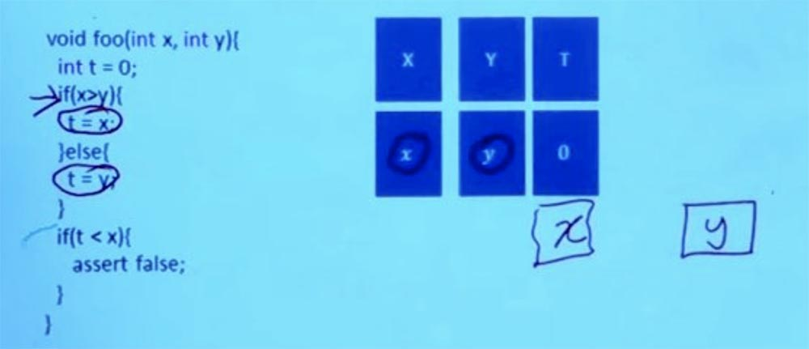

Так что означает это значение T, когда мы дойдем до этой точки в программе? Может быть, это Х, может быть это Y. Мы не знаем точно, какое именно это значение, но почему бы нам не дать ему имя? Назовём его t0. И что мы знаем о t0? В каких случаях t0 будет равно X?

По существу, мы знаем, что если X больше Y, то переменная равна X, а если X меньше или равно Y, то переменная равна Y. Поэтому у нас есть значение, которое мы определили, назовём его t0, и у него есть эти логические свойства.

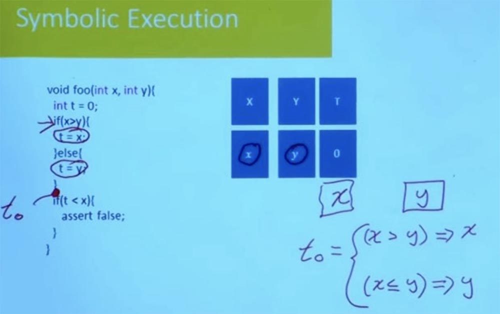

Итак, в данной точке программы у нас есть имя для значения T, это t0. Что же мы здесь сделали? Мы взяли обе ветви оператора if, а затем вычислили символьное значение, посмотрев, при каких условиях будет выполняться одна ветвь программы, а при каких – другая.  
Теперь дело доходит до того, что мы должны спросить, может ли T быть меньше Х. Теперь значение T равно t0, и мы хотим знать, возможно ли, чтобы t0 было бы меньше, чем Х? Вспомните первую ветвь, которую мы рассмотрели — мы задавали вопрос об X и Y и ничего о них не знали, кроме того, что они имели тип int.

Но имея t0, мы действительно много о нём знаем. Мы знаем, что в отдельных случаях он будет равен Х, а в некоторых случаях он будет равен Y. Так что теперь это дает нам набор уравнений, которые мы можем решить. Итак, мы можем сказать, возможно ли, что t0 меньше, чем Х, зная, что t0 удовлетворяет всем этим условиям? Таким образом, можно выразить это как ограничение, показывающее, возможно ли, чтобы t0 было меньше, чем Х. И если Х больше Y, то t0 равно Х, а если Х меньше или равно Y, это означает, что t0 = Y.

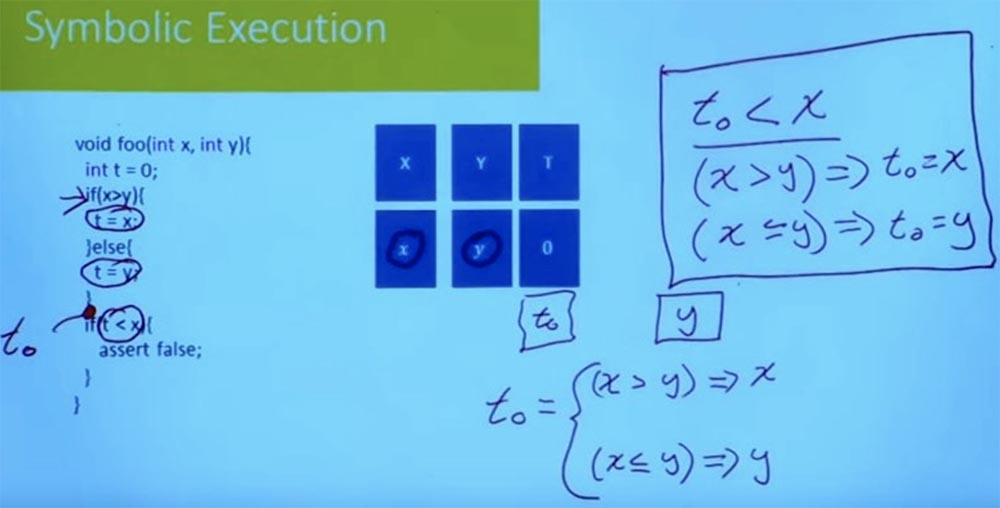

Итак, у нас есть уравнение. Если оно имеет решение, если можно найти значение t0, значение Х и значение Y, которые удовлетворяют этому уравнению, тогда мы узнаем эти значения, и когда введём их в программу, то при выполнении она пойдёт по этой ветви if t < x и «взорвется», когда попадет в assert false.

Так что мы здесь cделали? Мы выполнили программу, но вместо того, чтобы сопоставить имена переменных конкретным значениям, мы придали этим именам переменных символьные значения. По сути, дали им другие имена переменных. И в этом случае наши другие имена переменных – это скрипт X, скрипт Y, t0, и кроме того, у нас есть набор уравнений, которые показывают, как эти значения связаны. У нас есть уравнение, которое говорит нам, как t0 связан с X и Y в этом случае.

Решение этого уравнения позволяет ответить на вопрос, может ли эта ветвь исполняться или нет. Взглянем на уравнение — можно ли взять эту ветвь или нет? Похоже, что нет, потому что мы ищем случаи, где t0 меньше, чем Х, но если в первом условии t0 = X, то выражение t0 < X будет неправдой.

Таким образом, это означает, что когда X > Y, то этого не может произойти, потому что t0 = X и оно не может одновременно быть равным и меньшим X.

А что произойдёт, если t0 = Y? Может ли t0 быть меньше X в этом случае?

Нет, определенно не может, потому что мы знаем, что X < Y. Так что если t0 будет меньше X, тогда оно будет также меньше Y. Но мы знаем, что в этом случае t0 = Y. И поэтому, опять же, это условие не может быть удовлетворено. Итак, мы имеем здесь уравнение, которое не имеет решения, при этом не важно, какие значения вы включаете в это уравнение.

Вы не можете решить его, и это говорит нам, что независимо от того, какие входные данные Х и Y мы передадим программе, она не будет спускаться по ветке if t < x.

Теперь обратите внимание, что, создавая здесь этот аргумент, я в основном намекал на вашу интуицию о целых числах, о математических целых числах. На практике мы знаем, что машинные int ведут себя не совсем так, как математические int. Есть случаи, когда законы, применяемые к математическим целочисленным типам данных, не применимы для программных int.

Поэтому мы должны быть очень осторожны, когда решаем эти уравнения, потому что нужно помнить, что это не те целые числа, о которых нам рассказывали в начальной школе. Это 32-разрядные целые числа, используемые машиной. И есть много случаев ошибок, которые возникли, потому что программисты думали о своем коде с точки зрения математических целых чисел, не понимая, что есть такие вещи, как переполнения, которые могут вызвать разное поведение программы для математических входных данных.

Другое дело, что я описал здесь чисто интуитивный аргумент. Я провожу вас через процесс, показывая, как это сделать вручную, но это отнюдь не алгоритм. Красота этой идеи символического исполнения, однако, заключается в том, что она может быть закодирована в алгоритм. И решить ее можно механическим способом, что позволяет сделать это не просто для программы в 10 строк, а для миллионов программ. Это позволяет использовать те же интуитивные рассуждения, которые мы использовали в данном случае, и говорить о том, что происходит, когда мы выполняем эту программу с разными значениями input. И данные рассуждения можно масштабировать и распространить на очень большие программы.

**Аудитория:** что, если программа не поддерживает ввод определённого типа переменных?

**Профессор:** это очень хороший вопрос! Допустим, у нас есть та же самая программа, но вместо t = x у нас будет t = (x-1). Тогда интуитивно мы можем представить, что теперь эта программа может «взорваться», не так ли?

Потому что когда программа пойдет по этому пути, t действительно будет меньше x. Что же случится с такой программой? Как будет выглядеть наше символьное состояние? Чему будет равно t0, когда x больше y? Исправим строки в наших уравнениях в соответствии с другим значением, когда t = (x-1). Теперь программа может потерпеть неудачу, и вы идёте к разработчику и говорите ему: «эй, эта функция может взорваться, когда x больше y»!

Разработчик смотрит на это и говорит: «о, я забыл сказать вам — фактически эта функция никогда не будет вызываться с параметрами, где x больше y. Я просто написал так по неким историческим соображениям, так что не беспокойтесь, я бы об этом и не вспомнил, если бы вы мне не рассказали».

Допустим, у нас есть предположение, что x будет меньше или равно y.

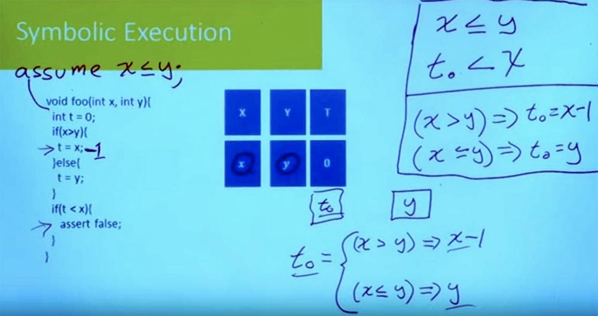

Это предварительное условие или соглашение для нашей функции. Функция обещает что-то сделать, но только, если значение удовлетворяет этому предположению. Но если оно не удовлетворено, функция говорит: «мне все равно, что произойдет. Я обещаю, что ошибки не будет только в том случае, когда это предположение будет выполнено».

Итак, как мы закодируем это ограничение, когда решаем уравнения? По существу у нас есть набор ограничений, которые говорят нам, осуществима ли эта ветвь. И помимо имеющихся ограничений, мы должны также убедиться, что предварительное условие, или предположение, выполняется.

Спрашивается, могу ли я найти x и y, которые удовлетворяют всем этим ограничениям и одновременно обладают требуемыми свойствами? Можно увидеть, что это ограничение Х ≤ Y представляет собой разницу межу случаем, когда это ограничение выполняется, и случаем, когда оно не выполняется.

Это очень важный вопрос при работе с анализом, особенно когда вы хотите это сделать одновременно на уровне отдельных функций. Желательно знать, что имел ввиду программист при написании этой функции. Потому что если вы не имеете представления об этих предположениях, вы могли бы подумать, что есть некоторые входные данные, при которых программа потерпит неудачу.

Как же сделать это механическим способом? Существуют два аспекта этой проблемы. Аспект номер один — как вы на самом деле придумали эти формулы?

В данном случае интуитивно понятно, как мы пришли к этим формулам, мы просто составили их вручную. Но как создавать эти формулы механическим способом?

И второй аспект — как вы решаете эти формулы после того, как они у вас появились? Можно ли на самом деле решить эти формулы, которые описывают, происходит сбой вашей программы или нет?  
Начнем со второго вопроса. Мы можем уменьшить нашу проблему с этими формулами, которые включают целочисленные рассуждения и битовые векторы. Создавая программы, вы заботитесь о массивах, о функциях и в итоге получаете гигантские формулы. Можно ли решить их механическим способом?

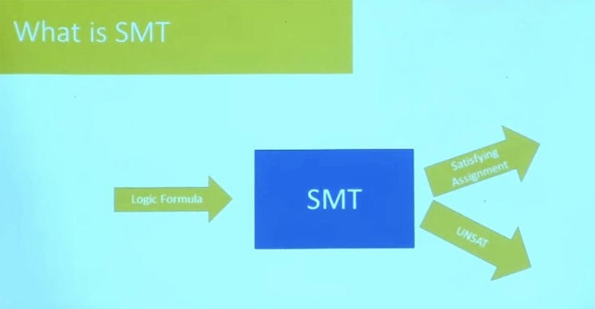

Множество технологий, о которых мы говорим сегодня, являются практическими инструментами, имеющими отношение к огромным достижениям в разработке решателей для логических вопросов. В частности, существует очень важный класс решателей, называемый SMT, или «решатель выполнимости модульных теорий». SMT- решатель — это задача разрешимости логических формул с учётом теорий, лежащих в их основе.

Многие люди утверждают, что это название не является особо хорошим, но оно закрепилось как наиболее часто используемое.

SMT-решатель является алгоритмом, благодаря которому данная логическая формула на выходе даст вам один из двух вариантов: либо она удовлетворяет своему назначению, либо не удовлетворяет. Второй случай означает, что в этой формуле невозможно использовать значения переменных, удовлетворяющие требованиям установленных вами ограничений.

На практике это звучит немного страшно и немного магически. Большую часть проблем, которые должны решать SMT, представляют NP-полные задачи, то есть задачи с ответом «да» или «нет».  
Можем ли мы иметь систему, которая опирается в качестве своего основного строительного блока на решение NP-полных задач? Или нам нужно еще что-нибудь, что работает на практике? Дело в том, что у многих SMT – решателей есть ещё и третий возможный ответ: «Я не знаю».

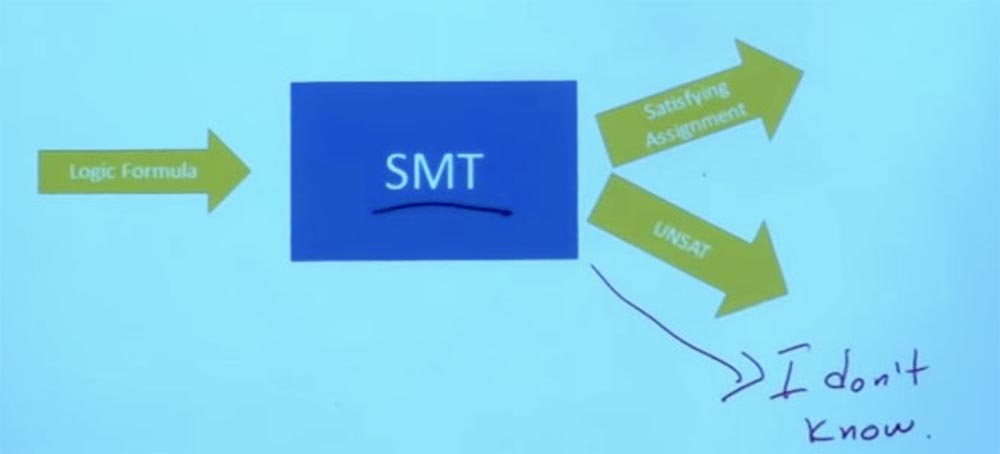

И поэтому часть красоты этих решателей заключается в том, что, даже решая очень большие и сложные практические проблемы, они способны на большее, чем просто ответить: «я не знаю». Они в состоянии дать вам гарантию, что этот набор ограничений является неудовлетворительным или полностью удовлетворяет своему назначению, то есть они дают вам вполне точный ответ.

27:30 мин

[Курс MIT «Безопасность компьютерных систем». Лекция 10: «Символьное выполнение», часть 2](https://habr.com/company/ua-hosting/blog/425561/)

Полная версия курса доступна [здесь](https://ocw.mit.edu/courses/electrical-engineering-and-computer-science/6-858-computer-systems-security-fall-2014/).

Спасибо, что остаётесь с нами. Вам нравятся наши статьи? Хотите видеть больше интересных материалов? Поддержите нас оформив заказ или порекомендовав знакомым, **30% скидка для пользователей Хабра на уникальный аналог entry-level серверов, который был придуман нами для Вас:** [Вся правда о VPS (KVM) E5-2650 v4 (6 Cores) 10GB DDR4 240GB SSD 1Gbps от $20 или как правильно делить сервер?](https://habr.com/company/ua-hosting/blog/347386/) (доступны варианты с RAID1 и RAID10, до 24 ядер и до 40GB DDR4).

**VPS (KVM) E5-2650 v4 (6 Cores) 10GB DDR4 240GB SSD 1Gbps до декабря бесплатно** при оплате на срок от полугода, заказать можно [тут](https://ua-hosting.company/vpsnl).

**Dell R730xd в 2 раза дешевле?** Только у нас **[2 х Intel Dodeca-Core Xeon E5-2650v4 128GB DDR4 6x480GB SSD 1Gbps 100 ТВ от $249](https://ua-hosting.company/serversnl) в Нидерландах и США!** Читайте о том [Как построить инфраструктуру корп. класса c применением серверов Dell R730xd Е5-2650 v4 стоимостью 9000 евро за копейки?](https://habr.com/company/ua-hosting/blog/329618/)