Курс MIT «Безопасность компьютерных систем». Лекция 10: «Символьное выполнение», часть 2 / Блог компании ua-hosting.company

### Массачусетский Технологический институт. Курс лекций #6.858. «Безопасность компьютерных систем». Николай Зельдович, Джеймс Микенс. 2014 год

Computer Systems Security — это курс о разработке и внедрении защищенных компьютерных систем. Лекции охватывают модели угроз, атаки, которые ставят под угрозу безопасность, и методы обеспечения безопасности на основе последних научных работ. Темы включают в себя безопасность операционной системы (ОС), возможности, управление потоками информации, языковую безопасность, сетевые протоколы, аппаратную защиту и безопасность в веб-приложениях.

Лекция 1: «Вступление: модели угроз» [Часть 1](https://habr.com/company/ua-hosting/blog/354874/) / [Часть 2](https://habr.com/company/ua-hosting/blog/354894/) / [Часть 3](https://habr.com/company/ua-hosting/blog/354896/)  
Лекция 2: «Контроль хакерских атак» [Часть 1](https://habr.com/company/ua-hosting/blog/414505/) / [Часть 2](https://habr.com/company/ua-hosting/blog/416047/) / [Часть 3](https://habr.com/company/ua-hosting/blog/416727/)  
Лекция 3: «Переполнение буфера: эксплойты и защита» [Часть 1](https://habr.com/company/ua-hosting/blog/416839/) / [Часть 2](https://habr.com/company/ua-hosting/blog/418093/) / [Часть 3](https://habr.com/company/ua-hosting/blog/418099/)  
Лекция 4: «Разделение привилегий» [Часть 1](https://habr.com/company/ua-hosting/blog/418195/) / [Часть 2](https://habr.com/company/ua-hosting/blog/418197/) / [Часть 3](https://habr.com/company/ua-hosting/blog/418211/)  
Лекция 5: «Откуда берутся ошибки систем безопасности» [Часть 1](https://habr.com/company/ua-hosting/blog/418213/) / [Часть 2](https://habr.com/company/ua-hosting/blog/418215/)  
Лекция 6: «Возможности» [Часть 1](https://habr.com/company/ua-hosting/blog/418217/) / [Часть 2](https://habr.com/company/ua-hosting/blog/418219/) / [Часть 3](https://habr.com/company/ua-hosting/blog/418221/)  
Лекция 7: «Песочница Native Client» [Часть 1](https://habr.com/company/ua-hosting/blog/418223/) / [Часть 2](https://habr.com/company/ua-hosting/blog/418225/) / [Часть 3](https://habr.com/company/ua-hosting/blog/418227/)  
Лекция 8: «Модель сетевой безопасности» [Часть 1](https://habr.com/company/ua-hosting/blog/418229/) / [Часть 2](https://habr.com/company/ua-hosting/blog/423155/) / [Часть 3](https://habr.com/company/ua-hosting/blog/423423/)  
Лекция 9: «Безопасность Web-приложений» [Часть 1](https://habr.com/company/ua-hosting/blog/424289/) / [Часть 2](https://habr.com/company/ua-hosting/blog/424295/) / [Часть 3](https://habr.com/company/ua-hosting/blog/424297/)  
Лекция 10: «Символьное выполнение» [Часть 1](https://habr.com/company/ua-hosting/blog/425557/) / [Часть 2](https://habr.com/company/ua-hosting/blog/425561/) / [Часть 3](https://habr.com/company/ua-hosting/blog/425559/)

**Аудитория:** кажется, вы не рассказали о том, как биты используются для хранения целого числа int.

**Профессор:** это очень хороший вопрос. И это действительно связано с тем, как вы определяете свои ограничения, верно? Поэтому, если вы посмотрите на наш простой пример с самого начала, то увидите, что мы предположили наличие целых чисел, которые изучали в начальной школе. При этом мы полностью решили игнорировать ошибки переполнения. Если вы заботитесь об ошибках переполнения, и вам важно, чтобы таких ошибок не было, то использование математически целых чисел не поможет устранить проблему.

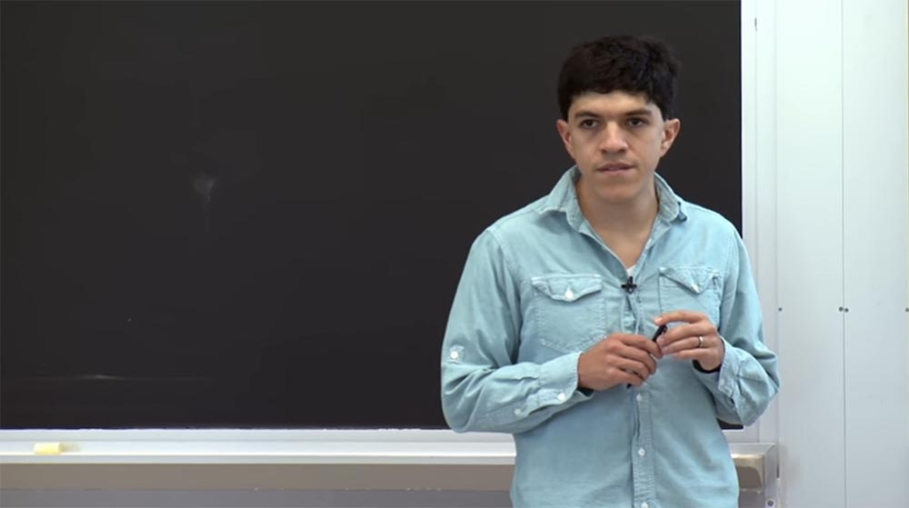

Что вам нужно, так это представить эти величины не как целые числа, а как битовые векторы. Когда вы представляете их в виде битовых векторов, вы должны использовать более широкий взгляд на вещи. Здесь мы возвращаемся к SMT-решателям. Аспект модульной теории заключается в том, что сам решатель расширяем с помощью разных теорий.

Наиболее популярными теориями являются теории битовых векторов фиксированной длины. Это значит, что если вы интерпретируете свои формулы в теории битовых векторов фиксированной длины, вам приходится предварительно устанавливать длину битовых векторов. То есть вы должны явно указать, что это будет использоваться для битовых векторов длиной 32 бита, или 8 битов, или 64 бита.

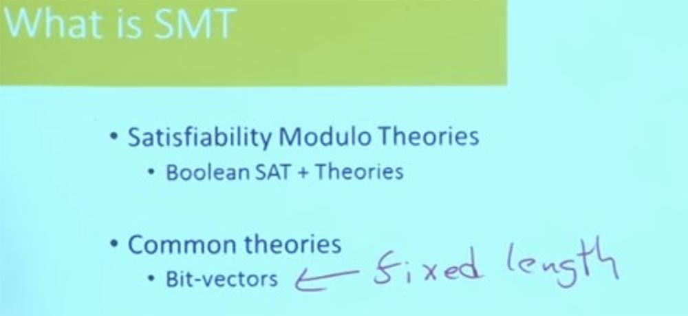

Есть еще одна теория, которая называется теорией массивов TOA. И ней мы поговорим немного подробнее. В отличие от теории битовых векторов, которая предназначена для вещей фиксированной длины, теория массивов предназначена для коллекций, размер которых априори неизвестен.

Теперь на практике никто не использует теорию массивов, например, для моделирования целых чисел, потому что это слишком дорого. Намного дороже рассуждать о проблеме, когда вы не знаете её границ. Поэтому, как правило, люди используют теорию фиксированной длины битовых векторов при рассуждениях о целых числах или даже символах.

Другой очень распространенной теорией является теория действительной целочисленной арифметики, и в частности линейной целочисленной арифметики.

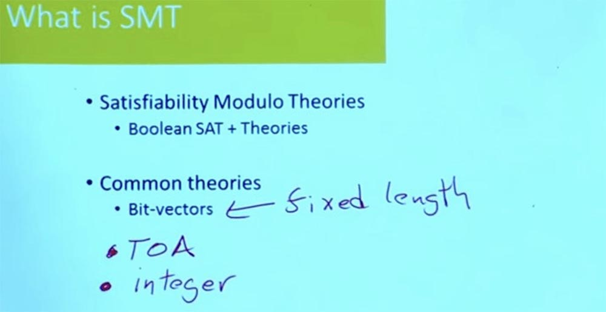

Люди очень любят эту теорию, потому что она обеспечивает эффективное аргументирование, но она не слишком хороша, когда вы рассуждаете о программах, потому что здесь вы действительно заботитесь о проблемах переполнения. Но данная теория широко используется для множества вещей.

Другая теория, которая часто используется — это теория неинтерпретированных функций. Что означает эта теория?

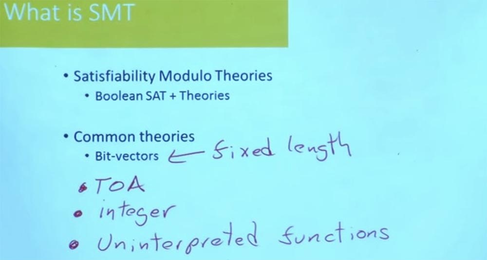

Она означает, что у вас есть некая формула. В этой формуле вы знаете, что вы вызываете функцию, но не знаете об этой функции ничего за исключением того факта, что если вы вставите в неё какие-то входные данные input, то получите такие же выходные данные output.

Оказывается, что это очень полезно при рассуждении о таких вещах, как использование кода с плавающей точкой, моделирование, синусы, косинусы, квадратные корни. Подробные рассуждения о таких вещах могут быть очень трудоёмкими и дорогими. Но использование данной теории позволяет вам сказать: «послушайте, мне на самом деле все равно, что делает функция синуса. Меня не заботит, что именно она выдаст на выходе. Мне просто нужно знать, что если я вызову функцию синуса в различных местах программы с конкретными входными данными, я получу данные такого же рода на выходе. Этого вполне достаточно, чтобы я мог рассуждать о своей программе».

И поэтому наиболее распространенными операциями при анализе реальных систем являются битовые векторы, работающие с целыми числами, логами и указателями. На самом деле, указатели часто представлены целым числом, потому что иногда вы не устанавливаете битовые векторы на указатели. Но иногда вам приходится это делать, и тогда вы больше не сможете использовать целые числа.

Итак, мы рассмотрели, что для вас может сделать SMT-решатель. Как это работает на самом деле? Что находится у них внутри, что заставляет их работать?

На самом деле SMT-решатели полагаются на нашу способность решать задачи выполнимости булевых формул SAT, на способность рассматривать проблемы, связанные только с чисто булевыми ограничениями и булевыми переменными, и говорят нам, обеспечат ли вы выполнение программы значения, присвоенные этим булевым переменным, или нет.

Это то, чему многие, многие годы учили студентов старших курсов, говоря, что на самом деле это NP-полная задача, и в тех случаях, когда что-то сводится к SAT, вы не должны этого делать. Но оказывается, что у нас на самом деле у нас есть очень хорошие решатели SAT.

Итак, я расскажу вам основную идею того, как работают решатели SAT. Она заключается в том, что вы берете все ваши ограничения на булевы переменные и помещаете их в базу данных. Возможно, вам будет плохо видно маленькие буквы на экране, но это всё, что я могу сделать.

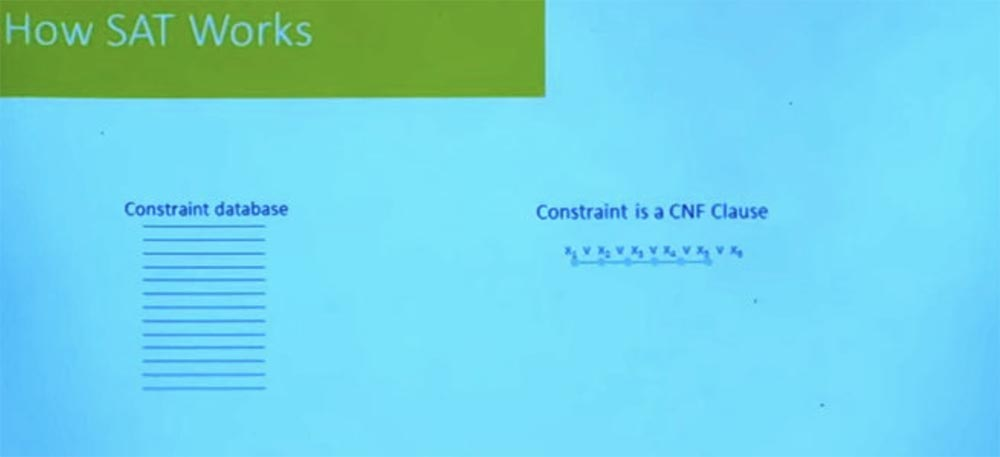

Я буду комментировать и рассказывать об этом по ходу действия, и позже я опубликую слайды, чтобы вы видели, что там написано.

Итак, у нас здесь, в SAT – задаче имеются все эти переменные, представляющие булевы неизвестные, верно? Мы хотим знать, возможно ли, чтобы одновременно X было верным (X = TRUE), и Y было верным, и Z было верным. Это наши неизвестные. При этом все ограничения находятся в нормальной конъюнктивной форме. Это означает, что все наши ограничения имеются в форме либо Х1 = true, либо Х2 = true, либо X3 = true.

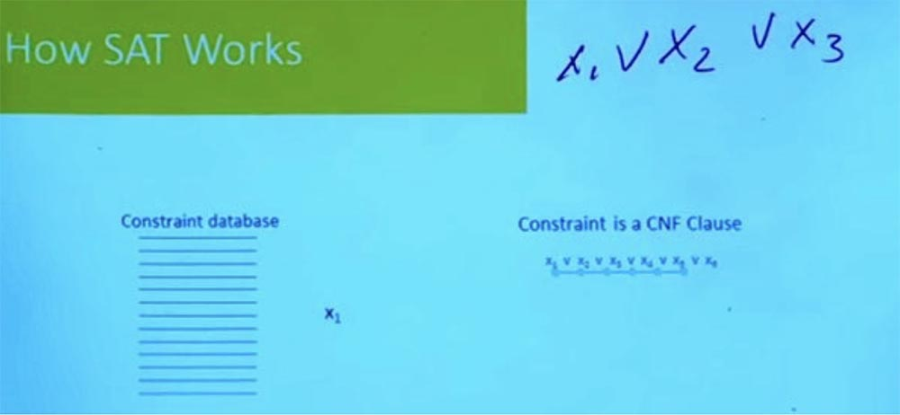

В этой форме у нас есть все наши ограничения, которые говорят, что или X1 является правдой, или X2 является ложным, или X3 является ложным. Вероятно, вы помните из дискретной математики, что любая булева формула может быть представлена в нормальной соединительной форме. Это означает, что любое представление, которое вы используете для представления булевых формул, вы можете очень легко конвертировать в этот формат.

Итак, у нас есть база данных с множеством ограничений этой формы. SAT-решатель выберет одну из этих переменных случайным образом, предположим, что это будет X1. И он скажет: «почему бы не установить X1 на true? Я ничего не знаю об этих ограничениях, поэтому могу считать, это действительно так». А потом случится то, что у вас будут ограничения, которые, например, утверждают, что либо X1 является ложным, или Х7 является правдой.

Итак, если вы знаете, что X1 истинен, и вы знаете, что либо X1 ложен, либо Х7 истинен, что вы знаете об Х7?

**Аудитория:** он должен быть true!

**Профессор:** да, он должен быть true. Потому что иначе это ограничение не будет выполнено. Итак, теперь вы распространили это значение с X1 на X7. Предположим, что теперь вы выбираете другую случайную величину, например X5.

А теперь предположим, что у вас есть ограничение, которое говорит: либо X7 ложно, либо Х6 истинно, либо Х5 ложно. Итак, у меня Х5 = true и X7 = true. Это означает, что X6 теперь тоже должен быть true. Потому что иначе это ограничение было бы нарушено. Итак, система делает вывод, что X6 должен быть true, и продолжает процесс, выполняя имеющиеся проверки и глядя на все доступные предложения. Система проверяет, есть ли другие вещи, которые подразумеваются имеющимися у неё проверками. И она следует за этими значениями, пока не произойдет одна из двух вещей.

Первая — это то, что вы продолжаете следовать последствиям и пробуете случайные вещи, и в конечном итоге вы установите значение для каждой переменной, ни разу не столкнувшись с противоречием. Значит, вы всё сделали правильно.

Вторая — вы столкнулись с противоречием, и тогда вы возвращаетесь к тому условию, которое заставило X4 быть true, исключая то условие, которое заставило X4 быть false. Но есть одно правило булевой алгебры, которое все должны знать: переменная не может одновременно быть и true, и false.

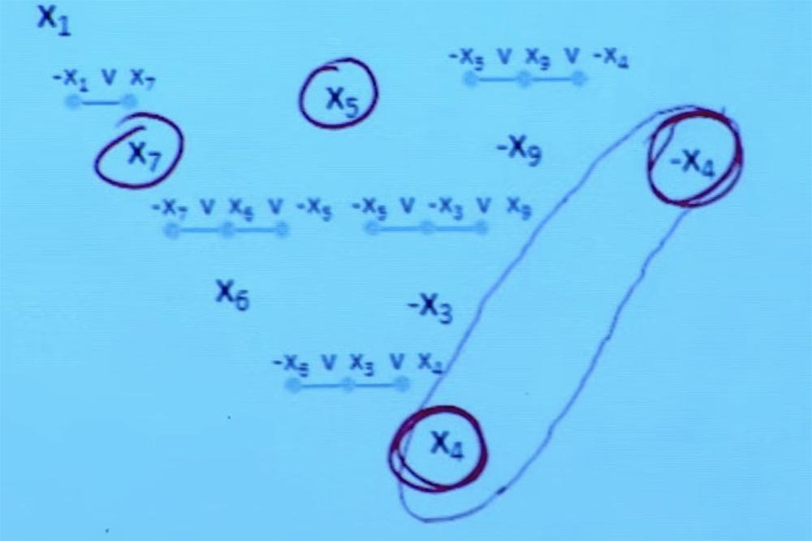

И оно говорит о том, что вы столкнулись с противоречием, вы явно сделали что-то не так в одном из этих случайных заданий, которые пробовали выполнить.

Давайте проанализируем это противоречие и разберемся, что за задания привели к этому противоречию. Основываясь на заданиях, которые привели к этому противоречию, давайте придумаем новое конфликтное положение, которое суммирует это противоречие.

Что произойдет, что X1 является false, и Х5 является false, и Х9 тоже false? По существу, это основано на том, что я узнал из этих случайных заданий, во время которых которые я обнаружил, что одна из этих вещей должна быть true, что не может быть так, чтобы X1 был истинен и X5 был истинен, а Х9 был ложным, этого не может быть.

Я знаю, что этого не может произойти, потому что когда я пытался это проделать, все «взорвалось», я закончил программу на противоречии.

И поэтому SAT–решатель пытается выполнять случайные задания, проверяя, как они проходят. Когда он сталкивается с противоречиями, он анализирует набор последствий, которые привели к этим противоречиям, и в итоге формирует новое ограничение, которое гарантирует, что решатель никогда больше не столкнётся с этим конкретным противоречием, с этой конкретной проблемой.  
Таким образом, мы можем представить себе SAT-решатель как «чёрный ящик», который даёт булево ограничение и может сказать, является ли оно удовлетворительным или нет. Решатели SMT построены на основе лучших SAT-решателей. Они могут применить мощь SAT-решателей для решения NP-полных задач с предметно-ориентированными рассуждениями относительно поддерживаемых теорий.

Чтобы составить представление о том, как это работает, предположим, что у вас есть такая формула.

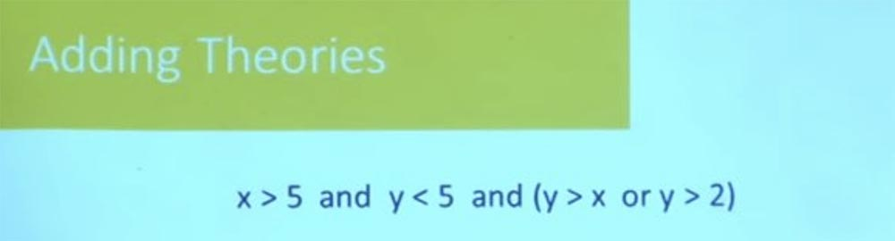

Является ли она выполнимой? Можем ли мы найти для неё удовлетворяющую проверку? Решатель SMT может отделить часть этой формулы, которая требует рассуждения в теории целых чисел. Мы используем для разделения на формулы булевы структуры. Так у нас появляются формулы F1, F2, F3 и F4.

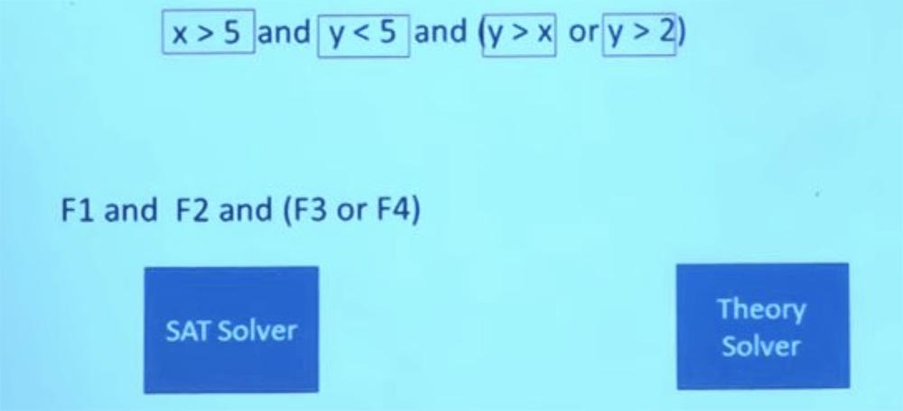

Теперь это чисто логическая, булева задача – могу ли я найти для этого удовлетворительное задание? Решатель SAT может сказать: «да, я могу найти то, что удовлетворяет этому заданию, сделав F1 = true, F2 = true и F3 = true». Это удовлетворяет заданию булевой формулы.

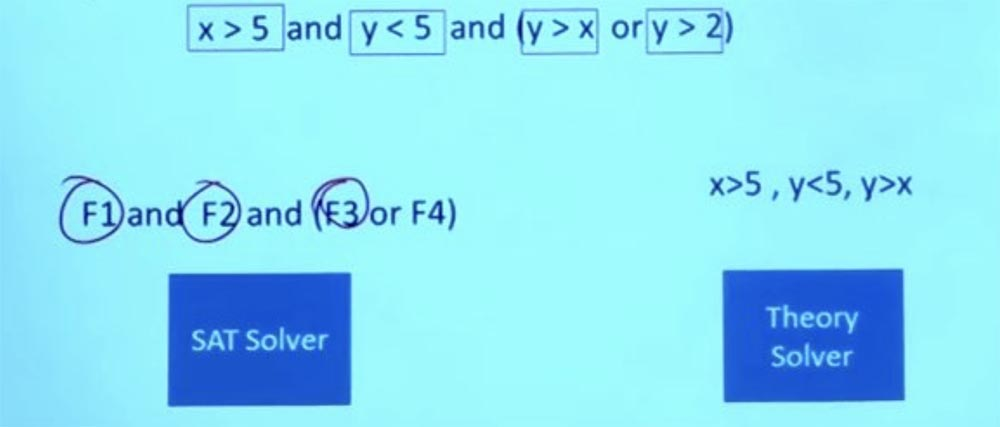\

Итак, теперь у нас есть вопрос, который мы можем задать решателю для конкретной области, в данном случае это просто линейный арифметический решатель. Так что мы можем пойти к линейному решателю Theory solver и сказать: «SAT-решатель утверждает, что это разумное назначение, и что если я смогу заставить это назначение работать, тогда моя формула будет удовлетворена».

Я могу сказать, что F1 это X > 5, F2 это Y &lt; 5, а F3 это Y &gt; X. Так что я могу спросить SAT- решатель, можно ли получить такие X и Y, чтобы X было > 5, Y было &lt; 5, и при этом Y было бы &gt; X? Теперь это вопрос чисто линейной арифметики, здесь нет булевой логики.

И каков ответ на этот вопрос? Нет. Удовлетворить эти условия одновременно невозможно.  
Итак, существуют традиционные методы решения линейных проблем. Можно использовать симплексный метод, например, для решения систем линейных неравенств. Есть много методов, которые можно использовать для решения систем линейных неравенств.

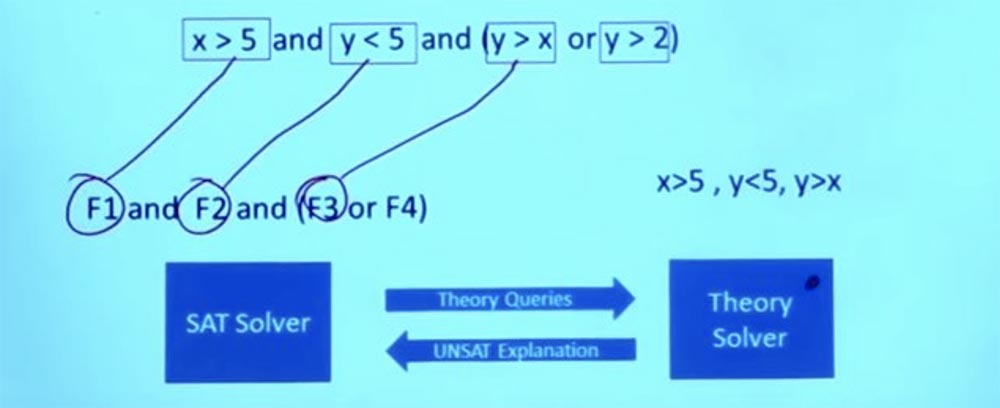

Итак, SAT-решатель отправляет теоретические вопросы теоретическому решателю Theory solver. Суть в том, что решатели Theory solver знают всё об этих проблемах и могут дать точный ответ на вопрос, будут ли работать эти условия.

В данном случает теоретический решатель обрабатывает запрос, выясняет, что данное назначение условий не может работать, возвращается к SAT-решателю и говорит: «те вещи, которые ты сделал, работать не будут»!

Но он не просто говорит «да» или «нет», а объясняет, почему что-то не будет работать. Из того факта, что данные формулы не работают, Theory solver делает вывод, что F1 и F2 и F3 не могут существовать одновременно, и говорит решателю SAT, что эти 3 формулы являются взаимоисключающими.

Так что теперь у нас есть часть информации, которую я могу вернуть решателю SAT и спросить у него: «эй, вы можете дать мне решение, которое удовлетворяет не только ограничению, которое было у нас в начале, но и новому ограничению, которое обнаружил Theory solver»?

Есть ли какое-то другое назначение, которое удовлетворяет теперь обоим этим ограничениям?

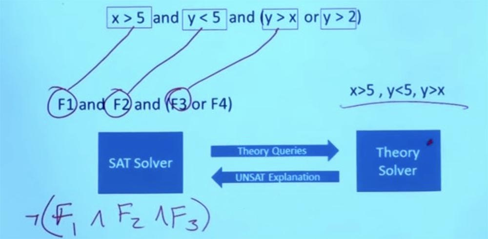

Итак, мы отбрасываем первоначальное ограничение X >5, Y &lt; 5, Y &gt; X, нас это больше не волнует.

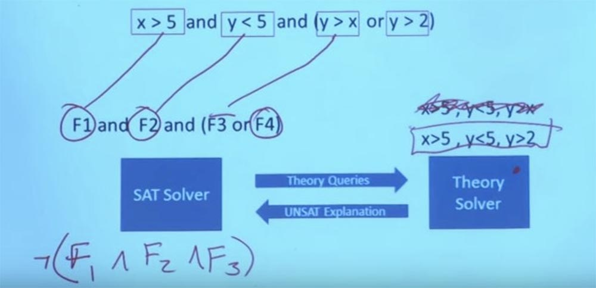

У нас есть новое ограничение, которое мы можем задать нашему Theory solver — X >5, Y &lt; 5, Y &gt; 2. Мы можем сделать Y равным 3, а Х равным 6, и тогда это сработает. Теперь у вас есть задание, удовлетворяющее формуле в теории и удовлетворяющее булевой структуре этого назначения. И с этим система может вернуться и сказать: «да, вот задание, которое удовлетворяет всем вашим ограничениям». Вот в чём заключается взаимодействие между Theory solver и решателем SAT. В действительности это означает возможность рассуждать об очень, очень больших и очень сложных булевых формулах. Вот то, что делает возможным символьное выполнение.

Сейчас мы рассмотрим следующий вопрос – как осуществляется переход от программы к ограничениям, которые мы можем предоставить SMT-решателю.

**Аудитория:** является ли построение SMT-решателя NP-полной задачей или нет?

**Профессор:** SMT–решатель по сути сам является канонической NP-полной задачей. Но большинство решателей в наши дни включают в себя ещё поддержку некоторых теорий, которые совершенно неразрешимы.

**Аудитория:** а как нужно подойти к этому вопросу в вашей системе?

**Профессор:** ну, в конце концов, вы получите ограничение, созданное из этой программы. Вы собираетесь дать его SMT-решателю. И тот факт, что это NP-полные задачи или тот факт, что они неудовлетворительны, означает, что если вам повезет, вы получите ответ в считанные секунды. Но если вам не повезет, то это может занять больше времени, чем заняло создание Вселенной.

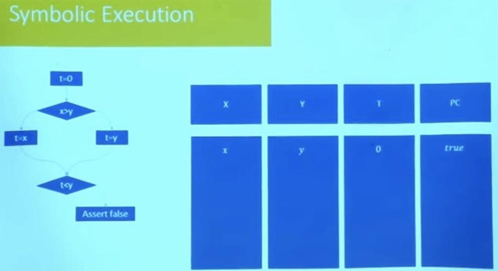

**Аудитория:** случается ли, что задания линейной системы не проходят SAT?

**Профессор:** да, такое действительно случается. Однако имеющиеся инженерные инструменты делают так, что подобное встречается всё реже. Мы же не решаем случайные проблемы SAT, не решаем полностью случайные проблемы битовых векторов.

Мы решаем проблемы, которые имеют определенную структуру, чтобы человек мог посмотреть на это и иметь некоторую уверенность в том, что это сработает. Мы стараемся создать у него в голове некоторые аргументы для понимания того, почему это сработало. И SAT-решатели используют эту структуру. Ваша проблема может иметь миллион булевых переменных, но на самом деле большинство из этих переменных очень сильно зависят от значений друг друга. Таким образом, число степеней свободы в задаче на самом деле намного меньше, чем это предполагают миллионы переменных.

**Аудитория:** вы говорите, что это не экзаменационный вопрос, а реальная жизнь. Раз кто-то построил эту систему, она должна работать и иметь смысл. Так что это, вероятно, не будет одним из никому не нужных теоретических разглагольствований.

**Профессор:** вот именно. Поэтому на практике, когда вы используете этот инструмент, то, что вы всегда делаете – это устанавливаете тайм-ауты. В общем, все происходит потому, что экспоненциальность не означает, что ты не можешь этого сделать. Экспоненциальность, то есть когда одна функция ограничена другой функцией, просто означает, что есть кирпичная стена, перед которой эти вещи будут работать, и они будут работать действительно очень быстро. Экспоненциальность работает в обоих направлениях.

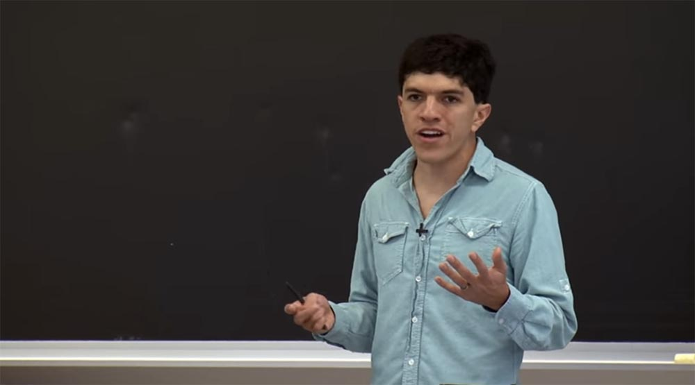

Когда вы удаляетесь от этой стены, вещи растут очень быстро, но когда вы приближаетесь к меньшим или более простым проблемам, эти проблемы также ускоряются очень-очень быстро. Это означает, что многие проблемы и заканчиваются очень быстро. И затем возникает тайм-аут проблем. Смысл в том, чтобы спроектировать вещи таким образом, чтобы среди тех проблем, которые быстро заканчиваются, были проблемы, приносящие практическую пользу. Это проблемы, которые указывают вам на уязвимости безопасности вашей системы, на ошибки, на пути, которые вы, возможно, не исследовали раньше, или на входные данные, которые нарушат ваши пути, если вы их не исследовали заранее.

Итак, мы знаем, как перейти от формулы, от набора ограничений к ответу, который либо скажет: «да, эта формула имеет решение, и вот оно, это решение». Либо скажет: «эта формула неудовлетворительна, потому что нет входных данных, удовлетворяющих вашим заданиям». Так как мы получаем формулу из программы?

Когда вы делаете символьное выполнение, то подходите к ветви и не знаете, в каком направлении она будет идти. Есть две возможности, как вам поступить в таком случае. Одна из них — сделать то, что мы сделали в раннем примере, то есть взять и рассмотреть обе ветви одновременно и собрать на выходе то, что получится в результате выполнения обеих ветвей программы.

Это стратегия, которая часто используется, когда вы пытаетесь получить в целом очень сильные гарантии. Но это стратегия, которая не слишком хорошо работает с современными решателями и SMT-решателями. Часто люди предпочитают исследовать за раз всего один путь. И это значит, что нужно выбрать такой путь для вашей программы и создать формулу для этого конкретного пути.

То есть вы говорите этой формуле: «найди мне входные значения, которые проследуют по этому пути и которые удовлетворяет моему ограничению, или которые нарушают мои свойства, или выходят за пределы буфера, или указывают на нулевой указатель функции».

И если один путь окажется неверным, вы пробуете пойти другим путём, потом следующим путём и так далее. Потому что одновременно вы можете исследовать всего один путь. Это стратегия, о которой мы сейчас поговорим.

Немного легче описать, как это сделать. Допустим, у нас есть такая программа, изображённая на экране. Кстати, я изменил схему представления – теперь программа не выглядит как блок инструкций, я представил её в виде графа потока управления. Все ли здесь знакомы с графом потока управления? Это просто представление программы, которое делает ветви более явными.

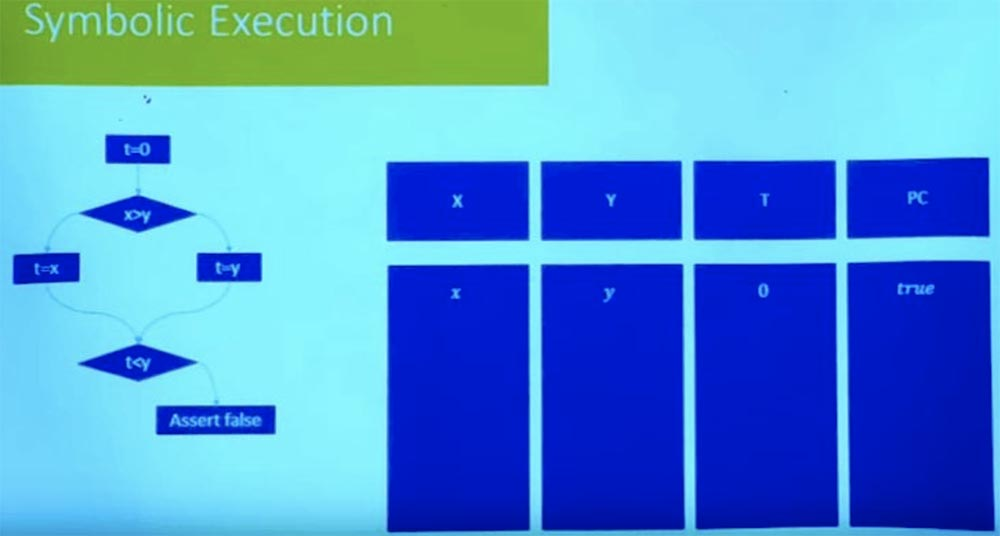

Так что давайте выберем путь, пусть это будет правая ветвь, которая начинается с t=0 и заканчивается утверждением false.

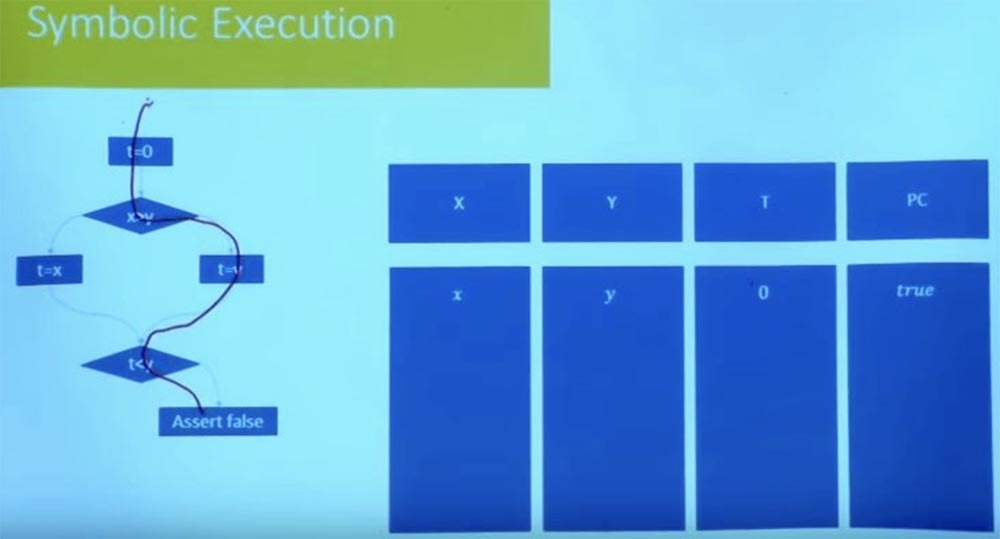

Мы хотим знать, возможен ли этот путь, может ли программа пойти по этому пути? Для этого нам нужно взять две вещи: среду, которая отслеживает символьные значения различных переменных, и среду для ограничений.

Эти ограничения, по сути, будут отслеживать все отношения между переменными, а также любые предположения, независимо от того, были ли эти предположения сделаны в начале или же исходят от ветвей, по которым идёт выполнение программы.

В этом случае, когда мы начинаем выбранный путь, мы получаем значение t = 0, поэтому наше состояние x, y и 0. И пока у нас нет никаких ограничений, потому что их не было в начале. Итак, мы можем проследовать по выбранному пути только в случае, если X больше, чем Y.

Таким образом, нашим первым ограничением будет ограничение X > Y.

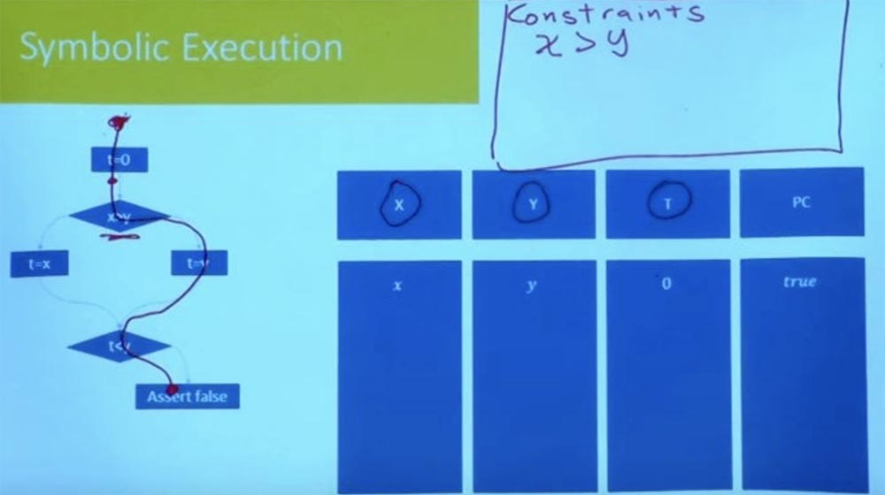

55:00 мин

[Курс MIT «Безопасность компьютерных систем». Лекция 10: «Символьное выполнение», часть 3](https://habr.com/company/ua-hosting/blog/425559/)

Полная версия курса доступна [здесь](https://ocw.mit.edu/courses/electrical-engineering-and-computer-science/6-858-computer-systems-security-fall-2014/).

Спасибо, что остаётесь с нами. Вам нравятся наши статьи? Хотите видеть больше интересных материалов? Поддержите нас оформив заказ или порекомендовав знакомым, **30% скидка для пользователей Хабра на уникальный аналог entry-level серверов, который был придуман нами для Вас:** [Вся правда о VPS (KVM) E5-2650 v4 (6 Cores) 10GB DDR4 240GB SSD 1Gbps от $20 или как правильно делить сервер?](https://habr.com/company/ua-hosting/blog/347386/) (доступны варианты с RAID1 и RAID10, до 24 ядер и до 40GB DDR4).

**VPS (KVM) E5-2650 v4 (6 Cores) 10GB DDR4 240GB SSD 1Gbps до декабря бесплатно** при оплате на срок от полугода, заказать можно [тут](https://ua-hosting.company/vpsnl).

**Dell R730xd в 2 раза дешевле?** Только у нас **[2 х Intel Dodeca-Core Xeon E5-2650v4 128GB DDR4 6x480GB SSD 1Gbps 100 ТВ от $249](https://ua-hosting.company/serversnl) в Нидерландах и США!** Читайте о том [Как построить инфраструктуру корп. класса c применением серверов Dell R730xd Е5-2650 v4 стоимостью 9000 евро за копейки?](https://habr.com/company/ua-hosting/blog/329618/)