Курс MIT «Безопасность компьютерных систем». Лекция 10: «Символьное выполнение», часть 3 / Блог компании ua-hosting.company

### Массачусетский Технологический институт. Курс лекций #6.858. «Безопасность компьютерных систем». Николай Зельдович, Джеймс Микенс. 2014 год

Computer Systems Security — это курс о разработке и внедрении защищенных компьютерных систем. Лекции охватывают модели угроз, атаки, которые ставят под угрозу безопасность, и методы обеспечения безопасности на основе последних научных работ. Темы включают в себя безопасность операционной системы (ОС), возможности, управление потоками информации, языковую безопасность, сетевые протоколы, аппаратную защиту и безопасность в веб-приложениях.

Лекция 1: «Вступление: модели угроз» [Часть 1](https://habr.com/company/ua-hosting/blog/354874/) / [Часть 2](https://habr.com/company/ua-hosting/blog/354894/) / [Часть 3](https://habr.com/company/ua-hosting/blog/354896/)  
Лекция 2: «Контроль хакерских атак» [Часть 1](https://habr.com/company/ua-hosting/blog/414505/) / [Часть 2](https://habr.com/company/ua-hosting/blog/416047/) / [Часть 3](https://habr.com/company/ua-hosting/blog/416727/)  
Лекция 3: «Переполнение буфера: эксплойты и защита» [Часть 1](https://habr.com/company/ua-hosting/blog/416839/) / [Часть 2](https://habr.com/company/ua-hosting/blog/418093/) / [Часть 3](https://habr.com/company/ua-hosting/blog/418099/)  
Лекция 4: «Разделение привилегий» [Часть 1](https://habr.com/company/ua-hosting/blog/418195/) / [Часть 2](https://habr.com/company/ua-hosting/blog/418197/) / [Часть 3](https://habr.com/company/ua-hosting/blog/418211/)  
Лекция 5: «Откуда берутся ошибки систем безопасности» [Часть 1](https://habr.com/company/ua-hosting/blog/418213/) / [Часть 2](https://habr.com/company/ua-hosting/blog/418215/)  
Лекция 6: «Возможности» [Часть 1](https://habr.com/company/ua-hosting/blog/418217/) / [Часть 2](https://habr.com/company/ua-hosting/blog/418219/) / [Часть 3](https://habr.com/company/ua-hosting/blog/418221/)  
Лекция 7: «Песочница Native Client» [Часть 1](https://habr.com/company/ua-hosting/blog/418223/) / [Часть 2](https://habr.com/company/ua-hosting/blog/418225/) / [Часть 3](https://habr.com/company/ua-hosting/blog/418227/)  
Лекция 8: «Модель сетевой безопасности» [Часть 1](https://habr.com/company/ua-hosting/blog/418229/) / [Часть 2](https://habr.com/company/ua-hosting/blog/423155/) / [Часть 3](https://habr.com/company/ua-hosting/blog/423423/)  
Лекция 9: «Безопасность Web-приложений» [Часть 1](https://habr.com/company/ua-hosting/blog/424289/) / [Часть 2](https://habr.com/company/ua-hosting/blog/424295/) / [Часть 3](https://habr.com/company/ua-hosting/blog/424297/)  
Лекция 10: «Символьное выполнение» [Часть 1](https://habr.com/company/ua-hosting/blog/425557/) / [Часть 2](https://habr.com/company/ua-hosting/blog/425561/) / [Часть 3](https://habr.com/company/ua-hosting/blog/425559/)

Теперь, следуя по ветви вниз, мы видим выражение t = y. Поскольку мы рассматриваем один путь за раз, нам не обязательно вводить новую переменную для t. Мы можем просто сказать, что раз t = y, значит t больше не равно 0.

Продолжаем двигаться вниз и добираемся до точки, где мы попадаем в другую ветвь. Каково новое предположение, которое мы должны сделать для того, чтобы следовать далее вниз по этому пути? Это предположение, что t < y.

А что такое t? Если посмотреть вверх по правой ветке, мы увидим, что t = y. И в нашей таблице T = y и Y = y. Из этого логически следует, что наше ограничение выглядит как y < y, чего не может быть.

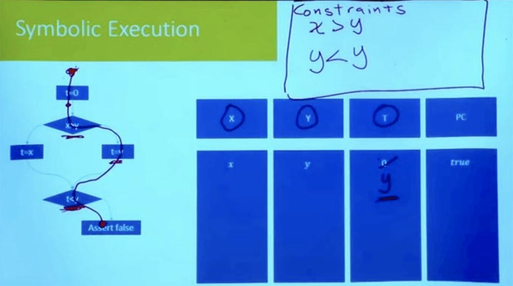

Таким образом, у нас было всё в порядке, пока мы не дошли до этого момента t < y. Пока мы не дошли до утверждения false, у нас все неравенства должны быть правильными. Но этого не получается, потому что при выполнении заданий правой ветви у нас появляется логическое несоответствие.

У нас имеется то, что часто называют условием пути. Это условие должно быть истинным для того, чтобы программа пошла по этому пути. Но мы знаем, что это условие не может быть выполнено, поэтому невозможно, чтобы программа пошла по этому пути. Так что этот путь сейчас полностью ликвидирован, и мы знаем, что этот правый путь не может быть пройден.

А как насчет другого пути? Попробуем пройти левую ветвь по другому пути. Каковы будут условия для этого пути? Опять же, наше символьное состояние начинается с t = 0, а X и Y равны переменным х и y.

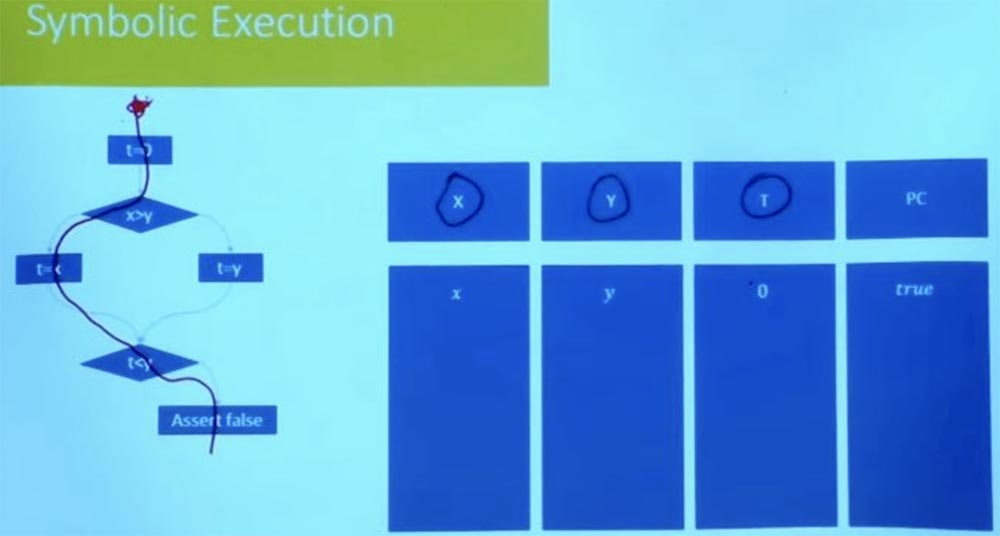

Как теперь выглядит ограничение пути в этом случае? Обозначим левую ветвь как True, а правую как False и далее рассмотрим значение t = x. В результате логической обработки условий t = x, x > y и t &lt; y получаем, что у нас одновременно имеется то, что x &gt; y и x < y.

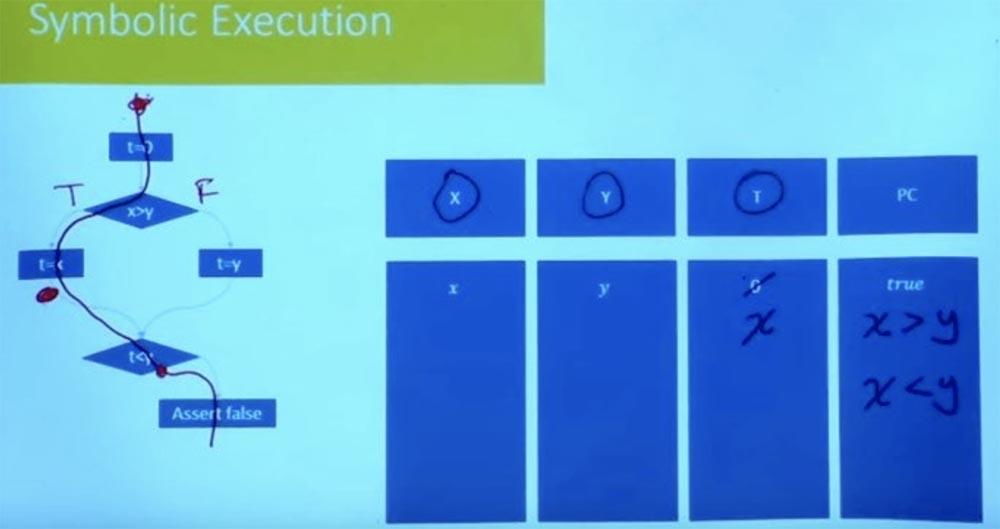

Совершенно ясно, что это условие пути неудовлетворительно. Мы не можем иметь х, который одновременно больше и меньше y. Не существует присваивания переменно Х, которое удовлетворяет обоим ограничениям. Таким образом, это говорит нам о том, что другой путь также неудовлетворителен.

Получается, что в этот момент мы исследовали все возможные пути в программе, которые могут привести нас к этому состоянию. Мы можем фактически установить и удостоверить, что не существует никакого возможного пути, который привёл бы нас к утверждению false.  
**Аудитория:** на этом примере вы показали, что вы изучили ход программы по всем возможным ветвям. Но ведь одним из преимуществ символьного выполнения является то, что нам не нужно изучать все возможные экспоненциальные пути. Так как избежать этого в данном примере?

**Профессор:** это очень хороший вопрос. В данном случае вы достигаете компромисса между символьным выполнением и тем, насколько конкретными вы хотите быть. Так что в данном случае мы не настолько пользуемся символьным выполнением, как в первый раз, когда рассматривали ход программы по обеим ветвям одновременно. Зато благодаря этому наши ограничения стали очень и очень простыми.

Индивидуальные ограничения «один путь за другим» очень просты, но вы должны делать это снова и снова, изучая все существующие ветви, а экспоненциально – и все возможные пути.  
Есть экспоненциально много путей, но для каждого пути в целом, есть также экспоненциально большой набор входных данных, которые могут пойти по этому пути. Так что это уже дает вам большое преимущество, потому что вместо того, чтобы попробовать все возможные входные данные, вы пытаетесь попробовать каждый возможный путь. Но можете ли вы сделать что-то лучше?

Это одна из областей, где было сделано много экспериментов относительно символьного выполнения, например, одновременное выполнение нескольких путей. В материалах лекции вы встречали эвристику и набор стратегий, которые использовали экспериментаторы, чтобы сделать поиск более разрешимым.

Например, одна из вещей, которые они делают, заключается в том, что они исследуют один путь за другим, но не делают это совершенно вслепую. Они проверяют условия пути после каждого сделанного шага. Предположим, что здесь в нашей программе вместо утверждения «ложь» было бы сложное дерево программ, граф потока управления.

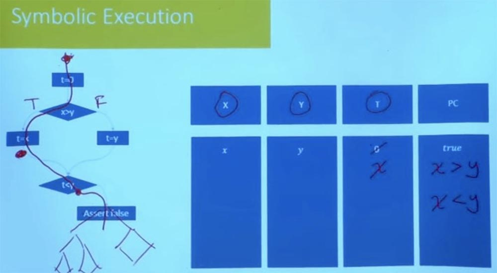

Вам не нужно ждать, пока вы не дойдете до самого конца, чтобы проверить, что этот путь осуществим. В тот момент, когда вы доходите до условия t < y, вы уже знаете, что этот путь неудовлетворителен, и вы никогда не пойдёте в этом направлении. Поэтому отсекание неверных ветвей в начале программы сокращает количество эмпирического труда. Разумное исследование пути предотвращает возможность неудачи программы в последующем. Множество практических инструментов, которые сегодня используются, в первую очередь начинают со случайного тестирования, чтобы получить начальный набор путей, после чего они начнут исследовать пути по соседству. Они обрабатывают множество вариантов возможного выполнения программы по каждой из ветвей, задаваясь вопросом, что происходит на этих путях.

Особенно полезно, если у нас есть хороший набор тестов. Вы запускаете свой тест и обнаруживаете, что этот фрагмент кода не выполняется. Поэтому вы можете взять путь, который получился ближе всего к осуществлению кода, и спросить, можно ли изменить этот путь, чтобы он пошел в нужном направлении?

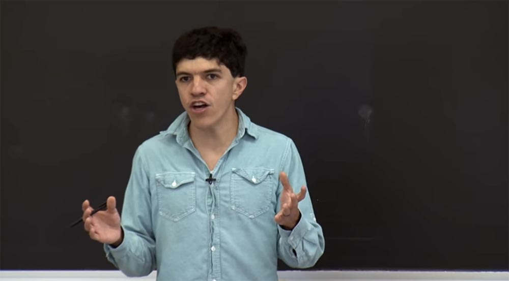

Но в тот момент, когда вы пытаетесь сделать все пути одновременно, начинаются ограничения, которые становятся трудноразрешимыми. Поэтому то, что вы можете сделать – это выполнять одну функцию за раз, при этом вы сможете вместе изучить все пути в функции. Если вы попробуете сделать большие блоки, то вообще сможете разведать все возможные пути.

Самым важным является то, что для каждой ветви вы проверяете свои ограничения и устанавливаете, действительно ли эта ветвь может пойти в обе стороны. Если она не может следовать по обоим путям, вы экономите время и силы, не следуя в том направлении, куда она не может пойти. Кроме того, я не помню конкретные стратегии, которые они используют для поиска путей, которые с большей вероятностью дадут очень хороший результат. Но отсечение неверных ветвей на начальном этапе очень важно.

До сих пор мы говорили в основном только об «игрушечном коде», о целочисленных переменных, о ветвях, об очень простых вещах. Но что происходит, когда у вас имеется более сложная программа? В частности, что происходит, когда у вас есть программа, которая включает в себя кучу?

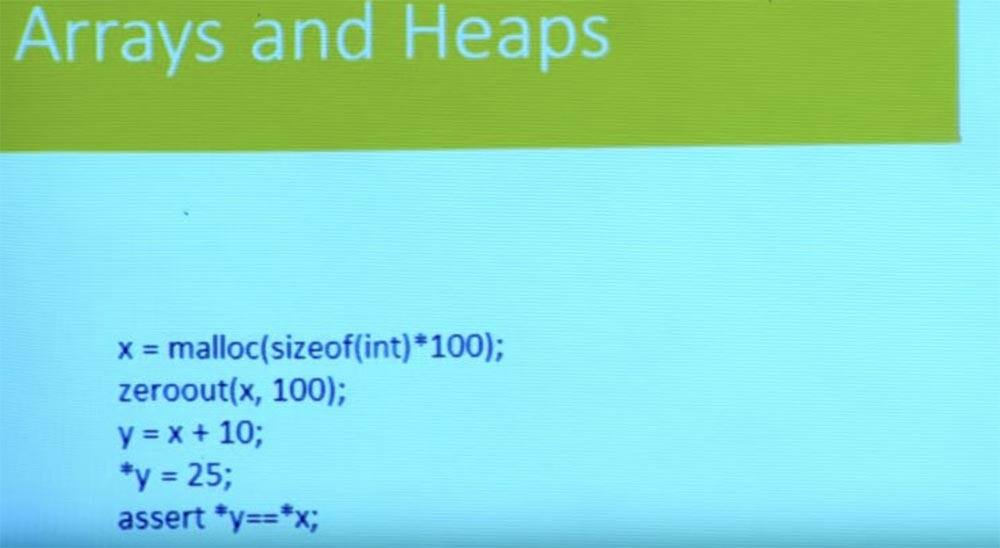

Исторически куча hip была проклятием всего программного анализа, потому что чистые и элегантные вещи времён Фортрана полностью взрываются, когда вы пытаетесь запустить их с помощью программ, написанных на языке C, в которых вы выделяете память налево и направо. Там у вас есть наложения и весь беспорядок, который связан с работой программы с выделенной памятью и с арифметикой указателей. Это одна из областей, где символьное выполнение обладает выдающейся способностью рассуждать о программах.

Так как же нам это сделать? Давайте на минуту забудем о ветвях и потоке управления. У нас здесь простая программа. Она выделяет некоторую память, обнуляет её и получает новый указатель y от указателя x. Затем она что-то записывает в y и проверяет, равно ли значение, хранящееся в указателе y, значению, хранящемуся в указателе x?

На основе базовых знаний языка С вы можете увидеть, что эта проверка не выполняется, потому что x обнулился, а y=25, так что x указывает на другое расположение. Пока у нас все хорошо.  
Способ, которым мы будем моделировать кучу, и тот способ, которым куча моделируется в большинстве систем, использует представление кучи в языке С, где она является просто гигантской адресной базой, гигантским массивом, в котором вы можете расположить свои данные.  
Это означает, что мы можем представлять нашу программу как очень большой глобальный массив данных, который будет называться MEM. Это массив, который, по сути, собирается сопоставить адреса значениям. Адрес — это всего лишь 64-битное значение. А что будет после того, как вы прочитаете что-нибудь из этого адреса? Это зависит от того, как вы моделируете память.

Если вы моделируете её на уровне байтов, то получается байт. Если вы моделируете его на уровне слов, то получается слово. В зависимости от вида ошибок, которыми вы интересуюсь, и в зависимости от того, волнует ли вас распределение памяти или нет, вы будете моделировать её немного по-другому, но обычно память — это просто массив от адреса до значения.

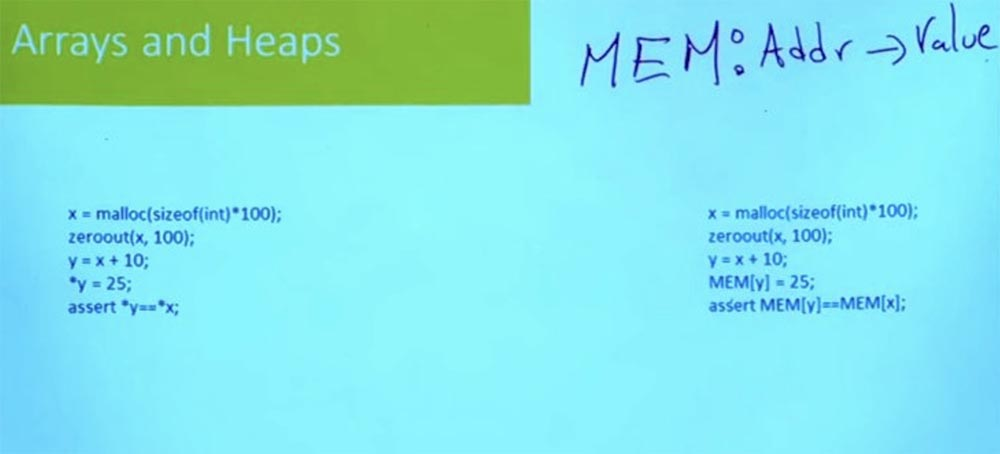

Так что адрес — это просто целое число. В некотором смысле не важно, что C думает об адресе, это просто целое 64-битное или 32-битное число, в зависимости от вашей машины. Это просто значение, которое индексируется в этой памяти. И то, что вы можете поместить в память, то и сможете прочитать из этой памяти.

Поэтому такие вещи, как арифметика указателя, просто становятся целочисленной арифметикой. На практике есть немного сложностей, потому что на языке C арифметика указателей знает о типах указателей, и они будут увеличиваться пропорционально размеру. Так что результате мы получим такую строку:

y = x + 10;  sizeof (int)

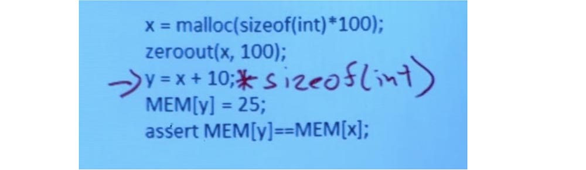

Но что действительно важно, так это то, что происходит, когда вы пишите в память и читаете из памяти. На основе указателя, что в y нужно записать 25, я беру массив памяти и индексирую его с y. И я записываю 25 в это расположение памяти.

Затем я перехожу к утверждению MEM\[y\] = = MEM\[x\], читаю значение из местоположения y в памяти, читаю значение из местоположения x в памяти и сравниваю их между собой. Так я проверяю, совпадают они или нет.

Это очень простое допущение, позволяющее перейти от программы, которая использует кучу, к программе, которая использует этот гигантский глобальный массив, представляющий память. Это означает, что теперь, при рассуждении о программах, которые управляют кучей, вам в действительности не нужно рассуждать о программах, которые управляют кучей. Вы прекрасно обойдётесь возможностью рассуждать о массивах, а не о кучах.

Вот ещё один простой вопрос. Что насчет функции malloc? Вы можете просто взять и использовать реализацию malloc на языке С, следить за всеми выделенными страницами, отслеживать всё, что было освобождено, просто иметь свободный список, и этого вполне достаточно. Получается, что для множества целей и для многих видов ошибок вам не нужно, чтобы malloc был сложным.

Фактически, вы можете перейти с malloc, который выглядит так: x= malloc(sizeof(int)*100), на malloc такого вида:

POS = 1  
Int malloc(int n){  
rv = POS  
POS+=n;  
}

Который просто говорит: «я собираюсь сохранить счетчик для следующего свободного места в памяти, и всякий раз, когда кто-то просит адрес, я даю ему это расположение и увеличиваю эту позицию, а потом возвращаю rv». В этом случае полностью игнорируется то, что такое malloc в традиционном смысле.

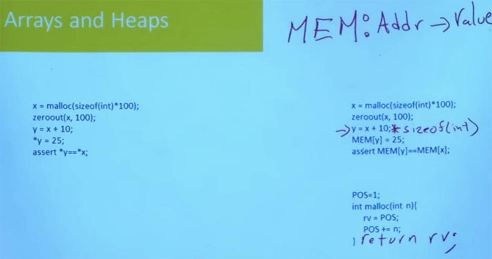

В данном случае нет никакого освобождения памяти. Функция просто продолжает перемещаться по памяти все дальше, и дальше, и дальше, и на этом все и заканчивается без всякого освобождения. Её также не очень волнует то, что есть области памяти, в которых не стоит писать, потому что существуют специальные адреса, имеющие особое значение, зарезервированные для операционной системы.

Она не моделирует ничего из того, что делает написание функции malloc сложным, но только на определенном уровне абстракции, когда вы пытаетесь рассуждать о каком-то сложном коде, совершающем манипуляции с указателем.

При этом вас не волнует освобождение памяти, зато волнует, собирается ли программа, например, писать за пределами какого-то буфера, и в этом случае эта функция malloc может быть достаточно хороша.

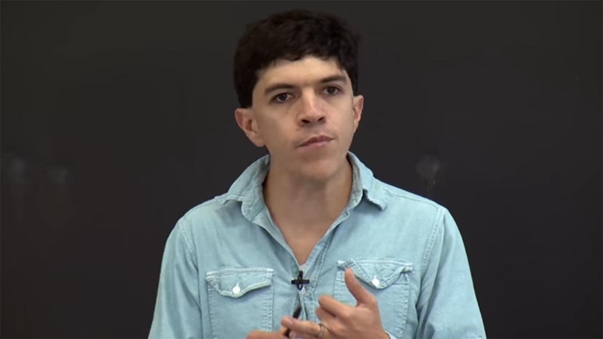

И такое на самом деле, происходит очень и очень часто, когда вы делаете символьное выполнение реального кода. Очень важным этапом является моделирование функций вашей библиотеки. То, как вы моделируете функции библиотеки, окажет огромное влияние, с одной стороны, на производительность и масштабируемость анализа, но с другой стороны, также повлияет на точность.

Так что если у вас есть такая «игрушечная» модель malloc, как эта, она будет действовать очень быстро, но при этом возникнут определенные виды ошибок, которые вы не сможете заметить. Так, например, в этой модели я полностью игнорирую распределения, поэтому у меня может возникнуть ошибка, если кто-то получит доступ к незанятому пространству. Поэтому в реальной жизни я никогда не буду использовать эту модель malloc Микки Мауса.

Так что это всегда баланс между точностью анализа и эффективностью. И чем сложнее модели стандартных функций, таких, как malloc get, тем менее масштабируем их анализ. Но для некоторых классов ошибок вам понадобятся эти простые модели. Поэтому большое значение имеют различные библиотеки на языке С, которые нужны для того, чтобы понять, что же такое программа делает на самом деле.

Поэтому мы уменьшили проблему рассуждения о куче, рассуждением о программе с массивами, но я на самом деле не сказал вам, как рассуждать о программе с массивами. Оказывается, что большинство SMT–решателей поддерживают теорию массивов.

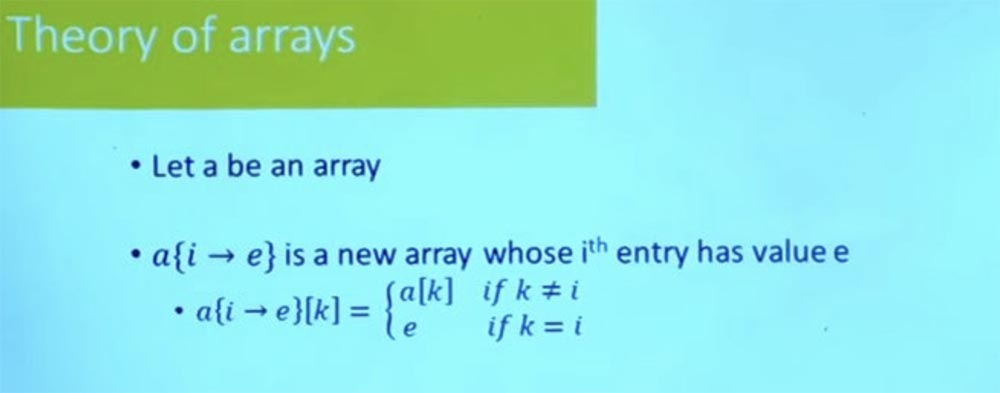

Идея состоит в том, что если a – это некий массив, то существуют некоторые обозначения, позволяющие взять этот массив и создать новый массив, где местоположение i обновлено до значения e. Это понятно?

Поэтому, если у меня есть массив a, и я делаю эту операцию обновления, а затем пытаюсь прочитать значение k, то это означает, что значение k будет равно значению k в массиве a, если k отличается от i, и оно будет равно e, если k равно i.

Обновление массива означает, что нужно взять старый массив и обновить его новым массивом. Хорошо, если у вас есть формула, которая включает в себя теорию массивов, поэтому я начал с нулевого массива, который везде представлен просто нулями.

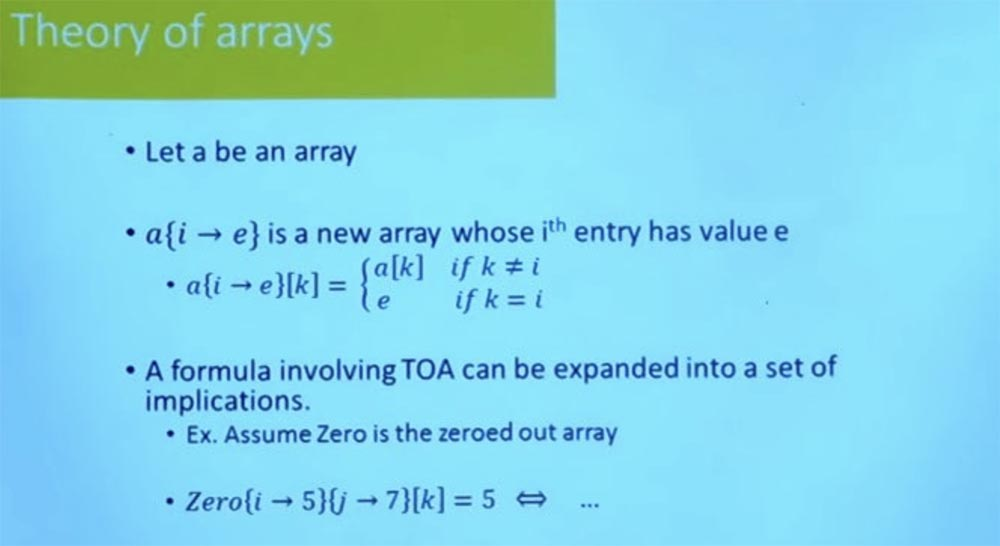

Затем я записываю 5 в расположение i и 7 в расположение j, после чего я читаю из k и проверяю, равно это 5 или нет. Затем это можно расширить, используя определение для чего-то, что говорит, например: «если k равно i и k равно y, при этом k отличается от j, то, да, это будет равно 5, в противном случае это не будет равно 5».

И на практике SMT- решатели не просто расширяют это до множества булевых формул, они используют эту стратегию перемещения взад и вперед между SAT–решателем и движком, который способен рассуждать о теории массивов для осуществления данной работы.

Важно то, что полагаясь на эту теорию массивов, используя ту же стратегию, которую мы применили, чтобы генерировать формулы для целых чисел, можно фактически генерировать формулы, включающие логику массива, обновления массива, оси массива, итерацию массивов. И до тех пор, пока вы исправляете свой путь, эти формулы очень легко генерировать.  
Если вы не исправляете свои пути, а хотите создать формулу, соответствующую проходу программы по всем путям, то это также относительно легко. Единственное, вам придется иметь дело с особого вида циклами.

Словари и карты также очень легко моделировать с помощью неопределённых функций. Собственно, сама теория массивов — это всего лишь частный случай неопределённой функции. С помощью таких функций могут быть сделаны и более сложные вещи. В современном SMT-решателе существует встроенная поддержка рассуждений о множествах и операциях множеств, которая может быть очень полезна, если вы рассуждаете о программе, которая включает в себя вычисление множеств.

При проектировании одного из этих инструментов очень важен этап моделирования. И дело не только в том, как вы моделируете сложные программные функции вплоть до своих теорий, например, такие вещи, как сведение куч к массивам. Дело также в том, какие теории и решатели вы используете. Существует большое количество теорий и решателей с различными отношениями, для которых необходимо подобрать разумный компромисс между эффективностью и затратностью.

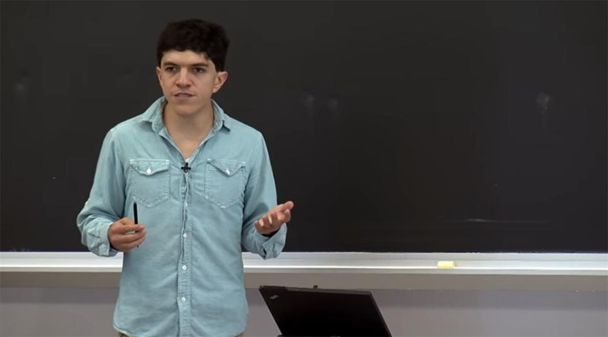

Большинство практических инструментов придерживаются теории битовых векторов и при необходимости могут использовать теорию массивов для моделирования кучи. Вообще практические инструменты стараются избежать более сложных теорий, таких как теория множеств. Это вызвано тем, что они, как правило, менее масштабируемы в некоторых случаях, если вы не имеете дело с программой, которая действительно требует для работы инструментов именно такого рода.

**Аудитория:** кроме исследование символического исполнения, на чем фокусируют своё внимание разработчики?

**Профессор:** ещё одна очень активная область исследований — это приложения и поиск программных моделей, которые будут выявлять новые виды ошибок. Так, например, Николай, Франц и Си Ван на прошлогодних лекциях рассматривали использование символьного выполнения для программ, которые было нельзя оптимизировать с помощью компилятора. Это касалось проверок безопасности, которые можно оптимизировать без компилятора.

Таким образом, это очень отличается от вопроса о том, будет ли программа идти по этому пути или нет. Но существует шаг моделирования, позволяющий перейти от концептуального вопроса высокого уровня, существует ли в вашей программе код, который можно компилировать, к алгоритму, основанному на символьном выполнении, который сможет легко определить, может ли программа следовать конкретным путём и возможен ли такой конкретный путь.

Получается, что приложения — это большая область, расширяющаяся до новых классов ошибок, до новых возможностей разных языков программирования. Например, одна из вещей, которую все еще довольно сложно смоделировать с помощью символьного выполнения — это языки очень высокого уровня, такие как JavaScript или Python, где у вас имеется много очень динамичных языковых функций. Но в то же время практически любую программу можно приспособить для символьного выполнения, и это определенно очень хорошо.

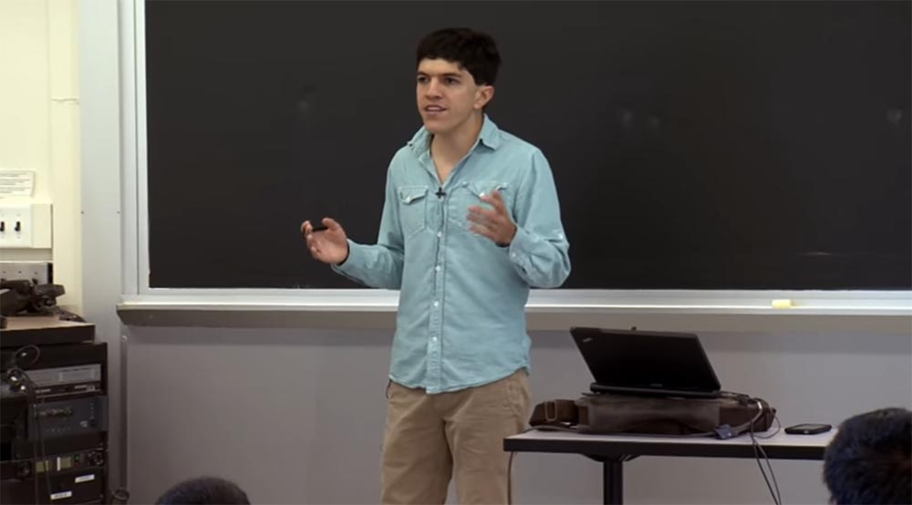

Пару лет назад у нас были работы, использующие символьное выполнение для рассуждений об ошибках в заданиях программирования на языке Python. Таким образом, в случае символьного выполнения часть проблемы заключается в том, что ваше символьное состояние не позволяет просто сказать: «хорошо, я выполню эту инструкцию, а затем эту инструкцию, а затем вот эту инструкцию». Там нет последовательности.

Например, несколько лет назад мы рассматривали очень маленькие отрывки кода, но очень ответственные, содержащие внутри операционной системы совпадающую структуру данных, или незапертую структуру данных, или моделирующие взаимодействие между потоками.  
По существу говоря, каждый раз, когда есть переменная, которая может быть перезаписана на какое-то другое значение, вы только заменяете её значение новым символьным значением и создаете ограничения, которые относятся к этим символьным значениям и к символьным значениям в других потоках.

Это было использовано даже для того, чтобы рассуждать о таких вещах, как о пропавших границах памяти, при этом сложность растет совсем незначительно. Условно говоря, то, что вы больше не можете делать в масштабе Microsoft Word, вы можете делать в масштабе, например, параллельной структуры данных.

Были и другие работы в контексте параллелизма, например, можно ли использовать символьное выполнение, чтобы реконструировать неверное чередование на основе знания о том, как программа себя при этом вела.

Это открывает много возможностей, так как позволяет задавать конкретные вопросы о пути выполнения программы. Символьное выполнение позволяет спросить, какие значения должны иметь эти вещи для того, чтобы программа что-то делала, или чтобы что-то произошло. Это очень мощная возможность, и существует много приложений, которые были опробованы на её основе. Но это довольно новая технология, как и технология для анализа выполнения программы.

Полная версия курса доступна [здесь](https://ocw.mit.edu/courses/electrical-engineering-and-computer-science/6-858-computer-systems-security-fall-2014/).

Спасибо, что остаётесь с нами. Вам нравятся наши статьи? Хотите видеть больше интересных материалов? Поддержите нас оформив заказ или порекомендовав знакомым, **30% скидка для пользователей Хабра на уникальный аналог entry-level серверов, который был придуман нами для Вас:** [Вся правда о VPS (KVM) E5-2650 v4 (6 Cores) 10GB DDR4 240GB SSD 1Gbps от $20 или как правильно делить сервер?](https://habr.com/company/ua-hosting/blog/347386/) (доступны варианты с RAID1 и RAID10, до 24 ядер и до 40GB DDR4).

**VPS (KVM) E5-2650 v4 (6 Cores) 10GB DDR4 240GB SSD 1Gbps до декабря бесплатно** при оплате на срок от полугода, заказать можно [тут](https://ua-hosting.company/vpsnl).

**Dell R730xd в 2 раза дешевле?** Только у нас **[2 х Intel Dodeca-Core Xeon E5-2650v4 128GB DDR4 6x480GB SSD 1Gbps 100 ТВ от $249](https://ua-hosting.company/serversnl) в Нидерландах и США!** Читайте о том [Как построить инфраструктуру корп. класса c применением серверов Dell R730xd Е5-2650 v4 стоимостью 9000 евро за копейки?](https://habr.com/company/ua-hosting/blog/329618/)