Курс MIT «Безопасность компьютерных систем». Лекция 11: «Язык программирования Ur/Web», часть 1 / Блог компании ua-hosting.company

### Массачусетский Технологический институт. Курс лекций #6.858. «Безопасность компьютерных систем». Николай Зельдович, Джеймс Микенс. 2014 год

Computer Systems Security — это курс о разработке и внедрении защищенных компьютерных систем. Лекции охватывают модели угроз, атаки, которые ставят под угрозу безопасность, и методы обеспечения безопасности на основе последних научных работ. Темы включают в себя безопасность операционной системы (ОС), возможности, управление потоками информации, языковую безопасность, сетевые протоколы, аппаратную защиту и безопасность в веб-приложениях.

Лекция 1: «Вступление: модели угроз» [Часть 1](https://habr.com/company/ua-hosting/blog/354874/) / [Часть 2](https://habr.com/company/ua-hosting/blog/354894/) / [Часть 3](https://habr.com/company/ua-hosting/blog/354896/)  
Лекция 2: «Контроль хакерских атак» [Часть 1](https://habr.com/company/ua-hosting/blog/414505/) / [Часть 2](https://habr.com/company/ua-hosting/blog/416047/) / [Часть 3](https://habr.com/company/ua-hosting/blog/416727/)  
Лекция 3: «Переполнение буфера: эксплойты и защита» [Часть 1](https://habr.com/company/ua-hosting/blog/416839/) / [Часть 2](https://habr.com/company/ua-hosting/blog/418093/) / [Часть 3](https://habr.com/company/ua-hosting/blog/418099/)  
Лекция 4: «Разделение привилегий» [Часть 1](https://habr.com/company/ua-hosting/blog/418195/) / [Часть 2](https://habr.com/company/ua-hosting/blog/418197/) / [Часть 3](https://habr.com/company/ua-hosting/blog/418211/)  
Лекция 5: «Откуда берутся ошибки систем безопасности» [Часть 1](https://habr.com/company/ua-hosting/blog/418213/) / [Часть 2](https://habr.com/company/ua-hosting/blog/418215/)  
Лекция 6: «Возможности» [Часть 1](https://habr.com/company/ua-hosting/blog/418217/) / [Часть 2](https://habr.com/company/ua-hosting/blog/418219/) / [Часть 3](https://habr.com/company/ua-hosting/blog/418221/)  
Лекция 7: «Песочница Native Client» [Часть 1](https://habr.com/company/ua-hosting/blog/418223/) / [Часть 2](https://habr.com/company/ua-hosting/blog/418225/) / [Часть 3](https://habr.com/company/ua-hosting/blog/418227/)  
Лекция 8: «Модель сетевой безопасности» [Часть 1](https://habr.com/company/ua-hosting/blog/418229/) / [Часть 2](https://habr.com/company/ua-hosting/blog/423155/) / [Часть 3](https://habr.com/company/ua-hosting/blog/423423/)  
Лекция 9: «Безопасность Web-приложений» [Часть 1](https://habr.com/company/ua-hosting/blog/424289/) / [Часть 2](https://habr.com/company/ua-hosting/blog/424295/) / [Часть 3](https://habr.com/company/ua-hosting/blog/424297/)  
Лекция 10: «Символьное выполнение» [Часть 1](https://habr.com/company/ua-hosting/blog/425557/) / [Часть 2](https://habr.com/company/ua-hosting/blog/425561/) / [Часть 3](https://habr.com/company/ua-hosting/blog/425559/)  
Лекция 11: «Язык программирования Ur/Web» [Часть 1](https://habr.com/company/ua-hosting/blog/425997/) / [Часть 2](https://habr.com/company/ua-hosting/blog/425999/) / [Часть 3](https://habr.com/company/ua-hosting/blog/426001/)

**Николай Зельдович:** давайте начнем, ребята! Итак, сегодня мы поговорим о совсем другом и принципиальном подходе к созданию защищенных веб-приложений. Речь пойдет о системе под названием Ur/Web. Сейчас наш гость Адам Чипала, который является автором этой системы, профессор MIT, расскажет вам о системе, которую он создал.

**Адам Чипала:** я хочу как можно скорее добраться до демонстрации. Но до этого я покажу некоторые слайды, чтобы объяснить содержание этой системы. Вы, вероятно, уже получили некоторые представления об этом из конспекта сегодняшней лекции.

Итак, что такое Ur/Web? Всегда полезно начинать с объяснения, что означает название темы. Ur/Web – это прежде всего язык программирования для создания веб-приложений. Вот что Web в его названии. Это своего рода полноценная стековая система, которая делает все, что вам нужно для создания веб-приложений. Ur означает новый язык программирования универсального назначения, который используется для реализации этих веб-функций.

Весь смысл Ur/Web заключается в том, что вместо использования языка программирования общего назначения, библиотеки и традиционных фреймворков для создания веб-приложений, всё это уже интегрировано в настраиваемый язык программирования Ur/Web. Это язык, который во время выполнения включает компиляцию, а не интерпретацию. И компилятор в некотором смысле понимает, что должно делать веб-приложение. Он укажет на ошибки, которые вы делаете, в отличие от обычного компилятора Java, который не понимает, где у вас ошибки.

Есть три основных принципа, которые я пытался использовать при разработке этого языка: эффективность программирования, безопасность и производительность, особенно на стороне сервера, для масштабирования. В данном контексте наиболее актуальным является второй.

В большинстве случаев пользователи вашего приложения не заметят небольших проблем с производительностью на стороне клиента, но даже маленькая проблема на стороне сервера может заставить вас купить гораздо больше серверов, чем это нужно.

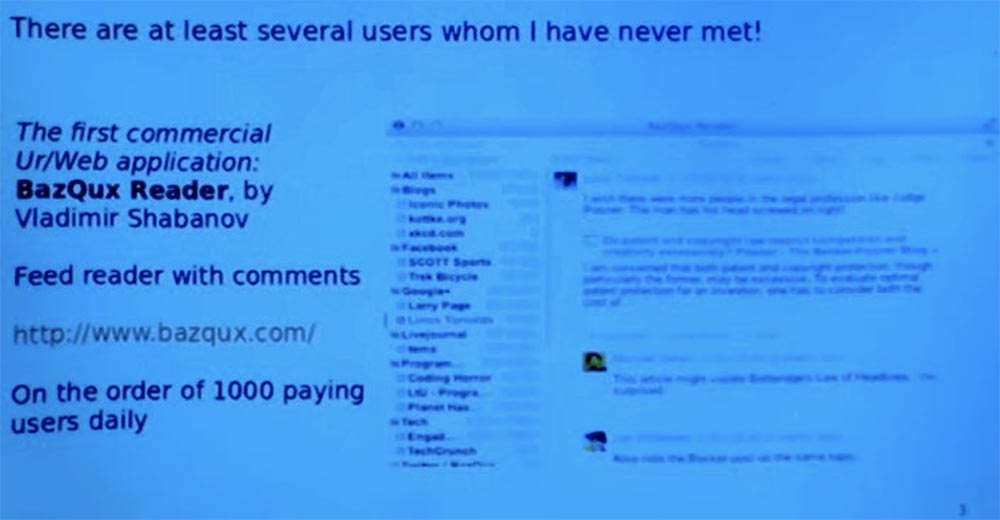

На данный момент уже есть несколько пользователей Ur/Web, правда, их не так много, как тех, кто использует другие языки программирования. Но, по крайней мере, это единственное коммерческое веб-приложение, которое является устройством чтения RSS-каналов и которое поддерживает такие экзотические функции, как отображение комментариев. Также имеется URL-адрес, придуманный не носителем английского языка, который сейчас сожалеет о таком названии. Оно называется BazQux Reader, это комбинация тактических умений сообщества хакеров. У этого приложения уже есть несколько тысяч платных пользователей. И похоже, что с ним намного приятнее иметь дело, чем с тем, что делается с помощью CSS. Это доказательство того, что это можно сделать с помощью Ur /Web.

Не стесняйтесь перебивать меня вопросами в любой момент, хотя я, вероятно, еще не понял, что может вызвать вопросы. Таким образом, основной успех продаж Ur/Web заключается в том, что он имеет очень высокоуровневую модель программирования, которая сильно отличается от Django, о котором вы знаете из материалов предыдущих лекций. И у него хорошая история безопасности.

Некоторые функции, которые вы хотели бы иметь для обеспечения безопасности, уже интегрированы в систему, так что вам не придётся много работать, чтобы обеспечить своей программе безопасность. Я расскажу подробнее об этом в ближайшее время.

Кроме того, этот язык обеспечивает высокую производительность на стороне сервера даже по сравнению с более популярными инструментами для создания веб-приложений, думаю, вы уже слышали об этом. Оговорка состоит в том, что нам, вероятно, будет необходимо усвоить больше идей функциональных языков программирования, таких, как Haskell, перед тем, как начать пользоваться Ur/Web.

Я просмотрел вопросы и ответы для этого занятия, и примерно пятая часть студентов жаловалась на функциональные части программирования, которые трудно выполнить. Я извиняюсь, но в мире функционального программирования так много хороших идей, что было бы трудно не начинать именно с этого момента, постепенно добавляя к нему более сложные вещи. Но я постараюсь не требовать строгого знания материала, о котором буду рассказывать сегодня.

Таким образом, данная модель программирования действительно тесно связана со статической типизацией. И это не просто статическая типизация, как в языке Java, который имеет относительно невыразительную неуклюжую систему типов, а статическая типизация, аналогичная той, что используется в Haskell или Apache Camel. Эта типизация является одним из способов, благодаря которым компилятор 
понимает, что вы делаете, и ловит ошибки в своей программе.

Получается, что основной язык Ur, на котором построен Ur/Web, имеет очень выразительную систему статической типизации. Так что многое из того, что делает Ur/Web, на самом деле обеспечивают библиотеки без специальной поддержки компилятора. Например, мы научили компилятор, как проверять тип SQL-запросов, не создавая при этом правила ввода SQL в компилятор. Oни могут быть закодированы как библиотеки и использовать стандартный тип проверки, чтобы убедиться, что ваши SQL-запросы следуют правилам SQL.

Наиболее актуальным в этом контексте является обеспечение высокого уровня безопасности — большинс��во наиболее распространенных уязвимостей безопасности невозможны при программировании на Ur/Web. Вы можете навсегда распрощаться с атаками внедрения вредоносного кода и атаками межсайтового скриптинга. Вы сможете разрешить страшно выглядящим именам флагов делать самые ужасные вещи, которые только можно сделать в веб-приложении, даже если вы действительно вызываете некую «черную магию», используя функции чужого интерфейса.

Есть несколько других специфичных для безопасности свойств, о которых я расскажу позже. Производительность тоже очень хорошая. Компилятор прежде всего оптимизирован для создания исходного кода для доменов и намного продуктивнее кода, написанного вручную на языке С.

Поэтому он понимает, что делает веб-приложение, и может оптимизировать некоторые вещи, которые не «поймал» бы традиционный компилятор общего типа. Поэтому исходный код, который производит этот компилятор, работающий на сервере, успешно конкурирует с кодом на С. Если сравнить затраты на обеспечение производительности с трудозатратами программирования на других языках, видно, что Ur/Web существенно облегчает жизнь программиста.

На следующем слайде представлен быстрый бенчмарк производительности этого фреймворка для веб-инфраструктуры, выполняемой третьей стороной.

Это скриншот результатов последнего теста, в котором различные задачи веб-программирования выполнялись разными фреймворками.

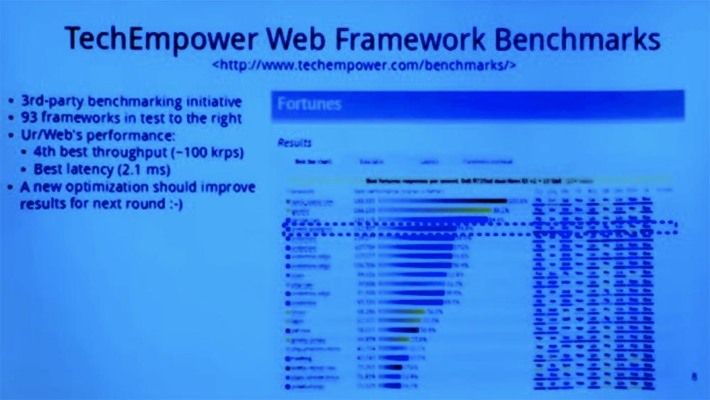

Вы видите, что Ur/Web занял 4-е место из 60-ти фреймворков, участвовавших в тестах производительности. После того, как был сделан этот скриншот, в компилятор были внесены ещё некоторые улучшения. Поэтому я ожидаю, что в следующем раунде по своим результатам он немного продвинется вверх.
 В принципе, это простой пример использования SQL для генерации HTML-страниц. Вы получаете около 100 000 запросов в секунду от Ur /Web-сервера, и это более чем достаточно для большинства приложений. Важно, что этот слайд свидетельствует о том, что вы можете использовать модель высокого уровня, обеспечивающую большую безопасность, слегка проигрывая в производительности более распространённым фреймворкам.

Итак, позвольте мне начать с картинок, отражающих моё впечатление о том, что сегодня программисты думают о написании веб-приложений с помощью наиболее распространённых фреймворков. Затем я покажу другою точку зрения, которую предоставляет Ur/Web и согласно которой, множество вещей, которые могут пойти не так, идут на этом фреймворке без ошибок.

Основная картинка — это веб-сервер, от которого зависит весь процесс вашего приложения. И есть целый парк браузеров, которые собираются взаимодействовать с этим сервером. Сервер будет пребывать в определенном состоянии, которое обеспечивает взаимодействие с ним всех этих браузеров.

Обычная картина состоит в том, что браузер начинает взаимодействовать с веб-сервером, отправив ему HTTP-запрос, который включает в себя встроенные в него URL-адреса. После этого веб-сервер отправляет назад браузеру HTTP и HTML-страницу. При этом имеются некоторые встроенные URL-адреса, которые могут быть использованы для определения, какой запрос должен сделать веб-сервер в будущем.

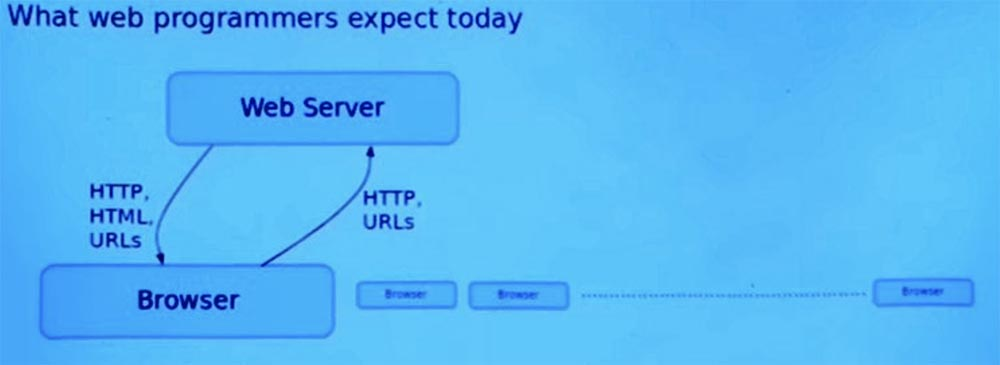

Этот веб-сервер также может общаться с базой данных, которая обеспечивает постоянное хранилище, общее для всех пользователей приложения. При этом используется один популярный SQL протокол для разговоров между сетью сервера и базой данных. Именно об этом я и буду говорить, обсуждая возможности Ur/Web.

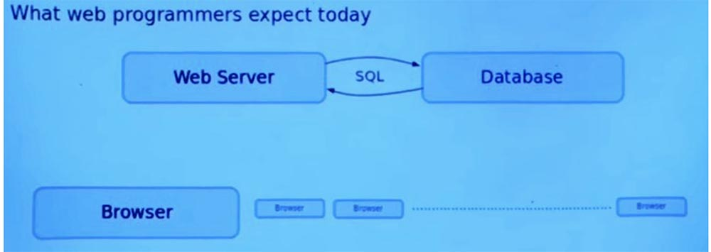

Современные веб-приложения — это не просто одна одномоментная страница. Всякий раз, когда что-либо должно измениться на странице, вы делаете новый запрос на сервер, после чего заменяется вся страница модуля. Существует стиль AJAX, по которому браузер при одном просмотре страницы иногда отправляет веб-серверу дополнительные HTTP-запросы и получает ответы, которые обрабатываются пользовательской программой. При этом обычно используются такие представления данных, как XML и JSON, а также другие простые форматы для обмена данными между клиентом и сервером.

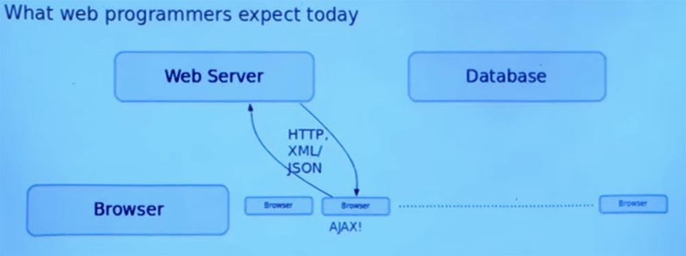

Затем, когда браузер возвращает этот ответ, там выполняется некоторый код JavaScript, который реализует произвольную логику для управления пользовательским интерфейсом, который и показывается пользователю.

Этот код JavaScript может читать ответы, которые сервер даёт на различные вызовы AJAX. Затем он может изменить страницу, которая отображается в основном путем изменения глобальной переменной DOM, которая установлена для страницы. Любая часть программы может произвольно влиять на эту глобальную переменную, которая является страницей. Нередко части страницы просматриваются строковым ID, аннотированным узлами дерева, описывающего документ.

И, наконец, еще одно осложнение заключается в том, что иногда мы хотим, чтобы веб-сервер связывался с браузером без запроса. Допустим, появилось новое сообщение электронной почты, и веб-сервер хочет сообщить браузеру об этом новом сообщении.

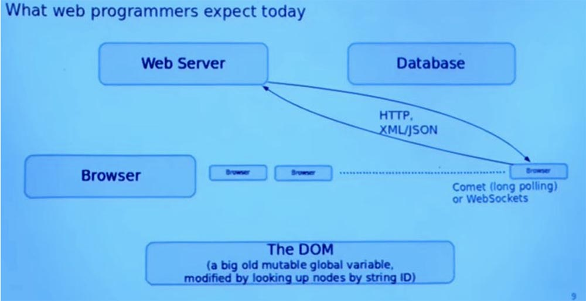

И существует множество способов сделать это, например, Comet — модель работы веб-приложения, при которой постоянное HTTP-соединение позволяет веб-серверу отправлять данные браузеру без дополнительного запроса со стороны браузера, или протокол дуплексной связи WebSockets, который осуществляет связь между браузером и сервером в режиме реального времени. В принципе это одни и те же вещи, но в концептуально разном направлении.

Итак, я хочу вернуть на экран все эти протоколы и языки, предварительно выделив некоторые части жёлтым цветом. Прочитав конспект лекции, кто-нибудь догадался, что общего между всеми этими выделенными частями с точки зрения безопасности?

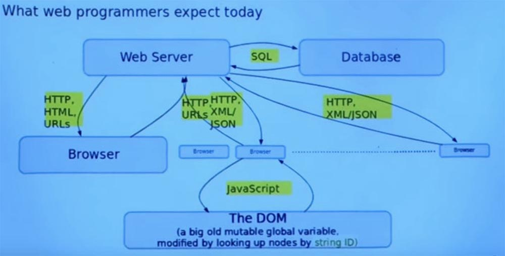

**Студент:** все они представляют собой строки, в которых можно разместить что угодно.

**Профессор:** правильно, в общепринятом подходе к программированию веб-приложений все эти вещи строковые. И язык программирования не понимает, как вы используете их, поэтому не может помочь вам избежать ошибок. Так, например, представляя эти вещи в виде строк, вы получаете атаки с внедрением кода. Насколько я могу судить, атаки с внедрением кода в основном являются следствием включения в качестве примитива в ваш язык программирования или ваш фреймворк некой функции, запускающей программы в виде текста на достаточно выразительном языке.

В Ur/Web нет встроенного интерпретатора для выполнения строк как программ. И это делает конструктивно невозможным множество самых распространенных ошибок веб-приложений. Так что все эти выделенные объекты будут либо невидимы, либо представлены специальными типами, что дает понять, с каким кодом вы имеете дело. При этом у вас нет никакого автоматического приведение строк в любой из этих специальных типов.

Сейчас на слайде показана альтернативная модель, которую предоставляет Ur/Web и которая компилируется в традиционную модель. Так это работает во всех широко распространенных браузерах. Но программист может думать об этом на более высоком уровне и избегать потенциальных ошибок, которые были возможны в предыдущей картине.

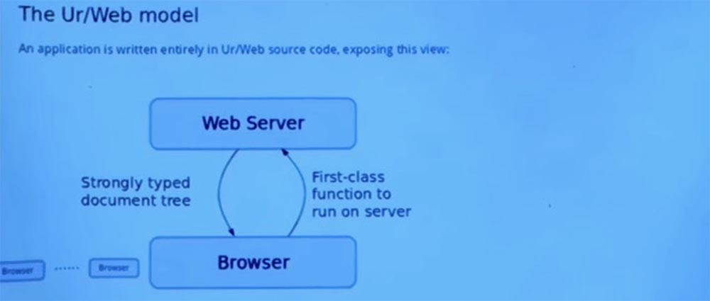

Таким образом, у нас все еще есть веб-сервер, который отвечает на запросы. И мы все еще имеем этот парк браузеров, которые пытаются использовать веб-сервер. Но первое важное отличие состоит в том, что, когда браузер хочет начать пользоваться веб – приложением, то он не просто отправляет строку HTTP-запросов с URL-адресом.

Он запускает на сервере функцию первого класса без участия вызова клиента. И тогда сервер отвечает не просто строкой текста протокола HTTP, а строго типизированным деревом документов. Таким образом, вместо строки HTML, у нас имеется дерево, на языке программирования — объект первого класса. И программа манипулирует именно этим деревом, а не строкой.

Каждое из этих деревьев содержит в себе ссылки, которые сами по себе являются просто сносками для других функций, которые можно вызвать на сервере. Когда пользователь нажимает на эти ссылки, браузер выбирает функцию и концептуально вызывает ее на сервере, как оригинальную функцию, которую мы вызвали, чтобы добраться до этой точки.

Ещё у нас есть интерфейс базы данных, к которому обращается веб-сервер, посылающий запросы базе данных. В модели Ur/Web это не просто текст, а строго типизированные деревья SQL-синтаксиса. И тогда база данных ответит не текстом, а списком записей собственных значений на языке программирования Ur, с которым мы работаем.

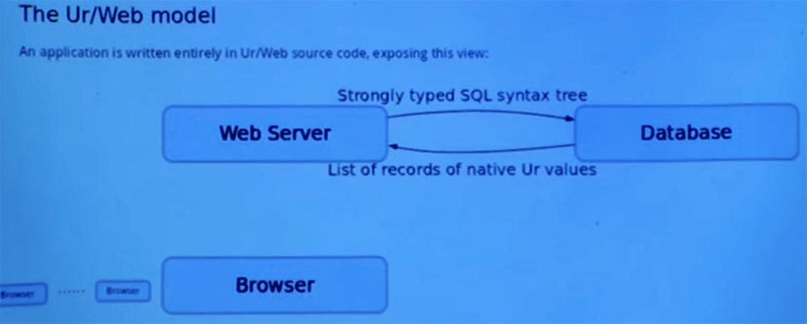

Поэтому нам не нужно беспокоиться о неправильной конвертации строк в «родные» представления или о конвертации «родных» представлений в любой другой формат, который традиционно может предоставлять нам база данных.

Это ключевой элемент того, как семантика Ur /Web облегчает программистам работу с большим количеством сценариев, которые действительно могут произойти во время работы приложения.  
Существует стандартная идея транзакций в мире реляционных баз данных, где вы можете выполнять серию операций без прерывания их другими параллельными потоками. И Ur/Web адаптирует эту модель и встраивает ее в семантику языка. Поэтому, когда одна функция выполняется на сервере от имени клиента, все её доступы к базе данных происходят в виде атомарного блока без какого-либо перерыва, вызываемого всеми другими одновременными запросами к тому же самому серверу. Вы не сможете избежать такого поведения, даже если захотите, поскольку эти транзакции встроены в язык программирования.

И они действительно облегчают выполнение параллельных запросов и потенциально помогают избежать вопросов безопасности, которые возникают, когда происходит некоторое чередование определённых сочетаний запросов.

Я хочу получить ответ на один из вопросов, представленных в конспекте этой лекции и которой меня заинтриговал. Итак, Ur/Web определяет, когда транзакция завершается с ошибкой из-за такой проблемы параллельного исполнения, как тупик, и автоматически перезапускает транзакцию. Кто-то, отвечая на вопросы, написал, что это может облегчить запуск атак безопасности, которые зависят от сбоя транзакции по причине проблем параллелизма. Я просто хотел спросить класс, может ли кто-нибудь привести пример такой атаки, как вы её себе представляете? Если у вас есть система, которая автоматически перезапускает транзакции в тупиковых ситуациях, как это может вызвать проблемы с безопасностью? У меня нет ответа на этот вопрос, вот почему я спрашиваю. Этот вопрос может иметь настолько неочевидный ответ, что его явно стоит обсудить.

**Студент:** возможно, подобное может вызвать какой-то отказ сервиса DoS? Если он собирается перезапустить транзакцию, которую вы отправляете, и вы знаете, что это не удастся, вы можете просто продолжать перезапускать этот процесс и повторять попытки…

**Профессор:** хорошо, продолжай…

**Студент:** если вы принуждаете систему делать то, что как вы знаете, ей никогда не удастся, вы можете снова и снова повторять попытки, и, в конце концов, вызываете отказ сервиса.

**Профессор:** правильно, но для того, чтобы это сделать, вам нужно, по крайней мере, два потока, работающих одновременно. Хотя потенциально это может сработать и вы сможете запустить атаку типа «отказ сервиса». При этом можно воспользоваться тем, что обработчики запросов перезапускаются снова и снова и преднамеренно вызывают конфликт, и использовать это как способ усилить мощность атаки DoS помимо того, что вы можете получить с помощью традиционной модели атаки этого типа. Хорошо, в это я могу в это поверить.

**Студент:** это единственный способ вызвать сбой транзакции?

**Профессор:** да, это единственный способ вызвать сбой и автоматический перезапуск.

**Студент:** возможно, существует третья сторона, которая бы условно потерпела неудачу. Тогда вы могли бы использовать это для мониторинга поведения других пользователей.

**Профессор:** вам также понадобится способ наблюдать за тем, что кто-то потерпел неудачу, но вы будете в состоянии сделать это только спустя какое-то время. Однако подобное тоже может стать проблемой. Вы можете использовать сторонний канал для того, чтобы видеть, что делают другие потоки, потому что их действия могли бы или не могли бы создать конфликт в вашей теме. Это в принципе возможно, но уж очень замысловато. Я не уверен, что такое возможно, потому что трудно придумать конкретную атаку, которая сработает предсказуемо. Но это может быть забавным тестом для проверки безопасности.

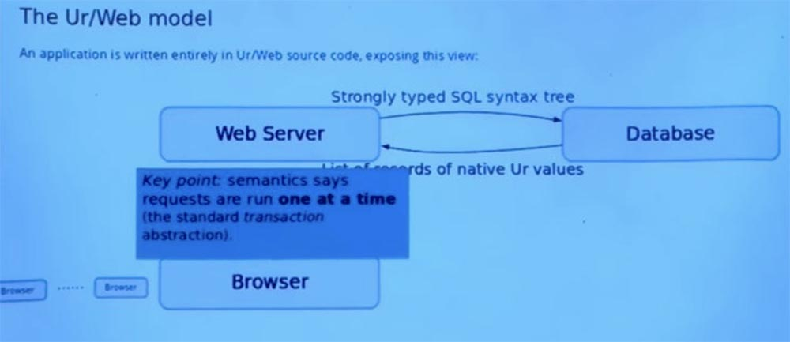

**Студент:** транзакции, которые вы запускаете для каждого поступившего запроса, вы запускаете и для кода, который выполняется на сервере. Но когда вы отправляете этот код в базу данных, не превращается ли это в транзакцию базы данных?

**Профессор:** да, это так, всё выполнение на стороне сервера упаковывается в одну транзакцию базы данных, если приложение использует базу данных.

**Студент:** итак, если у вас есть неудачная транзакция, то вы говорите базе данных, что позже ничего не будет обновлено? Потому что предположительно, база данных ничего не знает о неудаче транзакции.

**Профессор:** да, поэтому компилятор делает статический анализ и определяет транзакции, предназначенные только для чтения. Это создает транзакцию в режиме только для чтения, который в некоторых системах баз данных позволяет выполнить дополнительную оптимизацию.

**Студент:** как насчет того, что некоторые вещи, которые вы читаете, не влияют на то, что вы собираетесь писать, но другие читаемые вами вещи могут повлиять на это?

**Профессор:** вы спрашиваете, можем ли мы использовать наши знания семантики приложения, чтобы подсказать системе базе данных, что некоторые вещи, выглядящие как нарушения параллелизма, на самом деле таковыми не являются и нам не нужно перезапускать систему? Я думаю, что ответ буде краток – нет, текущая реализация языка этого не делает. Но это было бы интересно рассмотреть в дальнейшем. Я думаю, что это потребует изменения движка базы данных, а не только интерфейса языка программирования.

**Студент:** обычно вы можете разделить это на две отдельные транзакции, или возможно, вы можете сделать так при определённых обстоятельствах?

**Профессор:** да, это звучит трудным для осуществления, но потенциально это полезно. Правда, я не могу сказать, какая часть приложений может воспользоваться этим, но это аккуратная идея. Итак, транзакция – это великая вещь.

Я как раз рассказывал вам о старой школьной модели браузера, запрашивающей страницы с веб-сервера. Мы также можем осуществить этот процесс в стиле AJAX, который в основном выглядит как код на стороне клиента.

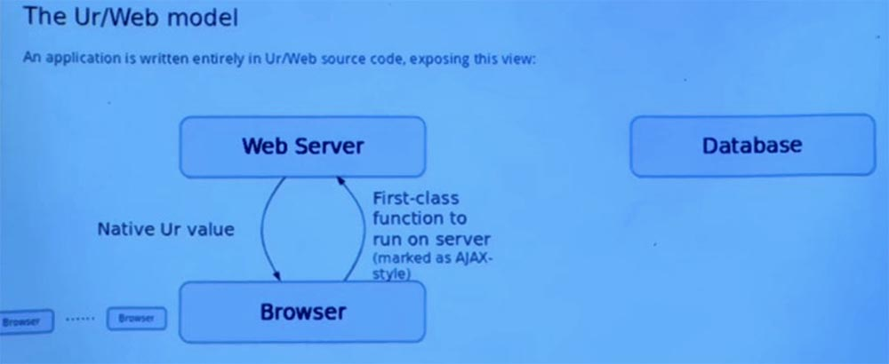

Это вызов функции, помеченной для запуска на сервере. Когда он завершается, результат возвращается в клиентском коде и получается просто родное значение на языке программирования. Вам не нужно беспокоиться о том, чтобы каким-то образом превратить его в строку и перетранслировать из строки обратно.

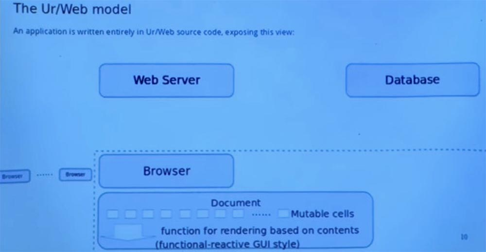

После этого мы должны принять результат и использовать его для изменения страницы, которую видит пользователь. В противном случае, это был бы не очень полезный запрос.

Таким образом, модель в Ur/Web сильно отличается от стандартной объектной модели документа, которую браузеры предоставляют напрямую. Основная идея — это функциональное реактивное программирование, я не буду пытаться объяснить это слишком подробно. Потому что я знаю, что это требует нетривиального внезапного функционального программирования, даже если мы отрежем эту реактивную часть. Но основная идея — это документ, который описывается набором изменяемых ячеек, которые являются своего рода данными и от которых зависит страница.

И сама страница — это нечто другое, которое описывается как функция, принимающая в качестве входных данных значения этих ячеек, а затем вычисляющая страницу. Далее система языка в процессе работы наблюдает за изменениями этих изменяющихся ячеек, и когда они изменяются, она автоматически вычисляет последствия для отображаемой страницы и эффективно обновляет только ту часть страницы, которая изменилась на основе этих ячеек.

На каждом клиенте может быть одновременно запущено много разных потоков. Эти потоки рождаются в Ur/Web-коде и сами запускают Ur/Web-код. Но компилятору нужно перевести их на язык JavaScript, чтобы браузер мог их запустить. Так что это один из видов сервисов, предоставляемых компилятором. Это важный момент в потоках.

Другим ключевым моментом является то, что потоковая обработка на стороне клиента следует тому, что называется совместной многопоточной моделью. Поток не должен волноваться о том, что может быть вытеснен другим потоком в произвольную точку. Есть четко определенные операции, которые сигнализируют, что все в порядке для того, чтобы переключиться здесь на ещё один поток. Одна из таких операций осуществляет удаленный вызов функции на сервере, или, например, просит замереть на определенное количество миллисекунд.

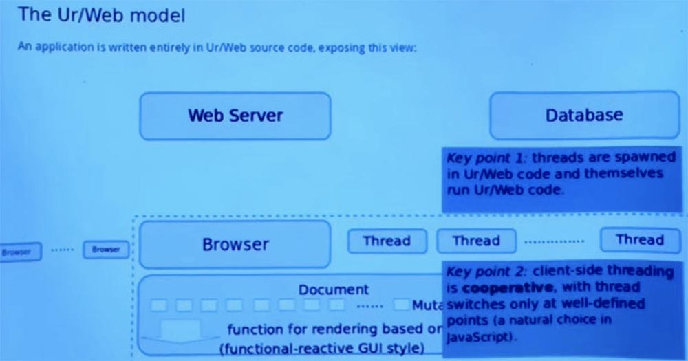

Но обычный код не может быть остановлен произвольно. Это означает, что программисту не нужно думать о множестве чередований, и легче убедить себя, что, мол, конкретный кусок кода позволяет избежать некоторых проблем безопасности и ошибок. Потому что вы можете более легко перечислить все возможные способы взаимодействия двух потоков друг с другом. Это своего рода естественная модель для использования, учитывая то, как обычно реализуется JavaScript.

В языке JavaScript и браузерах пока еще нет вытеснения, так что это просто представление потоковой абстракции поверх модели, основанной на обратных вызовах, которую JavaScript напрямую показывает программисту.

И последняя часть, которая является одной из встроенных абстракций, используемых Ur/Web-приложениями — это каналы для передачи сообщений между различными машинами. Таким образом, каждый канал имеет тип, который выражает, какие данные могут по нему передаваться. Вам не нужно конвертировать данные в строки и обратно или превращать их в текстовый формат обмена данными JSON. Эти каналы могут жить в базе данных.

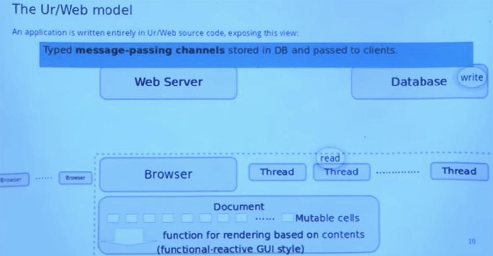

Представьте, что эта картинка показывает нам, где находится созданный канал. У него есть сторона записи и сторона чтения, которая может пойти в разные места. Конец записи находится в базе данных. А прочитанный конец как-то проделывает путь к клиенту и находится в переменной среде потока.

Итак, представим, что поток ранее сделал удаленный вызов на сервер, который создал канал, вернул его клиенту и поместил в базу данных за одну транзакцию. Так что позже сервер решает: «хорошо, я запрошу этот канал из базы данных и добавлю в него значение», и оно как бы выскакивает с другого конца канала на клиента. И все в этой системе «завязано» на подобном процессе.

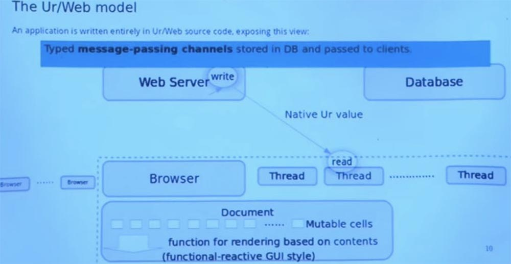

Думаю, это был последний шаг в демонстрации моих картинок. Есть у вас вопросы об этой модели, прежде чем я переключусь на демонстрацию кода?

**Студент:** зачем нужно прохождения сообщения, если запрос автоматически обрабатывается сервером?

**Профессор:** RPC интерфейс собирается инициировать вызов из браузера, а сервер его обрабатывает. Сообщение возникает в случае, когда сервер сам инициирует коммуникацию.

Канонический пример — это новое сообщение электронной почты, которое ожидает клиент. Он не может определить сам, когда будет доступно новое сообщение, поэтому сервер автоматически отправляет его.

**Студент:** все сообщения мультиплексируются через одно соединение или через разные соединения?

**Профессор:** они все мультиплексируются через HTTP-соединение. Я знаю, что есть эти новомодные вещи под названием веб-сокеты и, возможно, некоторые другие протоколы, но здесь все работает по старомодному HTTP с одним соединением для всех сообщений по разным каналам.  
Итак, посмотрим, что будет дальше. Давайте я переключусь на демонстрацию. Итак, вас приветствует программа Ur/Web. Как видите, пока что ничего страшного.

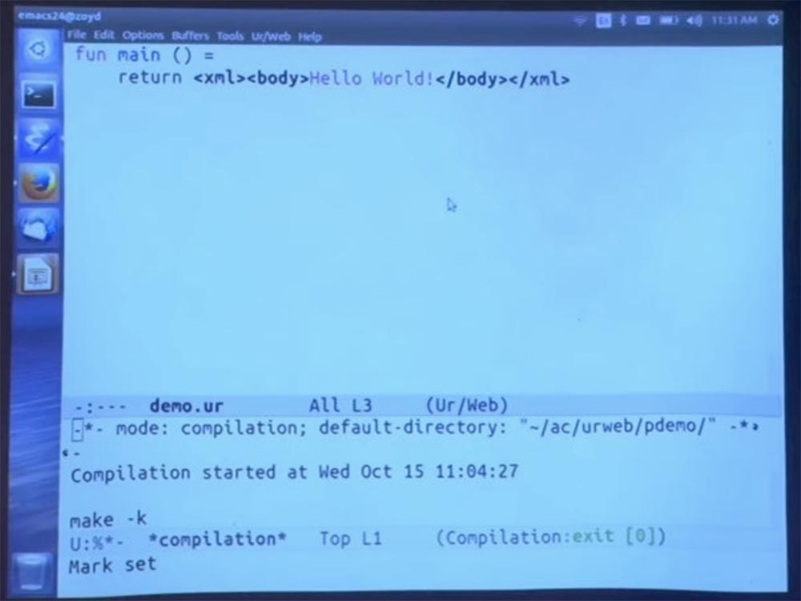

Необычным здесь может быть то, что это действительно целая программа. Там нет дополнительной логики маршрутизации, объясняющей, как сопоставить URL-адрес с кодом для выполнения запросов к этому URL-адресу. Мы имеем только штатные функции стандартного языка программирования. И компилятор предоставляет все функции в главном модуле, который вызывается через URL.

URL просто формируется из имени функции. И если есть какая-то вложенная модульная структура, она также реплицируется в URL. Затем у нас есть функция, которая возвращает HTML синтаксис. Компилятор использует специальное расширение для парсинга синтаксиса HTML. Он также выполняет некоторые основные проверки чтобы убедится, что различные XML-элементы, которые отображаются внутри других, фактически авторизованы для подобного отображения.

Я сделал кое-что заранее, и оно не делает в браузере ничего удивительного. Так выглядит HTML-страница и среди других свойств, она автоматически добавляет заголовок страницы и объявляет кодировку символов для этого документа.

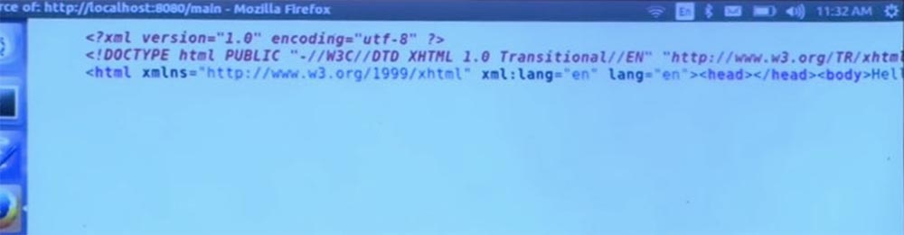

Я был слегка шокирован, глядя на некоторые книги, предназначенные для чтения на этом курсе. Я удивлён, сколько времени в них тратится на разговоры о кодировках символов и что произойдет, если вы не будете использовать кодировку UTF-8. Надеюсь, я правильно это понял.

Я надеюсь, они заставляют вас использовать UTF-8, чтобы не происходило никаких ужасных вещей. Но если кто-то видит способ воспроизвести любую из атак, описанной в книге Tangled Web (Запутанный Интернет), на сервере Ur/Web, мне было бы интересно услышать, каким образом он собирается это проделать.

Кстати, в любой момент этой демонстрации, пожалуйста, предлагайте эксперименты, которые приходят вам в голову, чтобы мы могли опробовать на моей системе, какого рода ошибки она способна ловить.

Я думаю, что это самый продуктивный способ демонстрации возможностей Ur/Web.

27:45 мин

[Курс MIT «Безопасность компьютерных систем». Лекция 11: «Язык программирования Ur/Web», часть 2](https://habr.com/company/ua-hosting/blog/425999/)

Полная версия курса доступна [здесь](https://ocw.mit.edu/courses/electrical-engineering-and-computer-science/6-858-computer-systems-security-fall-2014/).

Спасибо, что остаётесь с нами. Вам нравятся наши статьи? Хотите видеть больше интересных материалов? Поддержите нас оформив заказ или порекомендовав знакомым, **30% скидка для пользователей Хабра на уникальный аналог entry-level серверов, который был придуман нами для Вас:** [Вся правда о VPS (KVM) E5-2650 v4 (6 Cores) 10GB DDR4 240GB SSD 1Gbps от $20 или как правильно делить сервер?](https://habr.com/company/ua-hosting/blog/347386/) (доступны варианты с RAID1 и RAID10, до 24 ядер и до 40GB DDR4).

**VPS (KVM) E5-2650 v4 (6 Cores) 10GB DDR4 240GB SSD 1Gbps до декабря бесплатно** при оплате на срок от полугода, заказать можно [тут](https://ua-hosting.company/vpsnl).

**Dell R730xd в 2 раза дешевле?** Только у нас **[2 х Intel Dodeca-Core Xeon E5-2650v4 128GB DDR4 6x480GB SSD 1Gbps 100 ТВ от $249](https://ua-hosting.company/serversnl) в Нидерландах и США!** Читайте о том [Как построить инфраструктуру корп. класса c применением серверов Dell R730xd Е5-2650 v4 стоимостью 9000 евро за копейки?](https://habr.com/company/ua-hosting/blog/329618/)