Курс MIT «Безопасность компьютерных систем». Лекция 11: «Язык программирования Ur/Web», часть 2 / Блог компании ua-hosting.company

### Массачусетский Технологический институт. Курс лекций #6.858. «Безопасность компьютерных систем». Николай Зельдович, Джеймс Микенс. 2014 год

Computer Systems Security — это курс о разработке и внедрении защищенных компьютерных систем. Лекции охватывают модели угроз, атаки, которые ставят под угрозу безопасность, и методы обеспечения безопасности на основе последних научных работ. Темы включают в себя безопасность операционной системы (ОС), возможности, управление потоками информации, языковую безопасность, сетевые протоколы, аппаратную защиту и безопасность в веб-приложениях.

Лекция 1: «Вступление: модели угроз» [Часть 1](https://habr.com/company/ua-hosting/blog/354874/) / [Часть 2](https://habr.com/company/ua-hosting/blog/354894/) / [Часть 3](https://habr.com/company/ua-hosting/blog/354896/)  
Лекция 2: «Контроль хакерских атак» [Часть 1](https://habr.com/company/ua-hosting/blog/414505/) / [Часть 2](https://habr.com/company/ua-hosting/blog/416047/) / [Часть 3](https://habr.com/company/ua-hosting/blog/416727/)  
Лекция 3: «Переполнение буфера: эксплойты и защита» [Часть 1](https://habr.com/company/ua-hosting/blog/416839/) / [Часть 2](https://habr.com/company/ua-hosting/blog/418093/) / [Часть 3](https://habr.com/company/ua-hosting/blog/418099/)  
Лекция 4: «Разделение привилегий» [Часть 1](https://habr.com/company/ua-hosting/blog/418195/) / [Часть 2](https://habr.com/company/ua-hosting/blog/418197/) / [Часть 3](https://habr.com/company/ua-hosting/blog/418211/)  
Лекция 5: «Откуда берутся ошибки систем безопасности» [Часть 1](https://habr.com/company/ua-hosting/blog/418213/) / [Часть 2](https://habr.com/company/ua-hosting/blog/418215/)  
Лекция 6: «Возможности» [Часть 1](https://habr.com/company/ua-hosting/blog/418217/) / [Часть 2](https://habr.com/company/ua-hosting/blog/418219/) / [Часть 3](https://habr.com/company/ua-hosting/blog/418221/)  
Лекция 7: «Песочница Native Client» [Часть 1](https://habr.com/company/ua-hosting/blog/418223/) / [Часть 2](https://habr.com/company/ua-hosting/blog/418225/) / [Часть 3](https://habr.com/company/ua-hosting/blog/418227/)  
Лекция 8: «Модель сетевой безопасности» [Часть 1](https://habr.com/company/ua-hosting/blog/418229/) / [Часть 2](https://habr.com/company/ua-hosting/blog/423155/) / [Часть 3](https://habr.com/company/ua-hosting/blog/423423/)  
Лекция 9: «Безопасность Web-приложений» [Часть 1](https://habr.com/company/ua-hosting/blog/424289/) / [Часть 2](https://habr.com/company/ua-hosting/blog/424295/) / [Часть 3](https://habr.com/company/ua-hosting/blog/424297/)  
Лекция 10: «Символьное выполнение» [Часть 1](https://habr.com/company/ua-hosting/blog/425557/) / [Часть 2](https://habr.com/company/ua-hosting/blog/425561/) / [Часть 3](https://habr.com/company/ua-hosting/blog/425559/)  
Лекция 11: «Язык программирования Ur/Web» [Часть 1](https://habr.com/company/ua-hosting/blog/425997/) / [Часть 2](https://habr.com/company/ua-hosting/blog/425999/) / [Часть 3](https://habr.com/company/ua-hosting/blog/426001/)

Немного позже я расскажу вам про подделку межсайтовых запросов. Думаю, конспект лекции объясняет, почему в нашем случае межсайтовый скриптинг не срабатывает. Причина в том, что всякий раз, когда вы создаёте «кусок» синтаксиса, это объект, дерево, и разные части этого дерева не просто строки.

Вы не можете случайно превратить строку пользователя в дерево структуры, это не происходит автоматически, потому что трудно написать подобный переводчик. Но вы можете попытаться написать переводчик для Ur/Web. Скоро я приведу пример, который поможет уменьшить вашу озабоченность по этому поводу. Я хочу показать вам, во что на самом деле превращается этот синтаксис в компиляторе.

Может показаться, что мы могли бы просто добавить двойные кавычки вокруг HTML, чтобы затем вернуться в нормальный мир. Можно задаться вопросом, почему так важно пропускать двойные кавычки, размещая вместо этого XML?

Можете поверить мне на слово, что это эквивалентный код для того, что он делает. Вот тег встроенной функции, которая создает узел дерева HTML-документа. Далее я размещаю аргументы, которые выражают стиль CSS в этом узле. Здесь на самом деле, ничего не происходит, так что имеется множество разных способов сказать «None», это не требует никаких атрибутов.

Далее я помещаю тег body, это еще одна вещь из стандартной библиотеки. Все стандартные теги представляют собой в библиотеке функции первого класса.

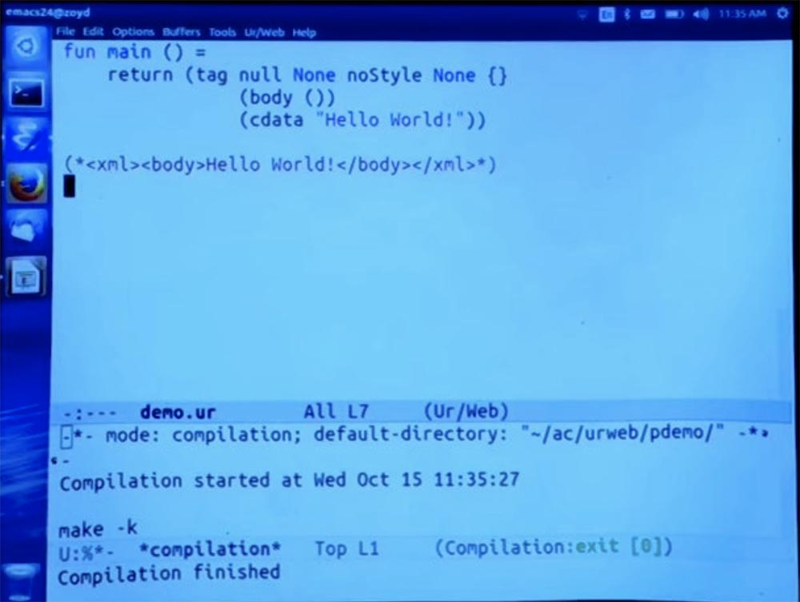

Далее нам нужно поместить в тело текст «Hello World», поэтому мы вызываем функцию cdata, где cdata — это слово XML для символьных данных или просто строковая константа, и можем разместить здесь текст. Это должно дать нам тот же результат, что и раньше. Посмотрим, сработает ли это.

Теперь я вернусь обратно на страницу. Мы видим то же самое, что и раньше, так что это то же, что функция делала в начале.

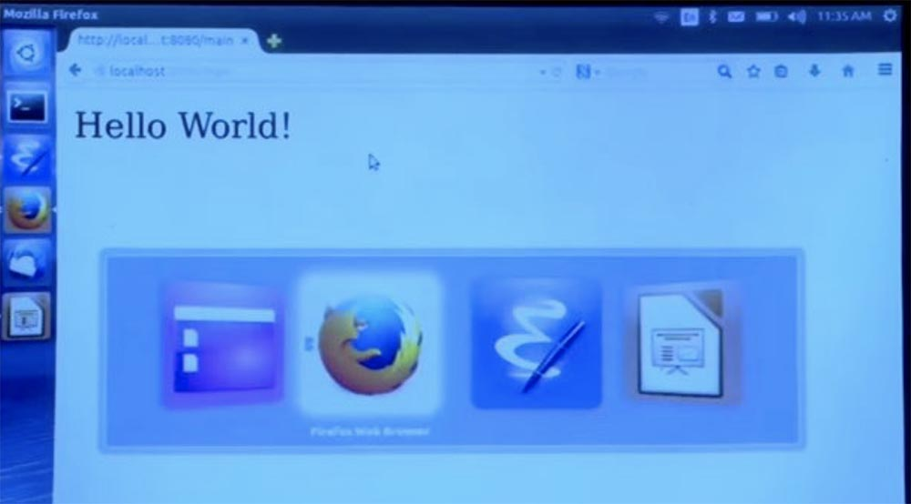

Это не просто построение строки. Это вызывает ряд операций, которые разработаны так, что только они позволяют создавать допустимый HTML, и они никогда неявно не смогут интерпретировать строку как код вместо того, чтобы просто разместить на странице содержание, которое должно там находиться.

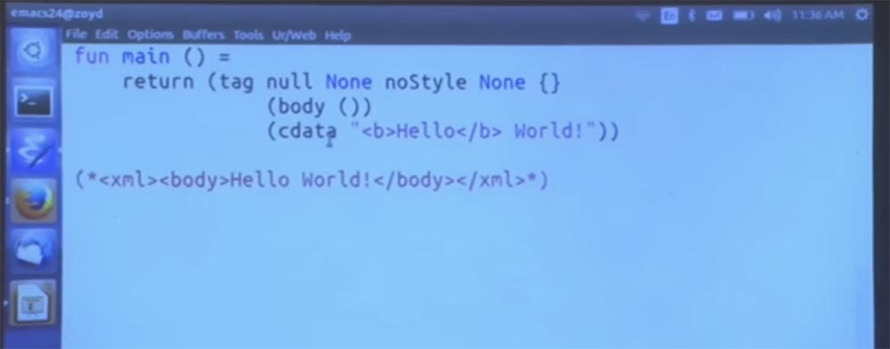

Сейчас я попробую сделать что-то менее сложное, что потенциально может вызывать обеспокоенность. Давайте решим, что мы действительно рады видеть мир, поэтому выделим слово «hello» жирным шрифтом и скомпилируем его снова.

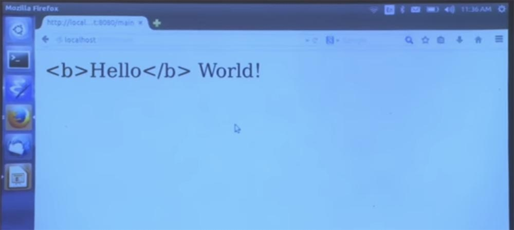

Вы видите, что произошло на странице – слово не стало жирным, потому что компилятор показывает, как интерпретируется текст вместо разметки. Это представление синтаксиса HTML как функции, которая строит синтаксис, не имея встроенных в неё обычных синтаксических соглашений кодирования. Эта функция интерпретирует все так, как вы хотели написать, ничего от себя не додумывая.

Таким образом, реализация cdata делает то, что обычно называют escaping, или «бегством». Но программисту не нужно знать, что есть такая вещь, как escaping. Вы можете думать об этом, как о наборе удобных функций для создания дерева объекта, который описывает страницу.

Я слышу, что вы хотите увидеть HTML-код, который здесь генерируется. Ладно, это будет не самая захватывающая вещь. Я попробую увеличить его на экране, но тогда он не уместится на одной линии.

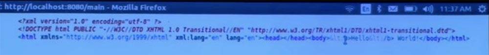

**Студент:** учитывая, что вы используете XHTML, не могли бы вы просто использовать путь для символьных данных cdata вместо того, чтобы делать это вручную?

**Профессор:** наверное, но это потребовало бы от меня больших знаний XML, чем те, что у меня есть. Был еще один хороший вопрос об URL JavaScript. Если мы разрешаем URL JavaScript, то создаём бэкдор для автоматической интерпретации строк как программ во время выполнения. И это вызывает всевозможные проблемы.

Давайте попробуем этого избежать. Я переключусь обратно, прежде всего, на укороченную версию, и сделаю внутри body несколько строк. И давайте ещё поставим ссылку, которая попытается сделать что-то соответствующее. Здесь мы оставим место для сообщений об ошибках.

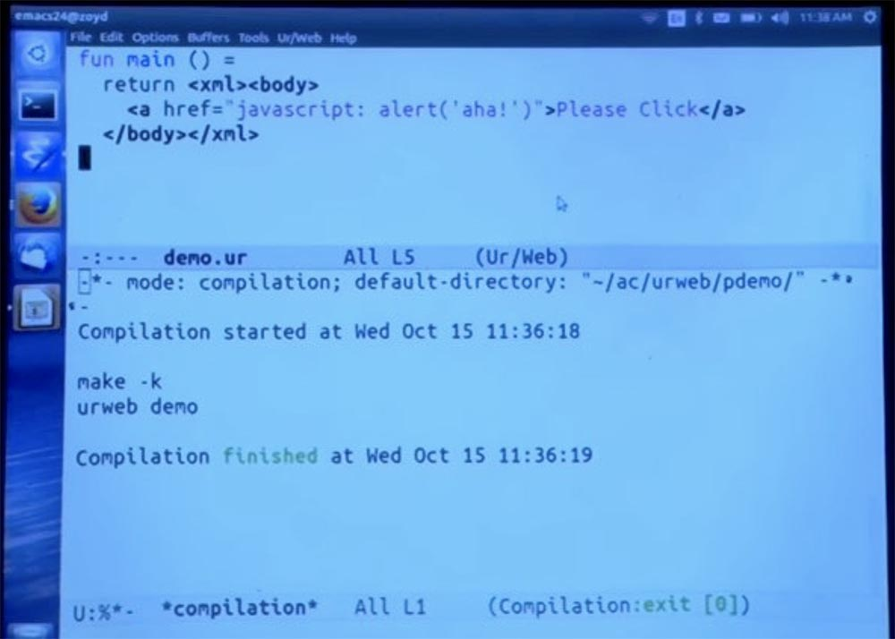

Далее запустим компилятор и посмотрим, как это работает.

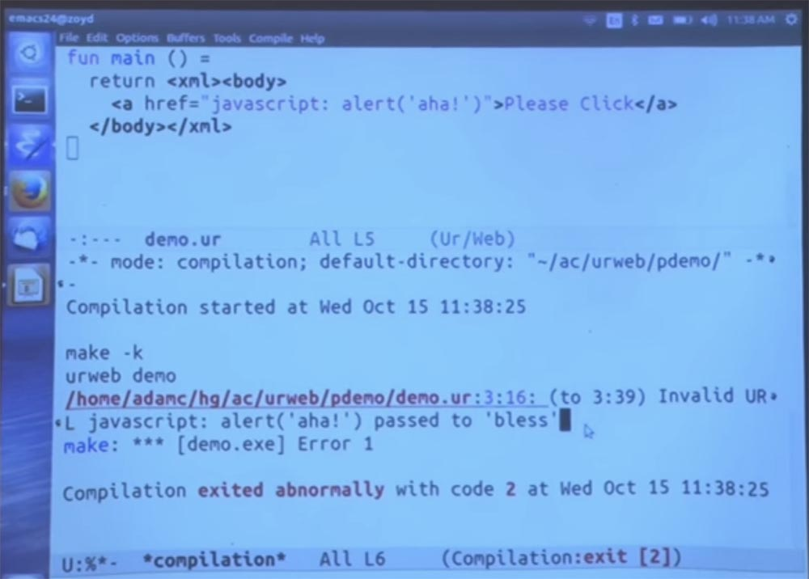

Неверный URL, далее запись JavaScript и фраза «passed to bless», или «прошло благословление». Bless встроено в функцию, которая является привратником, разрешающим URL. По умолчанию URL-адреса не разрешены, так что, конечно, данный вариант не допускается. И вообще, это плохая идея — писать свою политику URL, чтобы вы могли создавать значения, представляющие URL-адреса JavaScript. Потому что потом потребуются всякие гарантии, из-за того, что эти адреса могут быть недействительными.

Чтобы было немного яснее, как это работает, позвольте мне разложить этот код на отдельную функцию, вызывающую компоновщик, который принимает URL. Таким образом, URL является типом, а не строкой. Это тип, который обозначает URL-адрес, что явно разрешено политикой вашего приложения.

Я использую фигурные скобки, как в некоторых популярных фреймворках шаблонов HTML, для обозначения вставки некоторого кода из языка хоста внутри HTML, который мы создаем. И все это делается таким образом, что тип проверяется статически. Так что система проверит: «да, это то место, которому принадлежит URL, и оно говорит, что это действительно URL, так что все нормально».

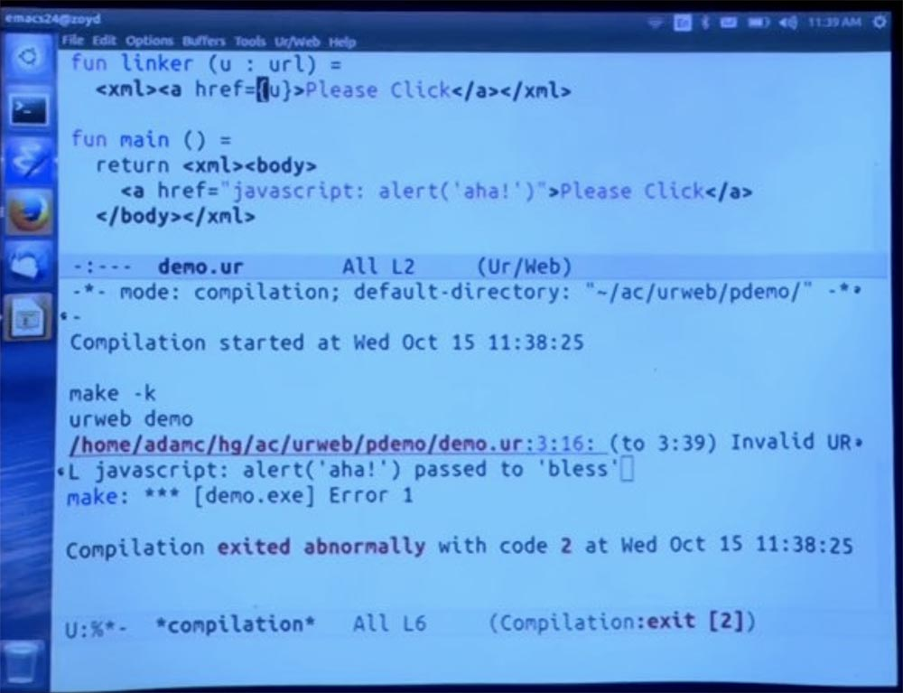

И тогда я могу явно расположить вызов bless, сказав: «давайте просто вызовем здесь функцию компоновщика по результатам «благословения» этого URL». После этого мы должны получить то же сообщение об ошибке, что и раньше.

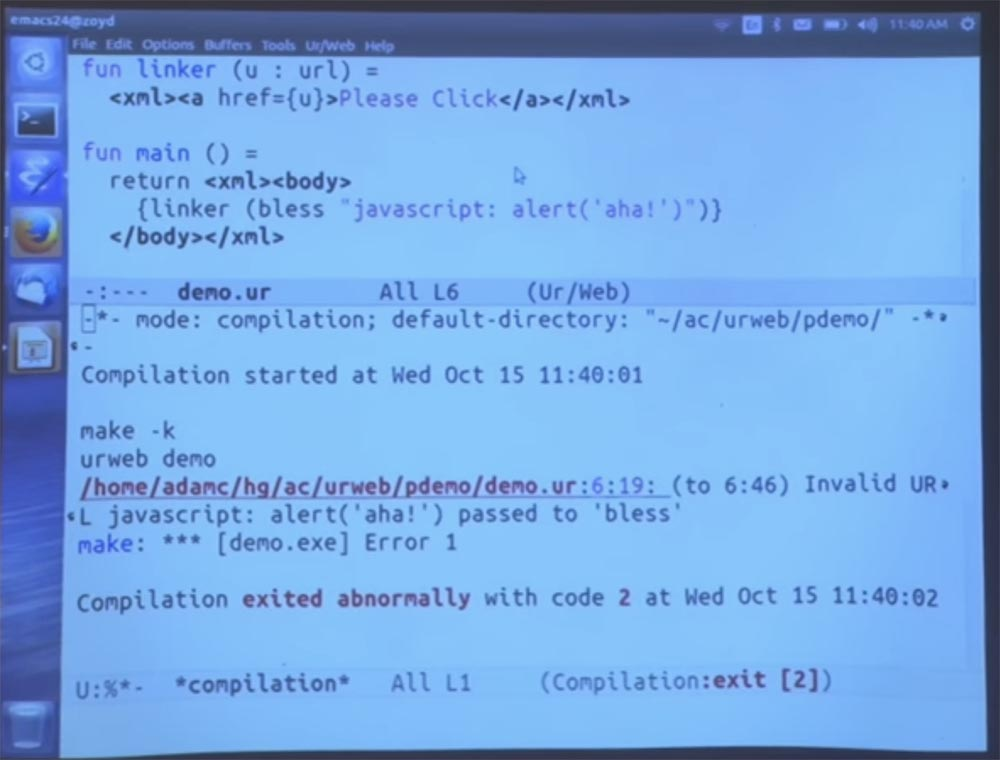

К сожалению, я не могу запустить это для вас и ждать выполнения, пока не произойдёт сбой, но могу сказать, что это определенно потерпит неудачу, потому что я умышленно сделал ошибку компилятора. Этот URL не будет принят политикой URL.

Если бы я пропустил этот вызов bless, то это была бы более серьёзная ошибка во время компиляции, потому что у вас есть строка и нужный URL, и они разных типов.

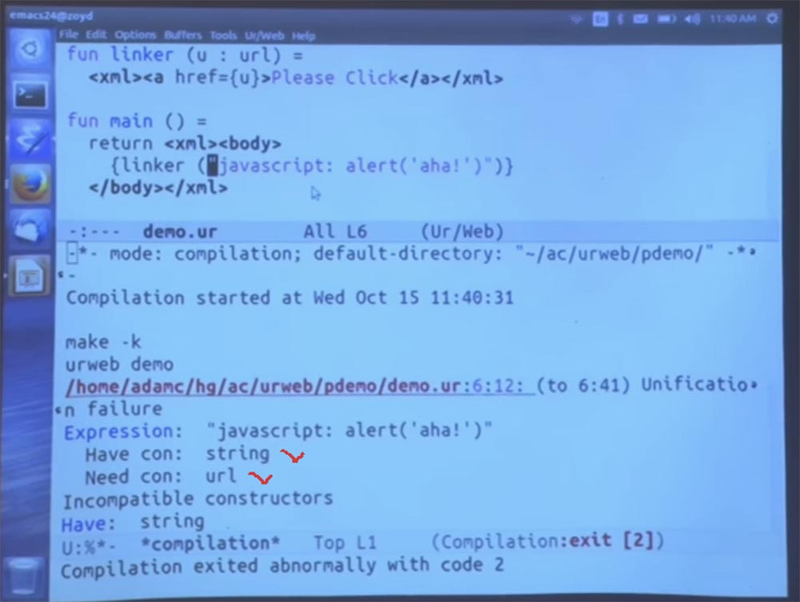

Давайте сделаем это более интересным. Я собираюсь открыть файл конфигурации для этой демонстрации. Он довольно короткий, по крайней мере, если вы посмотрите на любой фреймворк для веб-приложений на Java. У них имеются эти гигантские XML файлы для конфигурации, так что у нас всё намного лучше.

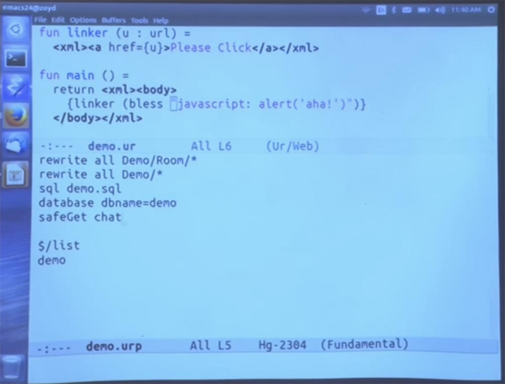

Мы можем добавить правило, которое гласит, что все, что есть в Википедии, разрешено, а затем поместить в теле URL – адрес Википедии.

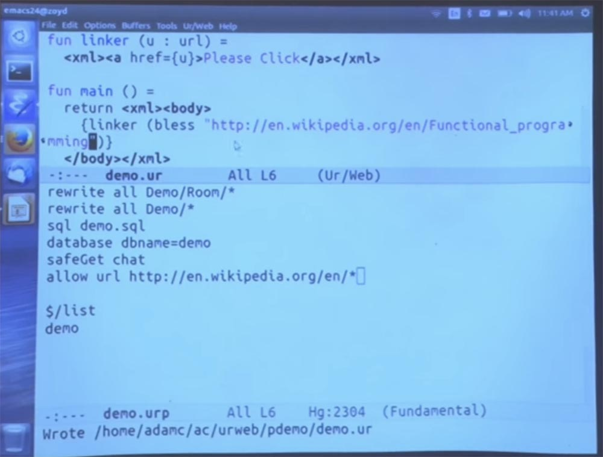

Теперь перейдём на страницу и нажмём Please Click.

Вот что у нас появилось: адрес Википедии не найден.

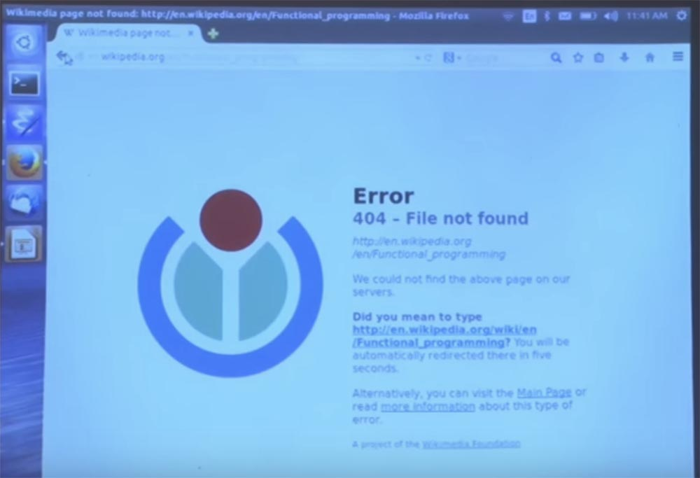

Итак, главная идея в том, чтобы иметь абстрактный тип URL, вроде того, как вы могли бы иметь абстрактный тип хэш-таблиц, который кодирует варианты того, как выглядит хэш-таблица, и предотвращает попадание кода в массив хэш-таблицы. Мы можем сделать то же самое и для URL-адреса. С помощью этой функции bless система обеспечивает, чтобы каждое значение этого типа в какой-то момент проходило соответствующую проверку.

Например, с этой политикой мы знаем, что у нас никогда не будет JavaScript URL, поэтому можно безопасно взять значение URL и использовать его в качестве ссылки. Это не сломает основные абстракции языка.

**Студент:** можно ли использовать «чистый» JavaScript, вставив его в строку body?

**Профессор:** и да, и нет. Вместо JavaScript вы вставляете код Ur/Web, который выполняет какие-то задачи. Сейчас я наберу команду:

    return <xml><body onload = {alert “LOADED”}>

И вы увидите, что получилось – интерпретатор разместил на экране окно с надписью «Loaded» — «Загружено».

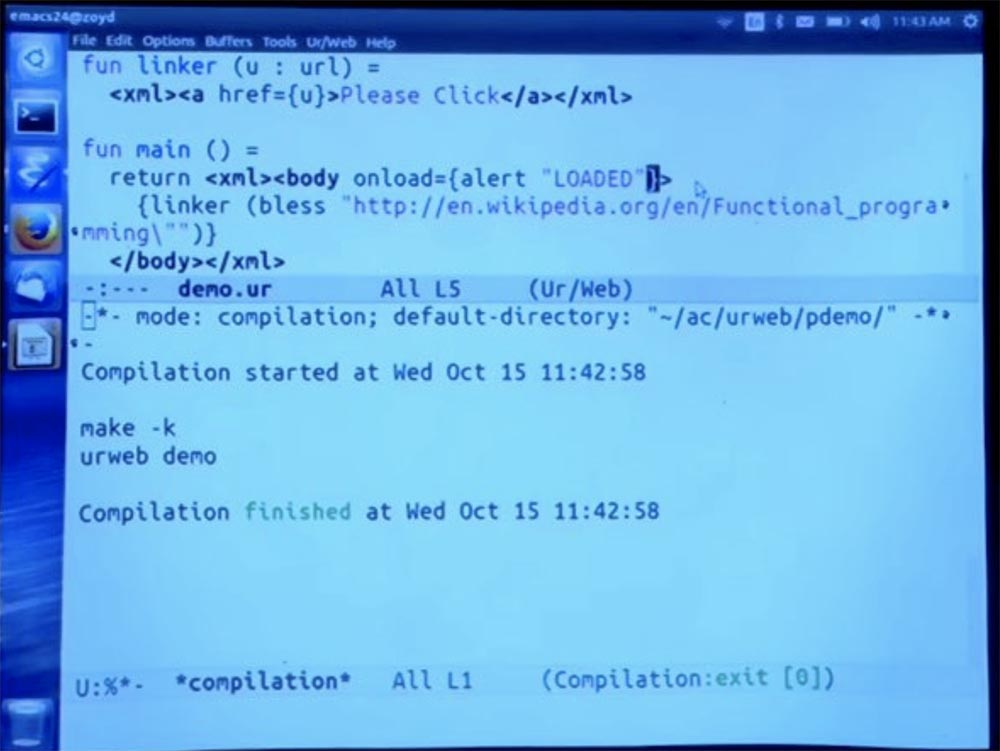

Попытка интерпретировать код JavaScript в строковой форме в качестве программы обернулась бы катастрофой. Вы видите, что мы можем поместить код того же языка программирования, с которым вы работаете, уже ограниченный этими фигурными скобками. И тогда он автоматически компилируется в JavaScript для запуска на стороне клиента.

Замечу, что новые версии браузеров способны избежать ошибки интерпретации символов, но некоторые старые браузеры способны что-то напутать. В любом случае, все символьные элементы будут интерпретироваться как UTF-8, если они войдут в документ. Если существует какая-то проблема с другой кодировкой, то эта кодировка не должна здесь применяться.

**Студент:** компилятор проверяет, содержит ли строка допустимый URL-адрес. Но если вы вычисляете строку во время выполнения программы, проверяет ли bless во время выполнения программы, допустима данная строка или нет?

**Профессор:** давайте создадим форму , чтобы проверить это утверждение, и расположим её здесь. Мы вводим свой URL в текстовое поле URL, а затем вставляем кнопку отправки submit.

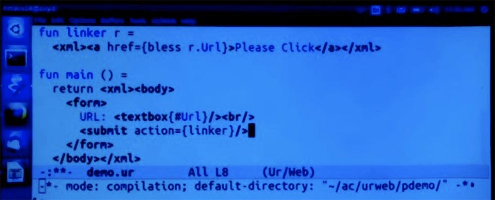

При нажатии на неё последует вызов функции компоновщика с записью одного значения для каждого поля в форме. В этом случае есть только одно поле под названием «URL», так что линкер обработает запись, содержащую URL-адрес в виде строкового типа. И тогда мы попытаемся применить к нему функцию bless и посмотреть, сработает ли это.

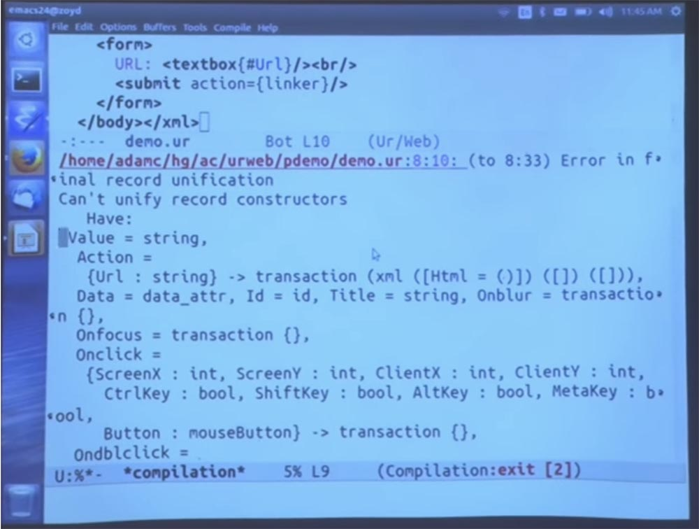

Вы видите пример сообщения об ошибках при наборе URL неправильного типа, одну из тех вещей, которые не будут иметь никакого смысла, если вы не знакомы с Haskell. Я забыл вставить сюда функцию return. По крайней мере, теперь это больше похоже на Java-программу. И я также забыл сказать, что теперь это полная страница. Поэтому мы не можем использовать тег a, пока не окажемся внутри тега body.

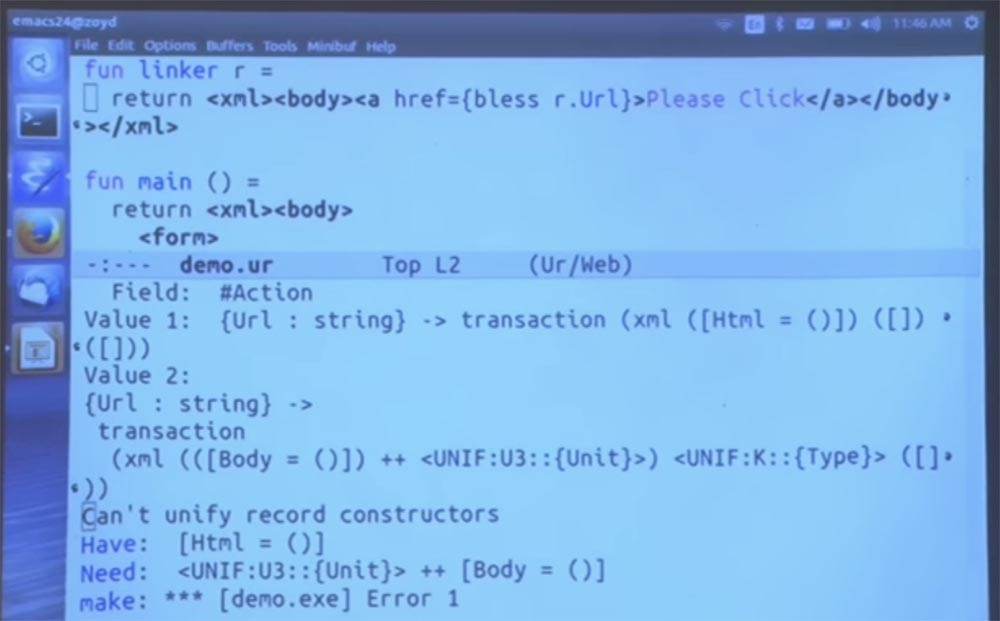

Теперь запускаем компилятор, переходим на нашу страницу, щелкаем по кнопке Please Click, вводим какой-нибудь заумный несуществующий адрес.

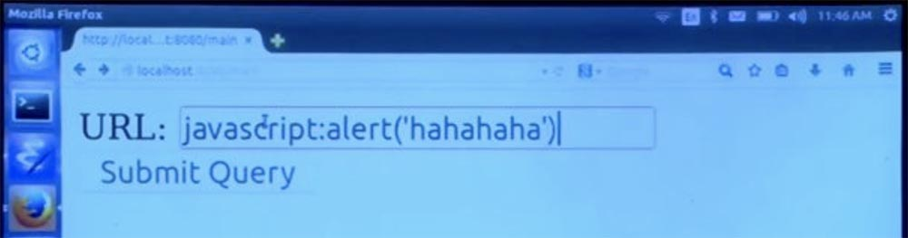

Затем щелкаем Submit Query — «Отправить запрос» и получаем сообщение об ошибке – адрес данного типа не разрешён.

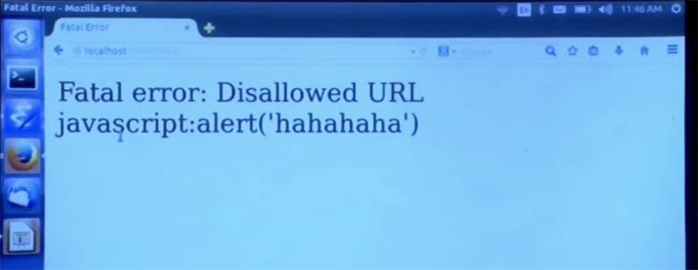

Если мы введём URL – адрес правильного вида, как показано на следующем экране, а затем щелкнем Submit Query, никакого сообщения об ошибке не появится.

Думаю, ответ на ваш вопрос получился долгим и не слишком захватывающим.

**Студент:** есть ли более строгие условия для URL, кроме запрета использовать JavaScript?  
**Профессор:** в настоящие время более строгие ограничения — это просто константы и префиксы. Но вы также можете создать собственные запрещающие правила, и они будут работать в том порядке, в котором вы их напишете.

**Студент:** получается, что если вы придерживаетесь запрета JavaScript, но поставите разрыв строки в середине слова «JavaScript», компилятор может интерпретировать это…

**Профессор:** да, это было бы слишком плохо. Вот почему хорошо придерживаться подхода «белого списка» вместо использования подхода «черного списка». Вы, вероятно, захотите, чтобы все правила начинались с определенного протокола, например HTTP, и при этом разрешалось только то, что попадает в ваш утвержденный набор протоколов. Я рекомендую поступать именно так.

**Студент:** для многих сайтов вы можете разрешить пользователям обмениваться ссылками, в этом случае вам необходимо разрешить ссылки везде.

**Профессор:** вы можете разрешить ссылки, если хотите, чтобы ваши пользователи делились ссылками JavaScript или, я не знаю, флэш-ссылками, или что там разрешено. Видите ли, вы можете создать «белый список» всех HTTP, HTTPS, URL-адресов и тем самым обеспечить безопасную работу с большинством сайтов. Такой подход лишь немного слабее по сравнению с разрешением использовать только определенные URL. Но, по крайней мере, вы сможете полностью исключить возможность автоматического выполнения строки как программы.

Позвольте мне привести один из примеров конспекта, который является примером простой системы чат-комнат, представленных в базе данных. Пользователь может нажать на ссылку для перехода в комнату и затем отправить сообщение. Это первый из нескольких вариантов схемы.

Во-первых, я отмечу, что собираюсь это перекомпилировать. А потом волшебным образом, все объявленные таблицы базы данных будут добавлены в базу данных, и мы можем начать пользоваться приложением. Но сначала мы должны добавить несколько чат-комнат. Итак, давайте откроем наш интерфейс к демонстрационной базе данных и вставим в таблицу room значения «один» и «два».

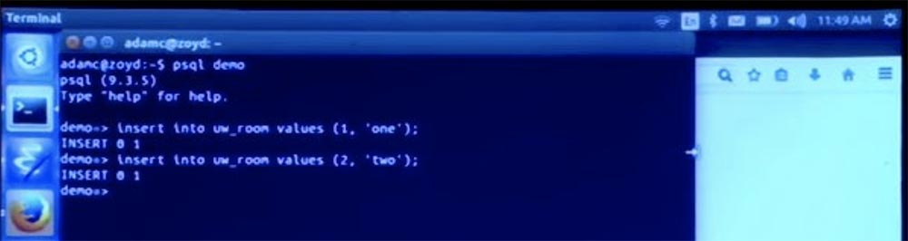

Теперь они появились здесь.

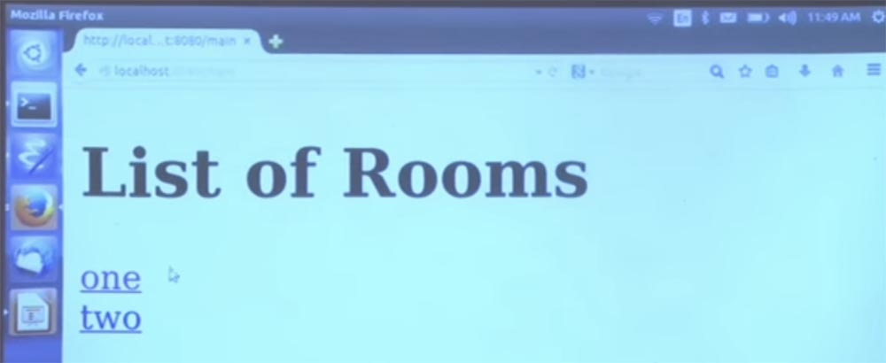

Теперь мы заходим в комнату первого чата и может развлекать себя весь день, отправляя строки текста, например, вот такую первую строчку. Более интересно будет попробовать отправить HTML, и он сразу же обрабатывается. Это пример основной функциональности программы.

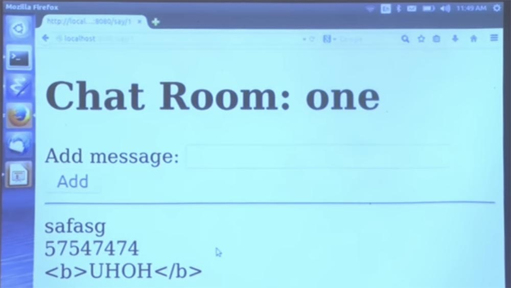

Ещё раз быстро пройдёмся по тому, как это работает, поэтому у нас есть эти две таблицы SQL — table room и table message, которые просто объявлены в этом первом классе внутри языка программирования. И мы даем схему каждой таблицы. А потом, когда мы попытаемся получить доступ к этим таблицам, компилятор убеждается, что доступ к ним осуществляется в соответствии с перспективной схемой набора текста.

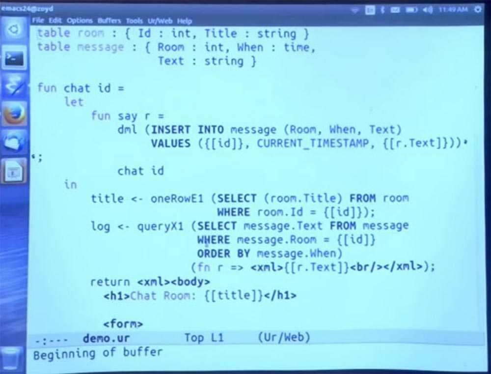

Итак, у нас есть таблица комнат, где каждая комната является записью, состоящей из идентификатора ID, который является целым числом, и заголовка Title, который является строкой. Это тип представления, в котором мы просто создавали записи. Я просто создал несколько комнат в консоли SQL. У нас также есть уведомление, что каждое сообщение принадлежит определённой комнате, время, когда оно было создано, и текст, который является содержанием сообщения.  
Теперь позвольте мне быстро перейти к основной функции.

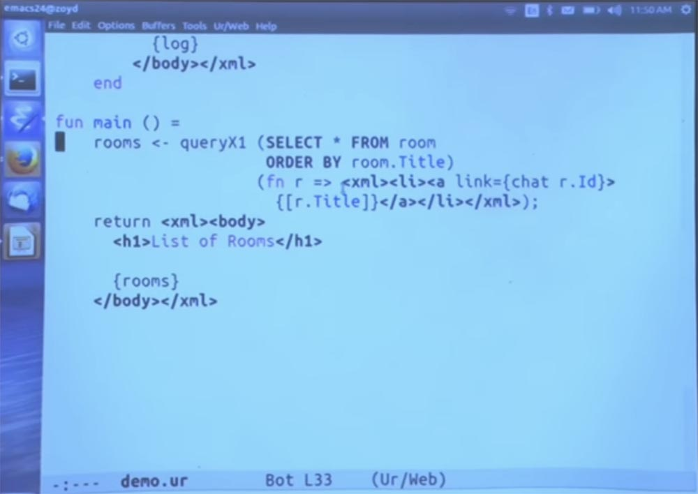

Мы запускаем SQL запрос – вы видите пример синтаксиса SQL, встроенного в Ur/Web. Я не хочу проходить в вызов функций через это расширение из стандартной библиотеки. Это будет довольно многословно, достаточно вспомнить мои слова про то, что в стандартной библиотеке имеются способы для вызова функций, которые представляют собой допустимые способы построения SQL-запроса.

И эти функции имеют типы, которые заставляют их печатать для вас запросы, а не только гарантировать то, что синтаксис является допустимым. Этот код просто перебирает все строки, которые вышли из этого запроса, и генерирует части HTML кода для каждого из них.

В частности, мы собираемся вынести на поле заголовка Title результата запроса и конвертировать его в HTML с обозначением, которое включает фигурные скобки. Квадратные скобки дополнительно говорят о том, что это еще не настоящий кусок HTML, но пожалуйста, преобразуйте его для меня стандартным способом. Так мы можем поступить со строками и целыми числами и всеми данными других типов.

**Студент:** если бы это содержало вредоносный HTML-код или что-то еще, оно было бы отфильтровано?

**Профессор:** да, было бы. В Ur/Web вы можете просто думать об этом как о построении дерева. Это узел, который расшифровывается как некоторый текст. Очевидно, что текст ничего не может сделать.

**Студент:** итак, если бы этот заголовок был под контролем пользователя, и кто-то бы сделал чат с заголовком Alert, это не будет JavaScript?

**Профессор:** он не будет автоматически трактоваться как JavaScript, HTML или еще что-нибудь. Он будет восприниматься программой как простой текст.

Итак, вернёмся к нашему изображению на экране. У нас есть это название Title, давайте обрамим его тегами. И вместо href, обычного способа сделать ссылку в HTML, мы используем атрибут link, который является своего рода псевдоатрибутом Ur/Web, который принимает в качестве аргумента не URL, а в основном выражения Ur/Web. Смысл в том, что когда вы нажимаете на эту ссылку, запускается это выражение для создания новой страницы, которая должна отображаться.  
В этом случае мы совершаем вызов функции чата, которая определена здесь, на следующем экране, вот что это такое.

Не буду вдаваться в подробности. Но у нас есть еще несколько SQL-запросов, использующих различные стандартные библиотечные функции для различных способов использования запрашиваемых результатов.

Мы генерируем эту HTML страницу и говорим, что вы находитесь в чате с таким-то названием title, у нас есть форма form, где пользователь может ввести текст. Это та форма, которую я использовал, чтобы продемонстрировать работу программы несколько минут назад. Кнопка отправки формы имеет этот атрибут Add, содержащий say, который является именем функции Ur/Web. Поэтому, когда мы отправляем форму, мы вызываем эту функцию.

Запуск ещё нескольких SQL вставляет новые строки в таблицу. Мы автоматически перепрыгиваем из ID комнаты чата в текстовые поля, пришедшие сюда из формы, и они автоматически скрываются по мере необходимости. Но опять же, в Ur/Web вам не нужно думать о «побеге» из функции таким образом. Потому что это просто синтаксис для построения дерева, а не для строки. Таким образом, нет никакой возможности, чтобы с парсингом происходили странные вещи, которые вы не ожидаете от выбранного способа толкования синтаксиса.

Итак, тот факт, что у нас в этой форме имеется виджет в виде графического интерфейса GUI, и это текстовое поле, компилятор делает вывод, что запись, которая получается в результате заполнения формы textbox, должна иметь один элемент, называемый «text» строкового типа. Эта кодировка формы и правила набора в ней текста не встроены в язык, а берутся из библиотеки Ur express, которая фактически управляет этими формами, определяя типы допустимых функций.  
Если у вас нет больше вопросов по поводу этой части программы, я перейду к следующему шагу. Я собираюсь использовать способ получить принудительную инкапсуляцию различных частей приложения, которое поддерживает Ur/Web и которое редко поддерживают другие языки. Я собираюсь занять эту комнату. Я собираюсь взять несколько определений и поместить их в модуль, который инкапсулирует некоторые из них как приватные. В частности, таблицы базы данных будут закрытыми, так что никто не сможет получить к ним прямой доступ.

Получить к ним доступ можно только с помощью набора методов, которые мы предоставляем. Один метод запускается внутри транзакции и создает список записей с полями ID и title, предназначенных для доступных чат-комнат.

Далее мы просто раскроем эту операцию чата. И единственное, что я здесь сделал, это ввёл имя для понятия ID – type ID. Таким образом, я не просто говорю, что ID является целым числом, я говорю, что это новый тип.

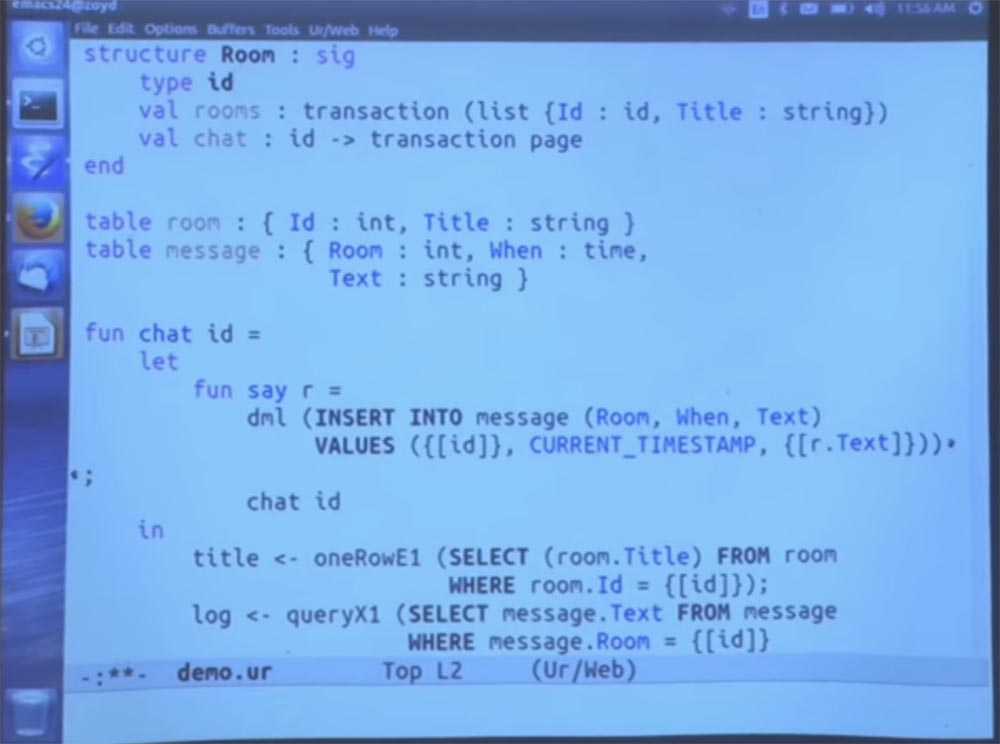

Единственный способ внешнего мира связаться с чатом – это получить список всех комнат, а единственный способ, которым внешний мир может когда-либо его использовать его — это вызов в нём функции чата. Скажем, это некий абстрактный тип хэш-таблицы внутри класса хэш-таблиц, где хранятся детали, объясняющие, что такое ID и как они производятся внутри, являясь приватными для этого модуля, и клиентский код, который вызывает этот модуль, не должен их использовать.

Сейчас перенесу весь этот синтаксис вниз и расположу внутри модуля, так что по умолчанию он не подвергается остальному коду. Далее я реализую этот метод комнат. У нас уже есть возможность организовать чат. Но мы можем реализовать комнаты более простым способом с помощью другой стандартной библиотечной функции для интерпретации запроса в употребляемой форме.  
Давайте просто выберем всё из списка комнат, отсортировав по названию. Как обычно, этот запрос представляет собой проверенный для нас тип данных. И система определяет: «ОК, это выражение будет генерировать список записей, которые совпадают с типом, объявленным в подписи этого модуля». Поэтому теперь за пределами этого модуля никакой другой код не может упоминать room table или message table.

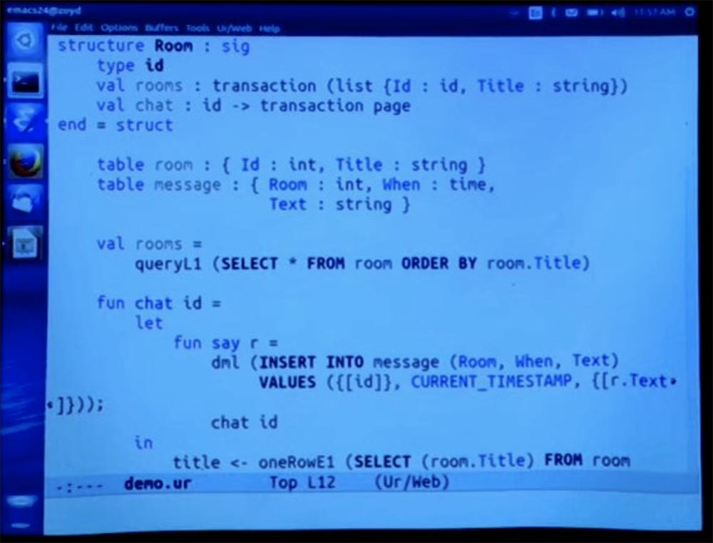

Таким образом, по крайней мере, с точки зрения этого приложения, мы можем применять требуемую от него инвариантность. Мы даже можем скрыть внутри модуля секреты, чтобы не возникло проблем безопасности, если какая-то другая часть кода сможет их достать.

**Студент:** не могла бы какая-то другая часть кода также реализовать этот метод комнат?

**Профессор:** Это была бы совсем другая таблица. Вообще-то мы можем это сделать, вставив вот такой фрагмент из 4-х строк в другой модуль.

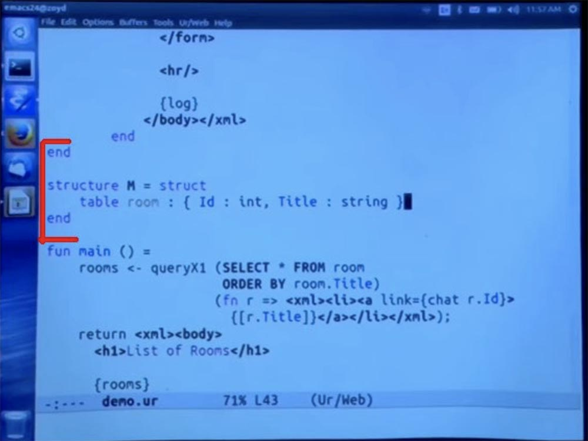

Тогда мы можем делать с этой таблицей все, что захотим. Я скомпилирую это, может быть, через 30 секунд, и мы увидим, что произойдет. Но на самом деле это другая таблица, как если бы вы имели одно и то же частное имя, но для двух разных классов Java.

Итак, вы предполагаете, что внутри этого модуля есть абстрактный тип под названием room, который содержит в себе идентификатор ID и заголовок Title. Это не правильно. Чат принимает параметры room в качестве входных данных. Когда мы вызовем функцию чата, она будет вызвана через URL-адрес. Идентификатор ID и заголовок Title передаётся вне представления URL-адреса, осуществляющего вызов функции. Идентификатор ID нужен нам только для того, чтобы реализовать эту функцию. Поэтому когда мы вызываем функцию, мы фактически вызываем URL.  
Было бы расточительно с точки зрения использования пространства и выглядело бы грубым для пользователя, если бы заголовок передавался как дополнительный аргумент при вызове чата через URL. Разве это имеет смысл? Давайте посмотрим на строку URL на этом слайде.

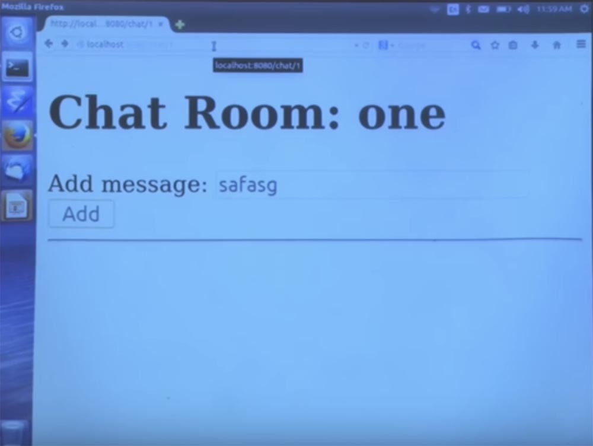

Идентификатор канала, по которому мы движемся, автоматически сериализуется в URL в конце строки. И если бы мы передавали запись, которая содержит ID и название Title, это название также подвергалась бы сериализации, что, по крайней мере, немного нелогично.

54:10

[Курс MIT «Безопасность компьютерных систем». Лекция 11: «Язык программирования Ur/Web», часть 3](https://habr.com/company/ua-hosting/blog/426001/)

Полная версия курса доступна [здесь](https://ocw.mit.edu/courses/electrical-engineering-and-computer-science/6-858-computer-systems-security-fall-2014/).

Спасибо, что остаётесь с нами. Вам нравятся наши статьи? Хотите видеть больше интересных материалов? Поддержите нас оформив заказ или порекомендовав знакомым, **30% скидка для пользователей Хабра на уникальный аналог entry-level серверов, который был придуман нами для Вас:** [Вся правда о VPS (KVM) E5-2650 v4 (6 Cores) 10GB DDR4 240GB SSD 1Gbps от $20 или как правильно делить сервер?](https://habr.com/company/ua-hosting/blog/347386/) (доступны варианты с RAID1 и RAID10, до 24 ядер и до 40GB DDR4).

**VPS (KVM) E5-2650 v4 (6 Cores) 10GB DDR4 240GB SSD 1Gbps до декабря бесплатно** при оплате на срок от полугода, заказать можно [тут](https://ua-hosting.company/vpsnl).

**Dell R730xd в 2 раза дешевле?** Только у нас **[2 х Intel Dodeca-Core Xeon E5-2650v4 128GB DDR4 6x480GB SSD 1Gbps 100 ТВ от $249](https://ua-hosting.company/serversnl) в Нидерландах и США!** Читайте о том [Как построить инфраструктуру корп. класса c применением серверов Dell R730xd Е5-2650 v4 стоимостью 9000 евро за копейки?](https://habr.com/company/ua-hosting/blog/329618/)