Курс MIT «Безопасность компьютерных систем». Лекция 11: «Язык программирования Ur/Web», часть 3 / Блог компании ua-hosting.company

### Массачусетский Технологический институт. Курс лекций #6.858. «Безопасность компьютерных систем». Николай Зельдович, Джеймс Микенс. 2014 год

Computer Systems Security — это курс о разработке и внедрении защищенных компьютерных систем. Лекции охватывают модели угроз, атаки, которые ставят под угрозу безопасность, и методы обеспечения безопасности на основе последних научных работ. Темы включают в себя безопасность операционной системы (ОС), возможности, управление потоками информации, языковую безопасность, сетевые протоколы, аппаратную защиту и безопасность в веб-приложениях.

Лекция 1: «Вступление: модели угроз» [Часть 1](https://habr.com/company/ua-hosting/blog/354874/) / [Часть 2](https://habr.com/company/ua-hosting/blog/354894/) / [Часть 3](https://habr.com/company/ua-hosting/blog/354896/)  
Лекция 2: «Контроль хакерских атак» [Часть 1](https://habr.com/company/ua-hosting/blog/414505/) / [Часть 2](https://habr.com/company/ua-hosting/blog/416047/) / [Часть 3](https://habr.com/company/ua-hosting/blog/416727/)  
Лекция 3: «Переполнение буфера: эксплойты и защита» [Часть 1](https://habr.com/company/ua-hosting/blog/416839/) / [Часть 2](https://habr.com/company/ua-hosting/blog/418093/) / [Часть 3](https://habr.com/company/ua-hosting/blog/418099/)  
Лекция 4: «Разделение привилегий» [Часть 1](https://habr.com/company/ua-hosting/blog/418195/) / [Часть 2](https://habr.com/company/ua-hosting/blog/418197/) / [Часть 3](https://habr.com/company/ua-hosting/blog/418211/)  
Лекция 5: «Откуда берутся ошибки систем безопасности» [Часть 1](https://habr.com/company/ua-hosting/blog/418213/) / [Часть 2](https://habr.com/company/ua-hosting/blog/418215/)  
Лекция 6: «Возможности» [Часть 1](https://habr.com/company/ua-hosting/blog/418217/) / [Часть 2](https://habr.com/company/ua-hosting/blog/418219/) / [Часть 3](https://habr.com/company/ua-hosting/blog/418221/)  
Лекция 7: «Песочница Native Client» [Часть 1](https://habr.com/company/ua-hosting/blog/418223/) / [Часть 2](https://habr.com/company/ua-hosting/blog/418225/) / [Часть 3](https://habr.com/company/ua-hosting/blog/418227/)  
Лекция 8: «Модель сетевой безопасности» [Часть 1](https://habr.com/company/ua-hosting/blog/418229/) / [Часть 2](https://habr.com/company/ua-hosting/blog/423155/) / [Часть 3](https://habr.com/company/ua-hosting/blog/423423/)  
Лекция 9: «Безопасность Web-приложений» [Часть 1](https://habr.com/company/ua-hosting/blog/424289/) / [Часть 2](https://habr.com/company/ua-hosting/blog/424295/) / [Часть 3](https://habr.com/company/ua-hosting/blog/424297/)  
Лекция 10: «Символьное выполнение» [Часть 1](https://habr.com/company/ua-hosting/blog/425557/) / [Часть 2](https://habr.com/company/ua-hosting/blog/425561/) / [Часть 3](https://habr.com/company/ua-hosting/blog/425559/)  
Лекция 11: «Язык программирования Ur/Web» [Часть 1](https://habr.com/company/ua-hosting/blog/425997/) / [Часть 2](https://habr.com/company/ua-hosting/blog/425999/) / [Часть 3](https://habr.com/company/ua-hosting/blog/426001/)

Последнее, что нам нужно сделать и что будет весьма поучительно – это изменить этот код, указав там модуль комнаты, а затем попытаться получить доступ к таблице комнаты, как в предыдущем примере. Такой вариант не разрешён, потому что подобное не допускается.

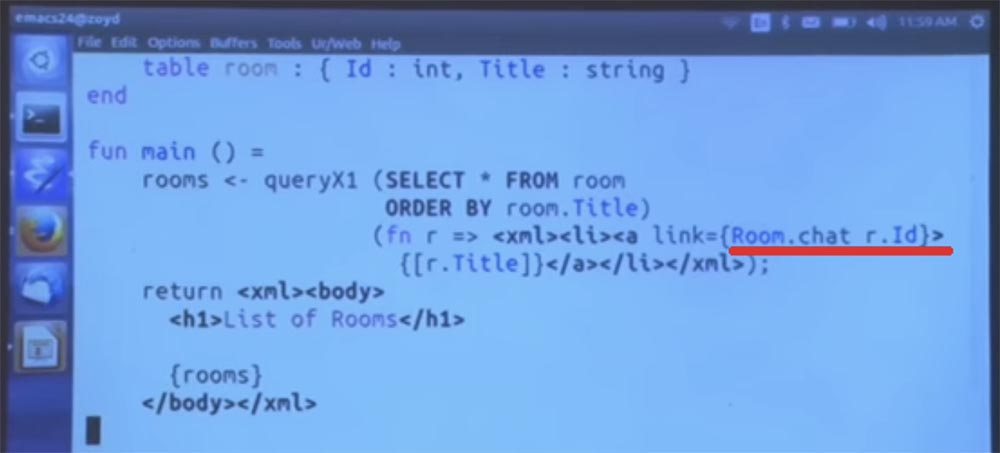

Это походило бы на возможность читать и писать частные поля класса в Java. И действительно, мы получаем довольно простое сообщение, в основном говорящее, что у нас здесь имеется несвязанная переменная, неизвестное выражение для параметра room.

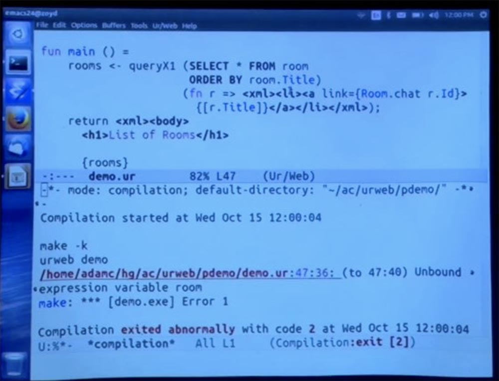

Мы могли бы упомянуть этот дополнительный модуль, который мы создали просто для удовольствия.

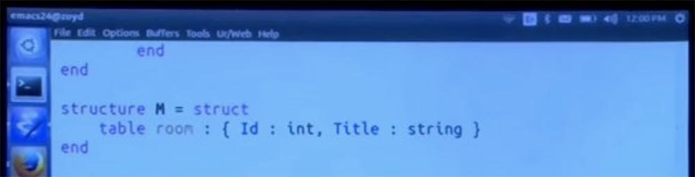

Но тогда это будут разные таблицы. Мы можем без проблем получить к нему доступ. Поэтому я разобью это на две части, мы начнем с того, что просто вызовем метод room, а затем сделаем немного другую вещь, чтобы прочитать его элементы.

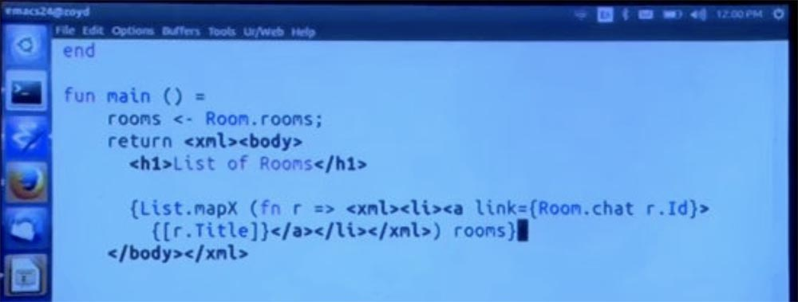

Отобразим список результатов, а не наоборот, это примерно эквивалентно тому, как программа работала до того, за исключением использования различных типов данных. Посмотрим, что из этого выйдет. Возвращаемся теперь в наш чат в комнате 1 и вводим в строку любые сообщения. Вы видите, что все они отображаются без ошибок.

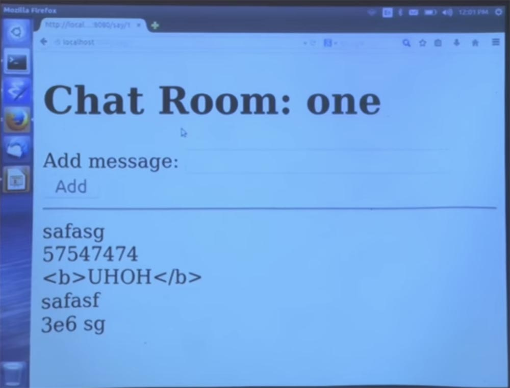

То есть сейчас у нас есть эта инкапсуляция, поэтому вы можете думать о структуре этой комнаты, как о библиотеке, но вам не нужно об этом беспокоиться.

Существуют разные места, которые могут повредить внутреннюю инвариантность системы. Может быть, вы хотите, чтобы после того, как сообщение будет добавлено, оно никогда бы не исчезло. Всё это есть в журналах. Эта структура обеспечивает такие свойства независимо от другого кода, например того, на котором написан модуль чат-комнаты.

**Студент:** итак, вы изменили определение комнаты, что в этом случае произойдёт с таблицей базы данных?

**Профессор:** придется вручную запустить команду alter table, если вы захотите сохранить старые данные. Но когда приложение запускается, оно запрашивает каталог системной базы данных и проверяет, что схема по-прежнему соответствует ожиданиям. Тогда вы получите статическую ошибку. Надеюсь, это даст вам подсказку, что вы должны изменить в базе данных.

**Студент:** но это не будет автоматически удалять базу данных или что-то в этом роде?

**Профессор:** надеюсь, что нет. Я не думаю, что компилятор должен это делать. Вы можете представить себе настройку компилятора для понимания эволюции базы данных. Я думаю, что вам нужно написать команды alter table для запуска, потому что компилятор сейчас этого не делает.

Давайте теперь поговорим о подделке межсайтовых запросов и ее предотвращении. На самом деле, прежде чем мы это сделаем, давайте посмотрим на код на этой странице. У нас есть традиционная форма HTML, которая здесь генерируется. И, конечно же, здесь нет защиты от подделки межсайтовых запросов, и я думаю, что это хорошо. Потому что, как я понимаю, проблема подделки межсайтовых запросов состоит в неявном контексте, который отправляется приложением при каждом запросе.

Предположим, существует какой-то злоумышленник, который не знает вашего неявного контекста. Скажем, ваш пароль хранится в файле cookie, для очень простого примера. И когда атакующий обманывает вас при переходе по ссылке на нужное ему приложение, браузер автоматически отправляет неявный контекст и заставляет приложение делать то, что злоумышленник не смог сделать напрямую.

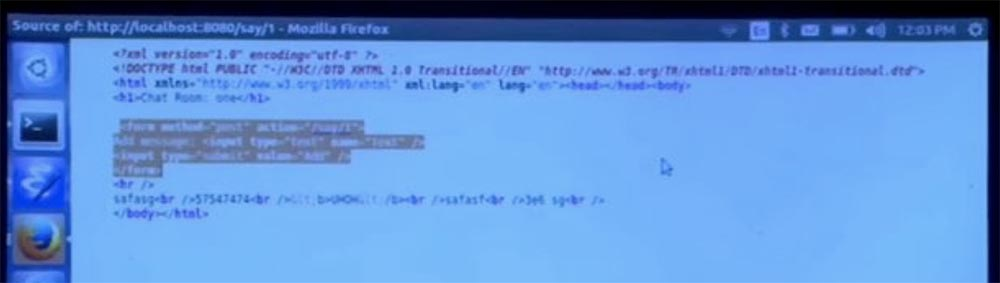

В этом случае нет неявного контекста, так что нет никакого риска подделки межсайтовых запросов. Кто-нибудь хочет оспорить эту характеристику системы, прежде чем я продолжу? Это может быть весьма познавательно для меня. Если нет, тогда добавим сюда неявный контекст. При этом система автоматически собирается принять правильные контрмеры, основанные на анализе программы, которая понимает, что теперь здесь есть неявный контекст.

Сейчас я вставлю сюда кукиз. В качестве другого примера капсулирования модуля, на самом деле, я помещу здесь целую систему аутентификации пользователей, в которой у нас есть учетные записи пользователей и абстрактные типы идентификаторов и паролей. Таким образом, вы не сможете просто создать значение любого из этих типов данных напрямую. Вам придется пройти через какой-то утвержденный метод построения значений этих типов.

Я собираюсь разместить таблицу прямо в подписи. И я также наложу на неё ограничение, говорящее о том, что ключом к ней является форма ID.

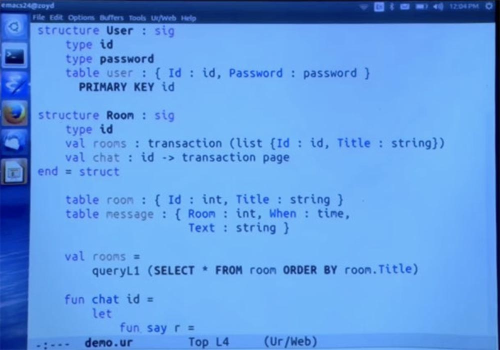

Но дело в том, что в этой таблице пользователей идентификатор ID и пароль представляют собой абстрактные типы данных. Поэтому код не может увидеть пароль и не может последовательно генерировать все идентификаторы и пробовать их в этой таблице. Потому что здесь используется абстрактный тип, из-за чего невозможно установить, как выглядит ID и невозможно подобрать пароль. Они просто поступают из этой таблицы, и это непрозрачные токены.

Но мы могли бы позволить им быть сточными входными данными. Возможно, вы захотите разрешить одно направление преобразования между строками и этими типами. Сейчас я здесь кое-что проделаю, в основном детали, и не буду пытаться их объяснить. Но это похоже на декларацию того, что вам разрешено преобразовывать строки в ID. Для тех, кто знаком с Haskell, это мгновенный класс типов, это разрешение превращать строки в идентификаторы ID.

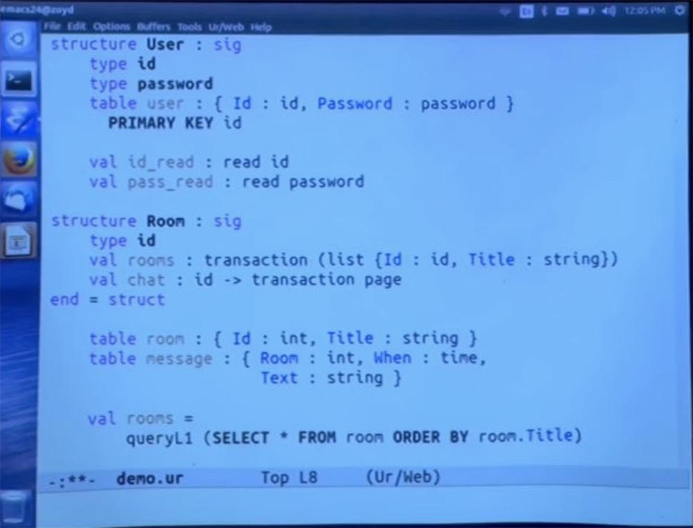

Мы не собираемся применять другое разрешение, потому что не хотим иметь возможность превращать ID обратно во что-то другое. Давайте сделаем то же самое для пароля. Мы хотим иметь возможность прочитать пароль пользователя, но не собираемся принимать пароль и превращать его в строку, которая скажет нам, что пользователь вошёл в чат.

Таким образом, другие части кода смогут принимать ввод пароля от пользователя, конвертировать его в этот тип, и транспортировать его к модулю пользователя на проверку. Но что они не смогут сделать, так это запросить таблицу пользователей и получить все пароли в форме, из которой они смогут извлечь их текстовое выражение.

Затем у нас может быть метод login, который принимает эти два компонента, ID и пароль, и просто работает в качестве побочного эффекта, что фактически сказано в коде. Нам также понадобится способ, как узнать, кто из пользователей зарегистрирован. Это код, который выполняет транзакцию, создающую идентификатор ID.

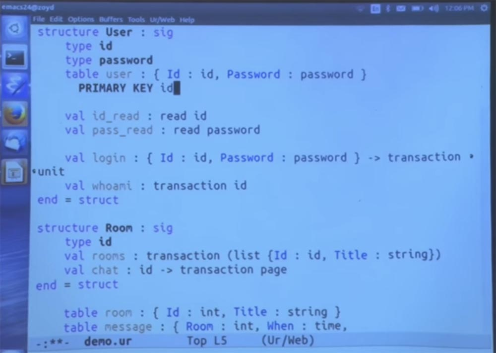

Первый шаг – мы просто копируем это определение. А дальше следует сюрприз. Оказывается, что ID и пароли пользователей – это строки, но вне модуля это обстоятельство раскрыто не будет.

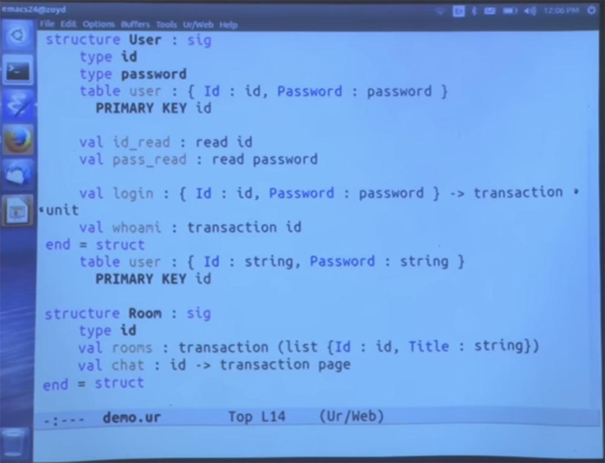

Теперь мы собираемся создать кукиз. Кукиз — это еще одна вещь, которая встроена в язык. Фактически, они действуют как изменяемые глобальные переменные, у которых имеется одна копия на каждого клиента, который пользуется вашим приложением.

Таким образом, мы собираемся создать cookie, которые для каждого пользователя будет хранить просто копию тех же двух полей, что у нас здесь имеются.

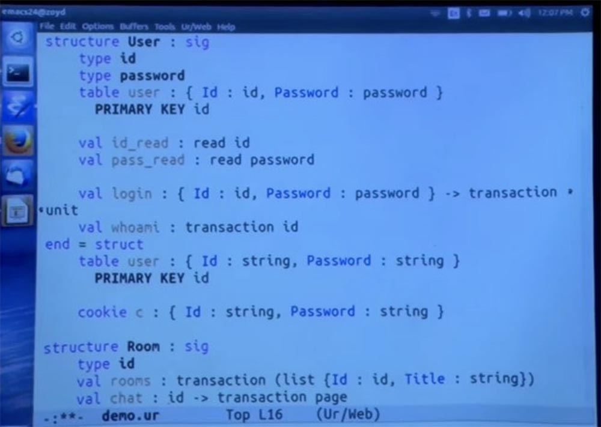

Эти кукиз являются приватными для данного модуля. Другие части кода не смогут прочитать cookie, потому что у них просто нет этого приватного поля. Так что никто не сможет напрямую увидеть ID и пароль, которые сохранены для этого пользователя. Но они будут сохранятся при просмотре различных страниц, как это бывает с обычными кукиз.

Сейчас я вставлю функцию login, которая запустит процесс, чтобы проверить базу данных и узнать, действительно ли это правильная пара имени пользователя и пароля. Этот процесс как раз проверит, сможем ли мы найти строку в базе данных, в которой имеются этот идентификатор пользователя ID и пароль.

Если мы найдем её, то хорошо, значит, это правильное значение. Давай просто сохраним это в кукиз. Мы используем метод, изменяющий значение cookie. И мы должны расположить некоторые вещи здесь, для простоты я скажу, что этот cookie не имеет срока действия. Я не хочу запускать здесь SSL, поэтому скажу, что в данном случае безопасность нам не нужна, и задам параметр Secure = false.

Но если вы действительно заботитесь о безопасности, очевидно, вы напишете Secure = true. Если проверка не удалась и модуль просигнализирует об ошибке, выполнение программы остановится, выдав описание этой ошибки.

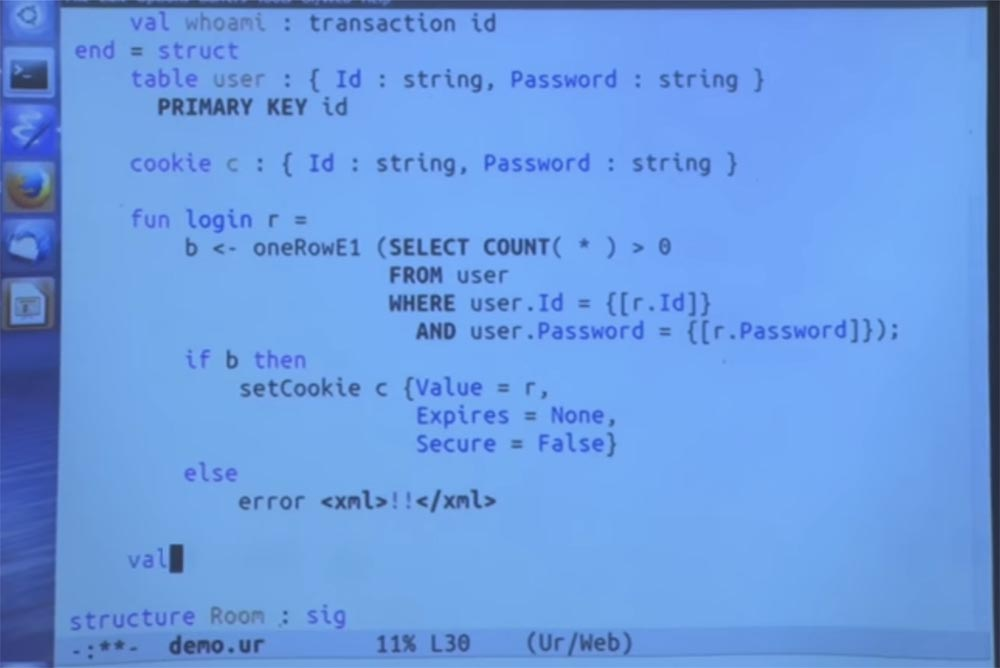

Наконец, мы можем создать эту функцию, которая сообщает, какой конкретный пользователь вошел в систему, получив текущее значение cookie. Это параметр также может иметь значение none, если пользователь еще не вошел в систему, и в этом случае мы получим другое сообщение об ошибке. Или это может быть какая-то запись именно того типа, который мы использовали выше. Так что я просто скопирую её сюда и запущу ту же проверку. Если это сработает, то мы просто вернём ту часть записи ID, которую мы только что проверили в базе данных.

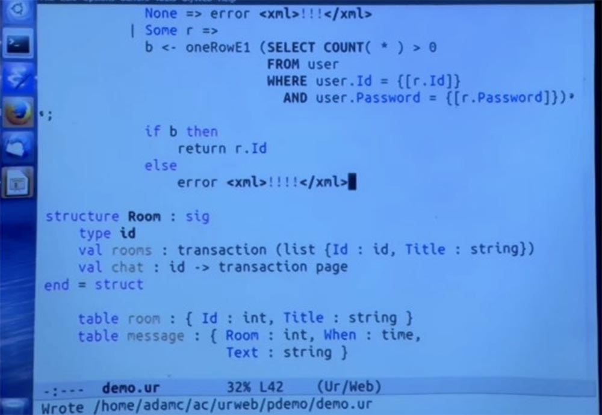

Итак, позвольте мне просто это проверить. Запускаем компилятор, и результат вы видите на экране.

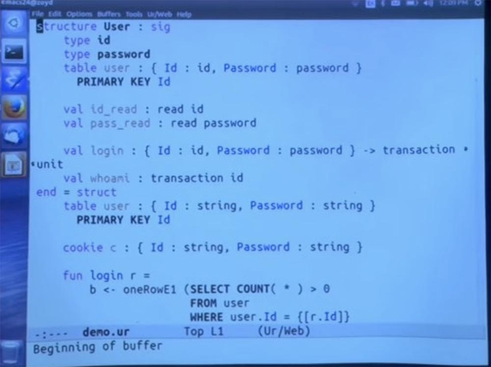

Главными здесь являются все эти детали реализации. Но вне этого модуля мы думаем про это с точки зрения интерфейса. Есть некоторые неизвестные типы идентификаторов ID и паролей. Эта таблица пользователей выражает термины, разрешающие превратить строки в идентификаторы и пароли, но не наоборот. У нас есть эти два метода ввода логина в первую очередь и есть проверка, какой именно пользователь вошел в систему на этом этапе. Есть вопросы по этому поводу?

**Студент:** нужно ли вам раскрывать таблицу пользователей?

**Профессор:** я делаю так, потому что я хочу использовать её позже в качестве внешнего ключа, так что это не важная причина. Итак, мы почти на том этапе, когда я могу показать вам CSRF защиту в действии.

Начнём с того, что залогинимся в системе, это достаточно легко сделать. Хорошо, что мы можем ещё сделать в этом месте программы? Давайте просто добавим сюда еще одну часть страницы, которая говорит, что это то место, где вы вводите логин. Здесь вы должны ввести имя пользователя и пароль и затем нажать на кнопку submit action. Это действие обеспечит вызов функции login.

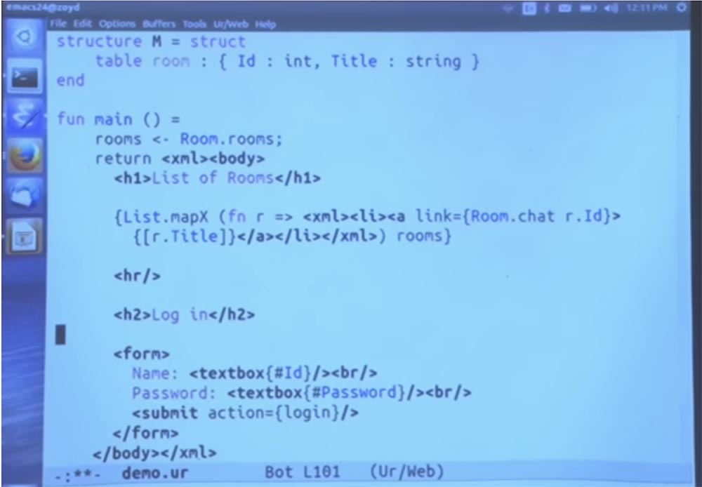

Давайте определим login как функцию, которая делает эти вещи. На самом деле это просто оболочка вокруг вызова функции login из этого модуля, в котором мы берем каждый из компонентов и преобразуем его из строки в абстрактный тип.

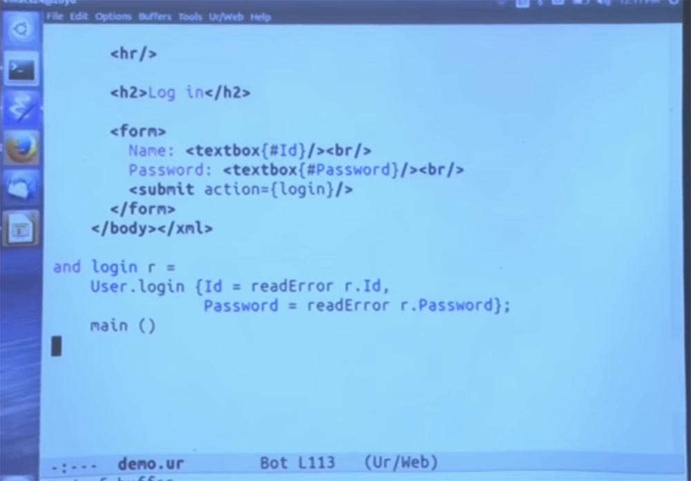

Она проверяет ошибку чтения. Ошибка означает, что если логин не работает, операция будет прервана в этом месте и функция вернётся к основной части программы.  
Теперь мы сможем войти в систему. Вероятно, мы захотим создать учетную запись, которая позволит нам войти в систему, поэтому позвольте мне создать пользователя по имени а и пароль а.

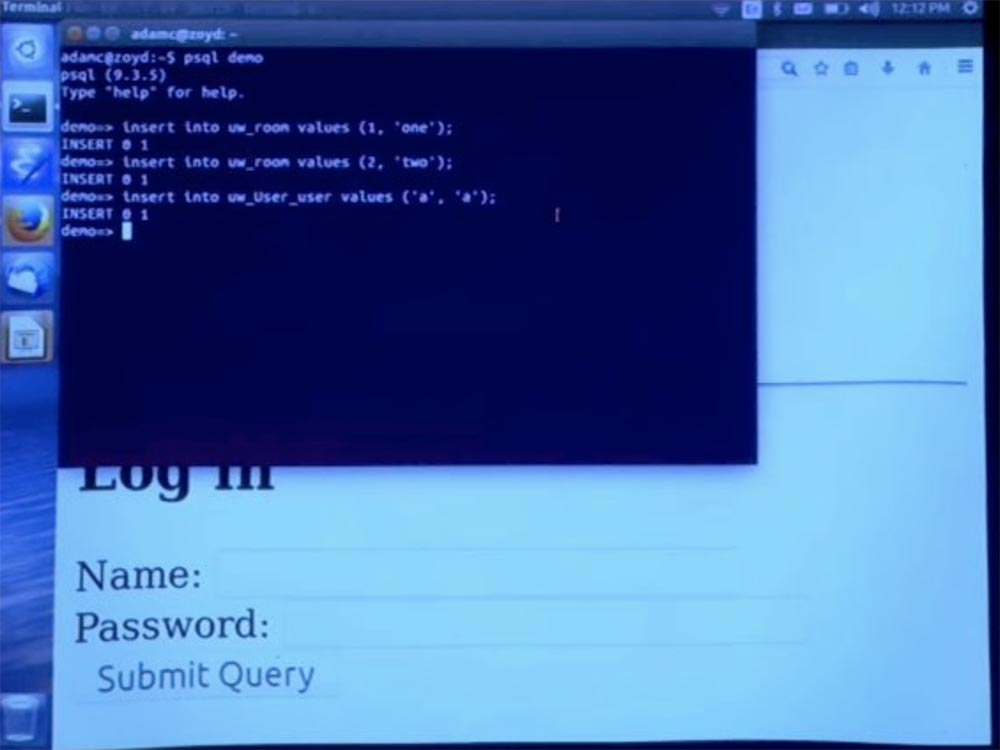

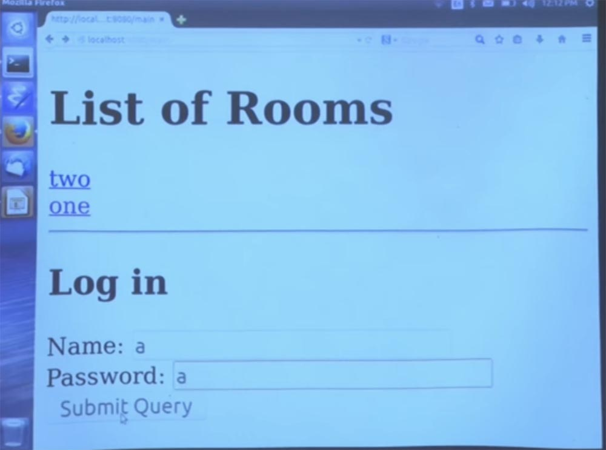

Теперь я могу войти в систему как пользователь а, поверьте мне на слово. У нас есть набор файлов cookie для записи этой информации, так что зайдём в комнату чата и отправим сообщение, например, asfasf. Вы видите, что после нажатия на кнопку Add оно появилось в чате.

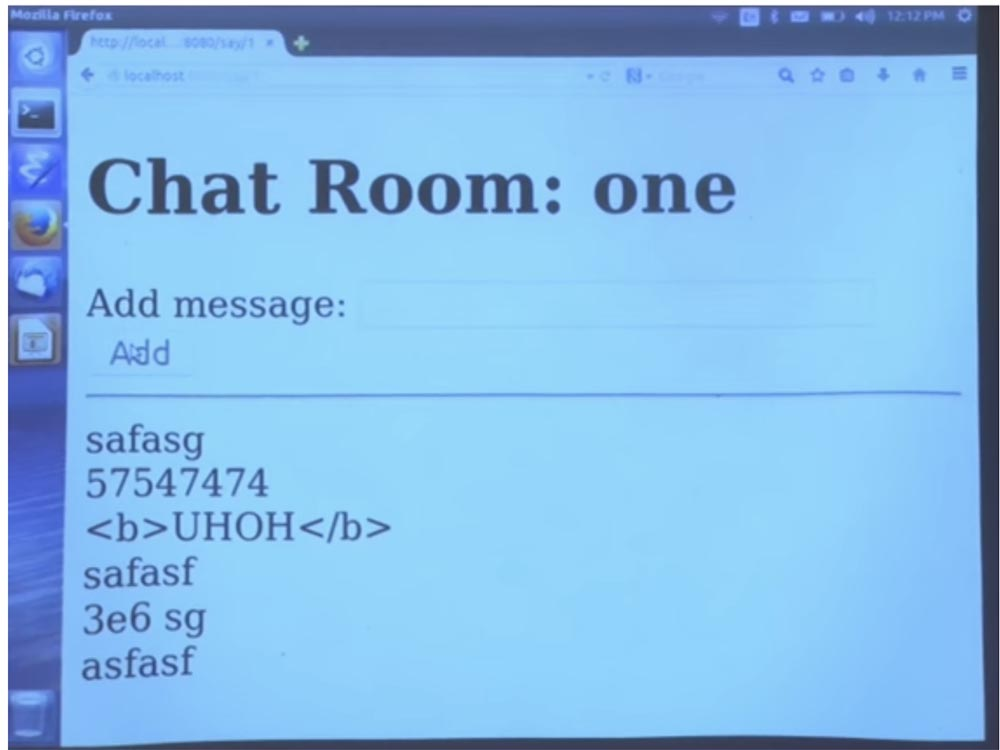

На самом деле, мы не добавили здесь никакого контроля доступа, так что здесь ничего особенного не происходит. Но мы можем проверить.

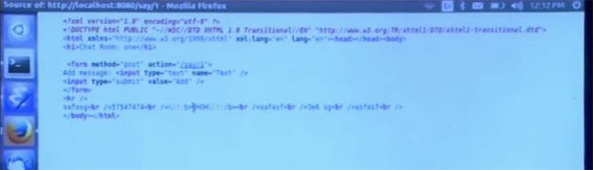

Здесь есть кукиз, но система определила, что мы не используем кукиз. Когда мы отправляем эту форму, cookie не читается. Таким образом, пока что нет никакой необходимости добавлять сюда защиту CSRF. Итак, теперь мы должны добавить способ использования cookie и увидеть, как себя проявит защита.

**Студент:** а что собой представляет содержание cookie?

**Профессор:** это то содержание, которое вы предполагаете получить от кода. Другими словами, файл cookie объявляется как имеющий тип этой записи — идентификатор и пароль.

Так что это именно то, что содержится там в определенной сериализованной форме. Теперь давайте на самом деле используем куки. Мы должны это увидеть, несмотря на то, что будем использовать cookie косвенно, потому что мы собираемся использовать его в модуле room, который никакого отношения к куки не имеет. Но мы будем вызывать методы пользовательского модуля, которые косвенно связаны с использованием файлов cookie. И тогда система поймет, что это означает то, что мы от неё зависим.

Итак, давайте сделаем это очень просто и вызовем метод whoami. На самом деле я просто собираюсь это игнорировать, или наоборот, позволить ему что-то сделать. Давайте решим, что пользователь, которого мы создали, действительно особенный, и только этот пользователь может размещать что угодно. Если это не так, то мы получим сообщение об ошибке.

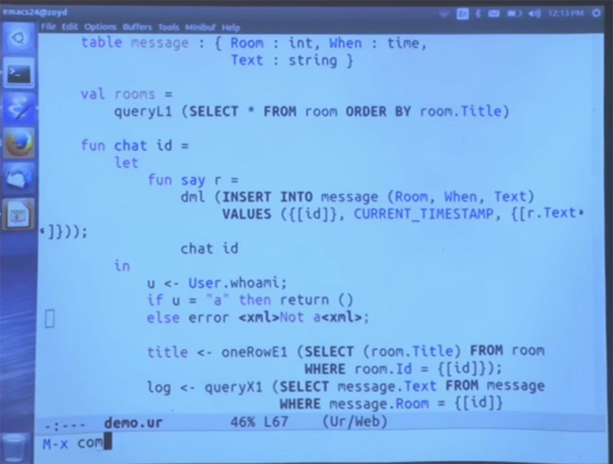

Я добавлю в пользовательский модуль идентификатор ID, и тогда это должно сработать, так как тип ID поддерживает проверку на равенство.

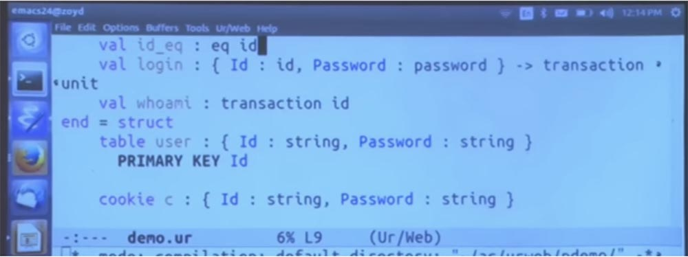

Теперь у нас всё должно быть в порядке, и мы можем проделать больше вещей с этим ID, который способен вызвать некоторые проблемы безопасности.

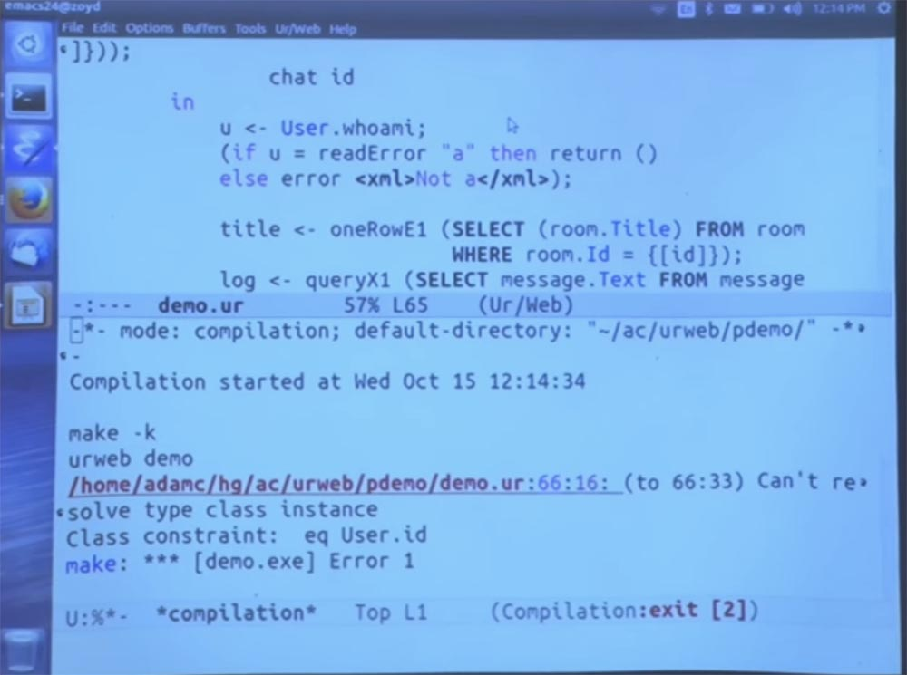

Это позволяет нам добавить проверку контроля доступа, так что давайте посмотрим, как это работает и вернёмся на главную страницу.

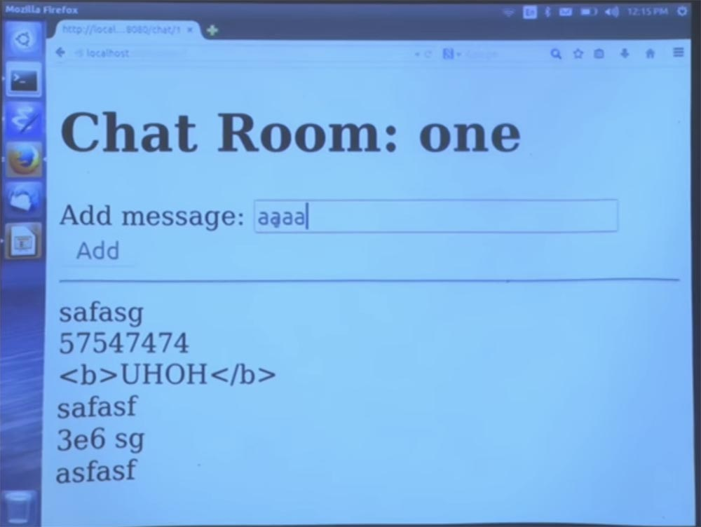

Теперь эти четыре буквы «а» появились и в чате.

В консоли интерфейса мы видим, что теперь форма автоматически получила скрытое входное имя sig, которое является криптографической подписью значений всех файлов cookie. Это sig подписывало кукиз, используя ключ, который является секретным для сервера. А когда форма готова, приложение знает — потому что об этом ему сказал компилятор — что приложение должно проверять подписи для следующего набора операций. Для этого у нас есть операция say.

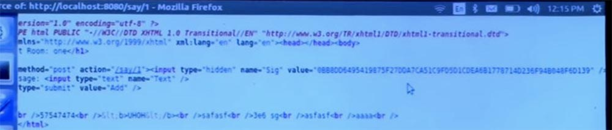

**Студент:** имеют ли подписи что-то вроде штампа времени?

**Профессор:** нет, подписи не имеют временных меток.

**Студент:** в таком случае, если злоумышленник сумел «подсмотреть» эти данные, он мог бы притвориться пользователем, ведь срок действия этих кукиз никогда не истекает.

**Профессор:** да, он никогда не истекает. Это то, что можно изменить, просто изменив реализацию языка без изменения приложений, а затем быстро развернуть. Но сейчас здесь этого нет. И я понимаю, почему это было бы полезно добавить.

**Студент:** вы также можете исправить это, просто поставив метку времени на подписи.

**Профессор:** да, вы правы, вы можете изменить приложение таким образом, чтобы намеренно изменять данные cookie достаточно часто, то есть сделать так, чтобы подпись устаревала.  
**Студент:** вы можете переназначить URL-адреса?

**Профессор:** да, какие переназначения вы хотели бы увидеть?

**Студент:** любые, я просто хочу посмотреть, как это делается.

**Профессор:** Итак, компилятор назначает… как мы видим, мы вызвали функцию say, и этот вызов функции сериализуется как определенная форма URL. Предположим, что нам не нравится эта форма.

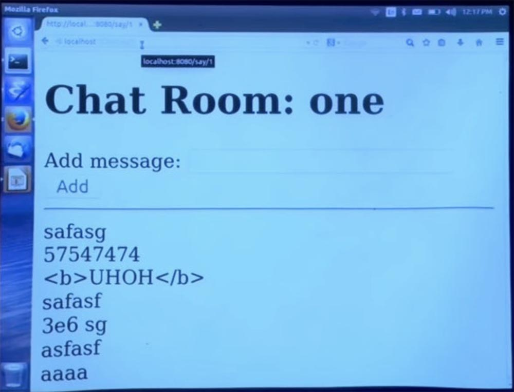

Мы решили, что мы собираемся переписать URL, так сказать, внутри модуля комнаты, внутри демо. Лучше вставить это наверх. Итак, мы хотим переназначить url Demo/Room/say в Demo/Room /Speak.

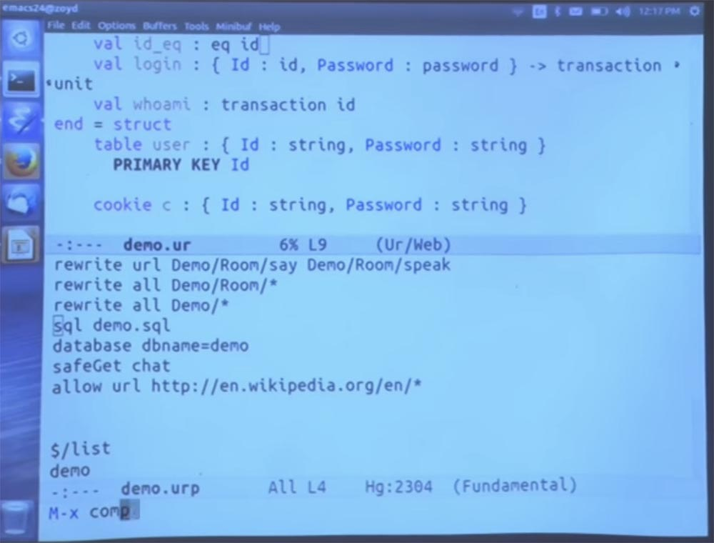

Запускаем компилятор и переходим на главный экран приложения. Посмотрим, что получится. Всё в порядке, мы также можем вводить любые текстовые сообщения и они появляются в строке чата. В этих правилах можно использовать непредсказуемые знаки, чтобы заменить один префикс другим, при этом компилятор будет обеспечивать, чтобы каждая функция имела отдельную схему URL, но по умолчанию автоматически генерируется URL-адрес.

**Студент:** вы упомянули, что HTML не является спецификой компилятора, это просто библиотека. Существуют ли другие библиотеки для других форматов?

**Профессор:** есть и другие библиотеки, которые не проверяют тип с той же функциональной полнотой, но, например, есть библиотека для сериализации и десериализации JSON, и большое количество автоматизированных способов управлять структурой типа. Таким образом, вы можете делать такие вещи, которые не интегрированы в компилятор.

**Студент:** предположим, мы всё ещё хотим писать на JavaScript, например, чтобы анимировать какие-то вещи на странице …

**Профессор:** позвольте мне загрузить Ajax-версию этого, что позволит ответить на ваш вопрос. В этой версии есть код на стороне клиента. Давайте просто перейдём на вариант программы под названием demo3. Я ввёл данные на главной странице в строку чата, и они так же появились внизу чата. Хотите верьте, хотите нет, но на этот раз надстройка работала с помощью Ajax-вызова. Это получается благодаря тегу кнопки button value. У него есть атрибут onclick, который, когда пользователь нажимает кнопку, весь этот код ниже строки с данным атрибутом срабатывает на стороне клиента.

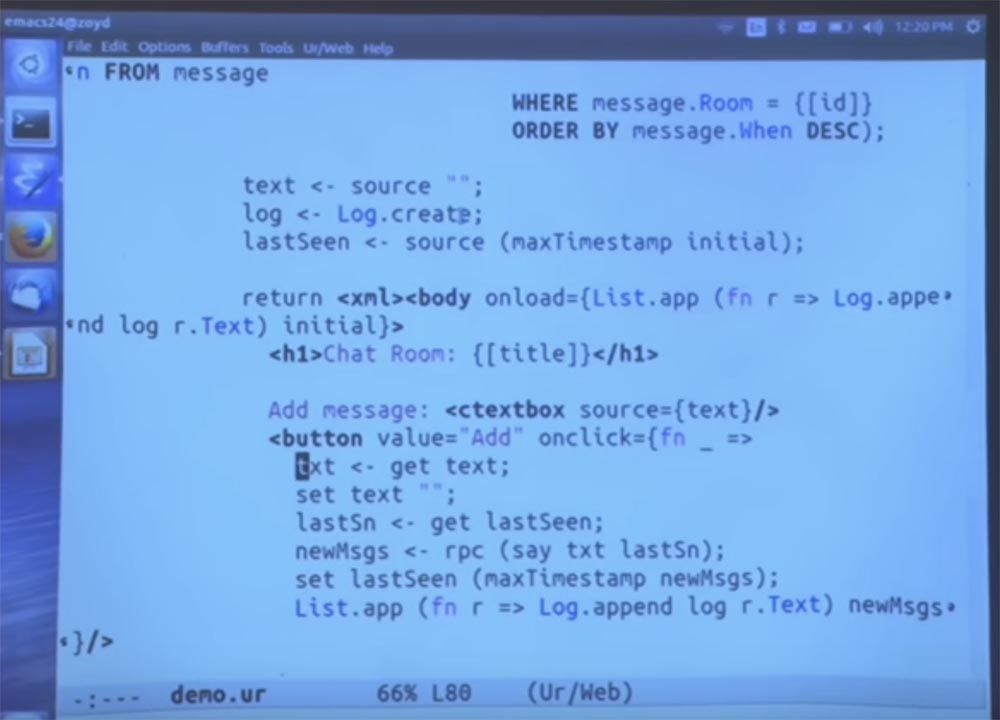\]

Но это код Ur/Web, это не код JavaScript. Компилятор переводит это для вас в JavaScript и гарантирует, что он сохраняет свойства, которые мы хотим иметь для абстракций в нашем списке, если пользователь не хочет возится с ним вручную в браузере.

Студент: я думаю, что сегодня есть много библиотек, которые делают полезные вещи, и во многих случаях сложные вещи, если вы хотите всё перекодировать сами. Есть ли в них способ взаимодействия с JavaScript из Ur/Web?

**Профессор:** да, есть интерфейс внешних функций, который позволяет давать имена функций Ur/Web именам функций JavaScript и вызовам. Но когда вы используете интерфейс внешней функции, вы больше не можете пользоваться всеми этими полезными функциями конструирования. В этом случае вы должны быть очень осторожными.

Вы должны понимать реализацию некоторых из этих абстракций, чтобы не мешать им. Пока у меня есть этот код, позвольте вам показать ещё кое-что.

У нас все еще есть та же функция say, что и раньше. Но теперь, вместо того, чтобы вызывать её по ссылке, мы просто берем вызов функции, который заполняется аргументами, которые приходят из контекста обработчика onclick.

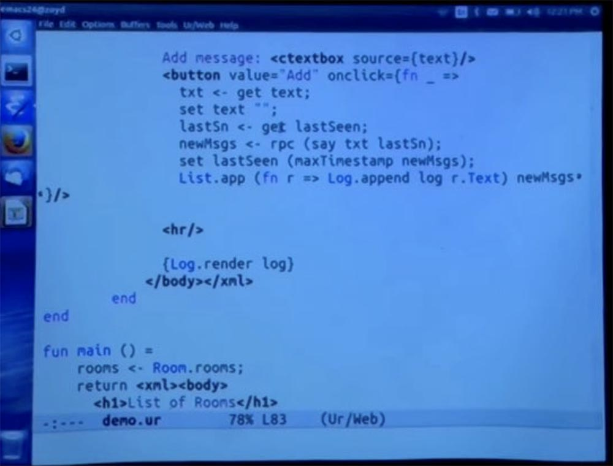

Мы просто обернем эту функцию внутри синтаксиса rpc. Это значит, что это функция вызова на стороне клиента, но сам вызов запускается на сервере с доступом к базе данных и другим ресурсам сервера, а затем переносит результат обратно сюда.

И написана она в таком прямом стиле, что не требует обратных вызовов, которые обычно необходимо использовать в JavaScript для выполнения вызова удаленного сервера.  
Клиент может осуществить вызов куда угодно в масштабах области действия функции, за исключением скрытых приватных полей. Я имею ввиду, что поскольку функция размещена в данном месте программы, она может осуществлять вызовы всех, чьи имена находятся в области её действия.

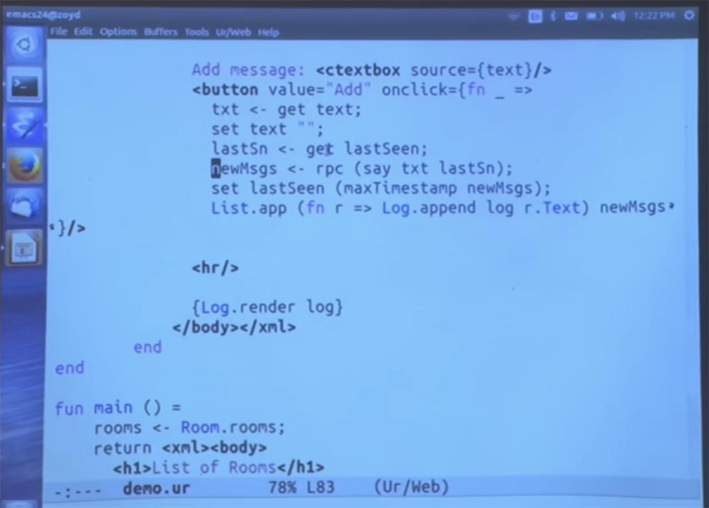

Это имя, оказывается, не находится в области действия, поэтому мы не смогли осуществить вызов прямо сюда. Но всё, что находится в области видимости функции, можно вызвать.

Давайте посмотрим, есть ли что-нибудь еще интересное в этой версии, о которой я хотел упомянуть. Она включает в себя реализацию виджета GUI с использованием функционального реактивного стиля, что здорово с точки зрения модульности программирования, но, возможно, менее здорово с точки зрения безопасности.

Давайте я приведу пример вызова метода этой абстракции из части страницы, которая отображает список строк текста, которые можно только добавить, но не удалить. Вы действительно можете обеспечить подомное, потому что у нас здесь нет DOM. Это совсем не то, когда любая часть кода может проникнуть в дерево документа и видоизменить его, изменить журнал и уничтожить ранее добавленные строки.

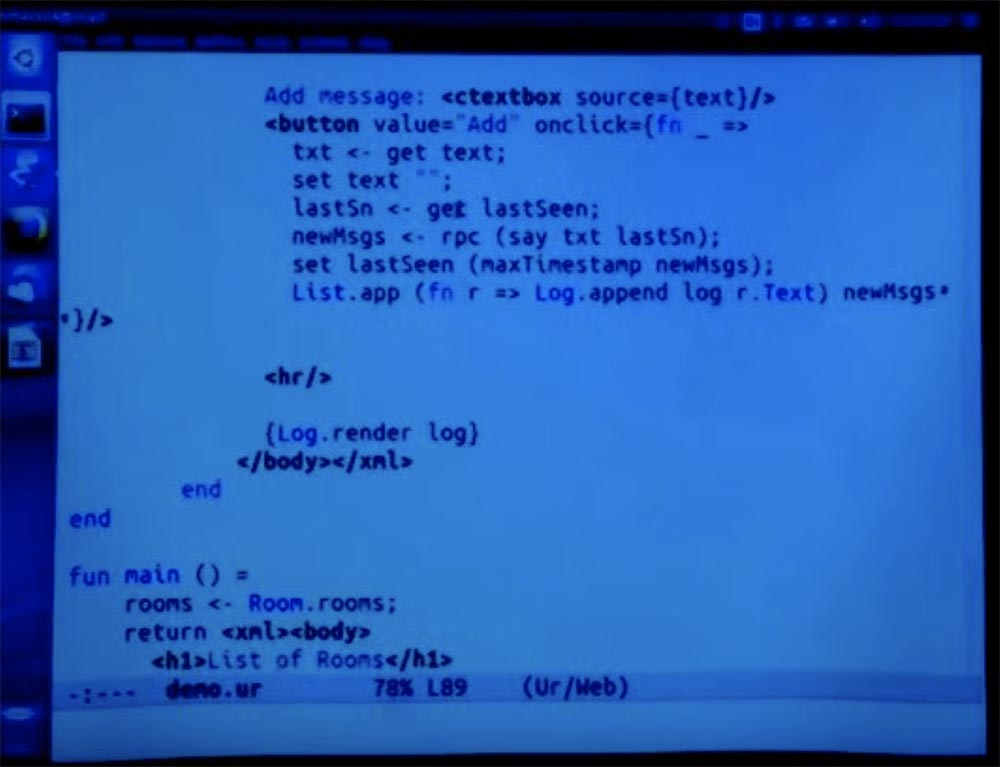

Здесь более функциональный стиль означает, что у вас действительно может быть виджет GUI, которому принадлежит часть страницы и элементы управления именно тем, что там показано, и другой код не может вмешиваться в вычисления, которые там появляются.

Итак, если больше нет вопросов, на этом мы завершим лекцию.

**Студент:** каналы?

**Профессор:** я не думаю, что у нас есть достаточно времени, чтобы должным образом продемонстрировать каналы. Но в конспекте лекции есть код, а на сайте выложены всевозможные демо-версии и обучающие материалы для этого проекта.

**Студент:** очень трудно писать правильные библиотеки и компиляторы. Как вы смягчаете проблемы, которые создают сами слои абстракции?

**Профессор:** лучший способ — это заставить людей пользоваться этими вещами и сообщать об ошибках. Это лучший совет, который я могу вам дать. Идея состоит в том, что подобные компиляторы следует писать гораздо реже, чем новые приложения. Потому что он собирает в одном месте все ошибки и старается их устранить, даже если это и не происходит самым эффективным способом.

**Студент:** почему вы выбрали такое имя для своего языка — Ur?

**Профессор:** Ur — это понятие из лингвистики, так назывался язык, который является предком современного языка. И идея в том, что этот язык позволяет вставлять внутрь него всякие другие языки. Так что это своего рода прародитель всех языков.

Полная версия курса доступна [здесь](https://ocw.mit.edu/courses/electrical-engineering-and-computer-science/6-858-computer-systems-security-fall-2014/).

Спасибо, что остаётесь с нами. Вам нравятся наши статьи? Хотите видеть больше интересных материалов? Поддержите нас оформив заказ или порекомендовав знакомым, **30% скидка для пользователей Хабра на уникальный аналог entry-level серверов, который был придуман нами для Вас:** [Вся правда о VPS (KVM) E5-2650 v4 (6 Cores) 10GB DDR4 240GB SSD 1Gbps от $20 или как правильно делить сервер?](https://habr.com/company/ua-hosting/blog/347386/) (доступны варианты с RAID1 и RAID10, до 24 ядер и до 40GB DDR4).

**VPS (KVM) E5-2650 v4 (6 Cores) 10GB DDR4 240GB SSD 1Gbps до декабря бесплатно** при оплате на срок от полугода, заказать можно [тут](https://ua-hosting.company/vpsnl).

**Dell R730xd в 2 раза дешевле?** Только у нас **[2 х Intel Dodeca-Core Xeon E5-2650v4 128GB DDR4 6x480GB SSD 1Gbps 100 ТВ от $249](https://ua-hosting.company/serversnl) в Нидерландах и США!** Читайте о том [Как построить инфраструктуру корп. класса c применением серверов Dell R730xd Е5-2650 v4 стоимостью 9000 евро за копейки?](https://habr.com/company/ua-hosting/blog/329618/)