Курс MIT «Безопасность компьютерных систем». Лекция 12: «Сетевая безопасность», часть 1 / Блог компании ua-hosting.company

### Массачусетский Технологический институт. Курс лекций #6.858. «Безопасность компьютерных систем». Николай Зельдович, Джеймс Микенс. 2014 год

Computer Systems Security — это курс о разработке и внедрении защищенных компьютерных систем. Лекции охватывают модели угроз, атаки, которые ставят под угрозу безопасность, и методы обеспечения безопасности на основе последних научных работ. Темы включают в себя безопасность операционной системы (ОС), возможности, управление потоками информации, языковую безопасность, сетевые протоколы, аппаратную защиту и безопасность в веб-приложениях.

Лекция 1: «Вступление: модели угроз» [Часть 1](https://habr.com/company/ua-hosting/blog/354874/) / [Часть 2](https://habr.com/company/ua-hosting/blog/354894/) / [Часть 3](https://habr.com/company/ua-hosting/blog/354896/)  
Лекция 2: «Контроль хакерских атак» [Часть 1](https://habr.com/company/ua-hosting/blog/414505/) / [Часть 2](https://habr.com/company/ua-hosting/blog/416047/) / [Часть 3](https://habr.com/company/ua-hosting/blog/416727/)  
Лекция 3: «Переполнение буфера: эксплойты и защита» [Часть 1](https://habr.com/company/ua-hosting/blog/416839/) / [Часть 2](https://habr.com/company/ua-hosting/blog/418093/) / [Часть 3](https://habr.com/company/ua-hosting/blog/418099/)  
Лекция 4: «Разделение привилегий» [Часть 1](https://habr.com/company/ua-hosting/blog/418195/) / [Часть 2](https://habr.com/company/ua-hosting/blog/418197/) / [Часть 3](https://habr.com/company/ua-hosting/blog/418211/)  
Лекция 5: «Откуда берутся ошибки систем безопасности» [Часть 1](https://habr.com/company/ua-hosting/blog/418213/) / [Часть 2](https://habr.com/company/ua-hosting/blog/418215/)  
Лекция 6: «Возможности» [Часть 1](https://habr.com/company/ua-hosting/blog/418217/) / [Часть 2](https://habr.com/company/ua-hosting/blog/418219/) / [Часть 3](https://habr.com/company/ua-hosting/blog/418221/)  
Лекция 7: «Песочница Native Client» [Часть 1](https://habr.com/company/ua-hosting/blog/418223/) / [Часть 2](https://habr.com/company/ua-hosting/blog/418225/) / [Часть 3](https://habr.com/company/ua-hosting/blog/418227/)  
Лекция 8: «Модель сетевой безопасности» [Часть 1](https://habr.com/company/ua-hosting/blog/418229/) / [Часть 2](https://habr.com/company/ua-hosting/blog/423155/) / [Часть 3](https://habr.com/company/ua-hosting/blog/423423/)  
Лекция 9: «Безопасность Web-приложений» [Часть 1](https://habr.com/company/ua-hosting/blog/424289/) / [Часть 2](https://habr.com/company/ua-hosting/blog/424295/) / [Часть 3](https://habr.com/company/ua-hosting/blog/424297/)  
Лекция 10: «Символьное выполнение» [Часть 1](https://habr.com/company/ua-hosting/blog/425557/) / [Часть 2](https://habr.com/company/ua-hosting/blog/425561/) / [Часть 3](https://habr.com/company/ua-hosting/blog/425559/)  
Лекция 11: «Язык программирования Ur/Web» [Часть 1](https://habr.com/company/ua-hosting/blog/425997/) / [Часть 2](https://habr.com/company/ua-hosting/blog/425999/) / [Часть 3](https://habr.com/company/ua-hosting/blog/426001/)  
Лекция 12: «Сетевая безопасность» [Часть 1](https://habr.com/company/ua-hosting/blog/426325/) / [Часть 2](https://habr.com/company/ua-hosting/blog/427087/) / [Часть 3](https://habr.com/company/ua-hosting/blog/427093/)

Сегодня мы поговорим о сетевой безопасности, в частности, обсудим статью Стивена Белловина под названием «Взгляд в прошлое: «Проблемы безопасности набора протоколов TCP/IP» (A Look Back at «Security Problems in the TCP/IP Protocol Suite»)». Этот парень раньше работал в AT&T, а теперь в работает в Колумбии. В этой работе интересно то, что она относительно старая – ей больше 10 лет, и фактически, это комментарии к статье, которая вышла десятилетием раньше в 1989 году.

Многие из вас, ребята, спрашивают, почему мы изучаем это, если многие из описанных там проблем были разрешены в сегодняшних редакциях протокола TCP?

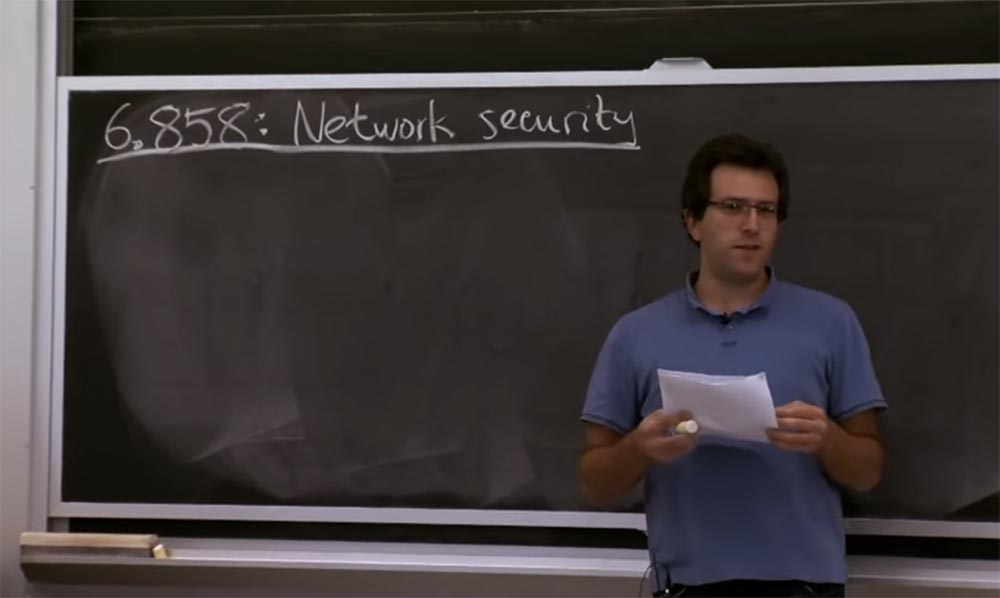

Это правда, некоторые из описанных Стивеном проблем с тех пор были решены, а некоторые из них до сих пор остаются проблемами. С учётом этого мы их отсортируем и посмотрим, что происходит. Вы можете задаться вопросом, почему люди не решили все эти проблемы в первую очередь при проектировании TCP? О чем они только думали?

И это на самом деле не понятно. А что вы думаете? Почему протокол TCP не обладал необходимой безопасностью, учитывая все эти соображения? Есть предположения?

**Студент:** в то время Интернет был гораздо более доверчивым местом.

**Профессор:** да, это была буквально цитата из статьи этого парня. Да, в то время в целом… набор Инетрнет-протоколов был разработан, я думаю, около 40 лет назад. Требования были совершенно другие. Нужно было просто подключить к общей сети кучу относительно доверчивых сайтов, которые знали друг друга по имени.

Я думаю, что это часто происходит в любой системе, которая становится успешной – ей требуются изменения. Раньше это было протоколом для небольшого числа сайтов, теперь этот протокол охватывает весь мир. И вы больше не знаете по имени всех людей, подключенных к Интернету. Вы не сможете позвонить им по телефону, если они сделают что-то плохое, и так далее.

Поэтому я думаю, что это история одинакова для многих протоколов, которые мы рассматриваем. И многие из вас, ребята, задаются вопросом типа: «о чем, черт возьми, думали эти парни? Это настолько ущербно»! Но в действительности, они проектировали совершенно другую систему, её просто адаптировали для современных нужд.

То же самое и Интернет, как мы рассматривали последние пару недель, был разработан для совсем другой цели. Но она расширилась, и у нас появились новые заботы, как адаптировать этот протокол к современным требованиям.

Есть еще одна вещь, которая произошла несколько внезапно, что людям пришлось переоценить серьёзность проблемы, связанной с безопасностью. Раньше было так, что ты на самом деле не понимал всех вещей, о которых следует беспокоиться, потому что не знал, что злоумышленник способен сделать с вашей системой.

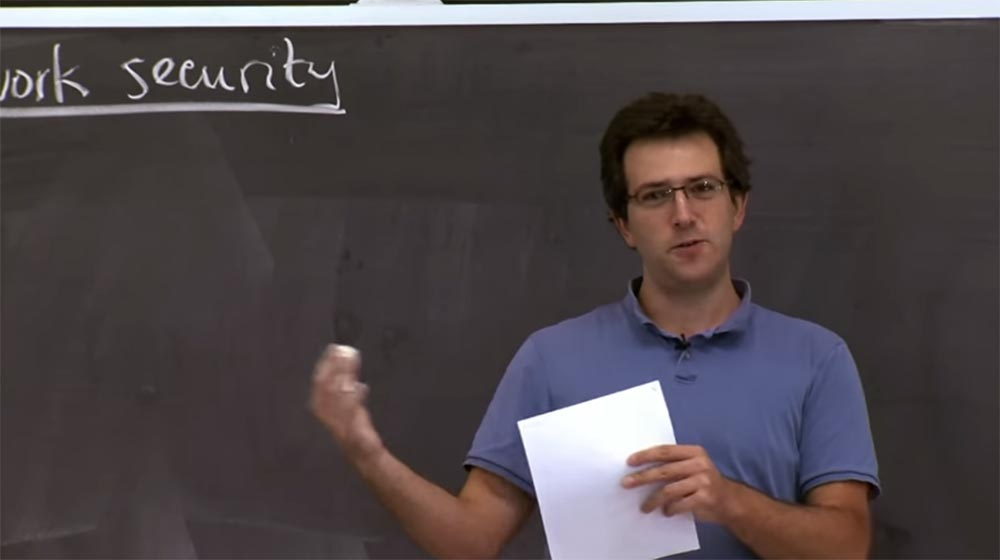

Я думаю, что отчасти по этой причине будет интересно посмотреть, что случилось с безопасностью TCP, что пошло не так, как мы можем это исправить, и так далее. В результате мы должны выяснить, каких видов проблем нужно избегать при разработке собственных протоколов, а также что собой представляет правильное мышление об атаках такого рода. Как узнать, что же такое злоумышленник способен сделать в вашем собственном протоколе, когда вы его только разрабатываете, чтобы затем избежать подобных подводных камней?

Ладно, оставим преамбулу в стороне и поговорим об этой статье.

Так как мы должны думать о безопасности в сети? Я думаю, мы могли бы начать с первого принципа и попытаться выяснить, какова наша модель угрозы. Итак, что атакующий сможет сделать в нашей сети?

Вероятно, у него есть возможность перехватывать пакеты, и возможно, он в состоянии модифицировать их. Таким образом, если вы отправляете пакет по сети, разумно будет предположить, что какой-то плохой парень будет видеть ваш пакет и сможет изменить его, прежде чем он достигнет места назначения. Он также может быть в состоянии отбросить его и использовать возможность вводить собственные пакеты с произвольным содержимым, которые вы никогда не отправляли.

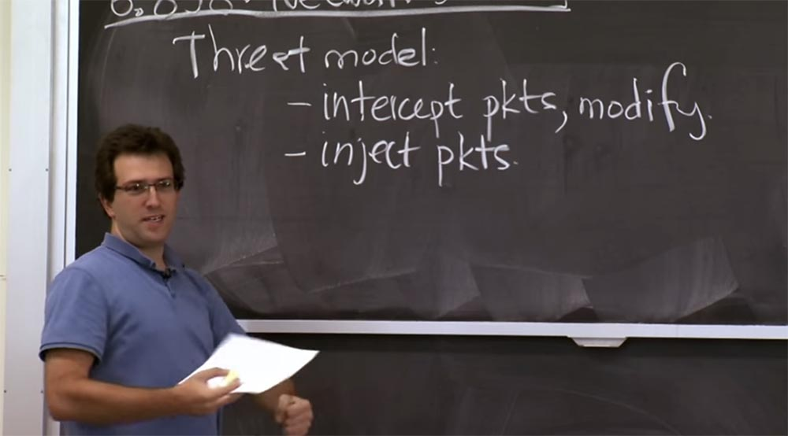

Но более опасна описываемая в статье возможность вмешательства плохих парней в ваши протоколы. Злоумышленник имеет свой собственный компьютер, который он полностью контролирует. Даже если все компьютеры, которым вы доверяете, ведут себя должным образом, плохой парень, у которого есть свой компьютер, может вмешаться в ваш протокол или работу системы.

Так что если у вас есть протокол маршрутизации, который включает в себя много людей, разговаривающих друг с другом, и некоторое масштабирование, вероятно, будет непрактично держать плохих парней снаружи. Если выполняется протокол маршрутизации с 10 участниками, тогда, возможно, вы можете просто позвонить всем им и затем сказать: «ну, да, ребята, я знаю вас всех».

Но в масштабах Интернета сегодня невозможно напрямую узнать, кто такие остальные участники сети, пользующиеся данным протоколом. Так что, вероятно, какой-то плохой парень собирается участвовать в ваших протоколах или распределенных системах. Поэтому важно конструировать распределенные системы, которые, тем не менее, могут сделать с этим что-то разумное.

Хорошо, так каковы последствия всего этого? Думаю, мы пройдемся по списку. Перехват пакетов — это в целом легко понять, нельзя посылать никаких важных данных по сети, если вы ожидаете, что плохой парень перехватит их, или, по крайней мере, не отправлять их в виде открытого текста. Возможно, вам стоит зашифровать свои данные.

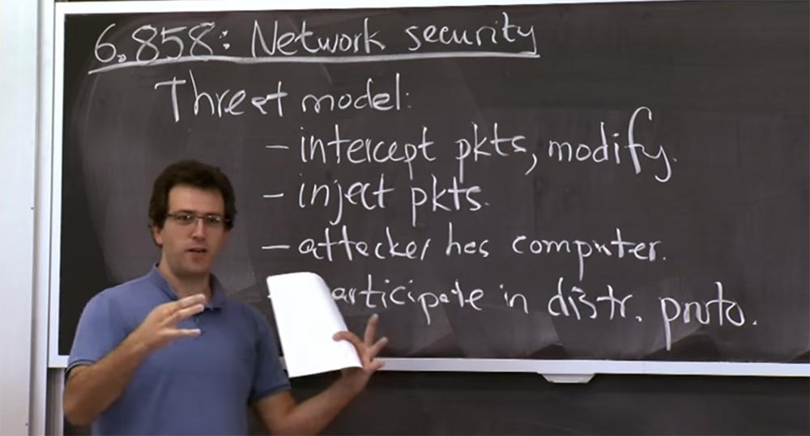

Это кажется относительно простым для понимания, хотя всё-равно надо иметь это в виду при разработке протоколов. Внедрение, или инъекция пакетов ведёт к более широкому кругу интересных проблем, о которых говорится в этой статье. В частности, злоумышленники могут вводить пакеты, которые могут выдавать себя за пакеты от любого другого отправителя. Так как путь передачи данных основан на использовании IP, то сам пакет имеет заголовок, в котором указан IP источника пакета и IP пункта назначения. При этом никто не проверяет, что источник обязательно правильный. В наши дни имеется некоторая фильтрация, но она не совершенна и на неё трудно положиться.

Итак, в первом приближении, атакующий может вставить внутрь любой IP-адрес в качестве источника и отправить его в правильный пункт назначения. Интересно выяснить, что же злоумышленник может сделать, имея возможность отправки произвольных пакетов.

В течение нескольких недель до этого, мы рассматривали вопросы переполнения буфера с точки зрения веб-безопасности. Мы рассмотрели, как злоумышленник может использовать такую ошибку реализации, как переполнения буфера. Интересно, что автор этой статьи на самом деле не заинтересовался ошибками реализации, его больше интересуют ошибки протокола.

Так что в этом такого особенного? Почему он не обратил внимания на ошибки реализации, хотя мы потратили на их рассмотрение несколько недель? Почему это имеет значение?

**Студент:** потому что мы должны исключать эти ошибки при написании протокола.

**Профессор:** да, это действительно большой провал из-за ошибки в дизайне протокола, потому что это трудно изменить. Так что если у вас есть ошибка реализации и у вас есть memcpy или print-out, который не проверял диапазон памяти, заметить эту ошибку невозможно. Но если у вас есть проверка диапазона, и она все еще работает, то переполнения буфера можно избежать, так что это замечательно.

Но если у вас есть какая-то ошибка в спецификации протокола, в том, как протокол должен работать, то исправление такой ошибки потребует исправления всего протокола, что означает потенциальное воздействие на все системы, которые говорят по этому протоколу. Так что если мы найдем какую-то проблему в протоколе TCP, потенциально это будет довольно разрушительно. Потому что в каждую машину, использующую TCP, придётся внести изменения, так как потенциально очень трудно сделать изменённый протокол совместимым со старой машиной.

Ошибки протокола TCP, которые так обеспокоили Стивена, носят фундаментальный характер, поэтому он решил о них рассказать. В первом примере он рассматривает то, как работают порядковые номера SN протокола TCP.

**Студент:** это немного не по теме, но мне просто любопытно. Допустим, вы нашли ошибку в TCP. Как вы внесёте в него изменения? Как вы сообщите всем компьютерам в мире, что это нужно изменить?

**Профессор**: да, я думаю, что это огромная проблема. Что делать, если вы нашли ошибку в TCP? Ну, непонятно, что делать. Я думаю, что автор здесь именно с этим и борется. Если бы можно было сделать редизайн TCP, то многие из этих ошибок относительно легко исправить, если заранее знать, что именно искать.

Но поскольку TCP довольно сложно исправить или изменить, в конечном итоге происходит следующее: разработчики пытаются найти обратно совместимые настройки, которые либо позволяют использовать старые реализации совместно с новой реализацией, или добавляют некоторое дополнительное поле, которое делает связь в некотором роде более безопасной.

Но это большая проблема. Если это какая-то проблема безопасности, которая глубоко укоренилась в TCP, то она станет огромной проблемой для всех, потому что очень сложно даже просто перейти на версию TCP, предположим, n плюс 1.

IPv6 можно рассматривать как пример того, что подобного не происходит, и нам известно, что эта проблема будет возникать ещё в течение 15 лет или 20 лет. IPv6 существует уже более 10 лет, но людей трудно убедить отойти от IPv4. Им вполне достаточно IPv4, это вроде как работает, и они считают, что перейти на новый интернет-протокол будет слишком накладно. Они считают: «никто больше не говорит на IPv6, так почему я должен начать говорить на этом странном протоколе, на котором со мной некому разговаривать?». В любом случае, это своего рода движение вперед, но я думаю, что оно займет много времени. Там действительно будут некоторые мотивации к миграции, и обратная совместимость в данном случае очень помогает.

IPv6 имеет множество возможностей обратной совместимости, например, вы можете поговорить с хостом IPv4 с помощью протокола IPv6. Поэтому разработчики пытаются спроектировать всю эту поддержку, но все же трудно убедить людей обновиться.

Итак, рассматривая порядковые номера TCP, мы собираемся на самом деле рассмотреть две проблемы, которые имеют отношение к тому, как работает «рукопожатие» TCP. Так что давайте потратим немного времени на то, чтобы рассмотреть, как изначально устанавливается TCP-соединение.

Для установки нового TCP-соединения отправляются три пакета. Наш клиент генерирует пакет для подключения к серверу, в котором говорится, что вот мой IP-адрес клиента, я отправляю его на сервер. При этом имеется структура заголовка пакета, состоящая из разных областей, но нас будет интересовать область порядкового номера. Здесь у нас будет флаг SYN, говорящий: «я хочу синхронизировать состояние и установить новое соединение», и он включает в себя порядковый номер клиента SNc.

Затем, когда сервер получает этот пакет, он говорит: „клиент хочет соединится со мной, так что я отправлю пакет обратно на этот адрес, кто бы при этом ни говорил, что пытается связаться со мной». Таким образом, сервер отправит пакет клиенту, куда включает свой собственный порядковый номер синхронизации сервера SNs и номер подтверждения клиента ACK (SNс). Наконец, третьим пакетом клиент отвечает серверу, подтверждая синхронизацию и высылая серверу номер подтверждения сервера ACK (SNs). Теперь клиент может начать отправлять данные.

Таким образом, для того, чтобы отправить данные, в начале соединения клиент должен включить некоторые данные в пакет и приложить порядковый номер клиента SNc, чтобы указать, что это на самом деле законные данные клиента. Он указывает, например, что это не какие-то данные из более поздних сообщений, которые просто приходят сейчас, потому что сервер пропустил некоторые начальные части данных.

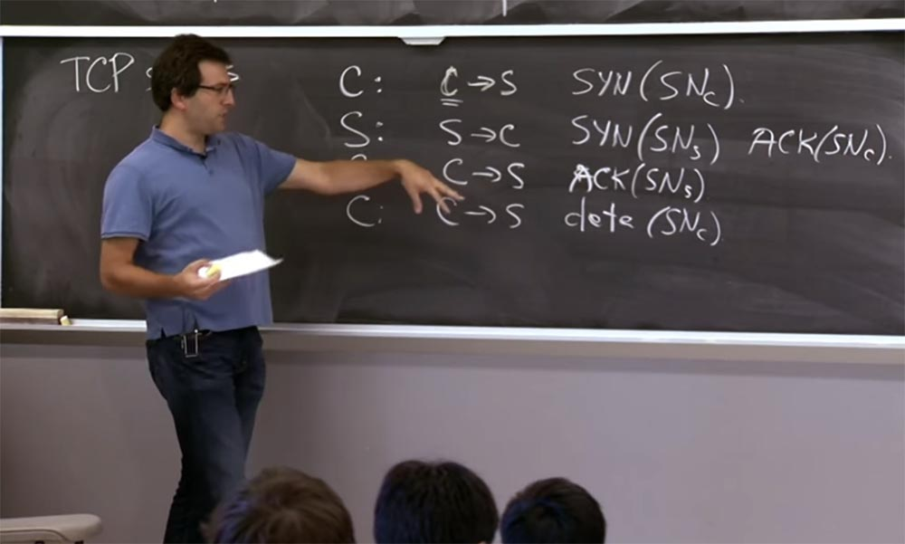

Таким образом, как правило, все эти порядковые номера предназначены для обеспечения доставки пакетов. Если клиент передает два пакета, тот, который имеет начальный порядковый номер, это первый фрагмент данных, следующий порядковый номер — следующий фрагмент данных. Это также полезно для обеспечения некоторых требований безопасности.

Перед этим я привёл пример, что эти требования меняются. Поэтому изначально никто не думал, что TCP должен обеспечивать какие-либо свойства безопасности. Но затем протокол TCP начали использовать приложения, и они как бы полагались на эти TCP соединения, считая, что они не могут быть разорваны каким-либо злоумышленником или что атакующий не сумеет вводить вредоносные данные в существующее TCP-соединение. Словно вдруг этот механизм, который изначально предназначался только для заказа пакетов, стал гарантировать некоторое подобие безопасности этих соединений.

Поэтому в этом случае я предполагаю, что проблема связана с тем, что мог предположить сервер относительно этого TCP соединения. Как правило, сервер предполагает — неявно, как вы можете себе представить — что это соединение устанавливается с нужным клиентом по этому IP адресу C, и для него естественно так считать. Но есть ли основания для такого предположения? Если сервер получает сообщение с некоторыми данными об этом соединении клиента с сервером, и оно имеет порядковый номер C, почему сервер делает вывод, что эти данные отправил настоящий клиент?

**Студент:** потому что порядковый номер трудно угадать.  
**Профессор:** правильно, так что это своего рода имплицитная вещь, подразумевающая, что здесь должен быть правильный порядковый номер SNс. И для того, чтобы это соединение установилось, клиент должен иметь подтвержденный порядковый номер сервера SNs, причем порядковый номер сервера отправляется сервером только на IP-адрес клиента.

**Студент:** сколько битов доступно для порядкового номера?

**Профессор:** порядковый номер в TCP имеет длину 32 бита, и хотя это не совсем случайное число, его нелегко угадать, на это потребовалось бы потратить много пропускной способности.

**Студент:** порядковый номер данных выше, чем начальный порядковый номер?

**Профессор:** да, в принципе, эти вещи увеличиваются. Поэтому каждый раз, когда вы отправляете SYN, это считается на 1 байт больше вашего порядкового номера. То есть если в первой строке у нас был аргумент (SNc), то в четвёртой будет уже (SNc+1), и затем нумерация продолжается отсюда. Таким образом, если вы передаете 5 байтов, то следующим будет значение (SNc) +6. Здесь просто подсчитываются байты, которые вы посылаете, при этом каждый SYN считается 1 байтом. В спецификации TCP рекомендуется выбирать эти порядковые номера так, чтобы их приращение происходило с некоторой грубо фиксированной скоростью. Первоначальные рабочие документы протокола RFC предполагали, что вы увеличиваете эти вещи примерно на 250000 единиц плюс 250000 в секунду.

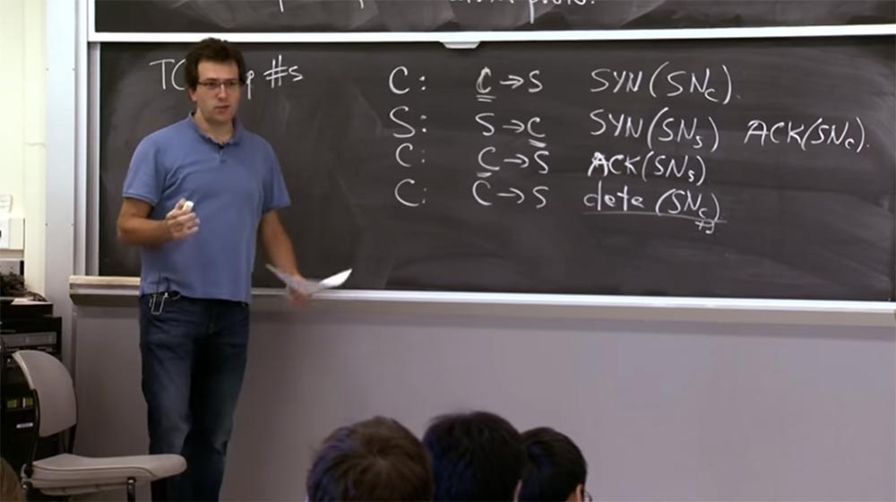

Причина, по которой это не было полностью случайным, заключается в том, что эти порядковые номера на самом деле используются для предотвращения вмешательства пакетов, вышедших из строя, или смешивания пакетов от предыдущих соединений с новыми соединениями. Каждый раз, когда вы устанавливаете новое соединение, вы выбираете вполне случайный порядковый номер. При этом существует некоторый шанс, что если вы устанавливаете серии соединений снова и снова, то некий пакет из предыдущего соединения будет иметь порядковый номер, достаточно похожий на порядковый номер вашего нового соединения и поэтому будет принят сервером в качестве допустимой части данных нового соединения.

Таким образом, это то, о чем очень беспокоились разработчики TCP — эти неупорядоченные пакеты или отложенные пакеты. В результате они действительно хотели, чтобы эти порядковые номера представляли собой достаточно монотонную последовательность по времени даже между соединениями.

Если я открыл одно соединение, оно может иметь тот же источник и назначение, номера портов, IP-адреса и так далее. Но поскольку я установил это соединение сейчас, а не раньше, пакеты из ранее отправленных сообщений, надеюсь, не совпадут с порядковыми номерами, которые у меня есть для моего нового соединения. Так что это был механизм для предотвращения путаницы между повторяющимися установлениями соединений.

**Студент:** если вы точно не знаете, каков будет шаг последовательности пакетов, как вы узнаете, что пакет, который вы получаете, является следующим пакетом, а не частью предыдущего, который вы…

**Профессор:** как правило, вы помните последний полученный пакет. И следующий порядковый номер это именно следующий пакет в последовательности. Так, например, сервер знает, что я видел именно часть данных date (SNc +1), то следующим будет пакет SYN (SNc +1), ведь предыдущим пакетом в начале установления соединения был SYN (SNc).

**Студент:** итак, вы говорите, что когда вы устанавливаете порядковый номер, то даже после этого вы…

**Профессор:** ну, конечно, эти порядковые номера, изначально, когда вы их устанавливаете, выбираются по какому-то плану. Мы поговорим об этом плане. Вы можете подумать, что они случайны, но со временем они должны представлять собой некоторый последовательный поток изменений начальных порядковых номеров для соединения.

Но в пределах одного соединения всё заканчивается, как только оно установлено — порядковые номера зафиксированы. И они просто помечают это соединение по мере того, как по нему отправляются данные.

Существовали планы, которые предлагали управлять этими порядковыми номерами. Фактически это были разумные планы для предотвращения дублирования пакетов в сети, что вызывало проблемы. Но конечно, проблема обнаружилась в том, что злоумышленники могли угадать эти порядковые номера, потому что было выбрано не так уж много случайностей.

Так, хост-компьютер выбрал бы эти порядковые номера и установил бы в памяти идущий счетчик, который увеличивает их каждую секунду на 250000\. И всякий раз, когда приходит новое соединение, оно помечалось бы некоей константой, такой как 64k или 128k, я забыл точное число. Так что было относительно легко догадаться, как можно угадать номер – вы просто отправляете им запрос на подключение и видите, какой порядковый номер SYN возвращается.

В этом случае вы знаете, что следующий номер будет на 64к выше него. Таким образом, в этом протоколе не было достаточного количества случайностей.

Мы можем просто набросать, как это выглядит. Представим, что я злоумышленник, который хочет подключиться к серверу, но при этом сделать вид, что запрос поступает от конкретного IP-адреса.  
Что я мог бы сделать, так это отправить запрос на сервер, подобно тому, как это сделано на первом шаге предыдущей схемы установки соединения, и вставить туда некоторый начальный порядковый номер, который я выбрал. На этом этапе любой порядковый номер одинаково хорош, потому что сервер не имеет никаких предположений о том, как должен выглядеть этот порядковый номер клиента.

Итак, что делает сервер? Сервер получает тот же пакет, что и раньше, и поступает так же, как и раньше — он отправляет пакет обратно клиенту с некоторым порядковым номером сервера и признает SNc. И теперь, если злоумышленник хочет установить соединение, ему нужно как-то синтезировать пакет, который выглядит точно так же, как третий пакет настоящего клиента, так как ему необходимо отправить пакет от клиента на сервер.

Это достаточно просто, вы просто заполняете эти значения в заголовке. Но вместе с этим вы должны признать порядковый номер сервера ACK (SNs).

Вот тут-то и начинаются проблемы.

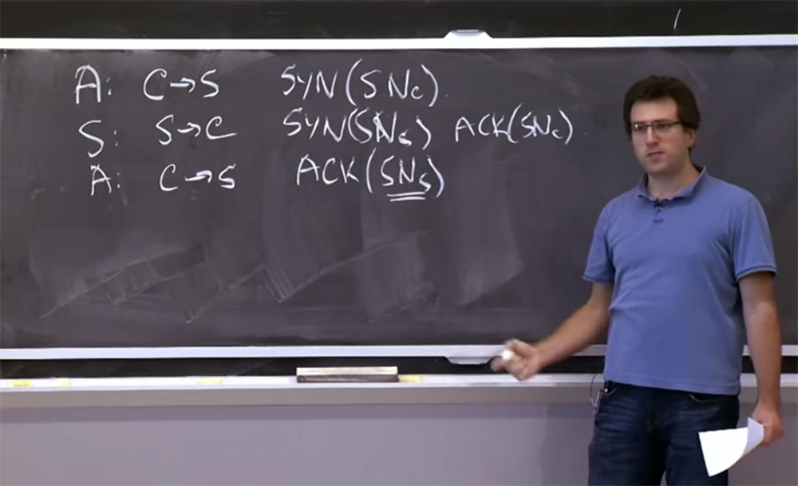

Если значение SNs относительно несложно угадать, тогда злоумышленник может далеко зайти, потому что теперь сервер думает, что установил соединение с клиентом с этого IP-адреса C.

Теперь злоумышленник может внедрить данные в это соединение, как и раньше. Он просто синтезирует пакет, который выглядит следующим образом: он имеет данные, и у него есть порядковый номер клиента, который на самом деле выбрал атакующий, то есть это сообщение вида data (SNc +1).

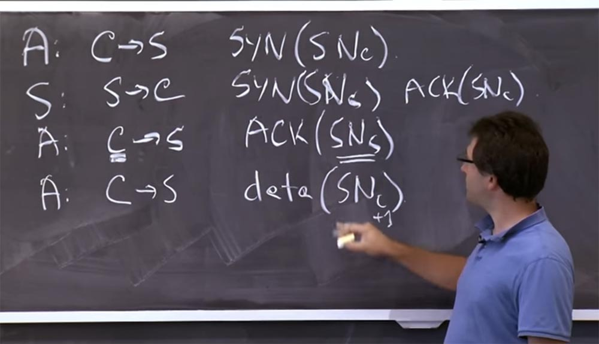

Но здесь все зависит от способности угадать этот определенный порядковый номер сервера (SNs). Это понятно?

**Студент:** какова причина того, что порядковые номера сервера не совсем случайные?

**Профессор:** существуют две причины. Одна, как я описывал ранее, заключается в том, что сервер хочет убедиться, что пакеты из разных соединений со временем не перепутаются друг с другом. Так, если вы установите соединение от исходного порта к порту назначения, закроете это соединение и затем снова установите еще одно соединение из того же исходного порта к порту назначения, вы захотите убедиться, что пакеты из одного соединения не отображаются в другом соединении.

**Студент:** таким образом, порядковый номер сервера инкрементирован, то есть увеличивается для каждого из пакетов?

**Профессор:** порядковые номера в соединении привязаны ко всем данным в соединении. Но возникает вопрос, как здесь выбирается первоначальный порядковый номер?

Это происходит каждый раз, когда устанавливается новое соединение. Так что надежда заключается в том, что времени, за которое он обернётся вокруг 32 бит и вернётся обратно, будет достаточно, чтобы все старые пакеты в сети фактически были отброшены и больше не отображались как дубликаты.

Так вот почему вы не просто выбираете случайные точки, или разработчики изначально не выбирали случайные точки.

**Студент:** так это проблема между соединениями, для соединения между тем же клиентом, тем же сервером, тем же исходным портом и тем же местом назначения. Но мы беспокоимся о старых пакетах…

**Профессор:** да, именно поэтому разработчики TCP так беспокоились о способе выбора начальных порядковых номеров.

**Студент:** так что если у вас есть разные новые соединения, то вы сможете отличать их друг от друга.

**Профессор:** да, это правда.

**Студент:** тогда я не понимаю, почему использовали увеличение порядковых номеров, а не просто брали их случайным образом.

**Профессор:** я думаю, что причина, по которой они не выбирают порядковые номера случайным образом, заключается в следующем. Если вы выбрали их случайным образом и установили, например, 1000 соединений за короткий промежуток времени с того же исходного порта к тому же месту назначения, то каждый из этих номеров является некоторым случайным значением 2 в 32 степени.

При этом существует нетривиальный шанс, что какой-то пакет из одного соединения будет задержан в сети, и в конечном счете обнаружится снова, после чего перепутается с пакетом от другого соединения. Это не имеет никакого отношения к безопасности. Это как раз та их конструкция, которая первоначально предназначалась для надёжной поставки пакетов.

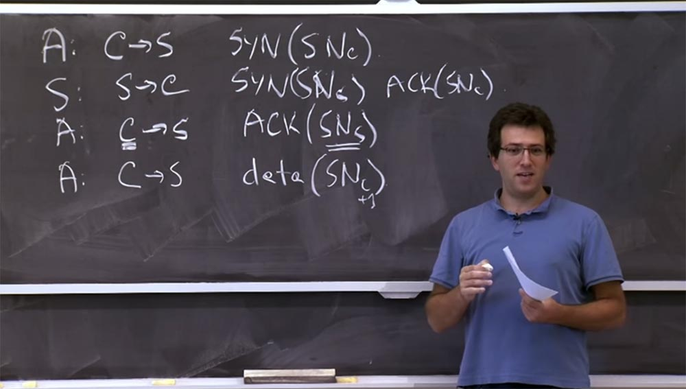

**Студент:** злоумышленник выступает как какой-то другой клиент сервера, верно?

**Профессор:** да, это правда. На самом деле мы не сказали, почему атакующий так поступает, ведь он мог просто зайти с его старого IP-адреса, верно?

**Студент:** что же в этом случае произойдёт с сервером?

**Профессор:** это действительно интересный вопрос — что же здесь происходит? Ведь этот пакет из второй строчки схемы не просто отбрасывается, он отправляется к компьютеру клиента. И что при этом происходит?

**Студент:** они просто упомянули, что атакующие пытаются сделать это, когда другие компьютеры обновлялись, перезагружались, выключались или что-то в этом роде.

**Профессор:** да, конечно, они чувствуют, что компьютер отключен от сети, и пакет будет отброшен, тогда им не стоит особо беспокоиться об этом. Но если компьютер действительно прослушивает этот IP-адрес, то в протоколе TCP вы должны отправить пакет сброса, сбрасывающий соединение, потому что это не то соединение, о котором знает компьютер С.

В TCP предполагается, что может быть это какой-то старый пакет, который я запрашивал давно, но забыл об этом, в таком случае компьютер C может отправить на сервер пакет RST (SN…), говорящий, что он хочет перезагрузку.

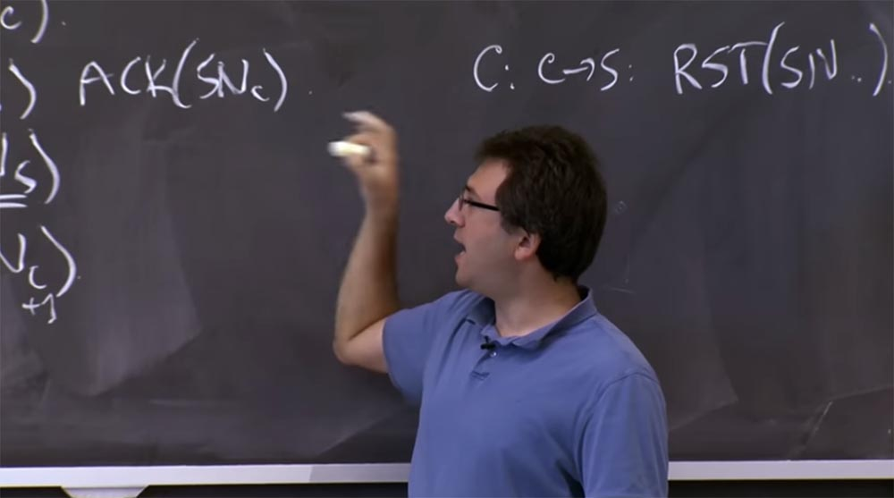

Вообще-то забыл, какой именно порядковый номер туда входит, но клиент C знает все порядковые номера и отправляет любой порядковый номер по мере необходимости, чтобы сбросить это соединение.

Поэтому, если компьютер C собирается сделать такое, то это может помешать вашему плану установить соединение. Потому что, когда S получает этот пакет, он говорит: «о, конечно, если вы этого не хотите, я сброшу ваше соединение».

Есть некоторые ошибки реализации, которые вы можете использовать, или, по крайней мере, автор статьи говорит о возможности их потенциального использования, которые способны помешать клиенту C ответить серверу.

Например, если вы «завалите» компьютер C большим количеством пакетов, то это простой способ заставить его их отбросить. Есть и другие более интересные ошибки, которые не требуют «бомбардировки» C большим количеством пакетов, которые вынудят его отказаться от этого пакета. По крайней мере, такие ошибки встречаются в некоторых реализациях стеков TCP.

**Студент:** предположительно, большинство файрволов также могут отбросить пакет. Предположим, что клиент изначально не послал SYN на данный сервер, и файрвол собирается отбросить входящий пакет.

**Профессор:** существует такая возможность, но она зависит о того, насколько сложный файрвол у вас имеется. Конечно, если у вас есть очень сложный брандмауэр с отслеживанием состояния всех существующих соединений, или, например, если у вас есть NAT, то такое могло бы произойти. Но с другой стороны, NAT фактически может отправить RST от имени клиента, так что это не совсем хорошо. Я думаю, что подобное, то есть отбрасывание пакетов файрволом, случается не так часто, например, в сети Comcast никто не перехватывал эти пакеты и не поддерживал для меня состояние соединения, отправляя RST от моего имени.

**Студент:** почему же сервер не может иметь независимые порядковые номера для каждого возможного источника?

**Профессор:** да, это то, чем занимаются сегодня стеки TCP. Это один из примеров того, как исправить проблему обратной совместимости. Если вы посмотрите на это внимательно, то заметите, что нет необходимости, чтобы этот начальный порядковый номер был глобальным. Вы просто приписываете его к каждой паре источник/назначение, и тогда у вас появляется возможность сохранить все свойства предотвращения дублирования плюс определённая безопасность.

Я напишу на доске, как злоумышленник получает этот начальный порядковый номер data (SNc +1). Вероятно, злоумышленник просто отправит соединение с собственного IP-адреса на сервер, говорящее: «я хочу установить новое соединение», и сервер отправит ответ атакующему, в котором будет содержаться собственный порядковый номер сервера S.

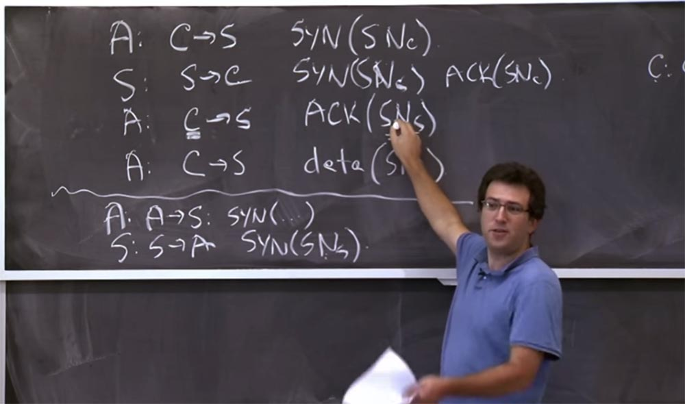

И если этот SYN (SNs) для этого соединения в последней строке и (SNs) в третьей строке связаны, тогда это действительно проблема. Но вы говорите — давайте сделаем их не связанными, потому что это номер с другого IP-адреса, поэтому это больше не проблема. Вы не можете догадаться, что этот SNS будет основан на SNS для другого соединения.

25:50 мин

[Курс MIT «Безопасность компьютерных систем». Лекция 12: «Сетевая безопасность», часть 2](https://habr.com/company/ua-hosting/blog/427087/)

Полная версия курса доступна [здесь](https://ocw.mit.edu/courses/electrical-engineering-and-computer-science/6-858-computer-systems-security-fall-2014/).

Спасибо, что остаётесь с нами. Вам нравятся наши статьи? Хотите видеть больше интересных материалов? Поддержите нас оформив заказ или порекомендовав знакомым, **30% скидка для пользователей Хабра на уникальный аналог entry-level серверов, который был придуман нами для Вас:** [Вся правда о VPS (KVM) E5-2650 v4 (6 Cores) 10GB DDR4 240GB SSD 1Gbps от $20 или как правильно делить сервер?](https://habr.com/company/ua-hosting/blog/347386/) (доступны варианты с RAID1 и RAID10, до 24 ядер и до 40GB DDR4).

**VPS (KVM) E5-2650 v4 (6 Cores) 10GB DDR4 240GB SSD 1Gbps до декабря бесплатно** при оплате на срок от полугода, заказать можно [тут](https://ua-hosting.company/vpsnl).

**Dell R730xd в 2 раза дешевле?** Только у нас **[2 х Intel Dodeca-Core Xeon E5-2650v4 128GB DDR4 6x480GB SSD 1Gbps 100 ТВ от $249](https://ua-hosting.company/serversnl) в Нидерландах и США!** Читайте о том [Как построить инфраструктуру корп. класса c применением серверов Dell R730xd Е5-2650 v4 стоимостью 9000 евро за копейки?](https://habr.com/company/ua-hosting/blog/329618/)