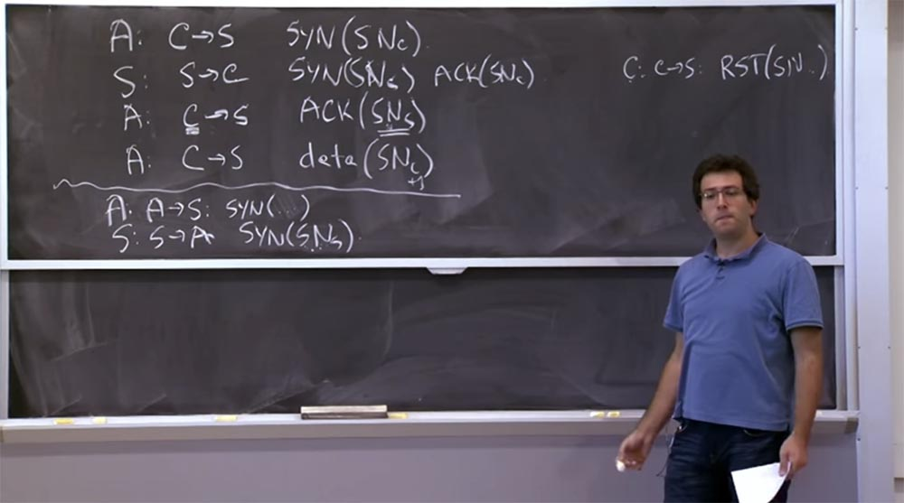
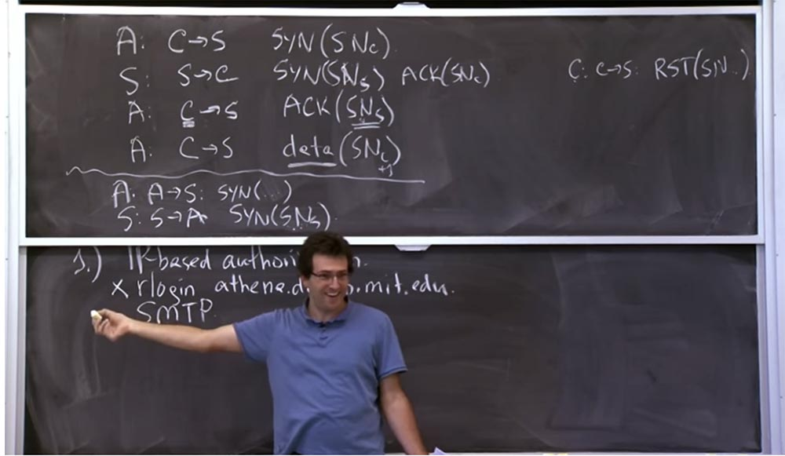
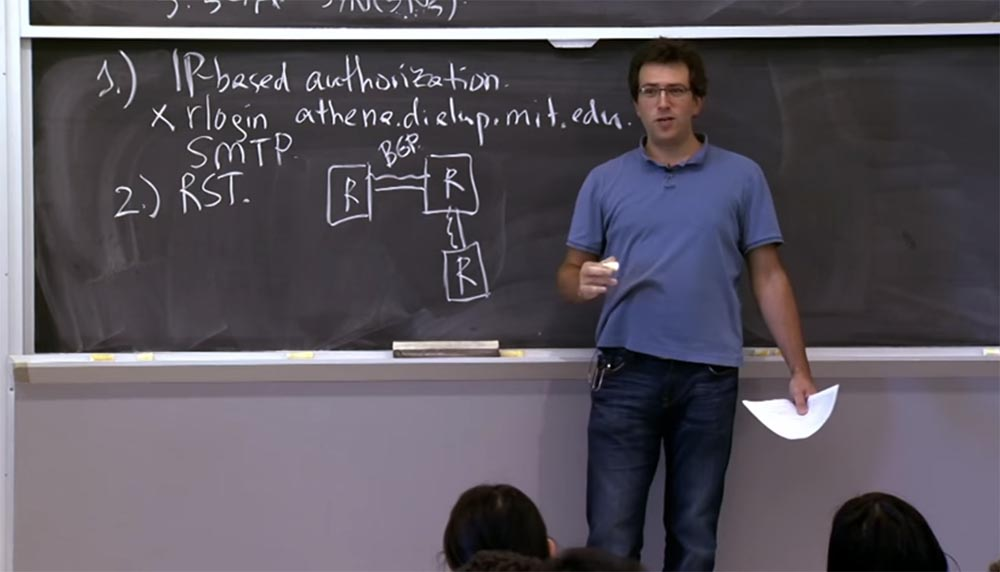
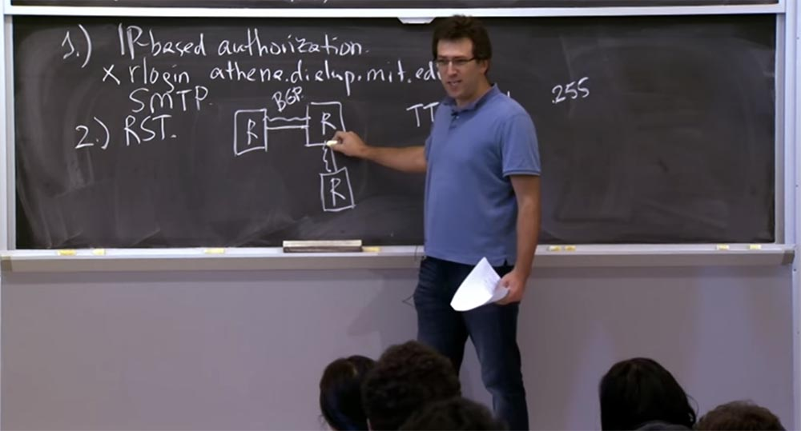
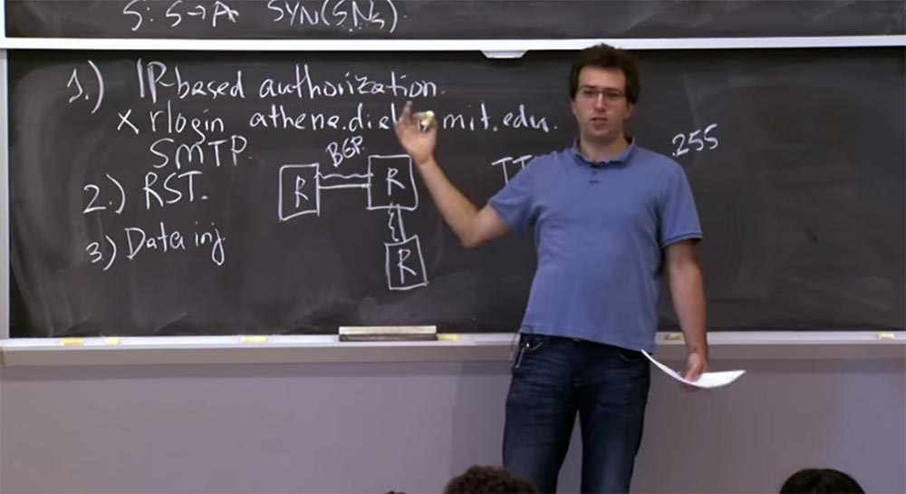
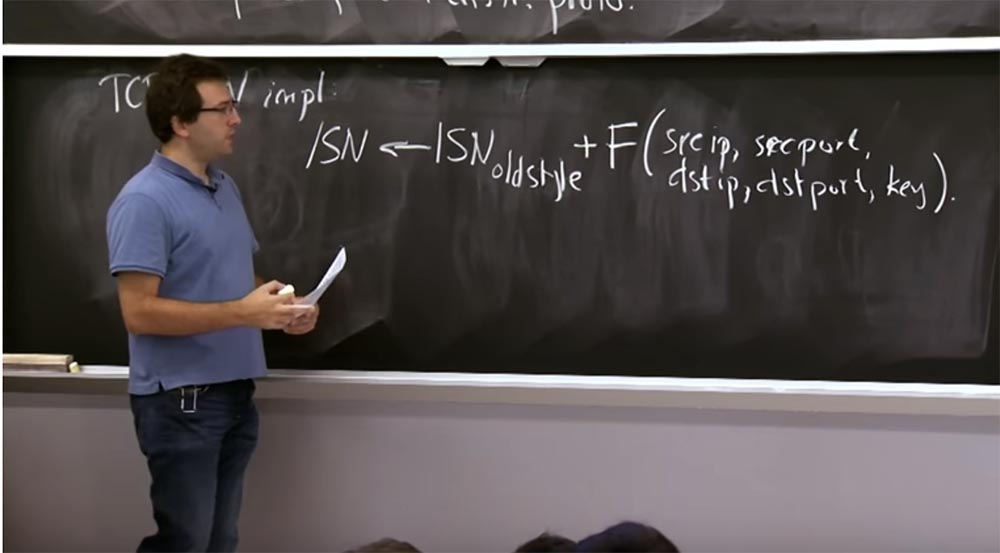
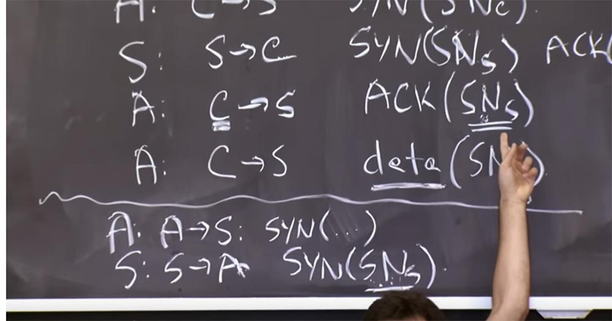
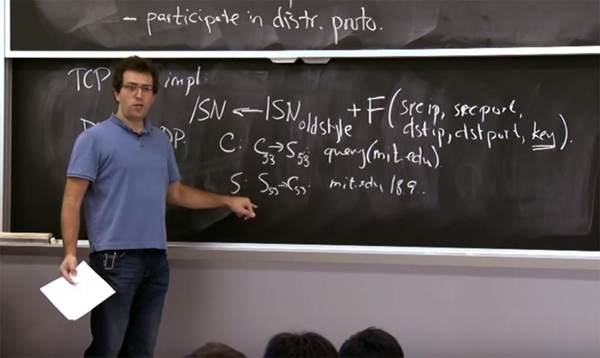
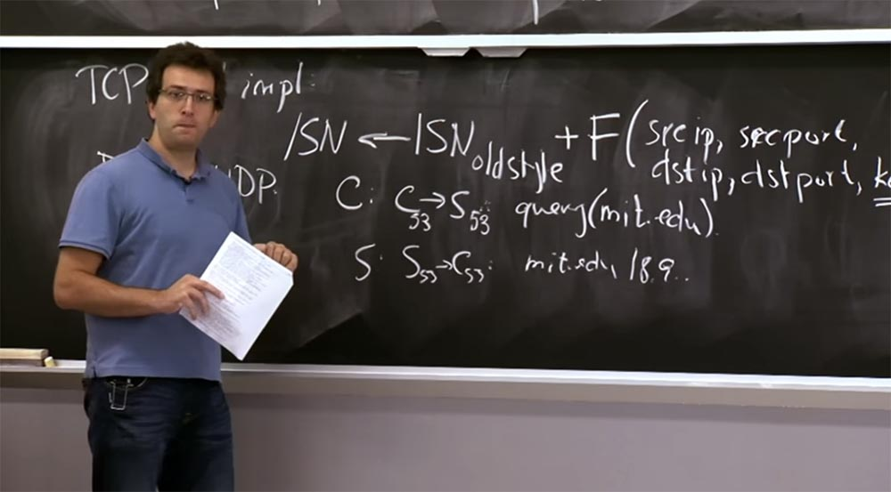
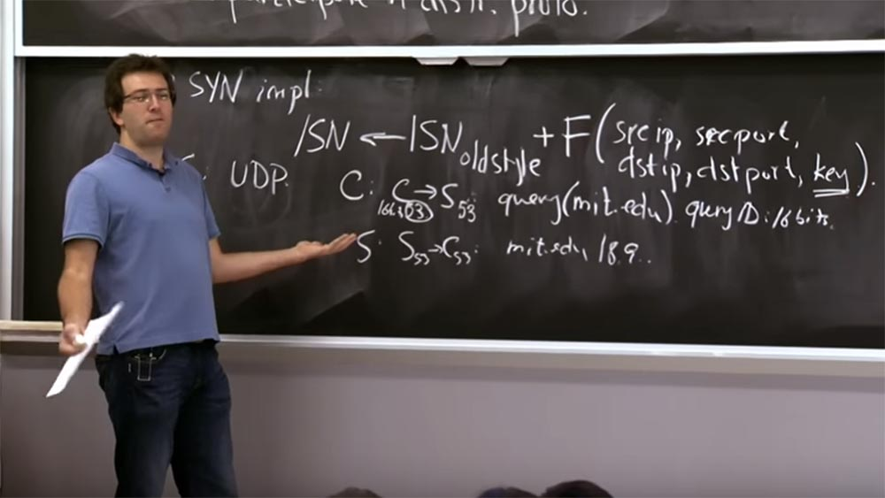

Курс MIT «Безопасность компьютерных систем». Лекция 12: «Сетевая безопасность», часть 2 / Блог компании ua-hosting.company

### Массачусетский Технологический институт. Курс лекций #6.858. «Безопасность компьютерных систем». Николай Зельдович, Джеймс Микенс. 2014 год

Computer Systems Security — это курс о разработке и внедрении защищенных компьютерных систем. Лекции охватывают модели угроз, атаки, которые ставят под угрозу безопасность, и методы обеспечения безопасности на основе последних научных работ. Темы включают в себя безопасность операционной системы (ОС), возможности, управление потоками информации, языковую безопасность, сетевые протоколы, аппаратную защиту и безопасность в веб-приложениях.

Лекция 1: «Вступление: модели угроз» [Часть 1](https://habr.com/company/ua-hosting/blog/354874/) / [Часть 2](https://habr.com/company/ua-hosting/blog/354894/) / [Часть 3](https://habr.com/company/ua-hosting/blog/354896/)  
Лекция 2: «Контроль хакерских атак» [Часть 1](https://habr.com/company/ua-hosting/blog/414505/) / [Часть 2](https://habr.com/company/ua-hosting/blog/416047/) / [Часть 3](https://habr.com/company/ua-hosting/blog/416727/)  
Лекция 3: «Переполнение буфера: эксплойты и защита» [Часть 1](https://habr.com/company/ua-hosting/blog/416839/) / [Часть 2](https://habr.com/company/ua-hosting/blog/418093/) / [Часть 3](https://habr.com/company/ua-hosting/blog/418099/)  
Лекция 4: «Разделение привилегий» [Часть 1](https://habr.com/company/ua-hosting/blog/418195/) / [Часть 2](https://habr.com/company/ua-hosting/blog/418197/) / [Часть 3](https://habr.com/company/ua-hosting/blog/418211/)  
Лекция 5: «Откуда берутся ошибки систем безопасности» [Часть 1](https://habr.com/company/ua-hosting/blog/418213/) / [Часть 2](https://habr.com/company/ua-hosting/blog/418215/)  
Лекция 6: «Возможности» [Часть 1](https://habr.com/company/ua-hosting/blog/418217/) / [Часть 2](https://habr.com/company/ua-hosting/blog/418219/) / [Часть 3](https://habr.com/company/ua-hosting/blog/418221/)  
Лекция 7: «Песочница Native Client» [Часть 1](https://habr.com/company/ua-hosting/blog/418223/) / [Часть 2](https://habr.com/company/ua-hosting/blog/418225/) / [Часть 3](https://habr.com/company/ua-hosting/blog/418227/)  
Лекция 8: «Модель сетевой безопасности» [Часть 1](https://habr.com/company/ua-hosting/blog/418229/) / [Часть 2](https://habr.com/company/ua-hosting/blog/423155/) / [Часть 3](https://habr.com/company/ua-hosting/blog/423423/)  
Лекция 9: «Безопасность Web-приложений» [Часть 1](https://habr.com/company/ua-hosting/blog/424289/) / [Часть 2](https://habr.com/company/ua-hosting/blog/424295/) / [Часть 3](https://habr.com/company/ua-hosting/blog/424297/)  
Лекция 10: «Символьное выполнение» [Часть 1](https://habr.com/company/ua-hosting/blog/425557/) / [Часть 2](https://habr.com/company/ua-hosting/blog/425561/) / [Часть 3](https://habr.com/company/ua-hosting/blog/425559/)  
Лекция 11: «Язык программирования Ur/Web» [Часть 1](https://habr.com/company/ua-hosting/blog/425997/) / [Часть 2](https://habr.com/company/ua-hosting/blog/425999/) / [Часть 3](https://habr.com/company/ua-hosting/blog/426001/)  
Лекция 12: «Сетевая безопасность» [Часть 1](https://habr.com/company/ua-hosting/blog/426325/) / [Часть 2](https://habr.com/company/ua-hosting/blog/427087/) / [Часть 3](https://habr.com/company/ua-hosting/blog/427093/)

**Студент:** возможно, у вас все еще есть проблема столкновения интересов, потому что вы могли бы задействовать 32 бита для адресов пиров и у вас имеется множество портов для каждого из них. Вероятно, у вас имеется конфликт порядковых номеров всех этих соединений, которые вы получаете?

**Профессор:** получается, что эти порядковые номера специфичны для IP-адреса и номера порта пары источник/назначение. Так что если это разные порты, то они совершенно не мешают друг другу. Если говорить конкретно, порты имеют меньшие порядковые номера.

**Студент:** если порядковые номера являются глобальными, то не может ли атакующий попасть в соединение между другими клиентами?

**Профессор:** да, это хорошее замечание. На самом деле, если сервер увеличивает порядковый номер, например, на 64k для каждого соединения, вы соединяетесь с сервером, а потом с ним соединяются ещё 5 человек, и здесь можно организовать атаку. Так что в какой-то степени, вы правы, это немного хлопотно. С другой стороны, вы могли бы, вероятно, сделать так, что пакет из последней строки S->A был бы доставлен непосредственно перед этим пакетом в первой строчке C->S. Если вы посылаете свои пакеты друг за другом, есть хороший шанс, что они прибудут на сервер также один за другим.

Сервер получит S->A и ответит этим порядковым номером (SNs). Он будет другой, чем (SNs) во второй строке, но с порядковым номером, который следует сразу за ним. И тогда вы будете точно знать, какой порядковый номер (SNs) следует вложить в третий пакет вашей последовательности.  
Поэтому я думаю, что это не слишком надежный способ подключения к серверу, он основан на допущениях. Но если вы тщательно расположите свои пакеты нужным образом, то сможете легко отгадать последовательность. Или, может быть, вы попробуете несколько раз, и вам повезет.

**Студент:** даже если номера генерируются совершенно случайно, вам нужно угадать один из 4 миллиардов возможных номеров. Это не слишком большое количество, верно? Я думаю, что в течение года вы, вероятно, сможете пробиться в эту сеть.

**Профессор:** да, вы абсолютно правы. Вы не должны слишком полагаться на TCP в смысле обеспечения безопасности. Потому что вы правы, это всего лишь 4 миллиарда догадок. И вероятно, вы сможете отправлять в течение дня очень много пакетов, если у вас есть достаточно быстрое соединение.

Таким образом, у нас здесь имеется своего рода интересный аргумент по поводу ненадёжности TCP, потому что у нас имеется только 32 бита. Мы никак не можем его обезопасить. Но я думаю, что множество приложений, которые в достаточной мере полагаются на этот протокол, вообще не задумываются о безопасности, и это действительно становится проблемой.

Но вы абсолютно правы. На практике вы хотите использовать сверх этого какое-то шифрование, чтобы получить более серьёзные гарантии, что никто не подделал ваши данные, так как вы используете ключи шифрования длиной более 32 бит. В большинстве случаев это всё еще оказывается действенным для предотвращения вмешательств в TCP-соединение.

Давайте теперь посмотрим, почему плохо, если люди смогут подделывать TCP-соединения с произвольных адресов?

Одна из причин, почему это плохо – это может влиять на авторизацию на основе IP-адреса, когда сервер проверяет, с какого адреса пришёл запрос. Если некий сервер решает на основе IP-адреса, разрешать или запрещать соединение, потенциально это может быть проблемой для злоумышленника, который подделал соединение от произвольного адреса источника.

Итак, один пример, где это было проблемой, на сегодня эта проблема в основном решена, это использование семейства команд r, таких как rlogin. Раньше было так, что вы могли бы запустить что-то вроде rlogin для компьютера по адресу, скажем, athena.dialup.mit.edu. И если ваше соединение идёт от хоста MIT, тогда эта команда rlogin будет успешной, если вы скажете: «да, я пользователь Алиса на этом компьютере, позвольте мне зайти как пользователь Алиса на другой компьютер». И данная операция будет позволена, поскольку все компьютеры в сети mit.edu заслуживают доверия, чтобы делать такие заявления.

Я должен сказать, что у dial-up никогда не было этой проблемы. Это соединение использовало «Цербер» с самого начала. Но другие системы, конечно, имели такие проблемы. И это является примером использования IP-адреса в механизме проверки подлинности соединения, когда система проверяет, заслуживает ли доверия клиент, вызывающий сервер. Так что то, что раньше было проблемой, теперь ей не является. Но полагаться на IP всё равно кажется явно плохим планом.

Сейчас rlogin уже не используется, недавно он был заменен безопасной оболочкой SSH, которая является отличным протоколом сетевого уровня. С другой стороны, есть еще много других примеров протоколов, которые полагаются на авторизацию на основе IP-адреса. Одним из них является SMTP. Когда вы отправляете электронную почту, вы используете SMTP, чтобы поговорить с некоторым почтовым сервером для того, чтобы отправлять сообщения. Чтобы предотвратить спам, многие SMTP-серверы принимают входящие сообщения только с определенного исходного IP-адреса. Так, например, почтовый сервер Comcast принимает почту только с IP-адресов Comcast. То же самое для почтовых серверов MIT – они будут принимать почту только с IP-адресов MIT. Но у нас был, по крайней мере, один сервер, который не работал как нужно, используя IP-аутентификацию.

Здесь всё не так уж и плохо. В худшем случае, вы отправите часть спама через почтовый сервер. Так что, вероятно, поэтому они все еще используют rlogin, в то время как вещи, которые позволяют вам войти в произвольную учетную запись, перестали использовать идентификацию на основе IP-адресов.

Итак, почему такой механизм аутентификации — это плохой план? Как допущение предположим, что какой-то сервер использовал rlogin. Что бы вы сделали, чтобы атаковать? Что плохого при этом может произойти?

**Студент:** злоумышленник просто может попасть в ваш компьютер, подделать пользователя, который собирается войти в сеть с вашим логином, и получить доступ к сети.

**Профессор:** да, в основном злоумышленник захватывает компьютер. Он синтезирует данные, выглядящие как допустимый набор команд rlogin, которые говорят: «войдите как этот пользователь и выполните эту команду в моей оболочке Unix».

Вы синтезируете эти данные data (SNc +1), монтируете всю атаку и отправляете эти данные, как если бы с клиентом rlogin взаимодействовал законный пользователь, и тогда вы можете действовать дальше.

Хорошо, это одна из причин, почему вы не хотите, чтобы ваши порядковые номера TCP можно было бы угадать. Еще одна проблема — эти атаки сброса reset attack. Точно так же, как мы могли бы отправить SYN пакет, если знаем чей-то порядковый номер, точно также мы можем отправить пакет сброса.

Мы кратко упомянули легальный клиент, который посылает пакет сброса фальшивого соединения, которое установил злоумышленник. Атакующий точно так же может попытаться передать пакеты сброса для существующего соединения, если он каким-то образом знает, что ваш порядковый номер находится в этом соединении. На самом деле неясно, насколько велика эта проблема.

На каком-то уровне вы должны предполагать, что все ваши TCP-соединения могут быть нарушены в любом случае и в любое время, то есть не похоже, что ваша сеть надежна. Поэтому, возможно, вы должны ожидать разрыва соединений.

В случае, когда маршрутизаторы «разговаривают» друг с другом, это предположение носит особенно критический характер. Если у вас есть множество роутеров, которые общаются между собой с помощью некоторых протоколов маршрутизации, то между ними имеются какие-то физические связи. Но поверх этих физических связей они общаются по сетевому протоколу, который работает через TCP. Фактически в каждой из этих физических связей, которые роутеры используют для обмена информацией о маршрутизации, запущен сеанс TCP. Здесь используется протокол BGP, о котором мы поговорим позже.

Этот протокол BGP использует тот факт, что если TCP-соединение живо, то живо и физическое соединение. Так что если происходит разрыв TCP-соединения, роутер считает, что связь разорвана и начинает пересчитывать все свои таблицы маршрутизации.

Поэтому, если противник хочет устроить здесь какую-то атаку отказа в обслуживании DoS, он может попробовать угадать порядковые номера этих маршрутизаторов и сбросить эти сеансы. Если TCP-сеанс между двумя маршрутизаторами выключается, оба маршрутизатора считают, что это соединение мертво и они должны пересчитать все таблицы маршрутизации, из-за чего маршруты изменятся. После этого атакующий может сбросить другое соединение, и так далее.

Таким образом, это несколько тревожная атака, и не потому, что она нарушает чью-то тайну и так далее, по крайней мере, не напрямую, а потому что это действительно вызывает много проблем с доступом для других пользователей системы.

**Студент:** если вы злоумышленник и хотите организовать целевую атаку против конкретного пользователя, не могли бы вы просто сохранить отправку запросов на подключение к серверу от имени его IP-адреса и заставить его сбросить соединение с сервером?

**Профессор:** предположим, я использую Gmail и вы хотите не допустить меня к получению какой-то информации из Gmail, поэтому просто отправляете пакеты на мою машину, делая вид, что они приходят с сервера Gmail. В этом случае вы должны угадать правильные номера порта источника и порта назначения.

Номер порта назначения, вероятно, 443, потому что я использую HTTPS. Но номер порта источника будет какой-то случайной 16-битной вещью. Кроме того, порядковые номера будут отличаться. Поэтому, если вы не угадаете порядковый номер, который находится в моем окне TCP и который составляет десятки килобайт, вы не одержите успеха.

Таким образом, вы должны угадать изрядное количество вещей. Здесь нет никакого доступа типа «Оракул». Вы не можете просто так запросить у сервера порядковый номер этого парня. Вот причина, почему это тоже не сработает.

Итак, многие из этих проблем были исправлены, включая эту вещь на основе RST, особенно для BGP маршрутизаторов. На самом деле было два забавных исправления. Одно действительно показывает, как вы можете эксплуатировать существующие вещи или воспользоваться ими, чтобы исправить конкретные проблемы. Здесь используется то свойство, что эти роутеры общаются только с друг с другом, а не с кем-либо ещё в данной сети. В результате, если пакет прибывает не от маршрутизатора, находящегося на другом конце соединения, то этот пакет отбрасывается.

Удачной реализацией разработчиков этих протоколов является замечательная область в пакете, которая называется „время жизни“, или TTL. Это 8-битное поле, которое уменьшается на каждый маршрутизатор, чтобы убедиться, что пакеты не попадают в бесконечный цикл. Максимальное значение TTL равно 255 и далее уменьшается.

Итак, что делаю эти умные протоколы? Они сбрасывают любой пакет со значением TTL, которое не равно 255. Потому что, если пакет имеет значение 255, то он может прийти только от роутера на другой стороне данного соединения. И если противник пытается внедрить любой другой пакет в существующее соединение BGP, он будет иметь значение TTL меньше 255, потому что это значение будет уменьшено другими роутерами, расположенными вдоль пути маршрутизации, включая и данный роутер. Поэтому данный пакет просто будет отклонен получателем.

Так что это один из примеров умного сочетания обратно совместимых техник, которые решают эту очень специфическую проблему.

**Студент:** разве нижний правый маршрутизатор не отправляет что-то с TTL, равным 255?

**Профессор:** это физический маршрутизатор. И он знает, что это отдельные связи, поэтому он смотрит и на TTL и на то, откуда пакет пришёл. Так что если пакет пришел от левого верхнего роутера, он не будет его принимать для TCP-подключения между ним и верхним правым роутером.

По большей части эти маршрутизаторы доверяют своим непосредственным соседям, и этим процессом можно управлять с помощью механизма многопутевой маршрутизации Auto Pan.

Другие исправления для BGP заключаются в реализации некоторой формы заголовка аутентификации, в том числе заголовка аутентификации MD5. Но в действительности разработчики были нацелены на это конкретное приложение, для которого атака сброса особенно критична.

Эта проблема сохраняется и сегодня. Если существует какое-нибудь длительно существующее соединение и я хочу его прервать, я просто должен отправить большое количество RST-пакетов, приблизительно сотни тысяч, но вероятно, не 4 миллиарда. Потому что серверы на самом деле несколько уязвимы в отношении того, какой порядковый номер они принимают для сброса.

Это может быть любой пакет в определенном окне. В этом случае злоумышленник мог бы разорвать это соединение, не прилагая особых усилий. Это до сих пор является проблемой, для которой нет действительно хорошего решения.

И последняя плохая вещь, которая может произойти из-за предсказуемости порядковых номеров, это инъекция данных в существующие соединения. Предположим, у нас есть гипотетический протокол, похожий на rlogin, который на самом деле не выполняет аутентификацию на основе IP, поэтому для входа вы должны ввести свой пароль.

Проблема в том, что как только вы ввели свой пароль, возможно, ваше TCP-соединение просто устанавливается и может принимать произвольные данные. Так что злоумышленнику нужно просто подождать, пока один из вас, ребята, не залогиниться на компьютере, введя свой пароль.

Злоумышленник не знает, что это за пароль, но как только вы установили TCP-соединение, он сразу же попытается угадать ваш порядковый номер и ввести некоторые данные в ваше существующее соединение. Так что если я смогу правильно угадать ваш порядковый номер, то это позволит мне притвориться, будто бы не я, а вы ввели какую-то команду после того, как правильно аутентифицировались с помощью пароля.

Все это говорит о том, почему вы действительно не хотите полагаться на эти 32-х битные порядковые номера в смысле обеспечения безопасности. Но давайте посмотрим, что на самом деле делают современные стеки TCP для смягчения данной проблемы. Один подход к проблеме, который мы рассмотрим в 2-х следующих лекциях, состоит в реализации некоторой степени безопасности на уровне приложений. На этом уровне мы будем использовать криптографию для аутентификации, шифрование, подписи и проверку сообщений без особого участия TCP.

Некоторые из существующих приложений также помогают решить проблемы безопасности или, по крайней мере, усложнить злоумышленнику возможность использовать эти проблемы. Люди воплощают это сегодня на практике, например, в Linux и Windows, поддерживая разные начальные порядковые номера для каждой пары источник/назначение.

Таким образом, большинство реализаций TCP SYN все еще вычисляют этот начальный порядковый номер ISN так же, как мы вычисляли его раньше. Так что это старый стиль ISN, скажем так. И для того, чтобы на самом генерировать порядковый номер для любого конкретного соединения, мы добавляем к этому ISN старого образца случайное 32-х битное смещение. То есть мы добавляем к нему функцию — что-то типа хэш-функции или SHA-1, или что-нибудь получше.

Эта функция включает в себя IP-адрес источника, номер порта источника, IP-адрес назначения, номер порта назначения и какой-то секретный ключ, который знает только сервер. Таким образом, мы создаём хорошую возможность для любого конкретного соединения определять IP-адрес и порт для пары источник/назначение, сохраняя все хорошие свойства этого старого стиля алгоритма назначения порядкового номера.

Но если у вас есть соединения из разных наборов источник/назначение, то нет ничего, что позволяет узнать точное значение порядкового номера другого набора соединения. На самом деле, вам придется угадать этот ключ, чтобы вычислить это значение.

Я надеюсь, что ядро ОС сервера хранит этот ключ где-то в своей памяти и никому его не выдает. Вот таким образом большинство TCP-стеков решают сегодня эту конкретную проблему в области общих 32-х битных порядковых номеров. Это не слишком здорово, но оно работает.

**Студент:** не могли бы вы повторить это еще раз? Насчёт уникальности ключа…

**Профессор:** когда моя машина загружается, или когда любая машина загружается, она генерирует случайный ключ. Каждый раз, когда вы её перезагружаете, она генерирует новый ключ. А это значит, что каждый раз порядковые номера определенной пары источник/назначение изменяются с такой же частотой смещения. Таким образом, для данной пары источник/назначение параметры функции являются фиксированными. Так вы соблюдаете последовательность, когда номера эволюционируют согласно вашим начальным порядковым номерам для новых соединений, изменяясь по определенному алгоритму. Таким образом, обеспечивается защита от инъекции старых пакетов из предыдущих соединений в новые соединения, так же, как и защита от переназначения пакетов.

Единственная вещь, для которой нам нужен этот порядковый номер старого образца – это выбор алгоритма для предотвращения возникновения проблем с этими повторяющимися пакетами. Ранее мы рассматривали, что если вы получите порядковый номер для одного соединение A: A -> S: SYN (…), то после этого сможете сделать вывод о порядковом номере для соединения ACK (SNs).

Теперь этого больше нет, поскольку каждое соединение имеет другое смещение в этом 32-х битном пространстве так, как оно реализуется функцией F. Таким образом, это полностью исключает связь между различными начальными порядковыми номерами, как это видно в каждом соединении.

**Студент:** какой смысл включать в эту функцию ключ?

**Профессор:** если вы не включите ключ, тогда я смогу с вами связаться. Я вычислю ту же функцию F, вычислю значение порядкового номера, затем вычислю функцию F для соединения, которое хочу подделать, и я угадаю, какой для этого будет первоначальный порядковый номер.

**Студент:** так как машины теперь перезагружаются редко, можно ли попытаться подделать аутентификацию с помощью реверсивного…

**Профессор:** я думаю, что обычно эта функция F является чем-то вроде криптографически безопасной хэш-функции, и криптографически её трудно инвертировать. Даже если вам были даны буквальные входные и выходные данные этой хэш-функции, за исключением ключа, расшифровать его будет очень трудно даже в изолированном наборе. Так что, надеюсь, это будет, по крайней мере, так же сложно выполнить в комплексном наборе данных. Позже мы поговорим немного больше о том, какими бывают эти функции F и как их правильно использовать.

Итак, это был своего рода пример атак с использованием порядковых номеров TCP, которые на сегодня не особо актуальны. Каждая операционная система в наше время использует этот план защиты, поэтому трудно сделать вывод, каким будет чей-то порядковый номер.

С другой стороны, люди продолжают совершать одни и те же ошибки. Даже после того, как для TCP был реализован механизм смещения, был разработан другой протокол под названием DNS, который оставался чрезвычайно уязвим для атак подобного рода. Причина заключалась в том, что DNS запускался через UDP – протокол пользовательских датаграмм. UDP — это протокол без отслеживания состояния, когда вы фактически не устанавливаете соединение, в котором обмениваетесь порядковыми номерами. В UDP вы просто отправляете запрос из своего источника к серверу. Сервер выясняет, каким должен быть ответ, и отправляет его обратно независимо от того, какой бы адрес источника не появился в пакете. Это маршрут по одному пути, в котором нет времени и возможности для обмена порядковыми номерами и установления того факта, что вы действительно общаетесь с правильным источником. В результате этого было очень легко подделывать ответы DNS-сервера. Как же выглядит типичный запрос в DNS?

Предположим, клиент посылает DNS-серверу запрос C: C53 -> S53 на доступ к ресурсу mit.edu, обычно он принимается и отсылается через порт 53.

Далее сервер отвечает клиенту пакетом S: S53 -> C53 с названием запрошенного ресурса и его IP-адресом, и на этом всё заканчивается – соединение установлено.

Проблема заключается в том, что некоторые хакеры могут легко отправить подобный пакет ответа, делая вид, что этот пакет отправлен сервером, и здесь не так много случайностей. Если я знаю, что вы пытаетесь подключиться к mit.edu, я просто отправлю много таких пакетов на ваш компьютер.

Я точно знаю, какой DNS-сервер вы собираетесь запросить. Я точно знаю ваш IP-адрес, я знаю номера портов и я знаю, о чем вы спрашиваете. Поэтому я могу просто указать здесь вместо IP-адреса ресурса mit.edu свой IP-адрес. И если мой пакет попадает туда после того, как вы посылали свой запрос, но до того, как вы получили ответ реального сервера, ваша клиентская машина будет использовать мой пакет. Так что это еще один пример, где недостаточная случайность в протоколе позволяет очень легко инъецировать в соединение ответы или пакеты в целом.

На самом деле, в некотором смысле это даже хуже, чем предыдущая атака. Потому что здесь вы можете убедить клиента подключиться к другому IP-адресу. Вероятно, этот результат кэшируется, потому что DNS-сервер использует кэширование. Благодаря этому, вы можете очень долгое время находится внутри, при этом ваш клиент до перезагрузки будет использовать фальшивый IP-адрес mit.edu.

**Студент:** нельзя ли это исправить путём включения некоторого случайного значения в клиентский запрос, которое позволяет серверу узнать, что это настоящий клиент?

**Профессор:** это именно то, что сейчас сделали. Проблема, как мы уже упоминали, заключается в обратной совместимости. Очень сложно изменить программное обеспечение каждого DNS-сервера, поэтому очень трудно выяснить, в каком именно месте можно ввести случайность. Разработчики нашли всего 2 таких места. Первое — это номер порта источника, который использует 16 бит случайности. Так что если вы можете выбрать номер порта источника случайным образом, то вы получите 16 бит. Внутри пакета есть идентификатор запроса ID, который также равен 16 битам, причём сервер не возвращает идентификатор запроса.

Таким образом, объединяя эти две вещи вместе, большинство современных распознавателей получают из этого протокола 32 бита случайности. Это, опять же, делает его заметно сложнее, чтобы подделать такой ответ и чтобы он был принят клиентом, но все же не идеальным в смысле криптографии.

К сожалению, подобные проблемы возникают постоянно, хотя данный вариант защиты был разработан несколько лет назад.

Я думаю, несколько в стороне существует другое решение этой проблемы DNS и обеспечения безопасности DNS на уровне приложений. Вместо того, чтобы полагаться на свойства случайностей небольшого количества битов в пакете, в DNS протоколах можно попробовать использовать шифрование. Например, протокол DNS SEC, о котором кратко говорится в статье Стивена. Вместо того, чтобы полагаться на любые свойства безопасности на уровне сети, они требуют, чтобы все DNS-имена имели прикреплённые к ним подписи. Это кажется разумным планом, но оказывается, что проработка деталей на самом деле довольно трудоёмка.

Одним из примеров обнаруженной проблемы является имя и источник происхождения origin. В DNS вы хотите получить ответ, что это имя ресурса имеет этот IP-адрес, либо ответ: „извините, но такого имени не существует“. Таком образом, вы также хотите подписать ответ, отрицающий существование имени, потому что в противном случае, атакующий может послать вам ответ, что данного имени не существует, даже если оно существует. Так каким образом можно подписать ответ, что данного имени не существует ещё до того, как был послан запрос по поводу данного имени?

Я думаю, одна из возможностей – это предоставить вашему DNS-серверу ключ, который подпишет все ваши записи. Однако, похоже, это плохой план. Потому что тогда кто-то, кто компрометирует ваш DNS-сервер, может завладеть этим ключом. Вместо этого модель, по которой работает DNS SEC, заключается в том, что вы заранее подписываете все ваши имена в домене, а затем предоставляете DNS-серверу этот список подписей. Теперь DNS-сервер может отвечать на любые запросы, причем, даже если он будет скомпрометирован, атакующий мало что может сделать – ведь все эти вещи подписаны, а ключ не находится на сервере.

Протокол DNS SEC имеет умный механизм для подписания несуществующих имён, который называется NSEC. Он делает это, подписывая пробелы в пространстве имен. Например, NSEC может сказать, что раз есть имя foo.mit.edu, следующим за ним именем в алфавитном порядке будет goo.mit.edu, и между этими двумя именами не может быть ничего другого, расположенного в алфавитном порядке.

Поэтому, если вы запрашиваете имя, которое находится между этими двумя именами, отсортированными в алфавитном порядке, то сервер может отправить вам сообщение о том, что между этими двумя именами ничего нет, то есть вы вполне безопасно получите подлинный ответ „извините, но такого имени не существует“.

Однако это позволяет злоумышленнику полностью перечислить ваши доменные имена. То есть он может запросить доменное имя, найти эту запись foo.mit.edu -> goo.mit.edu — >…. и сказать: » отлично, эти два имени существуют, а теперь позвольте мне запросить имя gooa.mit.edu". Это даст ему ответ, говоря, каково следующее имя в вашем домене и так далее.

Так что на самом деле немного трудно придумать правильный протокол, который сохранял бы все хорошие свойства DNS и при этом предотвращал бы перечисление имен и другие проблемы. Сейчас там используется хорошая вещь под названием NSEC3, которая пытается решить эту проблему частично – кое-что вроде работает, кое-что не совсем.

52:00 мин

[Курс MIT «Безопасность компьютерных систем». Лекция 12: «Сетевая безопасность», часть 3](https://habr.com/company/ua-hosting/blog/427093/)

Полная версия курса доступна [здесь](https://ocw.mit.edu/courses/electrical-engineering-and-computer-science/6-858-computer-systems-security-fall-2014/).

Спасибо, что остаётесь с нами. Вам нравятся наши статьи? Хотите видеть больше интересных материалов? Поддержите нас оформив заказ или порекомендовав знакомым, **30% скидка для пользователей Хабра на уникальный аналог entry-level серверов, который был придуман нами для Вас:** [Вся правда о VPS (KVM) E5-2650 v4 (6 Cores) 10GB DDR4 240GB SSD 1Gbps от $20 или как правильно делить сервер?](https://habr.com/company/ua-hosting/blog/347386/) (доступны варианты с RAID1 и RAID10, до 24 ядер и до 40GB DDR4).

**VPS (KVM) E5-2650 v4 (6 Cores) 10GB DDR4 240GB SSD 1Gbps до декабря бесплатно** при оплате на срок от полугода, заказать можно [тут](https://ua-hosting.company/vpsnl).

**Dell R730xd в 2 раза дешевле?** Только у нас **[2 х Intel Dodeca-Core Xeon E5-2650v4 128GB DDR4 6x480GB SSD 1Gbps 100 ТВ от $249](https://ua-hosting.company/serversnl) в Нидерландах и США!** Читайте о том [Как построить инфраструктуру корп. класса c применением серверов Dell R730xd Е5-2650 v4 стоимостью 9000 евро за копейки?](https://habr.com/company/ua-hosting/blog/329618/)