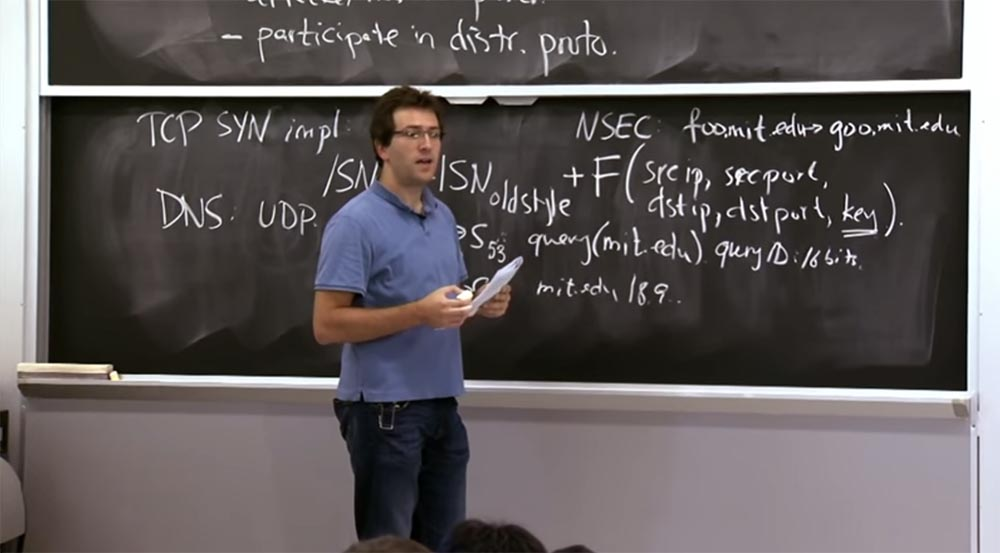
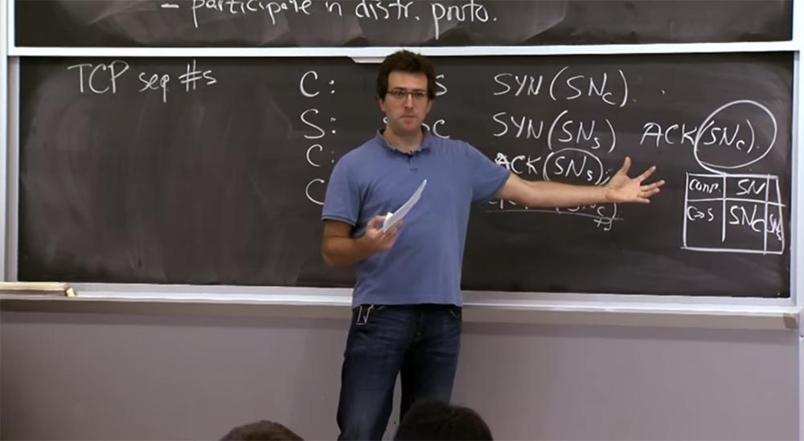
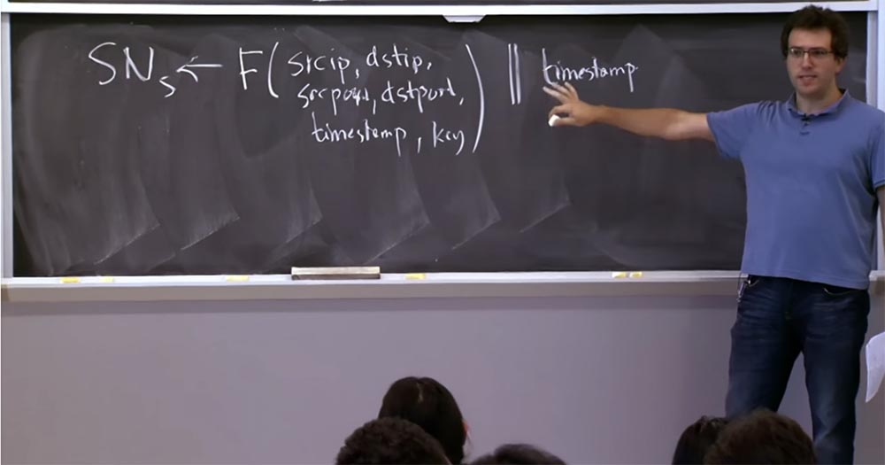
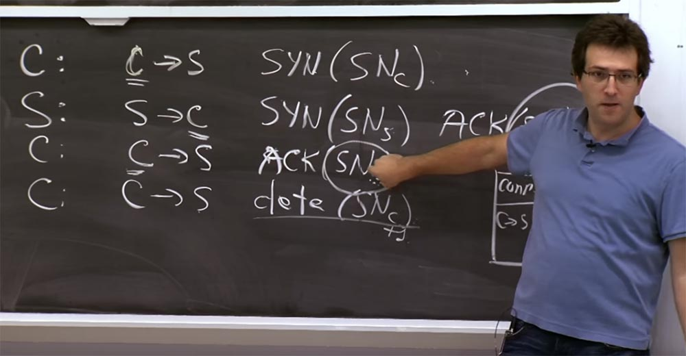
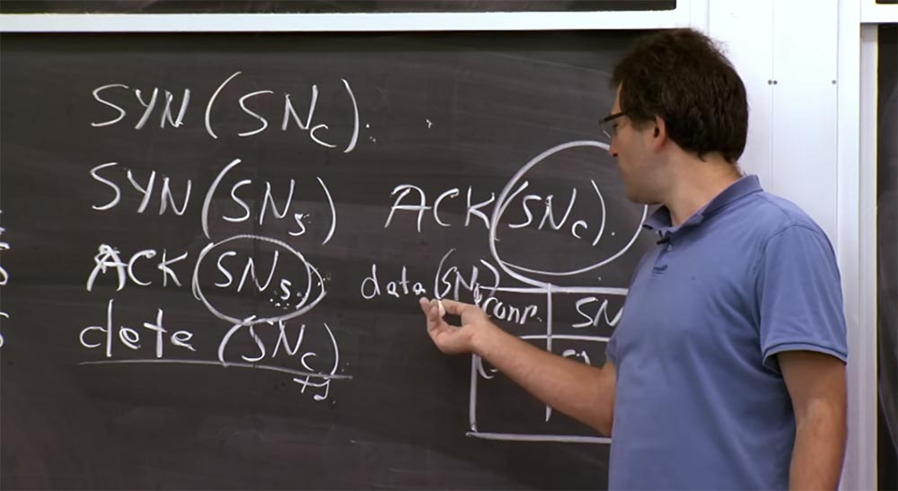
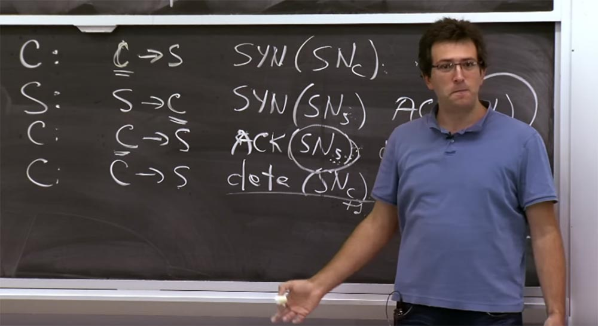
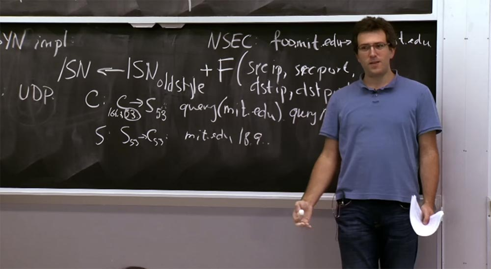
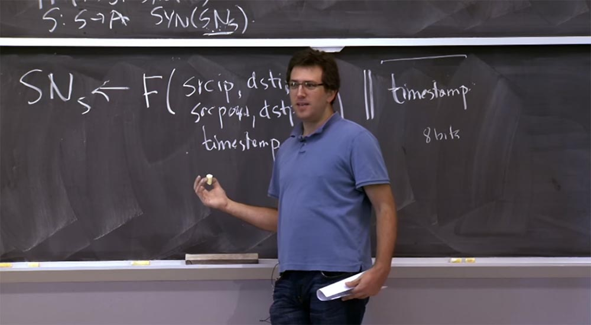

Курс MIT «Безопасность компьютерных систем». Лекция 12: «Сетевая безопасность», часть 3 / Блог компании ua-hosting.company

### Массачусетский Технологический институт. Курс лекций #6.858. «Безопасность компьютерных систем». Николай Зельдович, Джеймс Микенс. 2014 год

Computer Systems Security — это курс о разработке и внедрении защищенных компьютерных систем. Лекции охватывают модели угроз, атаки, которые ставят под угрозу безопасность, и методы обеспечения безопасности на основе последних научных работ. Темы включают в себя безопасность операционной системы (ОС), возможности, управление потоками информации, языковую безопасность, сетевые протоколы, аппаратную защиту и безопасность в веб-приложениях.

Лекция 1: «Вступление: модели угроз» [Часть 1](https://habr.com/company/ua-hosting/blog/354874/) / [Часть 2](https://habr.com/company/ua-hosting/blog/354894/) / [Часть 3](https://habr.com/company/ua-hosting/blog/354896/)  
Лекция 2: «Контроль хакерских атак» [Часть 1](https://habr.com/company/ua-hosting/blog/414505/) / [Часть 2](https://habr.com/company/ua-hosting/blog/416047/) / [Часть 3](https://habr.com/company/ua-hosting/blog/416727/)  
Лекция 3: «Переполнение буфера: эксплойты и защита» [Часть 1](https://habr.com/company/ua-hosting/blog/416839/) / [Часть 2](https://habr.com/company/ua-hosting/blog/418093/) / [Часть 3](https://habr.com/company/ua-hosting/blog/418099/)  
Лекция 4: «Разделение привилегий» [Часть 1](https://habr.com/company/ua-hosting/blog/418195/) / [Часть 2](https://habr.com/company/ua-hosting/blog/418197/) / [Часть 3](https://habr.com/company/ua-hosting/blog/418211/)  
Лекция 5: «Откуда берутся ошибки систем безопасности» [Часть 1](https://habr.com/company/ua-hosting/blog/418213/) / [Часть 2](https://habr.com/company/ua-hosting/blog/418215/)  
Лекция 6: «Возможности» [Часть 1](https://habr.com/company/ua-hosting/blog/418217/) / [Часть 2](https://habr.com/company/ua-hosting/blog/418219/) / [Часть 3](https://habr.com/company/ua-hosting/blog/418221/)  
Лекция 7: «Песочница Native Client» [Часть 1](https://habr.com/company/ua-hosting/blog/418223/) / [Часть 2](https://habr.com/company/ua-hosting/blog/418225/) / [Часть 3](https://habr.com/company/ua-hosting/blog/418227/)  
Лекция 8: «Модель сетевой безопасности» [Часть 1](https://habr.com/company/ua-hosting/blog/418229/) / [Часть 2](https://habr.com/company/ua-hosting/blog/423155/) / [Часть 3](https://habr.com/company/ua-hosting/blog/423423/)  
Лекция 9: «Безопасность Web-приложений» [Часть 1](https://habr.com/company/ua-hosting/blog/424289/) / [Часть 2](https://habr.com/company/ua-hosting/blog/424295/) / [Часть 3](https://habr.com/company/ua-hosting/blog/424297/)  
Лекция 10: «Символьное выполнение» [Часть 1](https://habr.com/company/ua-hosting/blog/425557/) / [Часть 2](https://habr.com/company/ua-hosting/blog/425561/) / [Часть 3](https://habr.com/company/ua-hosting/blog/425559/)  
Лекция 11: «Язык программирования Ur/Web» [Часть 1](https://habr.com/company/ua-hosting/blog/425997/) / [Часть 2](https://habr.com/company/ua-hosting/blog/425999/) / [Часть 3](https://habr.com/company/ua-hosting/blog/426001/)  
Лекция 12: «Сетевая безопасность» [Часть 1](https://habr.com/company/ua-hosting/blog/426325/) / [Часть 2](https://habr.com/company/ua-hosting/blog/427087/) / [Часть 3](https://habr.com/company/ua-hosting/blog/427093/)

**Студент:** есть ли какой-либо вид подписи для несуществующих доменов верхнего уровня?

**Профессор:** я думаю, что есть. Точечный домен — это просто еще один домен, и в нём реализован тот же механизм. Так что домены «точка» и «точка.ком» в наше время используют DNS SEC, и там есть все эти записи, в которых говорится, например, что .in — доменное имя, которое существует, и имя «точка» тоже существует, и больше между ними ничего нет. Так что в доменах верхнего уровня присутствуют все эти вещи.

**Студент:** кроме опасности атак DoS, почему мы так заботимся о повторении доменных имен в рамках mit.edu?

**Профессор:** точно не знаю. Во всяком случае, в AFS есть текстовый файл, в котором перечислены все эти доменные имена MIT. Но я думаю, что в целом, некоторые компании чувствуют себя немного неловко в этом смысле, потому что у них часто есть внутренние имена, которые находятся в DNS и которые нельзя выдавать посторонним. Думаю, что на самом деле, это нечеткая область, которая никогда не была формализована и которая не точно разъясняет, какие именно гарантии предоставляет пользователям DNS. Обычно люди предполагают, что если существует конфиденциальное имя, то в случае с DNS оно не будет разглашено.

Я думаю, что это еще одно место, где данная система не имеет четкой спецификации с точки зрения того, что она должна или не должна обеспечивать.

**Студент:** можно ли установить срок действия подписи, выделив её каким-то образом?

**Профессор:** эти вещи имеют срок действия, например, вы можете подписать, что данный набор имён действителен неделю, и затем клиенты, если у них синхронизированные часы, могут отклонять старые подписанные сообщения.

Итак, можно считать, что мы обсудили атаки способом угадываня порядковых номеров TCP SYN. Еще одна интересная проблема, которая касается TCP — это DDoS-атака, которая использует тот факт, что сервер сохраняет некое состояние. Если вы посмотрите на это рукопожатие, которое было нарисовано на доске раньше, вы увидите, что когда клиент устанавливает соединение с сервером, сервер должен запомнить порядковый номер клиента SNc. Таким образом, сервер должен поддерживать некоторую структуру данных в отдельном блоке, которая показывает, что этот порядковый номер используется для этого соединения.

Это своего рода таблица, где хранится порядковый номер SN и то, что соединение клиент-сервер имеет порядковый номер SNc. Причина, по которой сервер должен хранить эту таблицу, состоит в том, что сервер должен выяснить, какое правильное значение порядковый номер SNc должен принять позже, например, SNc+1. Кроме того, сервер также нуждается в хранении номеров SNs, которые гораздо важнее, так как показывают серверу, что соединение установлено с «правильным парнем».

Проблема состоит в том, что эта таблица не имеет реальной границы. Таким образом, вы можете получить пакеты из какой-то машины, даже не зная, кто их посылает. Вы просто получаете пакет, который выглядит как C->S с адресом источника, который утверждает, что он С. Для потенциального принятия этого соединения с данного IP-адреса необходимо создать запись в таблице. Причём эти записи существуют длительное время, потому что, возможно, кто-то устанавливает с вами связь из очень далекого места и при этом много пакетов теряются. В худшем случае это может занимать, например, минуту, пока кто-то не закончит это TCP-рукопожатие. Так что вы должны хранить это состояние в стеке TCP в течение относительно длительного времени, и нет никакого способа угадать, будет ли это допустимым или нет.

Таким образом, самой распространённой DoS атакой против большинства стеков TCP, которую придумали люди, является простая передача большого количества пакетов. Если я атакующий, я просто отправлю огромное количество пакетов SYN на определенный сервер и заставлю его переполнить эту таблицу.

Проблема в том, что в лучшем случае злоумышленник просто использует тот же IP-адрес источника. В этом случае вы можете просто сказать, что каждому клиенту разрешено всего две записи, или что-то вроде этого. И тогда злоумышленник cможет использовать максимум 2 две записи в таблице.

Проблема, конечно, и в том, что злоумышленник может подделать IP-адреса клиентов, сделать их выглядящими случайными. Тогда серверу будет очень трудно отличить, кто с ним пытается установить соединение — злоумышленник или какой-то клиент, о котором сервер никогда раньше не слышал.

Так что, если рассматривать какой-то сайт, который должен принимать соединения из любой точки мира, это будет большой проблемой. Потому что либо вы отказываете в доступе всем, либо у вас должна быть возможность хранить состояние для большинства поддельных попыток подключения.

Так что это проблема как для TCP, так и для большинства протоколов, которые позволяют своего рода инициирование соединения, при котором сервер должен сохранить состояние. Но есть некоторые исправления, реализованные в TCP, о которых мы поговорим через секунду, и они попытаются справиться с этой проблемой, которая называется SYN Flooding в TCP.

В целом, это проблема, о которой стоит знать и пытаться избежать в любом протоколе, который вы разрабатываете. Нужно указать, что сервер не должен сохранять состояние до тех пор, пока он не сможет аутентифицировать и идентифицировать клиента. Потому что только после проверки подлинности клиента можно принимать решение, разрешено ли ему подключаться, например всего один раз, и в этом случае серверу не нужно сохранять состояние для этого подключения.

Проблема в том, что вы гарантируете сохранение состояние ещё до того, как узнаете, кто к вам подключается. Давайте посмотрим, как можно противодействовать атаке «наводнения» SYN Flooding, которая состоит в том, что сервер накапливает слишком много состояния.

Вы могли бы снова изменить TCP, например, исправить это довольно легко с помощью криптографии или чего-то еще, или изменить то, что отвечает за сохранение какого-то состояния. Но дело в том, что нам нужно использовать TCP как он есть. Могли бы мы решить эту проблему, не изменяя существующий протокол TCP?

Это, опять же, упражнение в попытках выяснить, какие именно трюки мы могли бы выполнить или точнее, какие предположения мы могли бы оставить в покое и по-прежнему придерживаться существующего формата заголовка TCP при работе с ними.

И фокус в том, чтобы найти умный способ сделать сервер без состояния, так, чтобы ему не пришлось хранить эту таблицу в памяти. Это можно сделать, тщательно выбирая SNs, то есть вместо формулы, которую мы рассматривали раньше и где мы должны были добавить эту функцию, мы будем выбирать порядковые номера совсем по-другому. Я дам вам точную формулу, а потом мы поговорим о том, почему это действительно интересно и какими хорошими свойствами она обладает.

Если сервер обнаруживает, что подвергается атаке такого рода, то он переходит в режим, где он выбирает SNs, используя формулу с такой же функцией F, какую мы рассматривали раньше.

В этой функции есть IP-адрес источника, IP-адрес назначения, такие же вещи, как и раньше — порт источника, порт назначения, метка времени и ключ. И мы собираемся объединить эту функцию с временной меткой, довольно «крупнозернистой», величиной в несколько минут. Здесь имеется разделение между этими двумя частями заголовка – функцией и штампом времени, которому не нужно много битов. Я забыл, как именно этот протокол работает на реальном компьютере, но можно представить, что временная метка занимает 8 бит, а остальная часть формулы порядкового номера – 24 бита.

Итак, почему это хороший план? Что здесь вообще происходит? Зачем нужна эта странная формула? Вы должны помнить, что мы пытались получить от порядковых номеров. Здесь происходит две вещи.

Первая — это защита от повторяющихся пакетов. Тут на доске осталась схема с этим порядковым номером старого стиля, к которому мы добавляем функцию для предотвращения дублирования пакетов из предыдущих соединений.

Оказывается, что люди не могли найти лучше способ защититься от атак типа SYN Flooding, кроме как использовать этот план действий, который хорошо работает в некоторых ситуациях. Это был один план, а вот другой план – функция с временной меткой, где мы отказались от этого компонента старого стиля. Вместо этого мы сосредоточимся на том, чтобы убедиться, что если кто-то предоставит нам в ответ на пакет этот порядковый номер ACK (SNs), этот кто-то будет «правильным» клиентом.

Вы помните, что для предотвращения атак IP-спуфинга мы как бы полагаемся именно на это значение (SNs). Ведь если сервер посылает клиенту на втором шаге это значение SNs, мы ожидаем, что только этот клиент сможет послать нам назад исправленное значение SNs на третьем шаге, завершая установку соединения.

Вот почему вам пришлось хранить этот порядковый номер в таблице, потому что в противном случае, как бы вы узнали, реальный ли это ответ или поддельный? Причина использования этой функции F состоит в том, что теперь мы можем не сохранять эту таблицу в памяти.

Вместо этого, когда происходит попытка подключения, показанная на первом шаге, на втором шаге мы вычисляем SNs по этой формуле и просто отправляем его обратно тому клиенту, который хочет с нами связаться, после чего забываем об этом соединении.

Затем, когда придёт третий пакет и его значение (SNs) будет соответствовать тому, что мы ожидаем увидеть, это значит, кто-то получил наш ответ на втором шаге и, наконец, отправил его нам. Наконец, после этого третьего шага мы можем занести реальную запись для этого TCP-соединения в память. В этом заключается способ отложить сохранение состояния сервера, пока клиент не пришлёт точное значение порядкового номера. Построение такой конструкции позволяет убедиться в том, что клиент прислал серверу именно тот ответ, который от него ожидается, а не какое-то произвольное значение.

**Студент:** значит, SNc сохраняются только ограниченное время?

**Профессор:** да, сервер не хранит значение SNc постоянно, и это не слишком хорошо. Я не показал это на схеме, но здесь в конце третьей строки имеется поле, которое показывает, что у этого пакета нет данных, но оно включает порядковый номер SNc только потому, что для него есть это поле.

Таким образом, сервер может восстановить значение SNc, потому что клиент собирается включить его в этот пакет в любом случае. Раньше это не имело значения, но сейчас это как бы актуально. Мы не собираемся здесь ничего проверять, но существование такого поля само по себе хорошая вещь. Однако она имеет некоторые печальные последствия. Например, если используются некоторые сложные вещи, которыми здесь можно злоупотребить. Но это не так плохо, как переполнение памяти сервера клиентскими запросами.

Потому что единственное, что нас волнует, это высвобождение хранилища этой таблицы и уверенность в том, что соединения установлены с подлинными клиентами. И если этот клиент установит со мной миллион соединений, я просто перестану принимать от него запросы, это достаточно просто. Проблема в том, что поддельные адреса трудно отличить от адресов подлинных клиентов.

**Студент:** нужно ли хранить временную метку?

**Профессор:** да, здесь имеется умная вещь! Когда мы на третьем шаге получаем значение порядкового номера SNs, нам нужно выяснить, как вычислить входные данные для этой функции F, чтобы проверить, что это значение правильно. Поэтому мы берем метку времени, расположенную в конце пакета, и используем её для вычисления внутри функции. Все остальное мы можем восстановить. Мы знаем, кто только что прислал нам третий шаг и пакет, у нас есть все эти поля и наш ключ, который, опять же, все еще является секретным, и метка времени из последних 8 бит последовательности. При этом может случиться так, что мы исключим слишком старые метки времени, просто запретив старые соединения.

**Студент:** я полагаю, что вы используете это, когда на вас нападают, только потому, что вы теряете 8 битов безопасности, или по какой-то другой причине?

**Профессор:** да, это не очень хорошо, оно имеет много плохих свойств. В некотором смысле, мы действительно теряем 8 бит безопасности. Потому что теперь неоспоримая часть — это всего 24 бита вместо 32.

Другая проблема состоит в том, что произойдёт, если вы потеряете определенные пакеты? В TCP принято считать, что если третий пакет потерян, то клиент, возможно, ничего не ждет. Или, извините, возможно, протокол, который мы запускаем поверх этого TCP-подключения — это протокол, который предполагает, что сервер изначально предполагает что-то сказать, так что я соединяюсь с ним и просто слушаю ответ. А в SMTP, например, сервер должен по протоколу мне послать что-то вроде приветствия. Предположим, что я подключаюсь к SMTP-серверу, отправляю третий пакет, считаю, что я всё сделал и просто жду, когда сервер мне ответит, например:

«Привет, это SMTP-сервер, пожалуйста, пришлите мне своё письмо»!

Так вот, этот третий пакет может потеряться. В реальном TCP сервер помнит, что на втором шаге он ответил клиенту, но так и не получил от него ответный третий пакет. Поэтому сервер пошлёт клиенту ещё раз второй пакет для перезапуска третьего пакета. Конечно, если сервер не хранит никакого состояния, он понятия не имеет, что отправлять. Это делает установку соединения несколько проблемным, потому что обе стороны будут ждать друг от друга ответного шага. Сервер даже не знает, что клиент ждёт от него ответ, а клиент ждёт ответ сервера, хотя тот не собирается отвечать, потому что не хранит состояние. Поэтому это еще одна причина, почему вы не используете продуктивный режим сервера постоянно.

**Студент:** вероятно, у вас также могут быть потери данных, если вы установите с одного хоста два очень недолгих соединения сразу друг за другом.

**Профессор:** да, безусловно. Другое дело, что мы отказались от использования этого старого стиля порядкового номера ISN, что повысило независимость этих множественных соединений за короткий срок друг от друга. Я думаю, что здесь существует ряд компромиссов, мы просто поговорили о трёх из них, так что есть еще несколько причин для беспокойства.

Если бы мы могли разработать протокол с нуля, стремясь к лучшему, мы могли бы просто иметь отдельный хороший 64-х битный объём для функции F и 64-х битный объём для штампа времени, и тогда мы могли бы использовать это постоянно, не отказываясь от всех этих приятных вещей.

**Студент:** должны быть SNs на втором и третьем шаге одинаковы?

**Профессор:** конечно, потому что иначе сервер не сможет сделать вывод, что этот клиент получил наш пакет. Если сервер не проверил, что этот SNs имеет то же значение, что и прежде, то может быть ещё хуже — ведь я мог бы подделать соединение с произвольного IP-адреса на первом шаге, а затем получить этот ответ на втором шаге. Или я бы даже не получил этот ответ, потому что он направлен на другой IP-адрес. Затем на третьем шаге я устанавливаю соединение ещё с какого-то другого IP-адреса. При этом сервер поддерживал бы установленное соединение, ждал бы, пока я отправлю данные, и так далее.

**Студент:** но ведь временная метка будет другой, верно? Как же сервер может пересчитать это с помощью новой временной метки, если он не хранит состояние?

**Профессор:** как я уже говорил, эти временные метки достаточно «крупнозернисты» и проградуированы в минутах. Если вы подключитесь в ту же минуту, то всё в порядке, если подключаетесь на границе минуты — это слишком плохо.

Еще одна проблема с этой схемой — она несовершенна во многих отношениях. Но большинство рабочих систем, включая Linux, имеют способы обнаружения слишком большого количества записей в этой таблице. И когда возникает угроза её переполнения, система переключается на другую схему.

**Студент:** если злоумышленник контролирует большое количество IP-адресов и делает то, что вы сказали, даже если вы переключаетесь…

**Профессор:** да, на самом деле вы мало что можете сделать. Причина, по которой нас так заботила эта схема, состоит в том, что мы хотели отфильтровать или как-то различать атакующих и «хороших парней». Если злоумышленник имеет больше IP-адресов и просто контролирует больше машин, чем хорошие парни, тогда он может соединиться с нашим сервером, запросить множество веб-страниц или поддерживать связь.

И тогда серверу будет очень трудно определить, поступают ли запросы от законных клиентов или это просто злоумышленник связывает ресурсы сервера. Так что вы абсолютно правы. Это схема работает только в случае, когда злоумышленник имеет небольшое количество IP-адресов и хочет достичь эффекта.

И это вызывает беспокойство, потому что на сегодня некоторые злоумышленники контролируют большое количество взломанных компьютеров обычных пользователей. Это позволяет им создать DoS с помощью парка машин, расположенных по всему миру, и от этого довольно трудно защититься.

Хочу упомянуть ещё одну интересную вещь – отказ сервиса DoS плох сам по себе, но ещё хуже, когда проведению такой атаки способствуют сами протоколы. Злоумышленник знает об этом и в первую очередь атакует системы именно с такими протоколами, как DNS. Протокол DNS включает в себя отправку клиентом запроса на сервер, а сервер отправляет ответ обратно клиенту. И во многих случаях объём ответа в байтах намного превышает объём запроса.

Вы спрашивали насчёт сервера mit.edu. Так вот, ответом на ваш запрос могут стать все записи, которые есть на сервере mit.edu — адрес электронной почты, почтовый сервер для mit.edu, назначенная запись, если она использует DNS SEC, и так далее.

Так что запрос может быть 100 байт, а ответ — более 1000 байт. Предположим, что вы хотите «зафлудить» какого-то парня большим количеством пакетов или использовать всю пропускную способность его канала связи. Вы можете использовать лишь немного своей пропускной способности, но зато можете организовать поддельные запросы к DNS-серверу от имени этого парня. Вам нужно отправить всего лишь 100 байт на какой-то DNS-сервер, сделав вид, что запрос исходит от этого бедняги, и в ответ сервер отправит ему 1000 байт от вашего имени.

Это проблемная особенность данного протокола, так как она позволяет увеличить пропускную способность атаки. И частично по той же причине, которую мы упоминали в случае с TCP SYN Flooding, DNS-серверу в этом случае очень трудно определить, является ли этот запрос действительным или нет. Потому что при продолжении обмена данными нет аутентификации или порядкового номера, говорящего, что соединение установлено с «правильным парнем».

На сегодня это всё ещё является проблемой DNS. И эта уязвимость часто используется для атак путём снижения пропускной способности канала клиента. Если ваша пропускная способность ограничена конкретной величиной, то для эффективной работы вам необходимо отразить подобную атаку с DNS-сервера. Однако эти сервера вынуждены отвечать на каждый запрос, потому что иначе возникнет угроза отклонения законных запросов. Так что на практике это большая проблема.

**Студент:** если вы сможете увидеть запрос злоумышленника на DNS-сервере и не отвечать на него…

**Профессор:** да, существует определённая возможность модифицировать DNS-сервер таким образом, чтобы он хранил какое-то состояние.

**Студент:** так почему же данная схема используется до сих пор, если она не предусматривает сохранение состояния?

**Профессор:** я думаю, что сейчас некоторые люди начинают модифицировать DNS-сервер, чтобы попытаться сохранить состояние. Однако существует так много DNS-серверов, что это не имеет значения. Даже если вы делаете по 10 запросов к каждому DNS-серверу, каждый пакет усиливается некоторыми существенными факторами, и сервер должен на них отреагировать, потому что, возможно, эти запросы исходят от законного клиента. Так что это проблема. Да, вы правы, если бы это был один DNS-сервер, то его модификация не представляла бы такого труда.

Проблема также заключается в том, что корневые серверы DNS не являются одной машиной, это стойки и стойки серверов, потому что они массово используются, и поэтому хранить состояние для такого большого количества машин очень сложно. Однако рост вредоносных вмешательств приводит к тому, что поддерживать сохранение состояния становится всё более и более целесообразным.

Я думаю, что общий принцип, которому вы хотите следовать в любом протоколе, и это может быть хорошим принципом – это заставить клиента делать, по крайней мере, столько же работы, сколько делает сервер. Но проблема в том, что клиент не может делать столько же, сколько делает сервер. Поэтому сервер должен ему в этом помочь.

Если бы вы создавали DNS-сервер с нуля и это было бы вашей большой проблемой, то вы смогли бы решить её довольно просто. Клиент должен был бы отправить запрос, который имеет дополнительное заполнение байтами просто для увеличения пропускной способности канала, и тогда сервер будет отсылать обратно ответ такого же объёма.

И если вы хотите получить ответ большего объёма, то сервер скажет: «извините, ваше дополнение не было достаточно большим, пришлите мне ещё»! Таким образом, вы гарантируете, что DNS-сервер не может быть использован для усиления атак путём поглощения пропускной способности канала.

На самом деле, такого рода проблемы случаются и на более высоких уровнях. Часто в веб-приложениях имеются веб-службы, которые выполняют множество вычислений от имени одного запроса. На этом уровне DoS атаки состоят в том, что противники знают про ресурсоёмкость определённого вида операций и просто высылают запрос на выполнение этой операции снова и снова. Если вы тщательно не разработаете свой протокол и приложение так, чтобы позволить клиенту доказать, что он выполняет не меньший объём работы, чем сервер, то защититься от таких вещей довольно трудно.

Последнее в этой статье, о чём я хочу упомянуть, это атаки маршрутизации. Причины этих атак интересны тем, что выносят на поверхность проблемы транспортного уровня протокола и дают возможность увидеть, что в приложении происходит не так, как следует.

Особенно интересным примером является протокол маршрутизации, для которого доверие к пользователю является основой работы, и часто это истолковывается неверным способом. Даже на сегодня не существует безупречных механизмов аутентификации.

Возможно, самым ярким примером является протокол DHCP, который используется для подключения к беспроводной или проводной сети. Компьютер просто отправляет пакет, говоря, что хочет IP-адрес. При этом, например, MIT сервер DHCP, получив ваш пакет, отправляет его обратно, указывая, что вот IP-адрес, который вы должны использовать, вот DNS-сервер, который вы должны использовать, и вот другие полезные данные конфигурации для этого соединения.

Проблема состоит в том, что пакет запроса DHCP просто вещает в локальной сети о попытке связаться с DHCP-сервером, потому что вы на самом деле заранее не знаете, что собирается делать DHCP-сервер. Вы просто подключаетесь к сети в первый раз и посылаете запрос, и ваш клиентский компьютер не знает, что делать и кому доверять. Следовательно, любая машина в локальной сети может перехватывать эти запросы DHCP и отвечать клиенту с любого IP-адреса, говоря: «эй, вы должны использовать мой DNS-сервер вместо реального»! Это даёт злоумышленнику возможность перехватить будущие запросы DNS от клиента и так далее.

Поэтому я думаю, что эти протоколы довольно сложно исправить. В глобальном масштабе такие протоколы, как BGP, позволяют любому участнику сети объявлять определенный префикс IP-адреса, чтобы отсортировать и маршрутизировать пакеты для злоумышленника. При этом случались атаки, в которых маршрутизатор, участвующий в BGP, говорил: «о, я знаю очень быстрый способ достичь этого конкретного IP-адреса!», и тогда все остальные маршрутизаторы отвечали ему: „ОК, конечно, мы отправим вам эти пакеты“.

Наверное, чаще всего этим злоупотребляют спамеры, которые хотят рассылать свой спам, но их старые IP-адреса везде занесены в черный список. Поэтому они просто выбирают случайный IP-адрес и объявляют, что да, их IP-адрес теперь расположен здесь. Затем они как бы объявляют этот IP-адрес в сети, отправляют с него спам и отключаются. Сейчас таких случаев становится все меньше, но полностью искоренить подобное трудно. Потому что для того, чтобы это исправить, вы должны знать, кто действительно владеет этим IP-адресом. Без этого трудно обойтись при создании глобальной базы данных криптографических ключей для каждого провайдера в мире, однако люди прилагают немало усилий, чтобы создать эту базу.

То же самое относится и к DNS SEC. Для того, чтобы знать, какую подпись искать в DNS, у вас должен быть криптографический ключ, связанный со всеми сетевыми сущностями в мире. На сегодня это невозможно, но к этому нужно стремиться, потому что, безусловно, это самая большая проблема для широкого распространения DNS SEC.

Итак, я полагаю, что из этой статьи следует выбрать информацию, чего вообще не следует делать в протоколах. Я хочу заострить ваше внимание на одной важной вещи: пока безопасность и целостность являются важными свойствами и движущей силой более высоких уровней абстракции, таких как криптографические протоколы в приложениях, которые мы рассмотрим в следующей лекции, основными требованиями, предъявляемыми к сети, должны стать доступность и сопротивляемость DoS — атакам. Потому что эти свойства гораздо труднее достигнуть в стеке на более высоких уровнях.

Таким образом, вы должны стремиться к тому, чтобы избежать таких вещей, как, атаки SYN Flooding и RST атаки, позволяющие разорвать соединение произвольного пользователя сети. Это вещи, которые действительно вредны на низком уровне и которые трудно исправить на высоком уровне. Но более–менее обеспечить целостность и конфиденциальность данных можно с помощью шифрования. О том, как это сделать, мы поговорим в следующей лекции о «Цербере».

Полная версия курса доступна [здесь](https://ocw.mit.edu/courses/electrical-engineering-and-computer-science/6-858-computer-systems-security-fall-2014/).

Спасибо, что остаётесь с нами. Вам нравятся наши статьи? Хотите видеть больше интересных материалов? Поддержите нас оформив заказ или порекомендовав знакомым, **30% скидка для пользователей Хабра на уникальный аналог entry-level серверов, который был придуман нами для Вас:** [Вся правда о VPS (KVM) E5-2650 v4 (6 Cores) 10GB DDR4 240GB SSD 1Gbps от $20 или как правильно делить сервер?](https://habr.com/company/ua-hosting/blog/347386/) (доступны варианты с RAID1 и RAID10, до 24 ядер и до 40GB DDR4).

**VPS (KVM) E5-2650 v4 (6 Cores) 10GB DDR4 240GB SSD 1Gbps до декабря бесплатно** при оплате на срок от полугода, заказать можно [тут](https://ua-hosting.company/vpsnl).

**Dell R730xd в 2 раза дешевле?** Только у нас **[2 х Intel Dodeca-Core Xeon E5-2650v4 128GB DDR4 6x480GB SSD 1Gbps 100 ТВ от $249](https://ua-hosting.company/serversnl) в Нидерландах и США!** Читайте о том [Как построить инфраструктуру корп. класса c применением серверов Dell R730xd Е5-2650 v4 стоимостью 9000 евро за копейки?](https://habr.com/company/ua-hosting/blog/329618/)