Курс MIT «Безопасность компьютерных систем». Лекция 13: «Сетевые протоколы», часть 1 / Блог компании ua-hosting.company

### Массачусетский Технологический институт. Курс лекций #6.858. «Безопасность компьютерных систем». Николай Зельдович, Джеймс Микенс. 2014 год

Computer Systems Security — это курс о разработке и внедрении защищенных компьютерных систем. Лекции охватывают модели угроз, атаки, которые ставят под угрозу безопасность, и методы обеспечения безопасности на основе последних научных работ. Темы включают в себя безопасность операционной системы (ОС), возможности, управление потоками информации, языковую безопасность, сетевые протоколы, аппаратную защиту и безопасность в веб-приложениях.

Лекция 1: «Вступление: модели угроз» [Часть 1](https://habr.com/company/ua-hosting/blog/354874/) / [Часть 2](https://habr.com/company/ua-hosting/blog/354894/) / [Часть 3](https://habr.com/company/ua-hosting/blog/354896/)  
Лекция 2: «Контроль хакерских атак» [Часть 1](https://habr.com/company/ua-hosting/blog/414505/) / [Часть 2](https://habr.com/company/ua-hosting/blog/416047/) / [Часть 3](https://habr.com/company/ua-hosting/blog/416727/)  
Лекция 3: «Переполнение буфера: эксплойты и защита» [Часть 1](https://habr.com/company/ua-hosting/blog/416839/) / [Часть 2](https://habr.com/company/ua-hosting/blog/418093/) / [Часть 3](https://habr.com/company/ua-hosting/blog/418099/)  
Лекция 4: «Разделение привилегий» [Часть 1](https://habr.com/company/ua-hosting/blog/418195/) / [Часть 2](https://habr.com/company/ua-hosting/blog/418197/) / [Часть 3](https://habr.com/company/ua-hosting/blog/418211/)  
Лекция 5: «Откуда берутся ошибки систем безопасности» [Часть 1](https://habr.com/company/ua-hosting/blog/418213/) / [Часть 2](https://habr.com/company/ua-hosting/blog/418215/)  
Лекция 6: «Возможности» [Часть 1](https://habr.com/company/ua-hosting/blog/418217/) / [Часть 2](https://habr.com/company/ua-hosting/blog/418219/) / [Часть 3](https://habr.com/company/ua-hosting/blog/418221/)  
Лекция 7: «Песочница Native Client» [Часть 1](https://habr.com/company/ua-hosting/blog/418223/) / [Часть 2](https://habr.com/company/ua-hosting/blog/418225/) / [Часть 3](https://habr.com/company/ua-hosting/blog/418227/)  
Лекция 8: «Модель сетевой безопасности» [Часть 1](https://habr.com/company/ua-hosting/blog/418229/) / [Часть 2](https://habr.com/company/ua-hosting/blog/423155/) / [Часть 3](https://habr.com/company/ua-hosting/blog/423423/)  
Лекция 9: «Безопасность Web-приложений» [Часть 1](https://habr.com/company/ua-hosting/blog/424289/) / [Часть 2](https://habr.com/company/ua-hosting/blog/424295/) / [Часть 3](https://habr.com/company/ua-hosting/blog/424297/)  
Лекция 10: «Символьное выполнение» [Часть 1](https://habr.com/company/ua-hosting/blog/425557/) / [Часть 2](https://habr.com/company/ua-hosting/blog/425561/) / [Часть 3](https://habr.com/company/ua-hosting/blog/425559/)  
Лекция 11: «Язык программирования Ur/Web» [Часть 1](https://habr.com/company/ua-hosting/blog/425997/) / [Часть 2](https://habr.com/company/ua-hosting/blog/425999/) / [Часть 3](https://habr.com/company/ua-hosting/blog/426001/)  
Лекция 12: «Сетевая безопасность» [Часть 1](https://habr.com/company/ua-hosting/blog/426325/) / [Часть 2](https://habr.com/company/ua-hosting/blog/427087/) / [Часть 3](https://habr.com/company/ua-hosting/blog/427093/)  
Лекция 13: «Сетевые протоколы» [Часть 1](https://habr.com/company/ua-hosting/blog/427763/) / [Часть 2](https://habr.com/company/ua-hosting/blog/427771/) / [Часть 3](https://habr.com/company/ua-hosting/blog/427779/)

Итак, сегодня мы поговорим о Kerberos, криптографически безопасном протоколе, предназначенном для взаимной аутентификации компьютеров и приложений в сети. Это протокол для аутентификации клиента и сервера перед установлением соединения между ними.

Так что теперь, наконец, мы будет использовать криптографию, в отличие от последней лекции, где мы рассмотрели обеспечение безопасности только с помощью порядковых номеров TCP SYN.

Итак, давайте поговорим о Kerberos. Что же пытается поддержать этот протокол? Он был создан в нашем институте 25 или 30 лет назад в рамках проекта «Афина» для обеспечения взаимодействия множества компьютеров сервера и множества компьютеров клиентов.

Представьте, что у вас где-то есть файловый сервер. Возможно, это почтовый сервер, подключенный к сети, или другие сетевые сервисы, например, принтеры. И все это просто соединено с какой-то сетью, а не является процессами на одном компьютере.

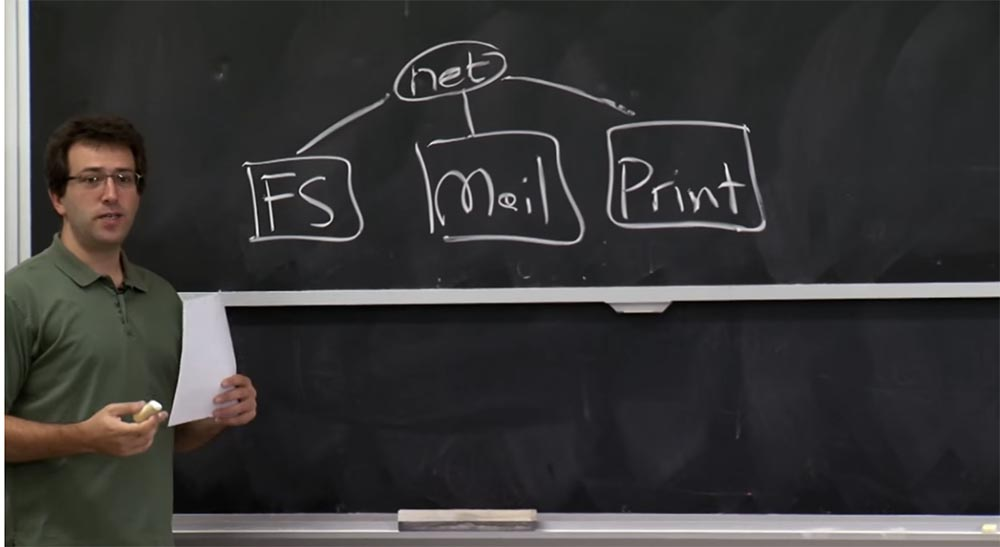

Предпосылкой к созданию «Афины» и «Кербероса» послужило то, что у вас имелась машина для одновременного совместного использования, где всё представляло собой отдельный процесс, и каждый мог просто войти в одну и ту же систему и хранить там свои файлы. Поэтому разработчики хотели создать более удобную распределенную систему.

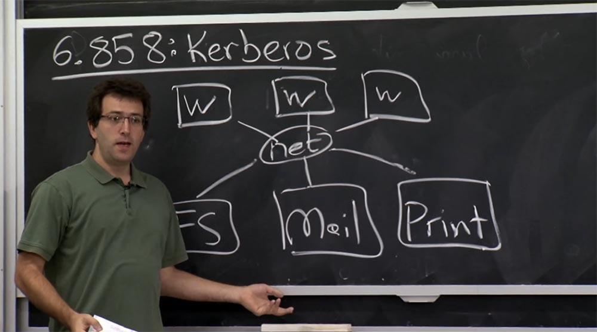

Таким образом, это означало, что на одной стороне у вас будут эти серверы, а на другой — куча рабочих станций, которые пользователи будут использовать сами и на которых будут работать приложения. Эти рабочие станции станут подключаться к этим серверам и хранить файлы пользователей, получать их почту и так далее.

Проблема, которую они хотели решить, заключалась в том, как же осуществлять аутентификацию пользователей, которые используют эти рабочие станции для всех этих различных компьютеров в серверной части, без необходимости доверять сети и проверять её корректность. Это во всех отношениях было разумное требование к дизайну. Я должен упомянуть, что в то время альтернативой «Керберосу» были команды R логина, рассмотренные в последней лекции, которые казались плохим планом, так как они просто используют для аутентификации пользователей их IP-адреса.

Kerberos был достаточно успешным, он фактически все еще используется в сети MIT и является основой сервера Active Directory от Microsoft. Почти каждый продукт Microsoft на основе рода Windows Server использует Kerberos в той или иной форме.

Но этот протокол был разработан 25 или 30 лет назад, и с тех пор потребовались изменения, так как сегодня люди понимают в безопасности намного больше. Таким образом, сегодняшняя версия Kerberos заметно отличается во многих отношениях от версии, описанной в материалах к данной лекции. Мы рассмотрим, какие именно предположения не являются на сегодня достаточно хорошими и что неправильного было в первой версии. Это неизбежно для первого протокола, который действительно использовал криптографию для аутентификации участников сети в полномасштабной системе.

Во всяком случае, изображенная на доске схема — это своего рода установка для создания Kerberos. Интересно выяснить, какова здесь модель доверия. Поэтому в нашу схему вводится дополнительная структура — сервер Kerberos, расположенный вот здесь сбоку.

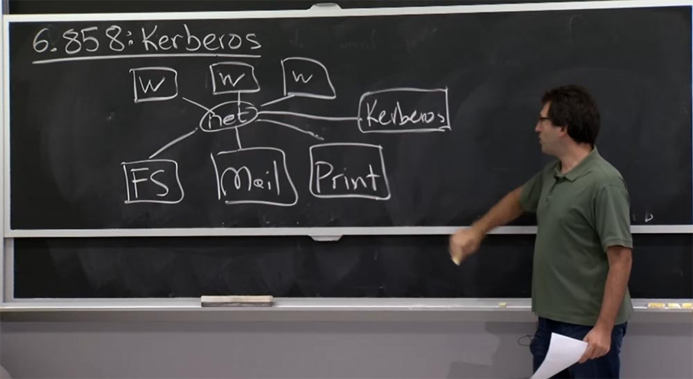

Таким образом, наша третья модель в каком-то смысле базируется на том, что сеть является ненадежной, как мы упоминали в прошлой лекции. Кому же мы должны доверять в этой схеме Kerberos? Конечно же, все участники сети должны доверять серверу Kerberos. Таким образом, создатели системы в своё время предположили, что сервер Kerberos будет отвечать за все проверки сетевой аутентификации в той или иной форме. Что у нас ещё есть в этой сети, чему можно доверять?

**Студент:** пользователи могут доверять своим собственным машинам.

**Профессор:** да, это хороший аргумент. Здесь имеются пользователи, которых я не нарисовал. Но эти ребята используют какую-то рабочую станцию, и на самом деле, в Kerberos очень важно, что пользователь доверяет своей рабочей станции. Что же происходит, если вы не доверяете своей рабочей станции? Потому что если пользователь не доверяет рабочей станции, то там можно просто «разнюхать» ваш пароль и действовать от вашего имени.

**Студент:** злоумышленник может сделать намного больше, например, узнав ваш билет на сервер Kerberos.

**Профессор:** да, именно так. Когда вы входите в систему, вы вводите свой пароль, что еще хуже, чем билет. Так что на самом деле, здесь возникает небольшая проблема с Kerberos, если вы не доверяете рабочей станции. Если вы пользуетесь собственным ноутбуком, это не так страшно, но безопасность общедоступного компьютера вызывает сомнения. Мы рассмотрим, что именно может пойти не так в этом случае.

**Студент:** вы должны доверять администраторам серверов и быть уверенными в том, что они могут иметь привилегированный доступ к серверам друг друга.

**Профессор:** я думаю, что сами машины не обязательно должны доверять друг другу, например, почтовый сервер не обязательно должен доверять серверу печати или файловому серверу.

**Студент:** не доверять, а иметь возможность доступа к серверу, к которому не поддерживается доступ через другой сервер.

**Профессор:** да, это правда. Если вы установите доверительные отношения между почтовым сервером и сервером печати, но при этом просто для удобства дадите почтовому серверу доступ к вашим файлам на файловом сервере, тогда этим можно злоупотреблять. Так что вы должны быть осторожны относительно введения здесь дополнительных уровней доверия или избыточных доверительных отношений.

Что еще здесь имеет значение? Должны ли серверы так или иначе доверять пользователям или рабочим станциям? Я предполагаю, что нет. Глобальной целью Kerberos было то, что сервер априори не должен знать всех этих пользователей или рабочие станции, или знать, как их аутентифицировать, пока эти пользователи не смогут криптографически доказать, что они являются законными пользователями и должны иметь доступ к своим данным или чему-то ещё, чем распоряжается сервер.

Давайте посмотрим, как работает Kerberos и какова его общая архитектура. Нарисуем сервер Kerberos в большем масштабе. В наше время он называется KDC — Key Distribution Center, или Центр Предоставления Ключей. Где-то тут расположены пользователи и сервисы, к которым можно подключиться. План состоит в том, что сервер Kerberos будет ответственен за хранение совместного ключа для связи между сервером Kerberos и каждой компьютерной сущностью в окружающем его мире. Таким образом, если у пользователя есть какой-то ключ клиента Kс, то сервер Kerberos запоминает этот ключ и хранит его где-то внутри себя. Точно так же ключ Ks для сервиса будет известен только самому этому сервису, серверу Kerberos и больше никому. Таким образом, вы можете думать об этом как об общем использовании паролей, когда вы знаете пароль и Kerberos его знает, но больше его не знает никто.

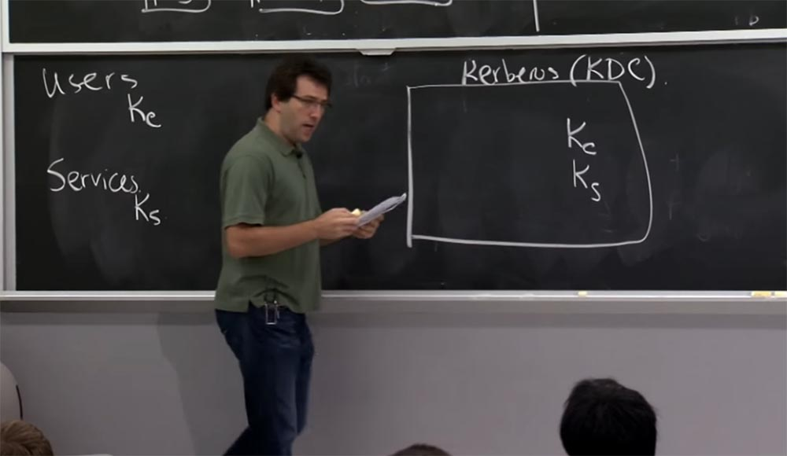

Вот так вы собираетесь доказать друг другу, что «я и есть тот самый парень». Конечно, серверу Kerberos придется отследить, кому принадлежит этот ключ, так что он должен иметь таблицу, в которой будут храниться имена пользователей user и имена сервисов, например, serv afs (это файловый сервер), и соответствующие им ключи.

При этом KDC отвечает за хранение гигантской таблицы, не очень большой в смысле количества байтов, но очень объёмной по количеству записей, потому что учитывает любую компьютерную сущность, обитающую в сети MIT, о которой должен знать сервер Kerberos. Таким образом, у нас имеется два вида интерфейса.

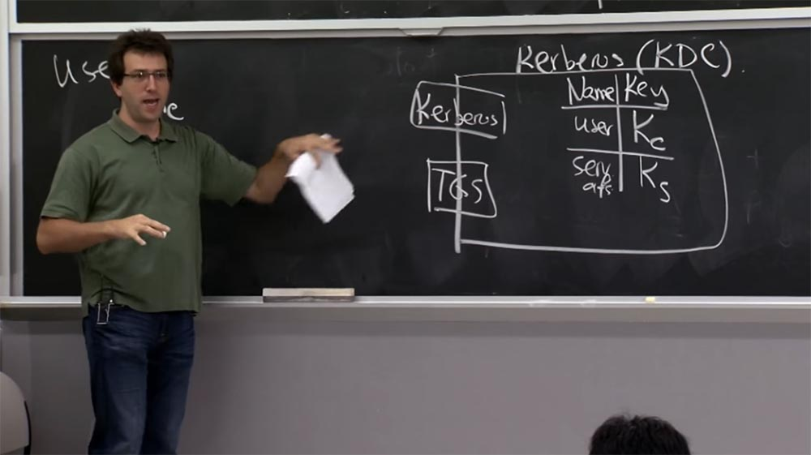

В материалах лекции об этом говорится недостаточно чётко, то есть существование этих 2-х интерфейсов просто подразумевается. На самом деле реально существуют два интерфейса для одной машины. Один из них называется Kerberos, а второй TGS, Ticket Granting Service, или Сервис Предоставления Билетов.

На самом деле, в конце концов, это всего лишь два способа говорить об одном и том же, и протокол лишь немного отличается для этих двух вещей. Поэтому изначально, когда пользователь входит в систему, он «говорит» с верхним интерфейсом, Kerberos и отправляет ему своё имя клиента С, это может быть ваше имя пользователя в университетской сети Athena.

Сервер отвечает на этот запрос билетом tgs или сведениями о билете, подробности об этих сведениях мы рассмотрим немного позже. Затем, когда вы захотите пообщаться с каким-то сервисом, вы должны будете сначала обратиться к интерфейсу TGS и сказать ему: «я уже вошел в систему через интерфейс Kerberos и теперь хочу поговорить с сервером S, который предоставит мне определённый сервис».

Так что вы расскажете TGS о сервере, с которым хотите поговорить, после чего он возвратит вам что-то вроде билета для разговора с сервером S. Затем вы наконец-то сможете поговорить с нужным вам сервером, используя для этого полученный билет для сервера S.

Это своего рода план высокого уровня. Так почему же здесь используется 2 интерфейса? По этому поводу можно задать множество вопросов. В случае с сервером Ks, вероятно, данный сервис будет храниться на диске. А что происходит с этим Kс на стороне пользователя? Откуда приходит этот Kс в Kerberos?

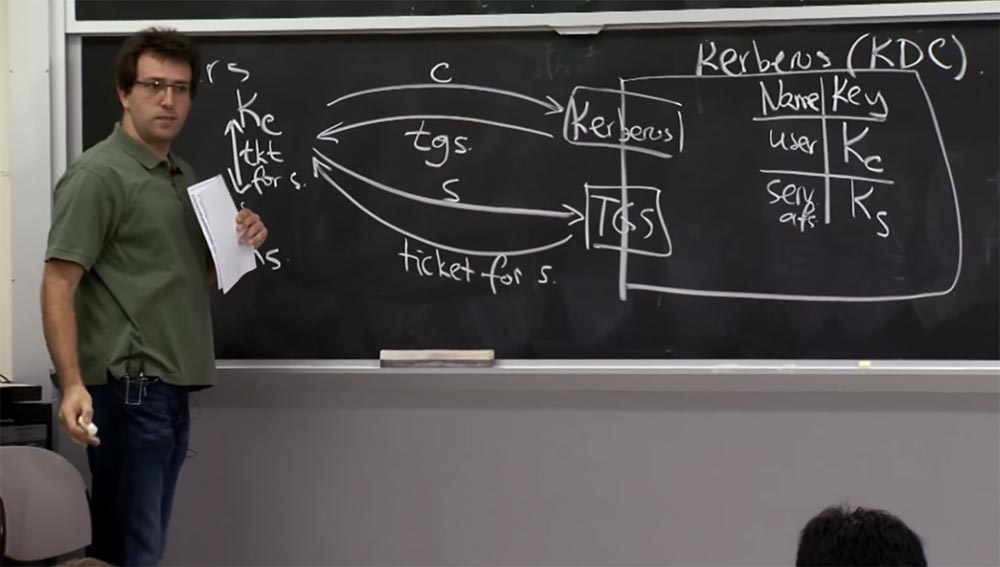

**Студент:** этот Kc должен быть в базе данных, в таблице сервера KDС.

**Профессор:** да, хорошо, ключ C находится здесь в таблице, в этой гигантской базе данных. Но он также должен быть известен пользователю, потому что пользователь должен доказать, что он является пользователем.

**Студент:** это односторонняя функция, которая затем требует пароль?

**Профессор:** да, у них на самом деле есть такой умный план, где Kc получается путем хеширования пароля пользователя или какой-то функции образования ключей, для этого существует несколько различных методик. Но в основном мы берем пароль, преобразуем его каким-то образом, и получаем этот ключ Kc. Так что это кажется хорошим способом.

Но зачем нам два протокола? Ведь можно представить, что вы просто запрашиваете билет непосредственно у первого интерфейса Kerberos, говоря ему: «эй, я хочу билет для этого конкретного имени!», он отправит вам обратно билет, и вы сможете расшифровать его с помощью Kc.

**Студент:** может быть, они не хотят, чтобы пользователь повторно вводил свой пароль каждый раз, когда хочет обратиться к другому сервису?

**Профессор:** верно, причина разницы между этими двумя интерфейсами в том, что с первого интерфейса все ответы возвращаются зашифрованными вашим ключом Kc, и создателей Kerberos беспокоила возможность сохранения этого Kc в течение длительного времени. Потому что либо вы должны просить пользователя ввести пароль каждый раз, что просто раздражает, или же он постоянно «сидит» в памяти. В основном это так же хорошо, как просто пароль пользователя, потому что кто-то с доступом к Kc может сохранять доступ к файлам пользователя до тех пор, пока пользователь, может быть, не изменит свой пароль, или еще дольше. Позже мы подробнее рассмотрим данный вопрос.

Так что утечка этого ключа Kc очень опасная вещь. Таким образом, весь смысл использования сначала первого, а затем второго интерфейса для всех последующих запросов заключается в том, что вы фактически можете забыть Kc, как только дешифруете ответ от интерфейса TGS сервера Kerberos. С этого момента даже в случае утечки ключа функциональность будет зависеть от полученного билета. Так что в худшем случае кто-то получит доступ к вашему аккаунту на пару часов, а не на неограниченное количество времени. Вот чем объясняется такая схема с двумя путями доступа к одним и тем же ресурсам.

Итак, прежде чем мы углубимся в механику того, как эти протоколы выглядят на самом деле в сети, давайте немного поговорим об аспекте имён в Kerberos. В определённом смысле Kerberos можно считать реестром имен. Он отвечает за отображение этих криптографических ключей в виде строчных имен. Это фундаментальный вид операции, которую совершает Kerberos. Вы увидите в следующей лекции, для чего нам нужна подобная функция. Она может быть реализована иначе, чем в Kerberos, но принципиально очень важно иметь подобную вещь практически в любой распределенной системе безопасности. Итак, давайте посмотрим, как Kerberos поступает с именами.

В Kerberos имеется что-то вроде системных вызовов для каждой компьютерной сущности в базе данных участников сети, и основным видом этих данных является просто строка. Так что вы можете иметь некоторые основные имена в таком виде, как, например, nickolai. Это и есть строка имени.

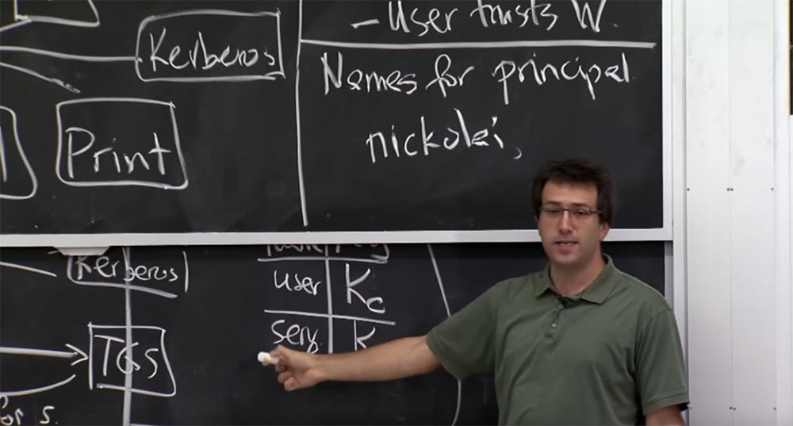

Она является основным параметром в некоторой области Kerberos, фактически это вещь, которая находится в левой колонке таблицы KDC. И есть также некоторые дополнительные параметры, которые поддерживает протокол. Я мог бы, например, ввести другое имя типа nickolai.extra sec, которое использовалось бы помимо имени nickolai для доступа к ресурсам, которые нуждаются в дополнительной безопасности. Так что, возможно, у меня будет один пароль для действительно безопасных вещей и другой пароль для моей обычной учетной записи.

В материалах о работе Kerberos этот аспект упомянут. Поэтому можно задаться вопросом — откуда приходит воздействие? Сервис Kerberos сопоставляет для вас имена определённым ключам, но откуда вы знаете, какое имя нужно спросить или какие имя ожидать в ответ, когда вы общаетесь с каким-то компьютером? То есть я спрашиваю, какие же имена появляются за пределами сервера Kerberos, или где именно появляются эти имена пользователей? У вас есть идеи?

**Студент:** предположительно, вы можете попросить имена пользователей у сервера MIT.

**Профессор:** да, конечно. Именно таким образом вы можете перечислить эти вещи. Кроме того, пользователи просто вводят их, когда входят в систему, вот откуда они изначально берутся. Появляются ли имена пользователей где-нибудь еще? Должны ли они появиться где-нибудь еще?

**Студент:** возможно, доступ пользователя обозначен в списках в различных сервисах.

**Профессор:** да, это действительно важный момент, верно? Цель Kerberos — просто сопоставить ключи именам. Но это не говорит вам, к чему это имя должно иметь доступ.

Фактически, способ, которым приложения обычно используют Kerberos, состоит в том, что один из этих серверов использует Kerberos, чтобы выяснить, с каким строчным именем он разговаривает. Когда почтовый сервер получает соединение от некоторой рабочей станции, то он получает билет Kerberos, который доказывает, что этого пользователя зовут Николай. После этого почтовый сервер на внутреннем уровне выясняет, к чему этот пользователь имеет доступ. Аналогично поступает и файловый сервер.

Таким образом, внутри всех этих серверов есть списки контроля доступа, возможно, списки групп или другие вещи, которые осуществляют авторизацию. Так Kerberos обеспечивает аутентификацию, которая показывает вам, кто этот человек, с которым вы говорите. Сам сервис отвечает за реализацию той части авторизации, которая решает, какой уровень доступа вы должны иметь на основе вашего имени пользователя. Итак, мы выяснили, где появляются имена пользователей. Есть и другие основные имена, которые Kerberos поддерживает для взаимодействия с сервисами.

Согласно материалам лекции, сервисы выглядят примерно так: rcmd.hostname. Причина, по которой вам нужно имя для одного из этих сервисов, заключается в том, что вы хотите, например, при подключении к файловому серверу, произвести взаимную проверку подлинности. Это означает, что в данной процедуре не только конечный сервер узнаёт, кто я такой, но и я, пользователь или рабочая станция, убеждаюсь в том, что говорю с правильным файловым сервером, а не с каким-то фейковым файловым сервером, который подделал мои файлы. Потому что, возможно, я хочу посмотреть файл со своими оценками и отправить его регистратору. Поэтому было бы слишком плохо, если бы какой-то другой файловый сервер мог бы выступить в роли правильного сервера и предоставить мне неправильный файл оценок.

Поэтому сервисы также нуждаются в собственном имени, и рабочие станции должны выяснить, какое имя я ожидаю увидеть, когда подключаюсь к сервису.

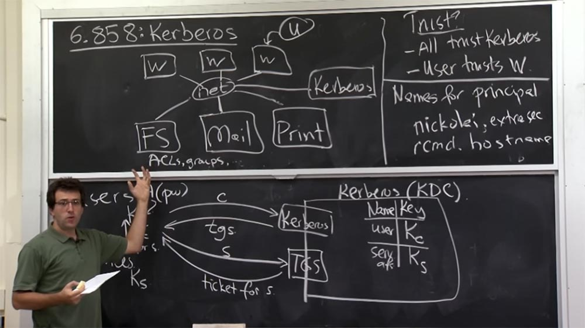

Как правило, на каком-то уровне это исходит от пользователя. Так, например, если я набираю ssh.foo, это означает, что я должен ожидать появления основного имени Kerberos типа rcmd.foo на другом конце этого соединения. И если там окажется кто-то другой, то клиент SSH должен прервать связь и не позволить мне подключиться, потому что тогда я буду введён в заблуждение и стану разговаривать с какой-то другой машиной.

Здесь возникает один интересный вопрос. Когда мы можем в Kerberos повторно использовать имена? Например, все вы имеете аккаунты в институтской системе «Афина». Когда вы закончите институт, может ли MIT уничтожить вашу запись в базе данных и позволить кому-то другому зарегистрировать то же имя пользователя? Это была бы хорошая идея?

**Студент:** но ведь не только база данных Kerberos, но и сервисы имеют список имён пользователей?

**Профессор:** да, потому что эти имена на самом деле просто представлены строковыми записями где-то в ACL на файловом или почтовом сервере. Если мы стираем вашу запись в базе данных сервера Kerberos, это не значит, что ваша запись вообще исчезла. Эти записи не зависят от версий.

Например, запись говорит, что у Алисы есть доступ к какому-то шкафчику «Афины». Затем Алиса оканчивает институт, и ее запись удаляется, но в институт поступает какая-то новая Алиса, которая проходит процесс регистрации в базе данных Kerberos. При этом она получает основное имя, полностью идентичное имени старой Алисы, поэтому файловый сервер может дать новой Алисе доступ к файлам старой Алисы.

Таким образом, в Kerberos существует сложный процесс восстановления основных имен участников, потому что между сервером Kerberos и серверами сервисов нет реальной связи или проверки актуальности версий. Поэтому повторно использовать основные имена довольно трудно, и как только вы зарегистрируете такое имя, то вероятно, не захотите использовать его повторно слишком часто.

То же самое действительно и для основных имён сервисов. Пока это имя хоста ассоциируется с некоторым известным сервисом, от которого люди ожидают определённых функций, вы, вероятно, не захотите избавиться от своего ключа, даже если этот сервис перестанет работать. Потому что, может быть, год спустя, какой-то парень попытается подключиться к этому имени и будет ожидать от него определенного рода вещей. И если это имя было повторно использовано для другой службы, этот парень может обмануться в своих ожиданиях. Вероятно, в этом нет ничего драматичного, но вам всё же следует быть осторожными с повторным использованием основных имен в протоколе такого рода.

А теперь давайте посмотрим, как работает сам протокол. Мы начнём с этого шага, где вы изначально получаете билет с паролем, а затем рассмотрим, как работает интерфейс TGS.

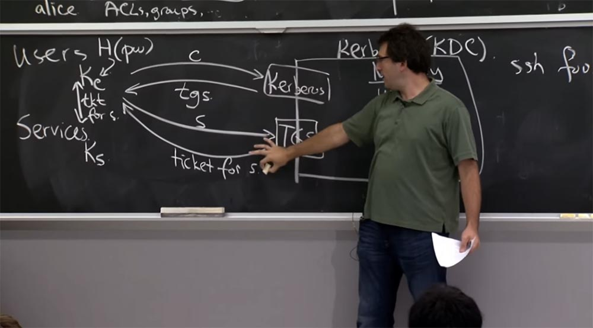

Итак, существует основная структура данных, которую использует Kerberos, и она называется «билет». И этот билет между клиентом и сервером выглядит вот так: в нём имеются имена сервера и клиента s и с, IP – адрес клиента addr, метка времени time stump, срок действия life, указывающий, в течение какого времени действителен данный билет, и ключ Kc,s, который является общим для клиента и сервера. Всё это записано в билете.

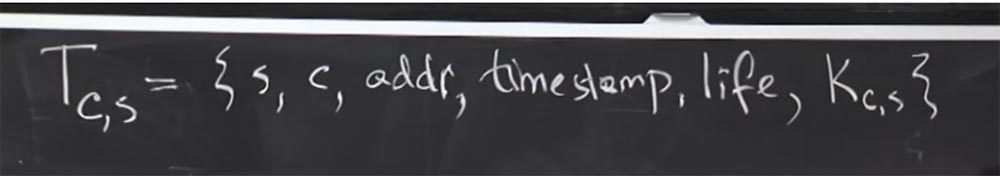

Так вот что написано в билете.

У нас имеется также другая оригинальная структура данных, которую Kerberos называет «Аутентификатор». Этот аутентификатор Ac связан с определенным клиентом и включает в себя только имя клиента, IP-адрес клиента и штамп времени, показывающий, когда клиент создал этот аутентификатор. Как правило, обе эти вещи зашифрованы. Аутентификатор зашифрован ключом Kс,s, который является общим для клиента и сервера, а сам билет Kerberos зашифрован ключом для сервиса Ks. Таким образом, подстрочный индекс обозначает здесь шифрование с помощью конкретного ключа.

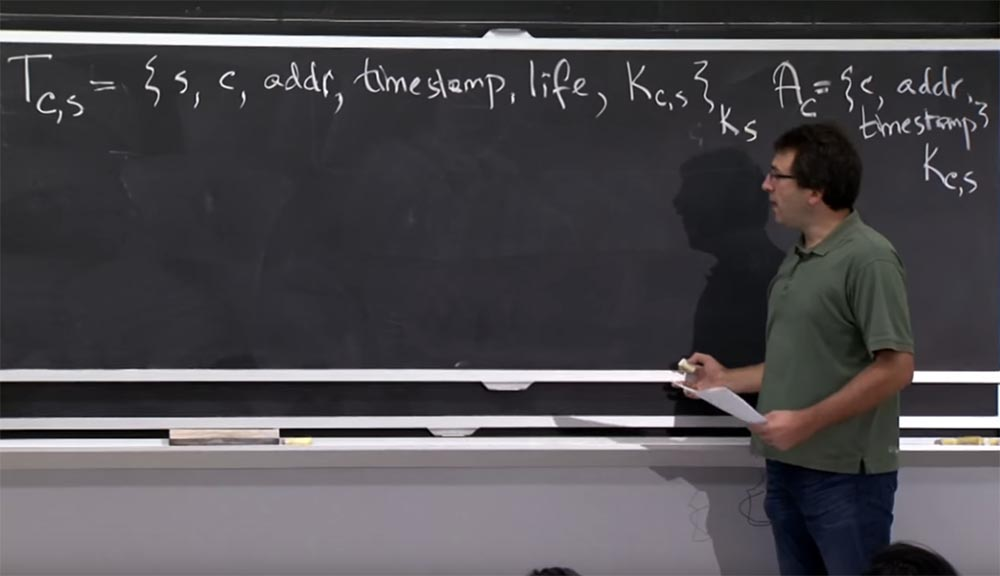

Попробуем разобраться, что это за протокол, с помощью которого пользователь изначально входит в Kerberos и получает и билет TGS. Как мы видели раньше, план состоит в том, что клиент собирается отправить своё имя пользователя серверу Kerberos, или его интерфейсу, и в ответ получить билет. При этом клиент передает оба основных имени: имя клиента конкретного сервиса C, для которого он хочет получить билет, и собственно имя сервиса S, которое содержится в таблице базы данных TGS. Так можно получить билет на любой сервис.

Ответом будет билет между клиентом и сервером Tc,s, зашифрованный ключом Ks, который изображён сверху на рисунке, содержащий также общий ключ Ks, с, и всё вместе это зашифровано ключом Kc. Это и будет проводной протокол.

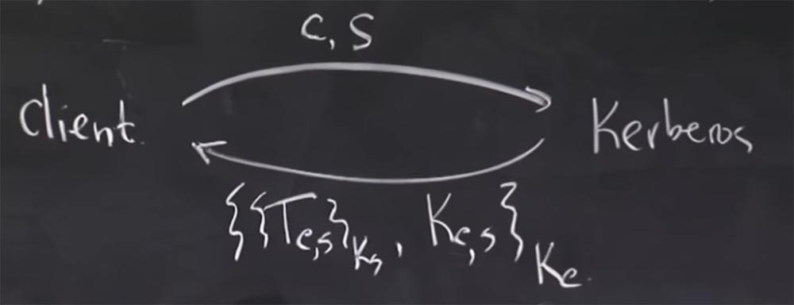

Давайте попробуем разобраться в паре вещей. Прежде всего, как сервер Kerberos проверяет здесь подлинность клиента? Откуда он знает, что запрос совершает правильный пользователь?

**Студент:** он может убедиться, что это тот самый билет, который он послал, потому что он имеет Kc.

**Профессор:** я думаю, происходит то, что сервер Kerberos на самом деле не знает, правильный ли это клиент или нет. Но он думает примерно так: «хорошо, для меня не имеет значения, кто обращается с этой просьбой. Я просто отправлю ему эту штуку, ведь только тот человек, который должен иметь возможность использовать её, знает этот ключ Kc». Это на самом деле круто, потому что клиенту не нужно вообще отправлять свой пароль по сети.

Таким образом, в некотором смысле, это на самом деле лучше, чем если бы клиент отправлял свой пароль на сервер Kerberos, потому что даже если бы сервер Kerberos пытался записать пароли, он никогда не получил бы ваш пароль. Или, может быть, если бы кто-то выдавал себя за сервер Kerberos, он бы не получил копию вашего пароля, так что с безопасностью здесь всё в порядке.  
Студент: а если злоумышленник захочет получить ваш пароль в автономном режиме без…

**Профессор:** да, на самом деле, это не самый лучший аспект Kerberos, верно? Вы видите, в чем тут проблема? Проблема в том, что способ, благодаря которому клиент может сказать, получил ли он правильный пароль или нет, или рабочая станция может сказать, что клиент использует правильный пароль, заключается в том, что они пытаются расшифровать этот билет, и только затем они видят, работает он или нет.

Дешифровка здесь довольно «дешевая», это симметричное шифрование, и вы можете сделать, вероятно, миллионы расшифровок в секунду на современных машинах, если сильно постараться. Это означает, что вы можете попробовать миллионы потенциальных паролей в секунду и угадать, какой пароль у этого человека. Причём это можно сделать для пароля любого человека. Вы можете просто отправить его основное имя на сервер Kerberos, и он с радостью вернет вам ответ, зашифрованный паролем пользователя. Затем вы можете просто пробовать подобрать разные пароли и смотреть, какой из них сработает, а какой нет.

**Студент:** не станет ли расшифровка содержания преимуществом для аутентификации? Как мы можем быть уверены, что вы напрямую…

**Профессор:** да, на самом деле это еще один интересный аспект. Он свидетельствует о том, что разработчики Kerberos при его создании не совсем понимали, что должны очень тщательно отделить шифрование от проверки подлинности. В материалах лекции есть намёк на то, что всякий раз, когда вы шифруете кусок данных и отправляете его кому-то другому и этот человек может расшифровать данные и убедиться, что с ними всё хорошо, то это означает, что он обладает правильным ключом и при пересылке данных они не были повреждены. Спустя 30 лет это не выглядит хорошим планом, хотя в то время это не было настолько явным.

Сейчас в версии Kerberos 5 поступает так: и сервер, и клиент — оба шифруют все части данных и аутентифицируют сообщение вычислением хэша с помощью ключа. В этом случае результат на самом деле говорит вам, что да, эта часть данных не повреждена, она правильно подписана этим ключом, и так далее.

В версии Kerberos 4 в билете имелись некоторые дополнительные биты, которые были зашифрованы и должны были быть некими шаблонами, например, нулями. Если вы получили ключ неправильно, то этот шаблон не выглядел бы как сплошные нули. Этот механизм не был гарантирован криптографически, но в большинстве случаев шаблон не выглядел сплошными нулями и поэтому вы могли понять, получили ли вы правильный ключ или нет.

Итак, в этом заключается план, как сообщить клиенту, является ли его билет действительным. Они просто пытаются расшифровать его и посмотреть, как он работает. Ещё один интересный вопрос — почему этот ключ Kс,s в какой-то форме включен в билет дважды? Он присутствует в билете отдельно как ключ Kс,s и присутствует неявно в самом билете Tс,s. Почему же у нас имеются две копии ключа Kс,s?

27:10 мин

[Курс MIT «Безопасность компьютерных систем». Лекция 13: «Сетевые протоколы», часть 2](https://habr.com/company/ua-hosting/blog/427771/)

Полная версия курса доступна [здесь](https://ocw.mit.edu/courses/electrical-engineering-and-computer-science/6-858-computer-systems-security-fall-2014/).

Спасибо, что остаётесь с нами. Вам нравятся наши статьи? Хотите видеть больше интересных материалов? Поддержите нас оформив заказ или порекомендовав знакомым, **30% скидка для пользователей Хабра на уникальный аналог entry-level серверов, который был придуман нами для Вас:** [Вся правда о VPS (KVM) E5-2650 v4 (6 Cores) 10GB DDR4 240GB SSD 1Gbps от $20 или как правильно делить сервер?](https://habr.com/company/ua-hosting/blog/347386/) (доступны варианты с RAID1 и RAID10, до 24 ядер и до 40GB DDR4).

**VPS (KVM) E5-2650 v4 (6 Cores) 10GB DDR4 240GB SSD 1Gbps до декабря бесплатно** при оплате на срок от полугода, заказать можно [тут](https://ua-hosting.company/vpsnl).

**Dell R730xd в 2 раза дешевле?** Только у нас **[2 х Intel Dodeca-Core Xeon E5-2650v4 128GB DDR4 6x480GB SSD 1Gbps 100 ТВ от $249](https://ua-hosting.company/serversnl) в Нидерландах и США!** Читайте о том [Как построить инфраструктуру корп. класса c применением серверов Dell R730xd Е5-2650 v4 стоимостью 9000 евро за копейки?](https://habr.com/company/ua-hosting/blog/329618/)