Курс MIT «Безопасность компьютерных систем». Лекция 13: «Сетевые протоколы», часть 2 / Блог компании ua-hosting.company

### Массачусетский Технологический институт. Курс лекций #6.858. «Безопасность компьютерных систем». Николай Зельдович, Джеймс Микенс. 2014 год

Computer Systems Security — это курс о разработке и внедрении защищенных компьютерных систем. Лекции охватывают модели угроз, атаки, которые ставят под угрозу безопасность, и методы обеспечения безопасности на основе последних научных работ. Темы включают в себя безопасность операционной системы (ОС), возможности, управление потоками информации, языковую безопасность, сетевые протоколы, аппаратную защиту и безопасность в веб-приложениях.

Лекция 1: «Вступление: модели угроз» [Часть 1](https://habr.com/company/ua-hosting/blog/354874/) / [Часть 2](https://habr.com/company/ua-hosting/blog/354894/) / [Часть 3](https://habr.com/company/ua-hosting/blog/354896/)  
Лекция 2: «Контроль хакерских атак» [Часть 1](https://habr.com/company/ua-hosting/blog/414505/) / [Часть 2](https://habr.com/company/ua-hosting/blog/416047/) / [Часть 3](https://habr.com/company/ua-hosting/blog/416727/)  
Лекция 3: «Переполнение буфера: эксплойты и защита» [Часть 1](https://habr.com/company/ua-hosting/blog/416839/) / [Часть 2](https://habr.com/company/ua-hosting/blog/418093/) / [Часть 3](https://habr.com/company/ua-hosting/blog/418099/)  
Лекция 4: «Разделение привилегий» [Часть 1](https://habr.com/company/ua-hosting/blog/418195/) / [Часть 2](https://habr.com/company/ua-hosting/blog/418197/) / [Часть 3](https://habr.com/company/ua-hosting/blog/418211/)  
Лекция 5: «Откуда берутся ошибки систем безопасности» [Часть 1](https://habr.com/company/ua-hosting/blog/418213/) / [Часть 2](https://habr.com/company/ua-hosting/blog/418215/)  
Лекция 6: «Возможности» [Часть 1](https://habr.com/company/ua-hosting/blog/418217/) / [Часть 2](https://habr.com/company/ua-hosting/blog/418219/) / [Часть 3](https://habr.com/company/ua-hosting/blog/418221/)  
Лекция 7: «Песочница Native Client» [Часть 1](https://habr.com/company/ua-hosting/blog/418223/) / [Часть 2](https://habr.com/company/ua-hosting/blog/418225/) / [Часть 3](https://habr.com/company/ua-hosting/blog/418227/)  
Лекция 8: «Модель сетевой безопасности» [Часть 1](https://habr.com/company/ua-hosting/blog/418229/) / [Часть 2](https://habr.com/company/ua-hosting/blog/423155/) / [Часть 3](https://habr.com/company/ua-hosting/blog/423423/)  
Лекция 9: «Безопасность Web-приложений» [Часть 1](https://habr.com/company/ua-hosting/blog/424289/) / [Часть 2](https://habr.com/company/ua-hosting/blog/424295/) / [Часть 3](https://habr.com/company/ua-hosting/blog/424297/)  
Лекция 10: «Символьное выполнение» [Часть 1](https://habr.com/company/ua-hosting/blog/425557/) / [Часть 2](https://habr.com/company/ua-hosting/blog/425561/) / [Часть 3](https://habr.com/company/ua-hosting/blog/425559/)  
Лекция 11: «Язык программирования Ur/Web» [Часть 1](https://habr.com/company/ua-hosting/blog/425997/) / [Часть 2](https://habr.com/company/ua-hosting/blog/425999/) / [Часть 3](https://habr.com/company/ua-hosting/blog/426001/)  
Лекция 12: «Сетевая безопасность» [Часть 1](https://habr.com/company/ua-hosting/blog/426325/) / [Часть 2](https://habr.com/company/ua-hosting/blog/427087/) / [Часть 3](https://habr.com/company/ua-hosting/blog/427093/)  
Лекция 13: «Сетевые протоколы» [Часть 1](https://habr.com/company/ua-hosting/blog/427763/) / [Часть 2](https://habr.com/company/ua-hosting/blog/427771/) / [Часть 3](https://habr.com/company/ua-hosting/blog/427779/)

**Студент:** клиент не может расшифровать этот билет, потому что он зашифрован с помощью ключа сервиса.

**Профессор:** да, это действительно умно, не правда ли? У нас есть ключ Kс,s который может получить клиент, но здесь, в билете Tс,s есть еще одна копия этого ключа, зашифрованная с помощью Ks.

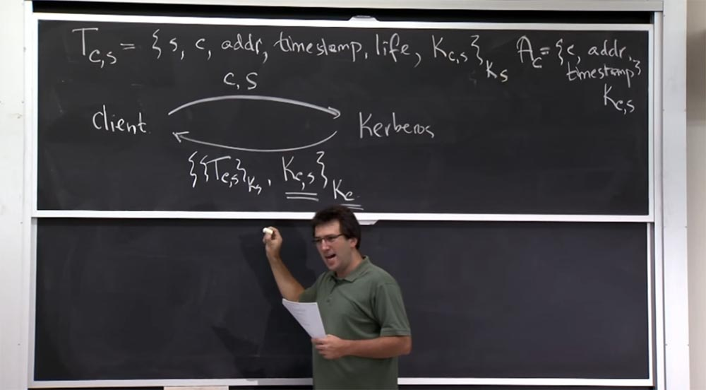

Причина, по которой это сделано, состоит в том, что сервер Kerberos на самом деле пытается обеспечить безопасность общения клиента с другим парнем. Поэтому Керберос создает случайный ключ Kс,s и даёт одну копию клиенту, а другую серверу, с которым клиент собирается поговорить. Представьте, что Kerberos просто бы обратился к сервису со словами: «эй, сервис, этот парень хочет поговорить с тобой, вот ключ для этого»! Это было бы прискорбно, потому что сервер Kerberos обращался бы к сервису снова и снова при каждом запросе. Так что KDS создаёт 2 копии сессионного ключа: одну для клиента, а другую для TGS.

Поэтому вместо этого разработчики придумали хороший трюк, где они предоставляют клиенту этот билет, и тот не может с ним ничего сделать, кроме как обратиться с ним к правильному сервису. И если этот сервис имеет правильный ключ Ks, он его расшифрует и скажет: «ага, это тот самый ключ, который я должен использовать, чтобы поговорить с этим клиентом». Таким образом, оба участника соединения, клиент и сервис, установят общий ключ для защиты своего соединения.

**Студент:** так что же такое TGS?

**Профессор:** существует два взгляда на то, что представляет собой TGS. С точки зрения клиента, это просто еще одна услуга, для пользования которой вы можете получить билет. Чем больше функций предоставляет этот сервис, тем больше билетов он предоставляет. Фактически это сервис по выдаче билетов.

**Студент:** извините, я имел в виду, что у нас билет называется TGS.

Профессор: о, да, извините, надпись tgs под стрелкой на этой схеме является всего лишь сокращением для всего блока записи, кроме индекса s в параметре Tс,s, который означает фактическое имя этого сервиса — TGS. Вы можете представить, что у нас есть сервер Kerberos, есть этот сервис TGS и есть реальный сервис, до которого вы хотите добраться. Так что сначала вам придётся попросить Kerberos предоставить вам билет для получения доступа к определённому сервису.

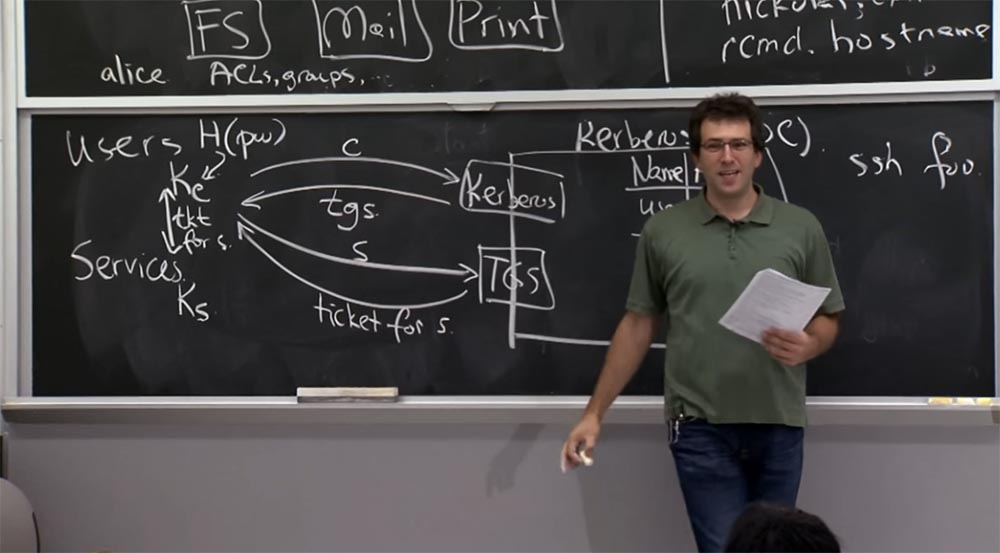

Вы бы могли попросить Kerberos дать вам билет непосредственно на файловый сервер, и это могло бы сработать. Но для этого вам бы понадобился ваш Kс для расшифровки и на всё остальное время пользования сервером. Вместо этого вы получаете билет для специального сервиса TGS. Он выглядит так же, как и другие службы, за исключением того, что размещён в отдельном боксе. И он с удовольствием даст вам позже больше билетов без повторного предоставления вашего первоначального ключа клиента Kc.

**Студент:** то есть его идея в том, что как только вы получите билет TGS, вы можете просто избавиться от своего ключа Kc?

**Профессор:** да, самое классное в этом то, что как только вы получите этот билет Tс,s от сервиса TGS, вы избавляетесь от пароля и ключа Kc. Таким образом, как только вы авторизуетесь в рабочей станции Athena и через пару секунд получите билет Tс,s, ваш пароль удаляется из памяти. Так что даже если кто-то схватит тебя, отберёт компьютер и убежит с ним, все, что у него будет – это твой билет. Хорошо, если он сможет получить доступ к вашей информации на 10 часов, или на период действия билета, но не дольше, потому что пароль не сохранился и при следующем входе в «Афину» его потребуется вводить заново.

Единственный момент, когда нужен пароль – это когда вы посылаете запрос серверу Kerberos, вы получаете этот ответ с билетом и расшифровываете его. После этого можно забыть про пароль. Но конечно, вы не можете отбросить пароль, прежде чем используете его для расшифровки.  
Таким образом, первый, верхний интерфейс C на нашей схеме используется для получения билета с начальным ключом Kc, а второй, нижний интерфейс S – для доступа к сервисам, но уже без необходимости получения начального ключа Kc.

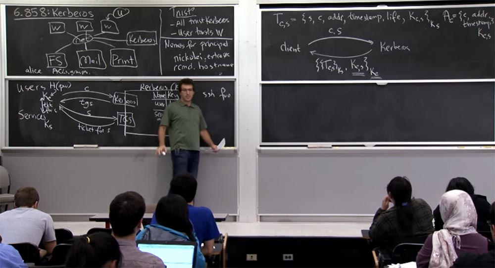

Итак, мы уже поговорили о двух конкретных проблемах протокола Kerberos, которые как бы встроены в него, что причиняло определённые неудобства. Во-первых, создатели предполагали, что шифрование также обеспечит аутентификацию или целостность сообщений, но этого не произошло. Этот недостаток исправлен в Kerberos версии 5, где выполняется явная проверка подлинности сообщений. Во-вторых, для произвольных клиентов у них существовала возможность угадывать пароли других людей.

Как это можно исправить? Как предотвратить атаки способом угадывания пароля в протоколах такого вида? Что мы можем попробовать?

**Студент:** я не уверен, но можно попробовать «посолить» пароль.

**Профессор:** «соление» просто означает, что клиент, возможно, должен разными способами хешировать пароль. Но это не помешает попробовать его подобрать. Так что, возможно, дороже будет построить словарь.

**Студент:** можно попробовать усложнить функцию вычисления пароля.

**Профессор:** да, еще одна хорошая идея — сделать процесс хеширования очень дорогим. Возможно, это разумно. Поэтому, если эта хэш-функция занимает секунду вычислительного времени, как вы, ребята, делали это во второй лабораторной работе, то в этом случае подбор паролей стал бы очень дорогим занятием. Так что это кажется разумным планом – использовать комбинацию «соления» и усложнения процесса отгадывания.

Еще одним способом защиты может стать усложнение ответа. Вы слышали, что в первых версиях протокола сервер Kerberos не имел ни малейшего представления, правильный клиент к нему обращается или нет. Что вы могли бы сделать – это предоставить доказательства, что вы правильный клиент, то есть зашифровать текущую метку времени с хешем пароля, или что-то в этом роде. Затем сервер Kerberos мог бы просто проверить, правильность этих вещей, и если они совпадают, предоставить вам билет.

Вы, вероятно, не захотите добавлять больше проверочных этапов, но это может сработать. Пока что предположим, что можно взять метку времени и выполнить её хеширование вместе с ключом Kc, и кроме того, просто добавить метку времени.

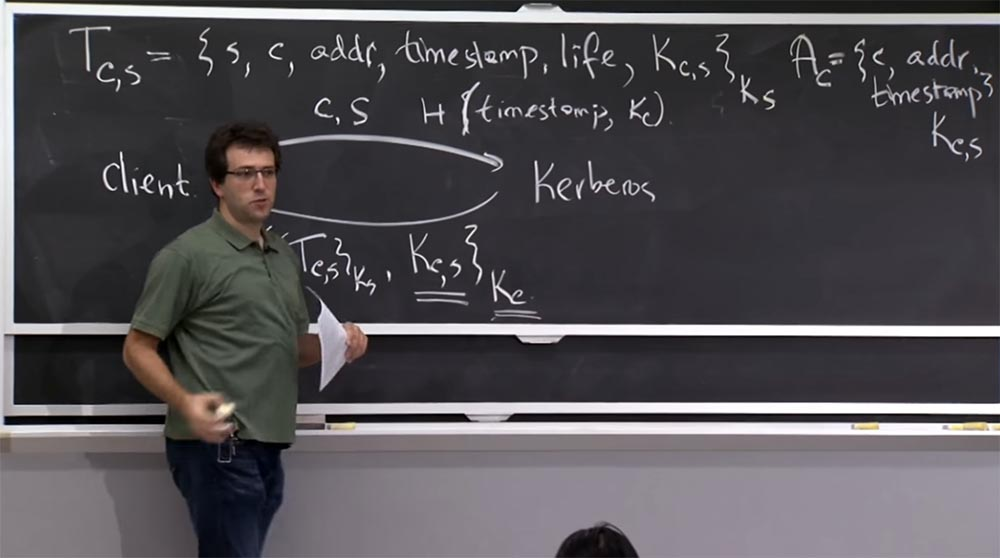

В этом случае сервер может увидеть, что у него есть ваш ключ Kc и он также может хешировать текущую метку времени. Если он получает то же значение, то вероятно, запрос сделан правильным пользователем, которому можно отправить билет. Если же нет, то это был неправильный пароль.

**Студент:** можно просто ограничить выдачу билетов, если серверы фиксируют слишком много запросов на их предоставление.

**Профессор:** совершенно верно, мы можем ввести ограничение. Однако нет никакой причины для того, чтобы хакер запрашивал билет на сервере больше одного раза. Он просто запрашивает конкретного пользователя, получает от него этот зашифрованный блок и может попробовать расшифровать его в автономном режиме столько раз, сколько он хочет, с различными паролями без повторного запроса. Поэтому я думаю, что весь смысл защиты в том, чтобы сервер как-то реагировал на количество вызовов, если атакующий будет многократно запрашивать сервер, пытаясь войти в систему под разными паролями. В таком случае может быть достигнут предел запросов, что обеспечит лучшую защиту от взлома.

**Студент:** как атакующий может послать запрос серверу Kerberos?

**Профессор:** я думаю, он мог бы воспроизвести сообщение правильного пользователя, то есть увидеть его, скопировать, отправить и так же получить ответ с сервера Kerberos. Если хакер просматривает сеть, он может перехватить сообщение во время передачи. Так что ограничение количества запросов – временная мера, лишь немного повышающая безопасность. Но, конечно, если вы просматриваете чужую сеть, то вы увидите, как этот пакет возвращается с сервера независимо от того, что произошло на этапе формирования Tс,s. Так что хакер может увидеть ответ сервера клиенту и попытаться напасть на него.

Вероятно, существуют более сложные схемы, которые вы могли бы разработать, но я не думаю, что Kerberos 5 реализует нечто более сложное, чем рассмотренный нами план, который кажется достаточно хорошим, чтобы не позволить случайным людям пытаться сломать что-либо или использовать brute-force для взлома пароля.

**Студент:** предположим, что можно предусмотреть аутентификацию или ещё что-то, чтобы установить общий ключ. И тогда вы сможете зашифровать эту вещь и общий ключ с помощью Kc.

**Профессор:** да, это так. Если вы действительно делаете это правильно, то для этого существует протокол под названием Password Authenticated Key Exchange, PAKE, который выполняет аутентификацию по паролю. Именно это и происходит в Kerberos.

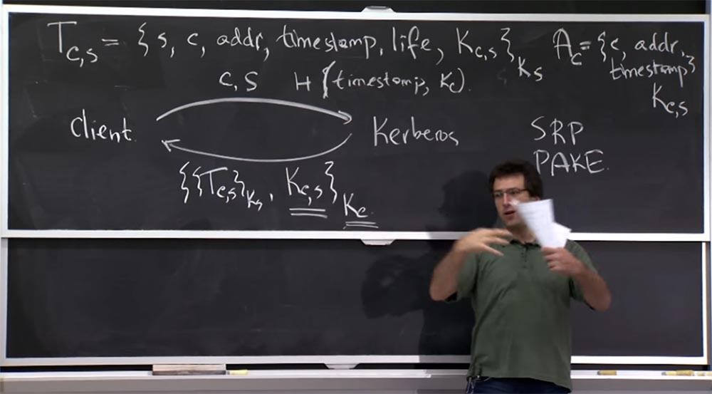

Вы можете посмотреть в Google, для чего предназначены протоколы SRP или PAKE. Эти протоколы и связанные с ними элементы справляются гораздо лучше с поставленной вами задачей, в которой вы должны доказать обеим сторонам, что вы установили новый ключ. При этом обе стороны должны быть убеждены в правильности друг друга и в том, и что нет никакого способа, чтобы отгадать этот пароль в режиме оффлайн и совершить атаку на набор сетевых пакетов, которые вы наблюдаете, и так далее.

Это протоколы, которые в значительной мере полагаются на криптографию, поэтому трудно объяснить на доске, почему они работают.

**Студент:** одна из причин, по которой разработчики поступили подобным образом, состоит в том, что они хотели поддержать возможность отправки только пароля. И протоколы как раз позволяют вам отправить в качестве аутентификатора только одну вещь.

**Профессор:** да, есть много странных требований, которые учитывали эти ребята. Конечно, на практике, эти серверы могут принимать как соединения Kerberos, так и соединения не-Kerberos. И для не-Kerberos соединений, вы получаете картину, как будто кто-то подключается к почтовому серверу, но не использует рабочую станцию Athena. Он просто хочет отправить свой пароль.

И тогда почтовый клиент здесь, скажем так, собирается взять этот пароль и получить билет от вашего имени только для его проверки, что позволит вам использовать этот почтовый клиент. Так что, вероятно, вы всё-таки захотите, чтобы проверку паролей Kerberos осуществлял сам Kerberos. Я не думаю, что это исключается, потому что, конечно, Kerberos 5 развертывает это хеши меток времени и всё такое.

Я думаю, что еще одна вещь, на которую вы должны обратить внимание в материалах лекции, это то, что разработчики Kerberos 4 выбрали одну схему шифрования — DES, наиболее популярный алгоритм шифрования того времени. Это симметричный блочный шифр, довольно быстрый. В то время он обеспечивал достаточную безопасность, и они просто встроили его в протокол.

Все в Kerberos должно было использовать только DES, или, по крайней мере, все в Kerberos версии 4. Это стало проблематичным, потому что теперь, 25-30 лет спустя, шифрование DES легко поддаётся взлому методом brute-force, так как ключи шифрования имеют очень маленький размер – всего 56 бит.

Поэтому можно просто создать какое-то пользовательское оборудование, которое просчитает 2 в 56 степени комбинаций и выяснит настоящий пароль. Это то, чего вы хотите избежать в любом протоколе, разрабатываемом в наше время.

Kerberos версии 5 поддерживает несколько различных схем шифрования, включая AES и другие криптографические алгоритмы. Так что это кажется гораздо лучшим способом обеспечить безопасность. С другой стороны, MIT продолжал поддерживать DES ещё 2 года назад, но теперь от этого отказался, так что на сегодня ваш ректор защищен, по крайней мере, от такого типа атак. Теперь давайте рассмотрим, что происходит в сервисе TGS, от которого вы получаете билет. Взаимодействие с этим сервисом выглядит немного по-другому.

С одной стороны, как клиент, вы собираетесь говорить с ним так, как если бы вы говорили с любым другим сервисом с поддержкой Kerberos. Рассмотрим, как вы выполняете собственную аутентификацию с билетом к какой-то машине. Но ответ, который вы собираетесь вернуть — это просто билет к какому-то другому принципу, на основе которого вы будете общаться, например, с файловым сервером.

Поэтому сообщения уровня протокола будут выглядеть таким образом – справа я нарисую TGS, а слева — клиента. У клиента уже есть билет для TGS, полученный с помощью протокола, изображённого вверху.

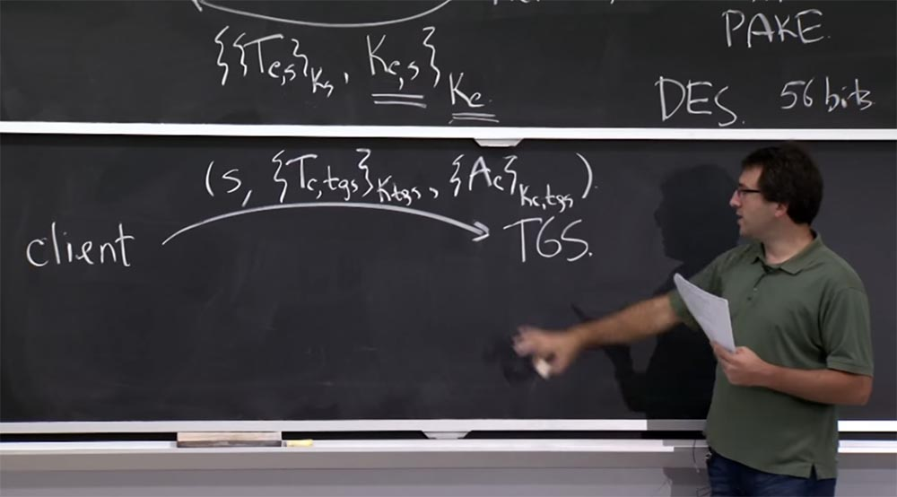

Теперь клиент собирается отправить некие комбинации сообщений, которые доказывают, что он правильный клиент, и эти сообщения имеют отношение к выдаче запроса по какому-то конкретному принципу через TGS.

Итак, клиент собирается отправить в TGS такое послание: S – это сервис, с которым он собирается общаться дальше, это может быть почтовый или файловый сервер, затем сюда включается билет клиента Tc, который он получил для tgs, зашифрованный с помощью ключа K tgs и аутентификатор, который зашифрован ключом Kc,tgs общим для клиента и сервиса TGS. Вот так выглядит сообщение, которое вы собираетесь отправить в TGS – оно говорит: «посмотрите на это сообщение, сделайте с ним что-нибудь и ответьте билетом на этот новый сервис S». Ответ здесь выглядит почти так же, как на рисунке вверху, и на самом деле это то же самое – это билет между клиентом и этим новым сервисом, зашифрованным с помощью Ks. Но теперь здесь стало немного по-другому.

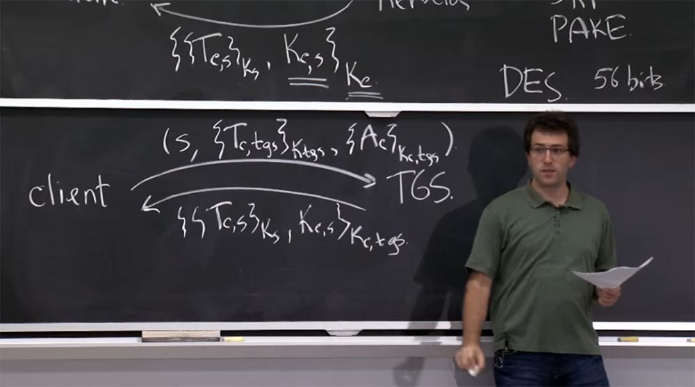

Вместо шифрования ключом Kс, который клиент, наверное, забыл с тех пор, теперь шифрование происходит с помощью общего ключа Kc,tgs между клиентом и службой TGS.

Как же сервер выясняет, чего хочет клиент и как сервер выполняет проверку подлинности клиента? Сервер TGS знает свой собственный ключ Ktgs, поэтому сначала он собирается расшифровать это послание Tc,tgs, заглянуть внутрь билета и выяснить, что происходит. Зачем же нам нужны все эти поля в билете? Почему так важно иметь в билете имя сервера S? Что бы пошло не так, если бы у нас не было S?

**Студент:** если бы его не было, тогда можно было бы потенциально получить разрешение на использование любого сервера.

**Профессор:** да, это так. Вообще это хорошая идея — сделать в сетевых протоколах так, чтобы можно было точно сказать, что означает это сообщение. В случае, если вы опустите S, вы можете опираться на то, что если вы используете билет для неправильного S, тогда, возможно, у вас будет другой ключ Ks, и он не сможет выполнить расшифровку или что-то вроде этого. Так что кажется, что это хорошая идея – включить название сервиса для того, чтобы убедиться, что сервер, который получает эти билеты, расшифровывает их и проверяет — это билет для меня или для кто-то еще?

**Студент:** что делает клиент с полученным ключом Ktgs?

**Профессор:** хороший вопрос! Клиент понятия не имеет, что это. Потому что это сверхсекретный ключ. Если бы вы знали его, то были бы в состоянии взломать весь Kerberos. Так что клиент понятия не имеет, что такое Ktgs.

**Студент:** откуда же берётся этот Ktgs?

**Профессор:** сам сервер Kerberos генерирует для вас всё это послание, в котором уже есть Tc,tgs и Ktgs, вы не создаёте его сами, а просто копируете отсюда.

Так для чего же так важно имя клиента? Это легко сообразить. Если вы не помещаете имя клиента в билет, тогда сервер получает это послание, но понятия не имеет, с кем он пытается поговорить. Он не знает, для кого должен выдать билет – для вас или для кого-то ещё.

А как обстоят дела с другими полями? Почему разработчики вставляют в билет Tc,s адрес addr? Это ведь просто IP-адрес клиента, так почему бы его не использовать напрямую?

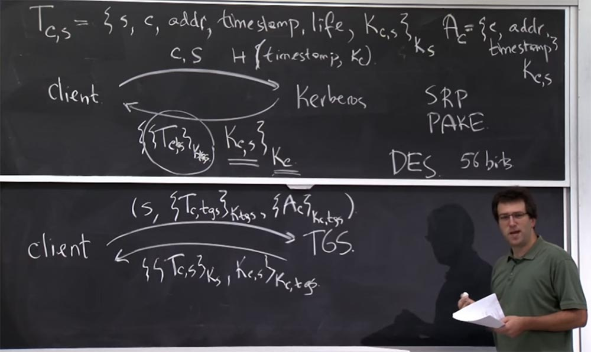

Я думаю, что смысл такого решения состоит в желании разработчиков повысить безопасность. Они хотели убедиться, что если клиент вошел в систему с какого-то IP адреса, то все остальное по тому же билету происходит с того же IP-адреса. Например, если вы вошли с какого-то IP-адреса, например 18.26.4.9, то каждое соединение с файловым или почтовым сервером должно быть с того же IP-адреса. В противном случае сервер должен отклонить ваше соединение, так как может предположить, что кто-то украл ваш билет. Таким образом мы защищаемся здесь от использования украденных билетов. Если у вас ещё есть тот же билет — хорошо, но если вы не используете тот же IP-адрес, у вас ничего не получится.

На данный момент это выглядит заблуждением, и Kerberos 5 все ещё использует подобный подход, хотя это необязательно. Действительно, вы должны просто полагаться на криптографию вместо обеспечения безопасности IP-адреса.

А в чём смысл временной метки timestamp и времени жизни life в билете? Для чего они нужны и чем полезны?

**Студент:** они нужны для предотвращения атак повторного воспроизведения.  
Профессор: атаки повторного воспроизведения нам помогает предотвратить аутентификатор, потому что эта штука генерируется каждый раз, когда вы делаете новый запрос. Но с другой стороны, билет остается прежним, так что это, конечно, не мешает атакам повторного воспроизведения.

**Студент:** это мешает кому-то украсть ваш билет, а затем использовать его в своих целях.  
Профессор: да, это просто ограничивает время, в течение которого билет действителен, благодаря чему ущерб от его кражи уменьшается. Временная метка – это время, когда вы получили билет, а время жизни показывает, сколько этот часов билет действителен от начальной метки времени. Поэтому, если вы попытаетесь использовать его слишком рано или слишком поздно, то по протоколу Kerberos любой сервер должен отклонить такой билет. Это означает, что каждый сервер должен синхронизировать свои часы.

**Студент:** ранее вы говорили, что клиент может выбросить свой начальный ключ отбрасывает Kс, но должен хранить Kс,s, полученный от TGS.

**Профессор:** да, это так, клиент отбрасывает Kс после входа в систему, но должен хранить Kс,s.

**Студент:** итак, если кто-то крадет Kс,s, то у него появляется доступ…

**Профессор:** да, давайте рассмотрим, насколько это плохо? Почему лучше, чтобы хакер раскрыл этот Kc,tgs, чем Kс?

**Студент:** если вы получите возьмете Kс,s, то вы сможете просто украсть сеанс между этими двумя собеседниками, но если вы украдёте Kс, то сможете выдать себя за клиента.

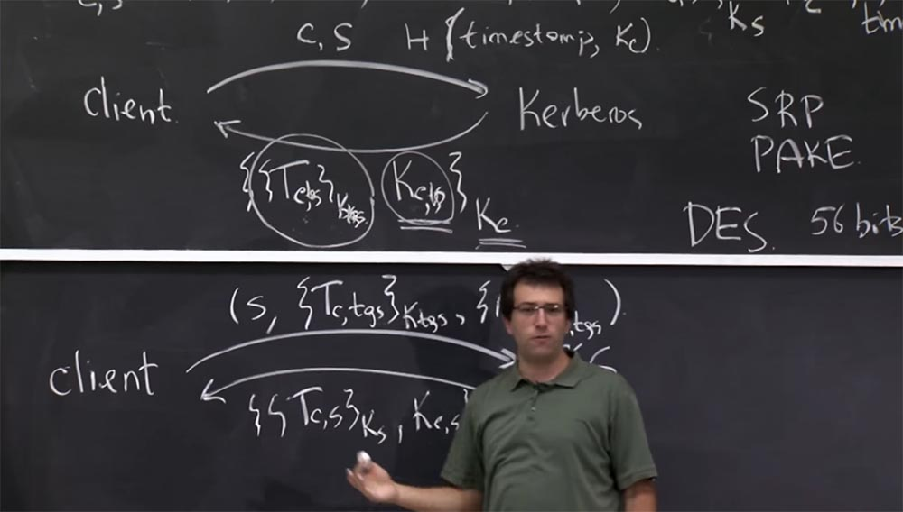

**Профессор:** совершенно верно. Поэтому единственный способ защиты это то, что Kc,s — это на самом деле новый ключ, который создается каждый раз, когда вы входите в систему. Это хорошо, потому что у вас есть билет Tc,tgs, который к нему прилагается. Если вы потеряете этот билет или он станет не действителен, то у вас есть ещё эти 56 бит в этом ключе Kc,s. Но никто не собирается их использовать. Весь смысл этих битов в том, что благодаря им билет Tc,tgs говорит, что этот ключ Kc,s действителен в данный момент, и в нём есть какое-то ограничение.

**Студент:** поэтому, если кто-то сможет украсть оба эти элемента — Tc,tgs, зашифрованный ключом Kc,tgs, и сам ключ Kc,tgs, зашифрованный Kc — то он не будет ничем ограничен.

**Профессор:** да, если кто-то украдет обе эти вещи, то сможет выдать себя за вас или, например, войти в файловый или почтовый сервер в течение времени жизни билета, которая может составлять пару часов или 10 часов. Украденным Kc можно будет пользоваться без временных ограничений, пока вы не измените свой пароль.

Итак, похоже, что на сегодня все эти поля в билете вроде как важны, кроме представления IP-адреса, который не особо влияет на безопасность. Мы наконец-то получаем в ответ этот билет, который изображён внизу схемы, и поскольку мы знаем Kc,tgs, то можем расшифровать ответ от сервера TGS. Теперь у нас есть билет на любой сервер — файловый сервер, почтовый сервер, какой угодно сервер, к которому мы хотели подключиться.

Теперь давайте рассмотрим, как вы можете, наконец, использовать всё это в протоколе уровня приложений. Предположим, что я говорю с почтовым сервером, чтобы получить свои сообщения. Поэтому моя клиентская рабочая станция собирается отправить TGS запрос на получения билета для доступа к почте, например, PO12, и TGS вернет ей билет с доступом к почте PO12. И внутри этого билета, или внутри этого ответа, у меня теперь есть общий ключ Kc,s для связи между мной и почтовым сервером. Я покажу этот билет почтовому серверу, и он убедится в том, что я правильный клиент и всё в этом ключе соответствует правильным принципам. Так что у нас с почтовым сервером состоится зашифрованный разговор с использованием этого нового ключа Kc,s.

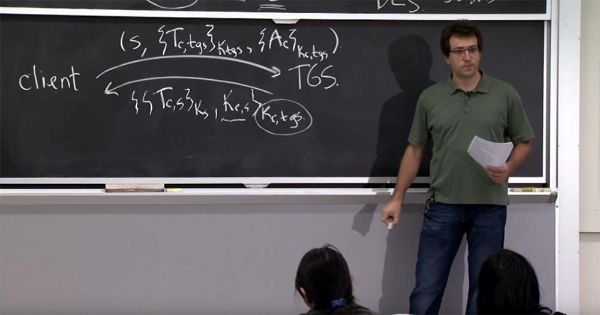

Что я мог бы сделать как клиент, это сначала отправить сообщение на почтовый сервер, которое включает в себя билет на почтовый сервер Tc,mail, зашифрованный ключом почтового сервера Kmail, и вместе с ним отправить сообщение о том, что мне нужно сделать с почтой, например, удалить сообщение 5 – DELETE 5, зашифрованное ключом Kc,mail.

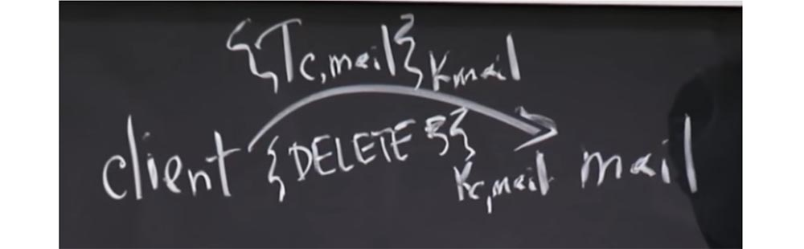

Итак, что же происходит в этом протоколе на почтовом сервере mail? В первую очередь почтовый сервер использует для расшифровки этого билета свой секретный ключ Kmail, а потом заглянет внутрь и найдёт две важные вещи -основное имя того, кто с ним говорит, и ключ Kc,s, который он должен использовать для расшифровки всего последующего трафика и аутентификации его в Kerberos 5. После этого он сможет расшифровать ваше сообщение и сказать: «ага, пользователь C пытается удалить пятое сообщение, поэтому я выполню эту команду».

**Студент:** сервер Kerberos изначально отправляет билет Tc,tgs и ключ Kc,s. Где здесь содержится аутентификатор?

**Профессор:** Идентификаторы Ac фактически генерируются клиентом. Обратите внимание, что клиенту для генерации аутентификатора нужен только ключ Kc,s, и клиент может делать это столько раз, сколько захочет. Таким образом, общий план для аутентификаторов или причина использования аутентификаторов состоит в предотвращении атаки повторного воспроизведения.

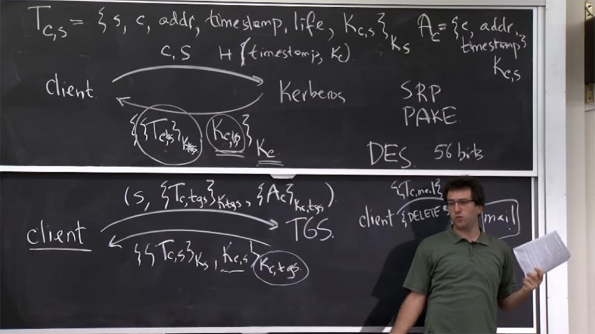

Таким образом, в Kerberos 4 каждый раз, когда клиент посылает новый запрос, будет создаваться новый аутентификатор, говорящий, что это новый запрос, клиент создаёт его только теперь и он отличается от всех предыдущих запросов, поэтому нужно сделать то, что просит клиент.

Общий план состоял в том, что сервер должен был хранить кэш этих аутентификаторов, которые были отправлены, например, в течение последних пяти минут. Поэтому если он видел дубликат аутентификатора, то воспринимал его как попытку атаки повторного воспроизведения и отвергал его. Так же он поступал, если видел аутентификатор, который находится за пределами пятиминутного времени жизни и которого у него не было в кэше. Сервер смотрел на метку времени в этом аутентификаторе, видел, что он устарел, и отклонял просьбу, потому что она была слишком старая. Так что если клиенту нужно получить доступ, пусть отправит новый запрос.  
Таков общий план использования аутентификаторов. Как и многие вещи из первой версии Kerberos, в последствии они были немного изменены, по крайней мере, в Kerberos 4. Потому что этот аутентификатор на самом деле ничего не говорит о вашем послании, это просто какое-то дополнение к нему.

Таким образом, способ его использования, например, в этом протоколе почтового сервера, по крайней мере, в Kerberos 4, состоит в том, что вы генерируете аутентификатор, берёте его и так же зашифровываете ключом Kс,mail. И почтовый сервер будет отслеживать, отправили ли вы этот аутентификатор заранее или нет.

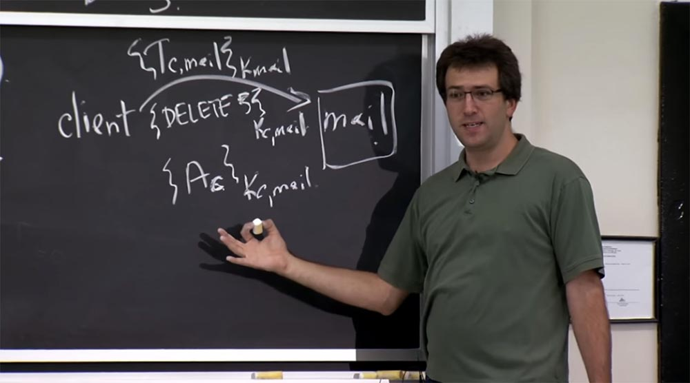

Но здесь нет ничего, что соединяет аутентификатор с сообщением, которое вы посылаете. Для первого сообщения это было здорово, но когда через секунду вы посылаете следующее сообщение, вы создаёте второй аутентификатор. При этом кто-то в сети может сказать: «ага, у меня есть ваш новый аутентификатор, я могу использовать его вместе с соединением со старым сообщением DELETE и тем самым заставить дважды удалить сообщение номер 5, даже если вторая команда предназначена для какой-то другой операции».

Таким образом, Kerberos 5 предоставляет вам право вставить в аутентификатор что-то, что касается отдаваемой вами команды. Разработчики, конечно, могли бы изначально использовать такой механизм, но понадобилось время, чтобы они поняли, как правильно должен работать протокол.

**Студент:** откуда клиент берёт Kс,mail?

**Профессор:** клиент получает его из этого ответа.

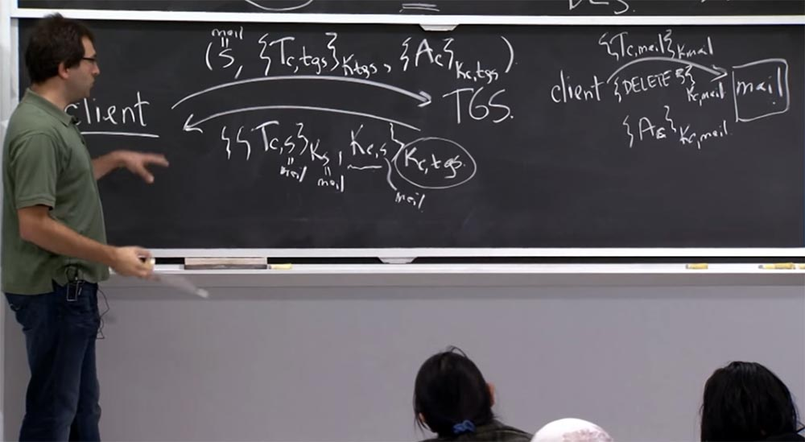

Потому что клиент, посылая TGS запрос на билет, имеет в виду, что это S – имя сервиса mail, и подстрочный индекс S в полученном билете Tc,s – это тоже mail, и индекс S в ключе Kc,s — это тоже имя mail. Так что этот Kc,s на самом деле Kс,mail. Вот так клиент узнает о ключе, который является общим для него и файлов на почтовом сервере.

**Студент:** а как почтовый сервер получает Kс,mail?

**Профессор:** да, как же почтовый сервер получает этот общий ключ? Ведь почтовый сервер, возможно, никогда раньше не слышал о вас и о вашем соединении. Откуда же Kс,mail приходит на почтовый сервер?

**Студент:** разве это не часть билета?

**Профессор:** да, правильно, так что это классная вещь! Вы отправляете этот билет на почтовый сервер и почтовый сервер узнаёт собственный секретный ключ Kmail, который он использует для расшифровки билета Tс,mail, и этот общий ключ находится там вместе с именем того, с кем он делится данным ключом. Вот так сервер узнает, что разговаривает с тем парнем, с которым должен использовать общий ключ.

Итак, что вот что представляет собой основной план использования данного протокола при работе с приложениями. Но с этим всё ещё имеется куча проблем. Так что о Kerberos хорошо читать на бумаге, однако в нём имеются проблемы, о которых эти ребята не знали 30 лет назад.  
Поэтому неизбежно, что у нас возникают проблемы, которые вы должны решить. Так, одна интересная проблема Kerberos 4 касается способа шифрования и аутентификации сообщений для приложений. Она заключается в том, что здесь используется один и тот же ключ для шифрования сообщений от клиента к серверу и для ответных сообщений от сервера клиенту.

54:00 мин

[Курс MIT «Безопасность компьютерных систем». Лекция 13: «Сетевые протоколы», часть 3](https://habr.com/company/ua-hosting/blog/427779/)

Полная версия курса доступна [здесь](https://ocw.mit.edu/courses/electrical-engineering-and-computer-science/6-858-computer-systems-security-fall-2014/).

Спасибо, что остаётесь с нами. Вам нравятся наши статьи? Хотите видеть больше интересных материалов? Поддержите нас оформив заказ или порекомендовав знакомым, **30% скидка для пользователей Хабра на уникальный аналог entry-level серверов, который был придуман нами для Вас:** [Вся правда о VPS (KVM) E5-2650 v4 (6 Cores) 10GB DDR4 240GB SSD 1Gbps от $20 или как правильно делить сервер?](https://habr.com/company/ua-hosting/blog/347386/) (доступны варианты с RAID1 и RAID10, до 24 ядер и до 40GB DDR4).

**VPS (KVM) E5-2650 v4 (6 Cores) 10GB DDR4 240GB SSD 1Gbps до декабря бесплатно** при оплате на срок от полугода, заказать можно [тут](https://ua-hosting.company/vpsnl).

**Dell R730xd в 2 раза дешевле?** Только у нас **[2 х Intel Dodeca-Core Xeon E5-2650v4 128GB DDR4 6x480GB SSD 1Gbps 100 ТВ от $249](https://ua-hosting.company/serversnl) в Нидерландах и США!** Читайте о том [Как построить инфраструктуру корп. класса c применением серверов Dell R730xd Е5-2650 v4 стоимостью 9000 евро за копейки?](https://habr.com/company/ua-hosting/blog/329618/)