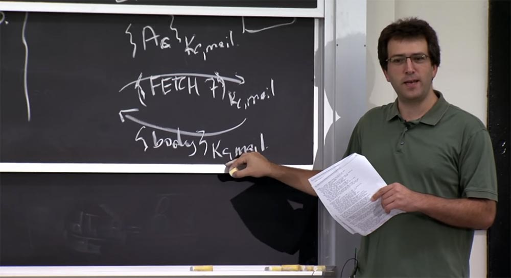
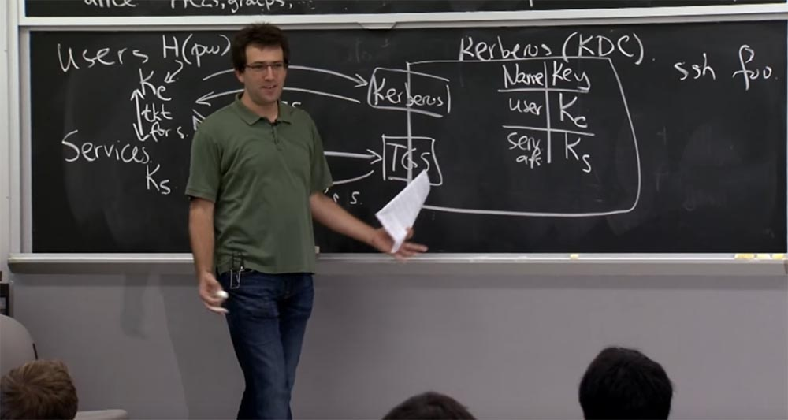
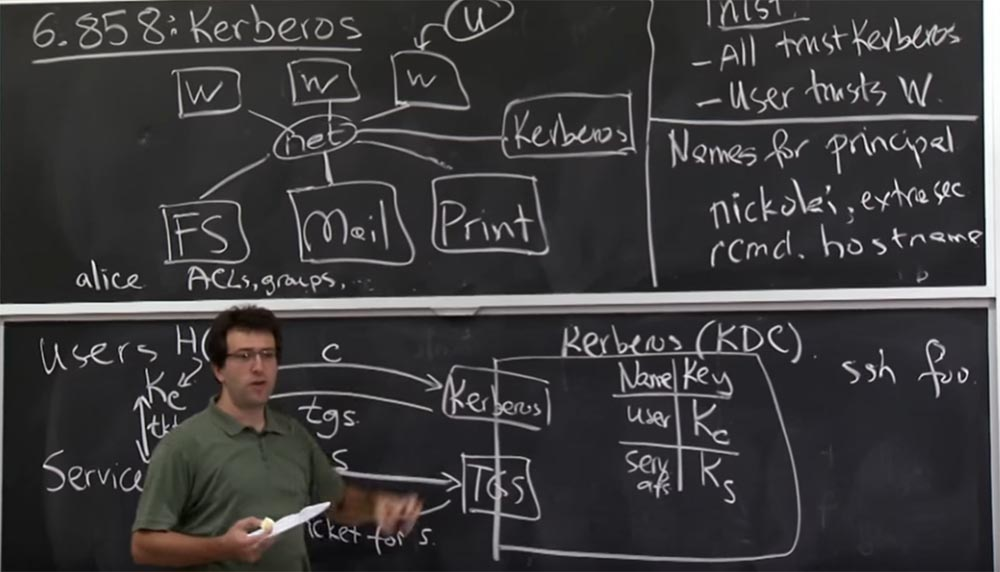
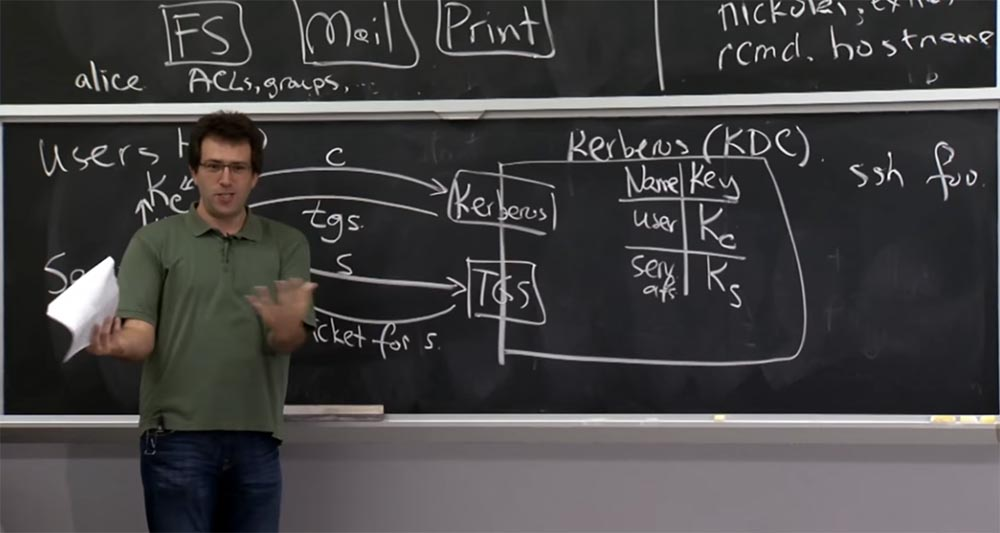
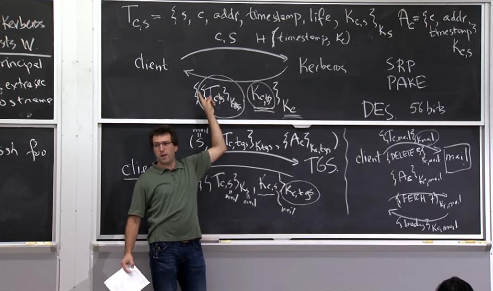
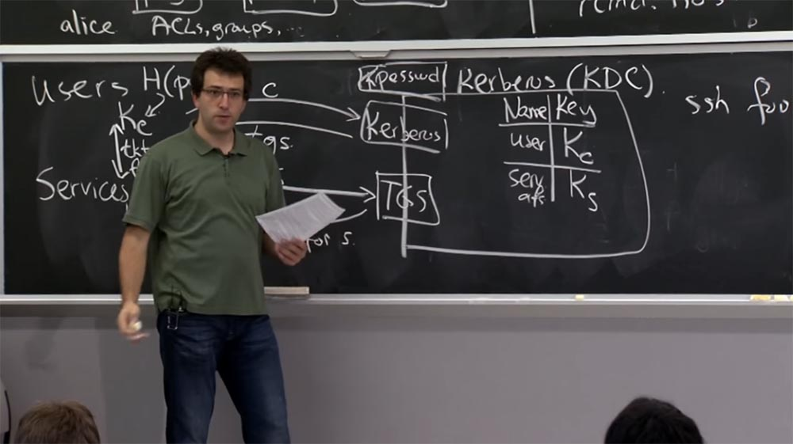
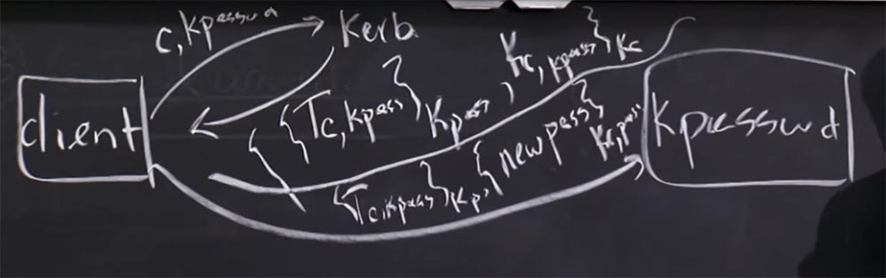
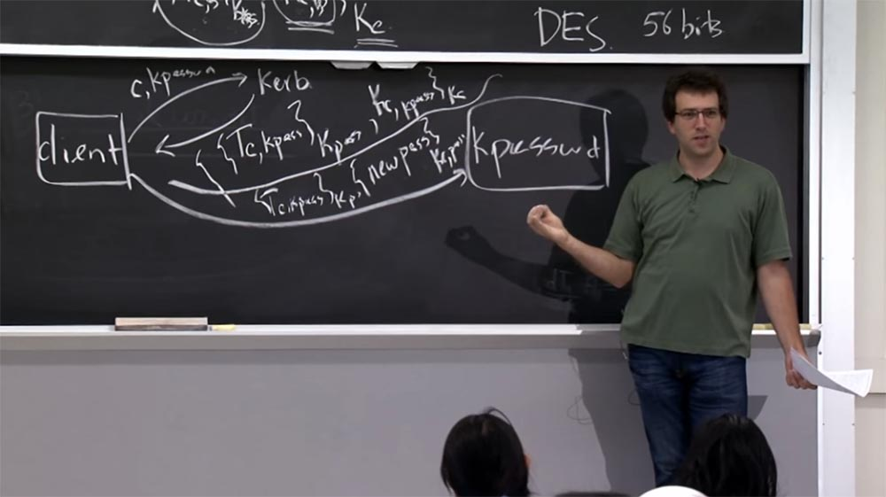

Курс MIT «Безопасность компьютерных систем». Лекция 13: «Сетевые протоколы», часть 3 / Блог компании ua-hosting.company

### Массачусетский Технологический институт. Курс лекций #6.858. «Безопасность компьютерных систем». Николай Зельдович, Джеймс Микенс. 2014 год

Computer Systems Security — это курс о разработке и внедрении защищенных компьютерных систем. Лекции охватывают модели угроз, атаки, которые ставят под угрозу безопасность, и методы обеспечения безопасности на основе последних научных работ. Темы включают в себя безопасность операционной системы (ОС), возможности, управление потоками информации, языковую безопасность, сетевые протоколы, аппаратную защиту и безопасность в веб-приложениях.

Лекция 1: «Вступление: модели угроз» [Часть 1](https://habr.com/company/ua-hosting/blog/354874/) / [Часть 2](https://habr.com/company/ua-hosting/blog/354894/) / [Часть 3](https://habr.com/company/ua-hosting/blog/354896/)  
Лекция 2: «Контроль хакерских атак» [Часть 1](https://habr.com/company/ua-hosting/blog/414505/) / [Часть 2](https://habr.com/company/ua-hosting/blog/416047/) / [Часть 3](https://habr.com/company/ua-hosting/blog/416727/)  
Лекция 3: «Переполнение буфера: эксплойты и защита» [Часть 1](https://habr.com/company/ua-hosting/blog/416839/) / [Часть 2](https://habr.com/company/ua-hosting/blog/418093/) / [Часть 3](https://habr.com/company/ua-hosting/blog/418099/)  
Лекция 4: «Разделение привилегий» [Часть 1](https://habr.com/company/ua-hosting/blog/418195/) / [Часть 2](https://habr.com/company/ua-hosting/blog/418197/) / [Часть 3](https://habr.com/company/ua-hosting/blog/418211/)  
Лекция 5: «Откуда берутся ошибки систем безопасности» [Часть 1](https://habr.com/company/ua-hosting/blog/418213/) / [Часть 2](https://habr.com/company/ua-hosting/blog/418215/)  
Лекция 6: «Возможности» [Часть 1](https://habr.com/company/ua-hosting/blog/418217/) / [Часть 2](https://habr.com/company/ua-hosting/blog/418219/) / [Часть 3](https://habr.com/company/ua-hosting/blog/418221/)  
Лекция 7: «Песочница Native Client» [Часть 1](https://habr.com/company/ua-hosting/blog/418223/) / [Часть 2](https://habr.com/company/ua-hosting/blog/418225/) / [Часть 3](https://habr.com/company/ua-hosting/blog/418227/)  
Лекция 8: «Модель сетевой безопасности» [Часть 1](https://habr.com/company/ua-hosting/blog/418229/) / [Часть 2](https://habr.com/company/ua-hosting/blog/423155/) / [Часть 3](https://habr.com/company/ua-hosting/blog/423423/)  
Лекция 9: «Безопасность Web-приложений» [Часть 1](https://habr.com/company/ua-hosting/blog/424289/) / [Часть 2](https://habr.com/company/ua-hosting/blog/424295/) / [Часть 3](https://habr.com/company/ua-hosting/blog/424297/)  
Лекция 10: «Символьное выполнение» [Часть 1](https://habr.com/company/ua-hosting/blog/425557/) / [Часть 2](https://habr.com/company/ua-hosting/blog/425561/) / [Часть 3](https://habr.com/company/ua-hosting/blog/425559/)  
Лекция 11: «Язык программирования Ur/Web» [Часть 1](https://habr.com/company/ua-hosting/blog/425997/) / [Часть 2](https://habr.com/company/ua-hosting/blog/425999/) / [Часть 3](https://habr.com/company/ua-hosting/blog/426001/)  
Лекция 12: «Сетевая безопасность» [Часть 1](https://habr.com/company/ua-hosting/blog/426325/) / [Часть 2](https://habr.com/company/ua-hosting/blog/427087/) / [Часть 3](https://habr.com/company/ua-hosting/blog/427093/)  
Лекция 13: «Сетевые протоколы» [Часть 1](https://habr.com/company/ua-hosting/blog/427763/) / [Часть 2](https://habr.com/company/ua-hosting/blog/427771/) / [Часть 3](https://habr.com/company/ua-hosting/blog/427779/)

Предположим, что клиент выдает запрос на получение определенного сообщения, например, «выдай мне сообщение №7», и шифрую эту штуку ключом Kс,mail. Кажется, что все замечательно.  
У почтового сервера есть общий ключ, который расшифрует это сообщение, после чего сервер отправит обратно клиенту тело этого сообщения электронной почты, также зашифрованного с помощью Kс,mail. Кто-нибудь видит в этом проблему? Почему это может быть плохо?

**Студент:** существует возможность, когда хакер может заменить сообщение или подделать его.

**Профессор:** да, это вызывает беспокойство, потому что я могу отправить вам любое сообщение по электронной почте, какое захочу. Предположим, я намерен удалить какое-то сообщение, которое находится в ваших входящих письмах, потому что не хочу, чтобы вы его прочитали. Допустим, это письмо под номером 23.

Поэтому я собираюсь отправить вам письмо, в котором говорится: «удалить №23», и вы собираетесь его прочитать. Вы собираетесь получить его, и ответ, поступающий с почтового сервера с командой «удалить №23» будет зашифрован этим ключом Kc,mail. И до сих пор он не отправлен на почтовый сервер.

Но если я просматриваю сеть в нужное время и фиксирую этот пакет, я могу отправить его обратно на почтовый сервер. Это будет выглядеть как сообщение «удалить №23», зашифрованное с помощью ключа. В этом случае почтовый сервер скажет: «о да, конечно, вы хотите удалить это сообщение, и я сделаю это»!

Так что здесь есть проблема, потому что мы позволяем противнику запутать почтовый сервер относительно того, было ли наше сообщение сгенерировано им или отправлено ему в первую очередь.

Это то, что обычно называется в криптографии и описании протоколов «атака отражения». Есть ли у вас какие-либо предложения, как можно избежать этой проблемы?

**Студент:** нельзя ли просто включить сообщение заголовок, говорящий о его происхождении?

**Профессор:** да, как правило, вы хотите иметь какой-то однозначный способ заявить, что происходит. Один из способов — иметь заголовок в каждом сообщении, в котором говорится: «от клиента к серверу» или «от сервера к клиенту». Ещё лучшим способом на практике оказывается просто использовать два отдельных ключа.

Потому что вы можете захотеть иметь длительный поток данных, в котором может не найтись места для битов заголовка. Таким образом, каждый раз, когда вы устанавливаете соединение с каким-либо сервисом, Kerberos 5 согласовывает использование двух ключей вместо одного. Первый ключ будет использоваться для шифрования данных от клиента к серверу, а второй для шифрования данных от сервера назад к клиенту. Это наиболее оптимальный способ защиты для практического использования.

Давайте теперь поговорим о том, что происходит с KDC. Сервер Kerberos очень важен для системы, но что произойдет, если этот KDC «упадет»? Насколько это плохо для нашей системы? Каким образом «падение» KDC отразится на вашей жизни, если вы пользуетесь «Афиной»?

**Студент:** вероятно, вы не сможете войти в систему?

**Профессор:** да, это так. Во-вторых, вы также не сможете получить билеты для новых запросов. Но классная вещь заключается в том, что KDC в значительной степени располагается вне критического пути для существующего соединения. Поэтому через KDC никакие данные не проходят. И если у вас уже есть билет на что-то, вы можете продолжать его использовать его и сохранить вход в некоторые сетевые сервисы. На самом деле это довольно красиво кэшируется. Я думаю, второй хорошей вещью, которую предусмотрели разработчики, является потенциальная возможность реплицировать KDC. Поэтому в системе имеется один главный сервер Kerberos, который хранит начальную копию всей базы данных. Это позволяет читать только реплики, которые содержат копию начальной базы данных. Он не разрешают никаких обновлений, таких как регистрация пользователей или обновление ключей, но позволяет отвечать на запросы login и TGS.

Таким образом, запись «клона» базы данных Kerberos позволяет вам продолжать входить в систему и общаться с сервисами, даже если произошёл сбой KDC, пока его не ликвидируют и не восстановят полную функциональность.

**Студент:** насколько сложно скомпрометировать KDC сервер и систему в целом?

**Профессор:** KDC является основой любой системы, которая работает под управлением Kerberos. Если этот сервис будет скомпрометирован, злоумышленник получит полный контроль над системой. Он сможет получать билеты на любой сервис, который вы хотите, притворяясь правильным клиентом, так что это довольно плохо. Мы действительно хотим обеспечить безопасность KDC, но это трудно. Хотя я не знаю ни одного случая, когда KDC MIT был бы действительно скомпрометирован на протяжение примерно 20 лет. Но, по-видимому, то, о чем действительно стоит беспокоиться – это о программной реализации безопасности вещей, которыми обмениваются эти два сервиса, Kerberos и TGS. Потому что если в них происходить переполнение буфера или возникает какая-то другая аналогичная уязвимость, это действительно плохо.

Например, если на KDC Kerberos работает SSH-сервер и кто-то угадывает root-пароль этого SSH-сервера, то он просто войдёт в систему и скопирует базу данных. Поэтому я думаю, что вы действительно захотите минимизировать здесь поверхность атаки, так что будьте очень осторожны при написании кода KDC. Не позволяйте, чтобы кто-то напрямую мог зайти в этот сервис. Конечно, существует некоторые места, к безопасности которых вы должны вы должны относиться как параноики, но в отношении серверов это не так важно. Конечно, они хранят данные, но если кто-то взламывает почтовый сервер или сервер печати, их можно восстановить.

Вот интересный вопрос. Предположим, кто-то взломал почтовый сервер. Что вы должны сделать, чтобы оправиться от этой атаки? Например, если кто-то украл вашу почту, это плохо. Но что нужно делать, чтобы злоумышленник не получил доступ к вашей почте в будущем?

В Kerberos нет операции отмены, но вы можете сгенерировать новый ключ для почтового сервера и вставить его в базу данных KDC. Затем вы устанавливаете новый почтовый сервер, даете ему новый ключ, и тогда какой-то злоумышленник, у которого есть старый ключ от почтового сервера, не может никак на него повлиять.

С другой стороны, предположим, что вы не измените ключ почтового сервера, Kmail. К чему это приведёт?

**Студент:** ключ не подойдёт к новому серверу.

**Профессор:** хорошо, предположим, вы устанавливаете новый почтовый сервер, исправляя ошибку, которой воспользовался хакер. Но у него все ещё есть ключ Kmail. Возможно, восстановление сервера заняло целый день, так что все билеты оказались просроченными. Может ли этот хакер сделать с системой что-нибудь интересное? Если вы предоставляете новому почтовому серверу старый Kmail — это плохо?

**Студент:** злоумышленник может проникнуть на почтовый сервер, потому что сможет расшифровать первый билет.

**Профессор:** точно, поэтому Kmail на самом деле очень важен. Вы говорите, что можете расшифровать все, что происходит на почтовом сервере. Предположим, клиент подключается к почтовому серверу после его исправления, но злоумышленник все еще знает Kmail, который остался с момента последнего взлома системы. Поэтому он может расшифровать этот билет Kmail, заглянуть внутрь билета и получить сеансовый ключ. С помощью него он сможет расшифровать все сообщения, которые вы отправляете, все получаемые вами ответы и так далее. Поэтому после восстановления почтового сервера очень важно изменить этот Kmail.

Во многих отношениях это даже хуже, чем просто отслеживание трафика, потому что если злоумышленник знает этот ключ Kmail, он может синтезировать новые билеты для почтового сервера, не обращаясь к KDC. Предположим, что я знаю Kmail и хочу прочитать почту с почтового сервера. Я просто выпишу этот билет, я соберу все эти пять полей в правильном порядке, сгенерирую новый ключ и зашифрую его с помощью Kmail. Это будет выглядеть как реальная вещь, сгенерированная KDC.

Поэтому я просто подключусь к почтовому серверу, он правильно расшифрует послание и подумает, что это какой-то конкретный пользователь, так что ему можно предоставлять почту, делиться с ним общим ключом и так далее. Поэтому критически важно, чтобы никто не узнал секретный ключ этого сервиса, так как в противном случае можно не только сделать трафик расшифровываемым и просматриваемым, но и подражать кому угодно в этом сервисе.

**Студент:** если почтовый сервер восстановлен после сбоя, то вероятно, нужно поменять его ключ в базе данных?

**Профессор:** да, после того, как вы восстановите почтовый сервер после сбоя, нужно вызвать парня, который работает с этим KDC и сказать: «наш почтовый сервер взломали, поэтому удалите его старый ключ Ks из базы данных и вставьте новый»! Так что, вероятно, вы захотите иметь какой-то механизм за пределами базы данных, чтобы доказать, что вы действительно являетесь почтовым сервером.

Потому что мы посмотрим через секунду, как вы меняете ключи, например, с помощью протокола смены паролей. Вы можете пароли в протоколе Kerberos, потому что если вы знаете старый пароль, вы можете сменить пароль пользователя на новый пароль в KDC. Но так как хакер может перехватить отправленный по почте пароль, вам, вероятно, придётся обратиться в офис регистрации аккаунтов и попросить их изменить ваш пароль к почтовому серверу. Они сгенерируют новый ключ и передадут его вам так, что хакер не сможет его узнать.

В противном случае, если злоумышленник знает этот ключ Kmail, у почтового сервера нет ничего, что позволяет отличить злоумышленника от правильного клиента. В реальности злоумышленник, вероятно, изменил ключ, поэтому теперь он знают новые параметры, а вы нет, будто бы вас больше нет на почтовом сервере. Так что вам нужны внешние протоколы для принципов первоначальной регистрации в базе данных и для изменения ключей, если вы забыли свой пароль или кто-то изменил ваш пароль так, что вы утратили доступ.

Поэтому в MIT есть группа людей, которые помогают пользователям регистрировать учетные записи и менять их пароли. Для этого вы представляете им свой идентификационный номер MIT ID, и что бы ни случилось, они смогут изменить для вас ключ.

Поэтому очень важно делать это правильно. Потому что если человек, который позволяет вам сбросить пароль, ошибается при проверке вашего идентификатора MIT, то вы сможете скомпрометировать систему, верно? Так что эти люди в Kerberos являются частью доверенной вычислительной базы.

Давайте посмотрим на другое интересное использование Kerberos. Вы можете использовать Kerberos для входа на удаленный компьютер по SSH. И способ, по которому это работает, очень похоже на работу с почтовым сервером. Вы получаете билет для сервера SSH, и вы отправите билет вместе с вашим SSH соединением. Но что, если вы подключаетесь к Athena.dial-up, и у вас на компьютере нет клиента Kerberos? Вы просто хотите войти в Athena.dial-up с помощью вашего обычного пароля.

Итак, как Афина dial-up аутентифицирует вас, если вы просто подключаетесь к этой машине с паролем? У вас ведь нет пароля для Athena.dial-up, это пароль для сервера Kerberos. Так что должна делать dial-up компьютер, если вы входите в него с паролем?

Коммутируемый доступ dial-up будет работать по тому же протоколу, что и вход в систему. Так что он собирается отправить запрос от клиента на сервер Kerberos с просьбой дать билет, например, на имя пользователя «Алиса». И обратно клиент получит ответ, зашифрованный паролем Алисы. Тогда он попытается применить пароль и посмотреть, правильно ли он расшифровывает. Если он расшифровывает правильно, значит вы сможете залогиниться в системе.

**Студент:** вам даже не нужно отправлять свой ключ на сервер SSH, потому что в этом соединении сервер KDS может передать пользователю Kc обратно через SSH соединение.

**Профессор:** возможно, что да, но это требует некоторой фантазии клиента SSH, которой может и не быть. Но в принципе это верно. Если вы хотите сделать это правильно, вы, вероятно, захотите иметь клиент Kerberos на своём компьютере и получать билет самостоятельно или, возможно, использовать для пересылки SSH-сервер, при этом не позволяя SSH-серверу иметь ваш ключ.

Наверное, это хороший план. Но оказывается, что на самом деле, это довольно опасная вещь, которая позволяет любому залогиниться на сервере SSH. Ранее мы говорили о клиенте, пытающемся войти в систему. Этот клиент знал, что предоставив законный пароль, он получал ответ от правильного сервера Kerberos, и если он может расшифровать ответ, то, вероятно, пароль работает корректно.

Однако в этом протоколе нет ничего, что подтверждало бы тот факт, что этот ответ приходит от правильного сервера Kerberos. Поэтому, если я попытаюсь залогиниться в машине, просто введя пароль, то машина отправит этот запрос на сервер. Затем на этот запрос вернётся ответ, который, как кажется, будет зашифрован паролем, который я ввел, но этот ответ может оказаться и не от сервера Kerberos.

Предположим, у меня есть машина, с которой я хочу войти в систему. Я ввожу пароль X, а затем машина посылает этот запрос с,s серверу Kerberos.

Но прежде, чем сервер Kerberos отправит клиенту реальный ответ, я отправлю собственный ответ, который выглядит как настоящий ответ, зашифрованный моим паролем X. И тогда рабочая станция, на которую я пытаюсь войти, или сервер SSH, попытается расшифровать этот ответ моим фальшивым паролем. Это будет выглядеть нормально, потому что этот ответ был сгенерирован мной вместо реального сервера Kerberos. Поэтому я смогу залогиниться вместо вас. Почему же так происходит?

**Студент:** потому что здесь нет аутентификации с сервера Kerberos.

**Профессор:** да, здесь нет ничего, что связывало бы это с настоящим сервером Kerberos. Способ, которым Kerberos исправляет это неудобство для удаленных компьютеров, таких как Athena.dial-up, заключается в том, что компьютеры dial-up сами имеют своего рода секретный ключ, которым они делятся с KDC. Поэтому для того, чтобы войти в dial-up или в любую рабочую станцию, которая действительно заботится о проверке, действительно ли вы являетесь правильным пользователем, делается две вещи.

Первый вход в Kerberos происходит так, как показано на схеме. Но он не будет никому доверять только потому, что этот ответ расшифровывается правильно. Он попытается получить для себя билет сервиса, используя TGS, потому что у этого dial-up компьютера есть свой секретный ключ. На первом этапе он просто регистрирует вас, после чего обращается к TGS, говоря: «пожалуйста, дайте мне билет на обслуживание по моему собственному принципу, по принципу dial-up, для этого клиента».

Затем он получает ответ и проверяет, может ли правильно его расшифровать, потому что он знает ключ dial-up для этого Ks. И если это расшифровывается, это значит, что компьютер говорил с правильным сервером Kerberos. Потому что только правильный сервер Kerberos на втором этапе может отправить мне билет, зашифрованный моим секретным ключом Kdial-up.

Так что на самом деле это очень важно. Как правило, рабочие станции Athena не делают этого дополнительного шага, потому что рабочие станции Athena не имеют секретного ключа, хранящегося на них и являющегося общим с KDC. Почему же для рабочих станций Athena считается нормальным дать вам возможность залогиниться на первом этапе, но не дать такую возможность для dial-up?

**Студент:** это нормально, если у вас нет доступа к каким-либо услугам, потому что злоумышленник не смог подделать билет.

**Профессор:** да, это правда, потому что в самой рабочей станции dial-up нет ничего интересного. Даже если у вас есть root-доступ, или вы входите в рабочую станцию с поддельным паролем, это никого не волнует. Это не так, как если бы могли делать что-либо еще за пределами своей рабочей станции. На dial-up все гораздо интереснее. Возможно, на рабочей станции dial-up у вас имеются другие процессы, запущенные с других сеансов, и там важное значение приобретает тот факт, что вы входите в систему с определенным Unix идентификатором UID, и там они действительно хотят удостовериться, что вы — правильная сущность. Вот почему они делают такой двухэтапный процесс для входа в машину, которая одновременно используется несколькими пользователями.

Последнее, о чем я хочу поговорить, это о том, как мы заменяем ключи. Мы выдвинули идею, что можно скомпрометировать ключ почтового сервера. Но как пользователь, вы, вероятно, тоже захотите изменить пароль. Например, вы подумали, что ваш пароль недостаточно безопасен, вы написали его на клочке бумаги, и кто-то его мог подсмотреть, так что теперь вы хотите его поменять.

В определённом смысле это достаточно просто. В интерфейсе сервера Kerberos кроме сервисов Kerberos и TGS имеется дополнительный сервис под названием Kpassword, который позволяет менять ваш пароль.

Вы получаете билет для использования этого сервиса так же, как билет на почтовый сервер или любой другой сервер. После этого вы посылаете ваш новый пароль этому сервису Kpassword, зашифрованный вашим сессионным ключом. А затем, если все проверки проходят, ваш ключ в базе данных будет обновлен на новый ключ.

Если помните, у нас была цель – если кто-то крадет ваш билет, он не должен быть достаточно хорош, чтобы дать возможность полностью захватить ваш аккаунт. По этой причине сервис Kpassword принимает не любой билет, а только билет, который вы изначально получаете от сервиса Kerberos с вашим ключом Kc. На самом деле это работает так: внутри каждого билета, в дополнение ко всему содержимому, есть дополнительный бит, который говорит вам, какая из этих двух служб – Kerberos или TGS – выдала вам этот билет. Скажем так: если вы получаете билет от сервера Kerberos, бит равен единице, если вы получаете билет от сервера TGS, то бит равен нулю.  
Сервис Kpassword, кроме того, что делает любой почтовый или файловый сервер, смотрит на билет и говорит: «Ну, если вы получили его от Kerberos, то это хорошо. Но если вы получили его от TGS, это означает, что, возможно, вы украли чей-то билет, то есть не получили пароль законным путём. Так что я не собираюсь принимать ваш запрос».

Таким образом, Kpassword гарантирует, что вы можете изменить пароль, только если вы знали пароль непосредственно перед этим, то есть заранее получили его от Kerberos. Таким образом, вы не сможете предъявить Kpassword старый пароль, вы обязательно должны будете сначала расшифровать ответ сервера Kerberos для Kpassword.

Давайте просто рассмотрим взаимодействие с Kpassword, потому что там есть кое-что интересное. Итак, если вы собираетесь изменить пароль, вам как клиенту необходимо получить этот первоначальный билет от Kerberos. Для этого вы отправляете послание серверу Kerberos, в котором сообщаете свой ID клиента С и указываете, что хотите поговорить с сервисом Kpassword.

В ответ сервер Kerberos отправляет вам сообщение, которое включает в себя билет между клиентом и сервисом Kpassword, зашифрованный ключом Kpass, и сам общий ключ Kc,kpass между клиентом и сервисом Kpassword, зашифрованный ключом клиента Kc.

Дальше всё происходит так, как если бы вы обращались к почтовому серверу – вы оправляете послание сервису Kpassword, включив в него свой билет Tc,kpass, который зашифрован с помощью Kpass, кроме того, вы отправляете свой новый пароль new pass и шифруете это всё сеансовым ключом Kc,pass, общим для вашего взаимодействия.

Замечу, что если злоумышленник знает ваш пароль, то он, несомненно, сможет его изменить. Так что если кто-то подсоединяется к рабочей станции Athena, введя ваше имя пользователя и пароль, и затем меняет пароль на новый, это означает, что он знает ваш первоначальный пароль. Эта ситуация возможна абсолютно для любой системы, например, для Gmail, это верно для любой системы, которая вообще использует пароли. Причина, по которой мы должны говорить с сервером Kerberos вместо сервера TGS заключается в том, что если кто-то крадет ваш билет, то мы не захотим дать ему возможность изменить ваш пароль.

Поэтому, если кто-то повреждает рабочую станцию Athena после того, как вы вошли в систему, ваш пароль исчезает из памяти, а билет остается. В принципе, вы могли бы использовать этот билет для получения большего количества билетов для сервиса смены паролей. Но сервис смены паролей скажет, что этого недостаточно. Он посмотрит на билет Tc,kpass, билет между клиентом и сервисом Kpassword, и если он был обновлён через TGS, то отклонит ваш запрос. Ваш запрос будет принят только в том случае, если он был получен непосредственно из службы Kerberos с помощью Kc.

**Студент:** что произойдет, если я украду ваш личный ключ?

**Профессор:** на самом деле Kс эквивалентен вашему паролю. Протокол Kerberos даже не задумывается о том, есть ли у вас пароль. Он думает только о том, что у вас есть секретный ключ Kс. Если кто-то знает Kс, то он знает и ваш пароль.

**Студент:** может ли случиться, что вы не сможете изменить пароль?

**Профессор:** конечно, вы можете получить билет на какую-то другую услугу, или злоумышленник может отбросить ваше сообщение с просьбой изменить пароль, или повредить вашу связь с сервисом смены паролей. В таком случае вы не сможете изменить пароль.

Клиент точно знает, с какой службой он хочет поговорить, но я не уверен, что в протоколе имеются вещи, которые способны убедить клиента, что он получил билет именно на тот сервис, с которым хотел установить связь.

**Студент:** вероятно, будет легко провести атаку отказа сервиса, если злоумышленник модифицирует зашифрованную версию нового пароля.

**Профессор:** да, на самом деле, здесь есть много спорных вещей. Потому что, например, Kerberos не делает аутентификацию сообщений должным образом, это просто шифрование, и хакер может повредить ваше послание целиком. Он так же может вместо вас поменять пароль для сервиса, и вы окажетесь заблокированы. Так что идея совместить пароль с аутентификацией кажется действительно неудачной. И это еще одна причина, почему вы хотите, чтобы в протоколе было раздельное шифрование и аутентификация.

**Студент:** какой смысл односторонней функции для шифрования вашего пароля в Kс, если они по существу одинаковы?

**Профессор:** смысл в том, что Kс – это 56-битный ключ DES, а ваш пароль может иметь другую длину, больше, чем 56 бит, например, 7 байт, и вы захотите использовать все эти дополнительные байты тоже. Так что вам придётся уплотнять его до блока данных фиксированной ширины.

Но на самом деле, есть гораздо более интересная проблема, которая заключается в следующем. Предположим, я меняю свой пароль, проходит день, и я решаю рассказать всем, какой глупый старый пароль у меня был. Это хорошая идея для Kerberos?

**Студент:** но ведь срок действия билетов истекает…

**Профессор:** да, хорошо, нужно ждать, пока истечет срок действия моих билетов, предположим, я жду неделю, и тогда никаких билетов уже не будет. Могу ли я после этого выдать свой старый пароль?

**Студент:** репликация может занять некоторое время.

**Профессор:** предположим, что к этому времени все реплики обновлены.

**Студент:** если кто-то сохраняет первоначальную транзакцию, чтобы получить, например, ваш старый пароль теперь, когда у них есть новый пароль…

**Профессор:** да, на самом деле, очень опасно в Kerberos то, что злоумышленник мог следить за всеми моими предыдущими изменениями пароля, но не знал, что он собой представлял или представляет. Но хакер сохранял все мои пакеты. Затем, спустя месяц, я иду и говорю, что мой пароль был «пудель» или что-то вроде того, вот такой глупый пароль! После этого злоумышленник говорит: „ага, теперь я могу расшифровать этот первоначальный Kc,pass, потому что он был зашифрован вашим старым Kс. И я могу получить этот Kc,pass с паролем, который является общим для вас и сервиса Kpassword». Затем злоумышленник может использовать это, чтобы расшифровать новый пароль, который вы отправили в KDC. И даже если вы еще раз поменяете пароль, он всё равно сможет расшифровать следующий этап и получить новый пароль.  
Таким образом, в этом конкретном протоколе изменения паролей существует возможность того, что если вы когда-нибудь раскроете свой старый пароль, то кто-то сможет распаковать с его помощью всю эту зашифрованную цепочку сообщения и также получить новый пароль. Вот в чём заключается уязвимость данного решения.

**Студент:** наверное, более поздняя версия Kerberos справляется с этой проблемой?

**Профессор:** да, безусловно. Есть хороший механизм под названием «протокол Диффи-Хеллмана», который я быстро опишу, чтобы вы знали, когда его использовать. Он в основном предназначен для решения проблемы такого рода, когда вы хотите предотвратить распаковку содержимого послания.

Рассмотрим, в чем заключаются изменения протокола изменения паролей в Kerberos 5. Смысл в том, что на самом деле вы хотите создать новый секрет, который не будет очевидным, если у вас случится расшифровка всех сообщений на линии. Это похоже на некоторую математику, которую вам не нужно понимать полностью. Итак, клиент выбирает некоторое случайное значение X, а сервер Kpassword выбирает какое-то другое случайное значение Y. И то, что они посылают друг другу, возводится в степень этих значений. Таким образом, клиент отправляет некое g в степени X на сервер, а сервер возвращает ему это g в степени Y.

Математически клиент может взять gy и возвести его в степень X, в результате чего получить gxy, а сервер может взять gx и возвести его в степень Y и тоже получит такое же значение gxy. Теперь они смогут использовать это секретное значение gxy для шифрования своих последующих сообщений, включая новый пароль. Грубо говоря, вы сможете выслать свой новый пароль, зашифрованный этим gxy. По некоторым математическим причинам, которые мы не станем сейчас рассматривать, для кого-то оказывается сверхсложным раскрыть этот gxy, изучив позднее ваши пакеты. Это то, что называется проблемой дискретного входа.

**Студент:** но сначала каким-то образом они должны договориться о значении G.

**Профессор:** да, конечно. G — это некоторый параметр, который вы могли бы отправить в начале протокола или заранее разместить в Kerberos, это не слишком важно. В любом случае, если вы используете протокол шифрования обмена Диффи-Хеллмана, Kerberos 5 делает это правильно. Но о существовании данного протокола нужно знать, если вы разрабатываете какой-то новый свой протокол. Итак, это всё, что я хотел рассказать о Kerberos, а в понедельник давайте поговорим об SSL.

Полная версия курса доступна [здесь](https://ocw.mit.edu/courses/electrical-engineering-and-computer-science/6-858-computer-systems-security-fall-2014/).

Спасибо, что остаётесь с нами. Вам нравятся наши статьи? Хотите видеть больше интересных материалов? Поддержите нас оформив заказ или порекомендовав знакомым, **30% скидка для пользователей Хабра на уникальный аналог entry-level серверов, который был придуман нами для Вас:** [Вся правда о VPS (KVM) E5-2650 v4 (6 Cores) 10GB DDR4 240GB SSD 1Gbps от $20 или как правильно делить сервер?](https://habr.com/company/ua-hosting/blog/347386/) (доступны варианты с RAID1 и RAID10, до 24 ядер и до 40GB DDR4).

**VPS (KVM) E5-2650 v4 (6 Cores) 10GB DDR4 240GB SSD 1Gbps до декабря бесплатно** при оплате на срок от полугода, заказать можно [тут](https://ua-hosting.company/vpsnl).

**Dell R730xd в 2 раза дешевле?** Только у нас **[2 х Intel Dodeca-Core Xeon E5-2650v4 128GB DDR4 6x480GB SSD 1Gbps 100 ТВ от $249](https://ua-hosting.company/serversnl) в Нидерландах и США!** Читайте о том [Как построить инфраструктуру корп. класса c применением серверов Dell R730xd Е5-2650 v4 стоимостью 9000 евро за копейки?](https://habr.com/company/ua-hosting/blog/329618/)