Курс MIT «Безопасность компьютерных систем». Лекция 14: «SSL и HTTPS», часть 1 / Блог компании ua-hosting.company

### Массачусетский Технологический институт. Курс лекций #6.858. «Безопасность компьютерных систем». Николай Зельдович, Джеймс Микенс. 2014 год

Computer Systems Security — это курс о разработке и внедрении защищенных компьютерных систем. Лекции охватывают модели угроз, атаки, которые ставят под угрозу безопасность, и методы обеспечения безопасности на основе последних научных работ. Темы включают в себя безопасность операционной системы (ОС), возможности, управление потоками информации, языковую безопасность, сетевые протоколы, аппаратную защиту и безопасность в веб-приложениях.

Лекция 1: «Вступление: модели угроз» [Часть 1](https://habr.com/company/ua-hosting/blog/354874/) / [Часть 2](https://habr.com/company/ua-hosting/blog/354894/) / [Часть 3](https://habr.com/company/ua-hosting/blog/354896/)  
Лекция 2: «Контроль хакерских атак» [Часть 1](https://habr.com/company/ua-hosting/blog/414505/) / [Часть 2](https://habr.com/company/ua-hosting/blog/416047/) / [Часть 3](https://habr.com/company/ua-hosting/blog/416727/)  
Лекция 3: «Переполнение буфера: эксплойты и защита» [Часть 1](https://habr.com/company/ua-hosting/blog/416839/) / [Часть 2](https://habr.com/company/ua-hosting/blog/418093/) / [Часть 3](https://habr.com/company/ua-hosting/blog/418099/)  
Лекция 4: «Разделение привилегий» [Часть 1](https://habr.com/company/ua-hosting/blog/418195/) / [Часть 2](https://habr.com/company/ua-hosting/blog/418197/) / [Часть 3](https://habr.com/company/ua-hosting/blog/418211/)  
Лекция 5: «Откуда берутся ошибки систем безопасности» [Часть 1](https://habr.com/company/ua-hosting/blog/418213/) / [Часть 2](https://habr.com/company/ua-hosting/blog/418215/)  
Лекция 6: «Возможности» [Часть 1](https://habr.com/company/ua-hosting/blog/418217/) / [Часть 2](https://habr.com/company/ua-hosting/blog/418219/) / [Часть 3](https://habr.com/company/ua-hosting/blog/418221/)  
Лекция 7: «Песочница Native Client» [Часть 1](https://habr.com/company/ua-hosting/blog/418223/) / [Часть 2](https://habr.com/company/ua-hosting/blog/418225/) / [Часть 3](https://habr.com/company/ua-hosting/blog/418227/)  
Лекция 8: «Модель сетевой безопасности» [Часть 1](https://habr.com/company/ua-hosting/blog/418229/) / [Часть 2](https://habr.com/company/ua-hosting/blog/423155/) / [Часть 3](https://habr.com/company/ua-hosting/blog/423423/)  
Лекция 9: «Безопасность Web-приложений» [Часть 1](https://habr.com/company/ua-hosting/blog/424289/) / [Часть 2](https://habr.com/company/ua-hosting/blog/424295/) / [Часть 3](https://habr.com/company/ua-hosting/blog/424297/)  
Лекция 10: «Символьное выполнение» [Часть 1](https://habr.com/company/ua-hosting/blog/425557/) / [Часть 2](https://habr.com/company/ua-hosting/blog/425561/) / [Часть 3](https://habr.com/company/ua-hosting/blog/425559/)  
Лекция 11: «Язык программирования Ur/Web» [Часть 1](https://habr.com/company/ua-hosting/blog/425997/) / [Часть 2](https://habr.com/company/ua-hosting/blog/425999/) / [Часть 3](https://habr.com/company/ua-hosting/blog/426001/)  
Лекция 12: «Сетевая безопасность» [Часть 1](https://habr.com/company/ua-hosting/blog/426325/) / [Часть 2](https://habr.com/company/ua-hosting/blog/427087/) / [Часть 3](https://habr.com/company/ua-hosting/blog/427093/)  
Лекция 13: «Сетевые протоколы» [Часть 1](https://habr.com/company/ua-hosting/blog/427763/) / [Часть 2](https://habr.com/company/ua-hosting/blog/427771/) / [Часть 3](https://habr.com/company/ua-hosting/blog/427779/)  
Лекция 14: «SSL и HTTPS» [Часть 1](https://habr.com/company/ua-hosting/blog/427783/) / [Часть 2](https://habr.com/company/ua-hosting/blog/427785/) / [Часть 3](https://habr.com/company/ua-hosting/blog/427787/)

Сейчас мы рассмотрим, как используются криптографические протоколы для защиты сетевых соединений в интернете и как они в целом взаимодействуют с сетевыми факторами. Прежде чем мы углубимся в детали, я хочу напомнить вам, что в среду будет тест, но не в этой аудитории, а в Walker, на 3-м этаже, в обычное лекционное время.

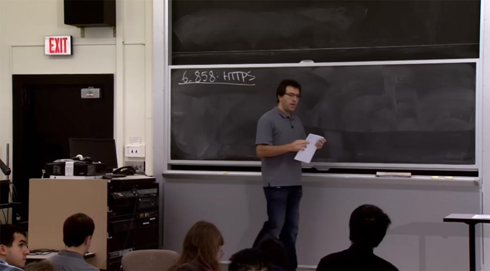

Итак, сегодня мы поговорим о том, как интернет использует криптографию для защиты сетевого соединения, и рассмотрим две тесно связанные темы.

Первая – как криптографически защищать соединения в большем масштабе, чем защищает система Kerberos, которую мы рассмотрели в последней лекции. Вторая – как интегрировать эту криптографическую защиту, предоставляемую на сетевом уровне, в целое приложение, и каким образом веб-браузер гарантирует использование защиты, которую обеспечивает криптографический протокол. Эти темы тесно связаны, поэтому получается, что защиту сетевых коммуникаций довольно легко обеспечить, потому что криптография всегда срабатывает. Но интегрировать её внутрь браузера гораздо более сложная задача, чем построить систему вокруг криптографии.

Прежде чем мы погрузимся в эту дискуссию, я хочу напомнить вам об основных элементах криптографии, которые мы будем использовать.

В последней лекции о Kerberos мы использовали симметричную криптографию, или  
шифрование и дешифрование. Её смысл в том, что у вас есть секретный ключ K и две функции. Таким образом, вы можете взять некоторый фрагмент данных, назовем его P, это обычный текст, к которому можно применить функцию шифрования, а это функция некоторого ключа K. И если вы зашифруете этот простой текст, вы получите зашифрованный текст С. Точно также у нас есть функция расшифровки D, которая использует тот же ключ K, в результате чего зашифрованный текст C превратится в простой текст P. Это тот примитив, вокруг которого был построен Kerberos.

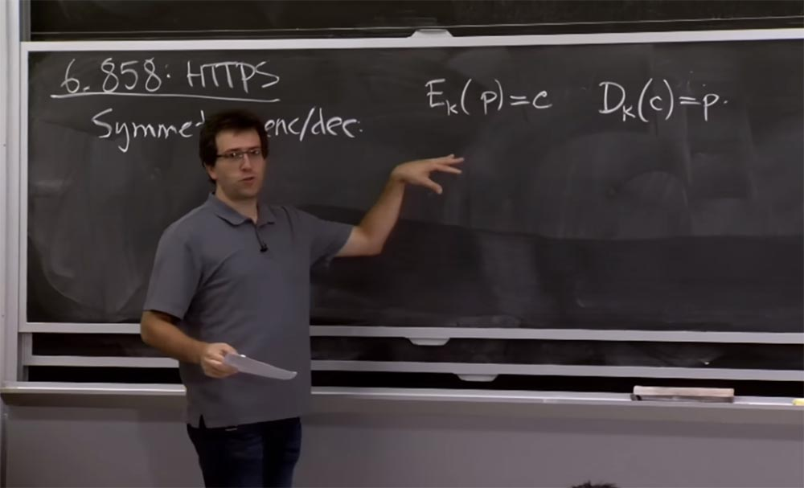

Но, оказывается, есть и другие примитивы, которые будут полезны для сегодняшней дискуссии, и которые называют асимметричным шифрованием и расшифровкой. Здесь идея состоит в том, чтобы иметь различные ключи для шифрования и дешифрования. Посмотрим, почему это так полезно.

Здесь есть функция E, которая может зашифровать определенным открытым ключом pk некую совокупность сообщений P, чтобы в результате получить зашифрованный текст C. Для того, чтобы его расшифровать функцией D, нужно просто указать соответствующий секретный ключ sk и получить исходный текст P.

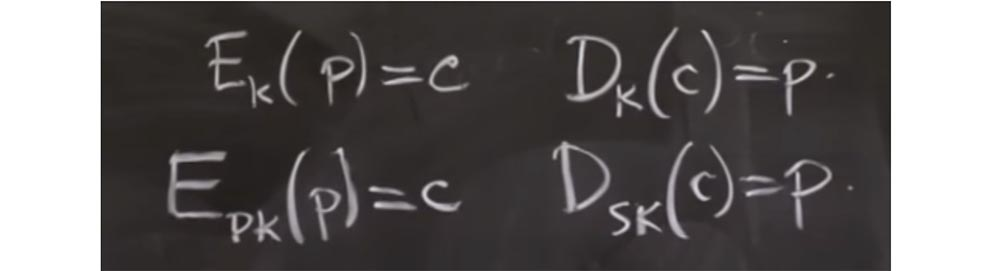

Удобство ассиметричного шифрования состоит в том, вы можете опубликовать открытый ключ в интернете, и люди смогут шифровать сообщения для вас, но вам нужен секретный ключ, чтобы расшифровать их сообщения. Сегодня мы увидим, как это используется в протоколе. На практике вы будете часто использовать криптографию с открытым ключом немного по-другому. Например, вместо шифрования и расшифровки сообщений может потребоваться подписать или проверить сообщения.

Оказывается, что на уровне реализации это связанные операции, но на уровне приложений API они могут выглядеть немного иначе. Например, вы можете подписать сообщение M вашим секретным ключом sk и получить какую-то подпись S. Затем вы можете верифицировать это сообщение с помощью соответствующего открытого ключа pk и в результате получить логический флаг, сообщающий, является ли подпись S правильной для сообщения M.

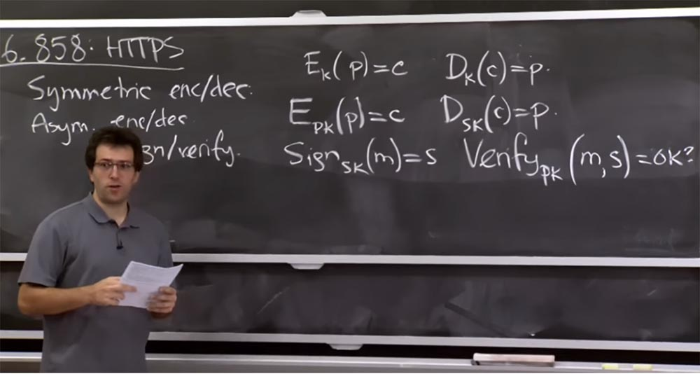

Здесь присутствуют некоторые относительно интуитивные гарантии, которые обеспечивают эти функции. Если вы, например, получили эту подпись и она верифицируется корректно, значит, она должна была быть сгенерирована кем-то с правильным секретным ключом. Это понятно?

Тогда попробуем разобраться, как можно защитить сетевые соединения в большем масштабе, чем это делает Kerberos. В Kerberos мы имели довольно простую модель, где все пользователи и серверы использовали своего рода связь с объектом KDC, который имел эту гигантскую таблицу пользователей, сервисов и их ключи. Всякий раз, когда пользователь хочет поговорить с каким-то сервером, он должен попросить KDC создать на основе этой гигантской таблицы нужный ему билет.

Таким образом, это кажется достаточно простой моделью. Так зачем же нам что-то еще? Почему Kerberos не достаточно хорош для работы с сайтами? Почему Интернет не использует исключительно Kerberos для обеспечения безопасности всех соединений?

Вы правильно ответили — потому что единственный KDC должен всем доверять, и это плохо. У вас могут возникнуть проблемы, если вы посчитаете, что некая машина абсолютно безопасна.

Возможно, люди в MIT готовы доверять кому-то в локальной сети, управляемой KDC, но не всем в Интернете.

И ответ второго студента тоже верный – очень сложно управлять таким гигантским количеством ключей. На самом деле может быть очень трудно построить единственный KDC, который сможет управлять миллиардом ключей или десятью миллиардами ключей для всех людей в мире. Ещё одна сложность использования Kerberos для всего интернета заключается в том, что все пользователи должны иметь ключ, или должны быть известны KDC. Вы даже не сможете использовать Kerberos в нашем институте для подключения к некоторым серверам, если у вас нет учетной записи в базе данных Kerberos. В то время как для всего интернета вполне разумно ожидать, что когда вы подойдете к компьютеру, то он совершенно не знает, кто вы, но позволит вам перейти на сайт Amazon, защищенный криптографией.

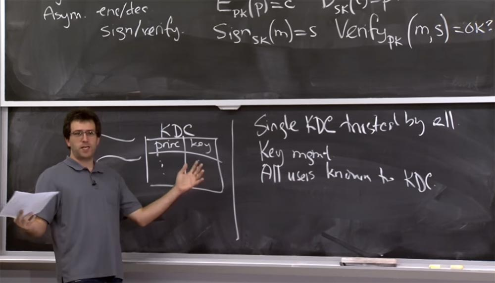

Да?

Существует несколько других вещей, которые вы ожидаете от криптографического протокола, и мы рассмотрим, как они появляются в SSL. Но идея ключа заключается в том, что это решение совершено одинаково и для Kerberos, и для SSL или TLS. Вы правы, когда упоминаете, что исходные протоколы Kerberos, о которых мы прочитали в материалах лекции, разработаны очень давно. И если мы хотим использовать их для современного интернета, то в них понадобится кое-что изменить. Какие ещё у вас имеются мысли, почему мы не должны использовать Kerberos?

Правильно, здесь имеется проблема масштабирования при восстановлении доступа, и, возможно, при регистрации новых пользователей, потому что вы должны будете лично пойти в какой-то офис аккаунтов и получить там учетную запись. Что ещё?

**Студент:** сервер Kerberos постоянно должен быть онлайн.

**Профессор:** да, это еще одна проблема. Мы перечислили своего рода вопросы управления, но на уровне протокола KDC постоянно должен быть в режиме онлайн, потому что он фактически служит посредником при любом вашем взаимодействии с сервисами. Это означает, что каждый раз, когда вы заходите на новый веб-сайт, вам нужно поговорить с KDC. Во-первых, это будет узким местом в смысле производительности. Как и другой вид масштабируемости, этот принцип приведёт к масштабируемости производительности, в то время как перечисленные выше принципы приводят только к масштабируемости управления.

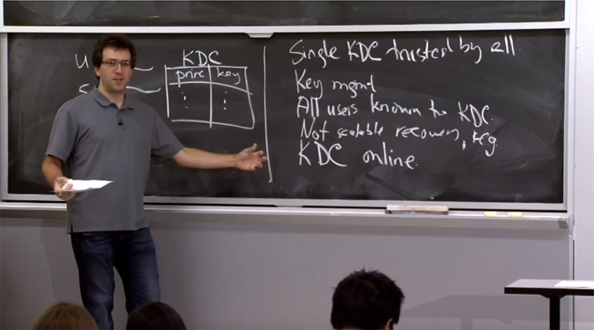

Итак, как мы можем решить данную проблему с помощью этих принципов? Идея состоит в том, чтобы использовать шифрование ключа, чтобы отказаться от использования KDC.

Давайте сначала выясним, можно ли установить безопасную связь, если вы просто знаете некоторые открытые ключи другой стороны. И тогда мы увидим, как мы подключаем версию открытого ключа KDC к аутентификации сторон в этом протоколе. Если вы не хотите использовать KDC, то вы могли бы сделать с криптографией с открытым ключом следующее: как-то узнать открытый ключ партнёра с другой стороны соединения. Так, в Kerberos, если я хочу подключиться к файловому серверу, я просто откуда-то знаю открытый ключ файлового сервера. Как первокурсник, я получаю распечатку, в которой говорится, что открытый ключ файлового сервера такой-то, и я могу использовать его для подключения.

Вы могли бы просто зашифровать сообщение для открытого ключа файлового сервера, к которому хотите подключиться. Но оказывается, что на практике эти операции с этими публичными ключами протекают довольно медленно. Они на несколько порядков медленнее работы ключей симметричного шифрования. Так что на практике обычно всегда хочется отказаться от использования публичного шифрования.

Таким образом, типичный протокол может выглядеть так. У вас есть А и В, они хотят общаться, и А знает открытый ключ В. При этом А генерирует какой-то сессионный ключ S, просто выбирая для него случайное число. Затем А собирается отправить B сеансовый ключ S, так что это похоже на Kerberos. Мы собираемся зашифровать сеансовый ключ S для B.

Если помните, в Kerberos, чтобы сделать это, нам был нужен KDC, потому что А не знал ключа для B или ему не было позволено его знать, потому что это секрет, который может знать только B. Но с публичным ключом вы можете проделать это сразу, просто зашифровав секрет с помощью этого открытого ключа Bspk, и отправить сообщение B. Теперь B может расшифровать это сообщение и сказать: мне нужно использовать этот секретный ключ. Теперь мы имеем канал связи, где все сообщения просто шифруются этим секретным ключом S.

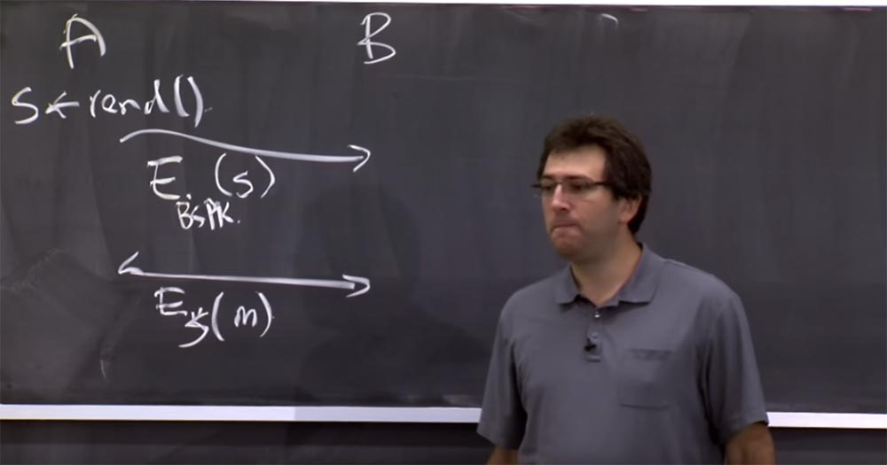

Так что в этом протоколе есть некоторые полезные свойства. Во-первых, мы избавились от необходимости иметь KDC онлайн и генерировать для нас сессионный ключ. Мы могли бы просто обеспечить конфиденциальность пересылаемой информации, если одна из сторон соединения генерирует её и затем шифрует для другой стороны без использования KDC.

Еще одна хорошая вещь — это уверенность в том, что сообщения, отправляемые от А к В, сможет прочитать только В, потому что только В может расшифровать это сообщение. Поэтому В должен имеет соответствующий секретный ключ S.

**Студент:** имеет ли значение, кто даёт этот ключ — пользователь или сервер?

**Профессор:** может быть. Я думаю, что это зависит от свойств, которые вы хотите получить от этого протокола. Поэтому что если А ошибается или использует неверную случайность, сервер, который отправляет данные назад, думает: «о, теперь это единственные данные, которые увидит А». Возможно, это будет не совсем правильно, так что вы должны об этом подумать. Существует и несколько других проблем с этим протоколом.

**Студент:** атакующий может использовать ключ для отправки повторных сообщений?

**Профессор:** да, проблема может быть в том, что я могу просто отправить эти сообщения снова, и это будет выглядеть так, словно это A опять отправляет сообщение В, и так далее.

Поэтому обычно решение этой проблемы состоит в том, что обе стороны соединения участвуют в генерации S и это гарантирует, что ключ, который мы используем, «свежий». Потому что здесь, на рисунке, на самом деле В ничего не генерирует, поэтому эти сообщения протокола выглядят каждый раз одинаково.

Обычно случается так, что одна сторона выбирает случайное число вроде S, а затем другая сторона, В, также выбирает случайное число, обычно называемое nonce. Есть два числа и ключ, который на самом деле не выбирается единолично одной стороной, это хэш, который выбрали обе стороны для совместного взаимодействия. Кроме хеша, можно использовать протокол Диффи-Хэллмана, который мы рассматривали в последней лекции, благодаря которому вы получаете секретность вначале. Это более сложная математика, чем простое хеширование двух случайных чисел, которые выбрали эти две стороны. Но тогда вы получите такое хорошее свойство, как изначальный общий секретный ключ, исключающий необходимость передачи ключа расшифровки при передаче зашифрованных данных.

Таким образом, избежать повторные атаки можно следующим образом. В генерирует nonce и затем устанавливает настоящий секретный ключ S’, который используется для хеширования секретного ключа S с этим nonce. И, конечно, В должен был бы отправить nonce обратно A, чтобы выяснить, что происходит, когда они оба договариваются о ключе.

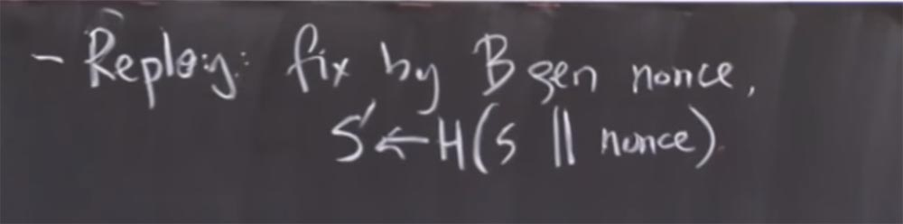

Еще одна проблема состоит в том, что здесь нет настоящей аутентификации A. A знает, кто такой В, или, по крайней мере, знает, кто сможет расшифровать данные. Но B понятия не имеет, кто находится на другой стороне, будь то какой-то противник, выдающий себя за другого, или кто-то ещё. Как это можно исправить в мире открытого ключа?

Есть несколько способов, как это сделать. Одна из возможностей — изначально подписать это сообщение, потому что у нас есть этот хороший принцип Sign. Так что мы могли бы, возможно, подписать это секретным ключом. Этот Sign просто предоставляет подпись, но предположительно, его назначаете вы, и вы также предоставляете это сообщение.

Тогда В должен знать, что А является открытым ключом, чтобы верифицировать подпись. Но если B знает, что А является открытым ключом, тогда B будет достаточно уверен, что А является именно тем, кто отправил это сообщение.

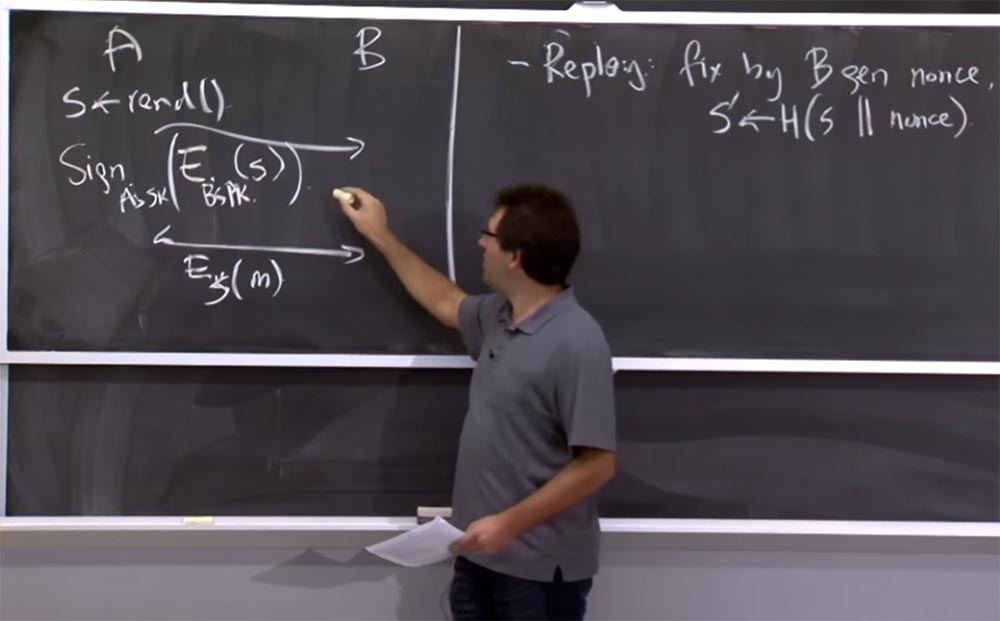

Еще одна вещь, которую вы могли бы сделать, это довериться шифрованию. Так что, возможно, B может отправить nonce обратно A, зашифровав его открытым ключом, предоставленным A. И тогда только A сможет расшифровать nonce и генерировать финальный сеансовый ключ S’. Так что есть несколько трюков, которые вы могли бы проделать. Примерно так работают сегодня клиентские сертификаты в интернет-браузерах.

Таким образом, у A есть секретный ключ, и поэтому, когда вы получаете личный сертификат MIT, ваш браузер создает долгоживущий секретный ключ и получает для него сертификат. И всякий раз, когда вы отправляете веб-серверу запрос, вы доказываете тот факт, что знаете секретный ключ своего пользовательского сертификата, и затем устанавливаете секретный ключ S для остальной связи.

Это проблемы, которые достаточно просто исправляются на уровне протокола. Однако основой для всего вышесказанного является то, что все стороны знают открытые ключи друг друга. Как же вы можете узнать чей-то публичный ключ? Допустим, я хочу подключиться к веб-сайту, у меня есть URL-адрес, к которому я хочу подключиться, или имя хоста, как мне узнать, какой публичный ключ ему соответствует?

Аналогично, если я подключаюсь к серверу MIT, чтобы посмотреть мои оценки, откуда сервер знает, каким должен быть мой открытый ключ, чтобы отличить его от открытого ключа другого студента MIT?

Это главная проблема, которую рассматривал KDC. Фактически KDC решал для нас две проблемы. Во-первых, он генерировал сообщение (Ebspk (S)), создавал сеансовый ключ и шифровал его для сервера. Сейчас мы исправили это, создав криптографию с открытым ключом. Но нам также нужно было выполнить сопоставление главных строковых имен криптографическим ключам Kerberos, предоставленным нам ранее.

Для подобных вещей в мире HTTPS имеется протокол TLC. Его смысл заключается в том, что мы по-прежнему будем полагаться на некоторые стороны процесса, поддерживающие эти гигантские таблицы, которые сопоставляют имена участников процесса с криптографическими ключами. План состоит в том, что у нас будет нечто, называемое центром сертификации, который обозначается буквами CA во всех видах литературы по сетевой безопасности. Этот CA также логически поддерживает таблицу, в одной части которой отображаются имена всех участников, а в другой – соответствующие им публичные ключи. Главное отличие этого центра от Kerberos состоит в том, что этот центр сертификации CA не обязательно должен находиться онлайн для всех транзакций.  
В Kerberos для того, чтобы соединиться с кем-то или найти чей-то ключ, вам нужно поговорить с KDC. Вместо этого в мире CA поступают таким образом.

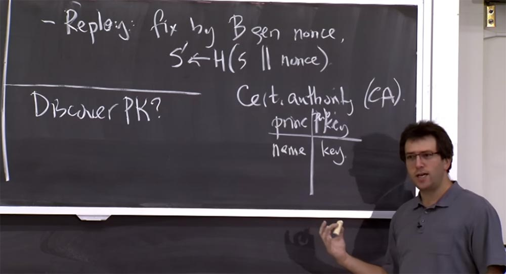

Если у вас есть какое-то имя name здесь и соответствующий ему ключ key в другой части таблицы, то центр сертификации собирается просто подписать сообщения о том, что в этой таблице существуют определенные строки. Таким образом, центр сертификации должен будет иметь здесь свой собственный секретный и открытый ключи. Он будет использовать секретный ключ, чтобы найти сообщения для других пользователей в системе, на которых можно положиться.

Так что если у вас есть запись «имя+ключ» в базе данных CA, то CA создаст сообщение, что это имя соответствует этому открытому ключу, и подпишет это сообщение своим секретным ключом CA.

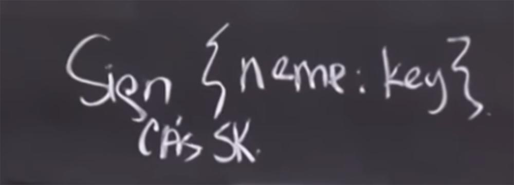

Это позволяет делать вещи, очень похожие на то, что делает Kerberos, но при этом мы избавляемся от необходимости нахождения CA онлайн для всех транзакций. И, это на самом деле будет гораздо более масштабируемым. Это именно то, что обычно называют сертификатом. Масштабируемость обеспечивается тем, что для клиента или кого-либо ещё, пользующегося этой системой, сертификат, предоставленный из одного источника, не уступает сертификату из любого другого источника. Он подписан секретным ключом центра сертификации. Так что вы можете проверить его подлинность без необходимости фактически связываться с центром сертификации или любой другой указанной здесь стороной.

Это работает так. Сервер, с которым вы хотите поговорить, хранит сертификат, который он первоначально получил от центра сертификации. И всякий раз, когда вы подключаетесь к нему, сервер говорит вам: «хорошо, вот мой сертификат. Он был подписан этим CA. Вы можете проверить подпись и просто убедиться, что это мой открытый ключ, и что это мое имя».

С другой стороны, то же самое происходит и с сертификатами клиентов. Когда пользователь подключается к веб-серверу, его сертификат клиента говорит о том, что ваш открытый ключ соответствует секретному ключу, который был изначально сгенерирован в браузере. Таким образом, при подключении к серверу, вы собираетесь представить сертификат, подписанный центром сертификации MIT, в котором указано, что ваше имя пользователя соответствует этому открытому ключу. Таким образом сервер может убедиться, что сообщение, подписанное вашим секретным ключом, доказывает, что к нему подключается правильный пользователь Athena.

**Студент:** где работает регистратор, у которого можно получить сертификат аутентификации?

**Профессор:** да, это как вопрос типа того, что было раньше – курица или яйцо, или где вы получаете эти открытые ключи? В какой-то момент вам нужно жестко закодировать их, это, как правило, то, что делает большинство систем. Когда вы загружаете веб-браузер или получаете компьютер в первый раз, он фактически приходит с сотнями открытых ключей этих центров сертификации. Их существует огромное количество. Некоторые управляются такими компаниями по сетевой безопасности, как VeriSign. US Postal Service по некоторым причинам тоже имеет свой CA, так как существует множество сетевых сущностей, которые участвуют в системе и которым нужно выдать на это сертификат. Таким образом, множество CA формируют доверие, которое мы бы имели в единственном KDC.

Собственно говоря, фактически мы не рассмотрели все проблемы, связанные с Kerberos. Так, мы не рассмотрели вопрос, как миллиарды людей в мире смогут доверять единственному компьютеру KDC. Однако на самом деле сейчас ситуация ещё хуже, потому что вместо доверия одной машине KDC, теперь все доверяют этим сотням центров аутентификации, потому что все они равноценны друг другу. Любой из них может подписать сообщение подобного типа, и оно было бы принято клиентами как правильное утверждение того, что этот участник системы имеет этот открытый ключ. Так что теперь злоумышленнику будет достаточно взломать только один из этих CA вместо того, чтобы взламывать KDS.

**Студент:** есть ли механизм для отзыва ключей?

**Профессор:** да, это еще одна проблема. Как известно, если вы облажались, то можете сказать KDC, чтобы он перестал выдавать ваш ключ или заменил его новым. Но сертификаты действительны вечно, поэтому типичное решение двояко. С одной стороны, предполагается, что эти сертификаты имеют время действия. Таким образом, вы можете, по крайней мере, ограничить ущерб. Это вроде как время жизни билета Kerberos, только на несколько порядков длительнее. В Kerberos время жизни билета может быть пару часов, а сертификат действует год или пару лет. Таким образом, СА действительно не хотят, чтобы с ними общались слишком часто. Так что вы платите деньги, получаете годовой сертификат в виде кучки подписанных байтов, и обращаетесь за ними снова только через год. Это хорошо для масштабируемости, но не хорошо для безопасности.

Есть две проблемы, которые могут вас беспокоить в связи с сертификатами. Одна это то, что возможно, CA облажался и выдал сертификат на неправильное имя из-за того, что не был достаточно осторожен. Например, я прошу их дать мне сертификат на amazon.com, и они не проверяют существование такого сайта и выдают мне сертификат на amazon.com. Это проблема на стороне CA, который совершил ошибку и выдал неправильный сертификат. Таким образом, вы можете преждевременно отозвать сертификат по причине того, что он больше не существует, так как вы подписали неправильную вещь.

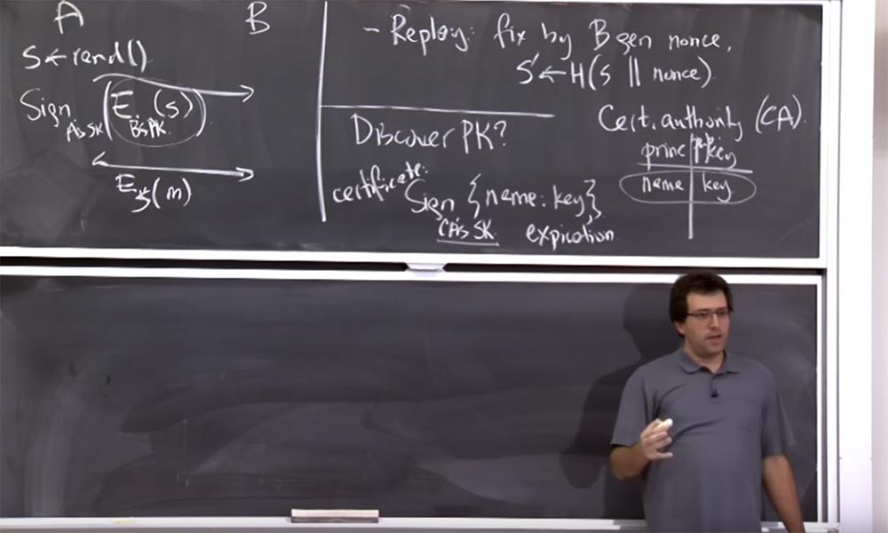

Вторая проблема состоит в следующем. Предположим, CA выдал правильный сертификат, но после этого человек, получивший этот сертификат, случайно раскрыл секретный ключ, или у него кто-то украл секретный ключ, соответствующий открытому ключу в сертификате. Это означает, что сертификат больше не свидетельствует о том, что имя конкретного пользователя совпадает с конкретным ключом. Даже если кто-то утверждает, что это ключ сайта amazon.com, на самом деле любой сайт может иметь точно такой же ключ, потому что кто-то разместил его в интернете в открытом доступе.

Таким образом, вы не сможете доверять кому-то, кто отправляет вам сообщение, подписанное соответствующим секретным ключом, потому что это может быть кто угодно, кто украл секретный ключ. Это еще одна причина, по которой вы можете отозвать сертификат. Но отзыв сертификатов довольно «грязная» процедура, и на самом деле, это отнюдь не лучший план.

Существуют две альтернативы, которыми люди пытались воспользоваться. Во-первых, они постарались опубликовать список всех отозванных в мире сертификатов под названием CRL, Сertificate Revocation List. Это работает таким образом. Каждый центр аутентификации ведёт список выданных сертификатов, помечая где-то в стороне ошибки, связанные с этими сертификатами. Например, он выясняет, что выдал сертификат не на то имя, или к нему обращается клиент и говорит: «эй, ты выдал мне сертификат, все шло отлично, но потом кто-то взломал мой компьютер и украл приватный ключ. Так что сообщи всему миру, что мой сертификат больше не годится».

Таким образом, этот центр сертификации, в принципе, может добавить материал в CRL, а клиенты, такие как web-браузеры, должны периодически загружать этот CRL. Затем, когда им предоставляют какой-либо сертификат, они должны проверить, нет ли его в списке отозванных сертификатов. И если он там присутствует, браузер должен сообщить, что данный сертификат не годится, поэтому вам лучше предоставить новый сертификат, потому что он больше не собирается доверять сообщениям, подписанным с помощью этого сертификата.

В этом заключается один план, и он не слишком хорош. Потому что если его действительно использовать, то это был бы поистине гигантский список. И у всех в мире будет слишком много накладных расходов, чтобы его загрузить. Другая проблема заключается в том, что никто на самом деле не собирается поддерживать этот список в актуальном состоянии. Если вы запросите у СА такой список, большинство из них предоставит вам просто пустой CRL, потому что никто и никогда не удосужился добавить что-либо в этот список.

Считается, что зачем он вам? Ведь он только уменьшит число соединений, которые могли бы быть успешными. Поэтому неясно, насколько велика мотивация для СА поддерживать CRL в актуальном состоянии.

Вторая альтернатива заключается в том, чтобы люди смогли посылать запросы СА онлайн, так же, как это происходит в мире Kerberos, где мы постоянно связываемся с KDC. В мире CA отошли от этой практики и решили, что СА будет подписывать сертификаты только раз в год. Поэтому существует альтернативный протокол, называемый «онлайн протоколом проверки статуса SSL сертификатов», или OCSP. Этот протокол отталкивает нас от мира CA к миру KDC. Всякий раз, когда клиент получает сертификат, ему интересно, является ли этот сертификат действительным, ведь несмотря на то, что его срок действия ещё не истёк, что-то всё равно могло пойти не так. Так вот, используя протокол OCSP, вы можете связаться с сервером и просто сказать: «эй, я получил этот сертификат. Как вы думаете, это все еще в силе»? Таким образом, этот протокол просто перекладывает обязанность поддерживать CRL на определенный сервер. Поэтому вместо того, чтобы загружать весь список самостоятельно, вы попросите сервер проверить этот сертификат. Это еще один план, который люди попытались использовать, но он также не получил широкого распространения по двум причинам.

26:30 мин

[Курс MIT «Безопасность компьютерных систем». Лекция 14: «SSL и HTTPS», часть 2](https://habr.com/company/ua-hosting/blog/427785/)

Полная версия курса доступна [здесь](https://ocw.mit.edu/courses/electrical-engineering-and-computer-science/6-858-computer-systems-security-fall-2014/).

Спасибо, что остаётесь с нами. Вам нравятся наши статьи? Хотите видеть больше интересных материалов? Поддержите нас оформив заказ или порекомендовав знакомым, **30% скидка для пользователей Хабра на уникальный аналог entry-level серверов, который был придуман нами для Вас:** [Вся правда о VPS (KVM) E5-2650 v4 (6 Cores) 10GB DDR4 240GB SSD 1Gbps от $20 или как правильно делить сервер?](https://habr.com/company/ua-hosting/blog/347386/) (доступны варианты с RAID1 и RAID10, до 24 ядер и до 40GB DDR4).

**VPS (KVM) E5-2650 v4 (6 Cores) 10GB DDR4 240GB SSD 1Gbps до декабря бесплатно** при оплате на срок от полугода, заказать можно [тут](https://ua-hosting.company/vpsnl).

**Dell R730xd в 2 раза дешевле?** Только у нас **[2 х Intel Dodeca-Core Xeon E5-2650v4 128GB DDR4 6x480GB SSD 1Gbps 100 ТВ от $249](https://ua-hosting.company/serversnl) в Нидерландах и США!** Читайте о том [Как построить инфраструктуру корп. класса c применением серверов Dell R730xd Е5-2650 v4 стоимостью 9000 евро за копейки?](https://habr.com/company/ua-hosting/blog/329618/)